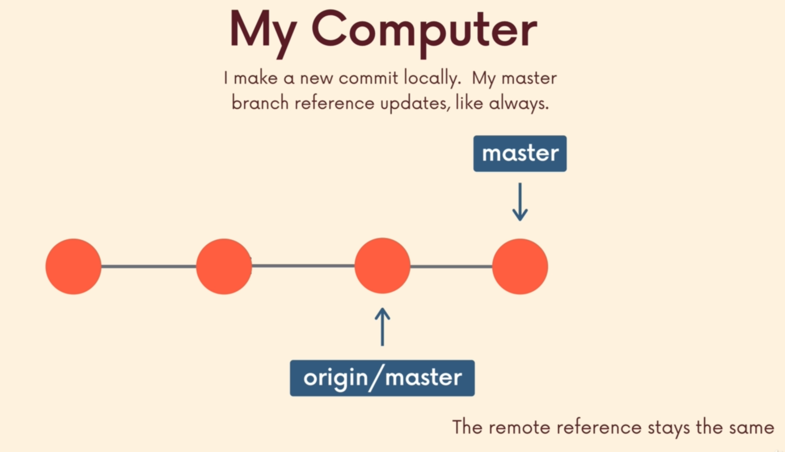
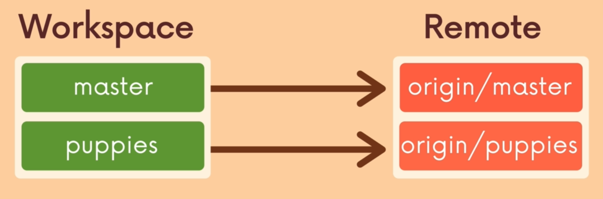
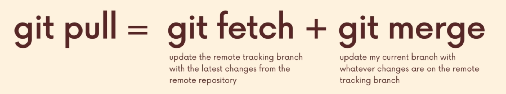
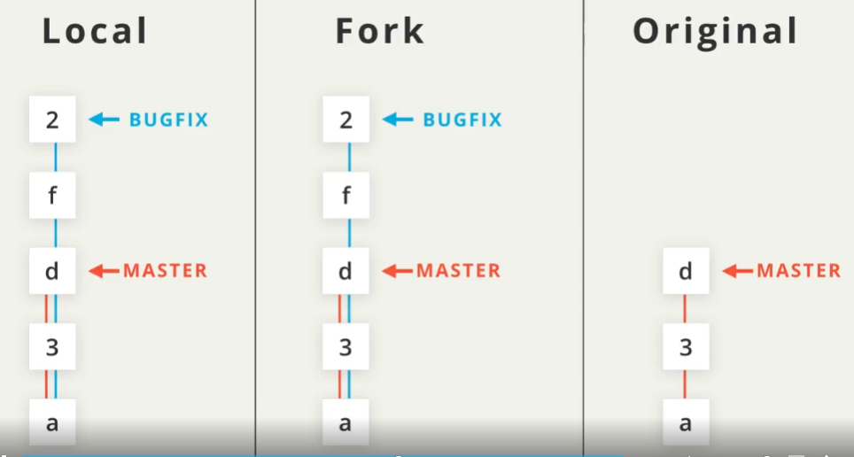
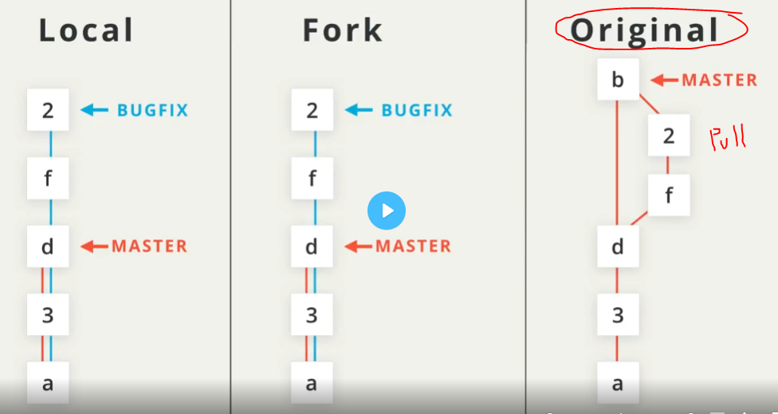
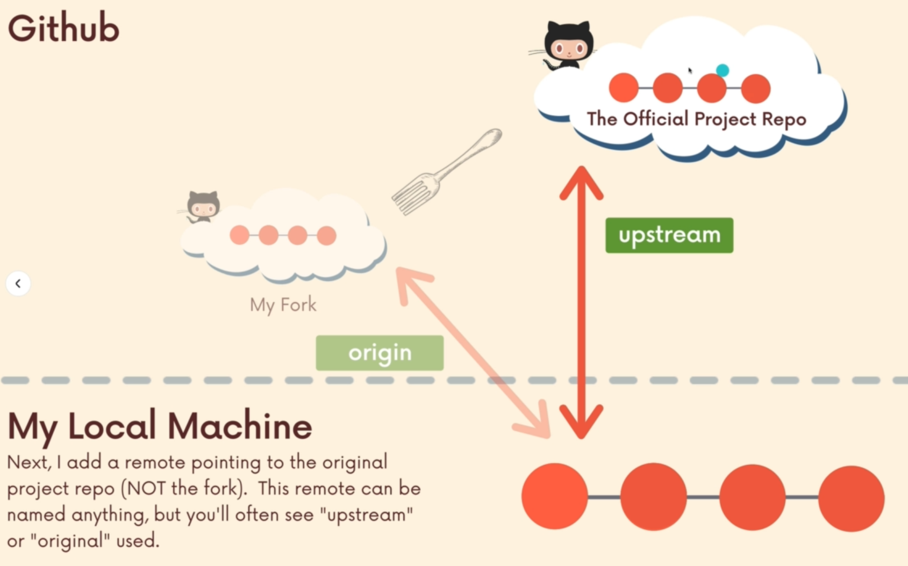
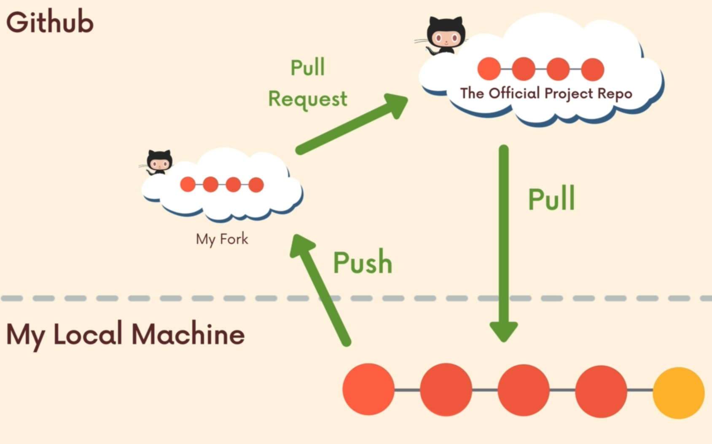
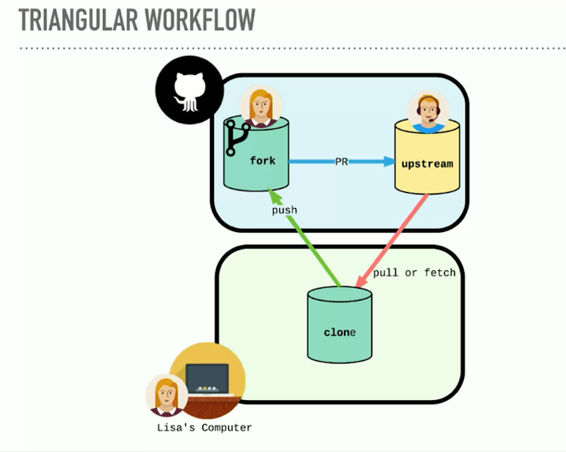
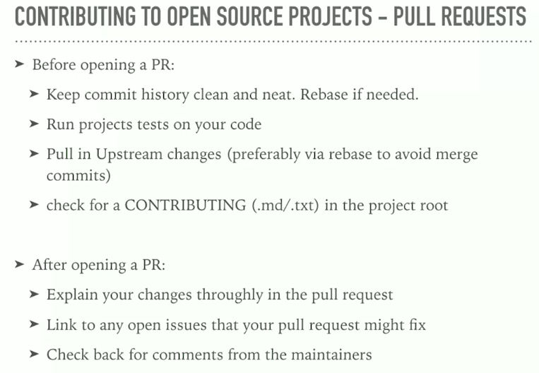
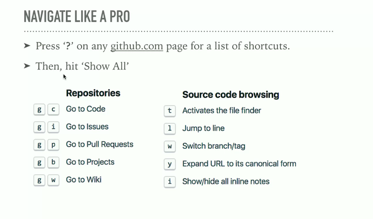

# INDEX

- [INDEX](#index)
  - [configuration](#configuration)
  - [Github workflow](#github-workflow)
  - [Working With Remotes](#working-with-remotes)
    - [Remote Tracking Branch](#remote-tracking-branch)
    - [Sending Commits (pushing)](#sending-commits-pushing)
      - [Push](#push)
      - [Pushing code explicitly](#pushing-code-explicitly)
    - [Pulling/fetching Changes](#pullingfetching-changes)
      - [`Git fetch`](#git-fetch)
      - [`Git pull`](#git-pull)
    - [Forking a Repository](#forking-a-repository)
  - [Git Collaboration Workflows](#git-collaboration-workflows)
    - [Centralized workflow](#centralized-workflow)
    - [Feature Branches workflow](#feature-branches-workflow)
    - [Fork \& Clone workflow](#fork--clone-workflow)
      - [Include Upstream Changes to Stay In Sync](#include-upstream-changes-to-stay-in-sync)
        - [Triangular workflow](#triangular-workflow)
  - [Pull Request](#pull-request)
    - [Contributing to Open source projects](#contributing-to-open-source-projects)
  - [Notes](#notes)
    - [Github shortcuts](#github-shortcuts)

---

## configuration

```bash
git config --global user.name "user"
git config --global user.email "user@example.com"
```

---

## Github workflow

Github is a **Hosting Service** that hosts Git-repositories in the cloud and makes it easier to collaborate with other people.

- It's not correct to say that "Github is Git but on the web" as Git can do things that Github can't do and vice versa


---

## Working With Remotes

- the word `origin` is not special, it's just the default (conventional) name that's used when you git clone a remote repository for the first time.

- `git remote` command is used to create and manage remote repositories.

- `git remote -v` displays both the:

  - shortname for the remote -> usually `"origin"`
  - URL for the remote repo (ex: on github)

- `git remote add` is used to add a connection to a new remote (repository on the cloud).

  - it's a command to create a connection from my local repository to the remote repository in github

  ```sh
  # git remote add <name> <url>
  git remote add origin https://github.com/richardkalehoff/RichardsFantasticProject.git
  ```


---

### Remote Tracking Branch

`origin/master` is called a **Remote tracking branch**.

- So the tracking branch `origin/master` is telling us that the remote "origin" has a master branch that points to commit 9b7d28f (and includes all of the commits before 9b7d28f).
- **Remote Tracking Branch**: is a reference to the state of the master branch on the remote, it's like a bookmark pointing to the last known commit on the master branch on `origin`
  
- this is the reason why we get this message:
  - `your branch is ahead of 'origin/master' by 1 commit`
- Working with remote branches:

  - create a new local branch from the remote branch of the same name:

    ```sh
    git switch <remote branch-name> # makes a local branch and sets it up to track the remote branch "origin/branchName"
    ```

  

---

### Sending Commits (pushing)

- The `git push` command takes:

  - the shortname of the remote repository you want to send commits to
    - recommended as if you have more than 1 remote branch connected to the local repo, then you need to specify the remote branch to push to
  - The name of the branch that has the commits you want to send
    - usually the name of the remote branch is `origin`

```bash
# send commits from a local repository to a remote repository.
git push <remote-shortname> <The branch we are pushing up>
# or
git push origin master
```

#### Push

| GIT Push                                                                                                         | GIT Push origin                                                              |
| ---------------------------------------------------------------------------------------------------------------- | ---------------------------------------------------------------------------- |
| The remote repository is the origin                                                                              | The remote repository is not defined                                         |
| We assume that remote repository is already defined and The work is implicitly pushed into the remote repository | In this, it has to be specified explicitly to be pushed into the repository. |
| only for one repository                                                                                          | It can be used with single as well as multiple repositories                  |

---

#### Pushing code explicitly


- when you `push` -> **Always** specify `where` you push

---

---

### Pulling/fetching Changes

> 
> So, I have to use **git (pull or push)** to make them catch-up like this:
> 


---

#### `Git fetch`


`git fetch` is used to retrieve commits from a remote repository's branch but **it does not automatically merge the (our local branch) with the changes from (remote tracking branch) after those commits have been received**.

- instead, it brings them to our local snapshot of the (remote tracking branch), so that now I have those changes on my machine, but if I want to see them I have to checkout `origin/master`, and my local branch is untouched!
- It only updates the remote-tracking-branches

```bash
# retrieve the commits from the master branch on the origin remote repository.
git fetch origin master

# then if you want to see what is fetched go to the origin/branch
git checkout origin/branchName
```

- You can think of `git fetch` as half of a `git pull`. The other half of `git pull` is the merging aspect.

---

#### `Git pull`

it's a command we use to retrieve changes from a remote repository. unlike `fetch`, pull actually updates our HEAD branch with whatever changes are retrieved from the remote


```bash
# retrieve the commits from the master branch on the origin remote repository.
git pull origin master

# from the current branch
git pull
```

---

### Forking a Repository

In version control terminology if you `fork` a repository that means you duplicate it. Typically you fork a repository that belongs to someone else. So you make an identical copy of their repository and that duplicate copy now belongs to you.

- This concept of "forking" is also different from "cloning".

  - When you clone a repository, you get an identical copy of the repository. But cloning happens on your local machine and you clone a remote repository.
  - When you fork a repository, a new duplicate copy of the remote repository is created. This new copy is also a remote repository, but it now belongs to you.

- Forking is an action that's done on a hosting service, like GitHub.

---

## Git Collaboration Workflows

### Centralized workflow

- It's when everyone works on `Master/main` (one single branch)
- it's the simplest collaborative workflow
- this leads to some serious issues on teams:
  - lots of time spent resolving conflicts and merging code
  - no one can work on anything without disturbing the main codebase
  - the only way to collaborate on a experimental-feature together with another teammate is to push incomplete code to master, (other teammates now will have broken code)

---

### Feature Branches workflow

Rather than working directly on `master/main`, all new development should be done on separate branches

- Treat `master/main` branch as the official project history
- multiple teammates can collaborate on a single feature and share code back and forth without polluting the `master/main` branch
- `master/main` branch won't contain broken code
  - as feature branches are merged to `master/main` with [Pull Requests](#pull-request) after code-review & testing

---

### Fork & Clone workflow

Github (and similar tools) allow us to create personal copies of other peoples' repositories, we call these copies a **fork** of the original

- This is used a lot when contributing to **open-source projects**
- > forking is not a Git feature, the ability to fork is implemented by Github

When working with a project that you've forked. The original project's maintainer will continue adding changes to their project. You'll want to keep your fork of their project in sync with theirs so that you can include any changes they make.




---

#### Include Upstream Changes to Stay In Sync

> This is called -> **Fork & Clone** workflow
>
> - upstream -> push
> - downstream -> pull

- The **upstream** repository is the base repository you created a fork from
  - this isn't set up by default, you need to set it up manually
- by adding the **upstream** remote, you can pull down changes that have been added to the original repository after you forked it.



- adding second remote referring to `upstream`:

  ```sh
  # git remote add upstream <url of original repo>
  git remote add upstream https://github.com/richardkalehoff/RichardsFantasticProject.git
  ```



##### Triangular workflow



- To stay up to date and get commits from a source repository into your forked repository on GitHub you need to:

  - get the cloneable URL of the source repository

  - create a new remote with the `git remote add` command

    - use the shortname `upstream` to point to the source repository

  - fetch the new `upstream` remote

  - merge the `upstream`'s branch into a local branch

  - push the newly updated local branch to your origin repo

---

## Pull Request

A pull request is a request to the original or source repository's maintainer to include changes in their project that you made in your fork of their project. **You are requesting that they pull in changes you've made**.

- they provide a mechanism to approve or reject the work on a given branch, they also help facilitate discussion and feedback on the specified commits
- there might be **protection rules** to a branch like `master/main`
- > it's a feature built in to products like **Github & Bitbucket &...** and not native to Git itself


---

### Contributing to Open source projects



---

## Notes

- Difference between cloning `HTTPS` vs `SSH`

  - `HTTPS` cloning requires password every time you push or pull
  - `SSH` cloning uses the SSH key to authenticate, so you don't need to enter your password every time

- `Assign yourself`

  - When you’re assigned to an issue or pull request, it tells repository visitors and contributors that you'll be facilitating the conversation or task

- in `Github desktop` you can select things to commit instead of making all the changes in one commit
  - to do this : `Highlight the lines you want`

---

### Github shortcuts


