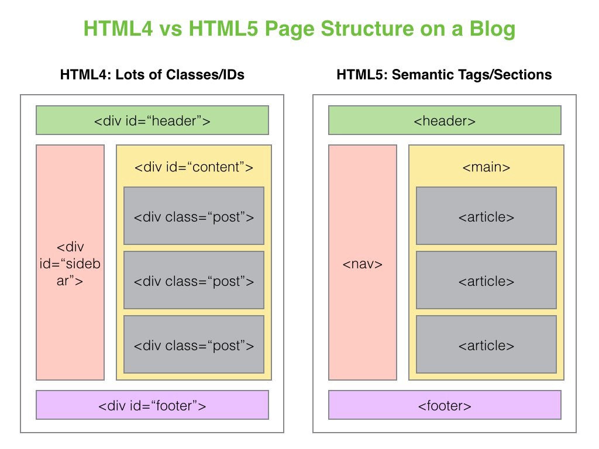
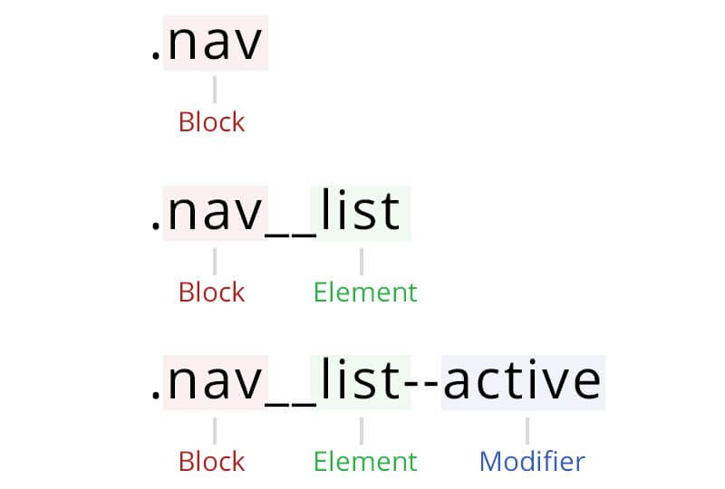
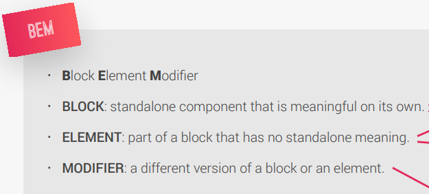

## INDEX

- [INDEX](#index)
- [Static vs Dynamic websites](#static-vs-dynamic-websites)
- [HTML](#html)
- [Semantic HTML](#semantic-html)
  - [Why ?](#why-)
  - [Semantic tags](#semantic-tags)
- [some inline elements to be aware of:](#some-inline-elements-to-be-aware-of)
- [tricks](#tricks)
- [Files-Architecture](#files-architecture)
- [Form](#form)
- [Accessibility & Performance](#accessibility--performance)
  - [images](#images)
    - [`fav-icon`](#fav-icon)
    - [background img in css](#background-img-in-css)
    - [image size optimization](#image-size-optimization)
- [DOM (document object model)](#dom-document-object-model)
- [Notes](#notes)

---

## Static vs Dynamic websites

| Static                 | Dynamic                                                            |
| ---------------------- | ------------------------------------------------------------------ |
| files are already done | files need to be generated by an application running on the server |

---

## HTML

- **HyperText** is a form of text in which documents can refer(link) to other documents and resources
- **void(empty) element** is html element with no contents and no closing tag
- **Head element** is for things that are not visible in the browser window or things that descripe the document
- **Body element** is for things that are visible in the browser window
- **DOCTYPE** let the browser know that we are using html in this file, without it the browser will go to `Quirks mode`
- `<meta charset="UTF-8">` is as the letters we use in the English language
- **Attribute** is a piece of data used to descripe elements
- **href** : HyperText Reference
- **HTML Entity** is symbols that start with `&` ex: _copyright_[&copy;], _non-breaking space_[&nbsp;]
  - find more here: [html entities](https://www.w3schools.com/html/html_entities.asp)

---

## Semantic HTML

A semantic element clearly describes its meaning to both the browser and the developer.

> **Semantic elements = HTML-code (elements) with meaning**

- Examples of non-semantic elements: `<div>` and `<span>` - Tells nothing about its content.
  - Examples of semantic elements: `<form>, <table>`, and `<article>`

Writing Semantic HTML means that tags are never chosen based on the way they appear in a web browser, instead, they’re chosen based on the importance and structure of the content.

> We shouldn’t use `<h1>` just because of its large text size. The same goes for other HTML elements. HTML should be coded to represent the data that will be populated with and not based on its default style.

---

### Why ?

Why do we need to tell the browser what our HTML elements represent?

- **SEO**

  - For example, keywords enclosed in an `<h1>` tag are given more importance than those enclosed in an `<p>`. By putting your most important keywords higher up in the hierarchy, you’re effectively telling search engines what your page is about and why people searching for those keywords would be interested in your content, hence improving the Search Engine Optimization of your page.

- **Accessibility**

  - Because semantic HTML uses elements for their given purpose, it’s easier for both people and machines to read and understand it. Making applications accessible not only ensures equal access for people with disabilities but also benefits people without disabilities by allowing them to customize their experiences. Creating a clear hierarchy for the page allows other tools and devices to properly serve up your content.

- **Easy Maintenance**
  - makes it easier to maintain the code and have a well-organized code.

---

### Semantic tags




---

## some inline elements to be aware of:

> inline elements in HTML aren't effected by [width/height] properties

- `<mark>`
- `<br>`
- `<a>`
- ``
- `<span>`

---

## tricks

- to make link go to other tab and not the current one, use the **target** attribute : `target="_blank"`
- to check if your HTML syntax is right => [HTML validation](https://validator.w3.org/)
- `&nbsp;` will add more whiteSpace to a line but won't break it.
- use `<span>` to isolate part of a paragraph
- to link label to input form => use `id='nameofID'` in the `<input>` element,`for='nameofID'` in the `<label>` element
- in `<input>`
  - **radio** => for only one option
  - **checkbox** => for one/more options
- in FORM when choosing option or inserting input field => what is sent is what in the **value** attribute

---

## Files-Architecture

- **BEM** (Block - Element - Modifier)
  
  

- also you can use `helper class` which is used when you have an item that is used many times but in one place of its use we want to add a css-property to it 'like margin-right-small'

  ```html
  <a href="#" class="btn btn--full margin-right-sm">click here!</a>
  ```

  ```css
  /* HELPER/SETTINGS CLASSES */

  .margin-right-sm {
    margin-right: 1.6rem !important;
  }

  .margin-bottom-md {
    margin-bottom: 4.8rem !important;
  }

  .center-text {
    text-align: center;
  }
  ```

---

## Form

- you can use [netlify](https://docs.netlify.com/forms/setup/?_ga=2.17094910.693790722.1649686633-761975974.1648039605) to manage your forms without `Js` => by inserting `name` attribute to each `input` element and writing this at at the `form` element:
  ```html
  <form class="cta-form" name="sign-up" netlify></form>
  ```

---

## Accessibility & Performance

[LightHouse](https://developers.google.com/web/tools/lighthouse) => but note that you should do it when it's deployed on a real server and not offline in your pc (local server)

- use `meta` tags
- use `descriptive`

---

### images

#### `fav-icon`

[website for doing all this](https://www.favicon-generator.org/)

- use `fav-icon` for **Browsers** and make sure to resize it to **64px**
- for `apple` --> use resized favicon

- for `android` :

  - create `manifest.webmanifest` file which contains this code :

  ```webmanifest
  {
    "icons": [
      { "src": "img/favicon-192.png", "type": "image/png", "sizes": "192x192" },
      { "src": "img/favicon-512.png", "type": "image/png", "sizes": "512x512" }
    ]
  }
  ```

  - also add this to `html` `<head>`

    ```html
    <link rel="manifest" href="manifest.webmanifest" />
    ```

---

#### background img in css

- when you use **background img** in css and want it to be `Accessible` in `HTML` to write `alt` for screen readers

  - `role` describes the role of an element in programs that can make use of it, such as screen readers or magnifiers.

  - `aria-label` attribute defines a string value that labels an interactive element.
  - in `HTML` :

    ```html
    <div class="cta-img-box" role="img" aria-label="Womanenjoying food"></div>
    ```

  - in `CSS` :
    ```css
    .cta-img-box {
      background-image: url("../img/eating.jpg");
      background-size: cover;
    }
    ```

---

#### image size optimization

- to reduce size of images => [squoosh](https://squoosh.app/) and use the `webp` format

  - but check `compatibility` with browsers **or** use it with `fallback img` and let the browsers choose by itself.

```html
<picture>
  <source srcset="img/hero.webp" type="image/webp" />
  <source srcset="img/hero-min.png" type="image/png" />

  <!-- browser will choose which src it can display and displays it in the  element below -->

  
</picture>
```

---

## DOM (document object model)

Here the **Tree structure** is the operation that make html code looks the way it does on the browser(rendered)

---

## Notes

- **hero**: is first section of the page that we want the user to focus on (the headline)
