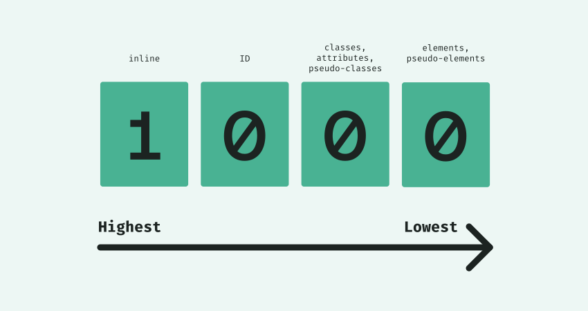
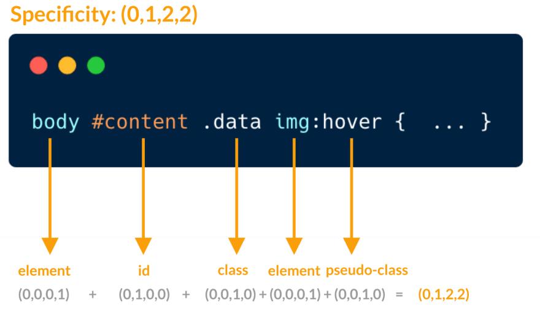

## INDEX

- [INDEX](#index)
- [styling Types](#styling-types)
- [selectors](#selectors)
  - [css selector specificity](#css-selector-specificity)
- [styling (hyperlinks / buttons)](#styling-hyperlinks--buttons)
- [Box Model](#box-model)
- [Display](#display)
- [Text - Font](#text---font)
- [Box Shadow](#box-shadow)
- [images](#images)
- [LAYOUTS](#layouts)
  - [Float](#float)
  - [Flexbox](#flexbox)
  - [GRID](#grid)
- [Variables](#variables)
- [icons / SVG](#icons--svg)
- [Animation / transition](#animation--transition)
- [data attributes](#data-attributes)
- [Form](#form)
- [media queries](#media-queries)
- [Scrolling](#scrolling)
- [Saas](#saas)

---

## styling Types

1. inline style
2. internal style
3. external style

---

## selectors

- Type(element) selectors => p,div,..
- Class selectors
- ID selectors
- decendant selectors => selector in a selector, ex: `p em`
- **Examples** from [reference](https://www.w3schools.com/cssref/css_selectors.asp)

  - `.name1.name2` => Selects all elements with both name1 and name2 set within its class attribute
  - `p.intro` => Selects all `<p>` elements with class="intro"
  - `div > p` => Selects all `<p>` elements where the parent is a `<div>` element (direct child)
  - `div + p` => Selects the first `<p>` element that is placed **immediately** after `<div>` elements
  - `p ~ ul` => Selects every `<ul>` element that is preceded by a `<p>` element (siblings)
  - `[target]` => Selects all elements with a target attribute
  - `:not(p)` => Selects every element that is not a `<p>` element
  - `:nth-child(n)` => [nthmaster](http://nthmaster.com/)

### css selector specificity




---

## styling (hyperlinks / buttons)

Always use these (pseudo classes) with `<a>`, `<button>` elements:

- `a:link` => `<a>` that have link in its **href**
- `a:visited` => `<a>` that has been clicked on
- `a:hover` => `<a>` when we are **hovering**
- `a:active` => `<a>` when we are **clicking**

---

## Box Model

- margin can be negative as it's related to the surrounding elements and not the element itself
- **auto margin trick**: 
- **outline** is outside of the margin (and it may overlap with other elements)
- inline elements respect padding & margin **only** for (right/left)
- to make global reset for margin/padding => use `*` and not `body`
- **Collapsing margins** : it's when we have 2 margins(only vertical margins) that occupied the same space, so only one of them will be visible to the page which is the larger one and **not** their sum 
- **Border collapse** : sets whether table borders should collapse into a single border or be separated as in standard HTML => `border-collapse: separate;` 
- between sections use padding not margin

---

## Display

- `visibility:hidden` => hide the element but reserves it's place
- `display:none` => hide the element but hide it's place

  - _note_ => it doesn't work for `animation/transition` (for Javascript usually), instead use:

    ```css
    /* ALL THESE FOR MIMIKING [display:none;] */

    /* 1) Hide it visually */
    opacity: 0;

    /* 2) Make it unaccessible to mouse and keyboard */
    pointer-events: none;

    /* 3) Hide it from screen readers */
    visibility: hidden;
    ```

- _note_ : **pseudo elements** are inline elements, so you can convert them to `inline-block` to control padding
- _note_ : you can't add **pseudo elements** like `::before` to `img` element, instead use it on a `div` that contains the `img`
- _note_ : you can't hover on something that have a negative `z-index`
- _note_ : when you have a sliding item (animate from right to center like a **sidebar**) => use this :
  ```css
  body,
  html {
    overflow-x: hidden;
  }
  ```

---

## Text - Font

- `white-space: no wrap` => this forces it to automatically go to next line when reaching max-width
- `text-overflow:elipsis` => when text passes the max-width, it shows this `...`at the max-width limit as indication of more text available
- in the `html` element we set the `font-size` to 62.5% and not 10px => because we wabt ti respect the user's font-size settings.
- `rem` (root element) vs `em` (parent element) : 
- for more fun font use => [Rubik](https://fonts.google.com/specimen/Rubik)

---

## Box Shadow


- x-offset: means in x-direction (horizontal)
- y-offset: means in y-direction (vertical)
- blur-radius: strength of blurness (Optional)
- spread-radius: expand or grow the radius of the shadow (Optional)
- color: the color of box-shadow (Optional)
- **Trick** to add border from the inside and not outside => ex: `box-shadow: inset 0 0 0 3px #fff;`

---

## images

- `background-size` => 

- when you have an empty div that have a `background-image` and want to make it available for screen readers for **SEO** => add these attributes: [`role`, `aria-label`], ex:

  ```html
  <div class="cta-img-box" role="img" aria-label="Woman enjoying food ></div>
  ```

  - **contain** : Scale the image, while preserving its intrinsic aspect ratio (if any), to the largest size such that both its width and its height can fit inside the background positioning area.
  - **cover** : Scale the image, while preserving its intrinsic aspect ratio (if any), to the smallest size such that both its width and its height can completely cover the background positioning area.

- `img` is an **inline element**, so it's effected by `text-align`

- background image (with darkening-overlay)

  - ```css
    div {
      background-image: linear-gradient(
          rgba(34, 34, 34, 0.6),
          rgba(34, 34, 34, 0.6)
        ), url(hero.jpg);
      background-size: cover;
    }
    ```

- change color of image from `filter` property

  - make imgae color **black** => `filter: brightness(0);`
  - make imgae color **grey** =>
    ```css
    filter: brightness(0);
    opacity: 50%;
    ```
  - also you can try `filter: greyscale/blur/invert`

- `clip-path` => [clippy](https://bennettfeely.com/clippy/)
  

---

## LAYOUTS

### Float

- `float:left` => means tha the element will be on the left and the elements after it will **flow** around it from its right 
- **IMPORTANT**: when element is floating it acts like it's not in the page like `position:absolute`, this means that if the element next to it has padding => the padding will override the floating element and not start at its end.
- **Collapse Height**: If this parent element contained nothing but floated elements, the height of it would literally collapse to nothing. This isn’t always obvious if the parent doesn’t contain any visually noticeable background, but it is important to be aware of. 
  - > to fix it we use `clear:both` on the parent element
- we use `clear` property when we want the surrounding element to not be floated around element with a `float` property

---

### Flexbox

- default value for `align-items` is **stretch**
- for flexItems => `flex-grow/shrink` if set to zero, this means that the item is not allowed to grow/shrink
- for flexItems => `flex-basis` is used as a width if row-direction, and a height if column-direction, (by default it's set to `auto`)
- for flexItems => try not to use `width` and use `flex-basis` with remembering that if it doesn't work that means that the `flex-shrink` is set to 1 not 0
- flex containers act as a **Block element**, so note this when you apply it to a small item in order to center its contents, you can change it using `display: inline-flex`

---

### GRID

- some css grid terms:

  - **gutter**: another name for the gap.
  - **grid track**: multiple connected grid cells

- instead of px or fr you can use `minmax()` => ex: `minmax(20px, auto)`

  - note: using a 1fr as the max value will ensure that the track expands and takes up the available space
  - `minmax` can’t handle responsive design by itself. We need to handle that by ourselves

- `grid-area` property specifies a grid item's size and location in a grid layout

  - `grid-area: 2 / 1 / span 2 / span 3;` => start on row 2 column 1, and span 2 rows and 3 columns

- `grid-template-areas` is used to name the rows and columns of a grid and to set its layout, **then** you assign the named area to each element according to whare you want it to be shown on the grid , this is done by => `grid-area`

  - if there is a column you want it to be empty => use `.` instead of the area name

- `auto` vs `fr`

  - `auto` is shy (jest take the required space that fits its content)
  - `fr` is greedy (take the remaining space available)

- `fr` could be used with any values to determine relationship between rows/columns like:

  ```css
  grid-template-columns: 55fr 45fr;
  ```

- if you don't know the size of page but you know the number of columns:
  ```css
  grid-template-column: repeat(auto-fill, minmax(200px, 1fr));
  ```

---

## Variables

- usually in the `:root` selector
- when using the variable, I can use a **Fall-back variable/ value** after a comma => ex: `div{color:var(--primary,black)}`

---

## icons / SVG

- [Hero Icons](https://heroicons.com/) here we use `stroke` or `fill` properties **not** color
- [Ionicons](https://ionic.io/ionicons) here we use `color` property

---

## Animation / transition

- don't use hover or any effect without using `transition` property
- `transform` is more efficient than `position` for animation
- to change anchor point of element => `transform-origin`, find more [here](https://developer.mozilla.org/en-US/docs/Web/CSS/transform-origin)

  

- when using 3d animation / transform => use `prespective` property on the parent element

---

## data attributes

- data attributes are plain HTML attributes, you can even access them from CSS.
- For example to show the parent data on the article you can use generated content in CSS with the attr() function:

- HTML :
  ```html
  <article
    id="electric-cars"
    data-columns="3"
    data-index-number="12314"
    data-parent="cars"
  >
    ...
  </article>
  ```
- CSS

  ```css
  article::before {
    content: attr(data-parent);
  }

  article[data-columns="3"] {
    width: 400px;
  }
  ```

## Form

- _note_ => `input`, `select`, `placeholder` don't inherit font properties from their parent, so you will have to do it manually using

  ```css
  .cta-form input,
  .cta-form select {
    font-family: inherit;
    color: inherit;
  }

  .cta-form input::placeholder {
    color: #aaa;
  }
  ```

---

## media queries

- before anything make sure that you write this in the `head`

  ```html
  <meta name="viewport" content="width=device-width, initial-scale=1.0" />
  ```

  because without this meta, responsive web design won't work on physical mobile devices as their browser will zoom the paga out by default untill it fits the screen, and by writing this line of code we make sure that it will fit their screen width

- **Bugs** : `rem` and `em` do NOT depend on html font-size in **media queries**! Instead, 1rem = 1em = 16px => so use `em`

```css
/* BELOW 1344px(84*16px) (Smaller desktops) */

@media (max-width: 84em) {
  .hero {
    max-width: 120rem; // it's ok to use (rem) inside it as normal
  }
}
```

---

## Scrolling

- **2 ways**

  - **using CSS** => (doesn't work on older versions of _safari_ )

    ```css
    html {
      scroll-behavior: smooth;
    }
    ```

  - **using JS** => (work with all)

    - add this library to html file (for safari)
      ````html
      <script
        defer
        src="https://unpkg.com/smoothscroll-polyfill@0.4.4/dist/smoothscroll.min.js"
      ></script>
      ```
      ````
    - then in JS file :

      ```javascript
      const allLinks = document.querySelectorAll("a:link");

      allLinks.forEach(function (link) {
        link.addEventListener("click", function (e) {
          e.preventDefault();
          const href = link.getAttribute("href");

          // Scroll back to top
          if (href === "#")
            window.scrollTo({
              top: 0,
              behavior: "smooth",
            });

          // Scroll to other links
          if (href !== "#" && href.startsWith("#")) {
            const sectionEl = document.querySelector(href);
            sectionEl.scrollIntoView({ behavior: "smooth" });
          }
        });
      });
      ```

---

## Saas

- **7-1** pattern 
