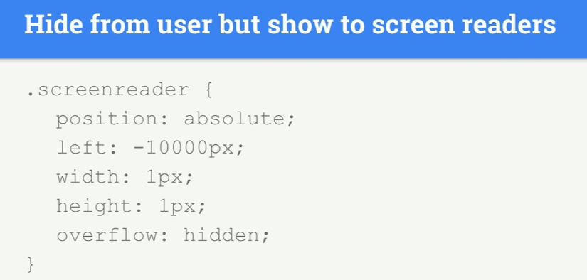

# INDEX

- [INDEX](#index)
  - [Static vs Dynamic websites](#static-vs-dynamic-websites)
  - [HTML](#html)
  - [Semantic HTML](#semantic-html)
    - [Why Semantic?](#why-semantic)
    - [Semantic tags](#semantic-tags)
  - [some inline elements to be aware of](#some-inline-elements-to-be-aware-of)
  - [tricks](#tricks)
  - [Forms](#forms)
    - [Form elements](#form-elements)
    - [Autofill Forms](#autofill-forms)
    - [Form validation](#form-validation)
    - [How is the Form data is transferred?](#how-is-the-form-data-is-transferred)
  - [Accessibility](#accessibility)
    - [`tab` keyboard-key](#tab-keyboard-key)
    - [Keyboard Events](#keyboard-events)
    - [Screen readers](#screen-readers)
    - [Accessible HTML](#accessible-html)
      - [Labels](#labels)
    - [ARIA Roles](#aria-roles)
      - [Live region roles](#live-region-roles)
  - [images](#images)
    - [Image Formats](#image-formats)
    - [`fav-icon`](#fav-icon)
    - [background img in css](#background-img-in-css)
    - [image size optimization (responsive images)](#image-size-optimization-responsive-images)
      - [HTML `<picture>` Element](#html-picture-element)
      - [srcset](#srcset)
      - [Background images](#background-images)
      - [Which to use ?](#which-to-use-)
  - [Tables](#tables)
    - [Spanning Columns and rows](#spanning-columns-and-rows)
    - [Table Notes](#table-notes)
  - [Escape Characters](#escape-characters)
  - [DOM (document object model)](#dom-document-object-model)
  - [Notes](#notes)

---

## Static vs Dynamic websites

| Static                 | Dynamic                                                            |
| ---------------------- | ------------------------------------------------------------------ |
| files are already done | files need to be generated by an application running on the server |

---

## HTML

- **HyperText** is a form of text in which documents can refer(link) to other documents and resources
- **markup language** allows you to annotate text, and these annotations provide additional meaning to the contents of a document
- **void(empty) element** is html element with no contents and no closing tag
- **Head element** is for things that are not visible in the browser window or things that describe the document
  - This contains information about the page
- **Body element** is for things that are visible in the browser window
- **DOCTYPE** tells the browser which version of HTML the page is using (although browsers usually display the page even if it is not included). without it the browser will go to `Quirks mode`

  ```html
  <!-- HTML5 -->
  <!DOCTYPE html>
  ```

- **`<meta>`** element lives inside the `<head>` element and contains information about that web page.

  - it tells search engines about your page, who created it, and whether or not it is time sensitive. (If the page is time sensitive, it can be set to expire.)
  - **`<meta charset="UTF-8">`** is as the letters we use in the English language (**character encoding**)
    - Specify character encoding **at first of the document**

  ```html
  <head>
    <title>Information About Your Pages</title>

    <meta name="description" content="An Essay on Installation Art" />
    <meta name="keywords" content="installation, art, opinion" />
    <meta name="robots" content="nofollow" />
    <meta http-equiv="author" content="Jon Duckett" />
    <meta http-equiv="pragma" content="no-cache" />
    <meta http-equiv="expires" content="Fri, 04 Apr 2014 23:59:59 GMT" />
  </head>
  ```

  - **`<meta name="viewport">`**

    ```html
    <meta name="viewport" content="width=device-width, initial-scale=1" />
    ```

    - The browser's viewport is the area of the window in which web content can be seen. This is often not the same size as the rendered page, in which case the browser provides scrollbars for the user to scroll around and access all the content.
    - Some mobile devices and other narrow screens render pages in a virtual window or viewport, which is usually wider than the screen, and then shrink the rendered result down so it can all be seen at once. Users can then pan and zoom to see different areas of the page. For example, if a mobile screen has a width of 640px, pages might be rendered with a virtual viewport of 980px, and then it will be shrunk down to fit into the 640px space.
    - his is done because not all pages are optimized for mobile and break (or at least look bad) when rendered at a small viewport width. This **virtual viewport is a way to make non-mobile-optimized sites in general look better on narrow screen devices**.
    - The basic properties of the "viewport" `<meta>` tag include:
      - `width`: Controls the size of the viewport. It can be set to a specific number of pixels like width=600 or to the special value **device-width, which is 100vw, or 100% of the viewport width**. Minimum: 1. Maximum: 10000. Negative values: ignored.
      - `height`: same
      - `initial-scale`: Controls the zoom level when the page is first loaded. Minimum: 0.1. Maximum: 10. Default:1. Negative values: ignored.
      - `minimum-scale`
      - `maximum-scale`
      - `user-scalable`: Controls whether zoom in and zoom out actions are allowed on the page. Valid values: 0, 1, yes, or no. Default: 1
    

- **Attribute** is a piece of data used to describe elements
- **href** : HyperText Reference
- **HTML Entity** is symbols that start with `&` ex: _copyright_[&copy;], _non-breaking space_[&nbsp;]
  - find more here: [html entities](https://www.w3schools.com/html/html_entities.asp)

---

## Semantic HTML

A semantic element clearly describes its meaning to both the browser and the developer.

> **Semantic elements = HTML-code (elements) with meaning**

- Examples of non-semantic elements: `<div>` and `<span>` -
  - they tell us nothing about their content.
  - Avoid `<span>` and `<div>` elements as much as possible
- Examples of semantic elements: `<form>, <table>`, and `<article>`

Writing Semantic HTML means that tags are never chosen based on the way they appear in a web browser, instead, they’re chosen based on the importance and structure of the content.

> We shouldn’t use `<h1>` just because of its large text size. The same goes for other HTML elements. HTML should be coded to represent the data that will be populated with and not based on its default style.

---

### Why Semantic?

Why do we need to tell the browser what our HTML elements represent?

- **SEO**

  - For example, keywords enclosed in an `<h1>` tag are given more importance than those enclosed in an `<p>`. By putting your most important keywords higher up in the hierarchy, you’re effectively telling search engines what your page is about and why people searching for those keywords would be interested in your content, hence improving the Search Engine Optimization of your page.
  - That's why you should **use only one** `<h1>` in the html page

- **Accessibility**

  - Because semantic HTML uses elements for their given purpose, it’s easier for both people and machines to read and understand it. Making applications accessible not only ensures equal access for people with disabilities but also benefits people without disabilities by allowing them to customize their experiences. Creating a clear hierarchy for the page allows other tools and devices to properly serve up your content.
    - **EX:** What if instead of using a semantically correct tag for a paragraph like `<p>` we use a `<div>` instead? The reading machine will never understand that it must make a pause before and after the paragraph reading. Therefore, the user experience for that visually impaired person will be deficient.

- **Easy Maintenance**
  - makes it easier to maintain the code and have a well-organized code.

---

### Semantic tags

**HTML5** brought with it a new set of semantic tags some of them especially thought to avoid unnecessary use of `<div>` and `<span>`


- `<section>` element ->
  - usually starts with heading element `h2`
  - very useful to split our main content into smaller groups of content.
  - can be nested
- `<section>` and `<article>` are workmates, not relatives.
  - These elements were not conceived to be part of a hierarchy (parent & child elements), in fact, they are made for working together.
  - you can use them one inside another without any problem.
- `<nav>` element usually contains **unordered list** element `ul`
- `<footer>` -> `Credits`, `copyrights`, `sitemaps`, `secondary navbars`, etc. All these types of elements can be grouped inside a `<footer>` tag.
- `<main>` -> There can be **only one**, one document, one `<main>` element. This semantic element is especially useful for search engine optimization.
  - When web bots get to your page, the `<main>` element will be yelling READ ME! So don't overlook it.
- If it is not **main**, put it aside! --> `<aside>`
  - content related but not a part of the main content
  - Use it when you need to label extra content, for example, `newsfeeds`, `commercial offers`, `newsletter form`, etc.
- `<figure>` --> self-contained element that can be placed or removed at will.

  - useful when it comes to group auxiliary (additional / helper) content.
  - its sidekick `<figcaption>` element, which is placed as first or last child of figure element

  ```html
  <figure>
    
    <figcaption>Slogan</figcaption>
  </figure>
  ```

- `<iframe>` is like a little window that has been cut into your page — and in that window you can see **another page**. The term iframe is an abbreviation of **inline frame**.

  - ex: to embed a Google Map into a page.

- `<blockquote>` and `<q>` --> these two elements commonly used for marking up **quotations**

  - Don’t put quotes to `<q>` element, as Quotes are provided by the browser.

- `<address>` element only for contact information

  - or email address, social network account, street address, telephone number, or something you can get in touch with.

  ```html
  <address>
    Contact:
    <a href="https://twitter.com/hail2u_">Kyo Nagashima</a>
  </address>
  ```

- `role` attribute can be used to also specify the role of the element in the page (specially for **screen readers**)
  - `<header role="banner">`

---

## some inline elements to be aware of

> inline elements in HTML aren't effected by [width/height] properties
>
> - Inline elements: **Flow in between surrounding text**

- `<mark>`
- `<br>`
- `<a>`
- ``
- `<span>`

> `<li>` is a **block element**, so if you want them to be next to each other, you could make them inline
>
> - Block-level elements: **start on a new line**

---

## tricks

- to make link go to other tab and not the current one, use the **target** attribute : `target="_blank"`
- to check if your HTML syntax is right => [HTML validation](https://validator.w3.org/)
- `&nbsp;` will add more whiteSpace to a line but won't break it.
- use `<span>` to isolate part of a paragraph
- to link label to input form => use `id='nameofID'` in the `<input>` element,`for='nameofID'` in the `<label>` element
- in `<input>`
  - **radio** => for only one option
  - **checkbox** => for one/more options
- in FORM when choosing option or inserting input field => what is sent is what in the **value** attribute
- for progress-bars -> use `<progress>` element with `max` attribute

  ```html
  <progress max="100" value="50">50%</progress>
  ```

---

## Forms

### Form elements

- `<label>` makes the form control accessible to screen readers, and provides a bigger target, since you can tap or click the label to set focus on the control.

- `<textarea>` element is used to enter multiple lines of text
- `name` attribute to identify the data the user enters with the control. If you submit the form, this name is included in the request.
- `<select>` element gives users a list of options to select from
  - The browser by default uses the first option in the list if user didn't select an option,
  - With the `selected` attribute you can pre-select one option.
- `<fieldset>` element is used to group form controls.

  - Every `<fieldset>` element requires a `<legend>` element, which is used to describe the group of form controls

  ```html
  <fieldset>
    <legend>What is your favorite web technology</legend>

    <label for="html">HTML</label>
    <input type="radio" name="webfeature" value="html" id="html" />

    <label for="css">CSS</label>
    <input type="radio" name="webfeature" value="css" id="css" />
  </fieldset>
  ```

- `<button>` element is used to submit a form

  - Every `<button>` element inside a form works as a Submit button by default. Sometimes you don't want this. To disable the default Submit behavior, you can add **type="button"** to the `<button>`. This tells the browser that the `<button>` should not submit the form.
  - You can also use an `<input>` element with type="submit" instead of a `<button>` element. The input looks and behaves just like a `<button>`. Instead of using a `<label>` element to describe the `<input>`, use the value attribute instead.

    ```html
    <input type="submit" value="Submit" />
    ```

---

### Autofill Forms

Autofill can help with re-entering data. You enter your address once. From now on, your browser will offer you the option to fill in the same address for other forms automatically.

- Use sensible attribute values
  - Browsers can identify the data type by looking at the **attributes** of a form control.
  - Do you have a field where users should enter their email address? Use email as a value for the name, id, and type attribute. Three hints for the browser that this is an email field.
- use The `autocomplete` attribute

  ```html
  <input type="text" name="name" id="name" autocomplete="name" />
  ```

---

### Form validation

> Why we validate form inputs before sending them to server?
>
> - Reduce the amount of work the server has to do
> - Enables users to see if there are problems with the form faster than if validation were performed on the server.

- The `required` attribute tells the browser that the field is mandatory. The browser also tests if the entered data matches the format of the `type`.
  - if the `type="email"` The email field shown in the example is only valid if it's not empty and if the entered data is a valid email address.
- `minlength` attribute is used to set minimum length of the input **text-value**
  - For **numerical input types** use `min` and `max` to achieve the same result.
- `Pattern` attribute

  - you can define a regular expression as the value.

    ```html
    <!-- Here, only lowercase letters are allowed, and the user has to enter at least two characters, and not more than twenty. -->
    <input required pattern="[a-z]{2,20}" type="text" id="animal" name="animal" />
    ```

- Style invalid form controls

  - You can use the `:invalid` pseudo-class to add styles to invalid form controls. In addition, there is also the `:valid` pseudo-class for styling valid form elements.

  ```css
  input:invalid {
    border: 2px solid red;
  }
  ```

  - > **Note:** In practice :invalid is tricky to work with. Invalid form fields are already marked as :`invalid` before user interaction, which may confuse users. The `:user-invalid` pseudo-class solves this issue, as the styles are only applied after user interaction. Learn more about `:user-invalid`.

---

### How is the Form data is transferred?

- Every `<form>` element requires an action attribute. Its value is the **URL** for the page on the server that will receive the information in the form when it is submitted.

  ```html
  <form action="http://www.example.com/subscribe.php" method="get"></form>
  ```

- When a form is submitted (for example, when the user clicks the Submit button), the browser makes a **request**. A script can respond to that request and process the data.
  - **script** (running on the server or the client) is needed to process the form. It may `validate the data`, `save it into a database`, or `do other operations` based on the form data.
- By default, form data is sent as a **GET** request, with the submitted data appended to the URL.
  - If the data is shareable, you can use the GET method. This way the data will be
    - added to your `browser history` as it is included in the URL.
    - `Search forms` often use this. This way you can bookmark a search result page.
- you can instruct the form to use a **POST** request by changing the method attribute.

  - By doing that, The data will not be visible in the URL and can only be accessed from a frontend or backend script.

    ```html
    <form method="post">
      <!-- code -->
    </form>
    ```

  - The data will be encrypted (if you use HTTPS) and only accessible by the backend script that processes the request. The data is not visible in the URL. A common example is a sign-in form.

- you can use [netlify](https://docs.netlify.com/forms/setup/?_ga=2.17094910.693790722.1649686633-761975974.1648039605) to manage your forms without `Js` => by inserting `name` attribute to each `input` element and writing this at at the `form` element:

  ```html
  <form class="cta-form" name="sign-up" netlify></form>
  ```

---

## Accessibility

### `tab` keyboard-key

A keyboard user typically uses the Tab key to navigate through interactive elements on a web `page—links`, `buttons`, `fields` for inputting text, etc. When an item is tabbed to, it has keyboard `focus` and can be activated or manipulated with the keyboard. A sighted keyboard user must be provided with a visual indicator of the element that currently has keyboard focus. Focus indicators are provided automatically by web browsers.

- `tab` -> go forward
- `shift + tab` -> go backwards

Elements that are affected by `tab` are the one which the user interacts with like: `<input>`, `<a>`, `<iframe>`, ..

- elements which are non-interactive are not affected by `tab`
- the order of focusing on element using `tab` is called **tab-order**
  - this order is by how elements are presented in the **DOM** and not the order by css-style

`tabindex` attribute:

- it makes the element tabbable

  ```html
  <div tabindex="0">W3Schools</div>
  ```

  

  - usually the negative-value is when you want to manage focus by javascript

> `Document.activeElement` -> read-only property of the Document interface returns the Element within the DOM that currently has focus.

---

### Keyboard Events

> find what is the number for each keyboard key from here: [keycode.info](https://www.keycode.info)

You can use keyboard events to do stuff

- `keydown`
- `keypress`
- `keyup`


---

### Screen readers

- **Alternative Text**
  

  - By default, when a screen reader encounters an image:
    - if it can't find alt text it will read aloud the file's name.
    - if it finds the alt text empty `alt=""` --> it will skip over the image
  - we don't use `picture of` or `graphic of` in **alt** as the screen reader says it in the beginning by default

- **Hiding elements**
  
  
  - to only show in screen readers you can use class -> `.visuallyhidden`

---

### Accessible HTML

- Some elements have semantic meaning but no special functionality. Examples are:

  - `<aside>`
  - `<footer>`
  - `<header>`

- Other's provide a lot of built-in functionality such as:

  - `<button>`
  - `<input>`
  - `<textarea>`

#### Labels

Form fields can be confusing for screen reader users. There are many ways to **label form fields** so the label is read out loud whenever the field has focus.

- HTML labels

  ```html
  <form>
    <label for="first">First Name</label>
    <input id="first" type="text" />
  </form>
  ```

- Implicit HTML labels

  - you can do is wrap your inputs with the label tag. This is called **implicit labelling**.

  ```html
  <form>
    <label>
      First Name
      <input id="first" type="text" />
    </label>
  </form>
  ```

Limitations with the `<label>` tag:

- The label tag can only works with "**labelable**" elements. Those include:

  - `<button>`
  - `<input>`
  - `<keygen>`
  - `<meter>`
  - `<output>`
  - `<progress>`
  - `<select>`
  - `<textarea>`

- If you ever need to label an element not on that list, use **aria-label** instead.

  ```html
  <div aria-label="Interactive div">Hello</div>
  ```

---

### ARIA Roles

ARIA roles provide **semantic meaning to content**, allowing screen readers and other tools to present and support interaction with object in a way that is consistent with user expectations of that type of object. ARIA roles can be used to describe elements that don't natively exist in HTML or exist but don't yet have full browser support.

You can find more here along with roles to use -> [here](https://developer.mozilla.org/en-US/docs/Web/Accessibility/ARIA/Roles)

> Bootstrap uses class `.sr-only` to only show the element to **screen readers**, what it does is it does every possible way to hide the element from the page like this:

```css
.sr-only {
  position: absolute;
  width: 1px;
  height: 1px;
  padding: 0;
  margin: -1px;
  overflow: hidden;
  clip: rect(0, 0, 0, 0);
  border: 0;
}
```

#### Live region roles

Live Region roles are used to define elements with **content that will be dynamically changed** ex:(`chat`). Sighted users can see dynamic changes when they are visually noticeable. These roles help low vision and blind users know if content has been updated. Assistive technologies, like screen readers, can be made to announce dynamic content changes:

- `assertive` - will interrupt whatever it's doing to announce.
- `polite` - will announce the live region update when it next idles.
- `off` - will not read the update.

  ```html
  <div aria-live="assertive">Waiting for a ride</div>
  ```

---

## images

### Image Formats

- **JPEG** -> Whenever you have many different colors
  colors
- **JPEG** -> Whenever you have images with few colors or large areas of the same color (flat colors),
  - ex: logos, illustrations and diagrams.
- **GIF or PNG** ->

---

### `fav-icon`

[website for doing all this](https://www.favicon-generator.org/)

- use `fav-icon` for **Browsers** and make sure to resize it to **64px**
- for `apple` --> use resized favicon

- for `android` :

  - create `manifest.webmanifest` file which contains this code :

  ```webmanifest
  {
    "icons": [
      { "src": "img/favicon-192.png", "type": "image/png", "sizes": "192x192" },
      { "src": "img/favicon-512.png", "type": "image/png", "sizes": "512x512" }
    ]
  }
  ```

  - also add this to `html` `<head>`

    ```html
    <link rel="manifest" href="manifest.webmanifest" />
    ```

---

### background img in css

- when you use **background img** in css and want it to be `Accessible` in `HTML` to write `alt` for screen readers

  - `role` describes the role of an element in programs that can make use of it, such as screen readers or magnifiers.

  - `aria-label` attribute defines a string value that labels an interactive element.
  - in `HTML` :

    ```html
    <div class="cta-img-box" role="img" aria-label="Womanenjoying food"></div>
    ```

  - in `CSS` :

    ```css
    .cta-img-box {
      background-image: url('../img/eating.jpg');
      background-size: cover;
    }
    ```

---

### image size optimization (responsive images)

- why we use the built-in HTML `width` and `height` ?

  - Images often take longer to load than the (HTML and css) code that makes up the rest of the page, therefore, a good idea to specify the size of the image (in html or css) so that the browser can render the rest of the text on the page while **leaving the right amount of space for the image that is still loading** which allows it to render the rest of the page without waiting for the image to download.

  ```html
  
  ```

- image size matter, as You should save the image at the same width and height it will appear on the website:
  - If the image is smaller than the width or height that you have specified, the image can be distorted and stretched.
  - If the image is larger than the width and height if you have specified, **the image will take longer to display on the page**.
- to reduce size of images => [squoosh](https://squoosh.app/) and use the `webp` format

  - but check `compatibility` with browsers **or** use it with `fallback img` and let the browsers choose by itself.

#### HTML `<picture>` Element

- The HTML `<picture>` element gives web developers more flexibility in specifying image resources.
  - The `<picture>` element contains one or more `<source>` elements, each referring to different images through the srcset attribute. This way the browser can choose the image that best fits the current view and/or device.
- Each `<source>` element has a **media** attribute that defines when the image is the most suitable.

- It's used to Render images conditionally (show one and hide the other)
  here, we use `<picture>` symantec element
- **Notes:**
  - Always specify a fallback `` element as the **last child element** of the `<picture>` element.
  - The `` element is used by browsers that do not support the `<picture>` element, or if none of the `<source>` tags match.

```html
<picture>
  <!-- browser will choose which src it can display and displays it in the  element below -->
  <source srcset="img/hero.webp" type="image/webp" />
  <source srcset="img/hero-min.png" type="image/png" />

  <!-- fall-up (default) image (if the previous didn't render) -->
  
</picture>
```

Or Show different images for different screen sizes:

```html
<picture>
  <source media="(min-width: 650px)" srcset="img_food.jpg" />
  <source media="(min-width: 465px)" srcset="img_car.jpg" />
  
</picture>
```

> Also see `<figure>` element [here](#semantic-tags)

#### srcset

There're new attributes for `` element used to provide several additional source images along with hints to help the browser pick the right one:

- `srcset`
- `sizes`

> - the names and width of images in **Pixels**
> - **sizes** -> represents the hole on the web page

```html


<!-- same as : -->

```

#### Background images

for that we use media queries as we put each image in each media

#### Which to use ?


---

## Tables

### Spanning Columns and rows

Sometimes you may need the entries in a table to stretch across more than one column or row.

The `colspan` / `rowspan` attribute can be used on a `<th>` or `<td>` element and indicates how many columns / rows that cell should run across.

```html
<table>
  <tr>
    <th></th>
    <th>9am</th>
    <th>10am</th>
    <th>11am</th>
    <th>12am</th>
  </tr>
  <tr>
    <th>Monday</th>
    <td colspan="2">Geography</td>
    <td>Math</td>
    <td>Art</td>
  </tr>
</table>
```

### Table Notes

- Part of the reason for having separate `<thead>` and `<tfoot>` elements is so that, if you have a table that is taller than the screen (or, if printed, longer than one page) then the browser can keep the header and footer visible whilst the contents of the table scroll. This is intended to make it easier for users to see which column the data is in.
  - however this functionality is not implemented by default in any current browser.

---

## Escape Characters

There are some characters that are used in and reserved by HTML code.

---

## DOM (document object model)

Here the **Tree structure** is the operation that make html code looks the way it does on the browser(rendered)


> **NOTE:** it is important to check the page in your browser to ensure that the correct symbol shows up. This is because some fonts do not support all of these characters and you might therefore need to specify a different font for these characters in your CSS code.

---

## Notes

- `<div>` element allows you to group a set of elements together in one **block-level box**.
- `<span>` element acts like an inline equivalent of the `<div>` element. It is used to either:
  - Contain a section of text where there is no other suitable element to differentiate it from its surrounding text
  - Contain a number of inline elements
  - You will usually see that a **class** or **id** attribute is used with `<span>` elements:
    - To explain the purpose of this `<span>` element
    - So that CSS styles can be applied to elements that have specific values for these attributes
- **hero**: is first section of the page that we want the user to focus on (the headline)
- **empty elements**: elements that do not have any words between an opening and closing tag, ex: `<hr />`
- **Lists**:
  - in `<ol>` element, you can use the attribute `reversed` to reverse the list items
  - Another type of list element is **Description List element (`<dl>`)**
    - consists of a series of 2 matching element (**terms** and their **definitions**) (key-value pairs).
    - `<dl>` element works with pairs of `<dt>` and `<dd>` elements.
- use `<section>` element instead of `<div>`
