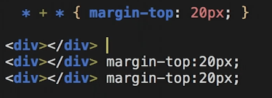
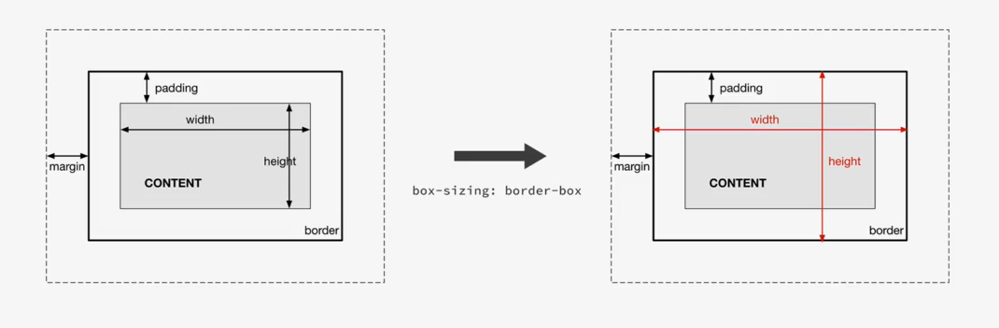
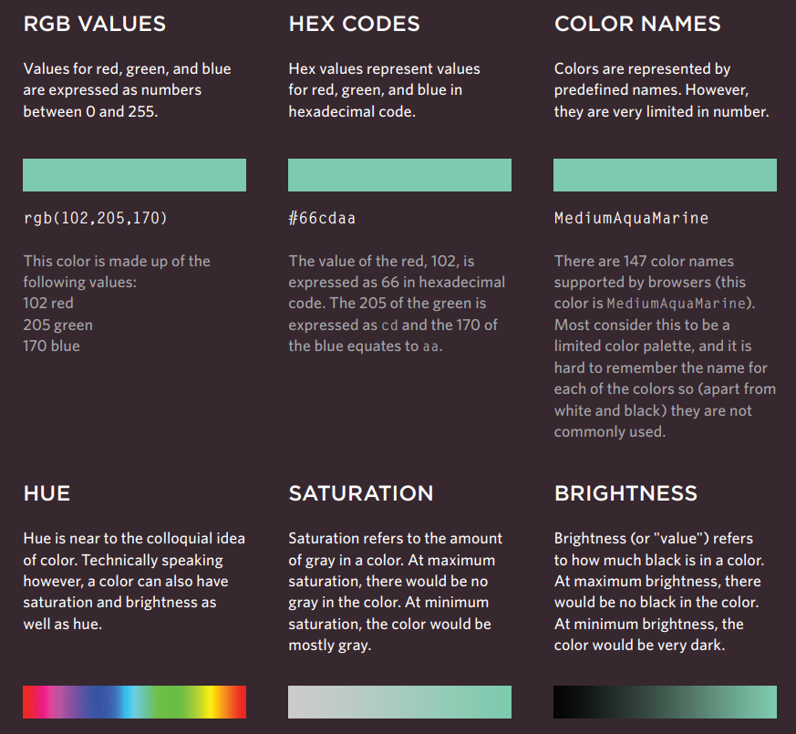
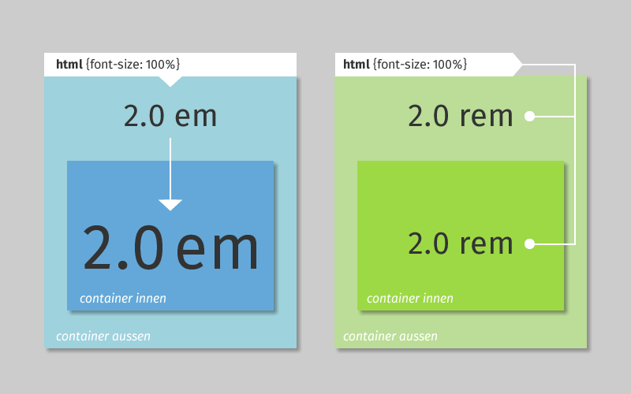
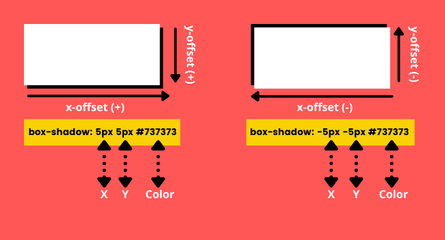
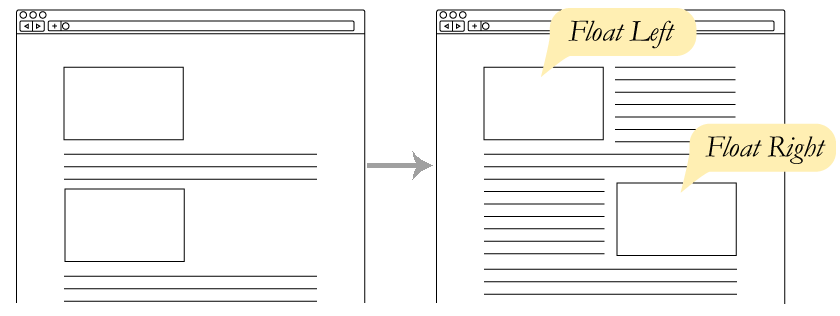
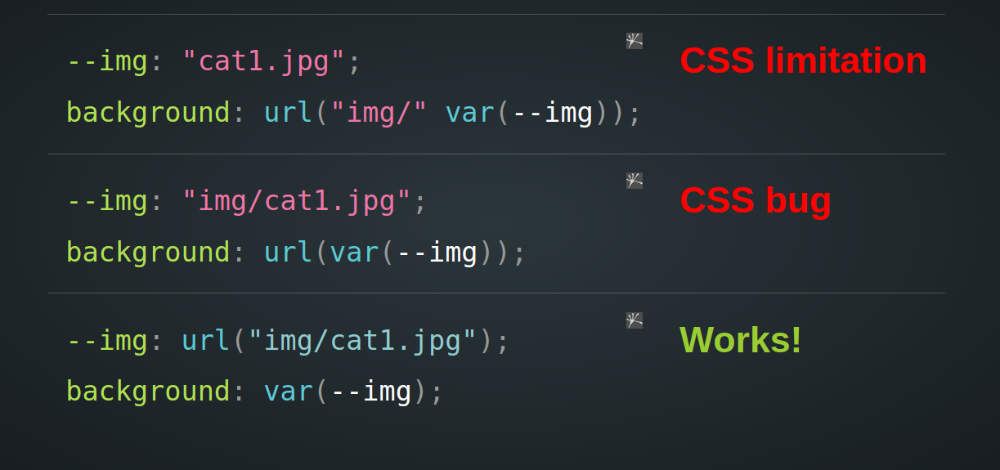

# INDEX

- [INDEX](#index)
  - [Starter CSS Code](#starter-css-code)
  - [styling Types](#styling-types)
  - [selectors](#selectors)
    - [Descendant selectors](#descendant-selectors)
    - [`[attribute]` Selector](#attribute-selector)
    - [css selector specificity](#css-selector-specificity)
      - [Calculation](#calculation)
      - [Selectors Notes](#selectors-notes)
  - [Properties Types](#properties-types)
  - [Box Model](#box-model)
  - [Display](#display)
    - [pseudo Elements/Classes](#pseudo-elementsclasses)
      - [pseudo elements](#pseudo-elements)
      - [pseudo classes](#pseudo-classes)
  - [Color](#color)
    - [HSL Colors](#hsl-colors)
  - [Font](#font)
    - [TypeFaces](#typefaces)
      - [Units of Type Size](#units-of-type-size)
    - [Alignment](#alignment)
    - [Font and Units Notes](#font-and-units-notes)
  - [Shadow](#shadow)
    - [box-shadow](#box-shadow)
    - [text-shadow](#text-shadow)
  - [images](#images)
    - [object-fit](#object-fit)
    - [`background-` properties](#background--properties)
      - [`background-image` property](#background-image-property)
      - [`background-image` notes](#background-image-notes)
      - [`background-size` property](#background-size-property)
      - [`background-position` property](#background-position-property)
      - [`background-attachment` property](#background-attachment-property)
      - [`background` property](#background-property)
    - [image filter](#image-filter)
    - [clip-path](#clip-path)
    - [Images Notes](#images-notes)
  - [LAYOUTS](#layouts)
    - [Fixed width vs Liquid Layouts](#fixed-width-vs-liquid-layouts)
    - [Position](#position)
    - [`z-index`](#z-index)
    - [Float](#float)
    - [Flexbox](#flexbox)
      - [align-items \& align-content](#align-items--align-content)
      - [justify-content](#justify-content)
      - [`flex` vs `inline-flex`](#flex-vs-inline-flex)
      - [flex-wrap](#flex-wrap)
      - [order](#order)
      - [flex-grow \& flex-shrink](#flex-grow--flex-shrink)
      - [flex-basis](#flex-basis)
      - [flex-gap (NEW FEATURE)](#flex-gap-new-feature)
    - [GRID](#grid)
      - [Old Grid (960 pixel grid)](#old-grid-960-pixel-grid)
      - [CSS3 Grid](#css3-grid)
        - [auto vs fr](#auto-vs-fr)
        - [auto-fill vs auto-fit](#auto-fill-vs-auto-fit)
        - [Grid Lines (start/end)](#grid-lines-startend)
        - [Grid Areas](#grid-areas)
  - [CSS Variables (custom properties)](#css-variables-custom-properties)
    - [Variables inheritance](#variables-inheritance)
    - [Invalid At Computed Values Time (IACVT)](#invalid-at-computed-values-time-iacvt)
    - [variables token: Number, string, images](#variables-token-number-string-images)
    - [Css variables with Javascript](#css-variables-with-javascript)
  - [Calculations Built in Functions](#calculations-built-in-functions)
    - [calc()](#calc)
    - [clamp()](#clamp)
  - [icons - SVG](#icons---svg)
  - [Animation](#animation)
    - [What to animate?](#what-to-animate)
    - [transform](#transform)
    - [transition](#transition)
      - [`transition-timing-function`](#transition-timing-function)
      - [Animating(transitioning) background](#animatingtransitioning-background)
    - [Animation Keyframes](#animation-keyframes)
      - [choreograph](#choreograph)
    - [data state](#data-state)
    - [Animation Notes](#animation-notes)
  - [data attributes](#data-attributes)
  - [Table](#table)
  - [Form](#form)
  - [media queries](#media-queries)
    - [Break points](#break-points)
  - [Browser Prefixes (CSS Vendor Prefixes)](#browser-prefixes-css-vendor-prefixes)
  - [Scrolling](#scrolling)
  - [Modules (multiple style sheets)](#modules-multiple-style-sheets)
  - [Notes](#notes)

---

## Starter CSS Code

in this repo, you will find source for [CSS Default Starter / Global Styles / Tools](https://github.com/john-smilga/default-starter)

> read the README.md file for instructions

---

## styling Types

1. inline style

   - it crowds our HTML elements

   ```html
   <h1 style="color:red"></h1>
   ```

2. internal style
   - in the `style` tag in `head`
3. external style
   - imported in `link` tag with attribute `rel="stylesheet"` in `head`

> **Cascading**: Process of combining different stylesheets and resolving conflicts between different CSS rules and declarations by the browser, when more than one rule applies to a certain element.
>
> - **cascade** is the algorithm for solving conflicts where multiple CSS rules apply to an HTML element.

---

## selectors

- Basic: Element selectors => p,div,..
- Class selectors
- ID selectors

### Descendant selectors

selector in a selector, ex: `p em`

- **Examples** from [reference](https://www.w3schools.com/cssref/css_selectors.asp)

  - `.name1.name2` => Selects all elements with both name1 and name2 set within its class attribute
  - `p.intro` => Selects all `<p>` elements with class="intro"
  - `div > p` => Selects all `<p>` elements where the parent is a `<div>` element (**Direct child**)
  - `div p` => Selects all `<p>` elements where the parent is a `<div>` element (even if there are other elements nested between them)
  - `div + p` => Selects the first `<p>` element that is placed **immediately** after `<div>` elements
  - `p ~ ul` => Selects every `<ul>` element that is preceded by a `<p>` element (siblings)
    - **All** `<ul>` after `<p>`
  - `[target]` => Selects all elements with a target attribute
  - `:not(p)` => Selects every element that is not a `<p>` element
  - `:nth-child(n)` => [nthmaster](http://nthmaster.com/)
  - `owl selector` -> applies to the elements with is not the first one
    

### `[attribute]` Selector

- `[]` selector -> Matches a specific attribute (whatever its value)
  - ex: `p[class]`
- `[=]` selector -> Matches a specific attribute with a specific value
  - ex: `p[class="dog"]`
- `[~=]` selector -> Matches a specific attribute whose value appears in a space-separated list of words
  - ex: `p[class~="dog"]`
- `[*=]` selector -> Matches a specific attribute whose value contains a specific substring
  - ex: `p[attr*"do"]`
- `[$=]` selector -> Matches a specific attribute whose value **ends** with a specific string
  - ex: `p[attr$"g"]`
- The `[attribute^=value]` selector matches every element whose attribute value **begins** with a specified value.

  ```css
  div[class^='test-'] {
    background: #ffff00;
  }
  ```

### css selector specificity

If there are two or more CSS rules that point to the same element, the selector with the highest specificity value will "win", and its style declaration will be applied to that HTML element.

> or with the **"Last rule Principle"** where if multiple elements have the same selector specificity, then only the last selector's styles will be applied. So placement is Important

#### Calculation

- Start at 0
- add 100 for each ID value
- add 10 for each class value (or pseudo-class or attribute selector)
- add 1 for each element selector or pseudo-element.


#### Selectors Notes

- Universal selector (**`*`**) has **no specificity** and gets **0 points** (least specificity so it's like a fallback or when overriding default styles).
- `!important` gets a specificity score of **10,000 points**. This is the highest specificity that one individual item can get.

- Specificity in CSS only concerns selectors, not their associated declarations. **!important** applies to a declaration, so it alone plays no role in specificity.
- more info & examples here [css-specificity](https://www.webfx.com/blog/web-design/css-specificity/)

---

## Properties Types

- numbers: `10`, `200px`, `50%`, `14pt`
- colors: `#FFF`, `rgb(255, 0, 0)`, `red`
- strings: `img.png`, `url("img.png")`
- boolens: `true`, `false`
- lists: like 4 values for all directions in `border`
- maps: `key-value pairs`

  ```css
  blue: (base: #6ac0e2, center: #38b5ea, shadow: #316980);
  ```

---

## Box Model

- By default, elements have margin, so at the beginning, we reset the margins -> `* {margin: 0;}`
- **`box-sizing`** : allows us to include the padding and border in an element's total width and height.
  
- margin can be negative as it's related to the surrounding elements and not the element itself
- **auto margin trick**: 
- **outline** is outside of the border (and it may overlap with other elements)
  
- **outline vs border**:

  - `border` is part of the box-model and `outline` is not
    - this means that `border` takes space of the element size and `outline` doesn't
    - you can think of it as if the `outline` is like a `box-shadow` as it doesn't affect the page-layout at all
  - there is no specified positions for `outline` -> `outline-left` is invalid
  - there's no radius for the `outline`, so with them, we can't have round corners
  - `outline` can have offset which allows us to move the outline (outside or inside)

    

    ```css
    div {
      outline: 2px solid #fff;
      outline-offset: -5px;
    }
    ```

  - `outline` is an animated property

- inline elements respect padding & margin **only** for (right/left) and doesn't respect `top`/`bottom` margin & padding, and they don't respect `width`/`height`
- to make global reset for margin/padding => use `*` and not `body`
- **Collapsing margins** : it's when we have 2 margins(only vertical margins) that occupied the same space, so only one of them will be visible to the page which is the larger one and **not** their sum 
  - this is not the same for **padding** as they get added together
- **Border collapse** : sets whether table borders should collapse into a single border or be separated as in standard HTML => `border-collapse: separate;` 
- between sections use padding not margin

- When you want to use the `margin` shorthand for all directions, we used to always specify horizontal & vertical spacing, now there're new css-properties called `margin-inline` and `margin-block`

  - it helps if you only want to specify spacing for one direction only instead of making the other direction equals `zero`
    

  ```css
  /* OLD */
  margin: 0 20px;
  /* NEW */
  margin-inline: 20px;

  /* OLD */
  margin: 20px 0;
  /* NEW */
  margin-block: 20px;
  ```

> **THE VISUAL FORMATTING MODEL**: Algorithm that calculates boxes and determines the layout of theses boxes, for each element in the render tree, in order to determine the final layout of the page.

---

## Display

- `visibility:hidden` => hide the element but reserves it's place (leaves a space where the element would have been)
- `display: none` => remove element from the flow, hide element and collapse its space

  - _note_ => it doesn't work for `animation/transition` (for Javascript usually), instead use:

    ```css
    /* ALL THESE FOR mimicking [display:none;] */

    /* 1) Hide it visually and preserve the space */
    opacity: 0;

    /* 2) Make it unaccessible to mouse and keyboard */
    pointer-events: none;

    /* 3) Hide it from screen readers */
    visibility: hidden;
    ```

- `display: block` --> can be used to make `<a>` element take full width of its container -> for user clicking accessibility
- **inline-block**: `display: inline-block` --> causes a block-level element to flow like an inline element, while retaining other features of a block-level element.
  - doesn't start a new line (like inline element)
  - respects `margin`, `width`, `height` (like block element)

### pseudo Elements/Classes

#### pseudo elements

They create element and insert it before/after content

- we must provide a `content` property

  ```css
  div::before {
  content: "";
  width: 100%
  background-color: red;
  }
  /* or */
  div::before {
  content: "sfdsfsdfdsf";
  background-color: red;
  }

  /* This Won't Work */
  div::before {
  background-color: red;
  }
  ```

- they are inline elements, so you can convert them to `inline-block` to control padding
- you can't add **pseudo elements** like `::before` with `img` element (as it's a content by itself), instead use it on a `div` that contains the `img`
- when you have a sliding item (animate from right to center like a **sidebar**) => use this :

  ```css
  body,
  html {
    overflow-x: hidden;
  }
  ```

- when you have `pseudo element` like `::before` that has no content, you have 2 choices :

  - `width` / `height` in `px,rem`
  - `width` / `height` in `%` relative to the **parent element**

  - for this we use padding-top/bottom to simulate height
    

    ```css
    /* outer circle */
    .step-img-box::before {
      width: 60%;

      this mimik -> "height: 60%;"
      padding-bottom: 60%;

      background-color: #fdf2e9;
      z-index: -2;
    }
    ```

> You can use `::before` and `::after` to write content after repeated elements like in **tables** or **lists**
>
> - like unit after the number -> **kg**, **meter**,...
> - like words before number -> **weight:**, **length:**,...
>
> ```css
> td:nth-of-type(3)::after {
>   content: 'kg';
> }
> ```

- You can check new pseudo classes -> `:has()`, `:where()`, `:is()`

---

#### pseudo classes

They are style-reactions to certain actions on elements

- **styling (hyperlinks / buttons)**

  - Always use these (pseudo classes) with `<a>`, `<button>` elements:

    - `a:link` => `<a>` that are **unvisited** links with a **href**
    - `a:visited` => `<a>` that has been clicked on
    - `a:hover` => `<a>` when we are **hovering**
    - `a:active` => `<a>` when we are **clicking**
    - `a:focus` => `<a>` when we are **tab focusing**

- **root pseudo class**
  - for the root element of the document (`html` element), higher specificity
    - note that `rem` values will depend on values here
  - used for:
    - general styles
    - css variables

---

## Color



- Hex Values **#RRGGBB**

  - `123456789 A(10) B(11) C(12) D(13) E(14) F(15)`

- `rgba(red, green, blue, alpha)`

  - `alpha`: Defines the opacity as a number between `0.0` (fully transparent) and `1.0` (fully opaque)

    ```css
    div {
      background-color: rgba(255, 0, 0, 0.3);
    }
    ```

### HSL Colors

It's a way to specify colors using **hue**, **saturation**, and **lightness** values.


```css
body {
  background-color: hsl(0, 0%, 78%);
}

p {
  /* hsla color property adds a fourth value which represents transparency (a for alpha). */
  background-color: hsla(0, 100%, 100%, 0.5);
}
```

---

## Font

### TypeFaces

> When choosing a typeface, it is important to understand that a browser will usually only display it if it's installed on that user's computer.


- Browsers are supposed to support at least one typeface from each of the groups above which is called a **"font-stack / generic-family"**. For this reason, it is common to add the generic font name after your preferred choice of typefaces.

  - For example, if you wanted **serif type**:

    ```css
    font-family: Georgia, Times, serif;
    ```

- `@font-face` -> allows you to use a font, even if it is not installed on the computer of the person browsing, by allowing you to specify a path to a copy of the font, which will be downloaded if it is not on the user's machine.

  ```css
  @font-face {
    font-family: 'ChunkFiveRegular';
    src: url('fonts/chunkfive.eot');
  }
  h1,
  h2 {
    font-family: ChunkFiveRegular, Georgia, serif;
  }
  ```

  - Google also provides open source fonts. Rather than adding the `@font-face` rule to your own style sheet, you link to a CSS file and font files on their servers

- when importing font-faces from a link, we have 2 methods:

  1. put the `<link>` code in the HTML `head` before the styles files
  2. use `@import url()`, **but it needs to be the first thing in your css file/s** to work correctly

- to make text `uppercase / lowercase / capitalize`, you can use `text-transform` property

#### Units of Type Size

- Setting font size in **pixels** is the best way to ensure that the type appears at the size you intended (because percentages and ems are more likely to vary if a user has changed the default size of text in their browser).

  - You can also use pt for point sizes instead of px for pixels, but you should only do this when creating style sheets for printer-friendly versions of pages.

- `line-height` is a term to control **Leading (pronounced ledding)**

  - it is a term typographers use for the **vertical space between lines of text**, and doesn't affect the font-size
  - In a typeface, the part of a letter that drops beneath the baseline is called a **descender**, while the highest point of a letter is called the **ascender**. Leading is measured from the bottom of the descender on one line to the top of the ascender on the next.
    
  - Increasing the line-height makes the vertical gap between lines of text larger.
  - if we didn't use a unit then it's relevant to the current **font size**

- `letter/word-spacing` : **Kerning** is the term typographers use for the space between each letter. You can control the space between each letter with the letter-spacing property.
  - When you specify a value for these properties, it should be given in **em**
    - The default gap between words is set by the typeface around `0.25em`

---

### Alignment

- to indent text, use `text-indent`

  ```css
  div {
    text-align: left;
    text-indent: 6rem;
  }
  ```

- `vertical-align`:
  - is a common source of confusion. It is not intended to allow you to vertically align text in the middle of block level elements such as `<p>` and `<div>,` **although** it does have this effect when used with **table cells** (the `<td>` and `<th>` elements).
  - It is more commonly used with inline elements such as `,` `<em>,` or `<strong>` elements. When used with these elements, it performs a task very similar to the HTML align attribute used on the `` element

---

### Font and Units Notes

- `white-space: no wrap` => this forces it to automatically go to next line when reaching max-width
- `text-overflow:ellipsis` => when text passes the max-width, it shows this `...`at the max-width limit as indication of more text available
- in the `html` element-selector we set the `font-size` to **62.5%** and not 10px => because we want to respect the user's font-size settings.
- `rem` (root element) vs `em` (parent element) : 
  - **em** ->
    - em are measured relative to their **parent font-size**, if used to specify **font-size**
    - em are measured relative to the **current font-size within element**, if used to specify **lengths (spacing)**
      - as length/gap/spacing using `em` in `<p>` will be smaller than in `<h1>`
  - **rem** -> is relative to the html (root) font-size
- **Viewport Units**: They create layouts that depend on the screen size

  - values from 0 to 100
  - `vh`: height (percent of the screen)
  - `vw`: width (percent of the screen)
  - To get the rest of screen's width/height, you can use the [calc()](#calc)

    ```css
    .banner {
      height: calc(100vh -100px);
    }
    ```


> we shouldn't use **Pixels** for font-sizes as if user changed his browser **base font-size** (the default is 16px), then it won't reflect on the page.
>
> - so instead we use a relative unit that can scale up/down like: `rem` or `em`

- For more fun font use => [Rubik](https://fonts.google.com/specimen/Rubik)
- For font-size scales -> [type-scale.com](https://type-scale.com/)
- If you're getting your fonts from a service like [https://fonts.google.com](https://fonts.google.com), note that there may be some tracking of **IP-Addresses** of the users when the `HTML` page is downloaded in the browser
  - to avoid this, you can download the font files locally and refer to it in the `HTML` file
  - more info [here](https://blog.runcloud.io/google-fonts-gdpr/)

---

## Shadow

### box-shadow



- `x-offset`: means in x-direction (horizontal)
- `y-offset`: means in y-direction (vertical)
- `blur-radius`: strength of blueness (Optional)
  - If omitted, the shadow is a solid line like a border
- `spread-radius`: expand or grow the radius of the shadow in all directions (Optional)
- `color`: the color of box-shadow (Optional)
- `inset` to add border from the inside and not outside (Optional) => ex:

```css
box-shadow: inset 0 0 0 3px #fff;
```

---

### text-shadow


```css
.myClass {
  /*           x   y   blur color */
  text-shadow: 1px 1px 0px #ff0000;
}
```

> To generate text-shadow -> [Here](https://html-css-js.com/css/generator/text-shadow/)

---

## images

### object-fit

It is used to specify how an `` or `<video>` should be resized to fit its container.

- This property tells the content to fill the container in a variety of ways; such as "preserve that aspect ratio" or "stretch up and take up as much space as possible".
  
- we use it to use images with specified width&height without distorting them

  ```css
  img {
    width: 200px;
    height: 300px;
    object-fit: cover;
  }
  ```

---

### `background-` properties

#### `background-image` property

- **background-repeat**

  - By default, as the element gets bigger, if the background-image is not big enough, it will repeat to fill the entire element(box). to control that, you can use `background-repeat` property

    ```css
    body {
      background-image: url('images/header.gif');
      background-repeat: repeat-x;
      /* or: The image is only shown once.
      background-repeat: no-repeat;
      */
    }
    ```

  
  

- **background-position**

  - When an image is not being repeated, you can use the `background-position` property to specify where in the browser window the background image should be placed.

  - This property usually has a pair of values. The first represents the horizontal position and the second represents the vertical. -> ex:

    ```css
    body {
      background-image: url('images/tulip.gif');
      background-repeat: no-repeat;
      background-position: 50% 0%;
      /* or */
      background-position: center top;
    }
    ```

    - If you only specify one value, the second value will default to **center**.

- **background-attachment**

  - the `background-attachment` property specifies whether a background image should stay in one position or move as the user scrolls up and down the page. It can have one of two values:
  - Values:
    - `fixed`
    - `scroll`

- **linear gradient**
- we have the ability to specify a **gradient** for the background of a box. The gradient is created using the `background-image` property:

  - to add overlay gradient with one color, you make the linear-gradient with the same value for the 2 gradient colors

  ```css
  div {
    /* background image (with darkening-overlay) */
    background-image: linear-gradient(rgba(34, 34, 34, 0.6), rgba(34, 34, 34, 0.6)), url(hero.jpg);
    /* here, linear-gradient needs to be in rgba() form to show the image */
  }
  ```

- **RECOMMENDED:** you can generate gradients from here [cssgradient.io](https://cssgradient.io/)

---

#### `background-image` notes

- when you have an empty div that have a `background-image` and want to make it available for screen readers for **SEO** -> add these attributes: [`role`, `aria-label`], ex:

  ```html
  <div class="cta-img-box" role="img" aria-label="Woman enjoying food ></div>
  ```

---

#### `background-size` property

- `background-size` property :
  

- **contain** : Scale the image, while preserving its intrinsic aspect ratio (if any), to the largest size such that both its width and its height can fit inside the background positioning area.
- **cover** : Scale the image, while preserving its intrinsic aspect ratio (if any), to the smallest size such that both its width and its height can completely cover the background positioning area.

- `img` is an **inline element**, so it's effected by `text-align`, so you can center it using this, unlike **block elements** where it just center the text inside the element

---

#### `background-position` property

position of the image in the background

- values:
  - `[top,bottom, left, right, center]`
  - length values from the top-left `20% 70%;`
  - absolute length values `1rem 2rem`

---

#### `background-attachment` property

It specifies whether the background image should scroll or be fixed (will not scroll with the rest of the page)

```css
body {
  background-image: url('img_tree.png');
  background-repeat: no-repeat;
  background-position: right top;
  background-attachment: fixed;
  /* or */
  /* background-attachment: scroll; */
}
```

---

#### `background` property

The background property acts like a shorthand for all of the other background properties you have just seen, and also the background-color property

```css
body {
  background: url('images/tulip.gif');
  /* or with other options & values */
  background: #ffffff url('images/tulip.gif') no-repeat top right;
}
```

---

### image filter

- change color of image from `filter` property

  - make image color **black** => `filter: brightness(0);`
  - make image color **grey** =>

    ```css
    filter: brightness(0);
    opacity: 50%;
    ```

  - also you can try `filter: greyscale/blur/invert`

---

### clip-path

- `clip-path` => [clippy](https://bennettfeely.com/clippy/)
  

---

### Images Notes

- if you have an empty space between the image and the bottom-border, make the img has the `display: block;` property
  - you can also make sure that you're using `box-sizing: border-box;`

---

## LAYOUTS

### Fixed width vs Liquid Layouts

- **Fixed width layout** : designs do not change size as the user increases or decreases the size of their browser window. Measurements tend to be given in **pixels**.
  
- **Liquid layout** : designs stretch and contract as the user increases or decreases the size of their browser window. They tend to use **percentages**.
  

---

### Position

- `position: static;` is the default value
- `position: relative;` moves an element in relation to where it would have been in normal flow (relative to its current position).
- `position: absolute;` relative to nearest parent element with `position: relative` until we reach the `<body>` element
- `position: fixed;` relative to **viewport(screen)**, and stays as we're scrolling
- `position: sticky;` toggles between `relative` and `fixed` once the `position` value is met in the viewport, then it sticks

  ```css
  .nav {
    position: sticky;
    top: 0; /* once it reaches the top=0 with the viewport, then it will stick  */
  }
  ```

- **stacking context** --> `z-index` : as if the blocks have been stacked on top of each other on a z axis

---

### `z-index`

- by default, it's equal to `0`
- if multiple elements have the same `z-index`, then the last one is higher than the others and so on..
- it doesn't work on elements with a `position: absolute`
- you can't hover on something that have a negative `z-index`

---

### Float

- float is sometimes used to create Multi-Column Layouts

  ```css
  .column1of3,
  .column2of3,
  .column3of3 {
    width: 300px;
    float: left;
    margin: 10px;
  }
  ```

- usually when using `float`, we specify width for the elements to act as the columns width
- `float:left` => means tha the element will be on the left and the elements after it will **flow** around it from its right 
- **IMPORTANT**: when element is floating it acts like it's not in the page like `position:absolute`, this means that if the element next to it has padding => the padding will override the floating element and not start at its end.
- **Collapse Height**:
  - If this parent element contained only contains floated elements, some browsers will treat it as if it is zero pixels tall (**the height of it would literally collapse to nothing**). This isn’t always obvious if the parent doesn’t contain any visually noticeable background, but it is important to be aware of.
    
    
  - 2 solutions:
    - to fix it we use `clear:both` on the parent element
    - to fix it we use `clear:both` on the parent element
- The **`clear`** property allows you to say that no element (within the same containing element) should touch the left or right-hand or both sides of a box.

  - `clear` has four valid values (**it's like to ignore any floated item from specified direction**):
    - `Both` is most commonly used, which clears floats coming from either direction.
    - `left`
    - `right`
    - `None` is the default (Elements can touch either side)
      
  - we use `clear` property when we want the surrounding element to not be floated around element with a `float` property
  - to clear float for the elements next to the (container element that has the floating elements), we can use a class `clearfix` like this --> **clearfix hack**

    ```css
    .clearfix::after,
    .clearfix::before {
      content="";
      clear:both;
      display: table
    }
    ```

    - before:
      
    - after:
      

  - there's a new way to clear float --> `display: flow-root`

    - The element generates a **block container** box, and lays out its contents using flow layout. It provides a better solution to the most use cases of the **"clearfix"** hack.
    - It always establishes a new block formatting context for its contents.

---

### Flexbox

#### align-items & align-content

> - The `align-items` property of flex-box aligns the items inside a flex container along the cross axis just like `justify-content` does along the main axis.
> - But `align-content` is for multi line flexible boxes. It has no effect when items are in a single line. It aligns the whole structure according to its value.

- align-items
  

  - default value for `align-items` is **stretch**
  - when to use `align-items: baseline` ??
    - usually in **Navbar**, where we have a **logo** and you want the navbar links to be aligned with the logo

- align-content
  - use it when you have multiple rows/columns in your flex-container
    

#### justify-content


#### `flex` vs `inline-flex`


`display: inline-flex` does not make flex items display `inline`. It makes the flex container display `inline`. That is the only difference between `display: inline-flex` and `display: flex`. A similar comparison can be made between `display: inline-block` and `display: block`

- flex containers act as a **Block element**, so note this when you apply `display: flex` to a small item in order to center its contents

#### flex-wrap

It defines whether the flex items are forced in a single line or can be flowed into multiple lines (**wrapped into new line**). If set to multiple lines, it also defines the cross-axis which determines the direction new lines are stacked in.


> The **cross axis** is the axis perpendicular to the main axis.

- **nowrap**: (default) single-line(doesn't make flex go(wrap) into a new line) which may cause the container to overflow if couldn't squeeze and fit the flex-items
  
  - It means that when the end of line is reached, make the items smaller to fit the line together
- **wrap**: multi-lines, direction is defined by flex-direction
  
  - It means that when the end of line is reached, make the items keep their width and go to next line
- **wrap-reverse**: multi-lines, opposite to direction defined by flex-direction
  

#### order

By default, all children have `order: 0`


#### flex-grow & flex-shrink

> They are for flex items(children)

- flex-grow

  - default is zero (this means that the item is not allowed to grow)

  
  

- flex-shrink
  - it determines how much the flex item will shrink relative to the rest of the flex items in the flex container when there isn't enough space on the row.
  - default is `1` (this means that the item is allowed to shrink)
  - to prevent flex item from shrinking when there's not enough space, we set `flex-shrink: 0`

#### flex-basis

use it instead of `width` for **flex-items**:

- it's recommended to ues percentages and not pixel units
- for flexItems => `flex-basis` is used as a width-percentile if row-direction, and a height if column-direction, (by default it's set to `auto`)
- for flexItems => try not to use `width` and use `flex-basis` with remembering that if it doesn't work that means that the `flex-shrink` is set to 1 not 0
  
  

#### flex-gap (NEW FEATURE)

To Have a space between flex items, we needed to use `justify-content` or by adding `margin` to the flex items

Instead we use the new feature `gap`

```css
.flex-container {
  display: flex;
  gap: 5px;
  // or
  gap: 5px 3px;
  // or
  column-gap: 5px;
  row-gap: 3px;
}

/* Old way (useful if there's no browser support) */
.flex-item {
  margin: 5px;
}
```

- How to control number of flex items in the row of the flex container:

  ```css
  /* Flex Container */
  .cards-container {
    display: flex;
    flex-wrap: wrap;
    justify-content: space-between;
  }

  /* 2 Flex Items */
  .card {
    flex: 0 0 calc(50% - 2rem);
    /* the 2rem for the gap between flex items */
  }
  /* 3 Flex Items (in a @media query) */
  .card {
    flex: 0 0 calc(33.33% - 2rem);
    /* the 2rem for the gap between flex items */
  }
  ```

---

### GRID

#### Old Grid (960 pixel grid)

- It's a 960 pixel wide, 12 column grid, each of which is is **60 pixels** wide
- Each column has a margin set to 10 pixels, which creates a a gap of **20 pixels** between each column and 10 pixels to the left and right-hand sides of the page.


**CSS frameworks** aim to make your life easier by providing the code for common tasks, such as creating layout grids,

- They save you from repeatedly writing code for the same tasks.
- They will have been tested across different browser versions (which helps avoid browser bugs).

---

#### CSS3 Grid

- some css grid terms:

  - **gutter**: another name for the gap.
  - **grid track**: multiple connected grid cells
  - **Explicit grid**: means that the css grid is smart that as we add more items, it adds more rows

- instead of `px` or `fr` you can use **`minmax()`** => ex:

  - `minmax` can’t handle responsive design by itself. We need to handle that by ourselves

  ```css
  .container {
    grid-template-columns: 1fr minmax(200px, 1fr) 1fr;
  }
  ```

  - It's used to prevent grid cells from getting too **small** / **big**
  - note: using a `1fr` as the max value will ensure that the track expands and takes up the available space

- if we have the same unit for rows/columns, we can use the `repeat()` function

  ```css
  .container {
    grid-template-rows: repeat(2, 300px);
  }
  ```

- **overlapping grid items**:
  - Grid allows cells to overlap with each other
    

---

##### auto vs fr

- `fr` beats `auto`, when they are together

  - `auto` will take just it's width and `fr` will take all remaining space left

  ```css
  grid-template-columns: auto 1fr auto;
  ```

- `auto`
  - is greedy (take the remaining space available)
  - it makes the cell responsive as it takes the remaining space
  - it's the default behavior in implicit grids
- `fr` (fraction of available space)

  - it's the space we'd like to use for the column/row from the available space
  - it makes the cell responsive

- `fr` could be used with any values to determine relationship between rows/columns like:

  ```css
  grid-template-columns: 55fr 45fr;
  ```

- **Note:** it's preferred to use `fr` over the percent unit `%`, using the `%` unit for columns/rows in addition to `gap` with px values would result mismatch calculations

  ```css
  .container {
    display: grid;
    /* correct */
    grid-template-columns: 1fr 1fr;
    /* wrong */
    grid-template-columns: 50% 50%;

    grid-gap: 50px 100px;
  }
  ```

---

##### auto-fill vs auto-fit

When using CSS grid `minmax()` function, it's important to decide between using the `auto-fit` or `auto-fill` keywords. When used incorrectly, it can lead to unexpected results.

- When using `minmax()` function, the `auto-fit` keyword will expand the grid items to fill the available space. While `auto-fill` will keep the available space reserved without altering the grid items width.
  

  - That being said, using `auto-fit` might lead to grid items being too wide, especially when they are less than expected. Consider the following example.

    ```css
    .wrapper {
      display: grid;
      grid-template-columns: repeat(auto-fit, minmax(250px, 1fr));
      grid-gap: 1rem;
    }
    ```

    

  - Most of the time, such behavior isn't needed, so using `auto-fill` is better.

    ```css
    .wrapper {
      display: grid;
      grid-template-columns: repeat(auto-fill, minmax(250px, 1fr));
      grid-gap: 1rem;
    }
    ```

    

- if you don't know the size of page or the number of items that will occupy the grid but you know the width of columns, you can use the `auto-fill` for this:

  ```css
  grid-template-column: repeat(auto-fill, minmax(200px, 1fr));
  ```


---

##### Grid Lines (start/end)


```css
.cell-1 {
  grid-column-start: 1;
  grid-column-end: 3;
  grid-row-start: 1;
  grid-row-end: 3;

  /* or */
  grid-column: 1/3;
  grid-row: 1/3;
```

- we can use negative values for row/column:

  ```css
  }.cell-4 {
    grid-column: 1/-1;
  }
  ```

---

##### Grid Areas


- **`grid-area`** property specifies a grid item's size and location in a grid layout

  - `grid-area: 2 / 1 / span 2 / span 3;` => start on row 2 column 1, and span 2 rows and 3 columns

- `grid-template-areas` is used to name the rows and columns of a grid and to set its layout, **then** you assign the named area to each element according to whare you want it to be shown on the grid , this is done by => `grid-area`

  - if there is a column you want it to be empty => use `.` instead of the area name

---

## CSS Variables (custom properties)

- they're also called **custom properties**
  - they're called like that as they act as css-properties where they're `inherited` and they `cascade` (override based on specificity)
- usually in the `:root` selector **(global scope)**

  - because the `:root` pseudo-class selector resolve to the `<html>` element which includes all elements and pseudo elements in the **DOM** unlike `*` selector
    - > so we can use them because they're **inherited** from the `root` element
    - in **HTML** --> `:root`=`html` but with higher specificity

  ```css
  :root {
    --primary: blue;
  }
  ```

- when using the variable, We can use a **Fall-back variable/ value** after a **comma** (`,`) and you can make many fallbacks => ex:

  ```css
  div {
    color:var(--primary,black)

    /* to request the fallback value manually -> use (initial) */
    color: initial
  }
  ```

- rules of **scope** like in Javascript also applies in css variables, but:

  - Sass variables are scoped on `{}` blocks (**block-scoped**) (**lexical-scoped**)
  - css variables are scoped on elements (**element(local)-scoped**) (**dynamic-scoped**)
    - this is great if you want the variable-value to only be applied in this element and elements inside it (its descendant elements) only

  ```css
  /* global scope */
  :root {
    --main-bg-color: coral;
  }

  /* local scope */
  #div1 {
    --main-bg-color: coral;
    background-color: var(--main-bg-color);
  }
  ```

---

### Variables inheritance

- css variables are **inherited** from the parent element if it's declared in the parent element to the (`classes` / `pseudo-elements` / `pseudo-classes` / `IDs`) in the same element

  ```css
  button {
    --color: red;
    color: var(--color);
  }

  button:hover {
    background: black;
    color: var(--color);
  }

  button.pink {
    border-color: #f06;
    color: var(--color);
  }

  button.pink:hover {
    background: #f06;
    color: var(--color);
  }
  ```

- you can disable inheritance by setting the property to `initial` on `*`

  ```css
  * {
    --corner-size: initial;
  }

  p {
    --corner-size: 1em;
  }
  ```

- another way to control or limit inheritance is to **register property** using: `@property`:

  - `@property` allows us to register our `properties` / `variables` and control how they behave, but watch out for **browser support**

  ```css
  @property --corner-size {
    syntax: '*';
    inherits: false;
    initial-value: 2em;
  }

  p {
    --corner-size: 1em;
  }
  ```

---

### Invalid At Computed Values Time (IACVT)

> **Parse time** (specified values), it's When the actual CSS code is `read`, `parsed`, and `converted` to a tree of objects (**CSSOM**). One and done operation.
>
> **computed value**: An intermediate runtime representation where most relative values are absolutized but not all.
>
> - this is when relative units are resolved to `px`
>
> **used value**: The final stage, when values are fully resolved to be used for painting.
>
> - this is when % widths are resolved to `px`

**IACVT**: it's when calling the variable result in error (due to empty value or wrong value or unsupported value by browser), so the value will be set to `unset` which is equivalent to `initial`

- Fallbacks can also trigger **IACVT**

```css
/* Ex: */
div {
  background: red;
  background: var(--accent-color, 42px);
  /* result will be (color-transparent) */
}
```


---

### variables token: Number, string, images


you can make the variable contains :

- a piece of text that is used in defining property-value, like `--to: to;`

  ```css
  html {
  --type: "linear-gradient(";
  background: var(--type) white, black );
  color: red;
  }
  ```

- a number without a unit like `--p: 65;`

  - use variables for pure-data like `65`, not css-values like `65%`

    - this way you can use the number for any css-value with any unit unlike if you made the variable with css-value
    - but watch out for numbers as string or integers as here we don't have **type-coercion**
    - **Tip:** Prefer abstract `0` to `1` percentages than absolute pixel lengths

      - 0-1 can be converted to a length:

        ```css
        calc(var(--mouse-x) * 100vw);
        /* …but the reverse isn’t possible */
        ```

- img string

  ```css
  .img1 {
    --img: 'cat1.jpg';
    background: url('imgs/'var(--img));

    /* note we can't make the url as (variable can't be URL-content) */
    --img: 'imgs/cat1.jpg';
    background: url(var(--img)); /* css bug */
  }
  ```

  

---

### Css variables with Javascript

> One of the main difference between the **old sass variables** and the **new css custom properties** is that in custom-properties, you can use `Javascript` to change the variables values after the compilation and the loading in the browser which will enable more dynamic styling

You can **get / set** css-variable-value of an element in javascript by having the variable declared in the root before, then change it's value locally in the element styles:

```js
// Get variable from inline style
element.style.getPropertyValue('--foo');

// Get variable from wherever
getComputedStyle(element).getPropertyValue('--foo');

// Set variable on inline style
element.style.setProperty('--foo', 38 + 4);

// --------------------------------------------------- //

// or change it in the root element
let root = document.documentElement;

document.addEventListener('pointermove', evt => {
  let x = evt.clientX / innerWidth;
  let y = evt.clientY / innerHeight;
  root.style.setProperty('--mouse-x', x);
  root.style.setProperty('--mouse-y', y);
});
```

---

## Calculations Built in Functions

### calc()

Gives us the ability to do math in css

- compatible with `length`, `frequency`, `angle`, `time`, `number` and `integer`
- make sure there's a space between the operators inside calc

- **Advantages**

  - can mix different units when performing calculations (not possible in `Sass`)

    ```css
    .thing {
      width: 60%; /* fallback if needed */
      width: calc(100% - 3em);
    }
    ```

  - make math easier to understand

    ```css
    /* instead of this*/
    .column-1-7 {
      width: 14.2857%;
    }

    /* we can do this*/
    .column-1-7 {
      width: calc(100% / 7);
    }
    ```

---

### clamp()

The `clamp()` CSS function clamps a middle value within a range of values between a defined minimum bound and a maximum bound. The function takes three parameters: a `minimum value`, a `preferred value`, and a `maximum allowed value`.


```css
font-size: clamp(1rem, 2.5vw, 2rem);
```

---

## icons - SVG

- [Hero Icons](https://heroicons.com/) here we use `stroke` or `fill` properties **not** color
- [Ionicons](https://ionic.io/ionicons) here we use `color` property

---

## Animation

### What to animate?

note that animation in an expensive process of CPU/GPU and specially on CPU, so these are some guidelines (CSS triggers):

- **Composite** ✅ -> It's for blending things together like with: `transform`, `opacity`
  - If you change a property that requires neither layout nor paint, and the browser jumps to just do compositing.
  - This final version is the cheapest and most desirable for high pressure points in an app's lifecycle, like `animations` or `scrolling`.
  - > You can find more here: [Stick to Compositor](https://web.dev/stick-to-compositor-only-properties-and-manage-layer-count/)
- **Painting** 🤞 -> `color`, `background`
  - browser skips layout, but it will still do paint.
  - it's not too expensive for rendering
- **Layouts** ❌ -> one that changes an element’s geometry, like its `height`, `width`, `left`, `right`, `margin`, `padding` etc (**things that trigger layouts**)
  - the browser will have to check all the other elements and “reflow” the page. Any affected areas will need to be repainted
  - it's very costly so try to avoid it
  - instead use `transform: translate()`

---

### transform

- used for `translate()`, `scale()`, `rotate()`, `skew()`


> To generate 3D transform -> [CSS 3D Transform Generator](https://www.cssportal.com/css-3d-transform-generator/)

---

### transition

- `transition` property consists of multiple properties:

  - `transition-property`

    - used to specify which properties to apply the transition data on it
    - if you have multiple different properties and want to make their transition different:

      - you can declare each on in the block where it happens

        ```css
        button {
          opacity: 0.5;
        }

        button:active {
          transition-duration: 0.5;
          opacity: 1;
        }
        ```

      - you can declare multiple values in the `transition-property` separated by comma

        ```css
        button {
          transition-property: background, border-radius;
          transition-duration: 4s, 2s;
        }
        ```

  - `transition-delay`
  - `transition-duration` -->

    - must specify the unit (`s`), even it's zero seconds

#### `transition-timing-function`

It's how the transition takes place

- `ease` - default = slow start, fast, slow end
- `linear` = same speed start to end
- `ease-in` = slow start
- `ease-out` = slow end
- `ease-in-out` = slow start, fast, slow end

#### Animating(transitioning) background

If you can't use `background` with `transition` property, so if you want to animate the background you can use `box-shadow` with `inset` instead:

```css
button {
  transition: 1s;
}

button:hover {
  box-shadow: 0 0 0 2em red inset;
}
```

---

### Animation Keyframes

`keyframes` are different from `transition` as:

- they define what happens between state **A** and state **B**

- `animation` property consists of multiple properties:
  - `@keyframes`
  - `animation-name`
  - `animation-duration`
  - `animation-delay`
    - note that it's for each single `iteration`
  - `animation-iteration-count`
  - `animation-direction`
  - `animation-timing-function`
  - `animation-fill-mode`
    - its's what values are applied by the animation outside the time it's executing (after ot finishes)
      
    - values:
      - `node` -> default
      - `forwards` -> **stick to final state (100%)**
      - `backwards` -> default -> go to initial state (0%) after finish
      - `both`

```css
div {
  animation-name: move;
  animation-duration: 10s;
  animation-iteration-count: 3;

  /* or */
  animation: move 10s infinite;
}

@keyframes move {
  0% {
    transform: translateX(20px);
  }
  50% {
    transform: translateX(100px);
    background: red;
  }
  75% {
    transform: translateX(-200px);
    background: yellow;
  }
  100% {
    transform: translateX(20px);
    background: green;
  }
}
```

> **Notes**:
>
> - instead of writing different final state in `100%`, you can call it any name and use `to <name>`
> - to see animation for an element in **DevTools** -> **ctrl + shift + p** and type **animation**

#### choreograph

it's to use the `nth-child` selector and **CSS variables** to choreograph animations between multiple elements.

```scss
.balls-container {
  --duration: 1s;
  animation: move-right var(--duration) both;

  &:nth-child(2) {
    animation-delay: calc(var(--duration) - 0.1s);
  }
  &:nth-child(3) {
    animation-delay: calc(var(--duration) * 2 - 0.1s * 2);
  }
}
```

---

### data state

You can use `data-state` attribute to define state and make css values established based on current data-state

- you change data.state in Javascript which then reflects in the `data-state` HTML attribute, then define which css property will be shown

```css
.container[data-state='success'] {
  animation: slide-up 1s both;
}
```

---

### Animation Notes

- don't use hover or any effect without using `transition` property
- `transform` is more efficient than `position` for animation
- to change anchor point of element => `transform-origin`, find more [here](https://developer.mozilla.org/en-US/docs/Web/CSS/transform-origin)

  
  

- when using 3d animation / transform => use `perspective` property on the parent element
- to disable animation (some users prefer no animation), we can use this media-query:

  ```css
  /*
    If the user has expressed their preference for
    reduced motion, then don't use animations on buttons.
  */
  @media (prefers-reduced-motion: reduce) {
    button {
      animation: none;
    }
    /* or */
    * {
      animation-duration: 0s !important;
      transition-duration: 0s !important;
    }
  }
  ```

---

## data attributes

**data attributes** are plain HTML attributes, you can access them from CSS.

- For example to show the parent data on the article you can use generated content in CSS with the `attr()` function:

- HTML :

  ```html
  <article id="electric-cars" data-columns="3" data-index-number="12314" data-parent="cars">
    ...
  </article>
  ```

- CSS

  ```css
  article::before {
    /* use value from data-attribute */
    content: attr(data-parent);
  }

  /* select element based on data-attribute */
  article[data-columns='3'] {
    width: 400px;
  }
  ```

> note: you can't set value of data attribute to **false** (in HTML or Javascript), instead you delete it

---

## Table

- **empty-cells :** If you have empty cells in your table, then you can use the `empty-cells` property to specify whether or not their borders should be shown.

  ```css
  table.one {
    empty-cells: show;
  }
  table.two {
    empty-cells: hide;
  }
  ```

  

- **Gaps Between Cells :** The `border-spacing` property allows you to control the distance between adjacent cells. By default, browsers often leave a small gap between each table cell, so if you want to increase or decrease this space then the `border-spacing` property allows you to control the gap.

  ```css
  table.one {
    border-spacing: 5px 15px;
  }
  table.two {
    border-collapse: collapse;
  }
  ```

  

---

## Form

- **Note** => in some browsers, `input`, `select`, `placeholder` don't inherit font properties from their parent, so you will have to do it manually using `inherit` for the value of the properties.

  ```css
  .cta-form input,
  .cta-form input::placeholder,
  .cta-form select {
    font-family: inherit;
    color: inherit;
  }
  ```

- to select the `input-placeholder` in css we use `pseudo element` --> `input::placeholder`

  ```css
  .cta-form input::placeholder {
    color: #aaa;
  }
  ```

---

## media queries

- before anything make sure that you write this in the `head`

  ```html
  <meta name="viewport" content="width=device-width, initial-scale=1.0" />
  ```

  Because without this meta, responsive web design won't work on physical mobile devices as their browser will zoom the page out by default until it fits the screen, and by writing this line of code we make sure that it will fit their screen width

- there's a value of `landscape / portrait` instead of `max-width` for **media queries**

- **Bugs** : `rem` and `em` do NOT depend on html font-size in **media queries**! Instead, 1rem = 1em = 16px => so use `em`

  ```css
  /* BELOW 1344px(84*16px) (Smaller desktops) */

  @media (max-width: 84em) {
    .hero {
      max-width: 120rem; // it's ok to use (rem) inside it as normal
    }
  }
  ```

- **TRICK**: instead of using `min-width` in media-query, to specify the width of a container or a grid, we can use the `min()` function

```css
.el {
  width: min(1000px, 100%);
  /* this will choose between the minimum of these 2 values 1000px or the 100% width of the screen */

  /*OR: width: min(1000px, 100% - margin_width-left&right); */
}
```

### Break points

- mobile-first -> `min-width`
- desktop-first -> `max-width`
  - but be aware of the overlapping

we do breaks when **design breaks**


---

## Browser Prefixes (CSS Vendor Prefixes)

> Browser vendors used to add prefixes to experimental or nonstandard CSS properties and JavaScript APIs, so developers could experiment with new ideas. This, in theory, helped to prevent their experiments from being relied upon and then breaking web developers' code during the standardization process.

They're a way for browser makers to add support for new CSS features before those features are fully supported in all browsers. This may be done during a sort of testing and experimentation period where the browser manufacturer is determining exactly how these new CSS features will be implemented. These prefixes became very popular with the rise of CSS3.

- The most common browser CSS prefixes you will see in older code bases include:

  - `-moz-` (firefox)
  - `-o-` (old pre-WebKit versions of Opera)
  - `-ms-` (Internet Explorer and Microsoft Edge)

- Sample usage:

  ```css
  div {
    -webkit-transition: all 4s ease;
    -moz-transition: all 4s ease;
    -ms-transition: all 4s ease;
    -o-transition: all 4s ease;
    transition: all 4s ease;
  }
  ```

> - You can check for the browser support from [caniuse.com](https://caniuse.com/)
> - you can check what prefixes you need to apply for certain properties from [shouldiprefix.com](https://shouldiprefix.com/)
> - You can auto prefix your styles using module-bundler or an extension like [Autoprefixer](https://marketplace.visualstudio.com/items?itemName=mrmlnc.vscode-autoprefixer)

---

## Scrolling

- **2 ways**

  - **using CSS** => (doesn't work on older versions of **safari Browser** )

    ```css
    html {
      scroll-behavior: smooth;
    }
    ```

  - **using JS** => (work with all)

    - add this library to html file (for safari)

      ```html
      <script
        defer
        src="https://unpkg.com/smoothscroll-polyfill@0.4.4/dist/smoothscroll.min.js"
      ></script>
      ```

    - then in JS file :

      ```javascript
      const allLinks = document.querySelectorAll('a:link');

      allLinks.forEach(function (link) {
        link.addEventListener('click', function (e) {
          e.preventDefault();
          const href = link.getAttribute('href');

          // Scroll back to top
          if (href === '#')
            window.scrollTo({
              top: 0,
              behavior: 'smooth'
            });

          // Scroll to other links
          if (href !== '#' && href.startsWith('#')) {
            const sectionEl = document.querySelector(href);
            sectionEl.scrollIntoView({ behavior: 'smooth' });
          }
        });
      });
      ```

---

## Modules (multiple style sheets)

Some web page authors split up their CSS style rules into separate style sheets. For example, they might use one style sheet to control the layout and another to control fonts, colors and so on.

There are two ways to add multiple style sheets to a page:

- Your HTML page can link to one style sheet and that stylesheet can use the `@import` rule to import other style sheets.

  ```css
  @import url('tables.css');
  @import url('typography.css');
  body {
    color: #666666;
    background-color: #f8f8f8;
    text-align: center;
  }
  #page {
    width: 600px;
    text-align: left;
    margin-left: auto;
    margin-right: auto;
    border: 1px solid #d6d6d6;
    padding: 20px;
  }
  ```

  - If a styesheet uses the `@import` rule, it should appear before the other rules.

- In the HTML you can use a separate `<link>` element for each style sheet.

  ```html
  <head>
    <title>Multiple Style Sheets - Link</title>
    <link rel="stylesheet" type="text/css" href="css/site.css" />
    <link rel="stylesheet" type="text/css" href="css/tables.css" />
    <link rel="stylesheet" type="text/css" href="css/typography.css" />
  </head>
  ```

---

## Notes

- By default, most browsers add a margin to the top of the `<h1>` element. This is why there is a gap between the top of the browser and the box containing the `<h1>` element.
- to center an inline element on the page:

  ```css
  img.align-center {
    text-align: center;
  }

  /* or */
  img.align-center {
    display: block;
    margin: 0px auto;
  }
  ```

- when creating base styles (**resets**), you may also want to apply it to `::before` and `::after` pseudo-elements

  ```css
  html {
    box-sizing: border-box;
    font-size: 100%;
  }

  *,
  *::before,
  *::after {
    box-sizing: inherit;
  }
  ```

- usually when using compiler and bundling multiple `css`/`sass` files into one `.css` file, you may see file with extension: `.css.map`
  - this file is for mapping the style rules to their files so that it would show in the devtools to ease the debugging process
