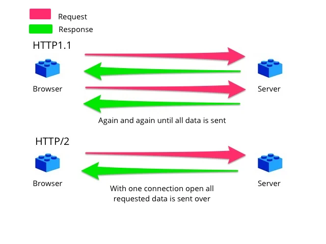
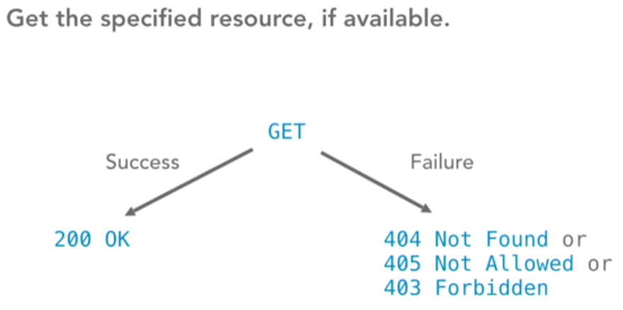
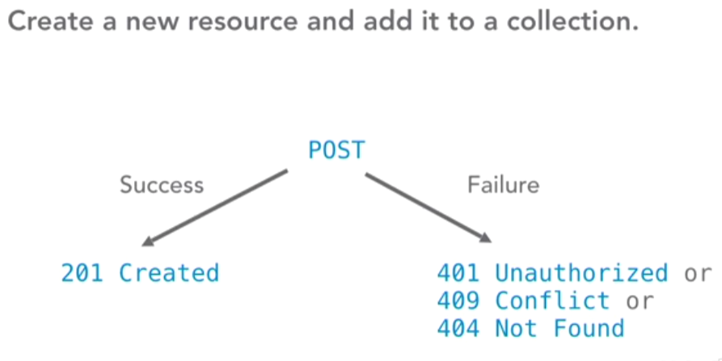
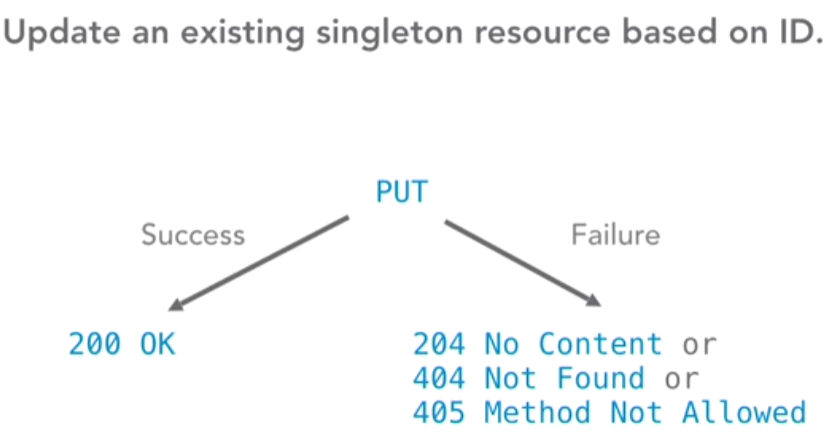
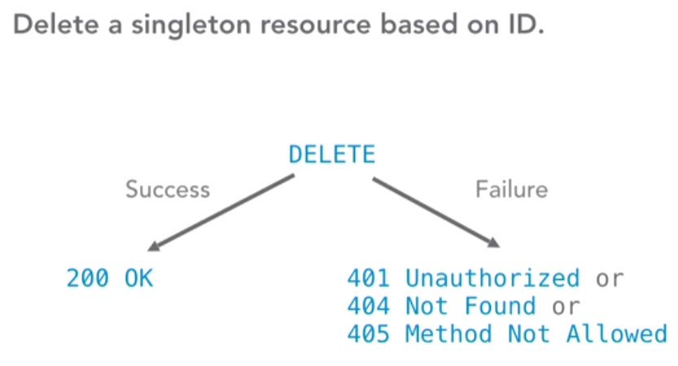
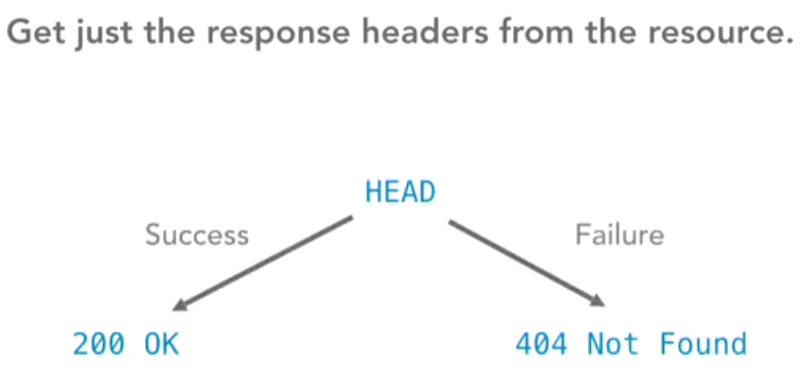
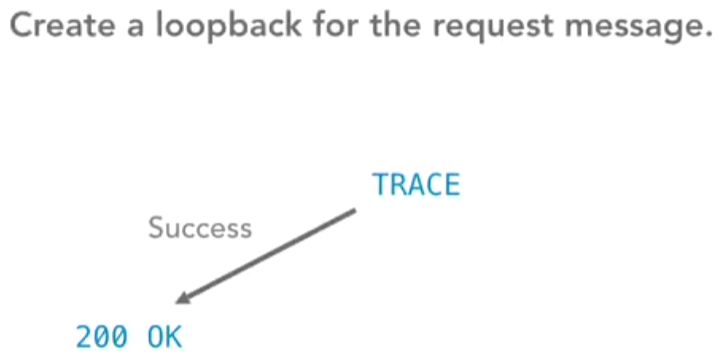
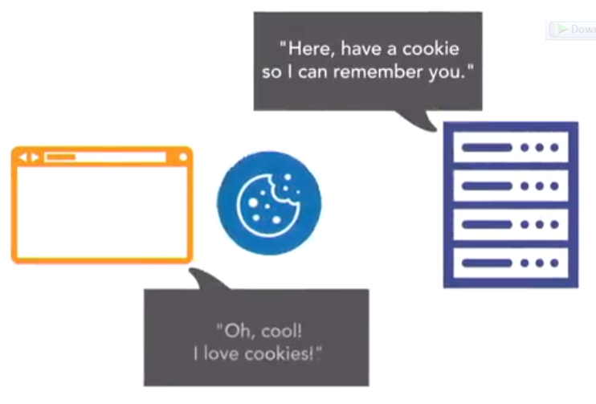
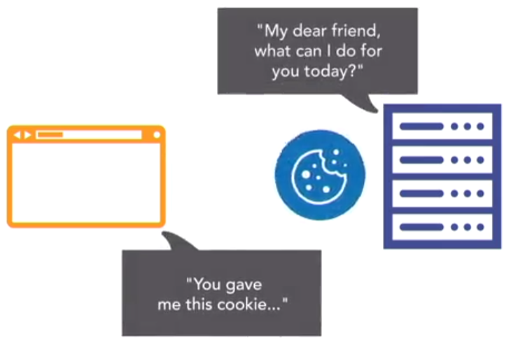

## INDEX

- [INDEX](#index)
- [HTTP](#http)
  - [HTTP/1.1 vs HTTP/2](#http11-vs-http2)
  - [URL `universal resource locator`](#url-universal-resource-locator)
- [Request / Response](#request--response)
  - [HTTP Request Methods](#http-request-methods)
    - [Content methods](#content-methods)
    - [Information-getter mtheods](#information-getter-mtheods)
  - [HTTP status messages](#http-status-messages)
- [HTTP headers](#http-headers)
  - [Cookies](#cookies)

---

## HTTP

HTTP (Hypertext Transfer Protocol), is the underlying format that is used to structure request and responses for effective communication between a client and a server.

- The message that is sent by a client to a server is what is known as an HTTP request. When these requests are being sent, clients can use various methods.
- HTTP request methods are the assets that indicate the specific desired action to be performed on a given resource.

- HTTP is a `stateless` protocol. That means each individual request sent over the protocol is unique

  - HTTP has `no memory of previous requests`. Go to a web page with a photo gallery, and it will show you the first picture. Go reload your browser or type in the URL again
  - his statelessness ensures users don't get trapped in the middle of `sequences` of content, but it also means they can't walk their way through sequences because the requests are not connected.
  - To fix this, HTTP allows `sessions`.

- `sessions` : Stored states shared between the browser and the server by passing information back and forth in the form of `cookies`.

---

### HTTP/1.1 vs HTTP/2

- `HTTP/2` is faster and more secure. It uses compression algorithms to speed up requests, allows for multi-plexing, meaning multiple files are sent over connection at the same time and requires an encrypted connection between the client and the server through `HTTPS`

- `HTTP/1` sends uncompressed headers, transfers only one file at a time over a connection, and has no default encryption.

---

### URL `universal resource locator`

is for. A URL is a human-readable address, describing exactly where on the web and in what location on a server the information you are requesting is located.

---

## Request / Response

### HTTP Request Methods

- HTTP request is an action to be performed on a resource identified by a given Request-`URL`

#### Content methods

#### Information-getter mtheods

- methods that get information from the server without really touching the content
- The `HEAD` request method is useful in recovering meta-data that is written according to the headers, without transferring the entire content. The technique is commonly used when testing hypertext links for accessibility, validity, and recent modification.

---

### HTTP status messages

---

## HTTP headers

if a client, or the server, or both, need information about the state of the other, or any other information, **we have to send that information along with our request or response** That's what HTTP headers are for.

- `HTTP header` is a human readable **name value pair** separated by a colon, added to the HTTP request or response, which can be used to pass standard or custom information back and forth between the client and the server.

### Cookies

- If a server wants, or needs, the client to remember where it has been or what state it is in, like what movie the client is currently watching. it can use a set `cookie header`, to give the client a cookie, a small piece of data.
  

- The next time the client visits the server, it sends the cookie back, and the server brings the client to the right state.

  
  
