# INDEX

- [INDEX](#index)
  - [Web Server](#web-server)
  - [Backend](#backend)
    - [API](#api)
  - [How Does a Server Work?](#how-does-a-server-work)
    - [Common HTTP Requests](#common-http-requests)
    - [Query parameters](#query-parameters)
    - [HTTP Request](#http-request)
    - [HTTP Response](#http-response)
      - [HTTP Response Status Codes](#http-response-status-codes)
  - [same origin policy ( SOP ) \& CORS](#same-origin-policy--sop---cors)
    - [Origin](#origin)
    - [SOP](#sop)
    - [Cross-Origin Resource Sharing (CORS)](#cross-origin-resource-sharing-cors)
      - [The Problem with CORS](#the-problem-with-cors)
    - [Idempotency](#idempotency)
      - [Idempotency and Security](#idempotency-and-security)
  - [REST / RESTFULL API](#rest--restfull-api)
    - [REST](#rest)
  - [CI/CD](#cicd)
    - [Continuous Integration](#continuous-integration)
    - [Continuous Delivery](#continuous-delivery)
    - [Continuous Deployment](#continuous-deployment)
    - [Pipeline](#pipeline)
    - [Github Actions](#github-actions)

---

## Web Server

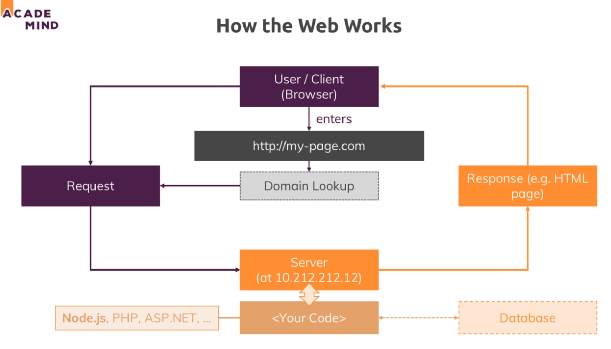
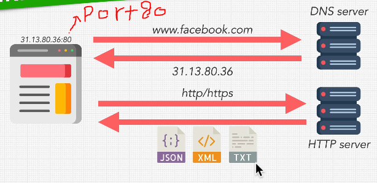

---

## Backend

- The backend is responsible for processing the requests that come into the app and managing its data.

  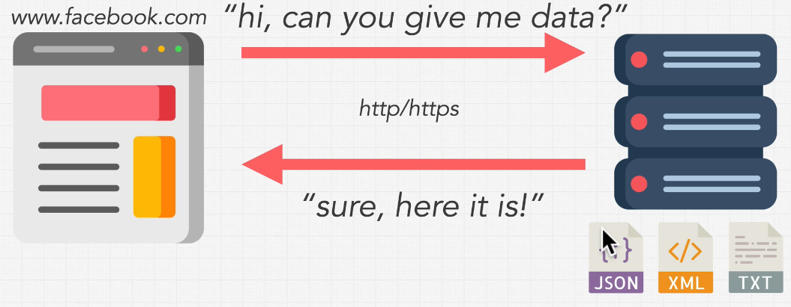

- we don't do all this in the `client-side` because we have things in server that shouldn't be done in browser like `security`,`transactions`,`authentication`

- **Backend** Consists of Three Parts:
  - `server` : the computing resource that listens to requests from the frontend
  - `Application` : code that runs on the server to process requests and return responses
  - `database` : the part of the backend that is responsible for storing and organizing data

---

### API

An API is the interface or gateway through which we interact with an external program or data set.

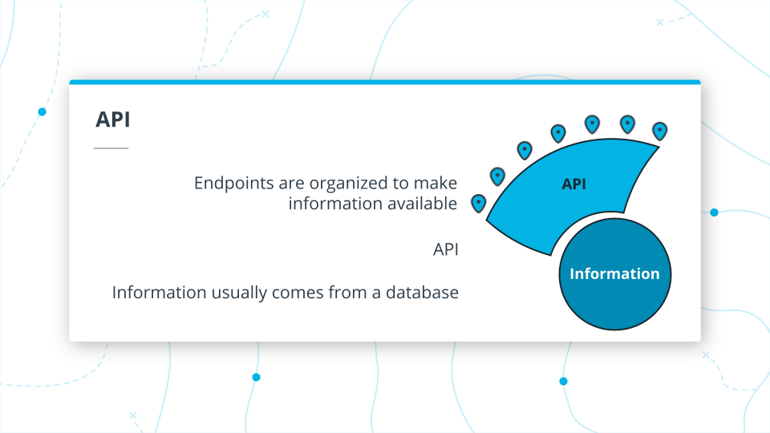

---

## How Does a Server Work?

### Common HTTP Requests

| GET    | retrieves data from the server |
| ------ | ------------------------------ |
| POST   | sends data to the server       |
| DELETE | removes data from the server   |
| PUT    | replaces data on the server    |
| PATCH  | updates data on the server     |

### Query parameters

- Query strings are parameters in the URL, identified by a `?`
- To chain multiple parameters together in a query string, use `&`


---

### HTTP Request

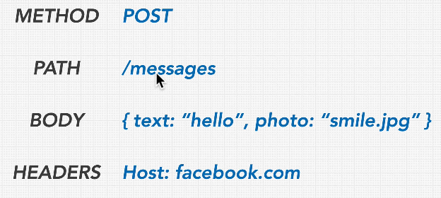

---

### HTTP Response

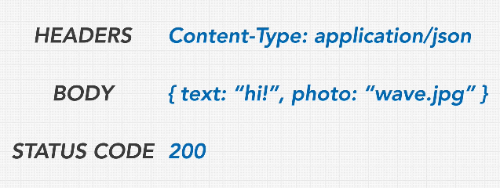

#### HTTP Response Status Codes


---

## same origin policy ( SOP ) & CORS

**The Same Origin Policy (SOP)** allows a browser to restrict access to resources relating to one origin to being permitted only via other resources from that same origin. (by default that is the behavior configured in browsers)

- both pages must agree for data exchange and must contain special JavaScript code that handles it.

- usually when using client-side on a port & server-side on another port
  - `React` : port3000
  - `node` : port8000

### Origin

- it's combination of (domain, scheme, or port)
- whenever one of these 3 changes, we get a different `origin`
  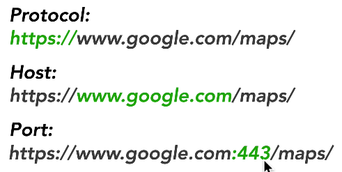
  - even if the backend & the frontend are from the same `host`, like `localhost`, but they have different ports (`3000` & `8000`), this will result CORS error

---

### SOP

- when you browse `google`, the request for `facebook` will be denied unless `google` allows it with the use of `CORS`
- this is used for protecting data
  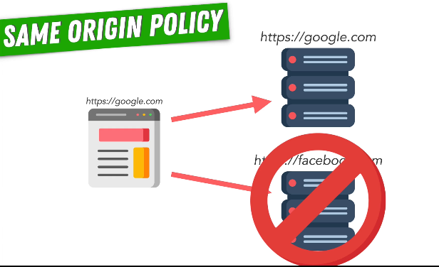

---

### Cross-Origin Resource Sharing (CORS)

- It's an important factor in making and handling API requests
- It's an **HTTP-header** based mechanism that allows a server to indicate any `origins` other than its (own origin (in the URL)) from which a browser should permit loading resources.
  

  - in the image we have 2 options :
    - to make access for all sites `*`
    - to make access to specific websites only `list of sites`

- it uses `whitelisting` instead of `blacklisting`
  - `whitelisting`: is the practice of explicitly allowing access to a particular privilege or service.
- We can use CORS as a `middleware` on a route by route basis in `EXPRESS` --> [cors](https://www.npmjs.com/package/cors)
- **You don't need it if your `frontend` & `backend` have the same domain**

#### The Problem with CORS

The most visible problem with **CORS**, besides security, is the impact on the performance in web apps. When your frontend sends an HTTP request to a different domain or subdomain, the browser will send an additional HTTP called preflight request, to see whether the server accepts messages from the sender’s domain.

So for each HTTP request triggered by the frontend, the browser needs to send two HTTP requests, increasing the overall response time. In most cases, the added delay is visible in web apps and adversely affects user experience.

---

### Idempotency

- A request is said to be idempotent when making multiple requests to the API that are `identical` produce the same result.

- The only method not considered idempotent is `POST`

- `POST` adds a new resource each time; on the other hand, `GET`, `DELETE`, `PATCH`, and `PUT` act on the same resource each time with the same result.

#### Idempotency and Security

- `Get`:

  - Safe because the database doesn’t change
  - Endpoint is stored in session history
  - Can be cached
  - Often logged

- `Post`:
  - Endpoint not stored in session history
  - Protects user data from being inadvertently exposed

---

## REST / RESTFULL API

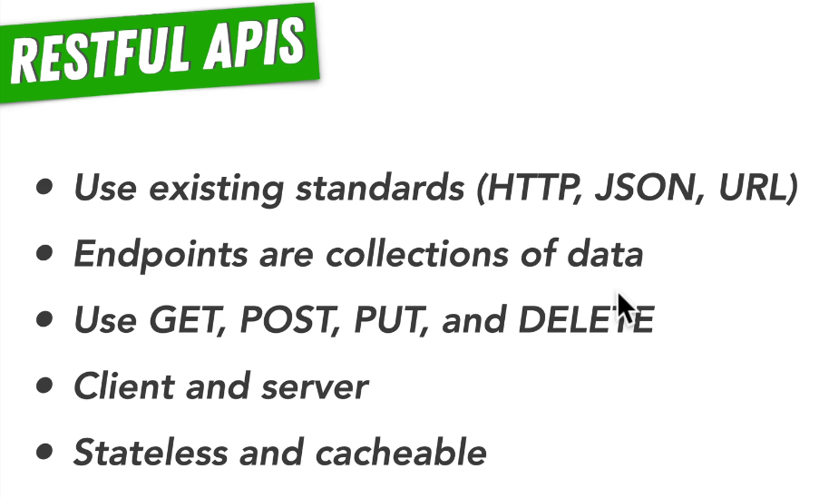

### REST

- `REST` : a pattern for organizing API endpoints
- There are five actionable RESTful routes for APIs:

  | URL `ROUTE`          | CRUD   | REST      |
  | -------------------- | ------ | --------- |
  | GET ['/cats']        | SHOW   | READ(ONE) |
  | GET ['/cats/:id']    | INDEX  | READ(All) |
  | POST ['/cats']       | CREATE | CREATE    |
  | PUT ['/cats/:id']    | UPDATE | EDIT      |
  | DELETE ['/cats/:id'] | DELETE | DELETE    |

  - `INDEX` : gets a list of all items of the requested type
    - `GET ['/cats']`
  - `SHOW` : gets a single item back by specifying an id

    - `GET ['/cats/:id']`
    - ex :

      ```ts
      app.get('/articles/:id', (_req: Request, res: Response) => {
        try {
          res.send('this is the SHOW route');
        } catch (err) {
          res.status(400);
          res.json(err);
        }
      });
      ```

- `CREATE` :
  - `POST ['/cats']`
- `EDIT` :
  - `PUT ['/cats/:id']`
- `DELETE` :
  - `DELETE ['/cats/:id']`

---

## CI/CD

CI/CD is the backbone of all modern software developments allowing organizations to develop and deploy software quickly and efficiently. It offers a unified platform to integrate all aspects of the SDLC, including separate tools and platforms from source control, testing tools to infrastructure modification, and monitoring tools.

A properly configured CI/CD pipeline allows organizations to adapt to changing consumer needs and technological innovations easily. In a traditional development strategy, fulfilling changes requested by clients or adapting new technology will be a long-winded process. Moreover, the consumer need may also have shifted when the organization tries to adapt to the change. Approaches like DevOps with CI/CD solve this issue as CI/CD pipelines are much more flexible.

### Continuous Integration

`Continuous Integration (CI)` is a development practice that requires developers to integrate code into a shared repository several times a day. Each check-in is then verified by an automated build, allowing teams to detect problems early.

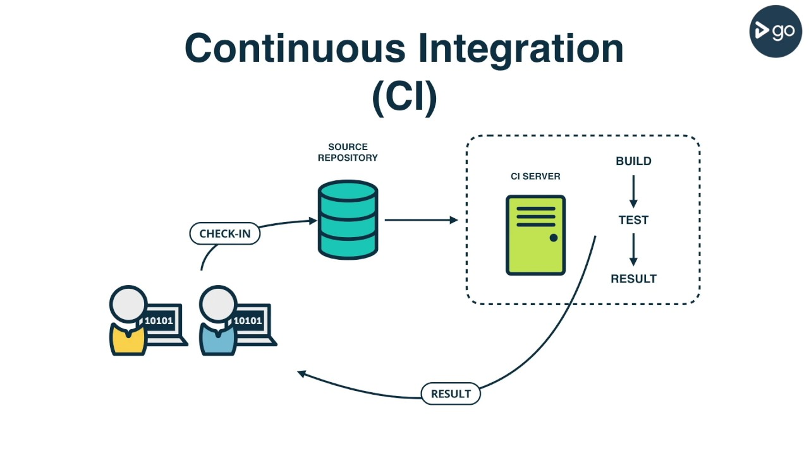

- By integrating regularly, you can detect errors quickly, and locate them more easily.

- The integration happens after a `git push` usually to a `master branch`. Then, in a dedicated `server`, an automated process builds the application and runs a set of tests to confirm that the newest code integrates with what’s currently in the master branch.

- If you’re doing CI and for some reason the integration fails, that means the broken build becomes the highest priority to fix before continuing to add more features.

---

### Continuous Delivery

`Continuous Delivery` is a step beyond Continuous Integration. Not only is your application built and tested each time a code change is pushed to the codebase, the application is also deployed continuously. However, with continuous delivery, you trigger the deployments manually.

- Continuous Delivery checks the code automatically, but it requires human intervention to manually and strategically trigger the deployment of the changes.

---

### Continuous Deployment

`Continuous Deployment` is another step beyond Continuous Integration, similar to Continuous Delivery.

The difference is that instead of deploying your application manually, you set it to be deployed `automatically`. Human intervention is not required.


---

### Pipeline

`Pipeline`: A series of automated steps (Command-Line Interface commands) that simplify the testing, building, and deployment of code.

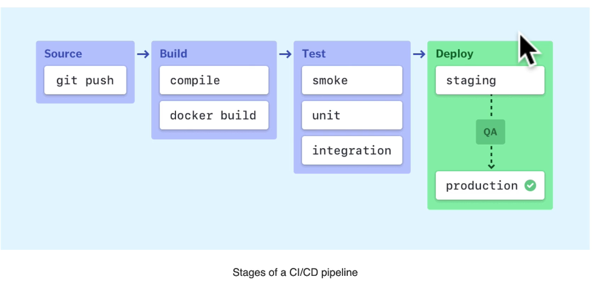

---

### Github Actions

- `ci.yml` file : contains configuration for the workflow
  - contains steps to be performed by the `Continuous Integration Server`

---
