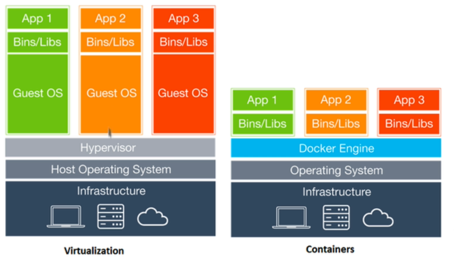

## INDEX

- [INDEX](#index)
- [Containers](#containers)
  - [Virtual Machines vs Containers](#virtual-machines-vs-containers)

---

## Containers

> **Microservices** depends on containers

- containers works on concept of **Isolation** and taking only what is necessary

### Virtual Machines vs Containers

