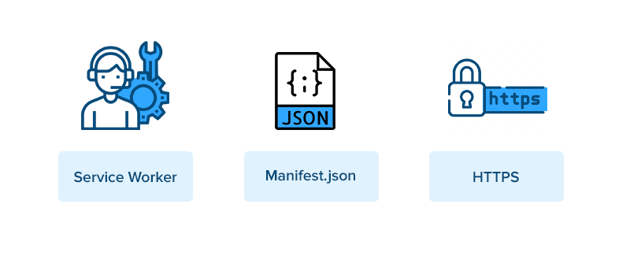

## INDEX

- [INDEX](#index)
- [Progressive Web Apps PWA](#progressive-web-apps-pwa)
  - [PWA Components](#pwa-components)
    - [Manifest](#manifest)
    - [Service Workers](#service-workers)
    - [HTTPS](#https)
- [Performance](#performance)
  - [Minimize images](#minimize-images)
  - [Critical Render PATCH](#critical-render-patch)
- [Gulp.js](#gulpjs)
  - [Gulp vs Webpack](#gulp-vs-webpack)
- [Pugjs](#pugjs)

---

## Progressive Web Apps PWA

It's a term used to describe a set of features and APIs in the browser

PWAs are better than the mobile web and offer a much faster, reliable and engaging experience. If implemented well, they offer an integrated/immersive mobile experience

- Progressive Web Apps are user experiences that have the reach of the web, and are:

  - reliable
  - fast
  - engaging

### PWA Components

#### Manifest

- It defines how the application is displayed to the user and how it gets launched. All metadata related to the app is also defined here — starting URL, full and short name, link icons, splash screen and so on.

- creating manifest -> [making app installable](https://web.dev/install-criteria/)

#### Service Workers

- It's a Javascript file that runs in the background Asynchronously
- Service workers **enable offline work mode**, background syncs and push notifications. Caching and storage APIs available to service works allow pre-caching of content. As defined on Google developer, a service worker is a script that your browser runs in the background, separate from a web page, opening the door to features that don’t need a web page or user interaction.
  
- caching 

#### HTTPS

- For security and preventing hackers from seeing your requests

---

## Performance

### Minimize images

### Critical Render PATCH

It's how the files are handled after being downloaded from the source

---

## Gulp.js

A toolkit (**Task Runner**) to automate & enhance your workflow to automate slow, repetitive workflows and compose them into efficient build pipelines.

> It's like creating the **build** folder in frameworks

Example of repeated tasks:

- Sass -> css
- Pug.js-code -> HTML-code
- minify (css, js) files
- compress images for smaller size
- automatic writing of css-prefixes
- legacy code -> ES6 code

---

### Gulp vs Webpack

Webpack is a **bundler** whereas Gulp is a **task runner**

- Simply put, Webpack is such a powerful tool that it can already perform the vast majority of the tasks you’d otherwise do through a task runner. For instance, Webpack already provides options for minification and sourcemaps for your bundle. In addition, Webpack can be run as middleware through a custom server called webpack-dev-server, which supports both live reloading and hot reloading

---

## Pugjs

It's a **templating engine** designed to render HTML in server-side technologies such as Node.js. Like any JavaScript templating engine, Pug.js supports writing **reusable** HTML code and rendering dynamic data.

> A template engine is a program which is responsible for compiling a template (that can be written using any one of a number of languages) into HTML. The template engine will normally receive data from an external source, which it will inject into the template it’s compiling.

- It's another way for writing HTML code with ability to write **HTML components**

---
