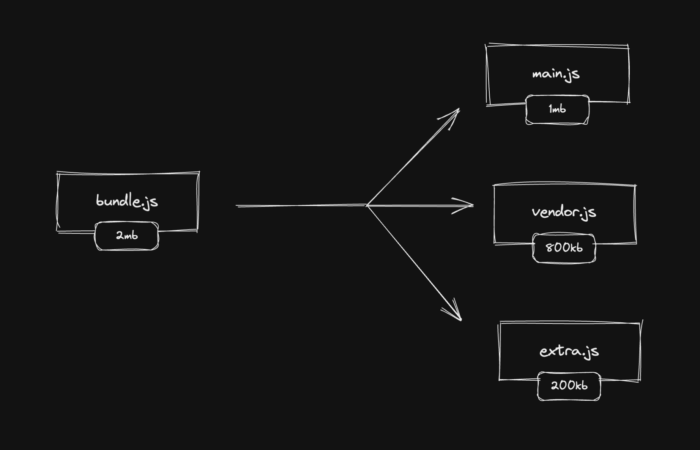

# INDEX

- [INDEX](#index)
  - [Web Browsers](#web-browsers)
    - [Architecture of web browser](#architecture-of-web-browser)
    - [Roles of Rendering Engine](#roles-of-rendering-engine)
  - [Progressive Web Apps PWA](#progressive-web-apps-pwa)
    - [PWA Components](#pwa-components)
      - [Manifest](#manifest)
      - [Service Workers](#service-workers)
      - [HTTPS](#https)
  - [Performance](#performance)
    - [Minify / Minimize files](#minify--minimize-files)
      - [Minimize images](#minimize-images)
    - [Critical Render Path](#critical-render-path)
    - [Code Splitting](#code-splitting)
    - [Tree Shaking](#tree-shaking)
    - [Avoid blocking main thread](#avoid-blocking-main-thread)
    - [Avoid memory leaks](#avoid-memory-leaks)
    - [Avoid multiple re-rendering](#avoid-multiple-re-rendering)
    - [Rollup Visualizer](#rollup-visualizer)
  - [Gulp.js](#gulpjs)
    - [Gulp vs Webpack](#gulp-vs-webpack)
  - [Pug.js](#pugjs)
  - [SEO](#seo)

---

## Web Browsers

> Reference: [How browsers work](https://web.dev/howbrowserswork/)

Web browser is a software application that enables a user to access and display web pages or other online content through its graphical user interface.

### Architecture of web browser


- **User Interface**: This component allows end-users to interact with all visual elements available on the web page. The visual elements include the `address bar`, `home button`, `next button`, and all other elements that fetch and display the web page requested by the end-user.
- **Browser Engine**: It is a core component of every web browser. The browser engine functions as an intermediary or a bridge between the user interface and the rendering engine. It queries and handles the rendering engine as per the inputs received from the user interface.
- **Rendering Engine**: It's responsible for rendering a specific web page requested by the user on their screen. It interprets `HTML` and `XML` documents along with `images` that are styled or formatted using `CSS`, and a final layout is generated, which is displayed on the user interface.
- **Networking**: This component is responsible for managing network calls using standard protocols like `HTTP` or `FTP`. It also looks after security issues associated with internet communication.
- **JavaScript Interpreter**: It's responsible for parsing and executing the JavaScript code embedded in a website.
  - Once the interpreted results are generated, they are forwarded to the rendering engine for displaying on the user interface.
- **UI Backend**: This component uses the user interface methods of the underlying operating system. It is mainly used for drawing basic widgets (windows and combo boxes).
- **Data Storage/Persistence**: It is a persistent layer. A web browser needs to store various types of data locally, for example, `cookies`. As a result, browsers must be compatible with data storage mechanisms such as `WebSQL`, `IndexedDB`, `FileSystem`, etc.

---

### Roles of Rendering Engine


Once a user requests a particular document, the rendering engine starts fetching the content of the requested document. This is done via the networking layer. The rendering engine starts receiving the content of that specific document in chunks of `8 KBs` from the networking layer. After this, the basic flow of the rendering engine begins.

The four basic steps include:

1. The requested HTML page is parsed in chunks, including the external CSS files and in style elements, by the rendering engine. The HTML elements are then converted into DOM nodes to form a “content tree” or “**DOM tree**”
2. Simultaneously, the browser also creates a **render tree**. This tree includes both the styling information as well as the visual instructions that define the order in which the elements will be displayed. The render tree ensures that the content is displayed in the desired order.
3. Further, the render tree goes through the **layout process**. When a render tree is created, the position or size values are not assigned. The entire process of calculating values for evaluating the desired position is called a **layout process**.
   - In this process, every node is assigned the exact coordinates. This ensures that every node appears at an accurate position on the screen.
4. The final step is to **paint** the screen, wherein the render tree is traversed, and the renderer’s `paint()` method is invoked, which paints each node on the screen using the UI backend layer.

> **NOTE**: every browser has its own unique rendering engine. So naturally, every browser has its own way of interpreting web pages on a user’s screen. Here’s where a challenge arises for web developers regarding the cross-browser compatibility of their website.

---

## Progressive Web Apps PWA

It's a term used to describe a set of features and APIs in the browser

PWAs are better than the mobile web and offer a much faster, reliable and engaging experience. If implemented well, they offer an integrated/immersive mobile experience


- It's a term used to describe a set of features and APIs in the browser
- Progressive Web Apps are user experiences that have the reach of the web, and are:

  - reliable
  - fast
  - engaging

- Guide to install a PWA:
  - [What does it take to be installable?](https://web.dev/install-criteria/)

### PWA Components


#### Manifest

- It defines how the application is displayed to the user and how it gets launched. All metadata related to the app is also defined here — starting URL, full and short name, link icons, splash screen and so on.

- creating manifest -> [making app installable](https://web.dev/install-criteria/)

#### Service Workers

- It's a Javascript file that runs in the background Asynchronously (separate from our code and can run in a separate thread in the background)
- Service workers **enable offline work mode**, background syncs and **push notifications**. **Caching** and **storage APIs** available to service works allow pre-caching of content. As defined on Google developer, a service worker is a script that your browser runs in the background, separate from a web page, opening the door to features that don’t need a web page or user interaction.
  
- Limitations:
  - unable to access the DOM
  - limited browser supports
- caching 
- How to create service worker:
  - option 1: manually
  - option 2: using [Workbox](https://developer.chrome.com/docs/workbox/) which is usually added to PWA plugins

#### HTTPS

- For security and preventing hackers from seeing your requests

---

## Performance


### Minify / Minimize files

- `Minify`: It's the process of removing all unnecessary characters from the source code without changing its functionality.
- `Minimize`: It's the process of reducing the size of the file by changing the format of the file.

- **Minify tools**

  - usually done in frameworks automatically to minify the javascript and css files into one file in the build phase to reduce the size/number of the files and the number of requests
  - used in `webpack`, `gulp`, `rollup`, `parcel`, etc.

#### Minimize images


- `imigx`: tool to minimize images and reduce their size and quality + cache them by `CDN`
- Images `metadata` contains information about the image such as the size, the color profile, the number of pixels, etc.
  - This information is not needed for the image to be displayed on the web page. Therefore, it can be removed to reduce the size of the image.
  - Also, it's sometimes removed by the frameworks automatically

---

### Critical Render Path

It's how the files are handled after being downloaded from the source

It's a step in the [rendering process in the browser](#web-browsers) where the browser parses the `HTML` and `CSS` files and builds the DOM and CSSOM trees. The browser then combines the DOM and CSSOM trees to form the render tree. The render tree is then used to compute the layout of each visible element and paints them on the screen.


- To improve the critical render path, we need to handle the way the browser handles the files downloading process and the way it parses the files

  - Ex: we can use `async` and `defer` attributes in the `script` tag to handle the way the browser handles the files downloading process to prevent blocking the `DOM` tree from being built

    ```html
    <script src="script.js" async></script>
    ```

  - Ex: CSS is considered a **render-blocking resource**. This means that the browser will not render any processed content until the `CSSOM` is constructed.

    - To prevent this, we can use the `preload` attribute in the `link` tag to tell the browser to download the CSS file as soon as possible without blocking the `DOM` tree from being built

      ```html
      <link rel="preload" href="style.css" as="style" />
      ```

    - Another way is to load the stylesheets manually using `JavaScript` to prevent blocking the `DOM` tree from being built

      ```js
      // add this code in the "onload" event listener of the "window" object
      const link = document.createElement('link');
      link.rel = 'stylesheet';
      link.href = 'style.css';
      document.head.appendChild(link);
      ```

    - To also improve the performance from the `css` side, we can reduce complicated specificity and reduce the number of selectors to reduce the time needed to calculate these specificities.

      ```css
      /* bad */
      .container .item .title {
        color: red;
      }

      /* good */
      .title {
        color: red;
      }
      ```

- How to measure the performance of the `js` part in the critical render path?

  - We can use the `Performance` API to measure the performance of the `js` part in the critical render path

    ```js
    // add this code in the "onload" event listener of the "window" object
    const t0 = performance.now();
    // code to be measured
    const t1 = performance.now();
    console.log(`Call to doSomething took ${t1 - t0} milliseconds.`);
    ```

  - We can also use the browser `devtools` to measure the performance of the `js` part in the critical render path

    

    - The `yellow` part is the `js` scripting part, it includes the **(parsing, compiling, executing)** parts
    - most of this time is from compiling and executing the code
      - for `compiling`, we can use "Ahead of Time `AOT`" compilation to reduce the time needed to compile the code instead of using "Just in Time `JIT`" compilation, like `Angular` does

---

### Code Splitting

It's the process of splitting the code into smaller **chunks** to reduce the size of the files and the **number of requests**




- It's also called **"Progressive bootstrapping"** or **"Lazy loading"**
- It reduces the **execution time** of the code by loading only the required code for the current page instead of loading all the code at once
- It's done using `webpack`, `rollup`, `parcel`, etc.
  
- Types:
  1. **Route-based code splitting**: splitting the code based on the routes
  2. **Component-based code splitting**: splitting the code based on the components
  3. **Dynamic code splitting**: splitting the code based on the user's actions

---

### Tree Shaking

---

### Avoid blocking main thread

---

### Avoid memory leaks

---

### Avoid multiple re-rendering

---

### Rollup Visualizer

Tool to Visualize and analyze your Rollup bundle to see which modules are taking up space.


---

## Gulp.js

A toolkit (**Task Runner**) to automate & enhance your workflow to automate slow, repetitive workflows and compose them into efficient build pipelines.

> It's like creating the **build** folder in frameworks

Example of repeated tasks:

- Sass -> css
- Pug.js-code -> HTML-code
- minify (css, js) files
- compress images for smaller size
- automatic writing of css-prefixes
- legacy code -> ES6 code

---

### Gulp vs Webpack

Webpack is a **bundler** whereas Gulp is a **task runner**

- Simply put, Webpack is such a powerful tool that it can already perform the vast majority of the tasks you’d otherwise do through a task runner. For instance, Webpack already provides options for minification and sourcemap for your bundle. In addition, Webpack can be run as middleware through a custom server called webpack-dev-server, which supports both live reloading and hot reloading


---

## Pug.js

It's a **template engine** designed to render HTML in server-side technologies such as Node.js. Like any JavaScript template engine, `Pug.js` supports writing **reusable** HTML code and rendering dynamic data.

> A template engine is a program which is responsible for compiling a template (that can be written using any one of a number of languages) into HTML. The template engine will normally receive data from an external source, which it will inject into the template it’s compiling.

- It's another way for writing HTML code with ability to write **HTML components**

---

## SEO

Search engine optimization is the practice of trying to help your site appear nearer the top of search engine results when people look for the topics that your website covers.

- At the heart of SEO is the idea of working out which terms people are likely to enter into a search engine to find your site and then using these terms in the right places on your site to increase the chances that search engines will show a link to your site in their results.
- SEO is often split into two areas:
  - **on-page techniques**
    - methods you can use on your web pages to improve their rating in search engines.
  - **off-page techniques**
    - Getting other sites to link to you
    - Search engines help determine how to rank your site by looking at the number of other sites that link to yours.
