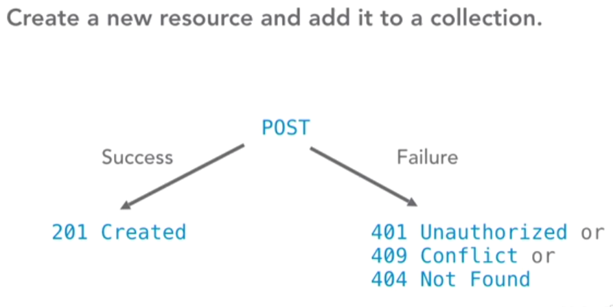
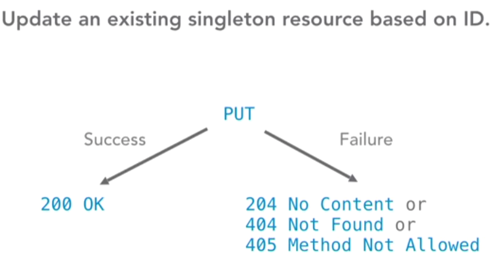
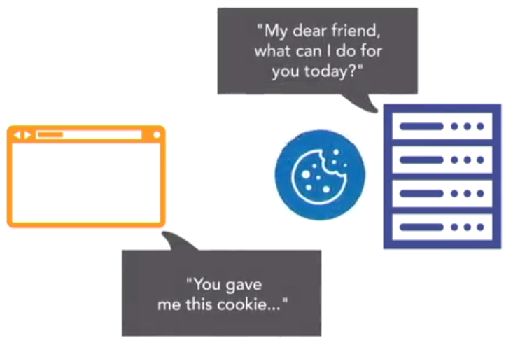
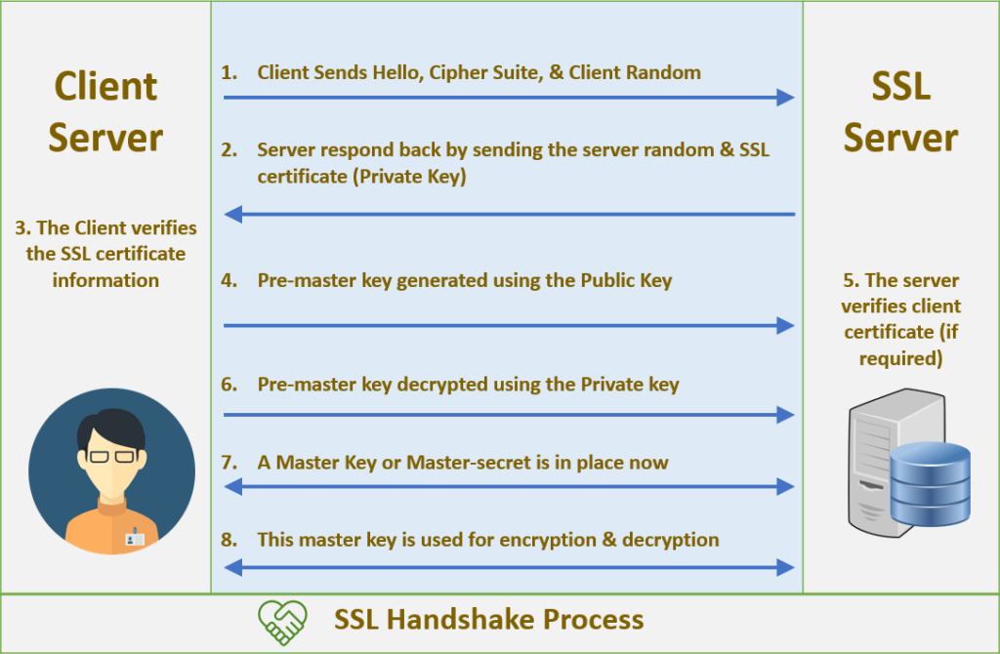

# INDEX

- [INDEX](#index)
  - [HTTP](#http)
    - [HTTP/1.1 vs HTTP/2](#http11-vs-http2)
    - [HTTP/3](#http3)
      - [Why we need HTTP/3](#why-we-need-http3)
    - [What Is QUIC](#what-is-quic)
  - [URL `universal resource locator`](#url-universal-resource-locator)
  - [Request / Response](#request--response)
    - [HTTP Request Methods](#http-request-methods)
      - [Content methods](#content-methods)
      - [Information-getter mtheods](#information-getter-mtheods)
    - [HTTP status messages](#http-status-messages)
  - [HTTP headers](#http-headers)
    - [Cookies](#cookies)
    - [Security](#security)
      - [Content Security Policy (CSP)](#content-security-policy-csp)
  - [HTTPS](#https)
    - [Handshake](#handshake)
    - [Enabling HTTPS on Your Servers](#enabling-https-on-your-servers)

---

## HTTP

HTTP (**Hypertext Transfer Protocol**), is the format used to structure request and responses for effective communication between a client and a server.

It's an application layer protocol designed to transfer information between networked devices and runs on top of other layers of the network protocol stack.

- The message that is sent by a client to a server is what is known as an HTTP request. When these requests are being sent, clients can use various methods.
- HTTP request methods are the assets that indicate the specific desired action to be performed on a given resource.

- HTTP is a **stateless** protocol. That means each individual request sent over the protocol is unique and hat each command runs independent of any other command.

  - HTTP has **no memory of previous requests**. Go to a web page with a photo gallery, and it will show you the first picture. Go reload your browser or type in the URL again
  - This statelessness ensures users don't get trapped in the middle of **sequences** of content, but it also means they can't walk their way through sequences because the requests are not connected.
  - To fix this, HTTP allows **sessions**.

- `sessions` : Stored states shared between the browser and the server by passing information back and forth in the form of `cookies`.

---

### HTTP/1.1 vs HTTP/2


- **HTTP/2** is faster and more secure. It uses compression algorithms to speed up requests, allows for multi-plexing, meaning multiple files are sent over connection at the same time and requires an encrypted connection between the client and the server through `HTTPS`

  - establish one connection over a big pipe
  - data will be broken-down and send in chunks according to the priority of the request, this is called **Multiplexing**
  - also with `HTTP/2`, the server will assume that the browser wants other files like (`css`, `js`), and will send (push) them automatically, this is called **Server Pushing**

- **HTTP/1** sends uncompressed headers, transfers only one file at a time over a connection, and has no default encryption.

---

### HTTP/3

#### Why we need HTTP/3

we didn’t really need a new HTTP version in the first place, but rather an upgrade of the underlying Transmission Control Protocol (**TCP**).

> **TCP** is the main protocol that provides crucial services such as reliability and in-order delivery to other protocols such as HTTP. It’s also one of the reasons we can keep using the Internet with many concurrent users, because it smartly limits each user’s bandwidth usage to their fair share.

TCP has been a cornerstone of the web for decades, but it started to show its age in the late 2000s. Its intended replacement, a new transport protocol named **QUIC**, differs enough from TCP in a few key ways that running HTTP/2 directly on top of it would be very difficult. As such, HTTP/3 itself is a relatively small adaptation of HTTP/2 to make it compatible with the new QUIC protocol, which includes most of the new features people are excited about.

QUIC is needed because TCP, which has been around since the early days of the Internet, was not really built with maximum efficiency in mind.

- For example, TCP requires a **handshake** to set up a new connection.
  - This is done to ensure that both client and server exist and that they’re willing and able to exchange data. It also, however, takes a full network round trip to complete before anything else can be done on a connection. If the client and server are geographically distant, each round-trip time (RTT) can take over 100 milliseconds, incurring noticeable delays.
- TCP sees all of the data it transports as a **single “file” or byte stream**.
  - even if we’re actually using it to transfer several files at the same time (for example, when downloading a web page consisting of many resources). In practice, this means that if TCP packets containing data of a single file are lost, then all other files will also get delayed until those packets are recovered.
  - This is called **head-of-line (HoL) blocking**.

HTTP/2 was adjusted in a few key areas to make it compatible with QUIC. This tweaked version was eventually named HTTP/3 (instead of HTTP/2-over-QUIC), mainly for marketing reasons and clarity. As such, the differences between HTTP/1.1 and HTTP/2 are much more substantial than those between HTTP/2 and HTTP/3.

---

### What Is QUIC

QUIC is a generic transport protocol which, much like TCP, can and will be used for many use cases in addition to HTTP and web page loading. For example, DNS, SSH, SMB, RTP, and so on can all run over QUIC.

- QUIC runs on top of yet another protocol, called the **User Datagram Protocol (UDP)**.

> **UDP** is the most bare-bones transport protocol possible. It really doesn’t provide any features, besides so-called port numbers (for example, HTTP uses port 80, HTTPS is on 443, and DNS employs port 53). It does not set up a connection with a handshake, nor is it reliable: If a UDP packet is lost, it is not automatically retransmitted. UDP’s “best effort” approach thus means that it’s about as performant as you can get: There’s no need to wait for the handshake and there’s no HoL blocking. In practice, UDP is mostly used for live traffic that updates at a high rate and thus suffers little from packet loss because missing data is quickly outdated anyway (examples include live video conferencing and gaming).

---

## URL `universal resource locator`

is for. A URL is a human-readable address, describing exactly where on the web and in what location on a server the information you are requesting is located.


---

## Request / Response

### HTTP Request Methods

- HTTP request is an action to be performed on a resource identified by a given Request-`URL`
- **HTTP method**, sometimes referred to as an HTTP verb, indicates the action that the HTTP request expects from the queried server.

#### Content methods






#### Information-getter mtheods

- methods that get information from the server without really touching the content
- The `HEAD` request method is useful in recovering meta-data that is written according to the headers, without transferring the entire content. The technique is commonly used when testing hypertext links for accessibility, validity, and recent modification.


---

### HTTP status messages

HTTP status codes are **3-digit codes** most often used to indicate whether an HTTP request has been successfully completed. Status codes are broken into the following 5 blocks:


> **304** means that you made **200OK** request then requested it again and it got you the same message (not modified), and in the server if you modified the response message and requested again it will be **200OK** again

---

## HTTP headers

if a client, or the server, or both, need information about the state of the other, or any other information, **we have to send that information along with our request or response** That's what HTTP headers are for.

- **HTTP headers** contain text information stored in key-value pairs, and they are included in every HTTP request (and response, more on that later). These headers communicate core information, such as what browser the client is using what data is being requested.

### Cookies

- If a server wants, or needs, the client to remember where it has been or what state it is in, like what movie the client is currently watching. it can use a set `cookie header`, to give the client a cookie, a small piece of data.
  

- The next time the client visits the server, it sends the cookie back, and the server brings the client to the right state.

  
  

> so in summary: the web is stateless(each request is a new one) so we need cookies to persist data over time (on each request until we expire them)

---

### Security

#### Content Security Policy (CSP)

**Content Security Policy (CSP)** is an added layer of security that helps to detect and mitigate certain types of attacks, including Cross-Site Scripting (XSS) and data injection attacks

- Browsers that don't support it still work with servers that implement it, and vice versa: browsers that don't support CSP ignore it, functioning as usual, defaulting to the standard same-origin policy for web content. If the site doesn't offer the CSP header, browsers likewise use the standard same-origin policy.
- To enable CSP, you need to configure your web server to return the `Content-Security-Policy` HTTP header.

  - Alternatively, the `<meta>` element can be used to configure a policy, for example:

    ```html
    <meta
      http-equiv="Content-Security-Policy"
      content="default-src 'self'; img-src https://*; child-src 'none';"
    />
    ```

- Configuring Content Security **Policy** involves adding the `Content-Security-Policy` HTTP header to a web page and giving it values to control what resources the user agent is allowed to load for that page.

  - For example, a page that uploads and displays images could allow images from anywhere, but restrict a form action to a specific endpoint. A properly designed Content Security Policy helps protect a page against a cross-site scripting attack.

- **Writing a policy**

  - A policy is described using a series of policy directives, each of which describes the policy for a certain resource type or policy area.
  - A policy needs to include a **default-src** or **script-src** directive to prevent inline scripts from running, as well as blocking the use of `eval()`.
  - A policy needs to include a **default-src** or **style-src** directive to restrict inline styles from being applied from a `<style>` element or a `style attribute`.

  ```js
  // wants all content to come from the site's own origin (this excludes subdomains.)
  Content-Security-Policy: default-src 'self'

  // wants to allow content from a trusted domain and all its subdomains (it doesn't have to be the same domain that the CSP is set on.)
  Content-Security-Policy: default-src 'self' example.com *.example.com

  // wants to allow users of a web application to include images from any origin in their own content, but to restrict audio or video media to trusted providers, and all scripts only to a specific server that hosts trusted code.
  Content-Security-Policy: default-src 'self'; img-src *; media-src example.org example.net; script-src userscripts.example.com
  ```

> For more info & examples -> [here](https://developer.mozilla.org/en-US/docs/Web/HTTP/CSP)

---

## HTTPS

We need HTTPS for **Privacy, integrity, and identification.**

- **Privacy** means that no one can eavesdrop on your messages.
- **Integrity** means that the message is not manipulated on the way to its destination.
  - This is often called a **man-in-the-middle attack**.
  - a manipulation could be done by a malware
- **identity** means that I can check that this message is coming from what computer.
  - When visiting a HTTPS website (ex: `www.google.com`) , the browser receives a certificate that the server is actually `google.com` and not other server who is pretending to be `google.com`
  - this is done using A digital signature attached to a message can identify the sender
  - identification means that the site that you are visiting is indeed the one you think it is.
  - HTTPS, via **SSL certificates** (secure socket layer), ensures you are connected exactly with the receiver you would expect.

HTTPS also gives us **PWA capabilities**

> a lot of websites are now using HTTPS by default, regardless if sensitive data is going to be exchanged or not. This is because Google is flagging websites as **not secure** if they're not SSL protected.

---

### Handshake

It's the negotiation between a browser and a server where they both established a secure connection to transmit messages.


During an SSL handshake, the server and the client follow the below set of steps:

1. Client Hello. The client will send the information that will be required by the server to start an HTTPS connection.
2. Server Hello
3. Server Key Exchange Message
4. SSL Certificate Request
5. SSL Client Certificate
6. Client Key Exchange Message
7. Finished.



---

### Enabling HTTPS on Your Servers

- Follow steps [here](https://web.dev/enabling-https-on-your-servers/)
