# INDEX

- [INDEX](#index)
  - [What is Internet](#what-is-internet)
    - [IP address](#ip-address)
      - [IPv6](#ipv6)
    - [Packet](#packet)
    - [SSL](#ssl)
  - [How internet works](#how-internet-works)
    - [TCP vs UDP](#tcp-vs-udp)
    - [Domain and DNS](#domain-and-dns)
      - [DNS Records](#dns-records)
    - [Hosting](#hosting)
    - [Server](#server)
  - [The Cloud](#the-cloud)
    - [Elastic computing](#elastic-computing)
  - [SSH](#ssh)
    - [How It Works](#how-it-works)
    - [Different Encryption Techniques](#different-encryption-techniques)
      - [Symmetric Encryption](#symmetric-encryption)
      - [Asymmetric Encryption](#asymmetric-encryption)
      - [Hashing](#hashing)
    - [Connecting using SSH](#connecting-using-ssh)
  - [Nginx](#nginx)
    - [Configuration](#configuration)
    - [Web server vs Application server](#web-server-vs-application-server)
  - [Security](#security)
    - [OWASP](#owasp)
  - [Web Browsers](#web-browsers)
    - [Architecture of web browser](#architecture-of-web-browser)
    - [Roles of Rendering Engine](#roles-of-rendering-engine)
    - [Performance](#performance)

---

## What is Internet

The internet has **three** basic parts:

- **The last mile**
  - is the part of the internet that connects homes and small businesses to the internet.
  - it's called **last mile** as it's the last (outer) layer of the internet where user can access
  - it also includes the towers that allow people to access the internet with their cell phones.
- **Data centers**
  - rooms full of servers that store user data and host online apps and content.
- **The backbone**
  - consists of long-distance networks — mostly on fiber optic cables — that carry data between data centers and consumers

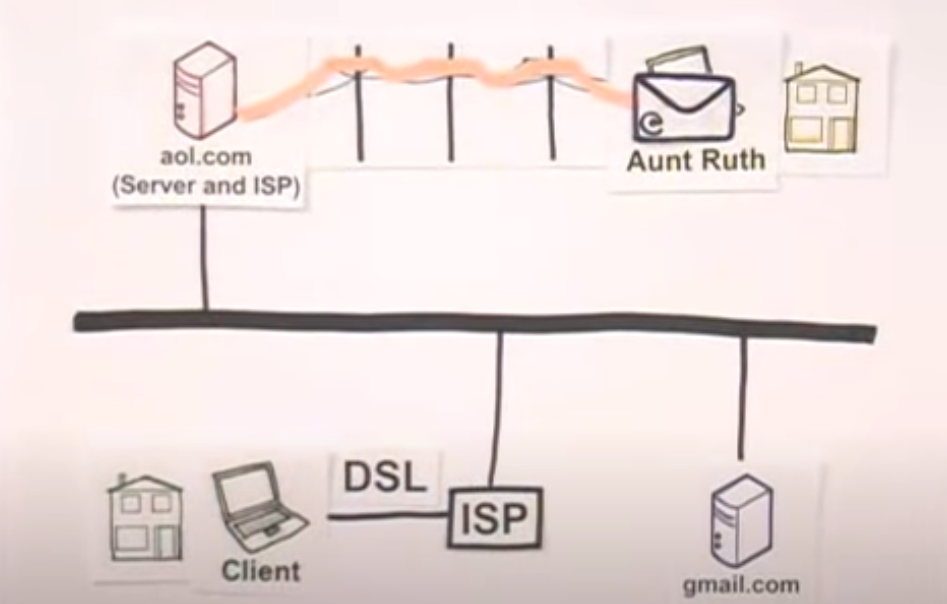
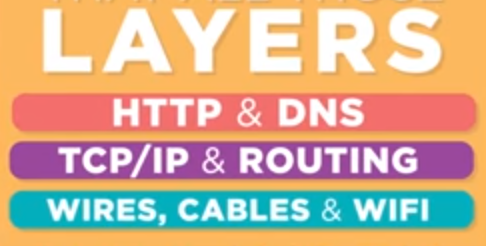

> The web is just one of many internet applications. Other popular Internet applications include email and BitTorrent.

### IP address

Internet Protocol addresses are numbers that computers use to identify each other on the internet. For example, an IP address for `vox.com` is `216.146.46.10`.

#### IPv6

- The current internet standard, known as **IPv4**, only allows for about `4 billion` IP addresses. This was considered a very big number in the 1970s, but today, the supply of IPv4 addresses is nearly exhausted.
  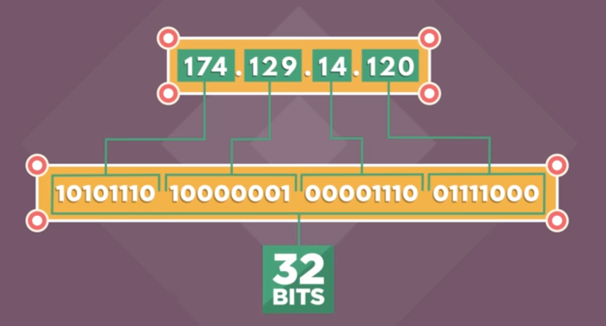
  
- internet engineers have developed a new standard called **IPv6**.
  - IPv6 allows for a big number of unique addresses — the exact figure is `39`digits long — ensuring that the world will never again run out.

---

### Packet

**packet** is the basic unit of information transmitted over the internet. Splitting information up into small, digestible pieces allows the network’s capacity to be used more efficiently.

- it contains **MetaData** (where to/from the data is sent and headers ..)

> it's:
>
> 1. breaking message into small parts
> 2. labeling these parts individually
> 3. then throwing them into the shared network (the cloud)

- A packet has two parts:
  - **header** contains information that helps the packet get to its destination, including the length of the packet, its source and destination
  - **checksum value** that helps the recipient detect if a packet was damaged in transit.
- transmission speed of packets depend on bandwidth as packet consists of bytes
  - bandwidth is number of bytes ber second
    - amount of data the hosting company will send to your site's visitors.
- in order to send the `0 / 1` data we want a way which has low data-loss and can transfer for long distances, thats why we use light and not electricity
  - light is transmitted in **fiber / copper** cables

---

### SSL

SSL, short for **Secure Sockets Layer**, is a family of encryption technologies that allows web users to protect the privacy of information they transmit over the internet.


- That **lock** is supposed to signal that third parties won't be able to read any information you send or receive.
- Under the hood, SSL accomplishes that by transforming your data into a coded message that only the recipient knows how to decipher.
  - if a malicious party is listening to the conversation, it will only see a seemingly random string of characters, not the contents of your emails, Facebook posts, credit card numbers, or other private information.

---

## How internet works

### TCP vs UDP

- TCP is a **connection**-oriented protocol (it's like saying hi and wait to see if the other side heard it)

  - TCP do this by checking the packets in the receiver part and see if they're complete and all is there
    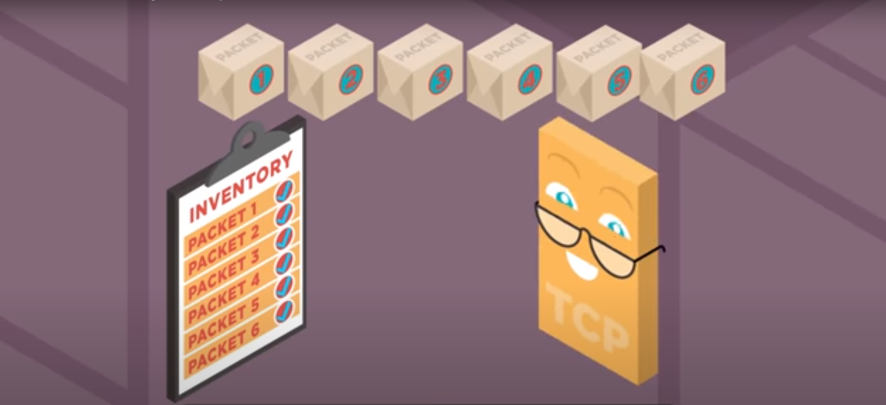
  - TCP is the main protocol that provides crucial services such as reliability and in-order delivery to other protocols such as HTTP. It’s also one of the reasons we can keep using the Internet with many concurrent users, because it smartly limits each user’s bandwidth usage to their fair share.

- UDP is a **connection-less** protocol. (it's like yelling HI! and assume that the other side heard it and keep sending data like that anyway)
- A key difference between TCP and UDP is **speed**, as TCP is comparatively slower than UDP. Overall, **UDP is a much faster**, simpler, and efficient protocol, however, retransmission of lost data packets is only possible with TCP.

> cheat sheet to check your website for debugging: use **ping**
>
> - it's like saying: `hey hey hey hey hey ...` and get back `I'm here I'm here I'm here I'm here I'm here ...`

### Domain and DNS

- **DNS**:
  - Is a server that translates the domain to the corresponding ip address to supply the specified webpage
  - It is the phone-book of the Internet
- **Domain**: Is a piece of string that helps to spot a specific web site
  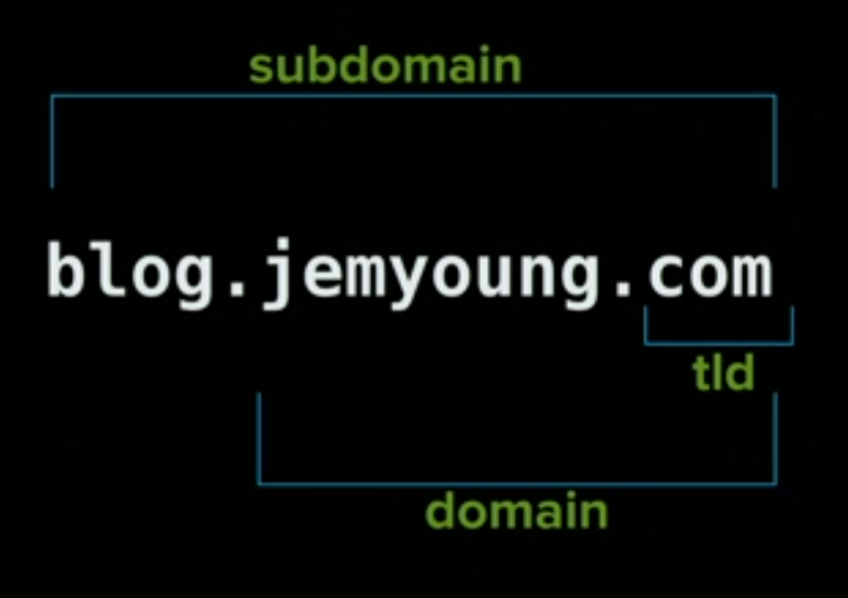

- `TLD`: top level domain
- The unique number that the DNS server returns to your computer allows your browser to contact the web server that hosts the website you requested.
- Modern web browsers are designed by default to **cache** DNS records for a set amount of time.
  - the closer the DNS caching occurs to the web browser, the fewer processing steps must be taken in order to check the cache and make the correct requests to an IP address.

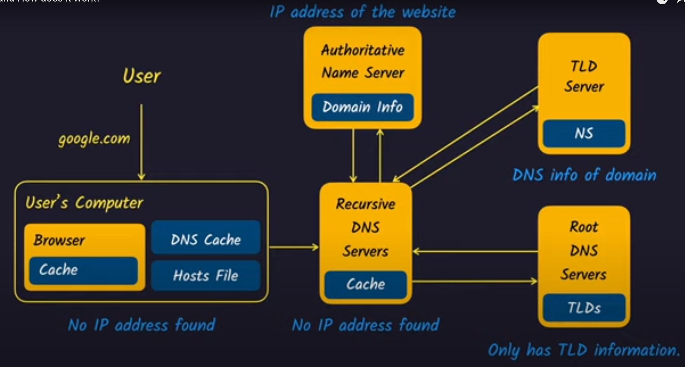

#### DNS Records

**DNS records**: they hold information related to your domain name and help people find your website, email servers, and more

**Categories**:

- **NS-records (Name Servers)**: point to your `control center` where all of your other DNS-records will live
  - ex: `GoDaddy`
  - `ns11.domaincontrol.com` or `jeff.ns.cloudflare.com`
- **A-record**: maps name(**the Domain name that you bought**) to IP address -> `www.jemyoung.com` maps to `23.23.185.61`
- **CNAME-record**: maps name(subDomain) to name(id) -> `blog.jemyoung.com` maps to `www.jemyoung.com` then to `23.23.185.61`
- **MX-record**: it's for mail exchanger
- **TXT-record**: text record, allows for adding text to domain name

> You can check that using command: **dig**
> you can look up domain using [mxtoolbox.com](https://mxtoolbox.com/)
> for more detailed info -> [watch this great video](https://www.youtube.com/watch?v=YV5tkQYcvfg)

---

### Hosting

Shared Hosting vs. VPS (virtual private server) Hosting vs. Dedicated Server
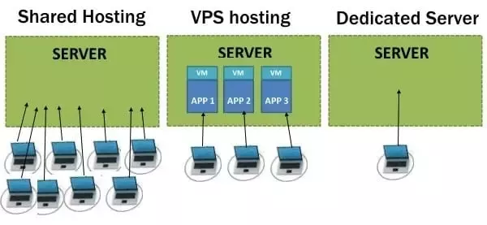

---

### Server

It serves data or receives requests

> Note: we usually select port 8080 as it's a high number in the upper end and there's a big chance that it't not occupied

---

## The Cloud

### Elastic computing

it enables you to take more resources for your services when needed

- **Load balancers** -> elastics and comprises based on your needs

---

## SSH

**Secure Socket Shell (SSH)**: is a network protocol that allows users to access, control, and modify their remote servers over the internet.

- It's a **secure way to access a computer over an unsecured network**.
- It depends on 2 keys
  - Public key (`.pub`)
    - used to encrypt (lock) data (message)
    - the remote server (cloud) uses this
  - Private Key
    - your computer/server uses this to **ssh into the server that have the public key**
    - it's used to decrypt data and have access (open a box locked with the public key pair.)

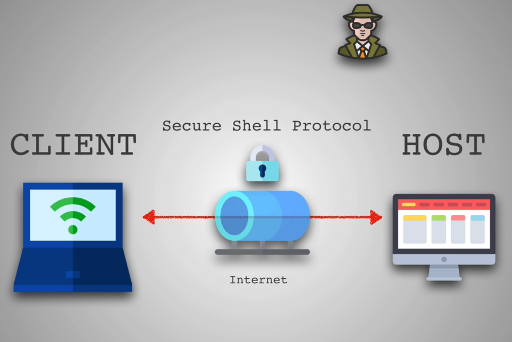

> This is great not only for privacy, but also for **identification** since we know for sure that only the owner of the 2 keys can open the message.

### How It Works

- The most popular SSH client is **PuTTY**

The **SSH command** consists of 3 distinct parts:

```sh
ssh {user}@{host}

# Ex:
ssh -i <location_of_Private_key> root@165.22.140.238
```

> You can add your private key to keyChain to prevent writing it each time
> 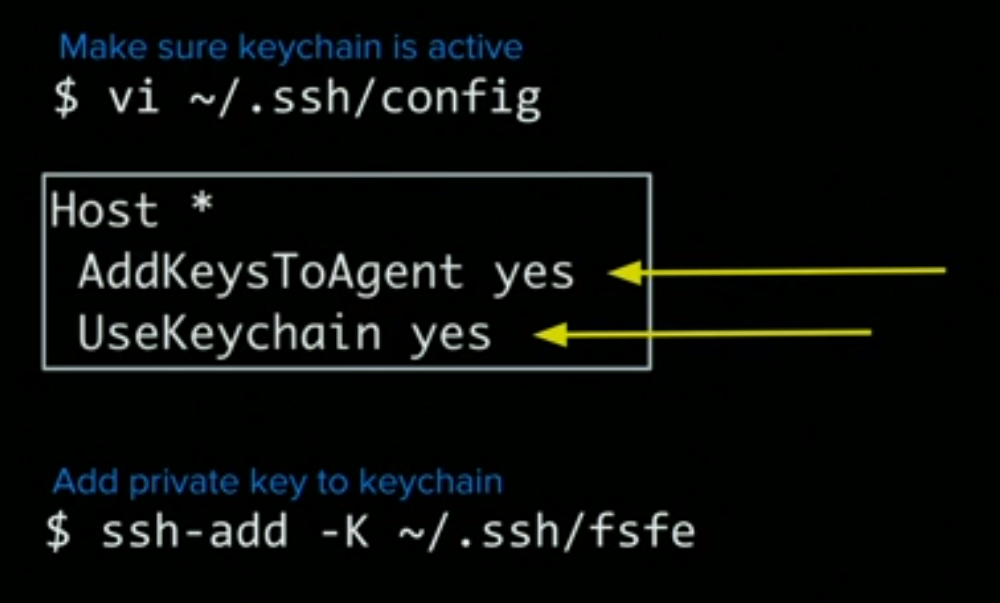

---

### Different Encryption Techniques

1. Symmetrical encryption
2. Asymmetrical encryption
3. Hashing

#### Symmetric Encryption

is a form of encryption where a secret key is used for both encryption and decryption of a message by both the client and the host.


> Symmetrical encryption is often called **shared key** or **shared secret encryption**.

#### Asymmetric Encryption

Unlike symmetrical encryption, asymmetrical encryption uses two separate keys for encryption and decryption. These two keys are known as the **public key** and the **private key**. Together, both these keys form a public-private key pair.

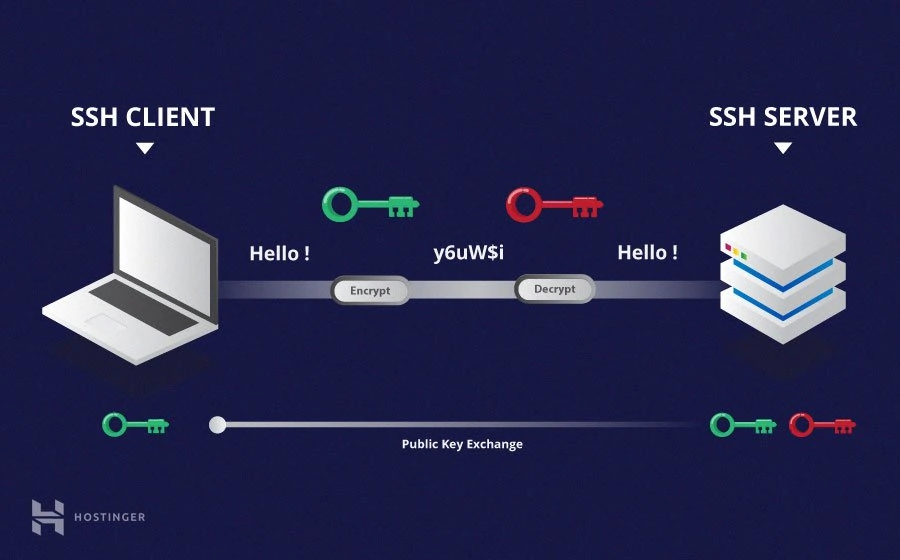

> A public key can be used by any individual to encrypt a message and can only be decrypted by the recipient who possesses their particular private key, and vice versa.

#### Hashing

One-way-hash functions differ from the above two forms of encryption in the sense that they are never meant to be decrypted. They generate a unique value of a fixed length for each input that shows no clear trend which can be exploited. This makes them practically impossible to reverse.

---

### Connecting using SSH

- You can use the password provided but it can be compromised by hacker
- You can Create SSH Keys -> **rsa**

---

## Nginx

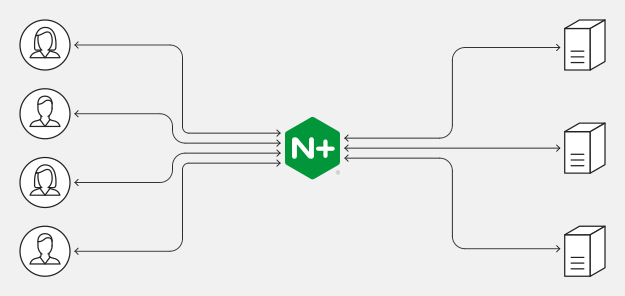
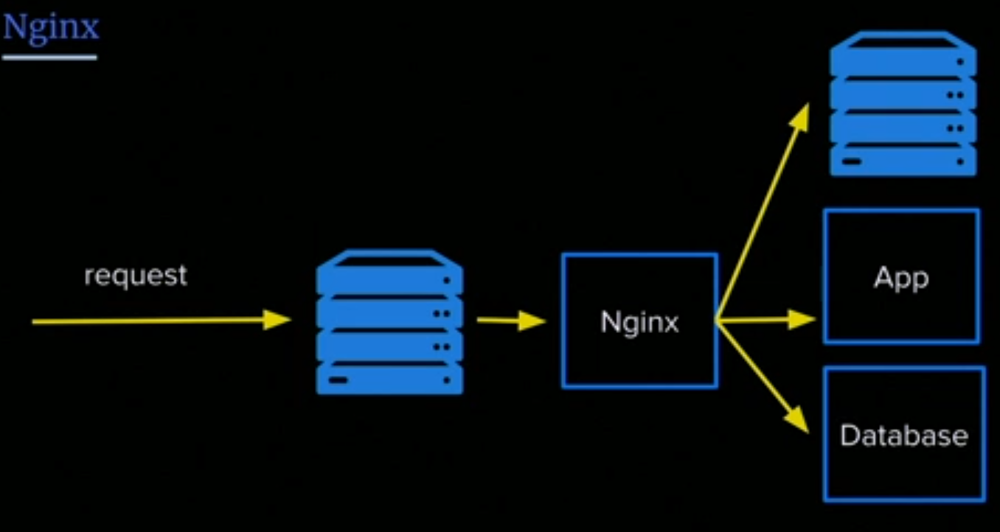

NGINX is open source software for **web serving**, **reverse proxying**, **caching**, **load balancing**, **media streaming**, and more.

- NGINX can also function as a **proxy server** for email (IMAP, POP3, and SMTP) and a **reverse proxy** and **load balancer** for HTTP, TCP, and UDP servers.
- when you go to a domain/DNS of a local/remote running server -> nginx says hey, I know where to go, I will direct you to the default page or what page is in configuration
  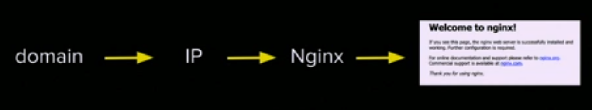
- it works on **port 80** in default
- you can add **HTTPS** to nginx using [Certbot](https://certbot.eff.org/)
  - it will modify your nginx configuration

> **proxy server** is a go‑between or intermediary server that forwards requests for content from multiple clients to different servers across the Internet.

### Configuration

- **Redirect** -> for redirecting to a temporary/permanent page in case of a certain response code (`ex: 404`)
- **Subdomain** :
  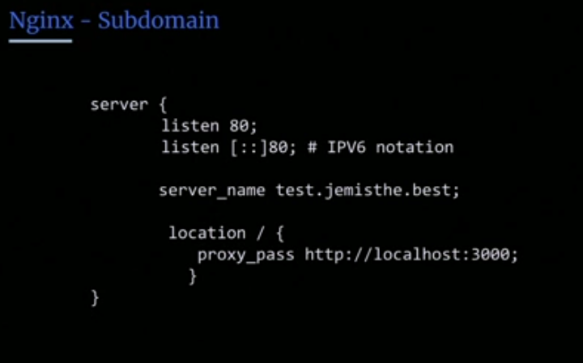
- **Gzip settings** -> for file-compression and performance and power

### Web server vs Application server

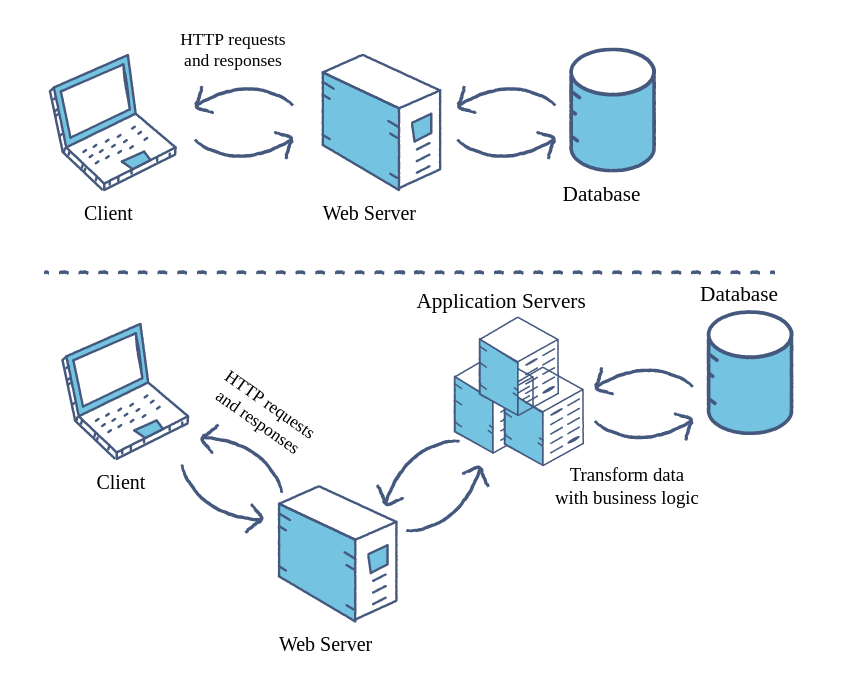

**Web server**: accepts and fulfills requests from clients for **static content** (i.e., HTML pages, files, images, and videos) from a website. Web servers handle HTTP requests and responses only.

- Ex: `nginx`

**Application server**: exposes **business logic** to the clients, which generates dynamic content. - It is a software framework that transforms data to provide the specialized functionality offered by a business, service, or application. Application servers enhance the interactive parts of a website that can appear differently depending on the context of the request.

- EX: `node.js`

---

## Security

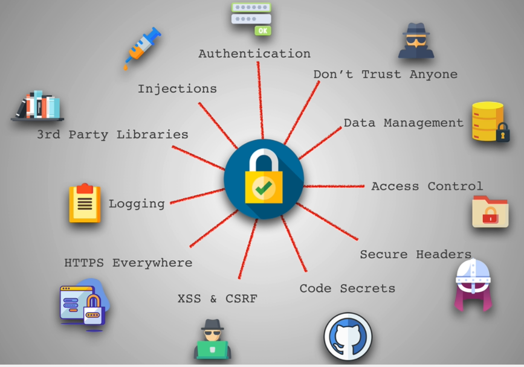

- **Firewall**: a network security device that monitors incoming and outgoing network traffic and decides whether to allow or block specific traffic based on a defined set of security rules

> You can see security overview for any site from the **devtools**

---

### OWASP

**Open Web Application Security Project (OWASP)**: is an an online community that produces articles, methodologies, documentation, tools, and technologies in the field of web application security.

- **OWASP Top 10** is the list of the 10 most common application vulnerabilities. It also shows their risks, impacts, and countermeasures. Updated every three to four years, these're the ones for 2021:
  - `Injection`
    - A code injection happens when an attacker sends invalid data to the web application with the intention to make it do something that the application was not designed/programmed to do.
    - the most common example around this security vulnerability is the **SQL query consuming untrusted data**
    - The core of a code injection vulnerability is the lack of **validation** and **sanitization** of the data used by the web application
  - `Broken authentication`
    - A broken authentication vulnerability can allow an attacker to use manual and/or automatic methods to try to gain control over any account they want in a system – or even worse – to gain complete control over the system.
    - Broken authentication usually refers to logic issues that occur on the application authentication’s mechanism, like bad session management prone to username enumeration – when a malicious actor uses brute-force techniques to either guess or confirm valid users in a system.
    - To minimize broken authentication risks -> **avoid leaving the login page for admins publicly accessible to all visitors of the website**
      - ex:
        - `/administrator on Joomla!`
        - `/wp-admin/ on WordPress`
      - **brute force** is the act of trying many possible combinations
  - `Sensitive data exposure`
    - It consists of compromising data that should have been protected (Credentials, Credit card numbers, Social Security Numbers, ...)
    - one way to protect it on a website is by having an **SSL certificate**.
  - `XML external entities (XXE)`
    - is a type of attack against an application that parses **XML** input. This attack occurs when XML input containing a reference to an external entity is processed by a weakly configured XML parser.
  - `Broken access control`
    - In website security, access control means putting a limit on what sections or pages visitors can reach, depending on their needs.
  - `Security misconfigurations`
  - `Cross site scripting (XSS)`
    - XSS attacks consist of injecting malicious client-side scripts into a website and using the website as a propagation method.
    - The risks behind XSS is that it allows an attacker to inject content into a website and modify how it is displayed, forcing a victim’s browser to execute the code provided by the attacker while loading the page.
  - `Insecure deserialization`
    - The process of **serialization** is converting objects to byte strings.
    - The process of **deserialization** is converting byte strings to objects.
  - `Using components with known vulnerabilities`
  - `Insufficient logging and monitoring`

> - For more details->
>   - [OWASP Top 10 Security Risks](https://sucuri.net/guides/owasp-top-10-security-vulnerabilities-2020/)
>   - [Brute Force Attack](https://sucuri.net/guides/what-is-brute-force-attack/)
> - OWASP Web Application Security Testing Checklist -> [here](https://github.com/0xRadi/OWASP-Web-Checklist)

---

## Web Browsers

Web browser is a software application that enables a user to access and display web pages or other online content through its graphical user interface.

### Architecture of web browser

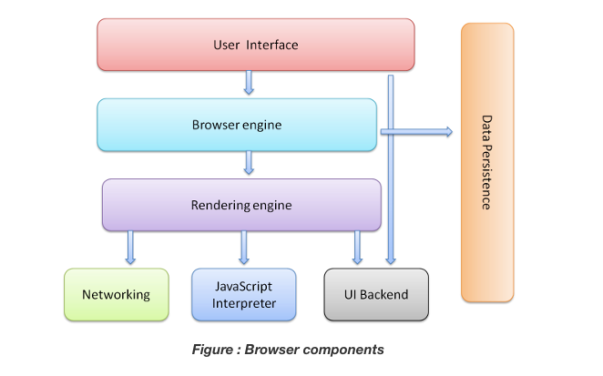

- **User Interface**: This component allows end-users to interact with all visual elements available on the web page. The visual elements include the `address bar`, `home button`, `next button`, and all other elements that fetch and display the web page requested by the end-user.
- **Browser Engine**: It is a core component of every web browser. The browser engine functions as an intermediary or a bridge between the user interface and the rendering engine. It queries and handles the rendering engine as per the inputs received from the user interface.
- **Rendering Engine**: As the name suggests, this component is responsible for rendering a specific web page requested by the user on their screen. It interprets HTML and XML documents along with images that are styled or formatted using CSS, and a final layout is generated, which is displayed on the user interface.
- **Networking**: This component is responsible for managing network calls using standard protocols like `HTTP` or `FTP`. It also looks after security issues associated with internet communication.
- **JavaScript Interpreter**: As the name suggests, it is responsible for parsing and executing the JavaScript code embedded in a website.
  - Once the interpreted results are generated, they are forwarded to the rendering engine for displaying on the user interface.
- **UI Backend**: This component uses the user interface methods of the underlying operating system. It is mainly used for drawing basic widgets (windows and combo boxes).
- **Data Storage/Persistence**: It is a persistent layer. A web browser needs to store various types of data locally, for example, `cookies`. As a result, browsers must be compatible with data storage mechanisms such as `WebSQL`, `IndexedDB`, `FileSystem`, etc.

---

### Roles of Rendering Engine


Once a user requests a particular document, the rendering engine starts fetching the content of the requested document. This is done via the networking layer. The rendering engine starts receiving the content of that specific document in chunks of `8 KBs` from the networking layer. After this, the basic flow of the rendering engine begins.

The four basic steps include:

1. The requested HTML page is parsed in chunks, including the external CSS files and in style elements, by the rendering engine. The HTML elements are then converted into DOM nodes to form a “content tree” or “**DOM tree**”
2. Simultaneously, the browser also creates a **render tree**. This tree includes both the styling information as well as the visual instructions that define the order in which the elements will be displayed. The render tree ensures that the content is displayed in the desired order.
3. Further, the render tree goes through the **layout process**. When a render tree is created, the position or size values are not assigned. The entire process of calculating values for evaluating the desired position is called a **layout process**.
   - In this process, every node is assigned the exact coordinates. This ensures that every node appears at an accurate position on the screen.
4. The final step is to **paint** the screen, wherein the render tree is traversed, and the renderer’s `paint()` method is invoked, which paints each node on the screen using the UI backend layer.

> **NOTE**: every browser has its own unique rendering engine. So naturally, every browser has its own way of interpreting web pages on a user’s screen. Here’s where a challenge arises for web developers regarding the cross-browser compatibility of their website.

---

### Performance

- Fast sites provide better user experiences. Users want and expect web experiences with content that is fast to load and smooth to interact with.
  - Two major issues in web performance are understanding issues having to do with **latency** and issues having to do with the fact that for the most part, **browsers are single threaded**.
  - Web performance can be improved by understanding the single-threaded nature of the browser and minimizing the main thread's responsibilities, where possible and appropriate, to ensure rendering is smooth and responses to interactions are immediate.
