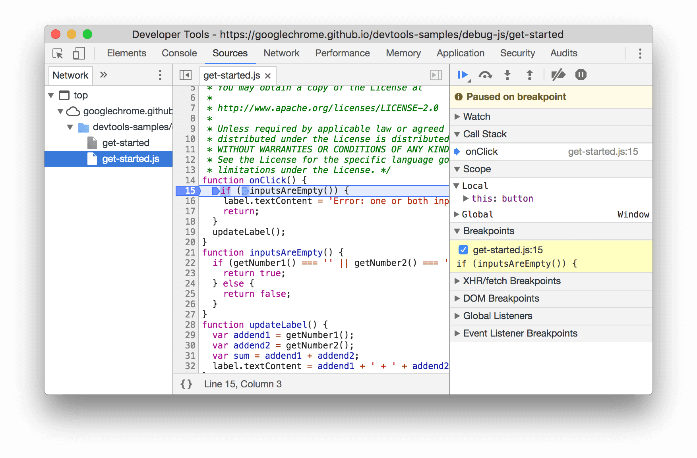

# INDEX

- [INDEX](#index)
  - [Intro](#intro)
  - [HTML \& CSS \& Sass](#html--css--sass)
    - [HTML \& CSS](#html--css)
    - [SCSS \& Sass](#scss--sass)
    - [Tailwind CSS](#tailwind-css)
    - [Bootstrap](#bootstrap)
  - [JavaScript](#javascript)
    - [General JavaScript programming language questions](#general-javascript-programming-language-questions)
    - [JS Web APIs](#js-web-apis)
  - [Frontend Dev](#frontend-dev)
  - [Frontend](#frontend)
    - [Frontend Rendering](#frontend-rendering)
    - [Frontend Performance](#frontend-performance)
    - [Micro Frontends](#micro-frontends)
    - [Internationalization (i18n) and Localization (l10n)](#internationalization-i18n-and-localization-l10n)
  - [FE Frameworks](#fe-frameworks)
    - [Vue](#vue)
    - [Next.js](#nextjs)

---

## Intro

This file summarizes key topics in this repository (Learning Notes) to be used as a quick reference guide for interviews or study purposes.

---

## HTML & CSS & Sass

### HTML & CSS

- **What is the default mode for rendering HTML pages?**

  - The default mode for rendering HTML pages is **Quirks Mode** if no `<!DOCTYPE html>` declaration is present. This mode emulates older browser behavior for compatibility with legacy content. If a proper DOCTYPE is specified, the browser renders in **Standards Mode**.

- **Rendering Modes in Browsers:**

  - **Standards Mode (Strict Mode):** Adheres to W3C/WHATWG specifications.
  - **Quirks Mode:** Emulates older browsers for backward compatibility.
  - **Almost Standards Mode:** Similar to standards but allows some quirks (e.g., box model differences, and table cell spacing).
  - **DOCTYPE declaration** affects rendering mode:
    - `<!DOCTYPE html>` ensures "standards mode".
    - Older or missing DOCTYPE may trigger "quirks mode".
    - The `<!DOCTYPE>` declaration tells the web browser which version of HTML (or sometimes XHTML) the web page is written in. This helps the browser understand how to interpret and render the content of the page.

- **is doctype is case sensitive ?**

  - No, the `<!DOCTYPE html>` declaration is not case-sensitive. It can be written in any combination of uppercase and lowercase letters, such as `<!doctype html>`, `<!Doctype HTML>`, etc. However, it is common practice to use lowercase for consistency and readability.

- **What is HTML?**

  - HTML (HyperText Markup Language) is the standard markup language used to create web pages. It provides the structure and layout of a webpage by using various elements and tags to define content such as headings, paragraphs, images, links, and more.

- **Why "Hyper" and why "Markup"?**

  - **Hyper:** Refers to hypertext (linked documents).
  - **Markup:** Tags structure the document (e.g., `<p>`, `<h1>`, ``).

  > So, "HyperText Markup Language" (HTML) essentially describes a language that allows you to create documents with text that contains links (hypertext) and to structure and format this text using tags (markup). This combination of hypertext and markup is what makes HTML such a powerful tool for creating and sharing content on the web

- **Why are semantic elements important?**

  - **Accessibility:** Helps screen readers.
  - **SEO:** Improves search engine understanding.
  - **Maintainability:** Enhances code readability.
  - **Consistency:** Encourages consistent structures.

- **Types of elements in HTML:**

  - **Block-level:** `<div>`, `<p>`, `<ul>`, etc.
    - They're elements that take up the full width available, starting on a new line.
  - **Inline:** `<span>`, `<a>`, ``, etc.
    - They're elements that only take up as much width as necessary and do not start on a new line.
  - **Inline-block:** Mix of inline and block.
    - They're elements that are formatted like inline elements, and have properties of block elements, allowing you to set width and height.
  - **Void:** Self-closing (`<br>`, ``, etc.).
    - They're elements that do not have a closing tag and do not contain any content.
  - **Semantic:** `<header>`, `<main>`, etc.
    - They're elements that clearly describe their meaning in a human- and machine-readable way.
  - **Form-related / Table-related**
    - They're elements used for structuring and displaying tabular or form data, such as `<form>`, `<table>`, `<tr>`, `<td>`, etc.

- **Are HTML elements and tags the same?**

  - **Tags:** Markup syntax used to define the beginning and end of an element. like `<p>` and `</p>`.
  - **Elements:** are composed of tags and the content they enclose, representing the actual
    structure and meaning within an HTML document.

- **Root of the document:**

  - `<html>` is the root container of an HTML document, enclosing all other elements.

- **Meta tag that enables media query:**

  ```html
  <meta name="viewport" content="width=device-width, initial-scale=1.0" />
  ```

  - `meta` is used to define metadata about the HTML document, such as character set, viewport settings, and more.
  - `name="viewport"` specifically controls the layout on mobile devices by setting the width and initial scale of the viewport.
  - `content="width=device-width, initial-scale=1.0"` sets the viewport width to the device's width and the initial zoom level to 1.0, ensuring proper scaling on different devices.

- **Types of `<meta>` tags:**

  - `charset`
    - Defines the character encoding for the HTML document (e.g., `<meta charset="UTF-8">`).
  - `viewport`
    - Controls the layout on mobile devices (e.g., `<meta name="viewport" content="width=device-width, initial-scale=1.0">`).
    - It is crucial for creating responsive web designs that adapt to different screen sizes and orientations.
  - `description`
    - Provides a brief description of the page's content for search engines (e.g., `<meta name="description" content="This is a sample webpage.">`).
  - `author`
    - Specifies the author of the document (e.g., `<meta name="author" content="John Doe">`).
  - `robots`
    - Controls how search engines index the page (e.g., `<meta name="robots" content="index, follow">`).
  - `refresh`
    - Automatically refreshes the page after a specified time (e.g., `<meta http-equiv="refresh" content="30">`).

- **What is meta viewport?**

  - Controls layout on mobile by defining viewport size and scale.

- **Why is meta viewport important?**

  > It's essential for ensuring that your web pages are responsive and mobile-friendly. It allows you to control how the page is displayed on different devices, optimizing the user experience across various screen sizes and orientations.

  - Enables **responsive design**.
  - Ensures **mobile optimization** and **better UX**.
    - Without the `viewport` meta tag, mobile browsers may render the page as if it were a desktop site, leading to content appearing too small or being zoomed out, which can degrade the user experience.

- **Why does HTML5 exist?**

  - HTML5 exists primarily to address the evolving needs of web developers and users, offering new features, improved functionality, and better support for multimedia and interactivity. Several key reasons why HTML5 was developed include

  - Adds support for:
    - Multimedia support (`<audio>`, `<video>`) eliminating the need for third-party plugins like `Flash`
    - Semantic tags
    - Forms enhancements (intruduced new input types like `email`, `date`, etc. and new attributes like `placeholder`, `required`, etc.)
    - Canvas and SVG -> This enables richer visualizations, interactive games, and animations without relying on external plugins.
      - `canvas` element for dynamic graphics rendering
      - `svg` for scalable vector graphics (used mainly for icons and illustrations)
    - Offline storage Capabilities
      - Local storage and session storage APIs for client-side data persistence
      - Application cache for offline web applications (`AppCache`)
    - Responsive design and cross-platform compatibility
      - HTML5 introduced features like the `viewport` meta tag, which allows developers to control how web pages are displayed on different devices, ensuring a consistent and user-friendly experience across desktops, tablets, and smartphones.
    - APIs for geolocation
      - Geolocation API for accessing user location data
    - Backward compatibility with older HTML versions
      - HTML5 was designed to be backward compatible with previous versions of HTML, allowing developers to gradually adopt new features without breaking existing content.

- **What is the default behavior of `button` element?**

  - The default behavior of the `<button>` element is to submit a form when clicked, unless its `type` attribute is set to `"button"`. If the `type` attribute is not specified, it defaults to `"submit"`.

- **How can you prevent a button from submitting a form?**

  - To prevent a button from submitting a form, you can set its `type` attribute to `"button"` instead of the default `"submit"`.

    ```html
    <button type="button">Click Me</button>
    ```

  - Alternatively, you can use JavaScript to prevent the default action when the button is clicked:

    ```html
    <button onclick="event.preventDefault();">Click Me</button>
    ```

- **CSS `display` values:**

  - It determines how an element is displayed on the page and how it interacts with other elements in the document flow.
  - Common values include:
    - `block`: Element starts on a new line, takes full width.
    - `inline`: Element does not start on a new line, only takes as much width as necessary.
    - `inline-block`: Element behaves like an inline element but allows setting width and height.
    - `none`: Element is not displayed and does not take up space.
    - `flex`: Enables flexible box layout for responsive designs.
    - `grid`: Enables grid layout for two-dimensional layouts.
    - `table`, `list-item`, etc.: Other display types for specific use cases.

- **Difference between `display: none`, `visibility: hidden`, and `opacity: 0`:**

  - `display: none`
    - Removes element entirely from the document flow (not rendered, no space occupied, not accessible via screen readers).
    - Use case: Hiding elements that should not be displayed at all, such as in responsive designs or when toggling visibility.
  - `visibility: hidden`
    - Hides element but keeps its space in the layout (still occupies space, but not visible, accessible via screen readers as it's still in the DOM).
    - Use case: Temporarily hiding elements while maintaining layout, such as in dropdown menus or tooltips, also animations where you want to hide an element without affecting the layout.
  - `opacity: 0`
    - Makes element fully transparent but still visible in the layout (still occupies space, accessible via screen readers).
    - Use case: Creating fade-out effects or transitions where you want the element to remain in the layout but not visible to the user.

- **Difference between `inline` and `inline-block`:**

  - `inline`:
    - Cannot set width/height.
    - Does not start on a new line.
    - Margins and paddings only affect horizontal spacing.
  - `inline-block`:
    - Behaves inline but accepts block properties.
    - Can set width/height.
    - Starts on the same line but allows vertical margins and paddings.

- **CSS `position` types:**

  - `static` (default), element is positioned according to the normal document flow.
  - `relative`, element is positioned relative to its normal position.
  - `absolute`, element is positioned relative to its nearest positioned ancestor (parent with position with anyother value than `static`).
  - `fixed`, element is positioned relative to the viewport, meaning it stays in the same place even when the page is scrolled.
  - `sticky`, element toggles between relative and fixed positioning based on the scroll position.

- **Importance of `z-index`:**

  - Controls stacking order of positioned elements in z-axis.
  - Only works on positioned elements (`relative`, `absolute`, `fixed`, `sticky`).
  - Control overlapping between elements like (dropdown, tooltips, modals, dialogs) where one element needs to be appear on top of another one.

  > Note: Elements inside (flex/grid) containers with `z-index` will not stack above elements outside the container unless the container itself has a `z-index` set.

- **What is the difference between `float` and `absolute` positioning?**

  - **Float:**
    - Used for wrapping text around images or creating multi-column layouts.
    - Elements are taken out of the normal document flow but still affect surrounding elements.
    - Can lead to layout issues if not cleared properly.
  - **Absolute Positioning:**
    - Positions an element relative to its nearest positioned ancestor (not static).
    - Takes the element out of the normal document flow, and it does not affect surrounding elements.
    - Useful for creating overlays, tooltips, and modals.

- **When to use `clear` in CSS?**

  - when clearing floats to prevent overlap of floated elements.
  - Often used in clearfix patterns:

    - It's when you want to ensure that a container properly contains its floated children, preventing layout issues where the container collapses or does not expand to include the floated elements.

    ```css
    .clearfix::after {
      content: '';
      display: table;
      clear: both;
    }
    ```

  - when working with responsive designs.
  - when managing layout in complex designs with multiple floated elements.

- **Absolute vs Relative URL:**

  - The difference is in how we specify the location of a resource (like an image, script, or stylesheet) in relation to the current document.

    - **Absolute**
      - Full path including domain, and protocol (e.g., `https://example.com/images/image.jpg`).
      - Used when the resource is hosted on a different domain or when you want to ensure the resource is always fetched from the same location.
    - **Relative**
      - Based on current location of the web-page (`../images/image.jpg`)
      - Used when the resource is in the same directory or a subdirectory of the current document, making it easier to move the entire site without breaking links.

- **Types of Media Queries:**

  - `all`, `print`, `screen`, `speech` (screen readers)
  - Used to query screen/device dimensions and features or orientation.

- **Pseudo-elements vs Pseudo-classes:**

  - **Pseudo-elements:**
    - Used to style specific parts of an element.
    - `::before`, `::after`, `::first-line`
  - **Pseudo-classes:**
    - Used to style elements based on their state or position in the document.
    - `:hover`, `:nth-child`, `:focus`

- **CSS Selectors:**

  - They're patterns/rules used to select elements in an HTML document for styling.
  - Types:
    - **Element, Class, ID, Attribute**
    - **Pseudo-classes/elements**
    - **Combinators and Grouping** -> based on relationships between elements (e.g., descendant, child, sibling selectors) in the document tree.

- **CSS Units:**

  - They're used to define lengths, sizes, and dimensions in CSS.
  - Types:
    - **Absolute:** `px`, `pt`, `cm`, `in`
    - **Relative:** `%`, `em`, `rem`, `vw`, `vh`, `vmin`, `vmax`
      - `em`
        - if used with font-size, it is relative to the font size of the element itself.
        - if used with other properties, it is relative to the font size of the parent element.
      - `rem`
        - is relative to the font size of the root element (`<html>`) for all properties.
    - **Grid-specific:** `fr`

- **Flex vs Grid:**

  - **Flexbox:**
    - single-dimension layouts (row or column), offering flexibility in how items resize and wrap.
  - **Grid:**
    - 2-dimensional layouts (rows and columns), allowing for complex arrangements of items in a grid structure.

- **Flexbox Concepts:**

  - **Flex container** and **flex items**
  - Properties: `flex-grow`, `flex-shrink`, `flex-basis`, `justify-content`, `align-items`

- **Flex-grow and Flex-shrink:**

  - **Grow:** expands item to fill space
    - `flex-grow: 1` means the item can grow to fill available space.
    - `flex-grow: 0` means the item will not grow beyond its initial size.
  - **Shrink:** contracts item when space is limited
    - `flex-shrink: 1` means the item can shrink to fit within the container.
    - `flex-shrink: 0` means the item will not shrink below its initial size.

- **Flex direction:**

  - `row` (default), `row-reverse`, `column`, `column-reverse`

- **Centering with Flex:**

  ```css
  .container {
    display: flex;
    justify-content: center;
    align-items: center;
  }
  ```

- **`justify-content` vs `justify-items`:**

  - `justify-content`
    - applies to flex/grid container, controls alignment of items along the main axis.
  - `justify-items`
    - controls how grid items are aligned within their grid area, applies to grid containers only.

- **CSS Grid Attributes:**

  - It's a layout system that allows for the creation of complex, two-dimensional layouts using rows and columns.

  - `display: grid`
  - Template: `grid-template-rows`, `grid-template-columns`
  - Placement: `grid-row`, `grid-column`, `grid-area`
  - Alignment: `justify-items`, `align-items`
  - Gaps: `gap`, `row-gap`, `column-gap`

- How can we center an element?

  - **Using Flexbox:**

    ```css
    .container {
      display: flex;
      justify-content: center; /* Horizontal centering */
      align-items: center; /* Vertical centering */
    }
    ```

  - **Using Grid:**

    ```css
    .container {
      display: grid;
      place-items: center; /* Centers both horizontally and vertically */
    }
    ```

  - **Using Margin Auto (for block elements):**

    ```css
    .element {
      margin: auto; /* Centers horizontally */
      width: 50%; /* Set a width for centering */
    }
    ```

  - **Using Absolute Positioning:**

    ```css
    .element {
      position: absolute;
      top: 50%;
      left: 50%;
      transform: translate(-50%, -50%); /* Centers both horizontally and vertically */
    }
    ```

- **How we can make photo covered the container?**

  - To make a photo cover the entire container using CSS, you can use the backgroundsize property along with background-image on the container. This approach ensures that the image fills the entire container, scaling appropriately without distortion.
  - `background-size: cover` -> This property ensures that the background image covers the entire container, **maintaining its aspect ratio** while filling the space.

- **What is mean by mobile first design and desktop first?**

  - **Mobile-first design** is an approach where the design and development of a website or application start with the smallest screen size (mobile devices) and progressively enhance the experience for larger screens (tablets, desktops). This ensures that the core functionality and content are accessible on mobile devices before adding more complex features for larger screens. -> `min-width` media queries
  - **Desktop-first design** is the opposite approach, where the design starts with larger screens (desktops) and then adapts down to smaller screens. This can lead to a more complex experience on mobile devices, as features designed for larger screens may not translate well to smaller screens. -> `max-width` media queries

- **What is the difference between box model and box sizing ?**

  - **Box Model** refers to the way elements are structured in CSS, including content, padding, border, and margin. It defines how the size of an element is calculated and how it interacts with other elements in the layout.
  - **Box Sizing** is a CSS property that changes how the width and height of an element are calculated. The `box-sizing` property can be set to `content-box` (default) or `border-box`.
    - `content-box`: Width and height include only the content, excluding padding and border.
    - `border-box`: Width and height include padding and border, making it easier to manage layouts without worrying about additional space from padding or borders.

- **What is the difference between `margin` and `padding`?**

  - **Margin** is the space outside an element's border, creating distance between the element and its surrounding elements. It does not affect the element's size.
  - **Padding** is the space inside an element's border, creating distance between the content and the border. It increases the element's size.

- **How we can use variables in CSS?**

  - CSS variables, also known as custom properties, allow you to define reusable values that can be applied throughout your stylesheets. They are defined using the `--` prefix and can be accessed using the `var()` function.

- **what is specificity in CSS ?**

  - It determines which styles are applied when multiple rules match the same element. Specificity is calculated based on the types of selectors used:
    - Inline styles (highest specificity)
    - IDs
    - Classes, attributes, and pseudo-classes
    - Elements and pseudo-elements (lowest specificity)
  - It's a number of 4 values, each representing a different level of specificity:
    - Inline styles: `1,0,0,0`
    - IDs: `0,1,0,0`
    - Classes/attributes/pseudo-classes: `0,0,1,0`
    - Elements/pseudo-elements: `0,0,0,1`

  > The more specific a selector is, the higher its specificity score, and the more likely it is to override other styles.

- What is the difference between `rem` and `em`?

  - **`rem` (root em)**: Relative to the font size of the root element (`<html>`). It provides a consistent base for sizing elements across the entire document.
  - **`em`**: Relative to the font size of the element itself or its parent. It can lead to compounding effects if used within nested elements, making it less predictable.

- \*_What is the difference between link tag `<link>` and anchor tag `<a>`?_

  - **`<link>`**: Used to link external resources like stylesheets, icons, or other documents. It does not create a clickable link for navigation.
    - Example: `<link rel="stylesheet" href="styles.css">`
  - **`<a>`**: Used to create hyperlinks that allow users to navigate to other pages or resources. It can contain text or other elements and is clickable.
    - Example: `<a href="https://example.com">Visit Example</a>`

- **What is the difference between `id` and `class` in HTML?**

  - **`id`**: A unique identifier for a single element on a page. It should be used only once per page and is often used for targeting specific elements with JavaScript or CSS.
  - **`class`**: A reusable class that can be applied to multiple elements. It allows for grouping elements with similar styles or behaviors.

- **What is data attribute?**

  - Data attributes are custom attributes that can be added to HTML elements to store extra information. They are prefixed with `data-` and can be accessed via JavaScript or CSS.
  - Example: `<div data-user-id="123" data-role="admin"></div>`

- **How to make html more secure?**

  - Use HTTPS to encrypt data in transit (avoid man-in-the-middle attacks).
  - Validate and sanitize user input to prevent XSS and SQL injection attacks.
  - Implement Content Security Policy (CSP) to restrict resources loaded by the page.
  - Avoid `eval()` and similar functions that execute arbitrary code.
  - Use secure cookies with the `HttpOnly` and `Secure` flags.
  - Regularly update libraries and frameworks to patch vulnerabilities (Regular Security Audits).
  - Avoid inline JavaScript and styles to reduce XSS risks.
  - Educate Developers and Users about security best practices.

- **What is the difference between `GET` and `POST` methods in HTML forms?**

  - **GET**: Sends data in the URL, suitable for retrieving data. Limited in size and not secure for sensitive information.
    - Example: `<form method="GET" action="/search">`
  - **POST**: Sends data in the request body, suitable for submitting data. No size limit and more secure for sensitive information.
    - Example: `<form method="POST" action="/submit">`

- **What is best place to add script in html?**

  - The best place to add scripts in HTML is at the end of the `<body>` tag. This ensures that the HTML content is fully loaded before the script executes, preventing render-blocking and improving page load performance.
  - Example:

    ```html
    <body>
      <!-- Content goes here -->
      <script src="script.js"></script>
    </body>
    ```

  - Alternatively, you can use the `defer` or `async` attributes in the `<script>` tag to control script loading behavior without blocking rendering.

- **What is the difference between `defer` and `async` in script loading?**

  - **`defer`**: Scripts are executed in the order they appear in the document after the HTML is fully parsed. It does not block rendering.
  - **`async`**: Scripts are executed as soon as they are downloaded, without waiting for the HTML to finish parsing. The order of execution is not guaranteed.
    - This means that if you have multiple scripts with `async`, they may execute in any order, depending on which one finishes downloading first.

  > Use `defer` for scripts that depend on the DOM being fully loaded, and `async` for independent scripts that can run immediately after downloading.

- **What is BEM in CSS?**

  - BEM (Block Element Modifier) is a naming convention for classes in HTML and CSS that helps create reusable and maintainable components. It consists of three parts:
    - **Block**: Represents a standalone component (e.g., `header`, `button`).
    - **Element**: A part of a block that has no standalone meaning (e.g., `header__logo`, `button__icon`).
    - **Modifier**: A flag that changes the appearance or behavior of a block or element (e.g., `button--primary`, `header--fixed`).

  > BEM promotes clear and consistent naming, making it easier to understand the structure and relationships between components in your code.

- **What is `object-fit` property in CSS?**

  - The `object-fit` property in CSS is used to control how an element's content (such as an image or video) is resized to fit its container. It determines how the content should be scaled and positioned within the element's box.
  - Common values include:
    - `fill`: The content stretches to fill the container, potentially distorting its aspect ratio.
    - `contain`: The content scales to fit within the container while maintaining its aspect ratio, leaving empty space if necessary.
    - `cover`: The content scales to cover the entire container while maintaining its aspect ratio, cropping if necessary.
    - `none`: The content retains its original size, which may overflow the container.

- **What is SEO and How to improve it?**

  - **SEO (Search Engine Optimization)** is the practice of optimizing web content to improve its visibility and ranking in search engine results pages (SERPs). The goal is to attract organic traffic from search engines like Google, Bing, and Yahoo.
  - To improve SEO:
    - Use relevant keywords in titles, headings, and content.
    - Optimize `meta` tags (title, description) for click-through rates.
    - Ensure mobile-friendliness and fast loading times.
    - Create high-quality, valuable content that addresses user intent.
    - Use descriptive URLs and proper heading structure (H1, H2, etc.).
    - Implement internal linking to connect related content.
    - Build backlinks from reputable sources to increase authority.
    - Use alt text for images to improve accessibility and indexing.
    - Regularly update content to keep it fresh and relevant.
    - Use semantic HTML elements to improve structure and meaning.

- **How to convert from ordered list to un ordered list using CSS?**
  - To convert an ordered list (`<ol>`) to an unordered list (`<ul>`) using CSS, you can use the `list-style-type` property to change the bullet style.

---

### SCSS & Sass

- **What is preprocessor and postprocessor in CSS?**

  - **Preprocessor:** A tool that extends CSS with features like variables, nesting, and mixins, allowing for more dynamic and maintainable stylesheets. Examples include Sass, Less, and Stylus.
  - **Postprocessor:** A tool that processes CSS after it has been written, typically for optimization purposes, such as minification, autoprefixing, and adding vendor prefixes. Examples include PostCSS and Autoprefixer.

- **What is Sass?**

  - Sass (Syntactically Awesome Style Sheets) is a CSS preprocessor that adds features like variables, nesting, mixins, and functions to standard CSS. It allows developers to write more maintainable and modular stylesheets, making it easier to manage complex styles.
  - advantages of using Sass:
    - **Variables:** Store reusable values (e.g., colors, fonts).
    - **Nesting:** Organize styles hierarchically.
    - **Mixins:** Create reusable style blocks.
    - **Partials and Imports:** Modularize stylesheets.
    - **Functions:** Perform calculations and return values.

- **What is the difference between Sass and SCSS?**

  - Sass and SCSS are both Sass syntaxes, but they have different formats. Sass uses indentation and doesn't require semicolons or curly braces, while SCSS uses a syntax similar to CSS with curly braces and semicolons. SCSS is more popular and widely adopted as it closely resembles CSS and is easier for developers transitioning from regular CSS.

- **How can you compile Sass to CSS?**

  - You can compile Sass to CSS using various methods:

    - **Command Line:** Using the `sass` command-line tool.

      ```bash
      sass input.scss output.css
      ```

    - **Build Tools:** like Webpack, Gulp, or Grunt with appropriate plugins.

- **How you can inherit selectors in Sass/SCSS?**

  - In Sass/SCSS, you can inherit selectors using the `@extend` directive. This allows one selector to inherit the styles of another, promoting code reuse and reducing duplication.

    ```scss
    .button {
      padding: 10px;
      background-color: blue;
    }

    .primary-button {
      @extend .button;
      background-color: green; // Overrides the background color
    }

    // ------------------------------------------------------------

    // After compilation, .primary-button will have the styles of .button plus its own styles.
    .button,
    .primary-button {
      padding: 10px;
      background-color: green; // The final background color for .primary-button
    }

    .secondary-button {
      @extend .button;
      background-color: red; // Overrides the background color
    }
    ```

- **What is the difference between `@import` and `@use` in Sass/SCSS?**

  - **`@import`:** Used to include styles from one file into another. It can lead to issues with variable and mixin conflicts, as it imports everything into the global scope.
  - **`@use`:** Introduced in `Sass 1.23.0`, it allows you to load styles from another file while keeping them in a separate namespace. This prevents naming conflicts and promotes better organization of styles.

    ```scss
    // Using @import
    @import 'variables';
    @import 'mixins';

    // Using @use
    @use 'variables';
    @use 'mixins';
    ```

- **What is the difference between `mixins` and `functions` in Sass/SCSS?**

  - **Mixins:** Reusable blocks of styles that can include CSS properties and other mixins. They can accept arguments and are used to apply styles to multiple selectors.

    ```scss
    @mixin rounded-corners($radius) {
      border-radius: $radius;
    }

    .box {
      @include rounded-corners(10px);
    }
    ```

  - **Functions:** Used to perform calculations or return values. They can accept arguments and are typically used for generating values rather than applying styles directly.

    ```scss
    @function calculate-rem($pixels) {
      @return $pixels / 16 * 1rem; // Assuming base font size is 16px
    }

    .text {
      font-size: calculate-rem(24px);
    }
    ```

- **How do you import other Sass/SCSS files into your main file?**

  - You can import other Sass/SCSS files into your main file using the `@import` or `@use` directives. The `@import` directive is the traditional way, while `@use` is the newer, recommended approach.

---

### Tailwind CSS

- **What is the difference between preprocessors and frameworks?**

  - **Preprocessors:** Tools that extend CSS with features like variables, nesting, and mixins, allowing for more dynamic and maintainable stylesheets. Examples include Sass, Less, and Stylus.
  - **Frameworks:** Pre-built collections of CSS (and sometimes JavaScript) that provide a structured way to build web applications or websites. They often include a grid system, components, and utilities for rapid development. Examples include Bootstrap, Foundation, and Tailwind CSS.

- **What are the benefits of using CSS frameworks?**

  - **Rapid development:** CSS frameworks provide pre-designed components and utilities that speed up the development process, allowing developers to focus on functionality rather than styling from scratch.
  - **Consistency:** Frameworks enforce a consistent design language across the application, ensuring that styles are uniform and adhere to best practices.
  - **Cross-browser compatibility:** Most CSS frameworks are tested across various browsers, ensuring that styles render consistently, reducing the need for extensive cross-browser testing.
  - **Responsive design:** Many frameworks come with built-in responsive design features, making it easier to create layouts that adapt to different screen sizes and devices.
  - **Community support:** Popular CSS frameworks have large communities, providing extensive documentation, tutorials, and third-party plugins that can enhance development.

- **Is Tailwind CSS a framework?**

  - It's a **utility-first CSS framework** that provides a set of pre-defined utility classes for styling HTML elements. Unlike traditional CSS frameworks that offer pre-designed components, Tailwind CSS focuses on providing low-level utility classes that can be combined to create custom designs.

- **What is Tailwind CSS, and how does it differ from traditional CSS frameworks?**

  - **Tailwind CSS** is a **utility-first CSS framework** that provides a set of pre-defined utility classes that can be directly applied to HTML elements. It differs from traditional CSS frameworks by focusing on composing UIs using small, single-purpose utility classes rather than relying on pre-designed components. This gives developers more flexibility and control over the styling of their projects.
  - It differs from traditional CSS frameworks by focusing on composing UIs using small, single-purpose utility classes rather than relying on pre-designed components. This gives developers more flexibility and control over the styling of their projects.

  > Tailwind CSS is a CSS framework, while Bootstrap is an HTML, CSS, and JavaScript framework.

- **How would you explain the utility-first approach of Tailwind CSS?**

  - The utility-first approach of Tailwind CSS emphasizes the use of small, single-purpose utility classes to style elements directly in the HTML. Instead of writing custom CSS for each component, developers can apply multiple utility classes to achieve the desired design.

- **What are some advantages of using Tailwind CSS in a project?**

  - **Rapid development:** With its extensive set of utility classes, developers can quickly build UI components and layouts without writing custom CSS.
  - **Consistent styling:** Tailwind CSS provides a standardized set of utility classes, ensuring consistency throughout the project.
  - **Easy customization:** Developers can easily customize the default styles by modifying the configuration file or by adding their own utility classes.
  - **Smaller file size:** Tailwind CSS optimizes the generated CSS file by purging unused classes, resulting in smaller file sizes compared to traditional CSS frameworks.

- **How can we use Tailwind CSS in a project?**

  - Using CDN
  - Using NPM
  - Using PostCSS
  - Using Gulp
  - Using Webpack

- **How do you customize or extend the default styles provided by Tailwind CSS?**

  - Tailwind CSS allows customization through its configuration file, usually named `tailwind.config.js`. In this file, you can modify various aspects such as the color palette, spacing scale, breakpoints, and more. By adjusting these settings, you can customize the default styles to match your project's design requirements.

- **How would you handle responsive design using Tailwind CSS?**

  - Tailwind CSS provides built-in responsive utility classes that allow developers to apply different styles based on screen sizes. By using classes like `sm:`, `md:`, `lg:`, etc., developers can define styles that will be applied at specific breakpoints. This approach simplifies the process of creating responsive designs.

- **What are plugins in Tailwind CSS?**

  - They're extensions that add additional functionality or utility classes to Tailwind CSS. Plugins can be used to introduce custom styles, components, or utilities that are not included in the core framework. They can be installed via npm or added directly to the configuration file.

---

### Bootstrap

- **What is Bootstrap?**

  - Bootstrap is a popular open-source front-end framework that provides a collection of pre-designed HTML, CSS, and JavaScript components for building responsive and mobile-first web applications.
  - It includes a grid system, typography, forms, buttons, navigation, and various UI components that help developers create consistent and visually appealing designs quickly.

- **What are the key features/benefits of Bootstrap?**

  - **Responsive Grid System:** Bootstrap's grid system allows developers to create flexible and responsive layouts that adapt to different screen sizes.
  - **Pre-designed Components:** It provides a wide range of pre-designed UI components such as buttons, forms, modals, alerts, and navigation bars.
  - **Customizable:** Bootstrap can be easily customized using its Sass variables and mixins, allowing developers to tailor the framework to their project's design requirements.
  - **JavaScript Plugins:** It includes various JavaScript plugins for adding interactivity, such as modals, tooltips, carousels, and dropdowns.
  - **Cross-browser Compatibility:** Bootstrap is designed to work consistently across major browsers, ensuring a uniform user experience.

- **Explain the grid system in Bootstrap?**

  - It is based on a 12-column layout, allowing developers to divide the page into up to 12 equal-width columns. which is responsive and mobile-first.
  - it uses classes like `.container`, `.row`, and `.col-*` to define the structure of the grid.

- **What is a Bootstrap Container, and how does it work?**

  - It's a fixed-width or fluid-width element that serves as a wrapper for the grid system. It provides a responsive layout by adjusting its width based on the screen size.
  - There are two types of containers:
    - **`.container`:** A fixed-width container that adapts to different screen sizes.
    - **`.container-fluid`:** A full-width container that spans the entire width of the viewport.

- **What are Bootstrap Breakpoints?**

  - Bootstrap breakpoints are predefined screen widths at which the layout of the grid system changes to accommodate different devices. They allow developers to create responsive designs that adapt to various screen sizes.
  - The default breakpoints in Bootstrap are:
    - **Extra small (xs):** `<576px`
    - **Small (sm):** `≥576px`
    - **Medium (md):** `≥768px`
    - **Large (lg):** `≥992px`
    - **Extra large (xl):** `≥1200px`
    - **Extra extra large (xxl):** `≥1400px`

- **What are Bootstrap themes?**
  - Bootstrap themes are pre-designed styles and components that can be applied to a Bootstrap-based project to change its appearance and layout. They provide a consistent design language and can include custom colors, typography, and UI elements.
  - Themes can be created by modifying the default Bootstrap styles or by using third-party themes available from various sources.

---

## JavaScript

### General JavaScript programming language questions

- **What is programming language ?**

  - A programming language is a formal set of instructions and rules used to communicate with computers to perform specific tasks.

- **what is the difference between low level and high level programming language ?**

  - **Low-level programming languages** are closer to machine code and hardware, providing more control over system resources. Examples include Assembly and C.
  - **High-level programming languages** are more abstracted from hardware, focusing on ease of use and readability. Examples include Python, JavaScript, and Ruby.

- **What is the difference between compiled and interpreted languages?**

  - **Compiled languages** are translated into machine code before execution if no errors are found, resulting in faster performance. Examples include C, C++, and Rust.
  - **Interpreted languages** are executed directly without any previous preparation (line-by-line at runtime), which can lead to slower performance but allows for more flexibility. Examples include JavaScript, Python, and Ruby.

- **what is the difference between compiler and interpreter?**

  - **Compiler:** Translates the entire source code of a program into machine code before execution, creating an executable file. It performs optimizations and error checking during the compilation process.
  - **Interpreter:** Executes the source code line-by-line at runtime without producing an intermediate executable file. It translates each line into machine code as it runs, which can lead to slower performance.

- **What is a programming paradigm?**

  - A programming paradigm is a fundamental style or approach to programming that defines how code is structured and organized. It influences how developers think about and solve problems in software development.
  - Common programming paradigms include:
    - **Imperative:** Focuses on describing how a program operates through statements that change a program's state (e.g., C, Java).
      - Specify how to perform tasks step-by-step, using control structures like loops and conditionals. -> `for`, `while`, `if` statements in JavaScript.
    - **Declarative:** Focuses on what the program should accomplish without specifying how (e.g., SQL, HTML).
      - Specify what the desired outcome is, leaving the implementation details to the underlying system. -> `filter`, `map`, `reduce` in JavaScript.
    - **Functional:** Emphasizes the use of functions and immutability (e.g., Haskell, Lisp).
    - **Object-Oriented:** Organizes code into objects that encapsulate data and behavior (e.g., Java, Python).

- **What is garbage collection in programming?**

  - Garbage collection is an automatic memory management process that identifies and frees up memory that is no longer in use by the program. It helps prevent memory leaks and optimizes resource usage.

- **What is JavaScript?**

  - JavaScript is a high-level, dynamic, and interpreted programming language primarily used for adding interactivity and dynamic behavior to web pages. It is used to create responsive user interfaces, manipulate the DOM (Document Object Model), handle events, and perform asynchronous operations.
    - "dynamic" means that JavaScript can change the content and structure of a web page in real-time (without manual compilation), allowing for a more interactive user experience.

- **What is Just-in-Time (JIT) compilation?**

  - Just-in-Time (JIT) compilation is a technique used by some JavaScript engines to improve performance by compiling JavaScript code into machine code at runtime. This allows for faster execution compared to interpreting the code line-by-line, as it optimizes frequently executed code paths.
  - JIT compilation works by analyzing the code during execution, identifying hot spots (frequently executed code), and compiling them into optimized machine code. This results in improved performance for long-running scripts or applications.

- **What is "ATS" in JavaScript?**

  - "ATS" stands for "Abstract Syntax Tree." In JavaScript, an ATS is a tree representation of the structure of the source code. It is generated by the JavaScript engine during the parsing phase and is used to analyze and transform the code before execution.
  - It's crucial for representing the code's syntax and semantics, enabling optimizations and transformations by the JavaScript engine.
  - It's important for performance and optimization, as it allows the engine to analyze the code structure and apply various optimizations before execution.
  - It's similar to the DOM (Document Object Model) but represents the code structure rather than the document structure.

- **What is the difference between JavaScript and ECMAScript?**

  - **JavaScript** is a programming language that implements the ECMAScript specification. It is widely used for web development and provides features for creating interactive web applications.
  - **ECMAScript** is a standardized specification that defines the core features and syntax of the JavaScript language. It serves as a blueprint for JavaScript implementations, ensuring consistency across different environments.

- **What is js backwordCOMPATIBILITY?**

  - JavaScript backward compatibility refers to the ability of newer versions of JavaScript to run code written in older versions without breaking functionality. This ensures that existing code continues to work as expected when new features or changes are introduced in the language.

- **What is it meant by "JavaScript is a prototype-based language"?**

  - In JavaScript, objects can inherit properties and methods from other objects through a mechanism called prototypal inheritance. This means that every object has a prototype, which is another object from which it can inherit properties and methods.
  - When you access a property or method on an object, JavaScript first checks if it exists on the object itself. If not, it looks up the prototype chain until it finds the property or reaches the end of the chain (null).

- **What is meant by that "JavaScript is a single-threaded language"?**

  - JavaScript is a single-threaded language, meaning it executes code in a single sequence or thread. **This means that only one thing can happen at a time**, and long-running operations can block the execution of other code.
  - However, JavaScript uses an event-driven model with an **event loop**, allowing it to handle asynchronous operations (like network requests or timers) without blocking the main thread.

- **What is "Concurrency model" in JavaScript?**

  - It's how JavaScript handles multiple tasks happening at the same time
  - It's based on an event loop and a single-threaded execution model. It allows JavaScript to handle asynchronous operations without blocking the main thread.
  - When an asynchronous operation (like a network request or a timer) is initiated, it is offloaded to the browser's APIs or the Node.js runtime. Once the operation completes, a callback function is queued in the event loop, which will be executed when the main thread is free.

- **what is v8 in JS?**

  - V8 is an open-source JavaScript engine developed by Google. It is used in the Chrome browser and Node.js runtime to execute JavaScript code. V8 compiles JavaScript into machine code at runtime, enabling fast execution and performance optimizations.
  - It is responsible for executing JavaScript code in web browsers and server-side environments, providing features like (garbage collection, JIT compilation), and support for modern JavaScript standards.

- **What are types of data in JavaScript?**

  - JavaScript has several built-in data types, which can be categorized into two main groups: **primitive types** and **reference types**.

  - **Primitive Types:**

    - **String**
    - **Number**
    - **Boolean**
    - **Null**
    - **Undefined**
    - **Symbol**
    - **BigInt**

  - **Reference Types:**
    - **Object**
    - **Array**
    - **Function**

- **What is the difference between call stack and heap in JavaScript?**

  - **Call Stack:** The call stack is a data structure that keeps track of function calls in JavaScript. It follows the Last In, First Out (LIFO) principle, meaning the last function called is the first one to be executed. When a function is called, it is pushed onto the stack, and when it returns, it is popped off the stack.

    - Example: If you call `functionA()` which calls `functionB()`, `functionB()` will be on top of the stack until it completes execution.

  - **Heap:** The heap is a memory area used for dynamic memory allocation in JavaScript. It stores objects and variables that are created at runtime. Unlike the call stack, the heap does not follow a strict order for allocation and deallocation.
    - Example: When you create an object or an array, it is stored in the heap memory.

- **What is the difference between `null` and `undefined` in JavaScript?**

  - **`null`:** Represents the intentional absence of any object value. It is an assignment value that can be explicitly set to indicate that a variable has no value.
    - Example: `let myVar = null;`
  - **`undefined`:** Represents a variable that has been declared but not assigned a value. It is the default value for uninitialized variables.
    - Example: `let myVar; // myVar is undefined`

- **What is the difference between `==` and `===` in JavaScript?**

  - **`==` (Equality Operator):** Compares two values for equality after performing type coercion if necessary. It checks if the values are equal, regardless of their types.
    - Example: `5 == '5' // true`
  - **`===` (Strict Equality Operator):** Compares two values for equality without performing type coercion. It checks both the value and the type.
    - Example: `5 === '5' // false`

- **What is the difference between `let`, `const`, and `var` in JavaScript?**

  - **`let`:** A block-scoped variable declaration that allows you to declare variables that can be reassigned. It is not hoisted to the top of its block.
  - **`const`:** A block-scoped variable declaration that creates a constant reference to a value. It cannot be reassigned, but if it holds an object or array, the properties or elements can still be modified.
  - **`var`:** A function-scoped variable declaration that allows you to declare variables that can be reassigned. It is hoisted to the top of its function or global scope.

- **What is Hoisting in JavaScript?**

  - It's a mechanism where variable and function declarations are moved to the top of their containing scope during the compilation phase. This means that you can access/use variables and functions before they are declared in the code.
  - However, only the declarations are hoisted, not the initializations. For example:

    ```javascript
    console.log(myVar); // undefined
    var myVar = 5;

    // ------------------------------------------

    // It's interpreted as:
    var myVar; // Declaration is hoisted
    console.log(myVar); // undefined (initialization is not hoisted)
    myVar = 5; // Initialization happens here
    ```

    - In this case, `myVar` is hoisted, but its value is not assigned until the line where it is initialized.

- **What is TDZ (Temporal Dead Zone) in JavaScript?**

  - The Temporal Dead Zone (TDZ) refers to the period between the start of a block scope and the point where a variable is declared. During this time, accessing the variable will result in a `ReferenceError`.
  - This applies to variables declared with `let` and `const`, as they are not hoisted like `var`. For example:

    ```javascript
    console.log(myLet); // ReferenceError: Cannot access 'myLet' before initialization
    console.log(myVar); // undefined (hoisted)

    let myLet = 10;
    var myVar = 5;
    ```

- **What is the difference between type-coercion and type-conversion in JavaScript?**

  - **Type Coercion:** The automatic conversion of one data type to another by the JavaScript engine when performing operations. It can lead to unexpected results if not understood properly.
    - Example: `5 + '5'` results in `'55'` (number is coerced to a string).
  - **Type Conversion:** The explicit conversion of one data type to another using functions or methods, such as `Number()`, `String()`, or `Boolean()`.
    - Example: `Number('5')` converts the string `'5'` to the number `5`.

- **What is the difference between `function` and `arrow function` in JavaScript?**

  - **Function Declaration:** A traditional way to define a function using the `function` keyword. It is hoisted, meaning it can be called before its declaration in the code.

    - Example:

      ```javascript
      function add(a, b) {
        return a + b;
      }
      ```

  - **Arrow Function:** A more concise syntax introduced in ES6 for defining functions. It does not have its own `this`, making it useful for preserving the context of `this` in callbacks.

    - Example:

      ```javascript
      const add = (a, b) => a + b;
      ```

- **What is execution context in JavaScript?**

  - It's the environment in which JavaScript code is executed, including the scope, variables, and the value of `this`. It is created whenever a function is called.
  - The "global execution context" is created when the JavaScript engine starts executing the script, and each function call creates a new execution context. and it contains all the variables, functions, and objects that are accessible within that context.

- **What is mean by scoping and lexical scope ?**

  - **Scoping:** Refers to the visibility and accessibility of variables and functions in different parts of the code (where do variables live).

    - In JavaScript, there are 3 types of scope: (global scope, function scope, and block scope).

  - **Lexical Scope:** It's the scope **where variables are defined** based on their physical location in the source code.

- **what is the difference between mutable and immutable Object?**

  - **Mutable Object:** An object whose properties can be changed or modified after it is created. In JavaScript, most objects and arrays are mutable.

    - Example:

      ```javascript
      const obj = { name: 'Alice' };
      obj.name = 'Bob'; // obj is now mutable
      ```

  - **Immutable Object:** An object whose properties cannot be changed after it is created. In JavaScript, you can create immutable objects using libraries like `Immutable.js` or by using techniques like `Object.freeze()`.

    - Example:

      ```javascript
      const obj = Object.freeze({ name: 'Alice' });
      obj.name = 'Bob'; // This will not change the object
      ```

- **What is the difference between `isNaN` and `Number.isNaN` in JavaScript?**

  - They both check if a value is NaN (Not-a-Number), but they behave differently in terms of type coercion: as `isNaN` performs type coercion, while `Number.isNaN` does not.

  ```js
  isNaN('hello'); // true (coerces 'hello' to NaN)
  Number.isNaN('hello'); // false (does not coerce, checks if the value is actually NaN)
  ```

- **What is the difference between transpiling and polyfilling in JS?**

  - **Transpiling:** The process of converting code written in one new version of JavaScript into another version, typically to ensure compatibility with older browsers or environments.
    - Tools like **Babel** are commonly used for transpiling modern JavaScript (ES6+) to ES5.
    - Example: Converting arrow functions to traditional function expressions.
  - **Polyfilling:** The process of adding missing features or functionality to older environments that do not support certain JavaScript features.
    - Example: Adding support for `Array.prototype.includes()` in browsers that do not natively support it.

- **What is strict mode in js?**

  - Strict mode is a way to introduce better error-checking into your code to make code more secure and without it mode javascript fail silently.
  - Benefits of strict mode include:
    - Preventing the use of undeclared variables.
    - Disallowing duplicate parameter names in functions.
    - Throwing errors for assignments to read-only properties.
    - Preventing the use of `this` in global scope.
    - Functions become block-scoped, meaning that `this` behaves differently in functions.

- **What is the difference between function deceleration and function expression and arrow function?**

  - **Function Declaration:** A named function defined using the `function` keyword. It is hoisted, meaning it can be called before its declaration in the code.

    ```javascript
    function greet() {
      console.log('Hello!');
    }
    ```

  - **Function Expression:** A function defined as part of an expression, which can be anonymous or named. It is not hoisted, meaning it cannot be called before its declaration.

    ```javascript
    const greet = function () {
      console.log('Hello!');
    };
    ```

  - **Arrow Function:** A concise syntax introduced in ES6 for defining functions. It does not have its own `this`, making it useful for preserving the context of `this` in callbacks. also used to define object methods.

    ```javascript
    const greet = () => {
      console.log('Hello!');
    };
    ```

- **What is js Runtime in the browser?**

  - It's the environment in which JavaScript code is executed. It includes the JavaScript engine (like V8 in Chrome), the event loop, and the Web APIs provided by the browser.
  - The runtime allows JavaScript to interact with the Document Object Model (DOM), handle events, and perform asynchronous operations like network requests.

---

### JS Web APIs

- localstorage, sessionstorage, cookies, indexedDB

  - **LocalStorage:** A web storage API that allows developers to store key-value pairs in a web browser with no expiration time. Data persists even after the browser is closed and reopened.
    - Example: `localStorage.setItem('key', 'value');`
  - **SessionStorage:** Similar to LocalStorage, but data is only available for the duration of the page session. It is cleared when the tab or browser is closed.
    - Example: `sessionStorage.setItem('key', 'value');`
  - **Cookies:** Small pieces of data stored by the browser that can be used for various purposes, such as session management or user preferences. Cookies have an expiration date and can be **sent to the server with each HTTP request**.
    - Example: `document.cookie = "key=value; expires=Fri, 31 Dec 2023 23:59:59 GMT";`
  - **IndexedDB:** A low-level API for client-side storage of significant amounts of structured data, including files/blobs. It allows for more complex queries and transactions compared to LocalStorage and SessionStorage.
    - Example: Using IndexedDB involves creating a database, object stores, and transactions to read/write data.

- **What is the difference between localStorage and sessionStorage?**

  - **LocalStorage** is designed for long-term storage of key-value pairs in a web browser, with no expiration time. Data persists even after the browser is closed and reopened.
  - **SessionStorage** is designed for temporary storage of key-value pairs that are only available for the duration of the page session. Data is cleared when the tab or browser is closed.
  - main differences:

    - Their main difference is that local storage data does not expire, whereas session storage data gets cleared when the user closes its browser window.

    - Page sessions are valid for only one tab at a time. So, if a user has three tabs open, each one will have its own page session.

- **How to make cookies secure?**

  - To make cookies secure, you can use the following attributes:

    - `secure` which Ensures that the cookie is only sent over HTTPS connections.

      ```js
      document.cookie = 'key=value; Secure;';
      ```

    - `HttpOnly` which Prevents JavaScript from accessing the cookie, reducing the risk of cross-site scripting (XSS) attacks.

      ```js
      document.cookie = 'key=value; HttpOnly;';
      ```

    - `SameSite` which Controls whether the cookie is sent with cross-site requests, helping to prevent cross-site request forgery (CSRF) attacks. It can be set to `Strict`, `Lax`, or `None`.

      ```js
      document.cookie = 'key=value; SameSite=Strict;';
      ```

  - Also by:

    - Setting an appropriate expiration time for cookies to limit their lifespan and reduce the risk of unauthorized access.

      ```js
      document.cookie = 'key=value; expires=Fri, 31 Dec 2023 23:59:59 GMT;';
      ```

    - Avoiding Storing Sensitive Information as they can be accessed by client-side scripts and may be exposed to security vulnerabilities.

      ```js
      // Example: Storing a session ID in a cookie instead of sensitive data
      const sessionId = 'abcd1234'; // Generate a unique session ID

      document.cookie = `sessionId=${sessionId}; Secure; HttpOnly; SameSite=Strict;`;
      ```

- **What is the difference between History API and Location API?**

  - **History API:** Provides methods to manipulate the browser's session history, allowing developers to change the URL without reloading the page. It includes methods like `pushState()`, `replaceState()`, and `go()`.
    - Example: `history.pushState({ key: 'value' }, 'Title', '/new-url');`
  - **Location API:** Represents the current URL of the document and provides properties and methods to access and modify it. It includes properties like `href`, `pathname`, and methods like `assign()` and `reload()`.
    - Example: `location.href = 'https://example.com';`

- **What is Intersection Observer API?**

  - The Intersection Observer API is a web API that allows developers to asynchronously observe changes in the intersection of a target element with an ancestor element or the viewport. It is commonly used for implementing lazy loading of images, infinite scrolling, and triggering animations when elements come into view.
  - It provides a way to efficiently monitor visibility changes without relying on scroll events, which can be performance-intensive.

- **What is WebSockets API?**

  - The WebSockets API provides a way to establish a persistent, bidirectional communication channel between a client (usually a web browser) and a server. It allows for real-time data exchange without the overhead of traditional HTTP requests.
  - It uses technology that depends on:
    - Handshake: The client initiates a WebSocket connection by sending an HTTP request with an `Upgrade` header to switch from HTTP to WebSocket protocol.
    - Long/Short Polling: WebSockets can be seen as an alternative to long polling or short polling techniques, where the server can push updates to the client without requiring the client to continuously poll for new data.
  - WebSockets are particularly useful for applications that require low-latency communication, such as chat applications, online gaming, and live updates.

- **What is the difference between Short and Long Polling?**

  - **Short Polling:**

    - The client sends a request to the server at regular intervals (e.g., every few seconds) to check for new data.
    - If there is no new data, the server responds immediately with an empty response.
    - This can lead to increased latency and unnecessary network traffic, as requests are made even when there is no new data.
    - It's suitable for applications where real-time updates are not critical, but periodic checks are acceptable.

  - **Long Polling:**
    - The client sends a request to the server, and the server holds the request open until new data is available or a timeout occurs.
    - When new data is available, the server responds with the data, and the client can immediately send a new request to wait for more updates.
    - This reduces latency and network traffic compared to short polling, as requests are only made when there is new data. but it can still lead to resource exhaustion on the server if not managed properly.
    - It's suitable for applications that require near real-time updates, such as chat applications or live notifications.

- **What is the difference between WebSockets and HTTP?**

  - **WebSockets:**

    - Provides a persistent, bidirectional communication channel.
    - Allows real-time data exchange without the overhead of HTTP headers.
    - Suitable for applications that require low-latency communication (e.g., chat applications, online gaming).
    - Uses a single connection for multiple messages, reducing the need for repeated handshakes.

  - **HTTP:**
    - A stateless protocol used for request-response communication.
    - Each request/response cycle involves sending headers and body, which can introduce latency.
    - Suitable for traditional web applications where real-time updates are not required.
    - Each request opens a new connection, leading to higher overhead compared to WebSockets.

- **What is the difference between GET and POST methods in HTTP?**

  - **GET Method:**

    - Used to retrieve data from a server.
    - Parameters are sent in the URL query string, making it visible in the browser's address bar.
    - Limited in the amount of data that can be sent (URL length restrictions).
    - Generally considered safe and idempotent (does not change server state).
    - Supports caching by default, allowing responses to be stored and reused.
    - Not safe for sensitive data, as parameters are visible in the URL.

  - **POST Method:**
    - Used to send data to a server, often resulting in a change in server state or side effects.
    - Parameters are sent in the request body, making them not visible in the URL.
    - No strict limitations on the amount of data that can be sent.
    - Not idempotent, as multiple identical requests can result in different outcomes.
    - Doesn't support caching by default, as POST requests are typically used for actions that modify data.
    - Generally considered safer for sending sensitive data, as parameters are not exposed in the URL.

---

## Frontend Dev

- **How can you debug JavaScript code?**

  - You can debug JavaScript code using various methods:
    - **Browser Developer Tools:** Most modern browsers have built-in developer tools that allow you to inspect elements, view console logs, set breakpoints, and step through code.
    - **Console Logging:** Using `console.log()` statements to output variable values and track the flow of execution.
    - **Debugging Libraries:** Libraries like `debug` or `loglevel` can help manage logging levels and provide more structured debugging output.
    - **Error Handling:** Implementing try-catch blocks to catch and handle errors gracefully.

- **What is source maps in JavaScript? and how can you use them?**

  - Source maps are files that map the transformed or minified code back to the original source code. They allow developers to debug their code more easily by providing a way to see the original source code in the browser's developer tools, even when the code has been transpiled or minified.
  - Source maps are particularly useful when using tools like Babel or Webpack, which transform modern JavaScript syntax into a format compatible with older browsers.
  - They can be used in the `sources` tab of the browser's developer tools, allowing developers to set breakpoints and inspect variables in the original source code rather than the transformed code.
    

---

## Frontend

### Frontend Rendering

- **What is the difference between SSR and SSG and CSR and ISR?**

  > They're methods of rendering web applications, each with its own advantages and use cases.

  - **SSR (Server-Side Rendering):**

    - In SSR, the server generates the HTML for a page **(on the fly)** and sends it to the client. This means that the initial page load is faster, as the browser receives fully rendered HTML (without any work). SSR is beneficial for SEO, as search engines can easily index the content.

  - **CSR (Client-Side Rendering):**

    - In CSR, the client (browser) downloads a minimal HTML file and then uses JavaScript to render the content dynamically. This can lead to slower initial page loads, but subsequent interactions are often faster since only data is fetched from the server.
    - Here, the server doesn't do any rendering work. Instead, it serves a minimal HTML file, and the browser uses JavaScript to fetch data and render the content dynamically.

  - **SSG (Static Site Generation):**

    - In SSG, the HTML for each page is generated **(at build time)** and served as static files. This means that the content does not change unless the site is rebuilt. SSG is ideal for content that does not change frequently, as it allows for faster page loads and better performance.
    - This means that both the server and the client don't do any rendering work at runtime. Instead, the server generates static HTML files for each page during the build process **(once)**, and these files are served directly to the client.

  - **ISR (Incremental Static Regeneration)?**

    - Incremental Static Regeneration (`ISR`) is a feature that allows developers to update static pages after the site has been built and deployed. It combines the benefits of `SSG` with the ability to update content without requiring a full rebuild of the site.
    - With `ISR`, developers can specify a revalidation time for static pages, allowing them to be regenerated in the background while serving the cached version to users. This ensures that users always see up-to-date content without sacrificing performance.
    - It's a hybrid of **(SSG and SSR)**, allowing for some pages to be statically generated at build time while others can be updated on demand or at specified intervals **(to keep content fresh)**.
    - When to use ISR:
      - When you have static content that needs to be updated periodically (e.g., blog posts, product listings in E-commerce).
      - When you want to combine the performance benefits of static pages with the ability to refresh content without a full rebuild.

- **What is Hydration in frontend development?**

  - Hydration is the process of taking a server-rendered HTML page and attaching event listeners and JavaScript functionality to it on the client side. This allows the page to become interactive without requiring a full re-render.
  - In frameworks like React, Vue, or Angular, hydration involves reusing the existing HTML structure generated by the server and enhancing it with client-side JavaScript to enable dynamic behavior.

---

### Frontend Performance

- **What is frontend performance?**

  - Frontend performance refers to the speed and efficiency with which a web application or website loads and responds to user interactions. It encompasses various aspects, including page load times, rendering speed, responsiveness, and overall user experience.

- **Why is frontend performance important?**

  - Frontend performance is crucial for several reasons:
    - **User Experience:** Faster loading times and smooth interactions lead to a better user experience, reducing bounce rates and increasing user satisfaction.
    - **SEO:** Search engines consider page speed as a ranking factor, so faster sites are more likely to rank higher in search results.
    - **Conversion Rates:** Improved performance can lead to higher conversion rates, as users are more likely to complete actions on a fast-loading site.
    - **Accessibility:** Performance optimizations can enhance accessibility for users with slower connections or devices.

- **What are some common frontend performance metrics?**

  - Some common frontend performance metrics include:
    - **First Contentful Paint (FCP):** Measures the time it takes for the first piece of content to be rendered on the screen.
    - **Largest Contentful Paint (LCP):** Measures the time it takes for the largest visible content element to be rendered.
    - **Time to Interactive (TTI):** Measures the time it takes for a page to become fully interactive.
    - **Cumulative Layout Shift (CLS):** Measures visual stability by quantifying unexpected layout shifts during page load.
    - **Total Blocking Time (TBT):** Measures the total time that the main thread is blocked and unable to respond to user input.

- **What are some common frontend performance optimization techniques?**

  - **Minification and Compression:** Minifying CSS, JavaScript, and HTML files to reduce file sizes and using compression algorithms like Gzip or Brotli to further reduce payload sizes.
  - **Image Optimization:** Compressing images, using appropriate formats (e.g., WebP), and implementing responsive images with `srcset` and `sizes` attributes.
  - **Lazy Loading:** Deferring the loading of non-critical resources (e.g., images, videos) until they are needed or visible in the viewport.
  - **Code Splitting:** Breaking up large JavaScript bundles into smaller chunks that can be loaded on demand, reducing initial load times.
  - **Caching:** Implementing browser caching and server-side caching to store static assets locally for faster subsequent loads.
  - **Content Delivery Network (CDN):** Using a CDN to serve static assets from locations closer to users, reducing latency.
  - **Reducing HTTP Requests:** Combining CSS and JavaScript files, using sprites for icons, and minimizing the number of external resources.
  - **Asynchronous Loading:** Using `async` or `defer` attributes for script tags to prevent render-blocking behavior.

- **What is the critical rendering path, and how can it be optimized?**

  - The critical rendering path is the sequence of steps the browser takes to convert HTML, CSS, and JavaScript into pixels on the screen. It includes parsing HTML, constructing the DOM, parsing CSS, constructing the CSSOM, and rendering the page.
  - To optimize the critical rendering path:
    - Minimize the number of critical resources (CSS and JavaScript).
    - Use inline critical CSS for above-the-fold content.
    - Defer non-critical JavaScript loading.
    - Reduce render-blocking resources by using `async` or `defer` attributes for scripts.
    - Optimize CSS selectors to reduce complexity and improve performance.

- **What is lazy loading, and how does it improve performance?**

  - Lazy loading is a technique that defers the loading of non-critical resources (such as images, videos, or scripts) until they are needed or visible in the viewport. This reduces the initial page load time and improves performance by only loading resources when they are required.
  - It can be implemented using the `loading="lazy"` attribute for images and iframes, or by using JavaScript libraries that handle lazy loading for other types of content.

- **What is code splitting, and how does it benefit frontend performance?**

  - Code splitting is a technique that breaks up large JavaScript bundles into smaller chunks that can be loaded on demand. This reduces the initial load time of a web application by only loading the code necessary for the current view or interaction.
  - Benefits include:
    - Faster initial page load times.
    - Reduced memory usage, as only the required code is loaded.
    - Improved user experience by allowing users to interact with the page while additional code is being loaded in the background.

- **What is the difference between synchronous and asynchronous loading of scripts?**

  - **Synchronous Loading:** Scripts are loaded in the order they appear in the HTML document, blocking the rendering of the page until the script is fully loaded and executed. This can lead to longer load times and a poor user experience.
    - Example: `<script src="script.js"></script>`
  - **Asynchronous Loading:** Scripts are loaded independently of the page rendering process, allowing the browser to continue rendering the page while the script is being downloaded. This improves performance and reduces render-blocking behavior.

    - Example: `<script src="script.js" async></script>`

  - **Deferred Loading:** Similar to asynchronous loading, but scripts are executed in the order they appear in the document after the HTML is fully parsed. This ensures that scripts do not block rendering while still maintaining the order of execution.

    - Example: `<script src="script.js" defer></script>`

- **How can you measure frontend performance?**

  - Frontend performance can be measured using various tools and metrics, including:
    - **Google Lighthouse:** An open-source tool that audits web pages for performance, accessibility, SEO, and best practices.
    - **WebPageTest:** A tool that provides detailed performance analysis, including load times, resource sizes, and rendering metrics.
    - **Chrome DevTools:** Built-in browser tools that allow developers to analyze network requests, performance timelines, and rendering performance.
    - **Performance APIs:** The `Performance` API provides methods to measure various aspects of page performance programmatically.
    - **Real User Monitoring (RUM):** Tools like Google Analytics or New Relic that collect performance data from real users in production environments.

- **Do you know monitoring and observability tools?**

  - Yes, monitoring and observability tools are essential for tracking the performance and health of web applications. They help identify issues, analyze user behavior, and optimize performance.
  - Examples include:
    - **Google Analytics:** Provides insights into user behavior, traffic sources, and page performance.
    - **New Relic:** Offers application performance monitoring (APM) to track server-side and client-side performance.
    - **Datadog:** Provides real-time monitoring and analytics for applications, infrastructure, and logs.
    - **Sentry:** Focuses on error tracking and performance monitoring for web applications.
    - **Prometheus:** An open-source monitoring system that collects metrics from configured targets at specified intervals.

- **What is the difference between monitoring and observability?**

  - **Monitoring** refers to the process of collecting and analyzing data about the performance and health of a system or application. It involves tracking metrics, logs, and events to identify issues and ensure that the system is functioning as expected.
  - **Observability** goes beyond monitoring by providing deeper insights into the internal workings of a system. It allows developers to understand how different components interact, diagnose complex issues, and gain visibility into the overall behavior of the system. Observability often involves correlating data from multiple sources (logs, metrics, traces) to provide a comprehensive view of the system's state.

- **What do you know about web analytics and tracking events?**

  - Web analytics involves collecting, measuring, and analyzing data about user interactions with a website or web application. It helps understand user behavior, traffic sources, and conversion rates.
  - Tracking events refers to capturing specific user actions (e.g., clicks, form submissions, page views) to gain insights into user engagement and performance. This data can be used to optimize user experience, improve conversion rates, and inform business decisions.
  - Common tools for web analytics and event tracking include Google Analytics, Mixpanel, Amplitude, and Segment.

- **How to optimize first load of project?**

  - Minimize HTTP requests by combining CSS and JavaScript files.
  - Use a CDN to serve static assets from locations closer to users.
  - Enable compression (e.g., Gzip or Brotli) to reduce file sizes.
  - Optimize images by compressing them and using appropriate formats (e.g., `WebP`, `AVIF`).
  - Lazy-load non-critical scripts.
  - Implement lazy loading for images and videos to defer loading until they are in the viewport.
    - `loading="lazy"` for images and iframes. instead of `loading="eager"` or no attribute.
  - Minify CSS, JavaScript, and HTML files to reduce file sizes.
  - Enable browser caching to store static assets locally for faster subsequent loads.
  - Use `defer` or `async` attributes for script loading to prevent render-blocking.
  - Use server-side rendering (SSR) or static site generation (SSG) for faster initial page loads.
  - Use `preload` and `prefetch` for critical resources to prioritize their loading.

    - they're used to optimize resource loading in web applications.
    - `preload` is used to load resources that are needed immediately, such as fonts or critical CSS, before the browser starts rendering the page.
    - `prefetch` is used to load resources that may be needed in the future, such as scripts or images for subsequent pages, allowing the browser to cache them for faster access later.

    ```html
    <link rel="preload" href="styles.css" as="style" />
    <link rel="prefetch" href="next-page.html" />
    ```

  - Use Progressive Web App (PWA) Techniques, which include service workers for caching and offline capabilities, to enhance performance and user experience.

---

### Micro Frontends

- **What are micro frontends?**

  - Micro frontends is an architectural style that extends the principles of microservices to the frontend. It involves breaking down a web application into smaller, independent, and self-contained frontend components or applications that can be developed, deployed, and maintained independently.
  - Each micro frontend can be built using different technologies or frameworks, allowing teams to choose the best tools for their specific needs while still integrating seamlessly into a cohesive user experience.

- **What is a Monorepo?**

  - A Monorepo (short for "monolithic repository") is a version control strategy where multiple projects or components are stored in a single repository. In the context of micro frontends, a monorepo can be used to manage all micro frontend applications and shared libraries in one place.
  - Benefits of using a monorepo for micro frontends include:
    - Simplified dependency management and versioning.
    - Easier code sharing and collaboration between teams.
    - Consistent tooling and build processes across all micro frontends.
    - Simplified deployment and CI/CD pipelines.

- **What are the benefits of using micro frontends?**

  - **Scalability:** Micro frontends allow teams to work on different parts of the application independently, enabling parallel development and faster feature delivery.
  - **Technology Diversity:** Teams can choose different technologies or frameworks for different micro frontends, allowing for flexibility and innovation.
  - **Independent Deployment:** Each micro frontend can be deployed independently, reducing the risk of breaking the entire application during updates.
  - **Improved Maintainability:** Smaller codebases are easier to maintain, test, and refactor, leading to better code quality and reduced technical debt.
  - **Team Autonomy:** Teams can take ownership of specific micro frontends, leading to increased accountability and faster decision-making.

---

### Internationalization (i18n) and Localization (l10n)

- **What is i18n and l10n?**

  - **i18n (Internationalization):** The process of designing and developing a software application in a way that allows it to be easily adapted to different languages, regions, and cultures without requiring significant changes to the codebase. It involves preparing the application for localization by externalizing text, formatting dates, numbers, and currencies, and supporting various character sets.
  - **l10n (Localization):** The process of adapting an internationalized application for a specific language or region. This includes translating text, adjusting layouts, formatting dates and numbers according to local conventions, and ensuring cultural appropriateness.

  | Internationalization (i18n)                                                                                           | Localization (l10n)                                                                                                              |
  | --------------------------------------------------------------------------------------------------------------------- | -------------------------------------------------------------------------------------------------------------------------------- |
  | Preparing the application for multiple languages and regions, and easily adapt to local market norms and preferences. | Adapting the application for a specific language or region (targeted market) from UI to images, colors, and cultural references. |
  | Internationalization comes first—aiming to make localization easier.                                                  | Localization follows internationalization—translating and adapting content                                                       |

- **What are some common challenges in i18n and l10n?**

  - Some common challenges in i18n and l10n include:
    - **Text Expansion:** Translated text may be longer or shorter than the original, affecting layout and design.
    - **Cultural Differences:** Different cultures may have different preferences for colors, symbols, and imagery, requiring careful consideration during localization.
    - **Date and Number Formats:** Different regions use different formats for dates, times, and numbers, which can lead to confusion if not handled correctly.
    - **Pluralization Rules:** Different languages have different rules for pluralization, which can complicate translation.
    - **Right-to-Left (RTL) Languages:** Supporting RTL languages like Arabic or Hebrew requires additional considerations for layout and text direction.
    - **Character Encoding:** Ensuring that the application supports various character sets and encodings to handle different languages.

- **How can you implement i18n and l10n in a web application?**

  - Implementing i18n and l10n in a web application can be done using various techniques and tools:
    - **Externalizing Strings:** Store all user-facing text in separate resource files (e.g., JSON, YAML) that can be easily translated.
    - **Using Libraries:** Utilize libraries or frameworks that provide built-in support for i18n and l10n, such as `react-intl`, `vue-i18n`, or `i18next`.
    - **Locale Detection:** Automatically detect the user's locale based on browser settings or user preferences and load the appropriate language resources.
    - **Dynamic Content Loading:** Load translations dynamically based on user interactions or preferences to reduce initial load times.
    - **Date and Number Formatting:** Use libraries like `Intl.DateTimeFormat` and `Intl.NumberFormat` to format dates, numbers, and currencies according to the user's locale.
    - **Testing:** Test the application with different languages and locales to ensure proper rendering, layout, and functionality.

- **What do you know about phrase.com?**
  - Phrase.com is a localization management platform that helps teams manage the translation and localization of their software applications. It provides tools for:
    - **Translation Management:** Streamlining the translation process by allowing teams to collaborate on translations, manage glossaries, and track translation progress.
    - **Contextualization:** Providing context for translators by allowing them to see how strings are used in the application, which helps improve translation quality.
    - **Integration:** Integrating with various development tools and platforms (e.g., GitHub, Bitbucket) to automate the localization workflow and keep translations up-to-date.
    - **Collaboration:** Enabling collaboration between developers, translators, and product managers to ensure that translations are accurate and culturally appropriate.
  - Phrase.com supports various file formats (e.g., JSON, YAML, PO) and provides APIs for seamless integration with web applications.

---

## FE Frameworks

- **What is the problem that exist before FE frameworks?**

  - Before frontend frameworks, web development relied heavily on traditional HTML, CSS, and JavaScript. This often led to challenges such as:
    - **Code Duplication:** Repeated code across multiple pages, making maintenance difficult.
    - **Global State Management:** Difficulty in managing application state across different components or pages.
    - **Lack of Reusability:** Limited ability to create reusable components, leading to inconsistent UI and increased development time.
    - **Complexity in DOM Manipulation:** Direct manipulation of the DOM using JavaScript was cumbersome and error-prone and produced boilerplate code.
    - **Performance Issues:** Inefficient rendering and updates due to manual DOM manipulation.
  - Frameworks like Vue.js, React, and Angular addressed these issues by providing:
    - structured approaches to building web applications
    - promoting component-based architecture
    - improving code organization and maintainability.

- **Why use a frontend framework?**

  - It simplifies the development of complex web applications by providing a set of tools, conventions, and best practices that help developers build maintainable, scalable, and efficient user interfaces.
  - It also addresses the challenges faced in traditional web development, such as code duplication, global state management, and complex DOM manipulation.
  - It also has features like: `routing`, `state management`, `component lifecycle`, and `data binding`, which streamline the development process and enhance the user experience.
  - It helps us write **declarative code** that describes what the UI should look like based on the current state of the application, rather than imperative code that describes how to manipulate the DOM directly.
  - Separation of concerns using **components**, which encapsulate both structure (HTML) and behavior (JavaScript), making it easier to manage and maintain code.
  - OOP principles like **encapsulation** and **inheritance** are applied to create reusable components that can be easily composed to build complex UIs.

- **What are props and state in frontend frameworks?**

  - **Props (Properties):** Props are read-only data passed from a parent component to a child component in frameworks like React and Vue.js. They allow components to receive data and configuration from their parent, enabling communication between components, and generic and reusable components.

    - Example in React:

      ```jsx
      function ChildComponent(props) {
        return <div>{props.message}</div>;
      }

      function ParentComponent() {
        return <ChildComponent message='Hello, World!' />;
      }
      ```

  - **State:** State is mutable data that belongs to a component and can change over time. It allows components to manage their own data and re-render when the state changes. In React, state is managed using the `useState` hook or class component state.

    - Example in React:

      ```jsx
      import React, { useState } from 'react';

      function Counter() {
        const [count, setCount] = useState(0);

        return (
          <div>
            <p>Count: {count}</p>
            <button onClick={() => setCount(count + 1)}>Increment</button>
          </div>
        );
      }
      ```

- **What is "Components", and why use them?**

  - **Components** are reusable, self-contained pieces of UI that encapsulate both structure (HTML) and behavior (JavaScript). They allow developers to break down complex UIs into smaller, manageable parts, promoting code reusability and maintainability.
  - Using components helps in:
    - **Separation of Concerns:** Each component handles its own logic and presentation, making it easier to understand and maintain.
    - **Reusability:** Components can be reused across different parts of the application, reducing code duplication.
    - **Modularity:** Components can be developed and tested independently, improving collaboration among developers.
    - **Scalability:** Applications can grow more easily by adding new components without affecting existing ones.

---

### Vue

- **What is Vue.js?**

  - Vue.js is a progressive JavaScript framework for building user interfaces. It is designed to be incrementally adoptable, meaning you can use it to enhance existing projects or build new applications from scratch. Vue.js focuses on the view layer and provides a reactive data binding system, making it easy to create interactive and dynamic web applications.

- **What are the key features of Vue.js?**

  - **Declarative Rendering:** Vue.js uses a declarative syntax to render data to the DOM, allowing developers to describe how the UI should look based on the underlying data.
  - **Reactive Data Binding:** Vue.js provides a reactive data binding system that automatically updates the DOM when the underlying data changes, making it easy to create dynamic user interfaces.
  - **Component-Based Architecture:** Vue.js encourages the use of reusable components, allowing developers to encapsulate functionality and styles in self-contained units.
  - **Directives:** Vue.js provides built-in directives (e.g., `v-if`, `v-for`, `v-bind`) that allow developers to manipulate the DOM declaratively.
  - **Single-File Components:** Vue.js supports single-file components (SFCs) that combine HTML, CSS, and JavaScript in a single file, promoting better organization and maintainability.
  - **Vue Router:** A powerful routing library for managing navigation and URL handling in Vue.js applications.
  - **Vuex:** A state management library for managing application state in a centralized store, making it easier to share data between components.
  - **Progressive Framework:** Vue.js can be used as a library to enhance existing projects or as a full-fledged framework for building complex applications. meaning that you can incrementally adopt Vue.js in your projects without having to rewrite everything from scratch.

- **What is the difference between Vue.js and other frontend frameworks like React or Angular?**

  - Vue.js is more opinionated and provides a complete solution out of the box, while React is more flexible and focuses on the view layer.
  - Vue.js has a simpler learning curve compared to Angular, which is a full-fledged framework with a steeper learning curve.
  - Vue.js uses a template-based syntax, while React uses JSX (JavaScript XML) for rendering components.
  - Vue.js promotes a reactive data binding system, while Angular uses two-way data binding.
  - Vue.js is lightweight and easy to integrate into existing projects, while Angular is a full-fledged framework with a steeper learning curve.
  - Vue.js follows a component-based architecture, similar to React, but with a more opinionated structure compared to React's flexibility.
  - Vue.js is flexible and can be used for both small and large applications, while Angular is more suited for large-scale applications with complex requirements.

- **Is vue.js client ide or server side rendering framework?**

  - Vue.js is primarily a client-side rendering framework, meaning it runs in the browser and updates the DOM dynamically based on user interactions and data changes. However, it can also be used for server-side rendering (SSR) with:
    - frameworks like Nuxt.js, which allows rendering Vue components on the server before sending the HTML to the client. (this improves SEO and initial load performance)
    - or with the official SSR package for Vue.js, which enables server-side rendering capabilities.

- **What is Nuxt.js?**

  - Nuxt.js is a framework built on top of Vue.js that simplifies the development of server-side rendered (SSR) applications and static websites. It provides a powerful set of features, including:
    - automatic routing (file-based routing)
    - server-side rendering (SSR) -> render pages on the server before sending them to the client, improving performance and SEO
    - static site generation (SSG) -> generate full static HTML files at build time hosting them on a CDN
    - Automatic code splitting
    - Hot Module Replacement (HMR)
    - server-side rendering, static site generation, and a modular architecture.
  - Nuxt.js allows developers to create universal applications that can run both on the client and server, improving performance and SEO.

- **What is Vue CLI?**

  - Vue CLI (Command Line Interface) is a tool for scaffolding and managing Vue.js projects. It provides a set of commands and configurations to streamline the development process, including project setup, development server, build tools, and plugin management.

- **What is binding and its types in Vue.js?**

  - Binding in Vue.js refers to the process of linking data and the DOM, allowing changes in data to automatically update the UI and vice versa.
  - There are several types of binding in Vue.js:

    - **Interpolation**: One-way data binding that allows you to display data in the DOM using double curly braces (`{{ }}`).

      ```html
      <p>{{ message }}</p>
      ```

    - **`v-bind`**: One-way data binding that binds an attribute to a Vue instance property. It allows you to dynamically set attributes like `src`, `href`, and `class`.

      ```html
      
      ```

    - **`v-model`**: Two-way data binding that creates a two-way connection between form input elements and Vue instance properties. It automatically updates the data when the user interacts with the input.

      ```html
      <input v-model="username" type="text" />
      ```

    - **Event Binding**: Allows you to listen for user events (e.g., clicks, input changes) and execute methods in the Vue instance.

      ```html
      <button v-on:click="handleClick">Click Me</button>
      ```

- **What is the difference between interpolation and `v-text` in Vue.js?**

  - **Interpolation** is a way to display data in the DOM using double curly braces (`{{ }}`). It is used for rendering text content and can include HTML entities, but it does not support HTML tags. **`v-text`** directive is used to update the text content of an element. It is similar to interpolation but does not allow HTML tags. It is useful when you want to set the text content of an element without using interpolation syntax.
  - interpolation can cause flickering or re-rendering issues in some cases, while `v-text` directly updates the text content without causing such issues.
  - interpolation is more versatile and can be used for both text and HTML content, while `v-text` is specifically for text content only.

- **What are modifiers in Vue.js?**

  - Modifiers in Vue.js are special postfixes denoted by a dot (`.`) that can be added to directives to modify their behavior. They allow you to apply additional functionality or transformations to directives without changing the underlying logic.
  - Common modifiers include:

    - **`.prevent`:** Prevents the default action of an event (e.g., preventing form submission).

      ```html
      <form v-on:submit.prevent="handleSubmit">...</form>
      ```

    - **`.stop`:** Stops the propagation of an event to parent elements.

      ```html
      <button v-on:click.stop="handleClick">Click Me</button>
      ```

    - **`.once`:** Ensures that the event handler is only called once.

      ```html
      <button v-on:click.once="handleClick">Click Me</button>
      ```

    - **`.self`:** Only triggers the event handler if the event was triggered on the element itself, not on its children.

      ```html
      <div v-on:click.self="handleClick">...</div>
      ```

    - **`.lazy`:** Used with `v-model` to update the data only when the input loses focus, rather than on every keystroke.

      ```html
      <input v-model.lazy="message" type="text" />
      ```

    - **`.trim`:** Used with `v-model` to automatically trim whitespace from the input value.

      ```html
      <input v-model.trim="message" type="text" />
      ```

- **What is the difference between `v-if` and `v-show` in Vue.js?**

  - **`v-if`:** Conditionally renders an element based on the truthiness of the expression. If the expression evaluates to false, the element is not rendered in the DOM at all. This means that `v-if` has a higher performance cost when toggling visibility, as it involves adding or removing elements from the DOM.

    ```html
    <div v-if="isVisible">This is visible</div>
    ```

  - **`v-show`:** Toggles the visibility of an element by applying a CSS `display` property. The element remains in the DOM regardless of its visibility, making it more performant for toggling visibility frequently.

    ```html
    <div v-show="isVisible">This is visible</div>
    ```

- **What is computed properties in Vue.js?**

  - Computed properties are reactive properties that are derived from other data properties in a Vue instance. They allow you to define complex logic that depends on reactive data, and they automatically update when the underlying data changes. Computed properties are **cached** based on their dependencies, meaning they are only recalculated when their dependencies change, improving performance.

    ```javascript
    new Vue({
      data: {
        firstName: 'John',
        lastName: 'Doe'
      },
      computed: {
        fullName() {
          return `${this.firstName} ${this.lastName}`;
        }
      }
    });
    ```

- **Why it will be best choice to use computed property rather than function in some cases?**

  - **Caching:** Computed properties are cached based on their dependencies, meaning they are only recalculated when their dependencies change. This improves performance, especially for expensive calculations.
  - **Declarative Syntax:** Computed properties provide a more declarative way to express derived data, making the code easier to read and maintain.
  - **Reactivity:** Computed properties automatically update when their dependencies change, ensuring that the UI reflects the latest data without requiring manual updates.

- **What are Directives in Vue.js?**

  - Directives are special attributes in Vue.js that provide additional functionality to HTML elements. They are prefixed with `v-` and allow you to bind data, handle events, conditionally render elements, and manipulate the DOM.
  - Common directives include:
    - **Attribute directives** Binds an attribute to a Vue instance property.
      - `v-bind`, `v-class`, `v-style`
    - **Template directives:** Used to define templates that can be reused throughout other components using slotting.
      - `v-slot`
    - **Event directives:** Attaches event listeners to elements.
      - `v-on`
    - **Conditional directives:** Conditionally renders elements based on expressions.
      - `v-if`, `v-else-if`, `v-else`
    - **Looping directives:** Iterates over an array or object to render a list of items.
      - `v-for`
    - **Two way binding directives:** Creates two-way data binding for form inputs.
      - `v-model`

- **What is `v-clock` in Vue.js?**

  - `v-cloak` is a directive used to hide un-compiled Vue templates until Vue is ready and fully initialized. It prevents the flickering of uncompiled templates when the page loads.
  - To use `v-cloak`, you can add it to an element that contains Vue templates, and then define a CSS rule to hide elements with the `v-cloak` attribute until Vue is ready.

    ```html
    <div v-cloak>{{ message }}</div>

    <style>
      [v-cloak] {
        display: none;
      }
    </style>
    ```

- **What is `v-slot` in Vue.js?**

  - `v-slot` is a directive used to define named slots in Vue.js components. It allows you to create reusable components with customizable content by passing content from the parent component to the child component.
  - Named slots enable you to specify different content for different parts of a component, making it more flexible and reusable.

    ```html
    <!-- Parent Component -->
    <template>
      <child-component>
        <template v-slot:header>
          <h1>Header Content</h1>
        </template>
        <template v-slot:footer>
          <p>Footer Content</p>
        </template>
      </child-component>
    </template>

    <!------------------------------------------------------------------------------------->

    <!-- Child Component -->
    <template>
      <div>
        <slot name="header"></slot>
        <p>Main Content</p>
        <slot name="footer"></slot>
      </div>
    </template>
    ```

- **What is the difference between class-binding and style-binding in Vue.js?**

  - **Class Binding:** Class binding allows you to dynamically add or remove CSS classes from an element based on the state of a Vue instance property. It can be done using the `v-bind:class` directive or the shorthand `:class`.

    ```html
    <div v-bind:class="{ active: isActive, 'text-danger': hasError }"></div>
    ```

  - **Style Binding:** Style binding allows you to dynamically apply inline styles to an element based on the state of a Vue instance property. It can be done using the `v-bind:style` directive or the shorthand `:style`.

    ```html
    <div v-bind:style="{ color: textColor, fontSize: fontSize + 'px' }"></div>
    ```

- **What is custom events in Vue.js?**

  - Custom events in Vue.js allow child components to communicate with their parent components by **emitting events**. This is useful for passing data or triggering actions in the parent component based on user interactions in the child component.
  - To create a custom event, you can use the `$emit` method in the child component, and then listen for that event in the parent component using the `v-on` directive or the shorthand `@`.

    ```javascript
    // Child Component
    this.$emit('custom-event', payload);
    ```

    ```html
    <!-- Parent Component -->
    <child-component @custom-event="handleCustomEvent"></child-component>
    ```

- **What is Vuex?**
  - Vuex is a state management library for Vue.js applications. It provides a centralized store to manage application state, making it easier to share data between components and maintain a predictable state flow. Vuex follows the Flux architecture pattern and includes features like mutations, actions, getters, and modules for organizing state.

---

### Next.js

- **What is Next.js?**

  - Next.js is a React framework that enables server-side rendering (SSR) and static site generation (SSG) for React applications. It provides a set of features and conventions that simplify the development of React applications, including automatic code splitting, routing, and API routes.

- **What are the key features of Next.js?**

  - **Server-Side Rendering (SSR):** Next.js allows pages to be rendered on the server before being sent to the client, improving performance and SEO.
  - **Static Site Generation (SSG):** Next.js can generate static HTML files at build time, allowing for fast page loads and better caching.
  - **Automatic Code Splitting:** Next.js automatically splits code into smaller chunks, loading only the necessary code for each page, which improves performance.
  - **File-Based Routing:** Next.js uses a file-based routing system, where each file in the `pages` directory corresponds to a route in the application.
  - **API Routes:** Next.js allows you to create API endpoints within the same application, enabling server-side logic without needing a separate backend.
  - **Built-in CSS and Sass Support:** Next.js supports CSS and Sass out of the box, allowing developers to style their applications easily.
  - **Image Optimization:** Next.js provides built-in image optimization features, automatically resizing and serving images in modern formats.

- **How Next.js is used for SEO?**

  - Next.js improves SEO by enabling server-side rendering (SSR) and static site generation (SSG), which allows search engines to crawl and index pages more effectively. Key features that enhance SEO include:
    - **Pre-rendering:** Pages can be pre-rendered on the server, providing fully rendered HTML to search engines.
    - **Dynamic Metadata:** Next.js allows you to set dynamic metadata (e.g., title, description) for each page using the `next/head` component.
    - **Clean URLs:** File-based routing creates clean and readable URLs, which are beneficial for SEO.
    - **Automatic Sitemap Generation:** Next.js can generate sitemaps automatically, helping search engines discover all pages in the application.
