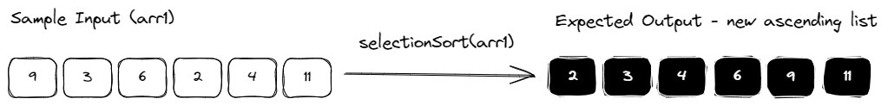
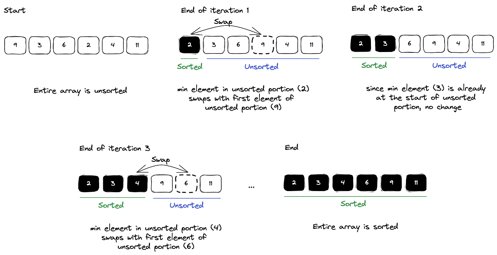

# INDEX

- [INDEX](#index)
  - [Intro](#intro)
  - [Coding challenges](#coding-challenges)
    - [Clamp](#clamp)
    - [Function Length](#function-length)
    - [Make Counter](#make-counter)
    - [Mean](#mean)
    - [Number of Arguments](#number-of-arguments)
    - [Sleep](#sleep)
    - [Array.prototype.square](#arrayprototypesquare)
    - [Function.prototype.call](#functionprototypecall)
    - [Min By](#min-by)
    - [Selection Sort](#selection-sort)
    - [useBoolean](#useboolean)
    - [useCounter](#usecounter)
    - [Accordion](#accordion)
    - [Array.prototype.reduce](#arrayprototypereduce)

---

## Intro

This file contains coding-questions, system-design questions, and other challenges related to Frontend Development

---

## Coding challenges

### Clamp

Implement a function `clamp(number, lower, upper)` to restrict a number within the inclusive lower and upper bounds.

- Arguments:
  - `number`: The number to be clamped.
  - `lower`: The lower bound.
  - `upper`: The upper bound.
- Returns:
  - The clamped value, which is the number if it is within the bounds, or the nearest bound if it is outside.
- Example:

  - `clamp(3, 0, 5)` returns `3` -> Within bounds, retur as-is.
  - `clamp(-10, -3, 5)` returns `-3` -> Below lower bound, return lower bound.
  - `clamp(10, -5, 5)` returns `5` -> Above upper bound, return upper bound.

- Explanation:
  - The function checks if the number is less than the lower bound, greater than the upper bound, or within the bounds, and returns the appropriate value.
  - This is a common utility function used in various applications to ensure values stay within a specified range.
  - It can be useful in scenarios like UI sliders, animations, or any situation where you want to limit a value to a specific range.
  - The idea here is to ensure that the number does not exceed the defined limits, providing a simple way to enforce constraints on numerical values.
  - We can use `if / else` statements to check the conditions and return the appropriate value based on the checks.

```js
function clamp(number, lower, upper) {
  if (number < lower) {
    return lower;
  } else if (number > upper) {
    return upper;
  } else {
    return number;
  }
}
```

---

### Function Length

Implement a function `functionLength`, to return the number of parameters a function expects. Note that this is a static value defined by the function, not the number of arguments the function is called with (which is determined by arguments.length)

- Example:

  ```js
  function foo() {}
  function bar(a) {}
  function baz(a, b) {}

  functionLength(foo); // 0
  functionLength(bar); // 1
  functionLength(baz); // 2
  ```

- Solution:

  - The function can use the `length` property of the function object to determine how many parameters it expects.

    - This property is a built-in feature of JavaScript functions that returns the number of parameters defined in the function signature.

    ```js
    function functionLength(fn) {
      return fn.length;
    }
    ```

---

### Make Counter

Implement a function makeCounter that accepts an optional integer value and returns a function. When the returned function is called initially, it returns the initial value if provided, otherwise 0. The returned function can be called repeatedly to return 1 more than the return value of the previous invocation.

- Example:

  ```js
  const counter = makeCounter(5);
  console.log(counter()); // 5
  console.log(counter()); // 6
  console.log(counter()); // 7

  const anotherCounter = makeCounter();
  console.log(anotherCounter()); // 0
  console.log(anotherCounter()); // 1
  ```

- Explanation:

  - The `makeCounter` function creates a **closure** that maintains the current count.
  - It initializes the count with the provided value or defaults to `0`.
  - Each time the returned function is called, it increments the count and returns the new value.
  - This is a common pattern in JavaScript for creating stateful functions that can maintain their own internal state across invocations.

- Solution:

  ```js
  function makeCounter(initialValue = 0) {
    let count = initialValue;

    return function () {
      return count++;
    };
  }
  ```

---

### Mean

Implement a function `mean` that calculates the arithmetic mean of an array of numbers. The mean is the sum of all numbers divided by the count of numbers.

The function should return `NaN` if array is empty.

- Example:

  ```js
  mean([1, 2, 3, 4, 5]); // 3
  mean([10, 20, 30]); // 20
  mean([]); // NaN (or handle as needed)
  ```

- Explanation:

  - We can use the `reduce` method to sum the elements of the array and then divide by the length of the array to get the mean.
  - If the array is empty, we return `NaN` to indicate that the mean cannot be calculated.

- Solution:

  ```js
  function mean(arr) {
    if (arr.length === 0) return NaN; // Handle empty array case

    const sum = arr.reduce((acc, num) => acc + num, 0);
    return sum / arr.length;
  }
  ```

---

### Number of Arguments

Implement a function `numberOfArguments` that returns the number of arguments passed to it. This function should be able to handle any number of arguments, including zero.

- Example:

  ```js
  numberOfArguments(); // 0
  numberOfArguments(1); // 1
  numberOfArguments(1, 2, 3); // 3
  numberOfArguments('a', 'b', 'c', 'd'); // 4
  ```

- Explanation:

  - In JavaScript, we can use the `arguments` object, which is an array-like object that contains all the arguments passed to a function.
  - The `length` property of the `arguments` object gives us the number of arguments passed.

- Solution:

  ```js
  function numberOfArguments() {
    return arguments.length; // Return the number of arguments passed
  }
  ```

  - Another approach is to use the rest parameter syntax, which allows us to capture all arguments into an array.

    ```js
    function numberOfArguments(...args) {
      return args.length; // Return the number of arguments passed
    }
    ```

---

### Sleep

In JavaScript, the setTimeout function can be used to execute callbacks after a delay. However, it introduces a layer of nesting in the code which may not be desired. It'd be nice to use setTimeout in this fashion:

```js
console.log('Hello!');
setTimeout(1000);
console.log('Bye.');
```

In languages like Java and Python, a `sleep` function is available to suspend execution of the calling thread. However, unlike other languages, JavaScript is single-threaded and blocking the main thread is not a good idea.

Hence implement an asynchronous version of the `sleep` function that works similarly but does not block the main thread. The `sleep` function should also be able to be used without `await`.

- Example:

  ```js
  async function greeting() {
    console.log('Hello!');
    await sleep(2000);
    console.log('Bye.'); // Only logs after 2000 milliseconds (2 seconds)
  }

  greeting();
  // t = 0: Hello!
  // t = 2000: Bye.
  ```

- Explanation:
  - The `sleep` function can be implemented using a Promise that resolves after a specified delay.
  - This allows us to use `await` to pause execution without blocking the main thread.
  - If we want to use it without `await`, we can simply call the function and it will return a Promise that resolves after the specified time.
- Solution:

  ```js
  function sleep(duration) {
    return new Promise(resolve => setTimeout(resolve, duration));
  }
  ```

---

### Array.prototype.square

Implement a method `Array.prototype.square` that returns a new array containing the squares of each number in the original array.

- Example:

  ```js
  const arr = [1, -2, 3, 4];
  const squaredArr = arr.square(); // [1, 4, 9, 16]
  ```

- Explanation:

  - We can extend the `Array` prototype to add a new method called `square`.
  - This method will iterate over each element in the array, square it, and return a new array with the squared values.
  - **To access the array elements, we can use the `this` keyword inside the method**, which refers to the array instance on which the method is called.

- Solution:

  ```js
  Array.prototype.square = function () {
    return this.map(num => num * num);
  };
  ```

---

### Function.prototype.call

Implement a method `Function.prototype.call` that allows you to call a function with a specified `this` context and arguments.

- Example:

  ```js
  function multiplyAge(multiplier = 1) {
    return this.age * multiplier;
  }

  const mary = {
    age: 21
  };

  const john = {
    age: 42
  };

  multiplyAge.myCall(mary); // 21
  multiplyAge.myCall(john, 2); // 84
  ```

- Explanation:

  - We can implement this by creating a new function that sets the `this` context to the provided object and applies the function with the given arguments.

- Solution:

  ```js
  Function.prototype.myCall = function (context, ...args) {
    return this.apply(context, args);
  };
  ```

---

### Min By

Implement a function `minBy(array, iteratee)` that finds the element inside array with the minimum value after going through `iteratee`.

- Example:

  ```js
  const users = [
    { name: 'Alice', age: 30 },
    { name: 'Bob', age: 25 },
    { name: 'Charlie', age: 35 }
  ];

  minBy(users, user => user.age); // { name: 'Bob', age: 25 }
  ```

- Explanation:
  - The `minBy` function can be implemented by iterating over the array and applying the `iteratee` to each element to find the minimum value.
  - We can use a variable to keep track of the minimum element found so far.
- Solution:

  ```js
  function minBy(array, iteratee) {
    if (array.length === 0) return undefined; // Handle empty array case

    let minElement = array[0];
    let minValue = iteratee(minElement);

    for (let i = 1; i < array.length; i++) {
      const currentValue = iteratee(array[i]);
      if (currentValue < minValue) {
        minValue = currentValue;
        minElement = array[i];
      }
    }

    return minElement;
  }

  // or another solution using .reduce:

  function minBy(array, iteratee) {
    if (array.length === 0) return undefined; // Handle empty array case

    return array.reduce((minElement, currentElement) => {
      return iteratee(currentElement) < iteratee(minElement) ? currentElement : minElement;
    });
  }

  // or another solution using .map ✅
  function minBy(array, iteratee) {
    if (array.length === 0) return undefined; // Handle empty array case

    const mappedArray = array.map(iteratee);
    const minIndex = mappedArray.indexOf(Math.min(...mappedArray));
    return array[minIndex];
  }
  ```

---

### Selection Sort

Implement a function that performs a selection sort. The function should take in an array of integers and return an array with the integers sorted in ascending order.



- Explanation:

  - Selection sort is a sorting algorithm that repeatedly scans an unsorted array and with each iteration finds the minimum element to build up a sorted array.
    
  - Here is the basic idea behind selection sort:

    1. Start with the first element as the minimum.
    2. Compare it with the rest of the elements to find the smallest one.
    3. Swap the smallest element with the first element.
    4. Repeat the process for the remaining unsorted elements.

- Solution:

  ```js
  function selectionSort(arr) {
    const sortedArray = [...arr]; // Create a copy of the original array

    for (let i = 0; i < sortedArray.length - 1; i++) {
      let minIndex = i;

      for (let j = i + 1; j < sortedArray.length; j++) {
        if (sortedArray[j] < sortedArray[minIndex]) {
          minIndex = j;
        }
      }

      // Swap the found minimum element with the first element
      if (minIndex !== i) {
        [sortedArray[i], sortedArray[minIndex]] = [sortedArray[minIndex], sortedArray[i]];
      }
    }

    return sortedArray;
  }
  ```

---

### useBoolean

Implement a `useBoolean` hook that manages a boolean state, with additional convenience utility methods.

- Example:

  ```jsx
  export default function Component() {
    const { value, setTrue, setFalse } = useBoolean();

    return (
      <div>
        <p>{value ? 'enabled' : 'disabled'}</p>
        <button onClick={toggle}>Toggle</button>
      </div>
    );
  }
  ```

- Explanation:

  - The `useBoolean` hook returns an object with the following properties.

    - `value: boolean`: The current boolean state
    - `setTrue: () => void`: A function to set the boolean state to true
    - `setFalse: () => void`: A function to set the boolean state to false

- Solution:

  ```js
  export default function useBoolean(initialValue) {
    // Don't use `useState` here, just return an object with the methods
    const value = initialValue || false;
    const setTrue = () => {
      value = true;
    };
    const setFalse = () => {
      value = false;
    };

    return {
      value,
      setTrue,
      setFalse
    };
  }
  ```

---

### useCounter

Implement a `useCounter` hook that manages a counter state, with some additional convenience utility methods.

- Example:

  ```jsx
  export default function Component() {
    const { count, increment, decrement, reset, setCount } = useCounter();

    return (
      <div>
        <p>Counter: {count}</p>
        <button onClick={increment}>Increment</button>
        <button onClick={decrement}>Decrement</button>
        <button onClick={reset}>Reset</button>
      </div>
    );
  }
  ```

- Solution:

  ```js
  import { useState } from 'react';

  export default function useCounter(initialValue) {
    const [count, setCount] = useState(initialValue);

    return {
      count,
      increment: () => setCount(x => x + 1),
      decrement: () => setCount(x => x - 1),
      reset: () => setCount(initialValue),
      setCount
    };
  }
  ```

---

### Accordion

Build an Accordion component that displays a list of vertically stacked sections that each contain a title and content snippet. Some HTML is provided for you as example contents along with a chevron icon.

- Requirements:

  - By default, all sections are collapsed and are hidden from view.
  - When a section title is clicked, the section expands to show its content.
  - The sections are independent of each other. meaning that expanding one section does not collapse the others.

- Starter code:

  ```jsx
  export default function Accordion() {
    return (
      <div>
        <div>
          <div>
            HTML <span aria-hidden={true} className='accordion-icon' />
          </div>
          <div>
            The HyperText Markup Language or HTML is the standard markup language for documents
            designed to be displayed in a web browser.
          </div>
        </div>
        <div>
          <div>
            CSS <span aria-hidden={true} className='accordion-icon' />
          </div>
          <div>
            Cascading Style Sheets is a style sheet language used for describing the presentation of
            a document written in a markup language such as HTML or XML.
          </div>
        </div>
        <div>
          <div>
            JavaScript <span aria-hidden={true} className='accordion-icon' />
          </div>
          <div>
            JavaScript, often abbreviated as JS, is a programming language that is one of the core
            technologies of the World Wide Web, alongside HTML and CSS.
          </div>
        </div>
      </div>
    );
  }
  ```

- Example: [Accordion Example](https://www.w3.org/WAI/ARIA/apg/patterns/accordion/examples/accordion/)
- Solution:

  ```jsx
  import { useState } from 'react';

  export default function Accordion() {
    const [openSections, setOpenSections] = useState({});

    const toggleSection = index => {
      setOpenSections(prev => ({
        ...prev,
        [index]: !prev[index]
      }));
    };

    const sections = [
      {
        title: 'HTML',
        content:
          'The HyperText Markup Language or HTML is the standard markup language for documents designed to be displayed in a web browser.'
      },
      {
        title: 'CSS',
        content:
          'Cascading Style Sheets is a style sheet language used for describing the presentation of a document written in a markup language such as HTML or XML.'
      },
      {
        title: 'JavaScript',
        content:
          'JavaScript, often abbreviated as JS, is a programming language that is one of the core technologies of the World Wide Web, alongside HTML and CSS.'
      }
    ];

    return (
      <div>
        {sections.map((section, index) => (
          <div key={index}>
            <div onClick={() => toggleSection(index)} style={{ cursor: 'pointer' }}>
              {section.title} <span aria-hidden={true} className='accordion-icon' />
            </div>
            {openSections[index] && (
              <div>
                <p>{section.content}</p>
              </div>
            )}
          </div>
        ))}
      </div>
    );
  }
  ```

---

### Array.prototype.reduce
