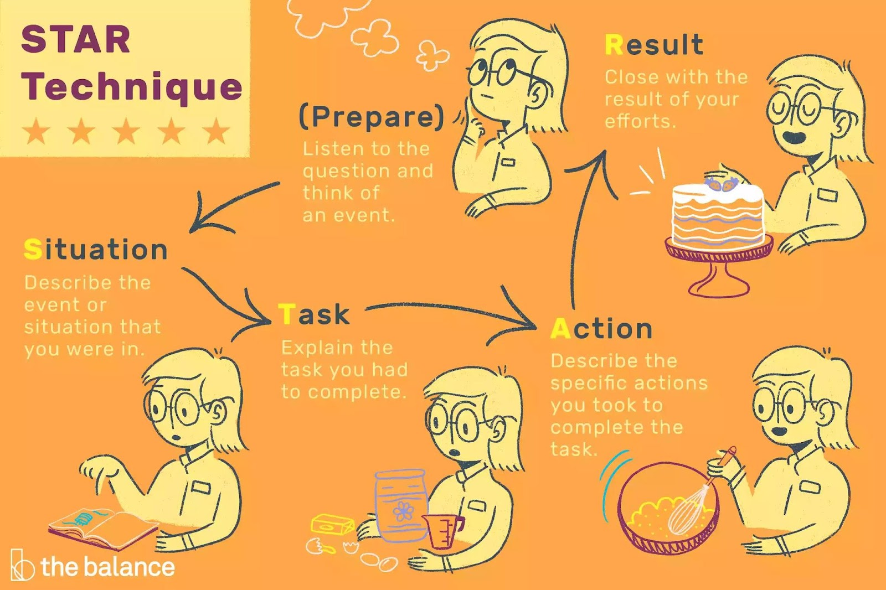

# INDEX

- [INDEX](#index)
  - [Communication](#communication)
    - [Emails](#emails)
  - [Behavioral skills for job interviews](#behavioral-skills-for-job-interviews)
    - [Structure your answer using STARR](#structure-your-answer-using-starr)
  - [Non Technical interviews](#non-technical-interviews)
    - [Personality Questions](#personality-questions)
      - [Strength and weakness Questions](#strength-and-weakness-questions)
    - [Company Questions](#company-questions)
    - [Interviewer Questions](#interviewer-questions)
    - [Feedback](#feedback)
      - [Situation-Behavior-Impact (SBI)](#situation-behavior-impact-sbi)
  - [Negotiation](#negotiation)
  - [Problem-solving questions](#problem-solving-questions)
    - [Curveball questions](#curveball-questions)

---

## Communication

### Emails

- Tips:

  - Don't start with `Dear Sir/Madam` or `To whom it may concern`
    - try to find the name of the person you're sending the email to
    - also `sir/madam` is too formal and usually used in spam emails
  - Try not to use more than one exclamation mark `!`
    - It's used to express tone and emotion and it's not professional to show a lot of emotions in a professional email like excitement or anger.

- Examples:

  - Intro email to a recruiter:

    - Here we use (`-`) instead of (`,`) for readability and to replace new lines. to be short and clear.

    ```md
    Hi <name> - I love what I heard about <> from <> and what I read online. Looking forward to meeting! What's the easiest way to schedule a time? If it's helpful, you can use this calendly link.
    I'm generally available Sunday-Friday between 9am-9pm EST, which would be 4pm-4am your time, but I can be more flexible if needed.

    Best,
    <name>
    ```

  - Professional email to a recruiter:

    - Here, we use (`,`) normally
    - Remind them when your interview will be held.

    ```md
    Hi <name>,

    I hope you're well! I just wanted to clarify what type of interview I'l be having on the 30th of Sep. Can you give me a little more information on what I should be prepared for?

    You mentioned it is a technical interview. I'm wondering If this will be focused on data structures & algorithms, or a conversation about my past technical projects, or a more practical coding exercise using a relevant technology like React. Any information would be greatly appreciated.

    Thanks so much!
    <name>
    ```

  - Showing interest after interview (Thank you email):

    ```md
    Hi <name>,

    Thanks so much for taking the time to interview me yesterday. I really enjoyed it - it felt more like a teamwork project than an interview!

    I also appreciate you taking the time to answer my questions.It was really encouraging to hear how cool startup gives engineers opportunities to meet customers & come up with product/business ideas.

    I'll be in touch with <name> about next steps.

    Warm Regards,
    <name>
    ```

---

## Behavioral skills for job interviews

### Structure your answer using STARR

It's a method to structure your answers to behavioral interview questions. It's a way to answer questions that help you to tell a story about a specific time when you did something. It's a way to help you to structure your answers to behavioral interview questions.

> **STAR** stands for `Situation`, `Task`, `Action`, and `Result`.
>
> - The STAR technique is great for any interview questions asking about your experience and how you dealt with different problems. Questions like “What is your greatest weakness?” or “How did you deal with a difficult team member?” will be right at home here.



- **Situation:** Describe the situation that you were in or the task that you needed to accomplish. This is where you are going to set up the story. Give one or two sentences of background so your interviewer knows the context of what you’re going to be talking about. At bare minimum, you should mention where you were and at what point in your career this took place.
  - `Ex`: “I’m going to tell you about something that happened at my summer internship. I was interning at Facebook after my junior year of college.”
- **Task:** What goal were you working toward?
  - `Ex`: “My mentor asked me to stay late at work one night toward the end of my internship to help him with a project.”
- **Action:** Now we’re getting into the meat of things, where you’re actually going to describe what you did. Since we’re getting to the more relevant stuff, you can take more time to describe what you did.
  - Keep the focus on YOU. What specific steps did you take and what was your particular contribution? Be careful that you don’t describe what the team or group did when talking about a project, but what you actually did. Use the word “I,” not “we” when describing actions.
  - > **Caution:** Don’t go into too much technical detail here. Unless your interviewer is familiar with the technology, they’re likely not going to understand all of what you’re talking about if you go too deep. Plus, going too deep can take a lot of time.
  - `Ex`: “We were working on building out a new message handler for `X` service. I didn’t know too much about `Y` and `Z` technology, but he helped me figure it out, and by 1 AM we had built a working prototype. Over the next two weeks we refined it and pushed it into production.”
- **Results:** This is the part where you really have to bring it home and make sure that you’re connecting back to the core question.
  - Describe the outcome, and give any specific metrics that you can. Don’t be shy about taking credit for your behavior. What happened? How did the event end? What did you accomplish? What did you learn? Make sure your answer contains multiple positive results.
  - `Ex`: “As a result of our all-nighter, we got our code up two weeks ahead of schedule, and I made my mentor look really good. I also learned a lot of new technology, and we managed to speed up job handling by `20` percent. That’s an example of a time when I exceeded expectations.”

---

## Non Technical interviews

- stories to have from your experience:
  - Technical story
  - Success(promotion ladder) story
  - Leadership story (can go on his own and not needing someone to always guide him)
  - Challenge story (can figure out how to do or tackle any problem)

### Personality Questions

- Tell me about Yourself:

  - tell a "Hero story" about your journey from start to finish that has your (triggers of success)
  - mention things you want to get asked
  - mention skills that should be relevant to the job

- What is your biggest weakness?
  - real answer
  - show how you improved it
  - > EX: sometimes when I have a coding problem, I get straight into coding without really thinking about the problem, and as I'm typing I realized that perhaps I should have waited and planned out how my code should be structured, and what problem am I really solving before I start coding it.
    >
    > - so lately, I've taken the time to make sure that I write "pseudo code" first and commenting out my steps, inputs and assumptions before I actually jump in coding.

#### Strength and weakness Questions

A hiring manager may ask you to describe your strengths and weaknesses. When you respond to this question, you may speak about yourself positively and explain how you're improving a weakness you have. Understanding how to answer this interview question can improve your chances of receiving a job offer.

- Why they ask it?

  - They want to know if you're familiar with what areas you can improve and what steps you've taken to address them.
  - what you think your best qualities are so you can apply them in the new role
  - they can use your response to assess how your attributes may affect the company's operations and existing team members' duties and responsibilities -> to see if you're a good fit for the role

- Strength

  - > Another format of the strengths question is: **"When they're describing you, what is one word your colleagues and managers would use to describe you?"**
    >
    > - While these questions don't ask you about your strengths directly, they encourage you to talk about your positive attributes.

- Weakness

  - > Another format of the weakness question is: **"What is one thing that you can change about yourself?"** or **"What feedback have you received from your manager?"**
    >
    > - This question is similar to the weakness question, but it's more specific. It asks you to describe a specific area you're working to improve, rather than a general weakness.

  - You can use this formula for answering this question:
    - **Weakness** + **Context** + **Improvement measures**
  - EX:
    - "I focus too much on the details"
      - this can be used to show that you're a perfectionist, and you can say that you're working on it by trying to focus on the big picture and the main goal of the project. Also it shows that you're a hard worker and you're willing to put in the time and effort to get the job done. plus delivering a high quality work.
      - You can leverage this weakness to show that you're capable of helping the company avoid even minor mistakes.
      - Don't forget to mention that you're working on it and how you're working on it.
    - "Sometimes I have a hard time letting go of a project, I'm the biggest critic of my work, and I can always find something that needs to be improved or changed"
      - this can be used to show that you're a perfectionist, and you can say that you're working on it by trying to focus on the big picture and the main goal of the project. Also it shows that you're a hard worker and you're willing to put in the time and effort to get the job done. plus delivering a high quality work.
      - For improvement measures, you can say that you're working on it by trying to focus on the big picture and the main goal of the project. Also by giving yourself a deadline to finish the project and not going back to it after that deadline.

---

### Company Questions

- Why Join Us?

  - try to make the interviewer feel special by showing how you're interested in the company's work and how you love to work there
    - never show that you apply to the company blindly/randomly
    - show them that you've done your research about the company
  - show you want to grow (with them)
  - demonstrate why you are the best fit by **linking** your skills/experience and projects with the company's work

- Why did you leave your job?
  - the most important rule to remember is: **No Negativity**
    - don't complain about your co-workers, boss, codeBase that you worked with
  - be as **Positive** as possible by saying:
    - you want to **grow**
    - you want more challenge
    - you want to work with people that are really smart like they have at the company you're applying to

---

### Interviewer Questions

- **"Do you have any questions for me?"**

  - Prepare 4-5 questions to ask the interviewer
  - focus on the interviewer, not `company` or `yourself`
  - mention something they've mentioned (this shows that you're paying attention to what they're saying in the interview)
    - use the info they tell you about themselves at the beginning of the interview

One of the important things to think about here is the fact that even though you’re asking the questions, it is still part of the interview. Your interviewer will be evaluating you based on the sorts of questions you ask. Therefore, make sure you have good questions…and don’t ask about things like vacation days, since it’s not really a good first impression.

Here are some questions to get you started. I love opinion questions because you get interesting answers and can ask everyone the same question. Don’t be afraid to ask about the negatives too:

- **Questions to ask about the job**:

  - "Can you share more about the day-to-day responsibilities of this position? What's a typical day like?"
  - "What Are Your Expectations for the Person in This Role?"
  - "What are the characteristics of someone who would succeed in this role?"
  - "What does the career path for someone in this role look like?"
  - "What are some of the challenges you’ve seen people in this role or on this team encounter?"
  - "Can you tell me about the team I'd be working with?"
  - what is a big mistake that you did at the beginning of your jeb here? and what did you do?
  - Have you seen your skills grow here in the past 3 years?
  - What you wish somebody told them when they just started the job at this company?

- **Questions to ask about the company**:

  - "What do you like best about working here?"
  - career advancement: "I'd love to talk about career advancements. In my next career move, I really want to find a company that is prioritizing upward mobility and career growth. I want to be a senior engineer in the next couple of years, So it's really important that I have clear opportunities for growth in this role. If you'd be able to share, I'd like to understand how many people have been promoted out of this position?"

- **Questions to ask about the culture**:

  - How would you describe the company culture?

- Questions to avoid:
  - Avoid asking questions that make it seem like you’ve already been hired, such as questions about the company’s paid-time-off policy or anything with regard to salary or benefits. These are details that will be discussed after you’re offered the job or will be brought up by the interviewer themselves.
  - Also, avoid asking about who else the company may be interviewing and questions about background checks, how long before your first review or if they’d be contacting past employers. Such questions may come across as you worrying about them learning something about you in the future. You want to make the most of your two to three questions and leave them with the best impression possible.
  - avoid asking about information that is already available on the company’s website or social media pages. This will make it seem like you didn’t do your research before the interview.
    - EX: "How are the company's mission and values?"

---

### Feedback

#### Situation-Behavior-Impact (SBI)

- **Situation:**
  - Start by describing the specific situation or context in which the behavior occurred. This helps to provide a clear and specific context for the feedback.
- **Behavior:**
  - Describe the behavior that you observed in the situation. This should be a specific and objective description of what the person did or said.
- **Impact:**

  - Describe the impact that the behavior had on you or others. This should be a description of the consequences of the behavior, whether positive or negative.

> EX: "I noticed that you were late to the meeting **(Situation)**. I was concerned because we had a lot to cover in the meeting and we had to rush through the agenda **(Behavior)**. As a result, we didn’t have time to discuss the new product launch **(Impact)**."

---

## Negotiation

- Offer negotiation
  - don't end the conversation with `yes/no`, and keep the conversation going
    - > EX: you can say this: "This sounds fantastic, I really thought this was a great fit when I met you and interviewed in the company, and I'm really glad to see that we both agree and you see a good fit here. Right now I'm talking to a few other companies, so I can't really speak to the full details of the offer until I'm done with the interviewing process and I'm closer to making a decision, but I'm sure that we can find something that works great for us because I would really love to be part of your team and I had a great time interviewing and I could really see myself working there long term."
  - ask for some time to think and (give a reason for everything)
    - > EX: instead of saying: "well, I need more time to think about it", you can say this: "well thank you very much for this offer, and I'm very excited to potentially working with your company, **However** this is a big family decision and I'm looking to work at a company for many years, So I'd like to discuss this with my wife/partner and have some time to make sure that there's something that we're both comfortable with."
  - Always negotiate
    - Find exact salary you want and **Go higher**, as probably they won't agree to your initial demand
    - > if you never asked, the answer is always no
  - Have stake
    - don't show disparateness by showing that you have multiple offers
- Having an offer

  - when you have an offer from a company, let other companies (you are negotiating with) know, and build a deadline
  - > EX: write this email to other companies: "Hello, I just want to let you know and give you an update on my interviewing process. I've just received an offer from another company(you can say its name) which is quite a strong offer, with that said I'm really excited to potentially be working with your company, as I had a really good time interviewing with you and I really wanted to see if we can make things work. since my timeline is now a little bit compressed with this new offer, is there anything we can do to make the process go a little bit faster?"

- Handling multiple offers

  - try to look at this priority list (top is most important) when choosing:
    1. is there an offer that you feel you're under-qualified for(hard job)?
       - note that taking this job will challenge you to be better the next time you interview
    2. Long term growth potential
    3. will you respect people around you? (environment)
    4. salary and benefits
    5. is your decision based on desperation?

- Getting a raise

  - Actually do "Ask" for a raise (they most likely won't until you ask for it)
  - show. Don't tell
    - show how much you're valuable
    - every 6 months, keep a folder with all the good things, comments or feedback you've done/gotten for the company, and perhaps keep track of your skill level from the first day on the job to the 6 months mark, showing what did you learn and improve on, so gather all that with a plan for you in the next 6 months to show to your employer
    - show your employer why you deserve a higher salary based on the previous note, showing that you're a different person than you were when they first hired you when they didn't know that you were going to be valuable
    - Ask for a salary-level that is a lot higher than you actually want, as they would find a middle ground that is happy for both parties
    - Remember, to value yourself, you've done a great job with the company, they want to keep you because they value you

---

## Problem-solving questions

To solve these questions use **STAR** technique:

- **Tell me a time when you solved a difficult problem at work?**

  - **Situation:** I was working on a project that was due in 1 week, and my teammate that was responsible for making the new implementation compatible with the infrastructure pipeline was sick and couldn't work on it.
  - **Task:** I had to figure out how to handle the infrastructure part myself to ensure that the project is delivered on time.
  - **Action:** I considered my options like discussing with my manager the option of borrowing a teammate from another team, but that would take a lot of time to get them up to speed with the project, so I decided to learn how to do it myself by reading the documentation and asking my teammates for help instead of impacting other teams timelines. Fortunately my manager was very supportive and gave me the time to learn how to do it myself.
  - **Result:** I was able to deliver the project on time, and I learned a new skill that I can use in the future. Also, I became able to help my teammates with the same problem in the future.

- **Describe a time when you had to solve a problem without managerial input. How did you handle it, and what was the result? or Give an example of a time when you identified and fixed a problem before it became urgent.**

  - **Situation:** I faced an issue where a website I was developing was loading slowly, affecting the user experience.
  - **Task:** I had to figure out what was causing the issue and how to fix it.
  - **Action:** I gathered all available information, analyzed the root cause, and facilitated a brainstorming session with the team to come up with a solution. I then implemented the solution and tested it to make sure that it fixed the issue.
  - **Result:** My proactive approach helped me to solve the issue quickly and efficiently, and the website was loading faster, and the user experience improved.

- **What steps do you follow when solving problems?**

  - I always follow a 4 step process:
    1. **Understand the problem:** I make sure that I understand the problem by asking questions and clarifying the problem with the product manager.
    2. **Plan:** I plan how to solve the problem by breaking it down into smaller problems and then solving each one of them.
    3. **Execute:** I execute my plan by writing the code and testing it.
    4. **Review and Retrospect:** I review my code and make sure that it's clean and readable, and I retrospect on the problem to know the root cause of the problem and how to avoid it in the future.

- **How would you handle a situation where your team disagrees with your idea?**

  - I would first listen to their ideas and try to understand their point of view, and then I would try to convince them by showing them the benefits of my idea and how it would help the team and the company.
  - If they still disagree with my idea, I would try to find a middle ground that would satisfy both parties.
  - If we still can't agree on a solution, I would escalate the issue to my manager and let them decide on the best solution.

- **What do you consider before making decisions?**
  - I consider the impact of my decision on the team and the company.
  - I also consider the pros and cons **(risk and rewards)** of my decision and the risks associated with it.
  - I also consider the time it would take to implement my decision and the resources needed to implement it.
  - I also consider the impact of my decision on the product and the users.

---

### Curveball questions

- Tips for handling these questions

  1. Stay calm and don't panic
  2. Take a moment to think about the question -> "That's a fun question, let me think about it for a second"
  3. Don't stress about getting the right answer, they're not looking for the right answer, they're looking for how you think and how you approach the problem
  4. Reveal your thought process and talk out loud
     - Ex: "if you were a tree, what kind of tree would you be?"
       - Don't just say "I would be a pine tree", instead say "well, I consider myself a very strong person, and I'm always growing and looking up and learning new things, so I would be a pine tree because it's a strong tree that grows tall and it's always green"
  5. Show your personality and have fun with it

- Ex: "Does your current manager know that you're interviewing today?"
  - This is a tricky question, because it's asked to better understand your relationship with your current manager and to see if you're a trustworthy person.
  - Answer: "I took the day off today, when asked what I was doing for my time off, I said that I had personal things to take care of, as I wouldn't help to start a conversation about me leaving the company, So I haven't explicitly told my manager that I'm interviewing today, but he knows that I'm willing to pursue potential opportunities that are better for me and my career growth. and he is very supportive of that."
