# INDEX

- [INDEX](#index)
  - [Compiled vs Interpreted Language](#compiled-vs-interpreted-language)
    - [Compiled Language](#compiled-language)
    - [Interpreted Language](#interpreted-language)
  - [JavaScript Engine](#javascript-engine)
    - [How the engine works ?](#how-the-engine-works-)
    - [call-stack & Memory-heap](#call-stack--memory-heap)
  - [Types](#types)
    - [`==` vs `===`](#-vs-)
    - [Type Coercion](#type-coercion)
  - [Implicit vs Explicit](#implicit-vs-explicit)
  - [Scope](#scope)
    - [Lexical scope](#lexical-scope)
  - [Functional Programming](#functional-programming)
    - [currying & partial Application](#currying--partial-application)
    - [Closure](#closure)
      - [Function returning Functions](#function-returning-functions)
      - [Benefits](#benefits)
    - [Generators](#generators)
    - [Pure Functions](#pure-functions)
    - [Iteration vs. Recursion](#iteration-vs-recursion)
      - [Recursion performance](#recursion-performance)
      - [first-class functions and higher order functions](#first-class-functions-and-higher-order-functions)
    - [Referential Transparency](#referential-transparency)
    - [Composition](#composition)
    - [Functional Decoration](#functional-decoration)
  - [JS : The weird parts](#js--the-weird-parts)
    - [Advanced Types](#advanced-types)
    - [Numbers](#numbers)
    - [short circuiting => **nullish coalescing operator** `??`](#short-circuiting--nullish-coalescing-operator-)
  - [notes](#notes)

---

## Compiled vs Interpreted Language


### Compiled Language

- Language is written and compiled to machine code inside of an application
- Errors are detected during compiling
- The code won’t compile until it’s error-free
- it `optimizes` the code as it **cashes** any repeated function.
  - if it say `add(2,3)` function it caches its result (5) and uses it if it found the same function-call again --> **improves performance**
- Examples: C, C++, Erlang, Go

### Interpreted Language

- The interpreter translates and runs code **one statement at a time**
  - each line of code is translated to machine-code one-by-one as the script is run.
  - the interpreter always looks for **variables** and **function declarations** before going through each section of a script, line-by-line.
- Errors found when the code is run
- Interpreter starts running the code quickly
- Interpreted code runs more slowly
- it's more fit to `javascript` as JS runs on the browser

> Node.js Is an Interpreter

---

## JavaScript Engine

- javascript uses best of (**Interpreted** & **Compiled**) languages ---> **Jit Compiler**

  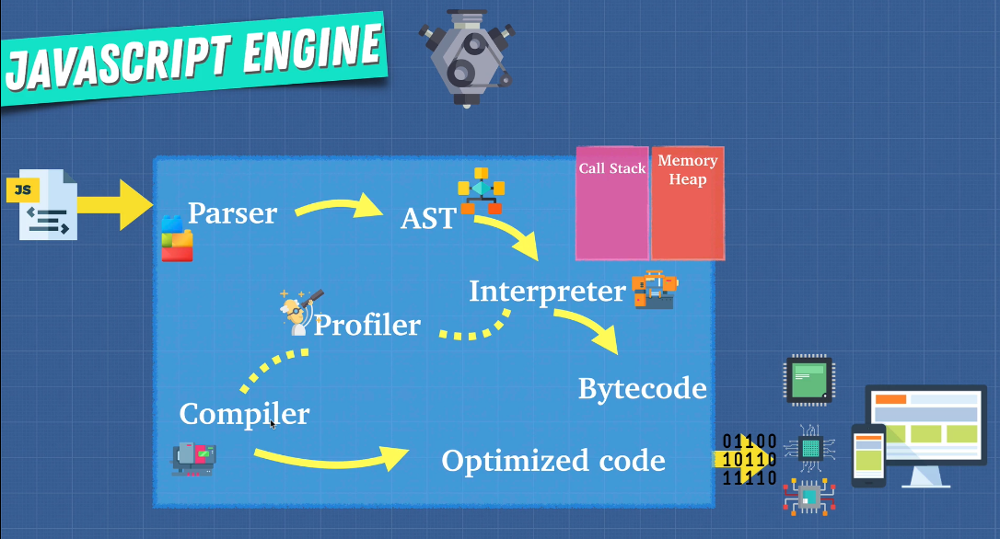

- is `javascript` an interpreted language ?
  - yes, **initially** but it evolved to use compilers as well based on the implementation

### How the engine works ?

1. The engine (embedded if it’s a browser) reads (**“parses”**) the script.
2. Then it converts (**“compiles”**) the script to machine code.
3. And then the machine code runs, pretty fast.

### call-stack & Memory-heap

**Heap**: a much larger part of the memory that stores everything allocated dynamically, that allows a faster code execution, and protects it from corruption and makes the execution faster.

- Memory-heap: boxes which store datatypes -->error-> `memory leak`:

  - usually when you have values that has place in memory but not used
  - also common in **event listeners** which are always listening(waiting) for an event

- call-stack -->error-> `stack overflow`: usually from **recursion**
  - always the first thing in it is the **global execution context** (Code / variable declared outside a function)
    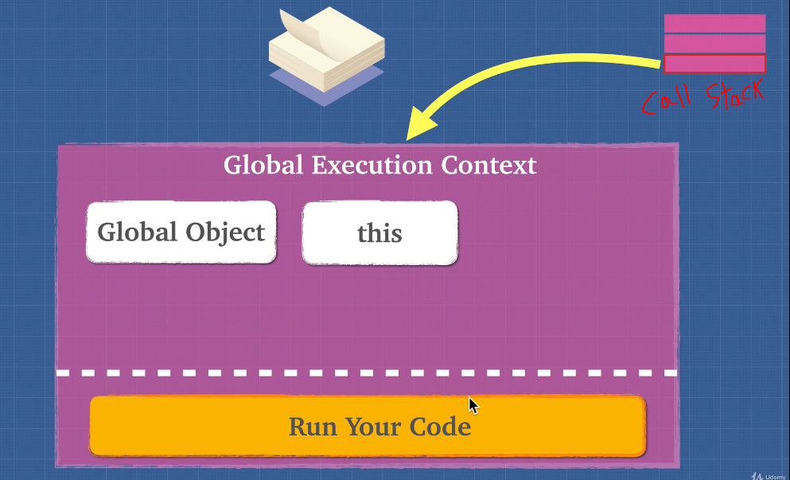

> **global execution context** consists of 2 things:
>
> - storing variables / function in **memory** (global state)
> - performing functions execution in the **thread of execution (call stack)** where each function gets its own **mini execution context**

---

## Types

- **permatives** & **reference**
  
  - `value` at a specific `address` (**in the `call stack`**) is immutable ,,, but in the `Heap` its mutable
  - `reference-type` are stored in the `Heap` as we don't know how big its size would be so it's like if the `Heap` has unlimited storage unlike `call stack`

### `==` vs `===`

- Because of **type coercion**, the strict equality operators `===` and `!==` result in fewer unexpected values than `==` and `!=` do.
- If you know the types in comparison: prefer `==` as it's faster
- if `===` would always be equivalent to `==` in your code, using it everywhere sends a wrong semantic signal : **protecting myself since I don't know'trust the types**
- NOTES:

  - logical operators (like `&&`) allow you to compare the results of more than one comparison operator (like `===`).
  - The value `undefined` shouldn’t be compared to other values:

    ```js
    alert(undefined > 0); // false
    alert(undefined < 0); // false
    alert(undefined == 0); // false

    // "null" only equals "undefined"
    alert(undefined == null); // true
    alert(undefined === null); // false
    ```

### Type Coercion

it's the automatic or implicit conversion of values from one data type to another
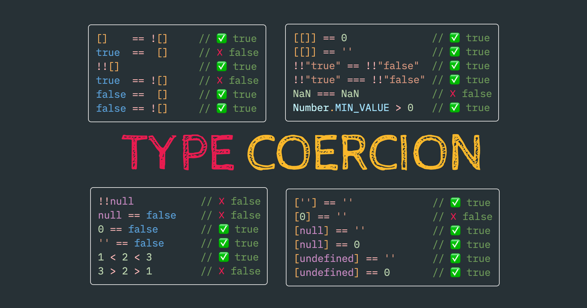

- empty object `{}` /array `[]` => true
- empty string `""` => false

- `+` vs `-` :

  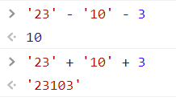

- convert string to number using :

  - `unary` operator
    - it's a `+` or `-` before the string number => `console.log(+"565")`
    - it's a `!` before something => `console.log(! (x > 4) )`
  - `parseint()` or `parsefloat()` => `parseint(100Ahmed)` = 100

- `string to boolean`: 
  - `Boolean("0");` --> **true**

---

## Implicit vs Explicit

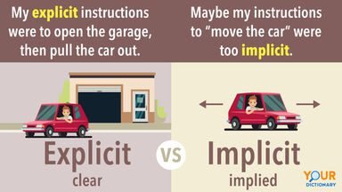

- **type coercion** is implicit whereas **type conversion** can be either implicit or explicit

---

## Scope

- **local variables:** The interpreter creates local variables when the function is run, and removes them as soon as the function has finished its task. This means that:
  - If the function runs twice, the variable can have different values each time.
  - Two different functions can use variables with the same name without any kind of naming conflict
- **global variables:**: Global variables are stored **in memory** for as long as the web page is loaded into the web browser. This means they take up more memory than local variables, and it also increases the risk of naming conflicts
  - For these reasons, you should use local variables wherever possible

---

### Lexical scope

> **It's where the function was called (Functions are linked to the object they were defined within)**

Each local scope can also see all the local scopes that contain it, and all scopes can see the global scope.

> (range of functionality) of a variables + Data that it may only be called (referenced) from **within the block of code in which it is defined in**.

- it determines our available variables
- variable defined outside a function can be accessible inside another function defined after the variable declaration.
  - this accessible item is sometimes called a **Backpack** or **Persistent lexical scope referenced data (PLSRD)**
  - each execution of the function gets its own separated **Backpack**
- the opposite is **dynamic scope** --> It doesn't exist in JavaScript


> **Note**: if variable is assign a value but never declared in a scope or block -> it automatically gets declared in the global scope

---

## Functional Programming

- Functional programming is about **Verbs** (actions)

  - it's like a black box that takes something in and returns something out
  - it depends on **Tiny functions**: Save every single line (or few lines) as its own function
  - **Recombine/compose** Build up our application by using these small blocks of self-contained code combining them up line-by-line by referring to their human-readable name

    ```js
    // Todo list
    pipe(
      getPlayerName,
      getFirstName,
      properCase,
      addUserLabel,
      createUserTemplate
    )([{ name: 'Abdelrahman', score: 3 }]);
    ```

  - the result that we will get a code that is:
    - Easier to add features
    - More readable
    - Easier to debug

- object oriented programming is about **pronouns** (objects and things) -> "keep state to yourself and send/receive messages"

**functions :**

- Reduce the potential impact of any given line to maybe 10 other lines (inside the function)
- structure our code into individual pieces where almost every single line is **self-contained**
- **No consequences** except on that line Each function’s only ‘consequence’ is to have its result given to specifically the next line of code (‘function call’) and not to any other lines

---

### currying & partial Application

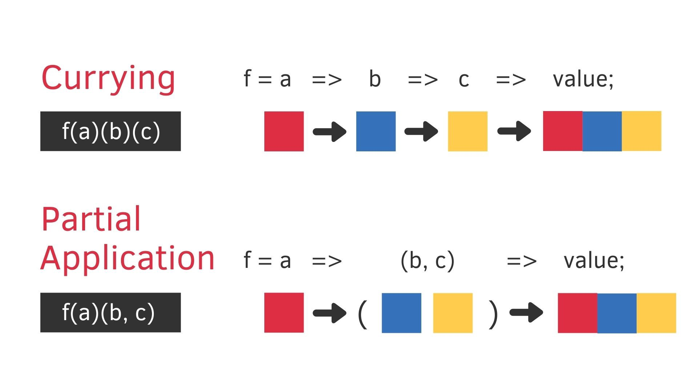

- **currying**: one argument at a time
  - It is translating a function that takes multiple arguments into a sequence of **single-argument-functions**, each accepting one argument.
- **partial application**: The process of applying a function to some of its arguments. The partially applied function gets returned for later use.

  - it's creating a new outer-function that calls our multi-argument function with the argument, and the multi-argument function stored conveniently in the **Backpack**

  ```js
  const multiply = (a, b) => a * b;
  function prefillFunction(fn, prefilledValue) {
    const inner = liveInput => {
      const output = fn(liveInput, prefilledValue);
      return output;
    };
    return inner;
  }
  const multiplyBy2 = prefillFunction(multiply, 2);
  const result = multiplyBy2(5);
  ```

- these 2 concepts use **Closures**

---

### Closure

It's the ability to treat functions (when executed) as values

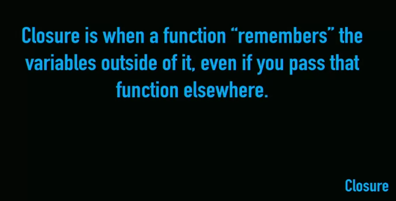

one of the biggest examples of closures is **timers**: 
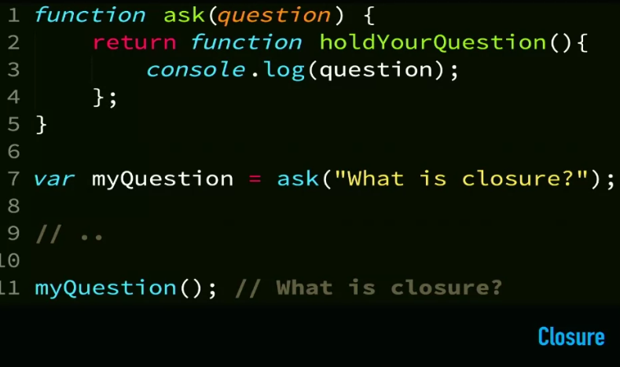

- A closure is the combination of a function bundled together (`enclosed`) with references to its surrounding state (the lexical environment). In other words, **a closure gives you access to an outer function's scope from an inner function**. In JavaScript, closures are created every time a function is created, at function creation time.
- A closure makes sure that a function doesn’t loose connection to variables that existed at the function’s birth place
- inner function can remember outer function's scope

  ```javascript
  function multiplier(factor) {
    return number => number * factor;
  }
  let twice = multiplier(2);
  console.log(twice(5)); // → 10
  ```

- using callback function which has arguments (Passing "argument" into handler) :

  ```javascript
  // handleHover is a function with 2 parameters(e,opacity)
  // Method 1
  nav.addEventListener('mouseover', function (e) {
    handleHover(e, 0.5);
  });

  // Method 2 (see example for explanation)
  nav.addEventListener('mouseover', handleHover.bind(0.5));
  ```

- when you want to turn **block-scope** into a **functional-scope** -> use **IIFE**
  - usually used to prevent variable to be in the global scope like here:
    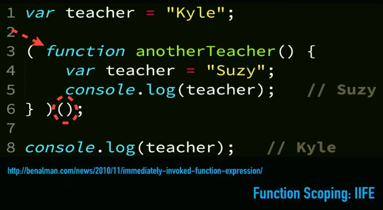
  - Often used to ensure that the variable names do not conflict with each other (especially if the page uses more than one script).
  - also used for
    - code that only needs to run once within a task, rather than repeatedly being called by other parts of the script.
    - As an argument when a function is called
    - In event handlers and listeners
    - To prevent conflicts between two scripts that might use the same variable names

#### Function returning Functions

this is a form of **Closure**, as in this example: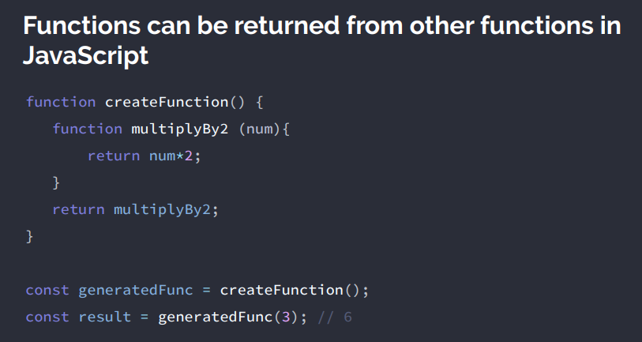

- most importantly -> `generatedFunc` **doesn't have any connection to** `createFunction`, as:
  - here `generatedFunc` is not equal to `createFunction` function
  - but it's equal to "what `createFunction` function has returned **when it was created(ran)**"

#### Benefits

- It's usually memory-efficient as it caches the values inside its block-scoped (where it was called) **(its local memory (like Backpack) + the returned value from the function)** in case that it was called again, this will be in the hidden property called `__scope__`.
  - actually the **Backpack** doesn't contain "all" the local memory of the function, but it contains only the values/variables that will be used in the function body and will get rid of other unused things in the local memory using **garbage collection**
    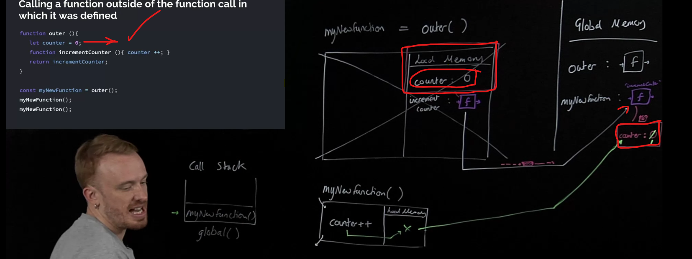
    - this is the main concept behind **iterator function**, where it persists a function called **returnNextElement**, which has:
      1. Our underlying array itself
      2. The position we are currently at in our ‘stream’ of elements
      3. The ability to return the next element
  - > So **iterators** turn our data into ‘streams’ of actual values we can access one after another.
  - > JavaScript’s built in iterators are actually objects with a **next()** method that when called returns the next element from the ‘stream’/ flow
- Encapsulation: prevent unwanted access to inner variables/functions

---

### Generators

Once we start thinking of our data as flows (where we can pick of an element one-by-one) we can rethink how we produce those flows - JavaScript now lets us produce the flows using a function

the Generator function allows us to exit and renter the execution-context of function manually, unlike iterators which this happens dynamically

```js
function* createFlow() {
  const num = 10;
  const newNum = yield num;
  yield 5 + newNum;
  yield 6;
}
const returnNextElement = createFlow();
const element1 = returnNextElement.next(); // 10
const element2 = returnNextElement.next(2); // 7 -> when we pass a value to the next() method, it will be evaluated as the yielded value and we will continue the function until we find another yield
```

- `returnNextElement` is a special object (a **generator object**) that when its `next` method is run starts (or continues) running createFlow **execution-context** until it hits `yield` and returns out the value being yielded **without continuing the function**

  - We end up with a ‘stream’/flow of values that we can get one-by-one by running `returnNextElement.next()`
  - And most importantly, for the first time we get to pause (‘suspend’) a function being run and then return to it by calling `returnNextElement.next()`

- This is actually what happens behind the scene in **Asynchronous javascript**, as we want to:

  1. Initiate a task that takes a long time (e.g. requesting data from the server)
  2. Move on to more synchronous regular code in the meantime
  3. Run some functionality once the requested data has come back

  ```js
  function doWhenDataReceived(value) {
    returnNextElement.next(value);
  }
  function* createFlow() {
    const data = yield fetch('http://twitter.com/will/tweets/1');
    console.log(data);
  }
  const returnNextElement = createFlow();
  const futureData = returnNextElement.next();
  futureData.value.then(doWhenDataReceived);
  ```

  - Explanation of the code above:
  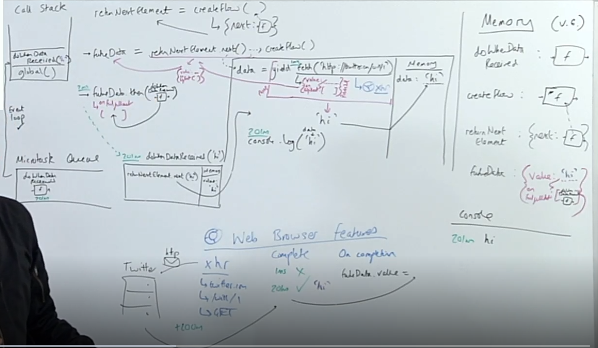

- **Async/await** simplifies all this and finally fixes the inversion of control problem of callbacks
  - as it automatically triggers the function on the promise-resolution **(this functionality is still added to the micro-task queue though)**

  ```js
  async function createFlow() {
    console.log('Me first');
    const data = await fetch('https://twitter.com/will/tweets/1');
    console.log(data);
  }
  createFlow();
  console.log('Me second');
  ```

---

### Pure Functions

- **Pure function**: Function **without side effects (predictable)**. Does not depend on external variables. Given the same inputs, always **returns** the same outputs
  - pure function **must** return something
- **side-effects**: are about MODIFICATION and doesn't count if we created new item
  - usually it's anything that the function does other that returning a value

---

### Iteration vs. Recursion

In **functional programming**, we avoid `mutable state`, and therefore avoid `iterative loops` using for or while. As an alternative to iteration, we use **recursion** to break down the problem into smaller ones.

A recursive function has two parts:

- `Base case`: condition(s) under which the function returns an output without making a recursive call
- `Recursive case`: condition(s) under which the function calls itself to return the output

#### Recursion performance

recursion sometimes take long time as it calls multiple functions at the same time which occupies the **call stack**

- one solution is to use **memoization (caching)**
- another solution is to use **tail call optimization**
  - **Note**: not all JavaScript engines implements **tail calls**

---

#### first-class functions and higher order functions

- **first class objects** is just a feature that a programming language either has or does not have. (All it means is that all functions are values \***\*(can be assigned to variables**/**can be passed as arguments**/**can be returned as values from function)\*\***.),It's just a concept.
  
- There are however **higher order functions** in practice, which are possible because the language supports `first class functions`.
  

  - Easier to add features, more readable, easier to debug
  - we can **chain** these higher order functions (pass the output of one as the input of the next)
  - ex: `call`, `apply`, `bind` :

  - `call` => calls a function with the given lexical context as parameter (`call` it's like calling the `this` of the one object that calls the function)

    ```javascript
    let human = { name: 'Ahmed' };
    function sayName(greeting) {
      console.log(greeting + ' ' + this.name);
    }
    sayName.call(human, 'Hi!'); // Outputs Hi! Ahmed
    ```

  - `apply` => is just like `call()` except that it accepts arguments in array

    - it's not used in modern javascript because we can instead use `spread operator ...` with `call()`

    ```javascript
    let human = { name: ‘Ahmed’ }
    function sayName(greeting, city) {
      console.log(greeting + ' ' + this.name + ' from ' + city)
    }
    sayName.apply(human, ['Hi', 'Cairo']) // Outputs Hi! Ahmed from Cairo
    ```

  - `bind` => is somewhat special. It is a higher-order function which means when you invoke it => **it returns a new function where `this` keyword is bound**. The function returned is curried, meaning you can call it multiple times to provide different arguments in each call.

    - _note_ => `bind` doesn't call the function that's why it's used in `eventListeners`
    - it's also used to set arguments so that we won't have to write them each time

    ```javascript
    let human = { name: 'Ahmed' };
    function sayName(greeting, city) {
      console.log(greeting + ' ' + this.name + ' from ' + city);
    }

    let greet = sayName.bind(human);
    greet('Hi!', 'Cairo'); // Outputs Hi! Ahmed from Cairo
    greet('Hello!', 'Alex'); // Outputs Hello! Ahmed from Makati

    // ----------Partial Application---------- //
    // here if you don't want to specify (this) keyword => use (null), as (typeof null = "object")
    const add = function (a, b) {
      return a + b;
    };
    const add2 = add.bind(null, 2);
    // now : a=2

    add2(10) === 12;
    ```

- **reducer function** is the process (function) of taking 2 elements and do an operation on them and returning only one thing

---

### Referential Transparency

- **Referential Transparency**: emphasizes that an expression (or function) in a JavaScript program may be replaced by its **value / returned value** or any other variable having the same value without changing the result of the program. As a result, methods should always return the same value for the given argument without any side effects
- it's like **(I can replace the function-call with its returned-output and it’s the same)**


---

### Composition

It is the **combination of two functions into one**, that when applied, returns the result of the chained functions **(using reduction of the result value)**.

> In functional Programming, Composition **takes the place of inheritance in OOP**.

- Chaining with dots relies on JavaScript prototype feature - functions return arrays which have access to all the high-order-function (map, filter, reduce), but if I want to chain functions that just return a regular output:

  ```js
  const multiplyBy2 = x => x * 2;
  const add3 = x => x + 3;
  const divideBy5 = x => x / 5;
  const initialResult = multiplyBy2(11);
  const nextStep = add3(initialResult);
  const finalStep = divideBy5(nextStep);
  console.log('finalStep', finalStep);
  ```

  - **But that’s risky, people can overwrite**

- Composition is a fancy term which means "combining pure functions to build more complicated ones" (make complex programs out of simple functions).

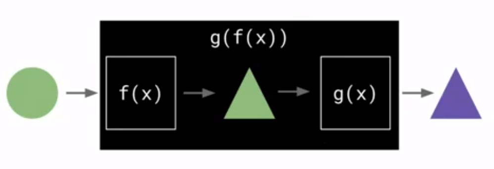

```js
let compose = (fn1, fn2) => fn2(fn1);
```

**Function composition:**

- **Easier to add features** -> This is the essential aspect of functional javascript - being able to list of our units of code by name and have them run one by one as independent, self-contained pieces
- **More readable** -> `reduce` is often wrapped in compose to say ‘combine up’ the functions to run our data through them one by one. The style is ‘point free’
- **Easier to debug** -> I know exactly the line of code my bug is in - it’s got a label!

---

### Functional Decoration

we can convert functions more easily to make them suit our task Without writing a new function from scratch, it will appear as we edit the function's body, but in reality **we're creating new wrapper outer function and using its Backpack that contains our function we saved** --> **it's using closure to supercharge our functions**

- here we want to edit the function `multiplyBy2()` to only run once

  ```js
  const oncify = convertMe => {
    let counter = 0;
    const inner = input => {
      if (counter === 0) {
        const output = convertMe(input);
        counter++;
        return output;
      }
      return 'Sorry';
    };
    return inner;
  };
  const multiplyBy2 = num => num * 2;
  const oncifiedMultiplyBy2 = oncify(multiplyBy2);
  oncifiedMultiplyBy2(10); // 20
  oncifiedMultiplyBy2(7); // Sorry
  ```

---

## JS : The weird parts

### Advanced Types

- `null` vs `undefined`
  
- `null` is you set it to **empty**, (a variable with no value - it may have had one at some point, but no longer has a value)
- `undefined` it's empty because it **has not been set** / **Doesn't currently have a value**.
- or `null` is empty on purpose, while `undefined` is still empty.
- `undefined` means a variable has been declared but **has not yet been assigned a value**
- `null` is an assignment value. It can be assigned to a variable as a representation of **no value**.

---

### Numbers

- **NaN**:

  - `typeof NaN` = `Number` --> as it's **invalid number**
  - example of `NaN` -> **division on strings** -> `"apple" / 3`
  - `Nan === NaN` --> **false**
  - `alert(isNaN("str"))` --> **true**

- **Negative zero**:

---

### short circuiting => **nullish coalescing operator** `??`

- it's like (or `||`) but works in a different way and can actually return `false value` 
  - if `a` is defined, then `a`.
  - if `a` isn’t defined, then `b`.
- **Optional chaining** `?.` :
  

  - is a safe way to access nested object properties, even if an intermediate property doesn’t exist.
  - enables you to read the value of a property located deep within a chain of connected objects without having to check that each reference in the chain is valid.
  - We can use `?.` for safe reading and deleting, but not writing

  ```js
    let user = null;

    user?.name = "John"; // Error, doesn't work
    // because it evaluates to: undefined = "John"
  ```

- without `strict mode`, `this` will point to the global object => `window`
  - **this is important to note before start thinking**

---

## notes

- `console` is not built in js, but it's from the `webApi`
- ( \` ) is called a backticks
- **Statements Vs Expressions** :
  - expression we get a value from it like `5+4` or `Ternary Operator` or `short circuiting` and then you can use it in a `${}`
  - Statements doesn't return a value
- **Recursion**: has one problem, in typical JavaScript implementations, it’s about three times slower than the looping version. Running through
  a simple loop is generally cheaper than calling a function multiple times.
- **Strict mode** :
  - It is not a statement, but a literal expression, ignored by earlier versions of JavaScript.
  - The purpose of `"use strict"` is to indicate that the code should be executed in "strict mode".
    - Please make sure that `"use strict"` is **at the top of your scripts**, otherwise strict mode may not be enabled.
  - Strict mode changes the (previously accepted "bad syntax") into real errors
    - as an example, in normal JavaScript, mistyping a variable name creates a new global variable. In strict mode, this will throw an error, making it impossible to accidentally create a global variable.
  - **Should we write it ?**
    - Modern JavaScript supports `“classes”` and `“modules”`, that enable `use strict` automatically. So we don’t need to add the `"use strict"` directive.
- `Refactoring the code` : means the process of restructuring code without changing or adding to its external behavior and functionality.
- in `DOM` => `:root` element is called `document.documentElement`
- to make anything `immutable` : `Object.freeze()`

  - it **only** freezes the first level of an object (not a `deep-freeze`)

  ```js
  Object.freeze({
    jonas: 1500,
    matilda: 100
  });

  Object.freeze([
    { value: 250, description: 'Sold old TV 📺', user: 'jonas' },
    { value: -45, description: 'Groceries 🥑', user: 'jonas' }
  ]);

  // or anything because everything is an "object"
  ```

- **Var** vs **const** & **let**

  - **Var** is function-scoped (not block-scoped) this means that if you used it in a block-scope it will also be available outside of this block-scope, **means you can't use the function-level variables outside the function-scope**

    ```js
    function f() {
      // It can be accessible any where (within) this function
      //
      var a = 10;
      console.log(a); // 10
    }
    f();

    // A cannot be accessible
    // outside of function
    console.log(a); // ReferenceError: a is not defined

    // ---------------------------------------------------------------

    if (true) {
      // It can be accessible any where
      var a = 10;
      console.log(a); // 10
    }
    console.log(a); // 10
    ```

  - **let** is both function-scoped and block-scoped, **means you can't use it outside the function-scope & block-scope**
  - if you used **const** in a `for loop` -> `for ( i = 0; i < 3; i++) {}` you will get error, as you won't be able to re-assign `i`

- There is a widespread practice to use constants (named using capital letters and underscores) as aliases for difficult-to-remember values that are known prior to execution.

  ```js
  const COLOR_ORANGE = '#FF7F00';
  ```

- short-circuiting ->

  ```js
  alert(alert(1) && alert(2)); // undefined
  // as alert doesn't return anything (returns undefined)
  ```

- **How is every thing is an Object ?** --> If one would want to do something with a primitive, like a `string` or a `number`. It would be great to access them using **methods**.

  - The language allows access to **methods** and **properties** of `strings`, `numbers`, `booleans` and `symbols`.
  - In order for that to work, a special “**object wrapper**” that provides the extra functionality is created, and then is destroyed.
  - you can also create this wrapper-object using constructor like `new`, but it's highly unrecommended. Things will go crazy in several places.

    ```js
    alert(typeof 0); // "number"
    alert(typeof new Number(0)); // "object"!

    let zero = new Number(0);
    if (zero) {
      // zero is true, because it's an object
      alert('zero is truthy!?!');
    }
    ```

  - On the other hand, using the same functions `String`/`Number`/`Boolean` without `new` is totally fine and useful thing. They convert a value to the corresponding type: to a string, a number, or a boolean (primitive).

    ```js
    let num = Number('123'); // convert a string to number
    ```

  - The special primitives `null` and `undefined` are exceptions. They have no corresponding “wrapper objects” and provide no methods. In a sense, they are “the most primitive”.

- **NO JAVASCRIPT**

  - If you have an `accordion menu`, `tabbed panels`, and `responsive slider` all hide some of their content by default. This content would be inaccessible to **visitors that do not have JavaScript enabled** if we didn't provide alternative styling.
  - One way to solve this is by adding a class attribute whose value is **"no-js"** to the opening `<html>` tag. This class is then removed by JavaScript (using the `replace()` method of the String object)
  - if JavaScript is enabled. The **"no-js"** class can then be used to provide styles targeted to visitors who do not have JavaScript enabled.

  ```html
  <!DOCTYPE html>
  <html class="no-js"></html>
  ```

  ```js
  var elDocument = document.documentElement;
  elDocument.className = elDocument.className.replace(/(^|\s)no-js(\s|$)/, '$1');
  ```
