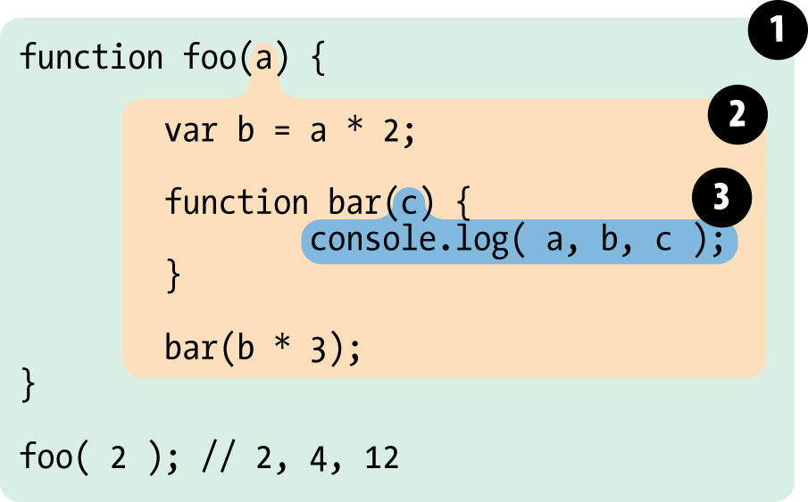

# INDEX

- [INDEX](#index)
  - [Compiled vs Interpreted Language](#compiled-vs-interpreted-language)
    - [Compiled Language](#compiled-language)
    - [Interpreted Language](#interpreted-language)
  - [JavaScript Engine](#javascript-engine)
    - [How the engine works ?](#how-the-engine-works-)
    - [call-stack \& Memory-heap](#call-stack--memory-heap)
  - [Types](#types)
    - [`==` vs `===`](#-vs-)
    - [Type Coercion](#type-coercion)
  - [Implicit vs Explicit](#implicit-vs-explicit)
  - [Scope](#scope)
    - [Lexical scope](#lexical-scope)
  - [Functional Programming](#functional-programming)
    - [currying \& partial Application](#currying--partial-application)
    - [Currying](#currying)
    - [Partial Function Application](#partial-function-application)
      - [Why do we usually make a partial function?](#why-do-we-usually-make-a-partial-function)
    - [Closure](#closure)
      - [Function returning Functions](#function-returning-functions)
      - [Benefits](#benefits)
    - [Pure Functions](#pure-functions)
    - [Decorators](#decorators)
      - [Using “func.call” for the context](#using-funccall-for-the-context)
    - [Iteration vs. Recursion](#iteration-vs-recursion)
    - [Recursion \& performance](#recursion--performance)
    - [first-class functions and higher order functions](#first-class-functions-and-higher-order-functions)
    - [Referential Transparency](#referential-transparency)
    - [Composition](#composition)
    - [Functional Decoration](#functional-decoration)
  - [Generators](#generators)
    - [Generator Methods](#generator-methods)
    - [Generators are Iterable](#generators-are-iterable)
    - [Generators in Async Code](#generators-in-async-code)
  - [JS : The weird parts](#js--the-weird-parts)
    - [Advanced Types](#advanced-types)
    - [Numbers](#numbers)
    - [short circuiting =\> **nullish coalescing operator** `??`](#short-circuiting--nullish-coalescing-operator-)
  - [Miscellaneous](#miscellaneous)
    - [Mutation observer](#mutation-observer)
    - [Selection and Range](#selection-and-range)
    - [Event loop: microtasks and macrotasks](#event-loop-microtasks-and-macrotasks)
      - [Event Loop](#event-loop)
      - [Macrotasks and Microtasks](#macrotasks-and-microtasks)
  - [Notes](#notes)

---

## Compiled vs Interpreted Language


### Compiled Language

- Language is written and compiled to machine code inside of an application
- Errors are detected during compiling
- The code won’t compile until it’s error-free
- it `optimizes` the code as it **cashes** any repeated function.
  - if it say `add(2,3)` function it caches its result (5) and uses it if it found the same function-call again --> **improves performance**
- Examples: C, C++, Erlang, Go

### Interpreted Language

- The interpreter translates and runs code **one statement at a time**
  - each line of code is translated to machine-code one-by-one as the script is run.
  - the interpreter always looks for **variables** and **function declarations** before going through each section of a script, line-by-line.
- Errors found when the code is run
- Interpreter starts running the code quickly
- Interpreted code runs more slowly
- it's more fit to `javascript` as JS runs on the browser

> Node.js Is an Interpreter

---

## JavaScript Engine

- javascript uses best of (**Interpreted** & **Compiled**) languages ---> **Jit Compiler**

  

- is `javascript` an interpreted language ?
  - yes, **initially** but it evolved to use compilers as well based on the implementation

### How the engine works ?

1. The engine (embedded if it’s a browser) reads (**“parses”**) the script.
2. Then it converts (**“compiles”**) the script to machine code.
3. And then the machine code runs, pretty fast.

### call-stack & Memory-heap

**Heap**: a much larger part of the memory that stores everything allocated dynamically, that allows a faster code execution, and protects it from corruption and makes the execution faster.

- Memory-heap: boxes which store datatypes -->error-> `memory leak`:

  - usually when you have values that has place in memory but not used
  - also common in **event listeners** which are always listening(waiting) for an event

- call-stack -->error-> `stack overflow`: usually from **recursion**
  - always the first thing in it is the **global execution context** (Code / variable declared outside a function)
    

> **global execution context** consists of 2 things:
>
> - storing variables / function in **memory** (global state)
> - performing functions execution in the **thread of execution (call stack)** where each function gets its own **mini execution context**

---

## Types

- **permatives** & **reference**
  
  - `value` at a specific `address` (**in the `call stack`**) is immutable ,,, but in the `Heap` its mutable
  - `reference-type` are stored in the `Heap` as we don't know how big its size would be so it's like if the `Heap` has unlimited storage unlike `call stack`

### `==` vs `===`

- Because of **type coercion**, the strict equality operators `===` and `!==` result in fewer unexpected values than `==` and `!=` do.
- If you know the types in comparison: prefer `==` as it's faster
- if `===` would always be equivalent to `==` in your code, using it everywhere sends a wrong semantic signal : **protecting myself since I don't know'trust the types**
- NOTES:

  - logical operators (like `&&`) allow you to compare the results of more than one comparison operator (like `===`).
  - The value `undefined` shouldn’t be compared to other values:

    ```js
    alert(undefined > 0); // false
    alert(undefined < 0); // false
    alert(undefined == 0); // false

    // "null" only equals "undefined"
    alert(undefined == null); // true
    alert(undefined === null); // false
    ```

### Type Coercion

it's the automatic or implicit conversion of values from one data type to another


- empty object `{}` /array `[]` => true
- empty string `""` => false

- `+` vs `-` :

  

- convert string to number using :

  - `unary` operator
    - it's a `+` or `-` before the string number => `console.log(+"565")`
    - it's a `!` before something => `console.log(! (x > 4) )`
  - `parseint()` or `parsefloat()` => `parseint(100Ahmed)` = 100

- `string to boolean`: 
  - `Boolean("0");` --> **true**

---

## Implicit vs Explicit


- **type coercion** is implicit whereas **type conversion** can be either implicit or explicit

---

## Scope

- **local variables:** The interpreter creates local variables when the function is run, and removes them as soon as the function has finished its task. This means that:
  - If the function runs twice, the variable can have different values each time.
  - Two different functions can use variables with the same name without any kind of naming conflict
  - without separate blocks there would be an **error**, if we use `let` with the existing variable name
- **global variables:**: Global variables are stored **in memory** for as long as the web page is loaded into the web browser. This means they take up more memory than local variables, and it also increases the risk of naming conflicts
  - For these reasons, **you should use local variables wherever possible**

---

### Lexical scope

> It's where the function was called (Functions are linked to the object they were defined within)

Each local scope can also see all the local scopes that contain it, and all scopes can see the global scope.

> (range of functionality) of a variables + Data that it may only be called (referenced) from **within the block of code in which it is defined in**.

- The Lexical Environment object consists of two parts:

  1. Environment Record – an object that stores all local variables as its properties (and some other information like the value of this).
  2. A reference to the outer lexical environment, the one associated with the outer code.

- A **“variable”** is a property of a special internal object, associated with the currently executing block/function/script.

  - “To get or change a variable” means “to get or change a property of that object”.

- it determines our available variables
- variable defined outside a function can be accessible inside another function defined after the variable declaration.
  - this accessible item is sometimes called a **Backpack** or **Persistent lexical scope referenced data (PLSRD)**
  - each execution of the function gets its own separated **Backpack**
- the opposite is **dynamic scope** --> It doesn't exist in JavaScript



> **Note**: (if not in strict mode) -> if variable is assign a value but never declared in a scope or block -> it automatically gets declared in the global scope

- if function is declared in a local scope, it can't be accessed outside:

  ```js
  let phrase = 'Hello';

  if (true) {
    let user = 'John';

    function sayHi() {
      alert(`${phrase}, ${user}`);
    }
  }

  sayHi(); // The result is an error.
  // The function sayHi is declared inside the if, so it only lives inside it. There is no sayHi outside.
  ```

---

## Functional Programming

- Functional programming is about **Verbs** (actions)

  - it's like a black box that takes something in and returns something out
  - it depends on **Tiny functions**: Save every single line (or few lines) as its own function
  - **Recombine/compose** Build up our application by using these small blocks of self-contained code combining them up line-by-line by referring to their human-readable name

    ```js
    // Todo list
    pipe(
      getPlayerName,
      getFirstName,
      properCase,
      addUserLabel,
      createUserTemplate
    )([{ name: 'Abdelrahman', score: 3 }]);
    ```

  - the result that we will get a code that is:
    - Easier to add features
    - More readable
    - Easier to debug

- object oriented programming is about **pronouns** (objects and things) -> "keep state to yourself and send/receive messages"

**functions :**

- Reduce the potential impact of any given line to maybe 10 other lines (inside the function)
- structure our code into individual pieces where almost every single line is **self-contained**
- **No consequences** except on that line Each function’s only ‘consequence’ is to have its result given to specifically the next line of code (‘function call’) and not to any other lines

---

### currying & partial Application


> These 2 concepts use **Closures**

### Currying

Currying is a transformation of functions that translates a function from callable as `f(a, b, c)` into callable as `f(a)(b)(c)`. **Currying doesn’t call a function. It just transforms it.**

- Currying allows us to easily get partials.
- It is translating a function that takes multiple arguments into a sequence of **single-argument-functions**, each accepting one argument.

```js
function curry(f) {
  // curry(f) does the currying transform
  return function (a) {
    return function (b) {
      return f(a, b);
    };
  };
}

// usage
function sum(a, b) {
  return a + b;
}

let curriedSum = curry(sum);

alert(curriedSum(1)(2)); // 3
```

- **Nores:**
  - The currying requires the function to have a fixed number of arguments.
  - A function that uses rest parameters, such as `f(...args)`, can’t be curried this way.

---

### Partial Function Application

> Creating a new function by fixing some parameters of the existing one.

It's the process of applying a function to some of its arguments. The partially applied function gets returned for later use

- it's creating a new outer-function that calls our multi-argument function with the argument, and the multi-argument function stored conveniently in the **Backpack**

  ```js
  const multiply = (a, b) => a * b;
  function prefillFunction(fn, prefilledValue) {
    const inner = liveInput => {
      const output = fn(liveInput, prefilledValue);
      return output;
    };
    return inner;
  }
  const multiplyBy2 = prefillFunction(multiply, 2);
  const result = multiplyBy2(5);
  ```

- **we can also use `bind()` for "`this`"**:

  ```js
  // Syntax
  let bound = func.bind(context, [arg1], [arg2], ...);

  // EX:
  function mul(a, b) {
    return a * b;
  }

  let double = mul.bind(null, 2);

  alert( double(3) ); // = mul(2, 3) = 6
  alert( double(4) ); // = mul(2, 4) = 8
  ```

  - Please note that we actually don’t use `"this"` here. But `bind` requires it, so we must put in something like `null`.
  - The call to `mul.bind(null, 2)` **creates a new function** `double` that passes calls to `mul`, fixing `mull` as the context and `2` as the first argument. Further arguments are passed “as is”.

- **Going partial without context ("`this`")**

  - What if we’d like to fix some arguments, but not the context `this`? For example, for an object method.
    - The native `bind()` does not allow that. We can’t just omit the context and jump to arguments.
  - Fortunately, a function `partial()` for binding only arguments can be easily implemented:

  ```js
  function partial(func, ...argsBound) {
    return function (...args) {
      return func.call(this, ...argsBound, ...args);
    };
  }

  // Usage:
  let user = {
    firstName: 'John',
    say(time, phrase) {
      alert(`[${time}] ${this.firstName}: ${phrase}!`);
    }
  };

  // add a partial method with fixed time
  user.sayNow = partial(user.say, new Date().getHours() + ':' + new Date().getMinutes());

  user.sayNow('Hello'); // [10:00] John: Hello!
  ```

  - Also there’s a ready [\_.partial](https://lodash.com/docs#partial) implementation from **lodash** library.

---

#### Why do we usually make a partial function?

- The benefit is that we can create an independent function with a readable name (`double`, `triple`). We can use it and not provide the first argument every time as it’s fixed with `bind`.
- In other cases, **partial application** is useful when we have a very generic function and want a less universal variant of it for convenience.
  - For instance, we have a function `send(from, to, text)`. Then, inside a user object we may want to use a partial variant of it: `sendTo(to, text)` that sends from the current user.

---

### Closure

It's the ability to treat functions (when executed) as values

> **a function remembers where it was born in the special property `[[Environment]]`. It references the Lexical Environment from where it’s created**
>
> - But when a function is created using **new Function()** have `[[Environment]]` referencing the global Lexical Environment, not the outer one. Hence,
> - they cannot use outer variables. But that’s actually good, because it insures us from errors. Passing parameters explicitly is a much better method architecturally and causes no problems with minifiers.

A closure is a function that remembers its outer variables and can access them.

> When on an interview, a frontend developer gets a question about “what’s a closure?”, a valid answer would be a definition of the closure and an explanation that all functions in JavaScript are closures, and maybe a few more words about technical details: the **`[[Environment]]`** property and how Lexical Environments work.


one of the biggest examples of closures is **timers**: 


- A closure is the combination of a function bundled together (`enclosed`) with references to its surrounding state (the lexical environment). In other words, **a closure gives you access to an outer function's scope from an inner function**. In JavaScript, closures are created every time a function is created, at function creation time.
- A closure makes sure that a function doesn’t loose connection to variables that existed at the function’s birth place
- inner function can remember outer function's scope

  ```javascript
  function multiplier(factor) {
    return number => number * factor;
  }
  let twice = multiplier(2);
  console.log(twice(5)); // → 10
  ```

- using callback function which has arguments (Passing "argument" into handler) :

  ```javascript
  // handleHover is a function with 2 parameters(e,opacity)
  // Method 1
  nav.addEventListener('mouseover', function (e) {
    handleHover(e, 0.5);
  });

  // Method 2 (see example for explanation)
  nav.addEventListener('mouseover', handleHover.bind(0.5));
  ```

- when you want to turn **block-scope** into a **functional-scope** -> use **IIFE**
  - usually used to prevent variable to be in the global scope like with (variables declared with `var`) here:
    
  - Often used to ensure that the variable names do not conflict with each other (especially if the page uses more than one script).
  - also used for
    - code that only needs to run once within a task, rather than repeatedly being called by other parts of the script.
    - As an argument when a function is called
    - In event handlers and listeners
    - To prevent conflicts between two scripts that might use the same variable names

#### Function returning Functions

this is a form of **Closure**, as in this example:

- most importantly -> `generatedFunc` **doesn't have any connection to** `createFunction`, as:
  - here `generatedFunc` is not equal to `createFunction` function
  - but it's equal to "what `createFunction` function has returned **when it was created(ran)**"
- Please note that if `f()` is called many times, and resulting functions are saved, then all corresponding Lexical Environment objects will also be retained in memory. In the code below, all 3 of them:.

  ```js
  function f() {
    let value = Math.random();

    return function () {
      alert(value);
    };
  }

  // 3 functions in array, every one of them links to Lexical Environment
  // from the corresponding f() run
  let arr = [f(), f(), f()];
  ```

#### Benefits

- It's usually memory-efficient as it caches the values inside its block-scoped (where it was called) **(its local memory (like Backpack) + the returned value from the function)** in case that it was called again, this will be in the hidden property called `__scope__`.
  - > all functions have the hidden property named `[[Environment]]` > 
  - actually the **Backpack** doesn't contain "all" the local memory of the function, but it contains only the values/variables that will be used in the function body and will get rid of other unused things in the local memory using **garbage collection**
    
    - A Lexical Environment object dies (garbage collected) when it becomes **unreachable** (just like any other object). In other words, it exists only while there’s at least one nested function referencing it.
      - But in practice, JavaScript engines try to optimize that. They analyze variable usage and if it’s obvious from the code that an outer variable is not used – it is removed.
    - this is the main concept behind **iterator function**, where it persists a function called **returnNextElement**, which has:
      1. Our underlying array itself
      2. The position we are currently at in our ‘stream’ of elements
      3. The ability to return the next element
  - > So **iterators** turn our data into ‘streams’ of actual values we can access one after another.
  - > JavaScript’s built in iterators are actually objects with a **next()** method that when called returns the next element from the ‘stream’/ flow
- Encapsulation: prevent unwanted access to inner variables/functions

---

### Pure Functions

- **Pure function**: Function **without side effects (predictable)**. Does not depend on external variables. Given the same inputs, always **returns** the same outputs
  - pure function **must** return something
- **side-effects**: are about MODIFICATION and doesn't count if we created new item
  - usually it's anything that the function does other that returning a value

---

### Decorators

**Decorator** is a wrapper around a function that alters its behavior. The main job is still carried out by the function.

- Ex: create a wrapper-function around another function (Pure function) to cache its (behavior or the return-value) for multiple use

  - here: The result of `cachingDecorator(func)` is a "wrapp"r”: function(x) that “wraps” the call of func(x) into caching logic:

    ```js
    function slow(x) {
      // there can be a heavy CPU-intensive job here
      alert(`Called with ${x}`);
      return x;
    }

    function cachingDecorator(func) {
      let cache = new Map();

      return function (x) {
        if (cache.has(x)) {
          // if there's such key in cache
          return cache.get(x); // read the result from it
        }

        let result = func(x); // otherwise call func

        cache.set(x, result); // and cache (remember) the result
        return result;
      };
    }

    slow = cachingDecorator(slow);

    alert(slow(1)); // slow(1) is cached and the result returned
    alert('Again: ' + slow(1)); // slow(1) result returned from cache
    ```

  - there are several benefits of using a separate `cachingDecorator()` instead of altering the code of `slow()` itself:
    1. The `cachingDecorator()` is reusable. We can apply it to another function.
    2. The caching logic is separate, it did not increase the complexity of `slow()` itself (if there was any).
    3. We can combine multiple decorators if needed.

#### Using “func.call” for the context

The caching decorator mentioned above is not suited to work with **object methods**. The reason is that the **wrapper** calls the original function as `func(x)`. And, when called like that, the function gets `this = undefined`.

- To solve this, we need to do one of the followings

  - using the built-in function method **func.call(context, …args)** that allows to call a function explicitly setting **this** keyword.
    - It runs func providing the first argument as `this`, and the next as the arguments.

---

### Iteration vs. Recursion

In **functional programming**, we avoid `mutable state`, and therefore avoid `iterative loops` using for or while. As an alternative to iteration, we use **recursion** to break down the problem into smaller ones.

> **Recursion**: is a programming pattern that is useful in situations when a task can be naturally split into several tasks of the same kind, but simpler. Or when a task can be simplified into an easy action plus a simpler variant of the same task.
>
> - When a function solves a task, in the process it can call many other functions. A partial case of this is when a function calls itself. That’s called **recursion**.

A recursive function has two parts:

- `Base case`: condition(s) under which the function returns an output without making a recursive call
- `Recursive case`: condition(s) under which the function calls itself to return the output

Difference between iteration and recursion:

- A recursive solution is usually shorter than an iterative one.
- **Recursion**: has one problem, in typical JavaScript implementations, it’s about three times slower than the looping version. Running through a simple loop is generally cheaper than calling a function multiple times.
- Any recursion can be rewritten as a loop. The loop variant usually can be made more effective.
  - But sometimes the rewrite is non-trivial, especially when a function uses different recursive subcalls depending on conditions and merges their results or when the branching is more intricate. And the optimization may be unneeded and totally not worth the efforts.
- A recursive solution is usually shorter than an iterative one.

---

### Recursion & performance

recursion sometimes take long time as it calls multiple functions at the same time which occupies the **call stack**

- one solution is to use **memoization (caching)**

  - A loop-based algorithm is more memory-saving.
  - The iterative solution uses a single context (place in memory which is the iteration index) changing `i` and result in the process. Its memory requirements are small, fixed and do not depend on `n`.

- another solution is to use **tail call optimization**
  - **Note**: not all JavaScript engines implements **tail calls**
- The maximal recursion depth is limited by JavaScript engine. We can rely on it being `10000`, some engines allow more, but `100000` is probably out of limit for the majority of them.
- **Recursive structures**: A recursive (recursively-defined) data structure is a structure that replicates itself in parts.
  - For examples: `HTML` and `XML documents`.
    - `HTML-tag` may contain a list of: [`Text pieces`, `HTML comments`, `other HTML tags`]

---

### first-class functions and higher order functions

- **first class objects** is just a feature that a programming language either has or does not have. (All it means is that all functions are values:
  - can be assigned to variables
  - can be passed as arguments to another function
  - can be returned as values from another function --> **closure**
    
- There are however **higher order functions** in practice, which are possible because the language supports "first class functions".

  - it's a function that accepts another function as an argument or returns another function as a result.
    

  - Easier to add features, more readable, easier to debug
  - we can **chain** these higher order functions (pass the output of one as the input of the next)
  - ex: `call`, `apply`, `bind` :

  - `call` => calls a function with the given lexical context as parameter (`call` it's like calling the `this` of the one object that calls the function)

    ```javascript
    let human = { name: 'Ahmed' };
    function sayName(greeting) {
      console.log(greeting + ' ' + this.name);
    }
    sayName.call(human, 'Hi!'); // Outputs Hi! Ahmed
    ```

  - `apply` => is just like `call()` except that it accepts arguments in array

    - it's not used in modern javascript because we can instead use `spread operator ...` with `call()`

    ```javascript
    let human = { name: ‘Ahmed’ }
    function sayName(greeting, city) {
      console.log(greeting + ' ' + this.name + ' from ' + city)
    }
    sayName.apply(human, ['Hi', 'Cairo']) // Outputs Hi! Ahmed from Cairo
    ```

  - `bind` => is somewhat special. It is a higher-order function which means when you invoke it => **it returns a new function where `this` keyword is bound**. The function returned is curried, meaning you can call it multiple times to provide different arguments in each call.

    - _note_ => `bind` doesn't call the function that's why it's used in `eventListeners`
    - it's also used to set arguments so that we won't have to write them each time

    ```javascript
    let human = { name: 'Ahmed' };
    function sayName(greeting, city) {
      console.log(greeting + ' ' + this.name + ' from ' + city);
    }

    let greet = sayName.bind(human);
    greet('Hi!', 'Cairo'); // Outputs Hi! Ahmed from Cairo
    greet('Hello!', 'Alex'); // Outputs Hello! Ahmed from Makati

    // ----------Partial Application---------- //
    // here if you don't want to specify (this) keyword => use (null), as (typeof null = "object")
    const add = function (a, b) {
      return a + b;
    };
    const add2 = add.bind(null, 2);
    // now : a=2

    add2(10) === 12;
    ```

- **reducer function** is the process (function) of taking 2 elements and do an operation on them and returning only one thing

---

### Referential Transparency

- **Referential Transparency**: emphasizes that an expression (or function) in a JavaScript program may be replaced by its **value / returned value** or any other variable having the same value without changing the result of the program. As a result, methods should always return the same value for the given argument without any side effects
- it's like **(I can replace the function-call with its returned-output and it’s the same)**


---

### Composition

It is the **combination of two functions into one**, that when applied, returns the result of the chained functions **(using reduction of the result value)**.

> In functional Programming, Composition **takes the place of inheritance in OOP**.

- Chaining with dots relies on JavaScript prototype feature - functions return arrays which have access to all the high-order-function (map, filter, reduce), but if I want to chain functions that just return a regular output:

  ```js
  const multiplyBy2 = x => x * 2;
  const add3 = x => x + 3;
  const divideBy5 = x => x / 5;
  const initialResult = multiplyBy2(11);
  const nextStep = add3(initialResult);
  const finalStep = divideBy5(nextStep);
  console.log('finalStep', finalStep);
  ```

  - **But that’s risky, people can overwrite**

- Composition is a fancy term which means "combining pure functions to build more complicated ones" (make complex programs out of simple functions).


```js
let compose = (fn1, fn2) => fn2(fn1);
```

**Function composition:**

- **Easier to add features** -> This is the essential aspect of functional javascript - being able to list of our units of code by name and have them run one by one as independent, self-contained pieces
- **More readable** -> `reduce` is often wrapped in compose to say ‘combine up’ the functions to run our data through them one by one. The style is ‘point free’
- **Easier to debug** -> I know exactly the line of code my bug is in - it’s got a label!

---

### Functional Decoration

we can convert functions more easily to make them suit our task Without writing a new function from scratch, it will appear as we edit the function's body, but in reality **we're creating new wrapper outer function and using its Backpack that contains our function we saved** --> **it's using closure to supercharge our functions**

- here we want to edit the function `multiplyBy2()` to only run once

  ```js
  const oncify = convertMe => {
    let counter = 0;
    const inner = input => {
      if (counter === 0) {
        const output = convertMe(input);
        counter++;
        return output;
      }
      return 'Sorry';
    };
    return inner;
  };
  const multiplyBy2 = num => num * 2;
  const oncifiedMultiplyBy2 = oncify(multiplyBy2);
  oncifiedMultiplyBy2(10); // 20
  oncifiedMultiplyBy2(7); // Sorry
  ```

---

## Generators

Regular functions return only one, single value (or nothing). **Generators** can return (`“yield”`) multiple values, one after another, on-demand. They work great with iterables, allowing to create data streams with ease.

- Once we start thinking of our data as flows (where we can pick of an element one-by-one) we can rethink how we produce those flows - JavaScript now lets us produce the flows using a function
- the Generator function allows us to exit and renter the execution-context of function manually, unlike iterators which this happens dynamically
- To create a generator, we need a special syntax construct: `function*`, so-called **“generator function”**.

  - Generator functions behave differently from regular ones. When such function is called, it doesn’t run its code. Instead it returns a special object, called **“generator object”**, to manage the execution.

    ```js
    function* generateSequence() {
      yield 1;
      yield 2;
      return 3;
    }

    // "generator function" creates "generator object"
    let generator = generateSequence(); // The function code execution hasn’t started yet
    alert(generator); // [object Generator]
    ```

> **Note:** `function* f(…)` or `function *f(…)`?
>
> - Both syntaxes are correct. But usually the first syntax is preferred
> - we usually use the second syntax in object/class ES6 methods

### Generator Methods

- The main method of a generator is `next()`. When called, it runs the execution until the nearest `yield <value>` statement (value can be omitted, then it’s `undefined`). Then the function execution pauses, and the yielded value is returned to the outer code.

  - The result of `next()` is always an object with two properties:

    - `value`: the yielded value.
    - `done`: `true` if the function code has finished, otherwise `false`.
      - When the generator is done. We should see it from `done:true`, and New calls to `generator.next()` don’t make sense any more. If we do them, they return the same object: `{done: true}`.

    ```js
    function* generateSequence() {
      yield 1;
      yield 2;
      return 3;
    }

    let generator = generateSequence();

    let one = generator.next();

    alert(JSON.stringify(one)); // {value: 1, done: false}
    ```

  - **"yield" is a two-way street**: That’s because `yield` is a two-way street: it not only returns the result to the outside, but also can pass the value inside the generator.

    - when we pass a value to the `next()` method, it will be evaluated as the yielded value and we will continue the function until we find another yield

    ```js
    function* createFlow() {
      const num = 10;
      const newNum = yield num;
      yield 5 + newNum;
      yield 6;
    }
    const returnNextElement = createFlow(); // The function code execution hasn’t started yet
    const element1 = returnNextElement.next(); // 10
    const element2 = returnNextElement.next(2); // 7
    ```

- `generator.return(value)`

  - it finishes the generator execution and return the given value.

    ```js
    function* gen() {
      yield 1;
      yield 2;
      yield 3;
    }

    const g = gen();

    g.next(); // { value: 1, done: false }
    g.return('foo'); // { value: "foo", done: true }
    g.next(); // { value: undefined, done: true }
    ```

  - Often we don’t use it, as most of time we want to get all returning values, but it can be useful when we want to stop generator in a specific condition.

### Generators are Iterable

- We can loop over their values using `for..of`:

  ```js
  function* generateSequence() {
    yield 1;
    yield 2;
    return 3;
  }

  let generator = generateSequence();

  for (let value of generator) {
    alert(value); // 1, then 2
  }
  ```

  - **Note**: the example above shows `1`, then `2`, and that’s all. It doesn’t show `3`!
    - It’s because `for..of` iteration ignores the last value, when `done: true`. So, if we want all results to be shown by `for..of`, we must return them with `yield`

- As generators are iterable, we can call all related functionality, e.g. the **spread syntax `...`**:

  ```js
  function* generateSequence() {
    yield 1;
    yield 2;
    yield 3;
  }

  let sequence = [0, ...generateSequence()];
  alert(sequence); // 0, 1, 2, 3
  ```

### Generators in Async Code

- `returnNextElement` is a special object (a **generator object**) that when its `next` method is run starts (or continues) running createFlow **execution-context** until it hits `yield` and returns out the value being yielded **without continuing the function**

  - We end up with a ‘stream’/flow of values that we can get one-by-one by running `returnNextElement.next()`
  - And most importantly, for the first time we get to pause (‘suspend’) a function being run and then return to it by calling `returnNextElement.next()`

- This is actually what happens behind the scene in **Asynchronous javascript**, as we want to:

  1. Initiate a task that takes a long time (e.g. requesting data from the server)
  2. Move on to more synchronous regular code in the meantime
  3. Run some functionality once the requested data has come back

  ```js
  function doWhenDataReceived(value) {
    returnNextElement.next(value);
  }
  function* createFlow() {
    const data = yield fetch('http://twitter.com/will/tweets/1');
    console.log(data);
  }
  const returnNextElement = createFlow();
  const futureData = returnNextElement.next();
  futureData.value.then(doWhenDataReceived);
  ```

  - Explanation of the code above:
    

- **Async/await** simplifies all this and finally fixes the inversion of control problem of callbacks

  - as it automatically triggers the function on the promise-resolution **(this functionality is still added to the micro-task queue though)**

  ```js
  async function createFlow() {
    console.log('Me first');
    const data = await fetch('https://twitter.com/will/tweets/1');
    console.log(data);
  }
  createFlow();
  console.log('Me second');
  ```

---

## JS : The weird parts

### Advanced Types

- **`null` vs `undefined`**
  
  - `null` is you set it to **empty**, (a variable with no value - it may have had one at some point, but no longer has a value)
    - developer sets the value
  - `undefined`
    - javascript can't find value for it
    - it's empty because it:
      - variable without value:
        - **has not been set**
        - **Doesn't currently have a value**.
      - missing function arguments
      - missing object properties
- or `null` is empty on purpose, while `undefined` is still empty.
- `undefined` means a variable has been declared but **has not yet been assigned a value**
- `null` is an assignment value. It can be assigned to a variable as a representation of **no value**.

---

### Numbers

- **NaN**:

  - `typeof NaN` = `Number` --> as it's **invalid number**
  - example of `NaN` -> **division on strings** -> `"apple" / 3`
  - `Nan === NaN` --> **false**
  - `alert(isNaN("str"))` --> **true**

- **BigInt**:

  - `BigInt` is a special numeric type that provides support for integers of arbitrary length.
  - BigInt can mostly be used like a regular number,

    - All operations on `bigints` return `bigints`.
    - for example:

      ```js
      alert(1n + 2n); // 3
      alert(5n + 2n); // 2 (not 2.5)
      ```

    - We can’t mix `bigints` and regular numbers:

      ```js
      alert(1n + 2); // Error: Cannot mix BigInt and other types
      ```

      - to do so, we can explicitly convert them if needed: using either `BigInt()` or `Number()` constructors

    - The unary plus is not supported on bigints

      ```js
      alert(+25n); // error
      ```

  - **Polyfills**
    - Polyfilling bigints is tricky. The reason is that many JavaScript operators, such as `+`, `-` and so on behave differently with bigints compared to regular numbers.
    - we can use the polyfill proposed by the developers of [JSBI library](https://github.com/GoogleChromeLabs/jsbi).

---

### short circuiting => **nullish coalescing operator** `??`

- it's like (or `||`) but works in a different way and can actually return `false value` 
  - if `a` is defined, then `a`.
  - if `a` isn’t defined, then `b`.
- **Optional chaining** `?.` :
  

  - is a safe way to access nested object properties, even if an intermediate property doesn’t exist.
  - enables you to read the value of a property located deep within a chain of connected objects without having to check that each reference in the chain is valid.
  - We can use `?.` for safe reading and deleting, but not writing

  ```js
    let user = null;

    user?.name = "John"; // Error, doesn't work
    // because it evaluates to: undefined = "John"
  ```

- without `strict mode`, `this` will point to the global object => `window`
  - **this is important to note before start thinking**

---

## Miscellaneous

### Mutation observer

**MutationObserver** is a built-in object that observes a DOM element and fires a callback when it detects a change.

```js
// First, we create an observer with a callback-function:
let observer = new MutationObserver(callback);
// And then attach it to a DOM node:
observer.observe(node, config);
```

- `config` is an object with boolean options “what kind of changes to react on”:
  - `childList` – changes in the direct children of node
  - `subtree` – in all descendants of node
  - `attributes` – attributes of node
  - `attributeOldValue` – if `true`, pass both the old and the new value of attribute to callback (see below), otherwise only the new one (needs attributes option),
  - `attributeFilter` – an array of attribute names, to observe only selected ones.
  - `characterData` – whether to observe node.data (text content),
  - `characterDataOldValue` – if true, pass both the old and the new value of node.data to callback (see below), otherwise only the new one (needs characterData option).

```html
<div contenteditable id="elem">
  Click and
  <b>edit</b>
  , please
</div>

<script>
  let observer = new MutationObserver(mutationRecords => {
    console.log(mutationRecords); // console.log(the changes)
  });

  // observe everything except attributes
  observer.observe(elem, {
    childList: true, // observe direct children
    subtree: true, // and lower descendants too
    characterDataOldValue: true // pass old data to callback
  });
</script>
```

- UseCases"
  - Using `MutationObserver`, we can detect when the unwanted element appears in our DOM and remove it. ex: third-party script that contains useful functionality, but also does something unwanted, e.g. shows ads `<div class="ads">Unwanted ads</div>`.
  - There are other situations when a third-party script adds something into our document, and we’d like to detect, when it happens, to adapt our page, dynamically resize something etc.

---

### Selection and Range

It's an advance topic and you can find it here [Selection and Range](https://javascript.info/selection-range) if needed

---

### Event loop: microtasks and macrotasks

#### Event Loop

There’s an endless loop, where the JavaScript engine waits for tasks, executes them and then sleeps, waiting for more tasks.

- The general algorithm of the engine:

  1. While there are tasks: execute them, starting with the oldest task.
  2. Sleep until a task appears, then go to **1**.

- The tasks form a queue, so-called **macrotask queue** (v8 term)
  - Tasks from the queue are processed on “first come – first served” basis.
- Notes for the DOM:
  - Rendering never happens while the engine executes a task. It doesn’t matter if the task takes a long time. Changes to the DOM are painted only after the task is complete.
  - If a task takes too long, the browser can’t do other tasks, such as processing user events. So after a time, it raises an alert like “Page Unresponsive”, suggesting killing the task with the whole page. That happens when there are a lot of complex calculations or a programming error leading to an infinite loop.

#### Macrotasks and Microtasks

- **Microtasks** come solely from our code. They are usually created by promises: an execution of `.then`/`catch`/`finally` handler becomes a microtask (more [here](./05-ASYNC.md#microtasks)). Microtasks are used “under the cover” of `await` as well, as it’s another form of promise handling.

- **Immediately after every macrotask, the engine executes all tasks from microtask queue, prior to running any other macrotasks or rendering or anything else.**

  - All microtasks are completed before any other event handling or rendering or any other macrotask takes place.

  ```js
  setTimeout(() => alert('timeout')); // 3 -> because it’s a macrotask.

  Promise.resolve().then(() => alert('promise')); // 2 ->  because .then passes through the microtask queue, and runs after the current code.

  alert('code'); // 1 -> it’s a regular synchronous call.
  ```

- If we’d like to execute a function asynchronously (after the current code), but before changes are rendered or new events handled, we can schedule it with `queueMicrotask` function.

  ```js
  let i = 0;
  function count() {
    // do a piece of the heavy job (*)
    do {
      i++;
      progress.innerHTML = i;
    } while (i % 1e3 != 0);

    if (i < 1e6) {
      queueMicrotask(count);
    }
  }
  ```

- **Web Workers**
  - For long heavy calculations that shouldn’t block the event loop, we can use Web Workers.
  - That’s a way to run code in another, parallel thread.
  - Web Workers can exchange messages with the main process, but they have their own variables, and their own event loop.
  - Web Workers do not have access to DOM, so they are useful, mainly, for calculations, to use multiple CPU cores simultaneously.

---

## Notes

- `console` is not built in js, but it's from the `webApi`
- ( \` ) is called a backticks
- **Statements Vs Expressions** :
  - expression we get a value from it like `5+4` or `Ternary Operator` or `short circuiting` and then you can use it in a `${}`
  - Statements doesn't return a value
- **Strict mode** :
  - It is not a statement, but a literal expression, ignored by earlier versions of JavaScript.
  - The purpose of `"use strict"` is to indicate that the code should be executed in "strict mode".
    - Please make sure that `"use strict"` is **at the top of your scripts**, otherwise strict mode may not be enabled.
  - Strict mode changes the (previously accepted "bad syntax") into real errors
    - as an example, in normal JavaScript, mistyping a variable name creates a new global variable. In strict mode, this will throw an error, making it impossible to accidentally create a global variable.
    - If a variable is not found anywhere, that’s an error in strict mode (without `use strict`, an assignment to a non-existing variable creates a new **global** variable, for compatibility with old code).
  - **Should we write it ?**
    - Modern JavaScript supports `“classes”` and `“modules”`, that enable `use strict` automatically. So we don’t need to add the `"use strict"` directive.
- `Refactoring the code` : means the process of restructuring code without changing or adding to its external behavior and functionality.
- in `DOM` => `:root` element is called `document.documentElement`
- to make anything `immutable` : `Object.freeze(obj)`

  - it **only** freezes the first level of an object (not a `deep-freeze`)

  ```js
  Object.freeze({
    jonas: 1500,
    matilda: 100
  });

  Object.freeze([
    { value: 250, description: 'Sold old TV 📺', user: 'jonas' },
    { value: -45, description: 'Groceries 🥑', user: 'jonas' }
  ]);

  // or anything because everything is an "object"
  ```

- **Var** vs **const** & **let**

  - **Var**

    - is function-scoped (`“var”` has no block scope) this means that if you used it in a block-scope it will also be available outside of this block-scope, **means you can't use the function-level variables outside the function-scope**

      - Variables, declared with `var`, are either function-scoped or global-scoped. They are visible through blocks.

      ```js
      function f() {
        // It can be accessible any where (within) this function
        //
        var a = 10;
        console.log(a); // 10
      }
      f();

      // A cannot be accessible
      // outside of function
      console.log(a); // ReferenceError: a is not defined

      // ---------------------------------------------------------------

      if (true) {
        // It can be accessible any where
        var a = 10;
        console.log(a); // 10
      }
      console.log(a); // 10

      // ---------------------------------------------------------------

      for (var i = 0; i < 10; i++) {
        var one = 1;
        // ...
      }
      alert(i); // 10, "i" is visible after loop, it's a global variable
      alert(one); // 1, "one" is visible after loop, it's a global variable
      ```

    - `“var”` tolerates redeclarations

      ```js
      let user;
      let user; // SyntaxError: 'user' has already been declared

      var user = 'Pete';
      var user = 'John'; // this "var" does nothing (already declared)
      // ...it doesn't trigger an error

      alert(user); // John
      ```

    - `“var”` variables can be declared below their use

      - `var` declarations are processed when the function starts (or script starts for globals). In other words, `var` variables are defined from the beginning of the function, no matter where the definition is

        ```js
        function sayHi() {
          phrase = 'Hello';

          alert(phrase);

          var phrase;
        }
        sayHi();
        ```

      - **Important Note**: Declarations are hoisted, but assignments are not.

        - Because all `var` declarations are processed at the function start, we can reference them at any place. But variables are `undefined` until the assignments.

        ```js
        function sayHi() {
          var phrase; // declaration works at the start...

          alert(phrase); // undefined

          phrase = 'Hello'; // ...assignment - when the execution reaches it.
        }

        sayHi();
        ```

- **let** is both function-scoped and block-scoped, **means you can't use it outside the function-scope & block-scope**
- if you used **const** in a `for loop` -> `for ( i = 0; i < 3; i++) {}` you will get error, as you won't be able to re-assign `i`

- There is a widespread practice to use constants (named using capital letters and underscores) as aliases for difficult-to-remember values that are known prior to execution.

  ```js
  const COLOR_ORANGE = '#FF7F00';
  ```

- short-circuiting ->

  ```js
  alert(alert(1) && alert(2)); // undefined
  // as alert doesn't return anything (returns undefined)
  ```

- **How is every thing is an Object ?** --> If one would want to do something with a primitive, like a `string` or a `number`. It would be great to access them using **methods**.

  - The language allows access to **methods** and **properties** of `strings`, `numbers`, `booleans` and `symbols`.
  - In order for that to work, a special “**object wrapper**” that provides the extra functionality is created, and then is destroyed.
  - you can also create this wrapper-object using constructor like `new`, but it's highly unrecommended. Things will go crazy in several places.

    ```js
    alert(typeof 0); // "number"
    alert(typeof new Number(0)); // "object"!

    let zero = new Number(0);
    if (zero) {
      // zero is true, because it's an object
      alert('zero is truthy!?!');
    }
    ```

  - On the other hand, using the same functions `String`/`Number`/`Boolean` without `new` is totally fine and useful thing. They convert a value to the corresponding type: to a string, a number, or a boolean (primitive).

    ```js
    let num = Number('123'); // convert a string to number
    ```

  - The special primitives `null` and `undefined` are exceptions. They have no corresponding “wrapper objects” and provide no methods. In a sense, they are “the most primitive”.

- **NO JAVASCRIPT**

  - If you have an `accordion menu`, `tabbed panels`, and `responsive slider` all hide some of their content by default. This content would be inaccessible to **visitors that do not have JavaScript enabled** if we didn't provide alternative styling.
  - One way to solve this is by adding a class attribute whose value is **"no-js"** to the opening `<html>` tag. This class is then removed by JavaScript (using the `replace()` method of the String object)
  - if JavaScript is enabled. The **"no-js"** class can then be used to provide styles targeted to visitors who do not have JavaScript enabled.

  ```html
  <!DOCTYPE html>
  <html class="no-js"></html>
  ```

  ```js
  var elDocument = document.documentElement;
  elDocument.className = elDocument.className.replace(/(^|\s)no-js(\s|$)/, '$1');
  ```

- **polyfills**

  - We use the **global object** to test for support of modern language features.

    - If there’s none (say, we’re in an old browser), we can create “polyfills”: add functions that are not supported by the environment, but exist in the modern standard.

  ```js
  // For instance, test if a built-in Promise object exists (it doesn’t in really old browsers):
  if (!window.Promise) {
    alert('Your browser is really old!');
    window.Promise = ... // custom implementation of the modern language feature
  }
  ```

- In JavaScript, **functions are objects**.

  - Function objects contain some useable properties; For instance, a function’s name is accessible as the `“name”` property:

    ```js
    function sayHi() {
      alert('Hi');
    }

    alert(sayHi.name); // sayHi
    ```

  - the name-assigning logic is smart. It also assigns the correct name to a function even if it’s created without one, and then immediately assigned:

    ```js
    let sayHi = function () {
      alert('Hi');
    };

    alert(sayHi.name); // sayHi (there's a name!)
    ```

  - **The “length” property**

    - built-in property `“length”` that returns the number of function parameters, for instance:

    ```js
    function f1(a) {}
    function f2(a, b) {}
    function many(a, b, ...more) {}

    alert(f1.length); // 1
    alert(f2.length); // 2
    alert(many.length); // 2
    ```

    > - The length property is sometimes used for introspection in functions that operate on other functions.
    > - For instance, in the code below the ask function accepts a question to ask and an arbitrary number of handler functions to call. Once a user provides their answer, the function calls the handlers. We can pass two kinds of handlers:
    > - A zero-argument function, which is only called when the user gives a positive answer.
    > - A function with arguments, which is called in either case and returns an answer.

- **Arrow functions:**
  - Do not have `this`
  - Do not have `arguments` variable
  - Can’t be called with `new`
  - They also don’t have `super`
  - There’s a difference between an `arrow function` => and a regular function called with `.bind(this)`:
    - `.bind(this)` creates a “bound version” of the function.
    - The `arrow =>` doesn’t create any binding. The function simply doesn’t have this. The lookup of this is made exactly the same way as a regular variable search: in the outer lexical environment.
- **eval()** built-in function

  - it allows to execute a string of code.

  ```js
  let code = 'alert("Hello")';
  eval(code); // Hello
  ```

```

```
