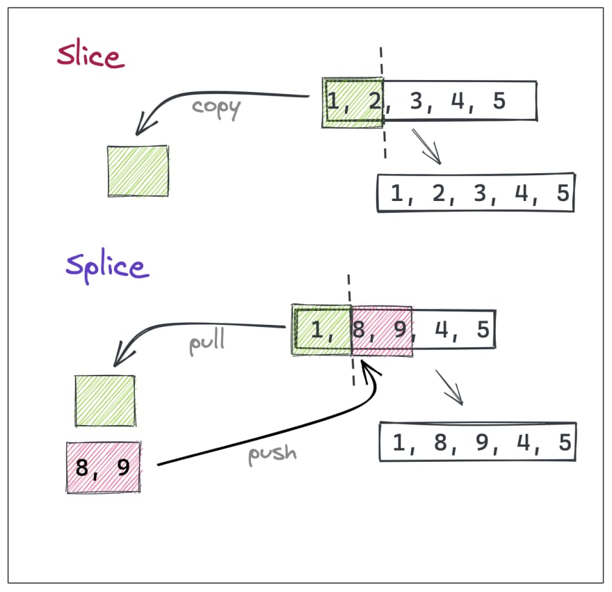

# INDEX

- [INDEX](#index)
  - [JavaScript](#javascript)
  - [Variables](#variables)
    - [Hoisting](#hoisting)
    - [Garbage collection](#garbage-collection)
  - [Operators](#operators)
  - [Function](#function)
    - [IIFE](#iife)
    - [`this` keyword in functions](#this-keyword-in-functions)
    - [Function binding](#function-binding)
      - [Losing "this"](#losing-this)
      - [Solution 1: Wrapper](#solution-1-wrapper)
      - [Solution 2 (better): bind](#solution-2-better-bind)
        - [`bindAll()`](#bindall)
    - [Arguments](#arguments)
  - [Loop](#loop)
    - [For..in loop](#forin-loop)
    - [For..of loop](#forof-loop)
  - [Numbers](#numbers)
    - [Special numbers](#special-numbers)
  - [Date](#date)
    - [Autocorrection](#autocorrection)
    - [Date to number, date diff](#date-to-number-date-diff)
    - [Date.parse from a string](#dateparse-from-a-string)
    - [international Date Api](#international-date-api)
    - [toLocaleString()](#tolocalestring)
  - [Strings](#strings)
    - [String Methods](#string-methods)
    - [Operations on strings](#operations-on-strings)
    - [Regular expressions](#regular-expressions)
  - [Arrays](#arrays)
    - [Array methods](#array-methods)
  - [Object](#object)
    - [Object.keys, values, entries](#objectkeys-values-entries)
    - [Transforming objects (operations on objects)](#transforming-objects-operations-on-objects)
  - [Sets](#sets)
    - [WeakSet](#weakset)
  - [Maps](#maps)
    - [WeakMap](#weakmap)
  - [Errors](#errors)
    - [Error object](#error-object)
      - [Custom Errors](#custom-errors)
        - [Extending Error](#extending-error)
    - [Error Handling](#error-handling)
  - [Forms](#forms)
    - [Form Elements](#form-elements)
      - [input and textarea](#input-and-textarea)
      - [select and option](#select-and-option)
    - [event handler in forms (submitting)](#event-handler-in-forms-submitting)
    - [Form Validation](#form-validation)
      - [Focusing: focus/blur](#focusing-focusblur)
      - [Events: change, input, cut, copy, paste](#events-change-input-cut-copy-paste)
    - [FormData API](#formdata-api)
  - [CROSS-SITE SCRIPTING (XSS) ATTACKS](#cross-site-scripting-xss-attacks)
    - [Defending against CROSS-SITE SCRIPTING](#defending-against-cross-site-scripting)
  - [Lazy loading](#lazy-loading)
  - [Slider (pagination)](#slider-pagination)
  - [Document and resource loading (adding js in html)](#document-and-resource-loading-adding-js-in-html)
    - [Lifecycle of an HTML page](#lifecycle-of-an-html-page)
      - [`DOMContentLoaded`](#domcontentloaded)
      - [`load`](#load)
      - [`beforeunload` / `unload`](#beforeunload--unload)
    - [Scripts: async, defer](#scripts-async-defer)
      - [`defer`](#defer)
      - [`async`](#async)
  - [Writing Documentation](#writing-documentation)

---

## JavaScript

JavaScript is a **high-level**, **interpreted**, **dynamic**, **single-threaded** programming language. It is **weakly typed** and **dynamically typed** language.

- **high-level** : it provides abstractions that allow us to ignore the details of the machine where the program runs.
- **interpreted** : it doesn't need to be compiled, it's executed directly by the browser (line by line);
- **dynamic** : it executes at runtime many common programming behaviors that static programming languages perform during compilation. ex: allocating memory for variables, determining the type of a variable or object, determining the scope of variables, etc.
- **single-threaded** : it means that only one task can be executed at a time.
- **weakly typed** : it doesn't require us to declare the type of variables. ex: `let x = 5;` or `let x = "John";`
- **dynamically typed** : it means that the type of a variable is checked during runtime rather than in advance. ex: `let x = 5;` or `let x = "John";`

---

## Variables

- `var` vs `let` vs `const` &nbsp; &nbsp; &nbsp; &nbsp; (also look at the hoisting section in the pdf)
  
  
- variable defined with `var` is an `window` object property

---

### Hoisting

It's to make space in memory for a variable to be able to:

- Call functions before they have been declared
- Assign a value to a variable that has not yet been declared

> This is because any **variables and functions** within each execution context are created before they are executed.

- `var hoisting`: usually bad, as **with `var`, you can access declaration, but not the value**

  ```js
  console.log(name); // undefined
  var name = 'John';
  ```

- `function hoisting`: actually pretty useful --> **must be a function declaration**

  ```js
  display(); // "hello world"
  function display() {
    console.log('hello world');
  }
  ```

- `let hoisting`:

  - it gets **hoisted but not initialized**
    

  ```js
  // or
  let x = 1;

  function func() {
    console.log(x); // ReferenceError: Cannot access 'x' before initialization
    let x = 2;
  }

  func();
  ```

> **function expression** is not hoisted as its variable is the one that is hoisted and not the function (the variable's value)

### Garbage collection

- Garbage collection is performed automatically. We cannot force or prevent it.
- Objects are retained in memory while they are **reachable**.
- Being referenced is not the same as being reachable (from a **root**): a pack of interlinked objects can become unreachable as a whole
- Modern engines implement advanced algorithms of garbage collection.
- if something becomes unreached, its garbage-collected
  

  - to remove something from memory in garbage-collection, we need to make it **unreachable**, ex:

    ```js
    let john = { name: 'John' };
    // the object can be accessed, john is the reference to it

    // overwrite the reference
    john = null;
    // the object will be removed from memory
    ```

---

## Operators

> NOTE: **operand** is what operators are applied to

- **Binary** operators -> is for 2 operands
  - `5 + 4`
- **unary** operators -> is for 1 operand

  - it's a `+` or `-` before the string number =>

    ```js
    // It actually does the same thing as Number(), but is shorter.
    console.log(+'565'); // 565
    console.log(+true); // 1
    console.log(+''); // 0
    ```

  - it's a `!` before something => `console.log(! (x > 4) )`

---

## Function

- function declaration vs function expression
  

  - The main practical **difference** is that you can call function declaration before you define it and your code will work just fine but with function expression, it's impossible and JavaScript will throw an error at you.
    - This works because the interpreter runs through a script before executing each statement, so it will know that a function declaration appears later in the script
    - the interpreter always looks for **variables** and **function declarations** before going through each section of a script, line-by-line. This means that a function created with a **function declaration** can be called before it has even been declared.
      - The difference is that a **"Function Declaration is instantly fully initialized"**.
        - When a Lexical Environment is created, a Function Declaration immediately becomes a ready-to-use function (unlike `let`, that is unusable till the declaration).
          
      - as for `Function expression`, You put a function where the interpreter would expect to see an **expression** (returned value), then it is treated as an expression, and it is known as a function expression
  - **Function expression** forces you to define all my functions at the top of my code. this makes you write cleaner and more readable codes this way.
    - here, the name is usually omitted. A function with no name is called an **anonymous function**.
    - also this enables you to have **reliable self-reference (recursion, etc)**
    - and have **more debuggable stack traces** -> the name of function is shown in `stack trace`
    - also this makes **more self-documenting code**
  - **Function declarations** are not part of the regular top-to-bottom flow of control. They are conceptually moved to the top of their scope and can be used by all the code in that scope.

    ```js
    console.log('The future says:', future()); // this works!
    function future() {
      return "You'll never have flying cars";
    }
    ```

- _note_ :
  - `arrow function`
    - if you used `{}` then you should use the word `return` to return something
    - know that it's shorter but at a cost of it will be **anonymous function** and not a **named function**, which means that it will need you to read the function body to understand what it does instead of figuring out this from its name
- when you use a function that do a calculation process, you should put the invocation of this function in a variable and not invoking it many time => **for performance**, ex:

  - use this

    ```javascript
    for (let i = 0; i < bills.length; i++) {
      const tip = calcTip(bills[i]);
      tips.push(tip);
      totals.push(tip + bills[i]);
    }
    ```

  - not this

    ```javascript
    for (let i = 0; i < bills.length; i++) {
      tips.push(calcTip(bills[i]));
      totals.push(calcTip(bills[i]) + bills[i]);
    }
    ```

- Each function has its own **Execution context**
  
  - The `execution context` is an internal data structure that contains details about the execution of a `function`:
    - where the control flow is now (the “current line”)
    - `the current variables` (local variables and arguments)
    - `the value of "this"` keyword
  - has 2 parts:
    - Local **Thread of execution**
    - Local **Memory**
  - They correspond to variable scope
  - each function has its own **execution context** in the **call stack**
    - when finishing all the functions in the call stack, the **`global()` execution context** will be popped out of the call stack (which is the main execution context that is created when the script is loaded)
      

---

### IIFE

- **IIFE** is an inline function expression. which create its own scope
  - In the past, as there was only `var`, and it has no **block-level** visibility, programmers invented a way to emulate it. What they did was called “immediately-invoked function expressions” (abbreviated as `IIFE`).
    - > So, **It's a simple approach to avoid global scope pollution**
  - It's an old approach for creating modules
- [ `anonymous function` / `IIFE` ] are **inline function expressions**.

  - The parentheses "`()`" around the function is a trick to show JavaScript that the function is created in the context of another expression, and hence it’s a Function Expression: it needs no name and can be called immediately.

- Ways to create IIFE

  ```js
  (function () {
    alert('Parentheses around the function');
  })();

  (function () {
    alert(`Parentheses around the function with argument: ${argument}`);
  })(argument);

  (function () {
    alert('Parentheses around the whole thing');
  })();

  !(function () {
    alert('Bitwise NOT operator starts the expression');
  })();

  +(function () {
    alert('Unary plus starts the expression');
  })();
  ```

---

### `this` keyword in functions

- in `arrow functions` =>

  - **Arrow functions have no `“this”`**

    - If `this` is accessed, it is taken from the outside.

  - `this` is **Elastically lexical scoped**, as they define `this` based on **where it was written** and **not where/who it was called with**
  - `this` refers to the global object ( `window` object ) which why it's called : `Lexical this` , so **DON'T EVER USE `arrow functions` AS A METHOD** as they don't define a `this` keyword so it will point to (**where the function was born**) --> the upper scope which usually where this refers to the global object:
    - The global object has a universal name -> `globalThis`.
    - ( `window` object ) -> In the browser
    - ( `global` object ) -> In Node.js

- in `normal functions` =>

  - `this` refers to who the function was invoked (called) by --> (dynamic scope)
  - `this` refers to the `undefined` if it's a global function and not a method to an object.

- if you want to chain multiple methods (functions) that uses `this` keyword, you can return `this` at the end:

  ```js
  let ladder = {
    step: 0,
    up() {
      this.step++;
      return this;
    },
    down() {
      this.step--;
      return this;
    },
    showStep() {
      alert(this.step);
      return this;
    }
  };

  ladder.up().up().down().showStep().down().showStep(); // shows 1 then 0
  ```

- each function has its own **execution context** in the **call stack**
- only one `rest parameter` is allowed in one function and it must be the last parameter.
- skip default parameter :

  ```js
  function myfunc(x, y = 2, z = 6) {}
  // use (undefined) when calling it
  myfunc(5, undefined, 17);
  ```

---

### Function binding

When passing object methods as callbacks, there’s a known problem: **"losing "this""**.

#### Losing "this"

- EX for explanation:

  ```js
  let user = {
    firstName: 'John',
    sayHi() {
      alert(`Hello, ${this.firstName}!`);
    }
  };

  setTimeout(user.sayHi, 1000); // Hello, undefined!
  ```

  - That’s because `setTimeout` got the function `user.sayHi`, separately from the object. The last line can be rewritten as:

    ```js
    let f = user.sayHi;
    setTimeout(f, 1000); // lost user context
    ```

  - so now `this` is equal to the `window` object, So for `this.firstName` it tries to get `window.firstName`, which does not exist. In other similar cases, usually `this` just becomes **undefined**.

#### Solution 1: Wrapper

- The simplest solution is to use a **wrapping function**:

  ```js
  let user = {
    firstName: 'John',
    sayHi() {
      alert(`Hello, ${this.firstName}!`);
    }
  };

  setTimeout(function () {
    user.sayHi(); // Hello, John!
  }, 1000);
  // It works, because it receives "user" from the outer lexical environment, and then calls the method normally.
  ```

- **vulnerability**:
  - What if before `setTimeout` triggers (there’s one second delay!) user changes value? Then, suddenly, it will call the wrong object!

#### Solution 2 (better): bind

- using the built-in method `bind` that allows to fix `this`.

  ```js
  let user = {
    firstName: 'John'
  };

  function func() {
    alert(this.firstName);
  }

  let funcUser = func.bind(user);
  funcUser(); // John
  ```

- following our `setTimeout` example:

  ```js
  let user = {
    firstName: 'John',
    sayHi() {
      alert(`Hello, ${this.firstName}!`);
    }
  };

  let sayHi = user.sayHi.bind(user); // (*)

  // can run it without an object
  sayHi(); // Hello, John!

  setTimeout(sayHi, 1000); // Hello, John!

  // even if the value of user changes within 1 second
  // sayHi uses the pre-bound value which is reference to the old user object
  user = {
    sayHi() {
      alert('Another user in setTimeout!');
    }
  };
  ```

- **Notes:**

  - The `.bind()` method creates a new function
  - The `.bind()` method requires passing value/reference for `this`, so we must put in something like `null`.
  - A function cannot be **re-bound**.

    ```js
    function f() {
      alert(this.name);
    }

    f = f.bind({ name: 'John' }).bind({ name: 'Pete' });
    f(); // John
    ```

##### `bindAll()`

- If an object has many methods and we plan to actively pass it around, then we could bind them all in a loop:

  ```js
  for (let key in user) {
    if (typeof user[key] == 'function') {
      user[key] = user[key].bind(user);
    }
  }
  ```

- or you can use the [\_.bindAll(object, methodNames)](https://lodash.com/docs#bindAll) in **lodash**.

---

### Arguments

JavaScript is extremely broad-minded about the number of arguments you pass to a function.

- If you pass too many, the extra ones are ignored.
- If you pass too few, the missing parameters get assigned the value **undefined**.
- **Rest Parameters**:

  - The rest of the parameters (using the rest operator (**`...`**)) can be included in the function definition by using three dots `...` followed by the name of the array that will contain them. The dots literally mean “gather the remaining parameters into an array”.

    ```js
    function sumAll(...args) {
      // args is the name for the array
      let sum = 0;

      for (let arg of args) sum += arg;

      return sum;
    }

    alert(sumAll(1)); // 1
    alert(sumAll(1, 2)); // 3
    alert(sumAll(1, 2, 3)); // 6
    ```

    - The rest parameters must be **at the end**

      ```js
      function f(arg1, ...rest, arg2) { // arg2 after ...rest ?!
      // error
      }
      ```

- **The “arguments” variable**

  - There is also a special array-like object named arguments that contains all arguments by their index.

    ```js
    function showName() {
      alert(arguments.length);
      alert(arguments[0]);
      alert(arguments[1]);
    }

    showName('Julius', 'Caesar'); // shows: 2, Julius, Caesar
    ```

  - In old times, rest parameters did not exist in the language, and using arguments was the only way to get all arguments of the function. And it still works
  - The downside is that although arguments is both array-like and iterable, it’s not an array. It does not support array methods, so we can’t call arguments.map(...) for example.
  - Also, it always contains all arguments. We can’t capture them partially, like we did with **rest parameters**.
    - So when we need these features, then rest parameters are preferred.
  - **Arrow functions do not have "arguments"**

    - If we access the arguments object from an arrow function, it takes them from the **outer** “normal” function.

    ```js
    function f() {
      let showArg = () => alert(arguments[0]);
      showArg();
    }

    f(1); // 1
    ```

- **Spread syntax**

  - When `...arr` is used in the function call, it “expands” an iterable object arr into the list of arguments.

    ```js
    let arr = [3, 5, 1];

    alert(Math.max(...arr)); // 5 (spread turns array into a list of arguments)
    ```

- `.length` property in functions (`Function.prototype.length`) returns the number of **arguments** specified in the function definition

  ```js
  (function foo(a, b) {}.length); // 2
  ```

---

## Loop

| For                                                                                                                                             | While                                                                                                                                                                                  | Do While                                                                                                           |
| ----------------------------------------------------------------------------------------------------------------------------------------------- | -------------------------------------------------------------------------------------------------------------------------------------------------------------------------------------- | ------------------------------------------------------------------------------------------------------------------ |
| if you need to run code a specific number of times, usually the condition is a counter which is used to tell how many times the loop should run | if you don't know how many times the code should run. here the condition can be something other that a counter and the code will continue to loop for as long as the condition is true | it will always run the statements inside the curly braces at least once, even if the condition evealuates to false |

- in `for` block we can use `const` as each time it will make a new variable :

  ```javascript
  for (let i = 0; i < bills.length; i++) {
    const tip = calcTip(bills[i]);
    tips.push(tip);
  }
  ```

- ex of for loop without any thing in () :

  ```javascript
  let p = ['sample1','sample2','sample3','sample4','sample5'];
  let i = 0;

  for (;;;) {
    console.log(p[i]);
    i++;
    if (i===p.length) break;
  }
  ```

- `for of loop` with index :

  ```javascript
  for (const item of menu) console.log(item);

  // with index
  for (const [i, el] of menu.entries()) {
    console.log(`${i + 1}: ${el}`);
  }
  ```

---

### For..in loop

To walk over all **keys of an object**, there exists a special form of the loop: `for..in`.

- it can be used with arrays to loop through the indexes

  ```js
  let arr = ['Apple', 'Orange', 'Pear'];

  for (let key in arr) {
    alert(arr[key]); // Apple, Orange, Pear
  }
  ```

  - The `for..in` loop is optimized for generic objects, not arrays, and thus is 10-100 times slower. Of course, it’s still very fast. The speedup may only matter in bottlenecks. But still we should be aware of the difference.

---

### For..of loop

used with Arrays, strings, Map, Set, etc **(except object)**,

- It doesn’t give access to the number of the current element, just its value.
- Objects that can be used in `for..of` are called **iterable**.
- An **iterator** must have the method named `next()` that returns an object `{done: Boolean, value: any}`, here `done:true` denotes the end of the iteration process, otherwise the value is the next value.

---

## Numbers

- More ways to write a number:

  ```js
  let billion = 1_000_000_000; // JavaScript engine simply ignores "_" between digits -> syntactic sugar
  let billion = 1e9; // 1 billion, literally: 1 and 9 zeroes
  ```

- to check if a number use `Number.isFinite()` as it's better than `Number.inNaN()`
- to get random number between two values :

  ```javascript
  // Returns a random number between min (inclusive) and max (exclusive)
  function getRandomNum(min, max) {
    return Math.random() * (max - min) + min;

    // Returns a random integer between min (inclusive) and max (inclusive)
    function getRandomInt(min, max) {
      min = Math.ceil(min);
      max = Math.floor(max);
      return Math.floor(Math.random() * (max - min + 1)) + min;
      // here we use floor as it works well if number is negative
    }
  }
  ```

- **Formatting Numbers / currency** : [Formatting](https://www.samanthaming.com/tidbits/30-how-to-format-currency-in-es6/)

- _notes_ :

  - `toFixed()` returns a `string`
  - `Math.round()` and `toFixed()` both round to the nearest number: `0..4` **lead down** while `5..9` **lead up**.
  - `toString()` can take a base to convert to (The base can vary from `2` to `36`. By default it’s `10`)
  - If we want to call a method directly on a number, then we need to place **two dots** `..` after it.

    ```js
    // prettier-ignore
    alert(123456..toString(36)); // 2n9c
    // or
    alert((123456).toString(36)); // 2n9c
    ```

  - calculations:

    ```js
    alert(0.1 + 0.2 == 0.3); // false
    alert(0.1 + 0.2); // 0.30000000000000004
    ```

    - why? -> because A **number is stored in memory in its binary form**, a sequence of bits (ones and zeroes). But fractions like `0.1`, `0.2` that look simple in the decimal numeric system are actually unending fractions in their binary form.
    - So `0.1` is one divided by ten `1/10`, In decimal numeral system such numbers are easily representable. Compare it to one-third: `1/3`. It becomes an endless fraction `0.33333`.
    - So, division by powers `10` is guaranteed to work well in the decimal system, but division by 3 is not.

---

### Special numbers

- `Infinity`, `-Infinity`
- `NaN`
  - `0 / 0` = `NaN`
  - `Infinity - Infinity` = `NaN`
  - `console.log("five" * 2)` ->`NaN`

> There is only one value in JavaScript that is not equal to itself, and that is **NaN** > `console.log(NaN == NaN)` -> false

---

## Date

To create a new Date object call: `new Date()`

- Without arguments – create a Date object for the current date and time:

  ```js
  let now = new Date();
  alert(now); // shows current date/time

  //new Date(year, month, date, hour, minute, second, millisecond)
  let d1 = new Date(2012, 1, 20, 3, 12);
  alert(d1);

  // new Date(datastring)
  let d2 = new Date('2012-02-20T03:12');
  alert(d2);
  ```

- Create a Date object with the time equal to number of milliseconds (`1/1000` of a second) passed after the `Jan 1st of 1970 UTC+0`.

  - usually it's used with `date.getTime()`

  ```js
  // 0 means 01.01.1970 UTC+0
  let Jan02_1970 = new Date(24 * 3600 * 1000);
  alert(Jan02_1970); // 02.01.1970 UTC+0
  ```


- > **Note**: Not getYear(), but getFullYear()
  - > Many JavaScript engines implement a non-standard method `getYear()`. This method is deprecated. It returns **2-digit** year sometimes. Please never use it. There is `getFullYear()` for the year.
  - > `getYear()` returns year minus 1900. This has been deprecated for a while now, it's best to use `getFullYear()`.
- `month` is zero based so we add `1` to it

- when you perform operations on dates, the result is in form of `milliSeconds`

---

### Autocorrection

The **autocorrection** is a very handy feature of Date objects. We can set out-of-range values, and it will auto-adjust itself.

- if the month is specified with more days than it already has, we go to next month:

  ```js
  let date = new Date(2013, 0, 32); // 32 Jan 2013 ?!?
  alert(date); // ...is 1st Feb 2013!
  ```

---

### Date to number, date diff

When a Date object is converted to number, it becomes the timestamp same as `date.getTime()`:

```js
let date = new Date();
alert(+date); // the number of milliseconds, same as date.getTime()
```

---

### Date.parse from a string

The method `Date.parse(str)` can read a date from a string.

- The call to `Date.parse(str)` parses the string in the given format and returns the timestamp **(number of milliseconds from 1 Jan 1970 UTC+0)**.
  - If the format is invalid, returns **NaN**.
- The string format should be: `YYYY-MM-DDTHH:mm:ss.sssZ`, where:

  - `YYYY-MM-DD` – is the date: year-month-day.
  - `The character "T"` is used as the delimiter.
  - `HH:mm:ss.sss` – is the time: hours, minutes, seconds and milliseconds.
  - `The optional 'Z'` part denotes the time zone in the format
  - `+-hh:mm`. A single letter Z would mean UTC+0.

```js
let ms = Date.parse('2012-01-26T13:51:50.417-07:00');
alert(ms); // 1327611110417  (timestamp)
```

---

### international Date Api

The Intl.DateTimeFormat object enables language-sensitive date and time formatting.

- [Intl.DateTimeFormat cheatsheet](https://devhints.io/wip/intl-datetime)

### toLocaleString()

[reference](https://developer.mozilla.org/en-US/docs/Web/JavaScript/Reference/Global_Objects/Date/toLocaleString)

The toLocaleString() method returns a string with a language sensitive representation of this date.

- syntax : `toLocaleString(locales, options)`

```js
const event = new Date(Date.UTC(2012, 11, 20, 3, 0, 0));
// expected output: Thu Dec 20 2012 05:00:00 GMT+0200 (Eastern European Standard Time)

// British English uses day-month-year order and 24-hour time without AM/PM
console.log(event.toLocaleString('en-GB', { timeZone: 'UTC' }));
// expected output: 20/12/2012, 03:00:00
```

---

## Strings

### String Methods

- we are calling object methods on a "string" such as "length", "toUpperCase()" and "indexOf", however we know "strings" are primitive types and yet these methods are available on a "string".
  - this is because the process called `"Boxing"` which JavaScript perform behind the scene.
  - When ever we call these methods on a "string", JavaScript will convert the "`string primitive`" into "`string objects`" without losing its content, therefore at that object these methods become available.
- convert number to a string :

  ```javascript
  const str = number + '';
  // or
  const str = String(number);
  ```

- allow a string to span multiple lines:

  ```js
  // using backticks
  let guestList = `Guests:
  * John
  * Pete
  * Mary
  `;

  // or using special characters:
  let guestList = 'Guests:\n * John\n * Pete\n * Mary';
  ```

  - Note that `\n` is a single **“special” character**, so the length of a string includes it as one character.

- The only difference between them is that if no character is found, indexing `[]` returns `undefined`, and `charAt()` returns an empty string:

  ```js
  let str = `Hello`;

  alert(str[1000]); // undefined
  alert(str.charAt(1000)); // '' (an empty string)
  ```

- `substring()` -> is almost the same as `slice()`, but it allows start to be greater than end.

  ```js
  let str = 'stringify';

  // these are same for substring
  alert(str.substring(2, 6)); // "ring"
  alert(str.substring(6, 2)); // "ring"

  // ...but not for slice:
  alert(str.slice(2, 6)); // "ring" (the same)
  alert(str.slice(6, 2)); // "" (an empty string)
  ```

- `substr(start [, length])` -> Returns the part of the string from start, with the given **length**.

  ```js
  let str = 'stringify';
  alert(str.substr(2, 4)); // 'ring', from the 2nd position get 4 characters
  ```

- `.length` property returns the number of **Bytes** rather that the number of characters, --> unicode characters like **emoji requires 2 bytes**

---

### Operations on strings

- The binary `+` is the only operator that supports strings in such a way (concatenation) `2 + '1' --> "21"`

  ```js
  // NOTE That:
  console.log('1' + 2 + 2); // "122" and not "14"
  ```

- Other arithmetic operators work only with numbers and always convert their operands to numbers.

  ```js
  console.log('3' - '2'); // 1
  console.log('3' / '2'); // 1.5
  ```

---

### Regular expressions

Regular expressions search for characters that form a pattern. They can also replace those characters with new ones.

- Regular expressions do not just search for matching letters; they can check for sequences of upper/lowercase characters, numbers, punctuation, and other symbols.


---

## Arrays


- arrays are **immutable**
- `slice` (makes a copy) vs `splice` (change original array) 
- `delete` vs `splice`

  - always use `slice` to remove element from an array

  ```js
  // delete
  let arr = ['I', 'go', 'home'];
  delete arr[1]; // remove "go"
  alert(arr[1]); // undefined
  // now arr = ["I",  , "home"];
  alert(arr.length); // 3

  //splice
  let arr = ['I', 'study', 'JavaScript'];
  arr.splice(1, 1); // from index 1 remove 1 element
  alert(arr); // ["I", "JavaScript"]
  alert(arr.length); // 2
  ```

- switching values of 2 variables :

  ```javascript
  let a = 5;
  let b = 8;
  [x, y] = [y, x];
  ```

- default values in **destructuring**

  ```javascript
  // Default values
  const [p = 1, q = 1, r = 1] = [8, 9];
  ```

- skipping items when **destructuring**:

  ```js
  // skipping "two"
  const [one, , three] = [1, 2, 3];
  ```

- **forEach vs for of**
  | `forEach` | `for of` |
  | ----------------------------------------------------------------- | ------------------------------------------------------------------- |
  | It iterates from initial to end | It is flexible to iterate array both ascending and descending order |
  | Keeps execution until last element get executed (**can't break**) | It runs until given condition become false (**can break**) |
  | It use iteration | It use index |

### Array methods


- **`filter` vs `find`**
  
  - usually `find` is used in logins when you want to check for username
  - `findIndex` is usually used when you want to get index of item to delete it from a list
- **`indexOf` vs `findIndex`**
  - `indexOf` expects a value as first parameter. This makes it a good choice to find the index in arrays of primitive types (like string, number, or boolean).
    - it returns `-1` if nothing can be found.
  - `findIndex` expects a callback as first parameter. Use this if you need the index in arrays with non-primitive types (e.g. objects) or your find condition is more complex than just a value.
- **`flatMap`** : It is identical to a map() followed by a `flat()` of **depth 1**
  
- **`sort`** (for array of numbers only)

  - without condition, it will sort based on the default comparator which assumes **string operations** (all values are coerced and compared as string)

  ```javascript
  // default behavior
  arr = [1, 30, 4, 21].sort(); // results: [1, 21, 30, 4]

  // ------------------------------------------------------ //

  // if return is (< 0), show A before B
  // if return is (> 0), show B before A
  // if return is (0), items should remain in the same order

  // Ascending
  // movements.sort((a, b) => {
  //   if (a > b) return 1;
  //   if (a < b) return -1;
  // });
  // or
  movements.sort((a, b) => a - b);

  // Descending
  // movements.sort((a, b) => {
  //   if (a > b) return -1;
  //   if (a < b) return 1;
  // });
  // or
  movements.sort((a, b) => b - a);
  ```

- sorting dates:

  ```js
  var holidays = ['2014-12-25', '2014-01-01'];
  holidays.sort(function (a, b) {
    var dateA = new Date(a);
    var dateB = new Date(b);
    return dateA - dateB;
  });
  ```

- sorting strings:

  ```js
  const data = ['t', 'A', 'a', 'B', 'b'];
  data.sort((a, b) => {
    return a.localeCompare(b);
  });
  ```

- `Array.from()` : usually used to convert `node list` to an array

  ```javascript
  // main advantage here that it can take a mapping-callback-function as a second parameter

  const y = Array.from({ length: 3 }, () => 1); // [1,1,1]

  const z = Array.from({ length: 3 }, (_, i) => i + 1); // [1, 2, 3]

  // converting a node list with mapping
  const movementsUI = Array.from(document.querySelectorAll('.movements__value'), el =>
    Number(el.textContent.replace('€', ''))
  );
  // or you can use spread operator [...document.querySelectorAll(".movements__value")].map()
  ```

- operations on array:

  ```js
  alert([] + 1); // "1"
  alert([1] + 1); // "11"
  alert([1, 2] + 1); // "1,21"
  ```

---

## Object

- There're 2 ways to create an object:

  - **Object Literals**: `let obj = {};`
  - **Constructor Literals**: `let obj = new Object();`
  - **use a function as a template for creating objects**:

    ```js
    function Hotel(name, rooms) {
      this.name = name;
      this.rooms - rooms;
      // a method
    }

    // Don't forget the "new" keyword
    var hotel_1 = new Hotel('park', 120);
    ```

- we use `function expression` in objects to declare `methods`
- to create a new object from an existing object =>

  ```js
  // jessica is an existing object
  const jessicaCopy = Object.assign({}, jessica);
  // or
  const jessicaCopy = { ...jessica };
  ```

- remember that objects that may look the same to you are actually not
  
- **Destructuring**

  ```js
  // destructuring with changing variable name
  const { name: restaurantName, openingHours: hours, categories: tags } = restaurant;
  console.log(restaurantName, hours, tags);

  // Default values
  const { menu = [], starterMenu: starters = [] } = restaurant;

  // Mutating variables
  let a = 111;
  let b = 999;
  const obj = { a: 23, b: 7, c: 14 };
  ({ a, b } = obj); // we have to wrap it in a ( because js expects a block when we are starting with a {})
  ```

  - it can also be used to **swap variables value** easier:

    ```js
    var a = 1;
    var b = 1;
    [a, b] = [b, a];
    ```

- **enhanced object literals** :

  ```javascript
  const openingHours = {//normal object};

  const restaurant = {
    name: "Classico Italiano",
    location: "Via Angelo Tavanti 23, Firenze, Italy",

    // ES6 enhanced object literals
    openingHours,  // instead of writing it with `=`

    // also the ability to write methods like this instead of this => order : function....
    order(starterIndex, mainIndex) {
    // normal method
    }
  };
  ```

- Object access rules
  

- to convert object to its primitive value --> `.toPrimitive`

---

### Object.keys, values, entries

- `Object.keys(obj)` – returns an array of keys.
- `Object.values(obj)` – returns an array of values.
- `Object.entries(obj)` – returns an array of [key, value] pairs.

- Please note the distinctions (compared to map for example):

  |             | **Map**      | **Object**                                |
  | ----------- | ------------ | ----------------------------------------- |
  | Call syntax | `Map.keys()` | `Object.keys(obj)` , but not `obj.keys()` |
  | Returns     | iterable     | “real” Array                              |

---

### Transforming objects (operations on objects)

Objects lack many methods that exist for arrays, e.g. `map`, `filter` and others.

- So, if we’d like to apply them, then we can use `Object.entries` followed by `Object.fromEntries`:

  ```js
  let prices = {
    banana: 1,
    orange: 2,
    meat: 4
  };

  let doublePrices = Object.fromEntries(
    Object.entries(prices).map(entry => [entry[0], entry[1] * 2])
  );

  alert(doublePrices.meat); // 8
  ```

---

## Sets

A **Set** is a special type collection – “set of values” (without keys), where each value may occur only once.

- [sets](https://www.w3schools.com/js/js_object_sets.asp)
- there's no way to get data out of a `set` because all values are unique and order doesn't matter

Its main methods are:

- `new Set(iterable)` – creates the set, and if an iterable object is provided (usually an array), copies values from it into the set.
- `set.add(value)` – adds a value, returns the set itself.
- `set.delete(value)` – removes the value, returns true if value existed at the moment of the call, otherwise false.
- `set.has(value)` – returns true if the value exists in the set, otherwise false.
- `set.clear()` – removes everything from the set.
- `set.size` – is the elements count.

- convert map to array:

  ```js
  let arr = [1, 2, 2, 3]; // -> [1,2,3]
  console.log([...new Set(arr)]);
  ```

- We can loop over a set either with `for..of` or using `forEach`

  ```js
  let set = new Set(['oranges', 'apples', 'bananas']);

  for (let value of set) alert(value);

  // the same with forEach:
  set.forEach((value, valueAgain, set) => {
    alert(value);
  });
  ```

---

### WeakSet

- It is similar to Set, but we may **only add objects** to WeakSet (not primitives).
- An object exists in the set **while it is reachable from somewhere else**.

  ```js
  let visitedSet = new WeakSet();

  let john = { name: 'John' };
  let pete = { name: 'Pete' };
  let mary = { name: 'Mary' };

  visitedSet.add(john); // John visited us
  visitedSet.add(pete); // Then Pete
  visitedSet.add(john); // John again

  // visitedSet has 2 users now
  alert(visitedSet.has(john)); // true
  alert(visitedSet.has(mary)); // false

  john = null;
  // visitedSet will be cleaned automatically
  ```

> The most notable limitation of `WeakMap` and `WeakSet` is the **absence of iterations**, and the inability to get all current content. That may appear inconvenient, but does not prevent WeakMap/WeakSet from doing their main job – be an “additional” storage of data for objects which are stored/managed at another place.

---

## Maps

**Map** is a collection of keyed data items, just like an Object. But the main difference is that Map allows **keys of any type** and (it preserves the order of which you insert things in the map).


- [maps](https://www.w3schools.com/js/js_object_maps.asp)
- The `Map` object holds key-value pairs and remembers the original insertion order of the keys.
- A `Map` object iterates its elements in insertion order — a `for...of` loop returns an array of [key, value] for each iteration.
- you can use `arrays` as a key for a map but you must put it first in a variable as if not you then will create multiple arrays in the memory and can't access one
- `maps` vs `objects`
  
- Convert object to map

  ```javascript
  // openingHours is an existing object
  const hoursMap = new Map(Object.entries(openingHours));
  ```

- Methods and properties are:

  - > **`map[key]`** isn’t the right way to use a Map

    - as this is treating map as a plain JavaScript object, so it implies all corresponding limitations (only string/symbol keys and so on).

  - `new Map()` – creates the map.
  - `map.set(key, value)` – stores the value by the key.
    - Every `map.set` call returns the map itself, so we can “chain” the calls:
  - `map.get(key)` – returns the value by the key, undefined if key doesn’t exist in map.
  - `map.has(key)` – returns true if the key exists, false otherwise.
  - `map.delete(key)` – removes the value by the key.
  - `map.clear()` – removes everything from the map.
  - `map.size` – returns the current element count.

- create a map from an object

  ```js
  let map = new Map(Object.entries(obj));
  ```

- create an object from a map

  ```js
  // Object.fromEntries method that does the reverse: given an array of [key, value] pairs, it creates an object from them
  let prices = Object.fromEntries([
    ['banana', 1],
    ['orange', 2],
    ['meat', 4]
  ]);

  let obj = Object.fromEntries(fruitsMap.entries());
  // or
  let obj = Object.fromEntries(map); // as Object.fromEntries expects an iterable object as the argument
  ```

---

### WeakMap


- if we use an object as the key in a regular Map, then while the Map exists, that object exists as well. It occupies memory and may not be garbage collected.

  ```js
  let john = { name: 'John' };
  let map = new Map();
  map.set(john, '...');
  john = null; // overwrite the reference
  // john is stored inside the map,
  // we can get it by using map.keys()
  ```

**WeakMap** is fundamentally different in this aspect. **It doesn’t prevent garbage-collection of key objects**.

- The first difference between **Map** and **WeakMap** is that keys must be objects, not primitive values:

  ```js
  let weakMap = new WeakMap();
  let obj = {};
  weakMap.set(obj, 'ok'); // works fine (object key)

  // can't use a string as the key
  weakMap.set('test', 'Whoops'); // Error, because "test" is not an object
  ```

- if we use an object as the key in it, and there are no other references to that object – it will be removed from memory (and from the map) automatically.

  ```js
  let john = { name: 'John' };
  let weakMap = new WeakMap();
  weakMap.set(john, '...');

  john = null; // overwrite the reference
  // john is removed from memory!
  ```

  > The main area of application for WeakMap is an **additional data storage**.
  >
  > - If we’re working with an object that “belongs” to another code, maybe even a third-party library, and would like to store some data associated with it, that should only exist while the object is alive – then **WeakMap** is exactly what’s needed.
  >
  > ```js
  > weakMap.set(john, 'secret documents');
  > // if john dies, secret documents will be destroyed automatically
  > ```

---

## Errors

When an exception is thrown, the interpreter stops and checks the current execution context for exception-handling code. So if the error occurs in a function, the interpreter starts to look for error-handling code in that function.

If an error happens in a function and the function does not have an exception handler, the interpreter goes to the line of code that called the function.

### Error object

When an error occurs, JavaScript generates an object containing the details about it. The object is then passed as an argument to the error-handling-code like `catch`

Error objects can help you find where your mistakes are and browsers have tools to help you read them.


#### Custom Errors

When we develop something, we often need our own error classes to reflect specific things that may go wrong in our tasks. For errors in network operations we may need `HttpError`, for database operations `DbError`, for searching operations `NotFoundError` and so on.

- Our errors should support basic error properties like message, name and, preferably, stack. But they also may have other properties of their own, e.g. `HttpError` objects may have a `statusCode` property with a value like `404` or `403` or `500`.
- also, As the application grows, our own errors naturally form a hierarchy. For instance, HttpTimeoutError may inherit from HttpError, and so on.

##### Extending Error

We can inherit from Error and other built-in error classes normally. We just need to take care of the `name` property and don’t forget to call `super`.

- We can use `instanceof` to check for particular errors. It also works with inheritance. But sometimes we have an error object coming from a 3rd-party library and there’s no easy way to get its class. Then name property can be used for such checks.

```js
class ValidationError extends Error {
  constructor(message) {
    super(message);
    this.name = 'ValidationError';
  }
}

// Usage
function readUser(json) {
  let user = JSON.parse(json);

  if (!user.age) {
    throw new ValidationError('No field: age');
  }
  if (!user.name) {
    throw new ValidationError('No field: name');
  }

  return user;
}

// Working example with try..catch
try {
  let user = readUser('{ "age": 25 }');
} catch (err) {
  if (err instanceof ValidationError) {
    alert('Invalid data: ' + err.message); // Invalid data: No field: name
  } else if (err instanceof SyntaxError) {
    // (*)
    alert('JSON Syntax Error: ' + err.message);
  } else {
    throw err; // unknown error, rethrow it (**)
  }
}
```

---

### Error Handling

More details in the [ASYNC.md](./04-ASYNC.md) file

---

## Forms

- You can access forms in the document using the `form` property

  ```js
  document.forms.myForm; // the form with name="myForm"
  document.forms[0]; // the first form in the document
  ```

- For any element, the form is available as `element.form`. So a form references all elements, and elements reference the form.
  

### Form Elements

#### input and textarea

- We can access their value as `input.value` (string) or `input.checked` (boolean) for checkboxes and radio buttons.
- Use `textarea.value`, not `textarea.innerHTML`
  - Please note that even though `<textarea>...</textarea>` holds its value as nested HTML, **we should never use `textarea.innerHTML` to access it**.
  - It stores only the HTML that was initially on the page, not the current value.

#### select and option

- `<select>` element has 3 important properties:

  1.`select.options` – the collection of `<option>` sub-elements, 2.`select.value` – the value of the currently selected `<option>` 3.`select.selectedIndex` – the number of the currently selected `<option>`

```html
<select id="select">
  <option value="apple">Apple</option>
  <option value="pear">Pear</option>
  <option value="banana">Banana</option>
</select>

<script>
  select.options[2].selected = true;
  select.selectedIndex = 2;
  select.value = 'banana';
  // get all selected values from multi-select (note that options is a HTMLCollection not an array)
  let selected = Array.from(select.options)
    .filter(option => option.selected)
    .map(option => option.value);
</script>
```

- creating **new option** element:

  - We can use `document.createElement('option')` and set attributes manually
  - or we can use the `Option` constructor:

    ```js
    option = new Option(text, value, defaultSelected, selected);

    // creates <option value="value">Text</option>
    let option = new Option('Text', 'value');

    // same but selected
    let option = new Option('Text', 'value', true, true);
    ```

---

### event handler in forms (submitting)

The `submit` event triggers when the form is submitted, it is usually used to validate the form before sending it to the server or to abort the submission and process it in JavaScript.

- There are two main ways to submit a form:

  1. click on `<input type="submit">` or `<input type="image">`
  2. press **Enter** on an input field.

> **Default behavior for form-submission:**
>
> - it creates a params string for the inputs in the form-body, then make a network request to the current address in the URL with these params
>   

- always use `e.preventDefault();` on form buttons as it defaults to refresh the page
- try not to give a name attribute with value `"submit"` to a button as it might conflict and override with a `form.submit()` method
- to remove focus from input field : `inputLogin.blur();`
- always use `e.preventDefault();` on hyperlinks `<a>` which has a `href="#"` and you want it to do something like ( show pop-up window ) as it defaults to go to top

---

### Form Validation

Modern HTML allows us to do many validations using input attributes: required, pattern and so on. And sometimes they are just what we need. JavaScript can be used when we want more flexibility. Also we could automatically send the changed value to the server if it’s correct.

#### Focusing: focus/blur

> - Focusing on an element generally means: “prepare to accept the data here”, so that’s the moment when we can run the code to initialize the required functionality.
> - The moment of losing the focus (“blur”) can be even more important. That’s when a user clicks somewhere else or presses Tab to go to the next form field, or there are other means as well.
>   - Losing the focus generally means: “the data has been entered”, so we can run the code to check it or even to save it to the server and so on.

- The `focus` event is called on focusing, and `blur` – when the element loses the focus.

  ```html
  <style>
    .invalid {
      border-color: red;
    }
    #error {
      color: red;
    }
  </style>

  Your email please:
  <input type="email" id="input" />

  <div id="error"></div>

  <script>
    input.onblur = function () {
      if (!input.value.includes('@')) {
        // not email
        input.classList.add('invalid');
        error.innerHTML = 'Please enter a correct email.';
      }
    };

    input.onfocus = function () {
      if (this.classList.contains('invalid')) {
        // remove the "error" indication, because the user wants to re-enter something
        this.classList.remove('invalid');
        error.innerHTML = '';
      }
    };
  </script>
  ```

- Methods `elem.focus()` and `elem.blur()` set/unset the focus on the element.
- **Allow focusing on any element: `tabindex`**
  - By default, many elements do not support focusing. The list varies a bit between browsers, but one thing is always correct: focus/blur support is guaranteed for elements that a visitor can interact with: `<button>,` `<input>,` `<select>,` `<a>` and so on.
  - On the other hand, elements that exist to format something, such as `<div>,` `<span>,` `<table>` – are unfocusable by default. The method `elem.focus()` doesn’t work on them, and focus/blur events are never triggered.
  - This can be changed using HTML-attribute **`tabindex`**.
  - Usually it’s used to make an element focusable, but keep the default switching order. To make an element a part of the form on par with `<input>`.
    - `tabindex="-1"` allows only programmatic focusing on an element. The Tab key ignores such elements, but method `elem.focus()` works.
  - The current focused element is available as `document.activeElement`
  - more on this here [Accessibility](../HTML-CSS/03-HTML.md#accessibility)

---

#### Events: change, input, cut, copy, paste

- Event: `change`

  - The change event triggers when the element has finished changing.
  - For text inputs that means that the event occurs when it loses focus.

- Event: `input`
  - The input event triggers **every time** after a value is modified by the user.
- Events: `cut`, `copy`, `paste`

  - They belong to `ClipboardEvent` class and provide access to the data that is cut/copied/pasted.
  - We also can use `event.preventDefault()` to **abort the action**, then nothing gets copied/pasted.

  ```html
  <input type="text" id="input" />
  <script>
    input.onpaste = function (event) {
      alert('paste: ' + event.clipboardData.getData('text/plain'));
      event.preventDefault();
    };

    input.oncut = input.oncopy = function (event) {
      alert(event.type + '-' + document.getSelection());
      event.preventDefault();
    };
  </script>
  ```

---

- Provide meaningful error messages

  - error messages are not identical in every browser. How can you show the same message to everyone?
    - To achieve this, use the `setCustomValidity()`

  ```js
  const nameInput = document.querySelector('[name="name"]');

  nameInput.addEventListener('invalid', () => {
    nameInput.setCustomValidity('Please enter your name.');
  });
  ```

### FormData API

The `FormData()` constructor creates a new `FormData` object. => [reference](https://javascript.info/formdata)

- The `FormData` interface provides a way to easily construct a set of `key/value pairs` representing form fields and their values, which can then be easily sent using the `fetch()` or `XMLHttpRequest.send()` method.
- It uses the same format a form would use if the encoding type were set to `"multipart/form-data"`.
- It's a great solution when we have bunch of inputs
  - inputs must have `name` attribute

```js
// it returns arrays of arrays
const dataArr = [...new FormData(formElement)];
// result : [[key1,value1],[key2,value2],[key3,value3],[key4,value4],...]

// get form-field
const email = formData.get('email');
// get form-entries
const formEntries = [...formData.entries()];

// now we want to convert it to an object
const data = Object.fromEntries(dataArr); // convert arrays into key-value-pairs Object
// result :
// {
//   key1 : value1,
//   key2 : value2,
//   key3 : value3,
//   key4 : value4,
// }
```

- the `FormData` object will be populated with the form's current keys/values using the name property of each element for the keys and their submitted value for the values. It will also encode file input content.

---

## CROSS-SITE SCRIPTING (XSS) ATTACKS

XSS involves an attacker placing malicious code into a site. Websites often feature content created by many different people.

XSS can give the attacker access to information in:

- The DOM (including form data)
- That website's cookies
- Session tokens: information that identifies you from other users when you log into a site
- Example:

  ```html
  <script>
    var adr = 'http : //example.com/xss .php?cookie=' + escape(document.cookie);
  </script>
  ```

### Defending against CROSS-SITE SCRIPTING

- **VALIDATE INPUT GOING TO THE SERVER**
  - Only let visitors input the kind of characters they need to when supplying information. This is known as **validation**. Do not allow untrusted users to submit HTML markup or JavaScript.
  - Double-check validation on the server before displaying user content/storing it in a database. This is important because **users could bypass validation in the browser by turning JavaScript off**.
  - The database may safely contain markup and script from trusted sources (e.g., your content management system). This is because it does not try to process the code; it just stores it.
- **ESCAPE DATA COMING FROM THE SERVER & DATABASE**
  - As your data leaves the database, all potentially dangerous characters should be escaped
  - Make sure that you are only inserting content generated by users into certain parts of the template files
  - Do not create DOM fragments containing HTML from untrusted sources. It should only be added as text once it has been escaped.

> you can safely use **innerHTML** to add markup to a page if you have written the code - but content from any untrusted sources should be escaped and added as text (not markup), using properties like **textContent**.

---

## Lazy loading

- is a strategy to identify resources as non-blocking (non-critical) and load these only when needed. It's a way to shorten the length of the critical rendering path, which translates into reduced page load times.
- `Steps`

  - HTML :

    ```html
    
    src="img/digital-lazy.jpg"
    <!-- img 2 (high quality) -->
    data-src="img/digital.jpg" alt="Computer" class="features__img lazy-img" />
    ```

  - CSS

  ```css
  .lazy-img {
    filter: blur(20px);
  }
  ```

  - JS

  ```javascript
  // Lazy loading images
  const imgTargets = document.querySelectorAll('img[data-src]');

  const loadImg = function (entries, observer) {
    const [entry] = entries;

    if (!entry.isIntersecting) return;

    // Replace src with data-src
    entry.target.src = entry.target.dataset.src;
    // show the high quality img without filter class (ONLY) when it loads
    entry.target.addEventListener('load', function () {
      entry.target.classList.remove('lazy-img');
    });

    observer.unobserve(entry.target);
  };

  const imgObserver = new IntersectionObserver(loadImg, {
    root: null,
    threshold: 0,
    rootMargin: '200px' // so that it happens before the user reach the img by 200px so that he doesn't notice it
  });

  imgTargets.forEach(img => imgObserver.observe(img));
  ```

---

## Slider (pagination)

- `pagination` comes from `multiple pages`
- see `slider` section in => [BANKIST-Home_Page-js](https://github.com/abdrahmansoltan/Practicing-Javascript/blob/main/3_BANKIST/Home_Page/script.js)

---

## Document and resource loading (adding js in html)

- Why use separate js file in `<script>` tags

  - The benefit of a separate file is that the browser will download it and store it in its **cache**.
  - Other pages that reference the same script will take it from the cache instead of downloading it, so the file is actually downloaded only once. --> That reduces traffic and makes pages faster.

- A single `<script>` tag can’t have both the **src** attribute and code inside.

  ```html
  <script src="file.js">
    alert(1); // the content is ignored, because src is set
  </script>

  <!-- You can separate the 2 scripts -->
  <script src="file.js"></script>
  <script>
    alert(1);
  </script>
  ```

### Lifecycle of an HTML page

The lifecycle of an HTML page has three important events:

#### `DOMContentLoaded`

The `DOMContentLoaded` event happens on the **document** object.

- the browser fully loaded HTML, and the DOM tree is built, but external resources like pictures `` and stylesheets may not yet have loaded.
- DOM is ready, so the handler can lookup DOM nodes, initialize the interface.

  ```html
  <script>
    function ready() {
      alert('DOM is ready');

      // image is not yet loaded (unless it was cached), so the size is 0x0
      alert(`Image size: ${img.offsetWidth}x${img.offsetHeight}`);
    }

    document.addEventListener('DOMContentLoaded', ready);
  </script>

  
  ```

- `<script>` tags block `DOMContentLoaded`

  - When the browser processes an HTML-document and comes across a `<script>` tag, it needs to execute before continuing building the DOM. That’s a precaution, as scripts may want to modify DOM, and even `document.write()` into it, so `DOMContentLoaded` has to wait. So `DOMContentLoaded` definitely happens after such scripts

  - There are two exceptions from this rule:
    1. Scripts with the `async` attribute don’t block DOMContentLoaded.
    2. Scripts that are generated dynamically with `document.createElement('script')` and then added to the webpage also don’t block this event.

- External style sheets don’t affect DOM, so DOMContentLoaded does not wait for them.

  - But there’s a pitfall. If we have a `script` after the `style`, then that script must wait until the stylesheet loads:

    ```html
    <link type="text/css" rel="stylesheet" href="style.css" />
    <script>
      // the script doesn't execute until the stylesheet is loaded
      alert(getComputedStyle(document.body).marginTop);
    </script>
    ```

---

#### `load`

The `load` event happens on the **window** object.

- not only HTML is loaded, but also all the external resources: images, styles etc.
- external resources are loaded, so styles are applied, image sizes are known etc.

  ```html
  <script>
    window.onload = function () {
      // can also use window.addEventListener('load', (event) => {
      alert('Page loaded');

      // image is loaded at this time
      alert(`Image size: ${img.offsetWidth}x${img.offsetHeight}`);
    };
  </script>

  
  ```

---

#### `beforeunload` / `unload`

The `beforeunload` / `load` events happen on the **window** object.

- the user is leaving: we can check if the user saved the changes and ask them whether they really want to leave.
- Naturally, unload event is when the user leaves us, and we’d like to save the data on our server.
- the user almost left, but we still can initiate some operations, such as sending out statistics.
- The `event.preventDefault()` doesn’t work from a `beforeunload` handler

---

### Scripts: async, defer

> In modern websites, scripts are often “heavier” than HTML: their download size is larger, and processing time is also longer.

When the browser loads HTML and comes across a `<script>...</script>` tag, it can’t continue building the DOM. It must execute the script right now. The same happens for external scripts `<script src="..."></script>`: the browser must wait for the script to download, execute the downloaded script, and only then can it process the rest of the page.

- That leads to two important issues:

  1. Scripts can’t see DOM elements below them, so they can’t add handlers etc.
  2. If there’s a bulky script at the top of the page, it “blocks the page”. Users can’t see the page content till it downloads and runs:

     ```html
     <p>...content before script...</p>

     <script src="https://javascript.info/article/script-async-defer/long.js?speed=1"></script>

     <!-- This isn't visible until the script loads -->
     <p>...content after script...</p>
     ```

- There are some workarounds to that, we can put a `script` at the **bottom of the page**. Then it can see elements above it, and it doesn’t block the page content from showing:

  ```html
  <body>
    ...all content is above the script...

    <script src="https://javascript.info/article/script-async-defer/long.js?speed=1"></script>
  </body>
  ```

  - **Note:** this solution is far from perfect. For example, the browser notices the script (and can start downloading it) only after it downloaded the full HTML document. For long HTML documents, that may be a noticeable delay.
    - Such things are invisible for people using very fast connections, but many people in the world still have slow internet speeds and use a far-from-perfect mobile internet connection.
    - Luckily, there are two `<script>` attributes that solve the problem for us: **`defer`** and **`async`**.

#### `defer`

The `defer` attribute tells the browser not to wait for the script. Instead, the browser will continue to process the HTML, build DOM. The script loads “in the background”, and then runs(**executes**) when the DOM is fully built.


- in other words:

  - Scripts with `defer` never block the page.
  - Scripts with defer always execute when the DOM is ready (but before `DOMContentLoaded` event).

- Deferred scripts keep their relative order, just like regular scripts.

  ```html
  <script defer src="https://javascript.info/article/script-async-defer/long.js"></script>
  <script defer src="https://javascript.info/article/script-async-defer/small.js"></script>
  ```

  - steps:
    1. Browsers scan the page for scripts and download them in parallel, to improve performance. So in the example above both scripts download in parallel. The `small.js` probably finishes first.
    2. the `defer` attribute, besides telling the browser “not to block”, ensures that the relative order is kept. So even though `small.js` loads first, it still waits and runs after `long.js` executes.
  - > That may be important for cases when we need to load a JavaScript library and then a script that depends on it.

- The defer attribute is only for external scripts
  - The `defer` attribute is ignored if the `<script>` tag has no `src`.

> In practice, **defer** is used for scripts that need the whole DOM and/or their relative execution order is important.

---

#### `async`

The async attribute is somewhat like `defer`. It also makes the script non-blocking. But it has important differences in the behavior.

- The `async` attribute means that a **script is completely independent**:
  - The browser doesn’t block on `async` scripts (like `defer`).
  - Other scripts don’t wait for `async` scripts, and `async` scripts don’t wait for them.
  - `DOMContentLoaded` and `async` scripts don’t wait for each other:
    - `DOMContentLoaded` may happen both before an `async` script (if an `async` script finishes loading after the page is complete)
    - …or after an `async` script (if an `async` script is short or was in HTTP-cache)
- In other words, `async` scripts load in the background and run when ready. The DOM and other scripts don’t wait for them, and they don’t wait for anything. A fully independent script that runs when loaded.

- async scripts don't keep their relative order (They don’t wait for each other. Whatever loads first)

  ```html
  <p>...content before scripts...</p>

  <script>
    document.addEventListener('DOMContentLoaded', () => alert('DOM ready!'));
  </script>

  <script async src="https://javascript.info/article/script-async-defer/long.js"></script>
  <script async src="https://javascript.info/article/script-async-defer/small.js"></script>

  <p>...content after scripts...</p>
  ```

  - steps:
    1. The page content shows up immediately: `async` doesn’t block it.
    2. `DOMContentLoaded` may happen both before and after `async`, no guarantees here.
    3. A smaller script `small.js` goes second, but probably loads before `long.js`, so `small.js` runs first. Although, it might be that `long.js` loads first, if cached, then it runs first. In other words, async scripts run in the “load-first” order.
  - > Async scripts are great when we integrate an independent third-party script into the page: counters, ads and so on, as they don’t depend on our scripts, and our scripts shouldn’t wait for them:

    ```html
    <!-- Google Analytics is usually added like this -->
    <script async src="https://google-analytics.com/analytics.js"></script>
    ```

- **Dynamic scripts** behave as “`async`” by default.

  - They don’t wait for anything, nothing waits for them.
  - The script that loads first – runs first (“load-first” order).

  ```js
  let script = document.createElement('script');
  script.src = '/article/script-async-defer/long.js';
  document.body.append(script); // The script starts loading as soon as it’s appended to the document
  ```

  - This can be changed if we explicitly set script.`async=false`. Then scripts will be executed in the document order, just like defer.

> in practice, **async** is used for independent scripts, like counters or ads. And their relative execution order does not matter.

---

## Writing Documentation

[jsdoc](https://jsdoc.app/)

- before any function(the line above it) write `/**` and vsCode will configure it
