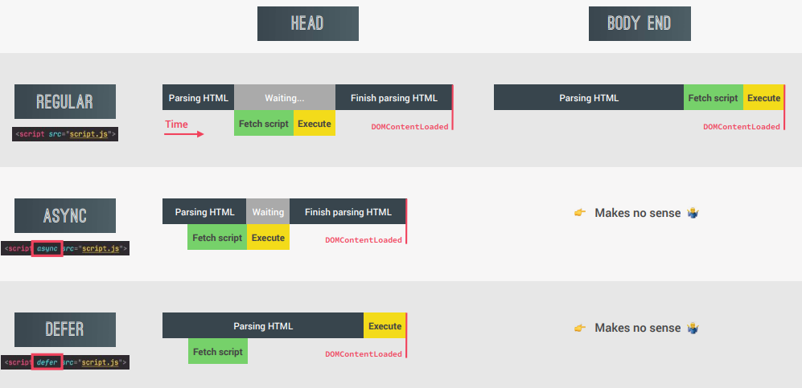
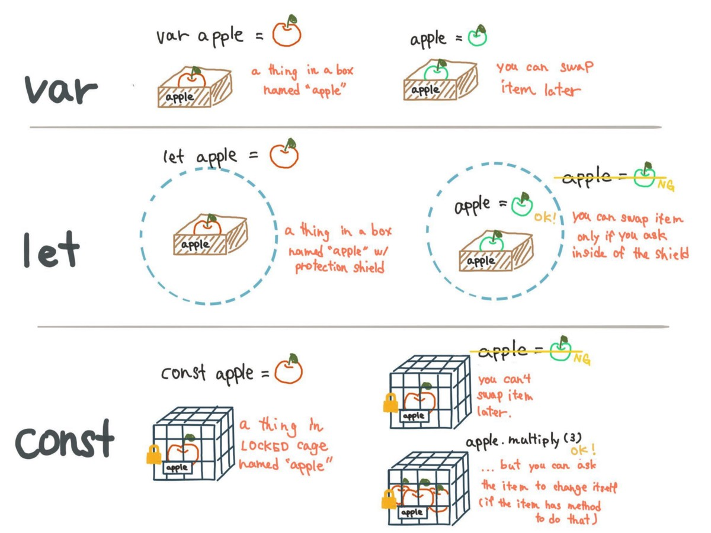
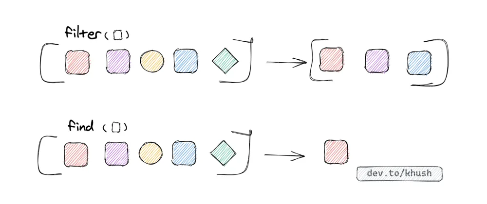
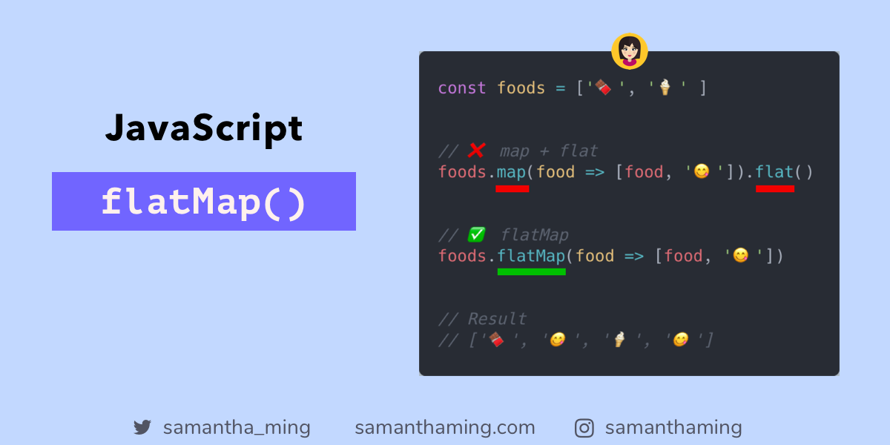
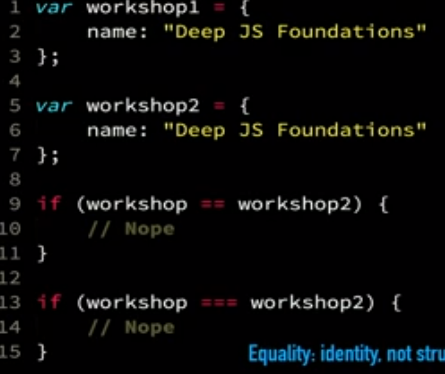
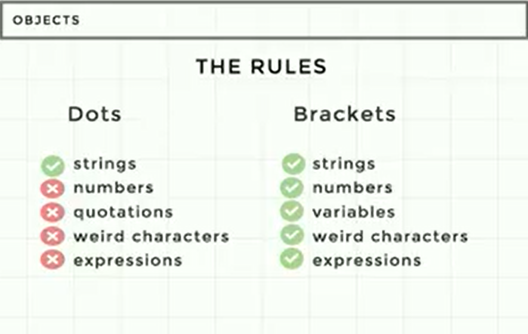
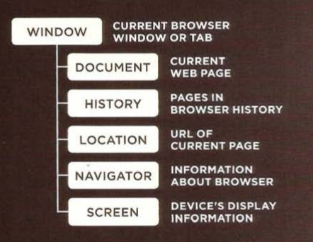
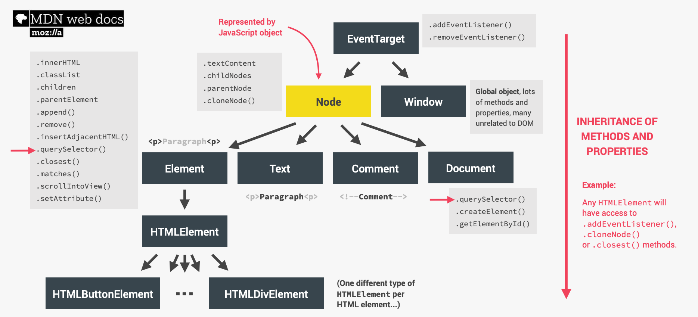

# INDEX

- [INDEX](#index)
  - [installing js in html](#installing-js-in-html)
  - [Variables](#variables)
    - [Hoisting](#hoisting)
  - [Operators](#operators)
  - [Function](#function)
    - [`this` in functions](#this-in-functions)
    - [Arguments](#arguments)
  - [Loop](#loop)
  - [Numbers](#numbers)
    - [Special numbers](#special-numbers)
  - [Date](#date)
    - [international Date Api](#international-date-api)
    - [toLocaleString()](#tolocalestring)
  - [Strings](#strings)
  - [Arrays](#arrays)
    - [Array methods](#array-methods)
  - [Object](#object)
  - [Sets](#sets)
  - [maps](#maps)
  - [DOM](#dom)
    - [Steps for creating an element](#steps-for-creating-an-element)
    - [`innerHTML` vs `innerText`](#innerhtml-vs-innertext)
    - [`insertAdjacentHTML()`](#insertadjacenthtml)
    - [HTMLCollection vs NodeList](#htmlcollection-vs-nodelist)
    - [Node.cloneNode()](#nodeclonenode)
    - [Styles](#styles)
    - [DOM Traversing ( relation between elements )](#dom-traversing--relation-between-elements-)
    - [creating connection between `DOM` & `js-code`](#creating-connection-between-dom--js-code)
  - [virtual DOM](#virtual-dom)
    - [methods to compare nodes](#methods-to-compare-nodes)
    - [steps](#steps)
  - [Events](#events)
    - [Event Delegation - Propagation](#event-delegation---propagation)
    - [Event Handling](#event-handling)
      - [`addEventListener()` vs `onclick()`](#addeventlistener-vs-onclick)
  - [Storage](#storage)
  - [Forms](#forms)
    - [event-handler in forms](#event-handler-in-forms)
    - [Form Validation](#form-validation)
    - [FormData](#formdata)
  - [Scrolling](#scrolling)
    - [intersection observer](#intersection-observer)
    - [Lazy loading](#lazy-loading)
  - [Slider (pagination)](#slider-pagination)
  - [Writing Documentation](#writing-documentation)

---

## installing js in html

- When the browser comes across a `<script>` element, it stops to
  load the script and then checks to see if it needs to do anything.

  - this can affect the loading time of pages

- Why use separate js file in `<script>` tags

  - The benefit of a separate file is that the browser will download it and store it in its **cache**.
  - Other pages that reference the same script will take it from the cache instead of downloading it, so the file is actually downloaded only once. --> That reduces traffic and makes pages faster.

- A single `<script>` tag can’t have both the **src** attribute and code inside.

  ```html
  <script src="file.js">
    alert(1); // the content is ignored, because src is set
  </script>

  <!-- You can separate the 2 scripts -->
  <script src="file.js"></script>
  <script>
    alert(1);
  </script>
  ```

- `defer` : A script that will be downloaded **in parallel to** parsing the page, and **executed after the HTML has finished parsing**

  ```html
  <script src="index.js" defer></script>
  ```

  
  

---

## Variables

- `var` vs `let` vs `const` &nbsp; &nbsp; &nbsp; &nbsp; (also look at the hoisting section in the pdf)
  
  
- variable defined with `var` is an `window` object property

### Hoisting

make space in memory for a variable

- `var hoisting`: usually bad
- `function hoisting`: actually pretty useful --> **must be a function declaration**
- `let hoisting`:
  - it gets **hoisted but not initialized**
  - 

> **function expression** is not hoisted as its variable is the one that is hoisted and not the function

---

## Operators

> NOTE: **operand** is what operators are applied to

- **Binary** operators -> is for 2 operands
  - `5 + 4`
- **unary** operators -> is for 1 operand

  - it's a `+` or `-` before the string number =>

    ```js
    // It actually does the same thing as Number(), but is shorter.
    console.log(+'565'); // 565
    console.log(+true); // 1
    console.log(+""); // 0
    ```

  - it's a `!` before something => `console.log(! (x > 4) )`

---

## Function

- function declaration vs function expression
  

  - The main practical **difference** is that you can call function declaration before you define it and your code will work just fine but with function expression, it's impossible and JavaScript will throw an error at you.
    - This works because the interpreter runs through a script before executing each statement, so it will know that a function declaration appears later in the script
    - the interpreter always looks for **variables** and **function declarations** before going through each section of a script, line-by-line. This means that a function created with a **function declaration** can be called before it has even been declared.
      - as for `Function expression`, You put a function where the interpreter would expect to see an **expression** (returned value), then it is treated as an expression, and it is known as a function expression
  - **Function expression** forces you to define all my functions at the top of my code. this makes you write cleaner and more readable codes this way.
    - here, the name is usually omitted. A function with no name is called an **anonymous function**.
    - also this enables you to have **reliable self-reference (recursion, etc)**
    - and have **more debuggable stack traces** -> the name of function is shown in `stack trace`
    - also this makes **more self-documenting code**
  - **Function declarations** are not part of the regular top-to-bottom flow of control. They are conceptually moved to the top of their scope and can be used by all the code in that scope.

    ```js
    console.log('The future says:', future()); // this works!
    function future() {
      return "You'll never have flying cars";
    }
    ```

  - [ `anonymous function` / `IIFE` ] are inline function expressions.
  - **IIFE** is an inline function expression. which create its own scope

- _note_ :
  - `arrow function`
    - if you used `{}` then you should use the word `return` to return something
    - know that it's shorter but at a cost of it will be **anonymous function** and not a **named function**, which means that it will need you to read the function body to understand what it does instead of figuring out this from its name
- when you use a function that do a calculation process, you should put the invocation of this function in a variable and not invoking it many time => **for performance**, ex:

  - use this

    ```javascript
    for (let i = 0; i < bills.length; i++) {
      const tip = calcTip(bills[i]);
      tips.push(tip);
      totals.push(tip + bills[i]);
    }
    ```

  - not this

    ```javascript
    for (let i = 0; i < bills.length; i++) {
      tips.push(calcTip(bills[i]));
      totals.push(calcTip(bills[i]) + bills[i]);
    }
    ```

- Each function has its own **Execution context**
  - has 2 parts:
    - Thread of execution
    - Memory
  - Ex: 

---

### `this` in functions

- in `arrow functions` =>
  - `this` is **Elastically lexical scoped**, as they define `this` based on **where it was written**
  - `this` refers to the global object ( `window` object ) which why it's called : `Lexical this` , so **DON'T EVER USE `arrow functions` AS A METHOD** as they don't define a `this` keyword so it will point to (**where the function was born**) --> the upper scope which usually where this refers to the global object ( `window` object )
- in `normal functions` =>

  - `this` refers to who the function was invoked (called) by --> (dynamic scope)
  - `this` refers to the `undefined` if it's a global function and not a method to an object.

- each function has its own **execution context** in the call stack
- only one `rest parameter` is allowed in one function and it must be the last parameter.
- skip default parameter :

  ```js
  function myfunc(x, y = 2, z = 6) {}
  // use (undefined) when calling it
  myfunc(5, undefined, 17);
  ```

---

### Arguments

JavaScript is extremely broad-minded about the number of arguments you pass to a function.

- If you pass too many, the extra ones are ignored.
- If you pass too few, the missing parameters get assigned the value **undefined**.

---

## Loop

- in `for` block we can use `const` as each time it will make a new variable :

  ```javascript
  for (let i = 0; i < bills.length; i++) {
    const tip = calcTip(bills[i]);
    tips.push(tip);
  }
  ```

- ex of for loop without any thing in () :

  ```javascript
  let p = ['sample1','sample2','sample3','sample4','sample5'];
  let i = 0;

  for (;;;) {
    console.log(p[i]);
    i++;
    if (i===p.length) break;
  }
  ```

- `for of loop` with index :

  ```javascript
  for (const item of menu) console.log(item);

  // with index
  for (const [i, el] of menu.entries()) {
    console.log(`${i + 1}: ${el}`);
  }
  ```

---

## Numbers

- to check if a number use `Number.isFinite()` as it's better than `Number.inNaN()`
- to get random number between two values :

  ```javascript
  // Returns a random number between min (inclusive) and max (exclusive)
  function getRandomNum(min, max) {
    return Math.random() * (max - min) + min;

    // Returns a random integer between min (inclusive) and max (inclusive)
    function getRandomInt(min, max) {
      min = Math.ceil(min);
      max = Math.floor(max);
      return Math.floor(Math.random() * (max - min + 1)) + min;
      // here we use floor as it works well if number is negative
    }
  }
  ```

- **Formatting Numbers / currency** : [Formatting](https://www.samanthaming.com/tidbits/30-how-to-format-currency-in-es6/)

- _note_ : `toFixed()` returns a `string`

---

### Special numbers

- `Infinity`, `-Infinity`
- `NaN`
  - `0 / 0` = `NaN`
  - `Infinity - Infinity` = `NaN`
  - `console.log("five" * 2)` ->`NaN`

> There is only one value in JavaScript that is not equal to itself, and that is **NaN** > `console.log(NaN == NaN)` -> false

---

## Date


- `getYear()` returns year minus 1900. This has been deprecated for a while now, it's best to use `getFullYear()`.
- `month` is zero based so we add 1 to it
- when you perform operations on dates, the result is in form of `milliSeconds`

### international Date Api

The Intl.DateTimeFormat object enables language-sensitive date and time formatting.

- [Intl.DateTimeFormat cheatsheet](https://devhints.io/wip/intl-datetime)

### toLocaleString()

[reference](https://developer.mozilla.org/en-US/docs/Web/JavaScript/Reference/Global_Objects/Date/toLocaleString)

The toLocaleString() method returns a string with a language sensitive representation of this date.

- syntax : `toLocaleString(locales, options)`

```js
const event = new Date(Date.UTC(2012, 11, 20, 3, 0, 0));
// expected output: Thu Dec 20 2012 05:00:00 GMT+0200 (Eastern European Standard Time)

// British English uses day-month-year order and 24-hour time without AM/PM
console.log(event.toLocaleString('en-GB', { timeZone: 'UTC' }));
// expected output: 20/12/2012, 03:00:00
```

---

## Strings

- we are calling object methods on a "string" such as "length", "toUpperCase()" and "indexOf", however we know "strings" are primitive types and yet these methods are available on a "string".
  - this is because the process called `"Boxing"` which JavaScript perform behind the scene.
  - When ever we call these methods on a "string", JavaScript will convert the "`string primitive`" into "`string objects`" without losing its content, therefore at that object these methods become available.
- convert number to a string :

  ```javascript
  const str = number + '';
  // or
  const str = String(number);
  ```

- operations on strings:

  - The binary `+` is the only operator that supports strings in such a way `2 + '1' --> "21"`

    ```js
    // NOTE That:
    console.log('1' + 2 + 2); // "122" and not "14"
    ```

  - Other arithmetic operators work only with numbers and always convert their operands to numbers.

---

## Arrays


- arrays are **immutable**
- `slice` (makes a copy) vs `splice` (change original array) 
- switching values of 2 variables :

  ```javascript
  let a = 5;
  let b = 8;
  [x, y] = [y, x];
  ```

- default values in destructuring

  ```javascript
  // Default values
  const [p = 1, q = 1, r = 1] = [8, 9];
  ```

- **forEach vs for of**
  | `forEach` | `for of` |
  | ----------------------------------------------------------------- | ------------------------------------------------------------------- |
  | It iterates from initial to end | It is flexible to iterate array both ascending and descending order |
  | Keeps execution until last element get executed (**can't break**) | It runs until given condition become false (**can break**) |
  | It use iteration | It use index |

### Array methods


- **`filter` vs `find`**
  
  - usually `find` is used in logins when you want to check for username
  - `findIndex` is usually used when you want to get index of item to delete it from a list
- **`indexOf` vs `findIndex`**
  - `indexOf` expects a value as first parameter. This makes it a good choice to find the index in arrays of primitive types (like string, number, or boolean).
  - `findIndex` expects a callback as first parameter. Use this if you need the index in arrays with non-primitive types (e.g. objects) or your find condition is more complex than just a value.
- **`flatMap`** : It is identical to a map() followed by a `flat()` of **depth 1**
  
- **`sort`** (for array of numbers only)

  ```javascript
  // if return is (< 0), A, B (keep order)
  // if return is (> 0), B, A (switch order)

  // Ascending
  // movements.sort((a, b) => {
  //   if (a > b) return 1;
  //   if (a < b) return -1;
  // });
  // or
  movements.sort((a, b) => a - b);

  // Descending
  // movements.sort((a, b) => {
  //   if (a > b) return -1;
  //   if (a < b) return 1;
  // });
  // or
  movements.sort((a, b) => b - a);
  ```

- `Array.from()` : usually used to convert `node list` to an array

  ```javascript
  // main advantage here that it can take a mapping-callback-function as a second parameter

  const y = Array.from({ length: 3 }, () => 1); // [1,1,1]

  const z = Array.from({ length: 3 }, (_, i) => i + 1); // [1, 2, 3]

  // converting a node list with mapping
  const movementsUI = Array.from(document.querySelectorAll('.movements__value'), el =>
    Number(el.textContent.replace('€', ''))
  );
  // or you can use spread operator [...document.querySelectorAll(".movements__value")].map()
  ```

---

## Object

- There're 2 ways to create an object:

  - **Object Literals**: `var obj = {};`
  - **Constructor Literals**: `var obj = new Object();`
  - **use a function as a template for creating objects**:

    ```js
    function Hotel(name, rooms) {
      this.name = name;
      this.rooms - rooms;
      // a method
    }

    // Don't forget the "new" keyword
    var hotel_1 = new Hotel('park', 120);
    ```

- we use `function expression` in objects to declare `methods`
- to create a new object from an existing object =>

  ```js
  // jessica is an existing object
  const jessicaCopy = Object.assign({}, jessica);
  // or
  const jessicaCopy = { ...jessica };
  ```

- remember that objects that may look the same to you are actually not
  
- destructuring

  ```js
  // destructuring with changing variable name
  const { name: restaurantName, openingHours: hours, categories: tags } = restaurant;
  console.log(restaurantName, hours, tags);

  // Default values
  const { menu = [], starterMenu: starters = [] } = restaurant;

  // Mutating variables
  let a = 111;
  let b = 999;
  const obj = { a: 23, b: 7, c: 14 };
  ({ a, b } = obj); // we have to wrap it in a ( because js expects a block when we are starting with a {})
  ```

  - it can also be used to **swap variables value** easier:

    ```js
    var a = 1;
    var b = 1;
    [a, b] = [b, a];
    ```

- **enhanced object literals** :

  ```javascript
  const openingHours = {//normal object};

  const restaurant = {
    name: "Classico Italiano",
    location: "Via Angelo Tavanti 23, Firenze, Italy",

    // ES6 enhanced object literals
    openingHours,  // instead of writing it with `=`

    // also the ability to write methods like this instead of this => order : function....
    order(starterIndex, mainIndex) {
    // normal method
    }
  };
  ```

- Object access rules
  

- to convert object to its primitive value --> `.toPrimitive`

---

## Sets

- [sets](https://www.w3schools.com/js/js_object_sets.asp)
- there's no way to get data out of a `set` because all values are unique and order doesn't matter

**EX**:

```js
// convert this to the array on the right in one line

let arr = [1, 2, 2, 3]; // -> [1,2,3]

console.log([...new Set(arr)]);
```

---

## maps

- [maps](https://www.w3schools.com/js/js_object_maps.asp)
- The `Map` object holds key-value pairs and remembers the original insertion order of the keys. Any value (both objects and primitive values) may be used as either a key or a value.
- A `Map` object iterates its elements in insertion order — a for...of loop returns an array of [key, value] for each iteration.
- you can use `arrays` as a key for a map but you must put it first in a variable as if not you then will create multible arrays in the memory and can't access one
- `maps` vs `objects`
  
- Convert object to map

  ```javascript
  // openingHours is an existing object
  const hoursMap = new Map(Object.entries(openingHours));
  ```

---

## DOM

- **object model**: is a group of objects, each of which represent related things from the real world. Together they form a model of something larger.

  - **BROWSER OBJECT MODEL**: contains objects that represent the current `browser window` or `tab`. It contains objects that model things like `browser history` and the `device's screen`.
    
    - `window object` is treated as the default object if none is specified. ex: `alert()` is used instead of `window.alert()`
  - **DOCUMENT OBJECT MODEL**: uses objects to create a representation of the current page. It creates a new object for each element (and each individual section of text) within the page.
    
  - **GLOBAL JAVASCRIPT OBJECTS**: represent things that the JavaScript language needs to create a model of. For example, there is an object that deals only with dates and times.
    - The names of the global objects usually start with a capital letter, e.g., `String`, `Date`, `Math` objects

- allows us to make `javascript` interact with the browser by creating a model of the page and stores it **in memory**
- `DOM-Tree` is generated from HTML document which we can interact with

> WEB BROWSERS ARE PROGRAMS BUILT USING OBJECTS (**window-object** , **document-object**)
> 
>
> - The browser represents each window or tab using a window object. The location property of the window object will tell you the URL of the current page.
> - The current web page loaded into each window is modelled using a document object.

---

### Steps for creating an element

```javascript
//------------------------Create element------------------------//

const element = document.createElement('.div');
message.classList.add('cookie-message');

//----------------------------Content----------------------------//
message.textContent = 'We use cookied for improved functionality and analytics.';
// or
message.innerHTML =
  'We use cookied for improved functionality and analytics. <button class="btn btn--close-cookie">Got it!</button>';

//---------------inserting element in the document---------------//
header.append(message); // inside the element (will be a its child)
// or
header.insertAdjacentHTML('beforeend', message);

header.before(message); // before the element (will be a its sibling)
//------------------------Remove element------------------------//
message.remove();
```

### `innerHTML` vs `innerText`

- `innerHTML` lets you work with HTML rich text (in HTML format) and doesn't automatically encode and decode text and doesn't apply `css` related to the text.
- `innerText` retrieves and sets the content of the tag as plain text with applying `css`

### `insertAdjacentHTML()`

- parses a piece of HTML text and inserts the resulting nodes into the DOM tree at a specified position
  

### HTMLCollection vs NodeList

- Both interfaces are collections of DOM nodes. They differ in the methods they provide and in the type of nodes they can contain.
  | - | HTMLCollection | NodeList |
  | ------------------------------------------------------------------------ | ---------------------------------------------------------- |
  | supposed to only contain Element nodes | can contain any node type |
  | HTMLCollection items can be accessed by their name, id, or index number. | NodeList items can only be accessed by their index number. |
  | HTMLCollection is always a `live` collection | NodeList is most often a `static` collection |
  | `getElementsByClassName()` `getElementsByTagName()` `children` | `querySelectorAll()` `childNodes` |

### Node.cloneNode()

- The `cloneNode()` method creates a copy of a node, and returns the clone.
- The `cloneNode()` method clones all attributes and their values.
- Set the `deep` parameter to `true` if you also want to clone descendants (children).

```javascript
let p = document.getElementById('para1');
let p_prime = p.cloneNode(true);
```

---

### Styles

- to change a property (css-variable) in the `:root` element

  ```javascript
  document.documentElement.style.setProperty('--color-primary', 'orangered');
  ```

- to change style based on previous value of a style property : use `getComputedStyle()`

  ```javascript
  message.style.height = Number.parseFloat(getComputedStyle(message).height, 10) + 30 + 'px';
  // it returns a string so we use parse Float/int
  ```

- to add multiple styles (css text block) :

  ```javascript
  element.style.cssText = 'color:red; height:50px; ...';
  // or using (setAttribute)
  element.setAttribute('style', 'color:red; height:50px; ...');
  ```

- to get a non standard Attribute :

  ```javascript
  const designer = logo.getAttribute('designer');
  // also you can set an Attribute
  logo.setAttribute('company', 'Bankist'); //(attribute_name,value)
  ```

### DOM Traversing ( relation between elements )

- select all siblings of an element

  ```javascript
  // first, convert it from a HtmlCollection to an array
  [...element.parentElement.children].forEach(function (el) {
  if (el !== element) console.log(el);
  );
  ```

---

### creating connection between `DOM` & `js-code`

- this is done by using `custom data` attributes.

- Reading the values of these attributes out in JavaScript is simple.

  - You could use `getAttribute()` with their full HTML name to read them.
  - but the standard defines a simpler way: a `DOMStringMap` you can read out via a `dataset` property.

    - To get a data attribute through the dataset object, get the property by the part of the attribute name after `data-` (note that `dashes` are converted to `camelCase`).

    ```html
    <!-- html file -->
    <article
      id="electric-cars"
      data-columns="3"
      data-index-number="12314"
      data-parent="cars"
    ></article>
    ```

    ```js
    // js file
    const article = document.querySelector('#electric-cars');

    article.dataset.columns; // "3"
    const { columns } = article.dataset; // to get the value

    article.dataset.indexNumber; // "12314"
    article.dataset.parent; // "cars"
    ```

---

## virtual DOM

Virtual DOM is in-memory representation of Real DOM. It is lightweight JavaScript object which is `copy` of Real DOM.

- The `virtual DOM` is a tree based on JavaScript objects created with `React` that resembles a DOM tree. Each time you need to change something in the DOM, `React` employs a different algorithm that exclusively re-renders the DOM nodes that have changed. Meaning, `React` allows developers to write code as if the entire page is rendered on each change while in the underhood `React` ONLY renders sub-components that have actually changed.
- Virtual DOM duty among other things is to abstract real DOM operations we would need to do

### methods to compare nodes

- to compare the (content) of the 2 nodes

  ```js
  node1.isEqualNode(node2); // true/false
  ```

- checking the value => [nodeValue](https://developer.mozilla.org/en-US/docs/Web/API/Node/nodeValue) is empty or not

  ```js
  node1.firstChild?.nodeValue.trim() !== '';
  ```

### steps

```js
// (1) create a copy of the document(DOM)
let newDOM = document.createRange();
// (2) convert the string(newMarkup) to a real-DOM-object
newDOM = newDOM.createContextualFragment(newMarkup);
// 1,2 in one step =>
const newDOM = document.createRange().createContextualFragment(newMarkup);
// now newDOM is like a big object of (virtual-DOM) that lives in memory NOT tha page

// (5) selecting all elements that lives in our virtual-DOM and converting it to an array so that we can compare it with the real-DOM
const newElements = Array.from(newDOM.querySelectorAll('*'));

// (6) selecting all elements that lives in our real-DOM and converting it to an array so that we can compare it with the virtual-DOM
const curElements = Array.from(this._parentElement.querySelectorAll('*'));

// (7) looping over the 2 arrays at the same time so that we can compare them
newElements.forEach((newEl, i) => {
  const curEl = curElements[i];

  // (8) Updates changed TEXT
  if (
    // comparing the (content) of the 2 nodes
    !newEl.isEqualNode(curEl) &&
    newEl.firstChild?.nodeValue.trim() !== ''
  ) {
    // change the part that differ in the virtual-DOM
    curEl.textContent = newEl.textContent;
  }

  // (9) Updates changed Attributes
  if (!newEl.isEqualNode(curEl))
    Array.from(newEl.attributes).forEach(attr => curEl.setAttribute(attr.name, attr.value));
});
```

---

## Events

### Event Delegation - Propagation


- `Event delegation` is a special kind of event handling, in which an event handler of the parent of an element handles events for that element.
- used to prevent event listener to create a lot of callback functions listening to all the items in `forEach`, so we use `event.target` as it shows **where the event happened**

  1. Add event listener to common parent element
  2. Determine what element originated the event => `e.target`
  3. if the element has children inside it => use `.closest(element)` to prevent wrong selection

  ```javascript
  tabsContainer.addEventListener('click', function (e) {
    const clicked = e.target.closest('.operations__tab');
    // Don't use `e.target.parentElement`

    // Guard clause (as if you clicked on other than '.operations__tab' element )
    if (!clicked) return;}
  ```

---

### Event Handling

- `this` in callbacks refers to the selected element in the event `but` => `this` doesn't work like that if you used an `arrow function`, and if so, you should use `bind`

#### `addEventListener()` vs `onclick()`

| addEventListener                                                                                       | onclick                                                                                     |
| ------------------------------------------------------------------------------------------------------ | ------------------------------------------------------------------------------------------- |
| addEventListener can add multiple events to a particular element.                                      | can add only a single event to an element. It is basically a property, so gets overwritten. |
| addEventListener can take a third argument that can control the event propagation.                     | Event propagation cannot be controlled by onclick.                                          |
| addEventListener can only be added within `<script>` elements or in external JavaScript file.          | onclick can be added as an HTML attribute also.                                             |
| addEventListener does not work in older versions of Internet explorer, which uses attachEvent instead. | onclick works in all browsers.                                                              |
| addEventListener can do multiple things when event is triggered                                        | onclick can only do one task when event is triggered                                        |
| can be on an element that doesn't exist yet (ex : `event.target`)                                      | can't do that                                                                               |

- to make a callback function listen to more that one event :

  ```js
  ['click', 'load'].forEach(event => window.addEventListener(event, callback_function));
  ```

---

## Storage

- `local storage` : always stays
- `session storage` : gets closed when window or tab are closed

---

## Forms

### event-handler in forms

- always use `e.preventDefault();` on form buttons as it defaults to refresh the page
- to remove focus from input field : `inputLogin.blur();`
- always use `e.preventDefault();` on hyperlinks `<a>` which has a `href="#"` and you want it to do something like ( show pop-up window ) as it defaults to go to top

### Form Validation

- Provide meaningful error messages

  - error messages are not identical in every browser. How can you show the same message to everyone?
    - To achieve this, use the `setCustomValidity()`

  ```js
  const nameInput = document.querySelector('[name="name"]');

  nameInput.addEventListener('invalid', () => {
    nameInput.setCustomValidity('Please enter your name.');
  });
  ```

### FormData

-The `FormData()` constructor creates a new `FormData` object. => [reference](https://developer.mozilla.org/en-US/docs/Web/API/FormData/FormData)

- The FormData interface provides a way to easily construct a set of `key/value pairs` representing form fields and their values, which can then be easily sent using the `fetch()` or `XMLHttpRequest.send()` method. It uses the same format a form would use if the encoding type were set to "multipart/form-data".

```js
const dataArr = [...new FormData(formElement)];
// result : [[key1,value1],[key2,value2],[key3,value3],[key4,value4],...]

// now we want to convert it to an object
const data = Object.fromEntries(dataArr);
// result :
{
  key1 : value1,
  key2 : value2,
  key3 : value3,
  key4 : value4,
}
```

- the `FormData` object will be populated with the form's current keys/values using the name property of each element for the keys and their submitted value for the values. It will also encode file input content.

---

## Scrolling

### intersection observer

[More Info](https://blog.arnellebalane.com/the-intersection-observer-api-d441be0b088d)


  


- The Intersection Observer API is a Web platform API that allows for observing changes to how much of a target element’s area intersects with that of an ancestor element or the viewport. The need for such information has a lot of use cases, such as implementing lazy-loading and infinite scrolling !
  
- By default, the Intersection Observer API uses the viewport as the intersection root, and only executes the callback when the target element enters and exits the viewport.
- A `threshold` is a value in which the Intersection Observer will execute the callback function whenever the intersection ratio reaches that value (either as it increases or decreases), and is also expressed as a value between 0 and 1, inclusive.

  - It is also possible to set multiple threshold values by passing an array of threshold values

  ```javascript
  const observer = new IntersectionObserver(function (changes) {
    // do something with the changes   }, {
    threshold: [0, 0.25, 0.5, 0.75, 1];
  });
  // executes the callback function when the target element enters/exits the intersection root (i.e. intersection ratio of 0), then again when its intersection ratio crosses 0.25, then 0.5, etc.
  ```

```javascript
const observer = new IntersectionObserver(function (changes) {
  // do something with the changes   });
observer.observe(targetElement);
```

- The `callback function`, when executed, is passed an array of entries, each an instance of `IntersectionObserverEntry`. This is an `array` because the Intersection Observer object can be used to observe multiple target elements
- it is possible to adjust the intersection root’s rectangle by setting `root margin`
- `Example`

  ```javascript
  // Sticky navigation: Intersection Observer API

  const header = document.querySelector('.header');
  const navHeight = nav.getBoundingClientRect().height; // to get the exact height without hard-coding it (instead of writing "-90px")

  // callback function
  const stickyNav = function (entries) {
    const [entry] = entries; // destructuring : same as entry =  entries[0]
    // console.log(entry);
    if (!entry.isIntersecting) nav.classList.add('sticky');
    else nav.classList.remove('sticky');
  };

  const headerObserver = new IntersectionObserver(stickyNav, {
    root: null, // as we are observing the viewport
    threshold: 0, // from intersection ratio
    rootMargin: `-${navHeight}px` //(instead of writing "-90px")
  });

  headerObserver.observe(header);
  ```

### Lazy loading

- is a strategy to identify resources as non-blocking (non-critical) and load these only when needed. It's a way to shorten the length of the critical rendering path, which translates into reduced page load times.
- `Steps`

  - HTML :

    ```html
    
    src="img/digital-lazy.jpg"
    <!-- img 2 (high quality) -->
    data-src="img/digital.jpg" alt="Computer" class="features__img lazy-img" />
    ```

  - CSS

  ```css
  .lazy-img {
    filter: blur(20px);
  }
  ```

  - JS

  ```javascript
  // Lazy loading images
  const imgTargets = document.querySelectorAll('img[data-src]');

  const loadImg = function (entries, observer) {
    const [entry] = entries;

    if (!entry.isIntersecting) return;

    // Replace src with data-src
    entry.target.src = entry.target.dataset.src;
    // show the high quality img without filter class (ONLY) when it loads
    entry.target.addEventListener('load', function () {
      entry.target.classList.remove('lazy-img');
    });

    observer.unobserve(entry.target);
  };

  const imgObserver = new IntersectionObserver(loadImg, {
    root: null,
    threshold: 0,
    rootMargin: '200px' // so that it happens before the user reach the img by 200px so that he doesn't notice it
  });

  imgTargets.forEach(img => imgObserver.observe(img));
  ```

---

## Slider (pagination)

- `pagination` comes from `multiple pages`
- see `slider` section in => [BANKIST-Home_Page-js](../12-BANKIST-Home_Page/script.js)

---

## Writing Documentation

[jsdoc](https://jsdoc.app/)

- before any function(the line above it) write `/**` and vsCode will configure it
