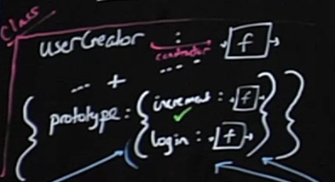

# INDEX

- [INDEX](#index)
  - [Object Oriented Paradigm](#object-oriented-paradigm)
  - [Constructor Function](#constructor-function)
    - [Methods](#methods)
  - [prototypal inheritance (delegation)](#prototypal-inheritance-delegation)
    - [Why we do this?](#why-we-do-this)
      - [The "new Function" syntax](#the-new-function-syntax)
  - [ES6 Classes](#es6-classes)
    - [`getter` & `setter`](#getter--setter)
  - [`object.create()`](#objectcreate)
  - [Class Inheritance](#class-inheritance)
    - [**METHOD-1** : using `Constructor Function`](#method-1--using-constructor-function)
    - [**METHOD-2** : using `ES6 Classes`](#method-2--using-es6-classes)
    - [**METHOD-3** : using `object.create()`](#method-3--using-objectcreate)
  - [METHOD CHAINING](#method-chaining)
  - [Encapsulation](#encapsulation)
  - [notes](#notes)

---

## Object Oriented Paradigm

- the word **Paradigm** means an approach to to something in an organized way with clear structure
- oop paradigm is replacement of procedural paradigm by making each different thing in an object

> Javascript object oriented way is very different from other OOP languages as in the background javascript is actually **faking** the implementation as **Javascript is a prototypal-language and not object-oriented-language**

---

## Constructor Function

That's the main purpose of constructors – to implement reusable object creation code.

- `Return` from constructors: Usually, constructors do not have a return statement. Their task is to write all necessary stuff into `this`, and it automatically becomes the result. But if there is a `return` statement, then:

  - If `return` is called with an object, then the object is returned instead of `this`.
  - If `return` is called with a primitive, it’s ignored.

  ```js
  function BigUser() {
    this.name = 'John';
    return { name: 'Godzilla' }; // <-- returns this object
  }

  alert(new BigUser().name); // Godzilla, got that object
  ```

- we can omit **parentheses** after new, if it has no arguments:

  ```js
  let user = new User(); // <-- no parentheses
  // same as
  let user = new User();
  ```

### Methods

- You should never create a method inside of a constructor function.That's because imagine we were gonna create a hundred of instants using this constructor function, Then what would happen, is that each of these objects would carry around this function here. So we would essentially create a hundred copies of this function. This is bad for performance
- instead use `prototypal inheritance`

  ```javascript
  // Person is a class
  Person.prototype.calcAge = function () {
    console.log(2037 - this.birthYear);
  };

  // jonas is an instance of Person
  console.log(jonas.__proto__ === Person.prototype); // true
  ```

  - what happens is that we **link (point)** `__proto__` property of `jonas` instance to the `prototype` property of the `Person` Constructor Function (class).

---

## prototypal inheritance (delegation)

- if a property or a method can't be found in a certain object, javascript will look into its `prototype`
  - accessing the properties & methods of the parent class
- look at the `protoType chain` in the PDF
  - another illustration of the chain: 

### Why we do this?

why we do this instead of declaring the function with the class properties each time we instantiate a new class (object) ?

- because we don't want to create the same function that have same functionality each time for each object
- instead we move all these methods (functions) to a parent object so that it won't be created each time (**Bundle all common functions together + Make a Bond to that object by a hidden property -> `__proto__`**)
  - `__proto__` hidden property is added in the background using the **"new"** keyword that points to the **prototype** object-property in the parent class

#### The "new Function" syntax

When a function is executed with **new** keyword, it does the following steps:

- A new empty object is created and assigned to `this`.
- The function body executes. Usually it modifies `this`, adds new properties to it.
- The value of `this` is returned.

```js
// new Function([arg1, arg2, ...argN], functionBody);
let sum = new Function('a', 'b', 'return a + b');
```

- The major difference from other ways we’ve seen is that **the function is created literally from a string**; For example, we can receive a new function from a server and then execute it:

  - It is used in very specific cases, like when we receive code from a server, or to dynamically compile a function from a template, in complex web-applications.

  ```js
  let str = ... receive the code from a server dynamically ...

  let func = new Function(str);
  func();
  ```

- all is that is possible because (functions in JS are both **function & objects combo**)

> **NOTE:** other built in objects like arrays have the hidden `__proto__` property

---

## ES6 Classes

- here we have `class declaration` / `class expression` like function => as `classes` are in fact `function`

  - **class** automatically creates a **function + object** combo
    - the object created will have the methods added to the **automatically** created `prototype` object of the class, instead of manually adding the methods to the `prototype` object
      

  ```javascript
  // Class expression
  const PersonCl = class {};

  // Class declaration
  class PersonCl {
    constructor(fullName, birthYear) {
      this.fullName = fullName;
      this.birthYear = birthYear;
    }

    calcAge() {
      console.log(2037 - this.birthYear);
    }
  }
  ```

- _notes_

  1. There're no **classes** in Javascript, this is just **syntactic sugar**
  2. Classes are NOT hoisted
  3. Classes are first-class citizens
  4. Classes are executed in strict mode

### `getter` & `setter`

- `getter` :
  - show a method as a property
  - get value out of an object by writing a property instead of writing a method
- `setter` :
  - used to change exsisting property
  - define a property by setting it to a value instead of calling a method.
  - if you have a setter for a property that is already defined in the constructor, then you need to create basically a new property with the `underscore ( _ )` in front of it.

---

## `object.create()`

- enables you to create prototypes from other objects

```javascript
const PersonProto = {
  calcAge() {
    console.log(2037 - this.birthYear);
  },

  init(firstName, birthYear) {
    this.firstName = firstName;
    this.birthYear = birthYear;
  }
};

// ------------- using object.create ------------- //

// mehtod-1
// make (PersonProto) to be the prototype of (steven)
const steven = Object.create(PersonProto);
steven.name = 'Steven';
steven.birthYear = 2002;
steven.calcAge();

// mehtod-2
const sarah = Object.create(PersonProto);
sarah.init('Sarah', 1979);
sarah.calcAge();
```

---

## Class Inheritance

### **METHOD-1** : using `Constructor Function`

```javascript
const Student = function (firstName, birthYear, course) {
  Person.call(this, firstName, birthYear);
  // here we are not using the (new) word and we are using (Person) as a normal function and not a class, so without (call) (this) in the person class will results => undefined

  this.course = course;
};

// Linking prototypes
Student.prototype = Object.create(Person.prototype);
// here we use (Object.create) because we want to set the prototype "MANUALLY"
// (this step has to be before assigning any methods to Student.prototype like (introduce) method below)

Student.prototype.introduce = function () {
  console.log(`My name is ${this.firstName} and I study ${this.course}`);
};
```

### **METHOD-2** : using `ES6 Classes`

```javascript
class PersonCl {
  constructor(fullName, birthYear) {
    this.fullName = fullName;
    this.birthYear = birthYear;
  }

  calcAge() {
    console.log(2037 - this.birthYear);
  }
}

class StudentCl extends PersonCl {
  constructor(fullName, birthYear, course) {
    // Always needs to happen first!
    super(fullName, birthYear);
    this.course = course;
  }
  // prototypes are automatically inherited with (extends) word
}
```

- `super()` -> creates a hidden property `__proto__` to the object but here `__proto__` won't point to `prototype` of the parent object instead it will point to the **objectCreator constructor function of the parent class**
  - then the result (return value) from the `objectCreator constructor function` will be put in the created `this` property

### **METHOD-3** : using `object.create()`

```javascript
const PersonProto = {
    calcAge() {
      console.log(2037 - this.birthYear);
    }
    init(firstName, birthYear) {
      this.firstName = firstName;
      this.birthYear = birthYear;
    },
  }

//-------------How subclassing works?-------------//
// 1st step : set the __proto__ of the subClass from the __proto__ of the superClass
// as object is (object + function) combo -> (if it doesn't find the property --> go to obj prototype & if it doesn't find the method --> go to function prototype)
const StudentProto = Object.create(PersonProto);

// 2nd step : add init properties to the subClass
StudentProto.init = function (firstName, birthYearcourse) {
  PersonProto.init.call(this, firstName, birthYear);
  this.course = course;
  };

// 3rd step : create an instance
const steven = Object.create(StudentProto);
steven.init('Jay', 2010, 'Computer Science');
```

---

## METHOD CHAINING

- Method chaining is the mechanism of calling a method on another method of the same object. This ensures a cleaner and readable code.
- Method chaining uses `this` keyword in the object's class to access its methods.When a method returns `this`, it simply returns an instance of the object in which it is returned. in another word, to chain methods together :

  - we need to make sure that each method we define has a return value so that we can call another method on it.

  ```javascript
   withdraw(val) {
     this.deposit(-val);
     return this;
   }
  ```

---

## Encapsulation

is a methodology used for hiding information. It is based on the concept that object properties should not be exposed publicly to the outside world. Implementing Encapsulation in JavaScript prevents access to the variables by adding public entities inside an object, which the callers can use to achieve specific results.

- we use it to prevent the user from seeing specific properties or changing them
- so we make these properties accessable from methods and not directly

```javascript
// Encapsulation: Protected Properties and Methods
// 1) Public fields
// 2) Private fields
// 3) Public methods
// 4) Private methods
// (there is also the static version)

class Account {
  // 1) Public fields (instances)
  locale = navigator.language;

  // 2) Private fields (instances)
  #movements = [];
  #pin; // we define it like this without a value as its value will be set in the constructor

  constructor(owner, currency, pin) {
    this.owner = owner;
    this.currency = currency;
    this.#pin = pin;

    // another way of Protected property (using (_) before property's name)
    // this._movements = [];
    // another way of Public property
    // this.locale = navigator.language;
  }

  // 3) Public methods

  // Public interface
  getMovements() {
    return this.#movements;
  }

  deposit(val) {
    this.#movements.push(val); // that's how we modify a private property (through a public method)
    return this;
  }

  withdraw(val) {
    this.deposit(-val);
    return this;
  }

  // 4) Private methods
  // #approveLoan(val) {
  _approveLoan(val) {
    return true;
  }
}
```

---

## notes

- `static methods` are not available for instances
- if you want a class method to be automatically called when an instance of the class is created, then you should put this method in the `constructor()`
- in old syntax if we didn't use the word **"new"**, then **this** keyword will point to the `window` object
- Is it possible to create functions `A` and `B` so that `new A() == new B()`?

  - Yes, it’s possible. If a function returns an object then `new` returns it instead of `this`.

  ```js
  let obj = {};

  function A() {
    return obj;
  }
  function B() {
    return obj;
  }

  alert(new A() == new B()); // true
  ```
