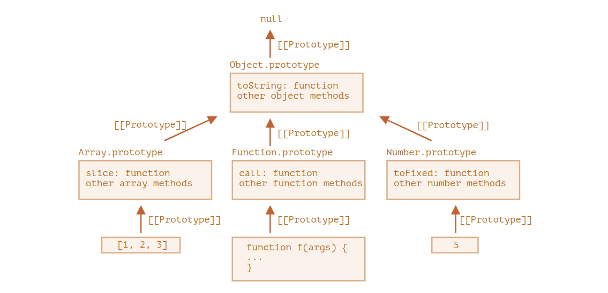
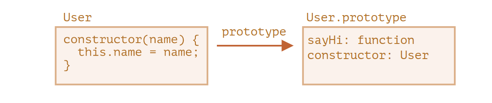

# INDEX

- [INDEX](#index)
  - [Object Oriented Paradigm](#object-oriented-paradigm)
  - [Object](#object)
    - [Object / Accessor properties](#object--accessor-properties)
      - [Smarter getters/setters](#smarter-getterssetters)
  - [Constructor Function](#constructor-function)
    - [Methods](#methods)
  - [prototypal inheritance (delegation)](#prototypal-inheritance-delegation)
    - [Why we do this?](#why-we-do-this)
      - [Functions Prototype](#functions-prototype)
    - [Native Prototypes](#native-prototypes)
    - [The "new Function" syntax](#the-new-function-syntax)
  - [ES6 Classes (Class syntax)](#es6-classes-class-syntax)
    - [`getter` \& `setter`](#getter--setter)
  - [`object.create()`](#objectcreate)
  - [Class Inheritance](#class-inheritance)
    - [Method 1 : using `Constructor Function`](#method-1--using-constructor-function)
    - [Method 2 : using `ES6 Classes`](#method-2--using-es6-classes)
      - [`super` keyword](#super-keyword)
    - [Method 3 : using `object.create()`](#method-3--using-objectcreate)
    - [Mixins](#mixins)
  - [Method Chaining](#method-chaining)
  - [Class Fields](#class-fields)
    - [Static Methods and Properties](#static-methods-and-properties)
      - [Static Methods](#static-methods)
      - [Static Properties](#static-properties)
    - [Encapsulation (Private and protected properties and methods)](#encapsulation-private-and-protected-properties-and-methods)
  - [Notes](#notes)

---

## Object Oriented Paradigm

- the word **Paradigm** means an approach to to something in an organized way with clear structure
- oop paradigm is replacement of procedural paradigm by making each different thing in an object

> Javascript object oriented way is very different from other OOP languages as in the background javascript is actually **faking** the implementation as **Javascript is a prototypal-language and not object-oriented-language**

---

## Object

### Object / Accessor properties

- objects can store properties. object property is actually a more flexible and powerful thing than just a `key-value` pairs.

  - **Object properties**, besides a value, have three special attributes (so-called `“flags”`):

    - `writable` – if `true`, the value can be changed, otherwise it’s read-only.
    - `enumerable` – if `true`, then listed in loops, otherwise not listed.

      - we can set `enumerable:false`. Then it won’t appear in a for..in loop,

      ```js
      let user = {
        name: 'John',
        toString() {
          return this.name;
        }
      };

      Object.defineProperty(user, 'toString', {
        enumerable: false
      });

      // Now our toString disappears:
      for (let key in user) alert(key); // name
      ```

    - `configurable` – if `true`, the property can be deleted and these attributes can be modified, otherwise not.

      - > Please note: `configurable: false` prevents changes of property flags and its deletion, while allowing to change its value.

    - The method `Object.getOwnPropertyDescriptor` allows to query the full information about a property.

      ```js
      let descriptor = Object.getOwnPropertyDescriptor(obj, propertyName);
      ```

  - **Accessor properties** are represented by `“getter”` and `“setter”` methods. In an object literal they are denoted by get and set:

    ```js
    let obj = {
      get propName() {
        // getter, the code executed on getting obj.propName
      },

      set propName(value) {
        // setter, the code executed on setting obj.propName = value
      }
    };

    // -------------------------------------------------

    let user = {
      name: 'John',
      surname: 'Smith',

      get fullName() {
        return `${this.name} ${this.surname}`;
      },

      set fullName(value) {
        [this.name, this.surname] = value.split(' ');
      }
    };

    // set fullName is executed with the given value.
    user.fullName = 'Alice Cooper';

    alert(user.fullName); // Alice Cooper
    ```

#### Smarter getters/setters

`Getters`/`setters` can be used as wrappers over “real” property values to **gain more control** over operations with them.

- One of the great uses of **accessors** is that they allow to take control over a “regular” data property at any moment by replacing it with a `getter` and a `setter` and tweak its behavior.

```js
let user = {
  get name() {
    return this._name;
  },

  set name(value) {
    if (value.length < 4) {
      alert('Name is too short, need at least 4 characters');
      return;
    }
    this._name = value; // The name is stored in _name property, and the access is done via getter and setter.
  }
};

user.name = 'Pete';
alert(user.name); // Pete

user.name = ''; // Name is too short...
```

---

## Constructor Function

That's the main purpose of constructors – to implement reusable object creation code.

- `Return` from constructors: Usually, constructors do not have a return statement. Their task is to write all necessary stuff into `this`, and it automatically becomes the result. But if there is a `return` statement, then:

  - If `return` is called with an object, then the object is returned instead of `this`.
  - If `return` is called with a primitive, it’s ignored.

  ```js
  function BigUser() {
    this.name = 'John';
    return { name: 'Godzilla' }; // <-- returns this object
  }

  alert(new BigUser().name); // Godzilla, got that object
  ```

- we can omit **parentheses** after new, if it has no arguments:

  ```js
  let user = new User(); // <-- no parentheses
  // same as
  let user = new User();
  ```

### Methods

- You should never create a method inside of a constructor function.That's because imagine we were gonna create a hundred of instants using this constructor function, Then what would happen, is that each of these objects would carry around this function here. So we would essentially create a hundred copies of this function. This is bad for performance
- instead use `prototypal inheritance`

  ```javascript
  // Person is a class
  Person.prototype.calcAge = function () {
    console.log(2037 - this.birthYear);
  };

  // jonas is an instance of Person
  console.log(jonas.__proto__ === Person.prototype); // true
  ```

  - what happens is that we **link (point)** `__proto__` property of `jonas` instance to the **"hidden"** `prototype` property of the `Person` Constructor Function (class).

---

## prototypal inheritance (delegation)

> In JavaScript, objects have a special hidden property **`[[Prototype]]`**, that is either **`null`** or references another object. That object is called “a prototype”:
>
> - The property `[[Prototype]]` is internal and hidden, but there are many ways to set it:
>
>   - One of them is to use the special name **`__proto__`**, which is a "setter"
>
>     ```js
>     rabbit.__proto__ = animal; // sets rabbit.[[Prototype]] = animal
>     ```
>
>   - Here we can say that "animal is the prototype of rabbit" or "rabbit prototypically inherits from animal".

- **Notes**

  - if a property or a method can't be found in a certain object, javascript will look into its `prototype`
    - accessing the proper4ties & methods of the parent class
  - The value of `__proto__` can be either an **object** or **null**. Other types are ignored.
  - `__proto__` is a historical **getter**/**setter** for `[[Prototype]]`
  - The `__proto__` property is a bit outdated. It exists for historical reasons, modern JavaScript suggests that we should use `Object.getPrototypeOf`/`Object.setPrototypeOf` functions instead that `get`/`set` the prototype.

    - `Object.getPrototypeOf(obj)` – returns the `[[Prototype]]` of `obj`.
    - `Object.setPrototypeOf(obj, proto)` – sets the `[[Prototype]]` of `obj` to `proto`.

  - The `for..in` loop iterates over both its own and its inherited properties. All other key/value-getting methods only operate on the object itself.

> - **`"this"` is not affected by prototypes at all**.
>   - No matter where the method is found: in an object or its prototype. In a method call, `this` is always the object before the dot.
>   - so, when the inheriting objects run the inherited methods, they will modify only their own states, not the state of the big object.

- look at the `protoType chain` in the PDF
  - another illustration of the chain: 

### Why we do this?

why we do this instead of declaring the function with the class properties each time we instantiate a new class (object) ?

- because we don't want to create the same function that have same functionality each time for each object
- instead we move all these methods (functions) to a parent object so that it won't be created each time (**Bundle all common functions together + Make a Bond to that object by a hidden property -> `__proto__`**)
  - `__proto__` hidden property is added in the background using the **"new"** keyword that points to the **prototype** object-property in the parent class

#### Functions Prototype

- Every function has the "`prototype`" property even if we don’t supply it.
- The default "`prototype`" is an object with the only property `constructor` that points back to the function itself.

  ```js
  function Rabbit() {}

  /* default prototype
  Rabbit.prototype = { constructor: Rabbit };
  */
  ```

---

### Native Prototypes

- note this behavior from the native prototypes like `Object`, `Array`, `Date`, `Function`, ...

  ```js
  let obj = {};
  alert(obj); // "[object Object]"
  ```

  - this is done due to the method `.toString()` is called as it's an instance of the `Object` constructor

- Other built-in prototypes:
  

  ```js
  let arr = [1, 2, 3];

  // it inherits from Array.prototype?
  alert(arr.__proto__ === Array.prototype); // true

  // then from Object.prototype?
  alert(arr.__proto__.__proto__ === Object.prototype); // true

  // and null on the top.
  alert(arr.__proto__.__proto__.__proto__); // null
  ```

  

> - In modern programming, there is only one case where modifying **native prototypes** is approved. That’s **polyfilling**.
>   - Polyfilling is a term for making a substitute for a method that exists in the JavaScript specification, but is not yet supported by a particular JavaScript engine.

---

### The "new Function" syntax

When a function is executed with **new** keyword, it does the following steps:

- A new empty object is created and assigned to `this`.
- The function body executes. Usually it modifies `this`, adds new properties to it.
- The value of `this` is returned.

```js
// new Function([arg1, arg2, ...argN], functionBody);
let sum = new Function('a', 'b', 'return a + b');
```

- The major difference from other ways we’ve seen is that **the function is created literally from a string**; For example, we can receive a new function from a server and then execute it:

  - It is used in very specific cases, like when we receive code from a server, or to dynamically compile a function from a template, in complex web-applications.

  ```js
  let str = ... receive the code from a server dynamically ...

  let func = new Function(str);
  func();
  ```

- all is that is possible because (functions in JS are both **function & objects combo**)

> **NOTE:** other built in objects like arrays have the hidden `__proto__` property

---

## ES6 Classes (Class syntax)

> In object-oriented programming, a **class** is an extensible program-code-template for creating objects, providing initial values for state (member variables) and implementations of behavior (member functions or methods).

- here we have `class declaration` / `class expression` like function => as `classes` are in fact `function`

  - **class** automatically creates a **function + object** combo
    - the object created will have the methods added to the **automatically** created `prototype` object of the class, instead of manually adding the methods to the `prototype` object
      

  ```javascript
  // Class Expression
  let User = class MyClass {
    sayHi() {
      alert(MyClass); // MyClass name is visible only inside the class
    }
  };
  new User().sayHi(); // works, shows MyClass definition
  alert(MyClass); // error, MyClass name isn't visible outside of the class

  // --------------------------------------------------------------- //

  // Class declaration
  class PersonCl {
    constructor(fullName, birthYear) {
      this.fullName = fullName;
      this.birthYear = birthYear;
    }

    calcAge() {
      console.log(2037 - this.birthYear);
    }
  }
  ```

- in the code below, What `class User {...}` construct really does is:

  ```js
  class User {
    constructor(name) {
      this.name = name;
    }
    sayHi() {
      alert(this.name);
    }
  }
  ```

  

  1. Creates a function named `PersonCl`, that becomes the result of the class declaration. The function code is taken from the constructor method (assumed empty if we don’t write such method).
  2. Stores class methods, such as sayHi, in **`User.prototype`**.

- **Notes:**

  1. There're no **classes** in Javascript, this is just **syntactic sugar**

     - Sometimes people say that class is a “syntactic sugar” (syntax that is designed to make things easier to read, but doesn’t introduce anything new), because we could actually declare the same thing without using the class keyword at all
     - actually, It's "Not just a syntactic sugar"

       - a function created by `class` is labelled by a special internal property `[[IsClassConstructor]]: true`. So it’s not entirely the same as creating it manually.

         - The language checks for that property in a variety of places. For example, unlike a regular function, it must be called with `new` keyword:

           ```js
           class User {
             constructor() {}
           }

           alert(typeof User); // function
           User(); // Error: Class constructor User cannot be invoked without 'new'
           ```

     - Class methods are non-enumerable. A class definition sets `enumerable` flag to `false` for all methods in the "prototype".
       - That’s good, because if we `for..in` over an object, we usually don’t want its class methods.
     - Classes always **use strict**. All code inside the class construct is automatically in strict mode.

1. In JavaScript, a `class` is a kind of (has `type` equal to) **function**.
2. There're no commas between class methods

3. Classes are NOT hoisted
4. Classes are first-class citizens
5. Classes are executed in strict mode

---

### `getter` & `setter`

- `getter` :
  - show a method as a property
  - get value out of an object by writing a property instead of writing a method
- `setter` :
  - used to change existing property
  - define a property by setting it to a value instead of calling a method.
  - if you have a setter for a property that is already defined in the constructor, then you need to create basically a new property with the `underscore ( _ )` in front of it.

---

## `object.create()`

- enables you to create prototypes from other objects

```javascript
const PersonProto = {
  calcAge() {
    console.log(2037 - this.birthYear);
  },

  init(firstName, birthYear) {
    this.firstName = firstName;
    this.birthYear = birthYear;
  }
};

// ------------- using object.create ------------- //

// mehtod-1
// make (PersonProto) to be the prototype of (steven)
const steven = Object.create(PersonProto);
steven.name = 'Steven';
steven.birthYear = 2002;
steven.calcAge();

// mehtod-2
const sarah = Object.create(PersonProto);
sarah.init('Sarah', 1979);
sarah.calcAge();
```

---

## Class Inheritance

### Method 1 : using `Constructor Function`

```javascript
const Student = function (firstName, birthYear, course) {
  Person.call(this, firstName, birthYear);
  // here we are not using the (new) word and we are using (Person) as a normal function and not a class, so without (call) (this) in the person class will results => undefined

  this.course = course;
};

// Linking prototypes
Student.prototype = Object.create(Person.prototype);
// here we use (Object.create) because we want to set the prototype "MANUALLY"
// (this step has to be before assigning any methods to Student.prototype like (introduce) method below)

Student.prototype.introduce = function () {
  console.log(`My name is ${this.firstName} and I study ${this.course}`);
};
```

### Method 2 : using `ES6 Classes`

```javascript
class PersonCl {
  constructor(fullName, birthYear) {
    this.fullName = fullName;
    this.birthYear = birthYear;
  }

  calcAge() {
    console.log(2037 - this.birthYear);
  }
}
```

- You can use **Computed methods names `[…]`**

  ```js
  class User {
    ['say' + 'Hi']() {
      alert('Hello');
    }
  }

  new User().sayHi();
  ```

#### `super` keyword

We do something in our method, but call the parent method before/after it or in the process. Classes provide the **"super"** keyword for that.

- `super.method(...)` to call a parent method.
- `super(...)` to call a parent constructor (inside our constructor only).

  - `super()` -> creates a hidden property `__proto__` to the object but here `__proto__` won't point to `prototype` of the parent object instead it will point to the **objectCreator constructor function of the parent class**
    - then the result (return value) from the `objectCreator constructor function` will be put in the created `this` property

```js
class StudentCl extends PersonCl {
  constructor(fullName, birthYear, course) {
    // Always needs to happen first!
    super(fullName, birthYear);
    this.course = course;
  }
  // prototypes are automatically inherited with (extends) word
}
```

---

### Method 3 : using `object.create()`

```javascript
const PersonProto = {
    calcAge() {
      console.log(2037 - this.birthYear);
    }
    init(firstName, birthYear) {
      this.firstName = firstName;
      this.birthYear = birthYear;
    },
  }

//-------------How subclassing works?-------------//
// 1st step : set the __proto__ of the subClass from the __proto__ of the superClass
// as object is (object + function) combo -> (if it doesn't find the property --> go to obj prototype & if it doesn't find the method --> go to function prototype)
const StudentProto = Object.create(PersonProto);

// 2nd step : add init properties to the subClass
StudentProto.init = function (firstName, birthYearcourse) {
  PersonProto.init.call(this, firstName, birthYear);
  this.course = course;
  };

// 3rd step : create an instance
const steven = Object.create(StudentProto);
steven.init('Jay', 2010, 'Computer Science');
```

---

### Mixins

In JavaScript we can only inherit from a single object. There can be only one `[[Prototype]]` for an object. And a class may extend only one other class. But sometimes that feels limiting. For instance, we have a class `StreetSweeper` and a class `Bicycle`, and want to make their mix: a `StreetSweepingBicycle`. There’s a concept that can help here, called **“mixins”**.

> a mixin is a class containing methods that can be used by other classes without a need to inherit from it. In other words, a mixin provides methods that implement a certain behavior, but we do not use it alone, we use it to add the behavior to other classes.

```js
// mixin
let sayHiMixin = {
  sayHi() {
    alert(`Hello ${this.name}`);
  },
  sayBye() {
    alert(`Bye ${this.name}`);
  }
};

// usage:
class User {
  constructor(name) {
    this.name = name;
  }
}

// copy the methods
Object.assign(User.prototype, sayHiMixin);

// now User can say hi
new User('Dude').sayHi(); // Hello Dude!
```

- Mixins can make use of inheritance inside themselves:

  ```js
  let sayMixin = {
    say(phrase) {
      alert(phrase);
    }
  };

  let sayHiMixin = {
    __proto__: sayMixin, // (or we could use Object.setPrototypeOf to set the prototype here)

    sayHi() {
      // call parent method
      super.say(`Hello ${this.name}`); // (*)
    },
    sayBye() {
      super.say(`Bye ${this.name}`); // (*)
    }
  };

  class User {
    constructor(name) {
      this.name = name;
    }
  }

  // copy the methods
  Object.assign(User.prototype, sayHiMixin);

  // now User can say hi
  new User('Dude').sayHi(); // Hello Dude!
  ```

---

## Method Chaining

- Method chaining is the mechanism of calling a method on another method of the same object. This ensures a cleaner and readable code.
- Method chaining uses `this` keyword in the object's class to access its methods.When a method returns `this`, it simply returns an instance of the object in which it is returned. in another word, to chain methods together :

  - we need to make sure that each method we define has a return value so that we can call another method on it.

  ```javascript
   withdraw(val) {
     this.deposit(-val);
     return this;
   }
  ```

---

## Class Fields

> Class fields are a recent addition to the language (Old browsers may need a polyfill).

- Previously, our classes only had methods and “Class fields” is a syntax that allows to add any properties.

  ```js
  class User {
    name = 'John';

    sayHi() {
      alert(`Hello, ${this.name}!`);
    }
  }

  new User().sayHi(); // Hello, John!

  alert(user.name); // John
  // class fields are set on individual objects, not User.prototype
  alert(User.prototype.name); // undefined
  ```

---

### Static Methods and Properties

#### Static Methods

- `static methods` are not available for instances
  - Usually, static methods are used to implement functions that belong to the class as a whole, but not to any particular object of it.
- It can be used as a "factory method" (a factory is an object for creating other objects; formally, it is a function or method that returns objects of a varying prototype or class from some method call, which is assumed to be "new" ):

  ```js
  class Article {
    constructor(title, date) {
      this.title = title;
      this.date = date;
    }

    static createTodays() {
      // remember, this = Article
      return new this("Today's digest", new Date());
    }
  }

  let article = Article.createTodays();

  alert(article.title); // Today's digest
  ```

#### Static Properties

- Static properties are also possible, they look like regular class properties, but prepended by static

  ```js
  class Article {
    static publisher = 'Ilya Kantor';
  }

  alert(Article.publisher); // Ilya Kantor
  ```

- Static properties are inherited using prototypes.
  - But built-in classes are an exception. They don’t inherit statics from each other.
  - For example, both `Array` and `Date` inherit from `Object`, so their instances have methods from `Object.prototype`. But `Array.[[Prototype]]` does not reference Object, so there’s no, for instance, `Array.keys()` (or `Date.keys()`) static method.

---

### Encapsulation (Private and protected properties and methods)

is a methodology used for hiding information. It is based on the concept that object properties should not be exposed publicly to the outside world. Implementing Encapsulation in JavaScript prevents access to the variables by adding public entities inside an object, which the callers can use to achieve specific results.

> In JavaScript, there are two types of object fields (properties and methods):
>
> - **Public**: accessible from anywhere. They comprise the external interface. Until now we were only using public properties and methods.
> - **Private**: accessible only from inside the class. These are for the internal interface.

- we use it to prevent the user from seeing specific properties or changing them
- so we make these properties accessible from methods and not directly
- **Protected** properties are usually prefixed with an underscore `_` and Here we used getter/setter syntax:

  ```js
  class CoffeeMachine {
    _waterAmount = 0;

    setWaterAmount(value) {
      if (value < 0) value = 0;
      this._waterAmount = value;
    }

    getWaterAmount() {
      return this._waterAmount;
    }
  }

  new CoffeeMachine().setWaterAmount(100);
  ```

- the new **Private** fields syntax `#`: is a recent addition to the language. Not supported in JavaScript engines, or supported partially yet, requires **polyfilling**.

  - Privates should start with `#`. They are only accessible from inside the class.
  - Unlike protected ones (with `_`), private fields are enforced by the language itself. That’s a good thing.

  ```js
  class CoffeeMachine {
    #waterLimit = 200;

    #fixWaterAmount(value) {
      if (value < 0) return 0;
      if (value > this.#waterLimit) return this.#waterLimit;
    }

    setWaterAmount(value) {
      this.#waterLimit = this.#fixWaterAmount(value);
    }
  }

  let coffeeMachine = new CoffeeMachine();

  // can't access privates from outside of the class
  coffeeMachine.#fixWaterAmount(123); // Error
  coffeeMachine.#waterLimit = 1000; // Error
  ```

  - Private fields do not conflict with public ones. We can have both private `#waterAmount` and public `waterAmount` fields at the same time.

```javascript
// Encapsulation: Protected Properties and Methods
// 1) Public fields
// 2) Private fields
// 3) Public methods
// 4) Private methods
// (there is also the static version)

class Account {
  // 1) Public fields (instances)
  locale = navigator.language;

  // 2) Private fields (instances)
  #movements = [];
  #pin; // we define it like this without a value as its value will be set in the constructor

  constructor(owner, currency, pin) {
    this.owner = owner;
    this.currency = currency;
    this.#pin = pin;

    // another way of Protected property (using (_) before property's name)
    // this._movements = [];
    // another way of Public property
    // this.locale = navigator.language;
  }

  // 3) Public methods

  // Public interface
  getMovements() {
    return this.#movements;
  }

  deposit(val) {
    this.#movements.push(val); // that's how we modify a private property (through a public method)
    return this;
  }

  withdraw(val) {
    this.deposit(-val);
    return this;
  }

  // 4) Private methods
  // #approveLoan(val) {
  _approveLoan(val) {
    return true;
  }
}
```

---

## Notes

- if you want a class method to be automatically called when an instance of the class is created, then you should put this method in the `constructor()`
- in old syntax if we didn't use the word **"new"**, then **this** keyword will point to the `window` object
- Is it possible to create functions `A` and `B` so that `new A() == new B()`?

  - Yes, it’s possible. If a function returns an object then `new` returns it instead of `this`.

  ```js
  let obj = {};

  function A() {
    return obj;
  }
  function B() {
    return obj;
  }

  alert(new A() == new B()); // true
  ```

- Values null and undefined have no object wrappers (are not Objects like other types)
