# INDEX

- [INDEX](#index)
  - [Browser environment, specs](#browser-environment-specs)
  - [Document Object Model (DOM)](#document-object-model-dom)
    - [object model](#object-model)
    - [Steps for creating an element](#steps-for-creating-an-element)
    - [`insertAdjacentHTML()`](#insertadjacenthtml)
    - [DOM collections: (`HTMLCollection` vs `NodeList`)](#dom-collections-htmlcollection-vs-nodelist)
    - [Node.cloneNode()](#nodeclonenode)
    - [DOM Traversing ( relation between elements )](#dom-traversing--relation-between-elements-)
      - [Siblings and the parent](#siblings-and-the-parent)
      - [Element-only navigation (Commonly used) ✅](#element-only-navigation-commonly-used-)
    - [Searching: `getElement(s)By*`, `querySelector*`](#searching-getelementsby-queryselector)
  - [Node properties: type, tag and contents](#node-properties-type-tag-and-contents)
    - [`innerHTML` vs `innerText`](#innerhtml-vs-innertext)
    - [HTML attributes](#html-attributes)
      - [Property-attribute synchronization](#property-attribute-synchronization)
      - [Creating connection with non-standard attributes](#creating-connection-with-non-standard-attributes)
        - [data-\* Attributes](#data--attributes)
  - [Styles and classes](#styles-and-classes)
    - [Element Style](#element-style)
    - [Element Classes](#element-classes)
      - [`className`](#classname)
      - [`classList`](#classlist)
  - [Element/Window size and scrolling](#elementwindow-size-and-scrolling)
    - [Geometry Properties (element size)](#geometry-properties-element-size)
    - [Window sizes](#window-sizes)
    - [Coordinates](#coordinates)
    - [Scrolling](#scrolling)
    - [intersection observer (Detecting when an element is in the viewport)](#intersection-observer-detecting-when-an-element-is-in-the-viewport)
  - [virtual DOM](#virtual-dom)
    - [methods to compare nodes](#methods-to-compare-nodes)
    - [steps](#steps)
  - [Events](#events)
    - [Event Handling](#event-handling)
      - [HTML EVENT HANDLERS (HTML-attribute) (bad practice ❌)](#html-event-handlers-html-attribute-bad-practice-)
      - [TRADITIONAL DOM EVENT HANDLERS (in Js for a DOM property ❌)](#traditional-dom-event-handlers-in-js-for-a-dom-property-)
      - [DOM LEVEL EVENT LISTENERS (addEventListener) ✅](#dom-level-event-listeners-addeventlistener-)
      - [The `Event` object](#the-event-object)
    - [Event Flow (Bubbling and capturing)](#event-flow-bubbling-and-capturing)
      - [Event Bubbling](#event-bubbling)
        - [Stopping Bubbling](#stopping-bubbling)
      - [Event Capturing](#event-capturing)
      - [Event Delegation](#event-delegation)
        - [`data` attribute with Event Delegation](#data-attribute-with-event-delegation)
    - [Browser Default Actions](#browser-default-actions)
      - [Preventing browser actions](#preventing-browser-actions)
    - [Dispatching custom events](#dispatching-custom-events)
      - [Event constructor](#event-constructor)
    - [UI Events](#ui-events)
    - [Events Notes](#events-notes)
  - [Storage](#storage)

---

## Browser environment, specs

The JavaScript language was initially created for **web browsers**. Since then, it has evolved into a language with many uses and platforms. Each of the different platforms provides platform-specific functionality. The JavaScript specification calls that a **host environment**.

> **host environment :** provides its own objects and functions in addition to the language core.
>
> - Web browsers give a means to control web pages.
> - Node.js provides server-side features, and so on.

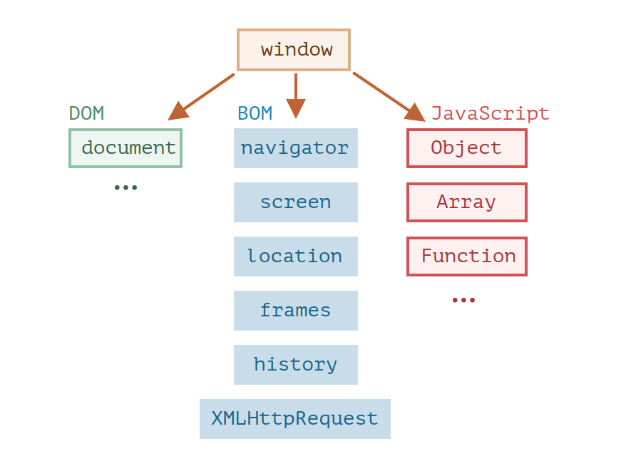

- There’s a “root” object called **window**. It has two roles:

  1. First, it is a `global object` for JavaScript code.

     ```js
     function sayHi() {
       alert('Hello');
     }

     // global functions are methods of the global object:
     window.sayHi();
     // same as
     sayHi();
     ```

  2. Second, it represents the “browser window” and provides methods to control it.

     ```js
     alert(window.innerHeight); // inner window height
     ```

---

## Document Object Model (DOM)

> The Document Object Model represents all page content as objects that can be modified.
>
> - The **document** object is the main “entry point” to the page. We can change or create anything on the page using it.

- `Dom` is not a part of `javascript` language, it is a part of `browser` environment -> `Web API`

### object model

is a group of objects, each of which represent related things from the real world. Together they form a model of something larger.

- **BOM (Browser Object Model)**: contains objects that represent the current `browser window` or `tab`. It contains objects that model things like `browser history` and the `device's screen`.
  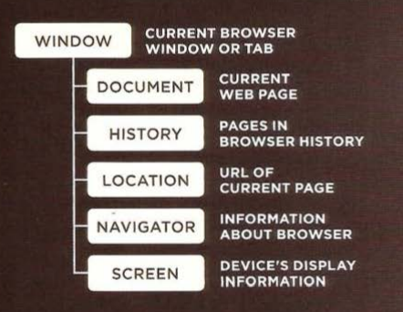

  - `window object` is treated as the default object if nothing is specified. ex: `alert()` is used instead of `window.alert()`

    - this is as if a property or a method is not found, javascript looks it up in the `window` object:
      - ex:
        - `document` property in `document.getElementBy...` instead of `window.document.getElementBy...`
        - `console.log()` method instead of `window.console.log()`

    ```js
    let gLet = 5;
    alert(window.gLet); // undefined (doesn't become a property of the global object)
    ```

    ```js
    // make current user information global, to let all scripts access it
    window.currentUser = {
      name: 'John'
    };

    // somewhere else in code
    alert(currentUser.name); // John

    // or, if we have a local variable with the name "currentUser"
    // get it from window explicitly (safe!)
    alert(window.currentUser.name); // John
    ```

- **DOCUMENT OBJECT MODEL**: uses objects to create a representation of the current page. It creates a new object for each element (and each individual section of text) within the page.
  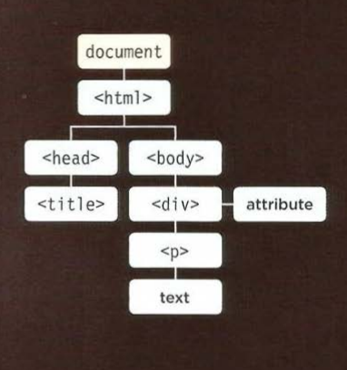

  - specifies how browsers should create a model of an HTML page and how JavaScript can access and update the contents of a web page while it is in the browser window.
  - The DOM is neither part of HTML, nor part of JavaScript; it is a separate set of rules. It is implemented by all major browser makers
  - The DOM is called an object model because the model (the DOM tree) is made of objects.

    - All these objects are accessible using JavaScript, and we can use them to modify the page.
    - The topmost tree nodes are available directly as `document` properties:
    - For example:
      - `<html>` = `document.documentElement`
      - `<body>` = `document.body`
      - `<head>` = `document.head`
    - In the DOM-world, `null` means “doesn’t exist” or “no such node”.

  - **Autocorrection:**

    - If the browser encounters malformed HTML, it automatically corrects it when making the DOM.
    - For instance, the top tag is always `<html>`. Even if it doesn’t exist in the document, it will exist in the DOM, because the browser will create it. The same goes for `<body>`.

  - **Node Types:**

    - Tags become element nodes and form the structure of the DOM tree.
    - There are 12 node types. In practice we usually work with 4 of them:
      - `document` – the “entry point” into DOM.
      - `element nodes` – HTML-tags, the tree building blocks.
      - `text nodes` – contain text.
      - `comments` – sometimes we can put information there, it won’t be shown, but JS can read it from the DOM.
        - If we have a comment-node, labeled as `#comment`, between two text nodes. We may think – why is a comment added to the DOM? It doesn’t affect the visual representation in any way. But there’s a rule -> **"if something’s in HTML, then it also must be in the DOM tree"**.

  - > The DOM an Application Programming Interface (**API**). User interfaces let humans interact with programs; APls let programs (and scripts) talk to each other. The DOM states what your script can "ask the browser about the current page, and how to tell the browser to update what is being shown to the user

- **GLOBAL JAVASCRIPT OBJECTS**: represent things that the JavaScript language needs to create a model of. For example, there is an object that deals only with dates and times.

  - The names of the global objects usually start with a capital letter, e.g., `String`, `Date`, `Math` objects

  - allows us to make `javascript` interact with the browser by creating a model of the page and stores it **in memory**
  - `DOM-Tree` is generated from HTML document which we can interact with

  > WEB BROWSERS ARE PROGRAMS BUILT USING OBJECTS (**window-object** , **document-object**)
  > 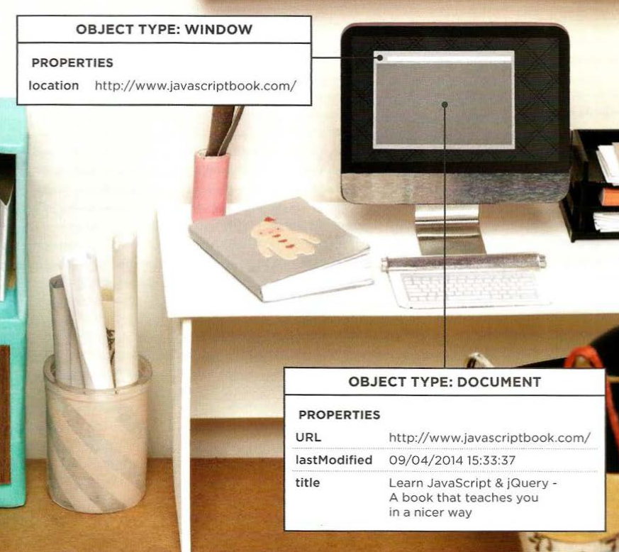
  >
  > - The browser represents each window or tab using a window object. The location property of the window object will tell you the URL of the current page.
  > - The current web page loaded into each window is modelled using a document object.

---

### Steps for creating an element

**DOM manipulation**: refers to using a set of methods and properties to access, create, and update elements and text nodes. (If you have to make a lot of changes to the content of a page, it is slower than `innerHTML`. )

- when we store elements in variables, we're really storing the **location** of the element in the DOM tree in the variable, the properties and methods of that element node work on the variable
  - this saves the browser from looking through the DOM tree to find the same element again. this is known as **caching the selection**

```javascript
//------------------------Create element------------------------//
const element = document.createElement('.div');
message.classList.add('cookie-message');
// or
message.className = 'cookie-message';

//----------------------------Content----------------------------//
message.textContent = 'We use cookied for improved functionality and analytics.';
// or
message.innerHTML =
  'We use cookied for improved functionality and analytics. <button class="btn btn--close-cookie">Got it!</button>';

//---------------inserting element in the document---------------//
header.append(message); // inside the element (will be a its child)
// or
header.insertAdjacentHTML('beforeend', message);
// or
header.before(message); // before the element (will be a its sibling)

//--------------Removing element from the document--------------//
message.remove();
```

- Notes:

  - if you inserted a text-node with `<` or `>` like:

    ```html
    <div id="div"></div>
    <script>
      div.before('<p>Hello</p>', document.createElement('hr'));
    </script>
    ```

  - then the text is inserted “as text”, not “as HTML”, with proper escaping of characters such as `<`, `>`. So the final HTML is:

    ```js
    &lt;p&gt;Hello&lt;/p&gt;
    <hr />
    <div id="div"></div>
    ```

  - if we want to move an element to another place – there’s no need to remove it from the old one.

    - All insertion methods automatically remove the node from the old place.

      ```html
      <div id="first">First</div>
      <div id="second">Second</div>
      <script>
        // no need to call remove
        second.after(first); // take #second and after it insert #first
      </script>
      ```

---

### `insertAdjacentHTML()`

- parses a piece of HTML-string and inserts the resulting nodes into the DOM tree at a specified position same manner as `elem.innerHTML`

  ```js
  elem.insertAdjacentHTML(where, htmlEl);
  ```

  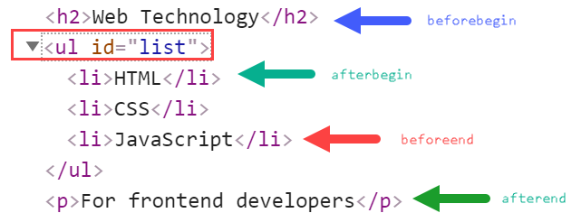

---

### DOM collections: (`HTMLCollection` vs `NodeList`)

- Both interfaces are collections of DOM nodes. They differ in the methods they provide and in the type of nodes they can contain.
  | HTMLCollection | NodeList |
  | ------------------------------------------------------------------------ | ---------------------------------------------------------- |
  | supposed to only contain Element nodes | can contain any node type ( including text nodes ) |
  | HTMLCollection items can be accessed by their `name`, `id`, or `index number`. | NodeList items can only be accessed by their `index number`. |
  | HTMLCollection is always a **live collection**, when your script updates the page, the NodeList is updated at the same time. | NodeList is most often a **static collection**, If the script changes the content of the page, the NodeList is not updated to reflect those changes |
  | `getElementsByClassName()` `getElementsByTagName()` `children` | `querySelectorAll()` `childNodes` |

- **Notes:**

  - It’s iterable -> we can use `for..of` to iterate over it

    - Don’t use `for..in` to loop over collections, as it iterates over all enumerable properties. And collections have some “extra” rarely used properties that we usually do not want to get

  - For **NodeLists**, some Array methods won’t work, because it’s not an array

    - We can use `Array.from` to create a “real” array from the collection, if we want array methods:

      ```js
      alert(Array.from(document.body.childNodes).filter(=> ...)); // function
      ```

  - DOM collections are read-only
    - We can’t replace a child by something else by assigning `childNodes[i] = ....`

---

### Node.cloneNode()

- The `cloneNode()` method creates a copy of a node, and returns the clone.
- The `cloneNode()` method clones all attributes and their values.
- Set the `deep` parameter to `true` if you also want to clone descendants (children).

```javascript
let p = document.getElementById('para1');
let p_prime = p.cloneNode(true);
```

---

### DOM Traversing ( relation between elements )

- Traversing the DOM can be difficult because some browsers add a **text node** whenever they come across **whitespace** between elements.
  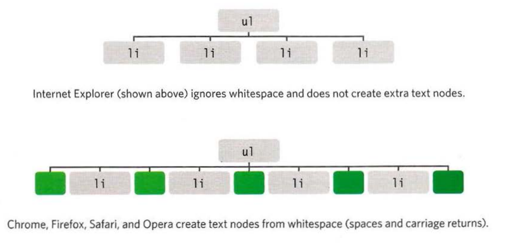

#### Siblings and the parent

```js
// parent of <body> is <html>
alert(document.body.parentNode === document.documentElement); // true

// after <head> goes <body>
alert(document.head.nextSibling); // HTMLBodyElement

// before <body> goes <head>
alert(document.body.previousSibling); // HTMLHeadElement
```

---

#### Element-only navigation (Commonly used) ✅

Navigation properties listed above refer to all nodes. For instance, in childNodes we can see both `text` nodes, `element` nodes, and even `comment` nodes if they exist. But for many tasks we don’t want text or comment nodes. We want to manipulate element nodes that represent tags and form the structure of the page.

- navigation links that only take element nodes into account:

  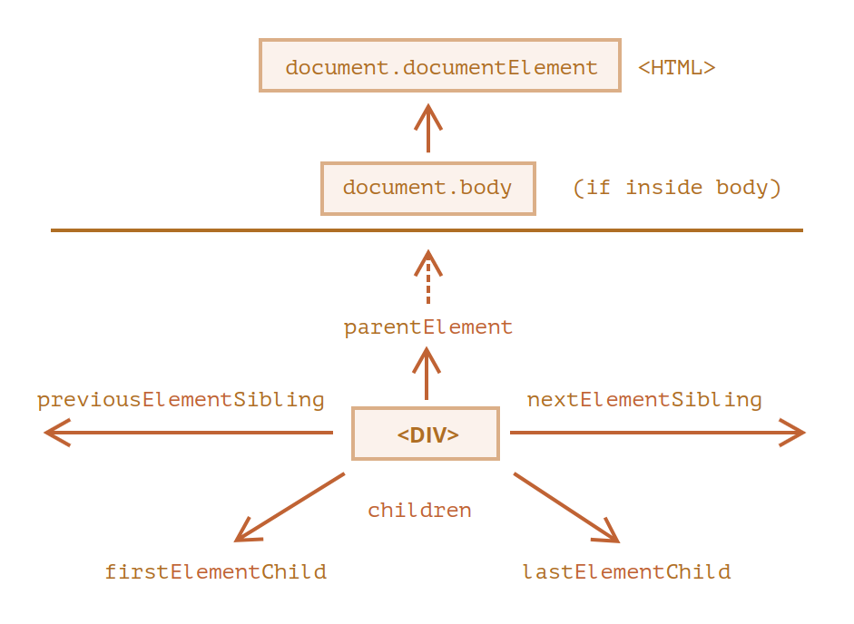

- The `parentElement` property returns the “element” parent, while `parentNode` returns “any node” parent. These properties are usually the same: they both get the parent.
- Questions:

  - Is it true that `elem.lastChild.nextSibling` is always `null`?

    - **Yes**, true. The `element elem.lastChild` is always the last one, it has no `nextSibling`.

  - Is it true that `elem.children[0].previousSibling` is always `null` ?
    - **No**, wrong, because `elem.children[0]` is the first child among elements. But there may exist non-element nodes before it. So `previousSibling` may be a **text node**.

---

### Searching: `getElement(s)By*`, `querySelector*`

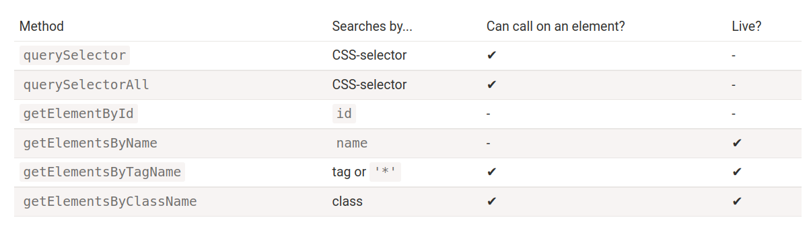

- The `id` must be unique
  - If there are multiple elements with the same `id`, then the behavior of methods that use it is unpredictable, e.g. `document.getElementById()` **may return any of such elements at random**. So please stick to the rule and keep id unique.
- `getElementsBy*` is another method to look for nodes by a `tag`, `class`, etc.
  - Today, they are mostly history (old), as `querySelector` is more powerful and shorter to write.
  - **Note:** Don’t forget the "`s`" letter!
    - The "`s`" letter is absent in `getElementById`, because it returns a single element. But `getElementsByTagName` returns a collection of elements, so there’s "`s`" inside.
- `elem.matches(css)` to check if elem matches the given CSS selector.
- `elem.closest(css)` to look for the nearest **ancestor(parent)** that matches the given CSS-selector. The elem itself is also checked.

---

## Node properties: type, tag and contents

Different DOM nodes may have different properties. For instance, an element node corresponding to tag `<a>` has link-related properties, and the one corresponding to `<input>` has input-related properties and so on. Text nodes are not the same as element nodes. But there are also common properties and methods between all of them, because all classes of DOM nodes form a single hierarchy.

- For DOM elements
  - `console.log(elem)`: shows the element DOM tree
  - `console.log(elem)`: shows the element as a DOM object, good to explore its properties.
  - For instance, if the tag is `<body id="page">`, then the DOM object has `body.id="page"`.

### `innerHTML` vs `innerText`

- `innerHTML`

  - allows to get the HTML inside the element as a string.
  - only valid for element nodes.
    - Other node types, such as text nodes, have their counterpart: `nodeValue` and `data` properties.
  - lets you work with HTML rich text (in HTML format) and doesn't automatically encode and decode text and doesn't apply `css` related to the text (if a word was hidden by css then it won't be included in the innerHTML).
  - "`innerHTML+=`" does a full overwrite

    ```js
    elem.innerHTML += "...";
    // is a shorter way to write:
    elem.innerHTML = elem.innerHTML + ".
    ```

  - > **Scripts don’t execute:** If `innerHTML` inserts a `<script>` tag into the document – it becomes a part of HTML, but doesn’t execute.

- `outerHTML`

  - contains the full HTML of the element. That’s like (innerHTML plus the element itself).
  - unlike `innerHTML`, writing to `outerHTML` does not change the element. Instead, it replaces it in the DOM.

    ```html
    <div>Hello, world!</div>

    <script>
      let div = document.querySelector('div');
      // replace div.outerHTML with <p>...</p>
      div.outerHTML = '<p>A new element</p>'; // here is what happens:
      /*
       1. div was removed from the document.
       2. Another piece of HTML <p>A new element</p> was inserted in its place.
       3. div still has its old value. The new HTML wasn’t saved to any variable.
      */

      alert(div.outerHTML); // <div>Hello, world!</div> (**)
    </script>
    ```

- `innerText` retrieves and sets the content of the tag as plain text with applying `css`
- `textContent` provides access to the text inside the element: only text, **minus all `<tags>`**.
  - In most cases, we expect the text from a user, and want to treat it as text. We don’t want unexpected HTML in our site. An assignment to `textContent` does exactly that.

---

### HTML attributes

In HTML tags may have attributes. The browser recognizes **standard attributes** and creates DOM properties from them.

- when an element has `id` or another **standard attribute**, the corresponding property gets created. But that doesn’t happen if the attribute is **non-standard**.

  - if an attribute is **non-standard**, there won’t be a DOM-property for it.

  ```html
  <body id="test" something="non-standard">
    <script>
      alert(document.body.id); // test
      // non-standard attribute does not yield a property
      alert(document.body.something); // undefined
    </script>
  </body>
  ```

- All attributes (standard and non-standard) are accessible by using the following methods:

  - `elem.hasAttribute(name)`
  - `elem.getAttribute(name)`

    ```html
    <body something="non-standard">
      <script>
        alert(document.body.getAttribute('something')); // non-standard
      </script>
    </body>
    ```

  - `elem.setAttribute(name, value)`
  - `elem.removeAttribute(name)`
  - `elem.attributes` : a collection of objects that belong to a built-in Attr class, with name and value properties.

- HTML attributes have the following features:
  - Their name is case-insensitive (`id` is same as `ID` or `Id`).
  - Their values are always strings.
- Note:
  - **Attributes** – is what’s written in HTML.
  - **Properties** – is what’s in DOM objects.

#### Property-attribute synchronization

When a standard attribute changes, the corresponding property is auto-updated, and (with some exceptions) vice versa.

- for example, `id` is auto updated

  ```js
  let input = document.querySelector('input');

  // attribute => property
  input.setAttribute('id', 'id');
  alert(input.id); // id (updated)

  // property => attribute
  input.id = 'newId';
  alert(input.getAttribute('id')); // newId (updated)
  ```

- But there are exclusions, for instance `input.value` synchronizes only from `attribute → property`, but not back:

  ```js
  let input = document.querySelector('input');

  // attribute => property
  input.setAttribute('value', 'text');
  alert(input.value); // text

  // NOT property => attribute
  input.value = 'newValue';
  alert(input.getAttribute('value')); // text (not updated!)
  ```

---

#### Creating connection with non-standard attributes

Sometimes `non-standard` attributes are used to pass custom data from HTML to JavaScript, or to “mark” HTML-elements for JavaScript.

- Also they can be used to style an element.

  ```html
  <style>
    /* styles rely on the custom attribute "order-state" */
    .order[order-state='new'] {
      color: green;
    }

    .order[order-state='pending'] {
      color: blue;
    }

    .order[order-state='canceled'] {
      color: red;
    }
  </style>

  <div class="order" order-state="new">A new order.</div>
  <div class="order" order-state="pending">A pending order.</div>
  <div class="order" order-state="canceled">A canceled order.</div>
  ```

##### data-\* Attributes

There may be a possible problem with custom attributes. What if we use a non-standard attribute for our purposes and later the standard introduces it and makes it do something? The HTML language is alive, it grows, and more attributes appear to suit the needs of developers. There may be unexpected effects in such case. **To avoid conflicts, there exist `data-*` attributes**.

- All attributes starting with “`data-`” are reserved for programmers’ use. They are available in the `dataset` property.

```html
<body data-about="Elephants">
  <script>
    alert(document.body.dataset.about); // Elephants
  </script>
</body>
```

- MultiWord attributes like `data-order-state` become **camel-cased**: `dataset.orderState`.

---

## Styles and classes

### Element Style

The property `elem.style` is an **object** that corresponds to what’s written in the "`style`" attribute **(inline styles)**.

- For multi-word property the `camelCase` is used:

  ```js
  background-color  => elem.style.backgroundColor
  z-index           => elem.style.zIndex
  border-left-width => elem.style.borderLeftWidth
  ```

- to change a property (css-variable) in the `:root` element

  ```javascript
  document.documentElement.style.setProperty('--color-primary', 'orangered');
  ```

- `style` property is acceptable and used if we calculate coordinates of an element dynamically and want to set them from JavaScript, like this:

  ```js
  let top = /* complex calculations */;
  let left = /* complex calculations */;

  elem.style.left = left; // e.g '123px', calculated at run-time
  elem.style.top = top; // e.g '456px'
  ```

- to add multiple(full) styles (css text block) :

  - This property is rarely used, because such assignment removes all existing styles: it does not add, but replaces them.

  ```javascript
  // we can set special style flags like "important" here
  element.style.cssText = `
    color: red !important;
    background-color: yellow;
    width: 100px;
    text-align: center;
  `;
  // or using (setAttribute)
  element.setAttribute('style', 'color:red; height:50px; ...');
  ```

- **Reading styles values:**

  - we can’t read anything that comes from CSS classes using `elem.style`, because it reflects only the value from the "`style`" attribute, not the effective & computed style.

    ```js
    alert(document.body.style.color); // empty
    ```

  - to read/change style based on previous value of a style property : use `getComputedStyle()`

    ```js
    // getComputedStyle(element, [pseudo])
    let computedStyle = getComputedStyle(document.body);
    alert(computedStyle.marginTop); // 5px
    ```

  - **Computed and resolved values**
    - There are two concepts in CSS:
      - `computed style` value is the value after all CSS rules and CSS inheritance is applied, as the result of the CSS cascade. It can look like height:1em or font-size:125%.
      - `resolved style` value is the one finally applied to the element. Values like 1em or 125% are relative. The browser takes the computed value and makes all units fixed and absolute, for instance: height:20px or font-size:16px. For geometry properties resolved values may have a floating point, like width:50.5px.
        A long time ago getComputedStyle was created to get computed values, but it turned out that resolved values are much more convenient, and the standard changed.

So nowadays getComputedStyle actually returns the resolved value of the property, usually in px for geometry.

- to get a non standard Attribute :

  - Before you work with an attribute, it is good practice to check whether it exists. This will save resources if the attribute cannot be found. -> `.hasAttribute()`

  ```js
  const designer = logo.getAttribute('designer'); // returns the value of the "designer" attribute,
  // also you can set an Attribute
  logo.setAttribute('company', 'Bankist'); //(attribute_name,value)
  ```

---

### Element Classes

#### `className`

- In the ancient time, there was a limitation in JavaScript: a reserved word like "`class`" could not be an object property. That limitation does not exist now, but at that time it was impossible to have a "`class`" property, like `elem.class`.

  - So for classes the property "`className`" was introduced: the `elem.className` corresponds to the "`class`" attribute.

    ```html
    <body class="main page">
      <script>
        alert(document.body.className); // main page
      </script>
    </body>
    ```

- If we assign something to `elem.className`, **it replaces the whole string of classes**. Sometimes that’s what we need, but often we want to add/remove a single class.
  - that is when we use the other property: `classList`

#### `classList`

The `elem.classList` is a **special object** with methods to add/remove/toggle a single class.

```html
<body class="main page">
  <script>
    // add a class
    document.body.classList.add('article');

    alert(document.body.className); // main page article
  </script>
</body>
```

- Methods of `classList`:

  - `elem.classList.add/remove("class")` – adds/removes the class.
  - `elem.classList.toggle("class")` – adds the class if it doesn’t exist, otherwise removes it.
  - `elem.classList.contains("class")` – checks for the given class, returns true/false.

- `classList` is iterable, so we can list all classes with `for..of`, like this:

  ```html
  <body class="main page">
    <script>
      for (let name of document.body.classList) {
        alert(name); // main, and then page
      }
    </script>
  </body>
  ```

---

## Element/Window size and scrolling

### Geometry Properties (element size)

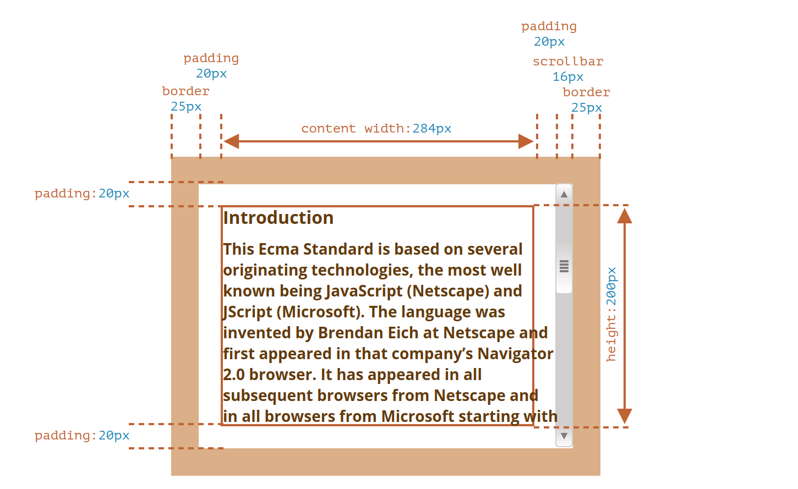
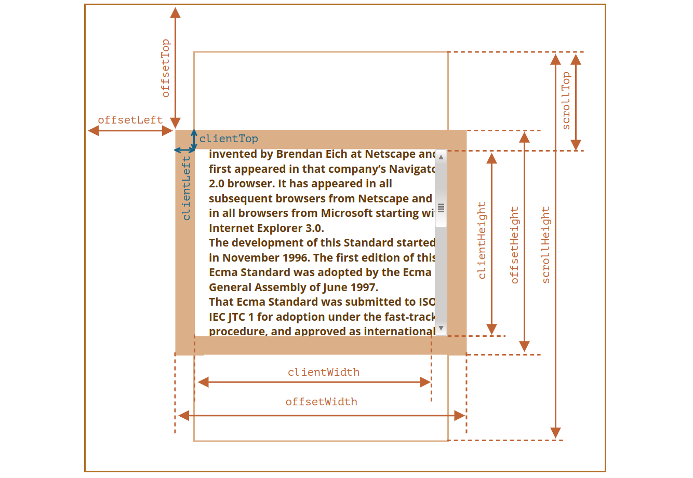

- **offsetParent**

  - Properties `offsetLeft`/`offsetTop` provide x/y coordinates relative to `offsetParent` upper-left corner

    ```html
    <main style="position: relative" id="main">
      <article>
        <div id="example" style="position: absolute; left: 180px; top: 180px">...</div>
      </article>
    </main>
    <script>
      alert(example.offsetParent.id); // main
      alert(example.offsetLeft); // 180 (note: a number, not a string "180px")
      alert(example.offsetTop); // 180
    </script>
    ```

  - There are several occasions when `offsetParent` is `null`:
    - For not shown elements (`display:none` or not in the document).
    - For `<body>` and `<html>`
    - For elements with `position:fixed`

- Geometry properties are `zero`/`null` for elements that are not displayed

  ```js
  function isHidden(elem) {
    return !elem.offsetWidth && !elem.offsetHeight;
  }
  ```

- **clientWidth/Height**

  - These properties provide the size of the area **inside** the element borders. They include the content width together with paddings, but without the scrollbar
    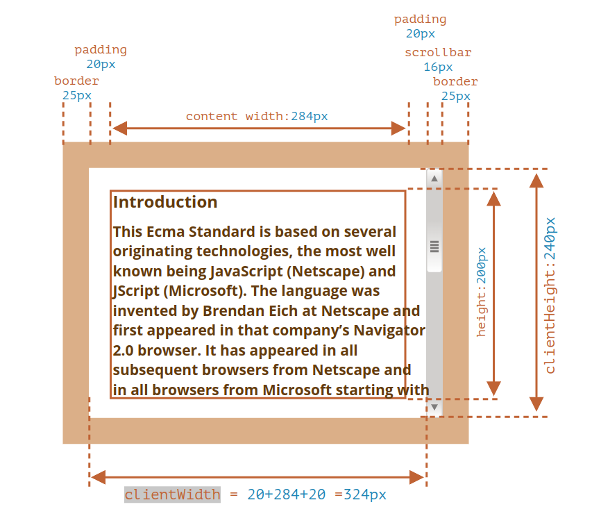
    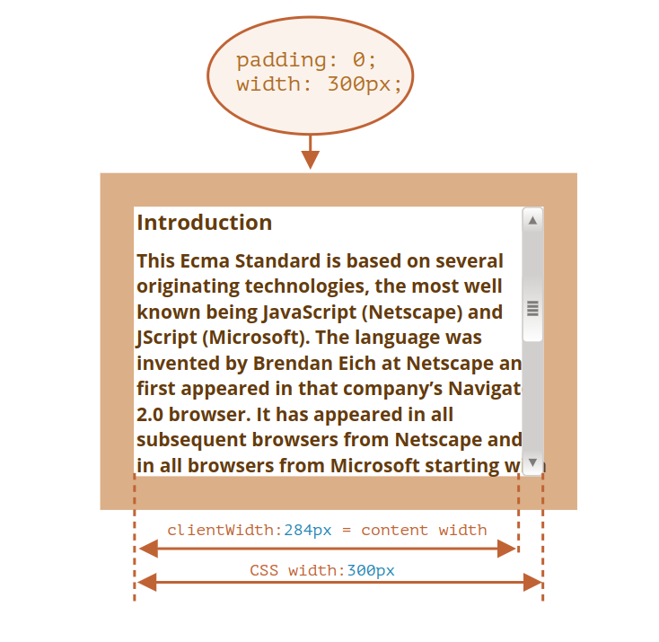

- **scrollWidth/Height**

  - These properties are like clientWidth/clientHeight, but they also include the scrolled out (hidden) parts
    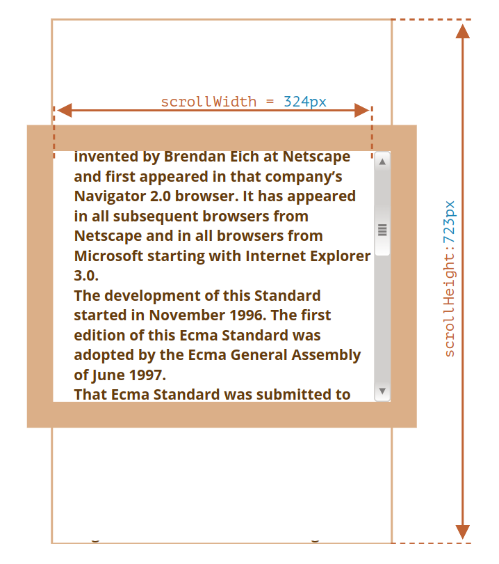
  - We can use these properties to expand the element wide to its full width/height.

    ```js
    // expand the element to the full content height
    element.style.height = `${element.scrollHeight}px`;
    ```

- **scrollLeft/scrollTop**

  - Properties `scrollLeft`/`scrollTop` are the `width`/`height` of the hidden, scrolled out part of the element.
    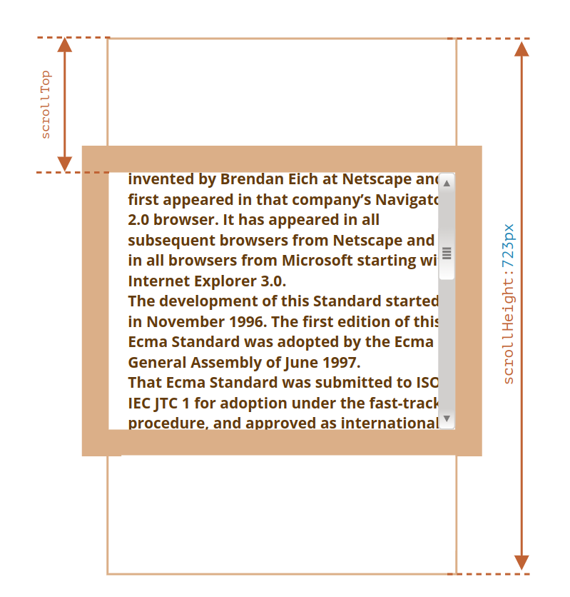
    - In other words, `scrollTop` is “how much is scrolled up”.
  - `scrollLeft`/`scrollTop` can be modified
  - to get size of the bottom scroll:

    ```js
    let scrollBottom = elem.scrollHeight - elem.scrollTop - elem.clientHeight;
    ```

> Note: **Don’t take width/height from CSS**
>
> - as we know. we can read CSS-height and width using `getComputedStyle`. So why not to read the width of an element with `getComputedStyle`?
> - Why should we use geometry properties instead? There are two reasons:
>   - First, CSS width/height depend on another property: **box-sizing** that defines “what is” CSS width and height. A change in box-sizing for CSS purposes may break such JavaScript.
>   - Second, CSS width/height may be **'auto'**, for instance for an inline element:
>   - third, a **scrollbar**. Sometimes the code that works fine without a scrollbar becomes buggy with it, because a scrollbar takes the space from the content in some browsers. So the real width available for the content is less than CSS width. And `clientWidth`/`clientHeight` take that into account.
>     - But with `getComputedStyle(elem).width` the situation is different. Some browsers (e.g. **Chrome**) return the real inner width, minus the scrollbar, and some of them (e.g. **Firefox**) – CSS width (ignore the scrollbar).
>       - That’s because Firefox returns the CSS width and other browsers return the “real” width.
>     - Such cross-browser differences is the reason not to use `getComputedStyle`, but rather rely on **geometry properties**.

---

### Window sizes

- We use the root document element `document.documentElement`, that corresponds to the `<html>` tag to:
  - find the width and height of the browser window
  - get the full width and height of the document
  - scroll the page using JavaScript
- **clientWidth/clientHeight**
  - To get window width and height
    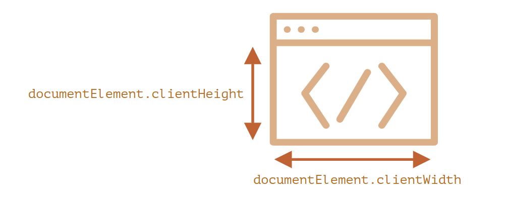
  - If there exists a scrollbar, and it occupies some space, `clientWidth`/`clientHeight` provide the width/height without it (subtract it). In other words, they return the width/height of the visible part of the document, available for the content.
    - > unlike **`window.innerWidth/innerHeight`** which includes the scrollbar.
  - In most cases, we need the available window width in order to draw or position something within scrollbars (if there are any), so we should use **`documentElement.clientHeight/clientWidth`**.
- **Width/height of the document**

  - as the root document element is `document.documentElement`, and it encloses all the content
  - To reliably obtain the full document height, we should take the maximum of these properties:

    ```js
    let scrollHeight = Math.max(
      document.body.scrollHeight,
      document.documentElement.scrollHeight,
      document.body.offsetHeight,
      document.documentElement.offsetHeight,
      document.body.clientHeight,
      document.documentElement.clientHeight
    );

    alert('Full document height, with scrolled out part: ' + scrollHeight);
    ```

- **Get the current scroll**

  - For document scroll, `document.documentElement.scrollLeft/scrollTop` works in most browsers, except older
  - but the scroll is available in the special properties, **`window.pageXOffset/pageYOffset`**:

    ```js
    alert('Current scroll from the top: ' + window.pageYOffset);
    alert('Current scroll from the left: ' + window.pageXOffset);
    ```

  - Also available as `window` properties `scrollX` and `scrollY`
    - `window.pageXOffset` is an alias of `window.scrollX`
    - `window.pageYOffset` is an alias of `window.scrollY`

---

### Coordinates

- Most JavaScript methods deal with one of two coordinate systems:
  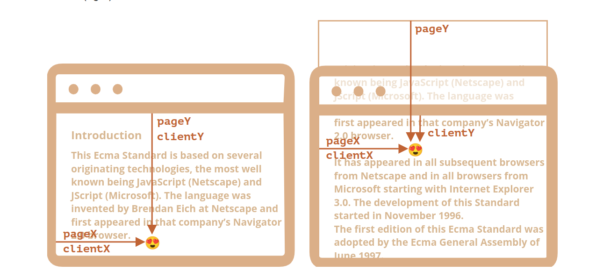

  1. **Relative to the window** – similar to `position:fixed`, calculated from the window top/left edge.
     - we denote these coordinates as `clientX`/`clientY`
  2. **Relative to the document** – similar to `position:absolute` in the document root, calculated from the document top/left edge.
     - we denote them pageX/pageY.

- **Element coordinates: `getBoundingClientRect`**

  - The method `elem.getBoundingClientRect()` returns window coordinates for a minimal rectangle that encloses elem as an object of built-in `DOMRect` class.
  - Main `DOMRect` properties: [x, y, width, height, top, buttom, left, right]
    - If you scroll the page and repeat, you’ll notice that as window-relative element position changes, its window coordinates (y/top/bottom if you scroll vertically) change as well.
    - Coordinates may be decimal fractions, such as 10.5. That’s normal, internally browser uses fractions in calculations. We don’t have to round them when setting to style.`left`/`top`.
    - Coordinates may be negative. For instance, if the page is scrolled so that elem is now above the window, then `elem.getBoundingClientRect().top` is negative.

---

### Scrolling

> **Note**: To scroll the page with JavaScript, its DOM must be fully built ( if we try to scroll the page with a script in `<head>`, it won’t work.)

- Regular elements can be scrolled by changing `scrollTop`/`scrollLeft`. Alternatively, there’s a simpler, universal solution: special methods **window.scrollBy(x,y)** and **window.scrollTo(pageX,pageY)**

  - The method `scrollBy(x,y)` scrolls the page relative to its current position. For instance, `scrollBy(0,10)` scrolls the page 10px down.
  - The method `scrollTo(pageX,pageY)` scrolls the page to absolute coordinates, so that the top-left corner of the visible part has coordinates (pageX, pageY) relative to the document’s top-left corner. It’s like setting `scrollLeft`/`scrollTop`.

- **scrollIntoView**
  - The call to `elem.scrollIntoView(top)` scrolls the page to make elem visible. It has one argument:
    - If `top=true` (that’s the default), then the page will be scrolled to make elem appear on the top of the window. The upper edge of the element will be aligned with the window top.
    - If `top=false`, then the page scrolls to make elem appear at the bottom. The bottom edge of the element will be aligned with the window bottom.
- **Forbid the scrolling**

  - Sometimes we need to make the document “unscrollable”. For instance, when we need to cover the page with a large message requiring immediate attention, and we want the visitor to interact with that message, not with the document.
  - To make the document unscrollable, it’s enough to set `document.body.style.overflow = "hidden"`. The page will “freeze” at its current scroll position.

    ```js
    document.body.style.overflow = 'hidden'; // to prevent scrolling (freezes the scroll)
    document.body.style.overflow = ''; // to enable scrolling (release the scroll)
    ```

  - The drawback of the method is that the scrollbar disappears. If it occupied some space, then that space is now free and the content “jumps” to fill it.
    - That looks a bit odd, but can be worked around if we compare clientWidth before and after the freeze. If it increased (the scrollbar disappeared), then add padding to document.body in place of the scrollbar to keep the content width the same.

---

### intersection observer (Detecting when an element is in the viewport)

[More Info](https://blog.arnellebalane.com/the-intersection-observer-api-d441be0b088d)

- The Intersection Observer API is a Web platform API that allows for **observing changes to how much of a `target` element’s area intersects with that of an ancestor element or the `viewport`**.
  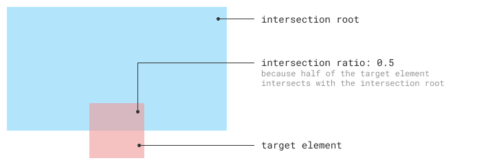

  - The need for such information has a lot of use cases, such as implementing lazy-loading and infinite scrolling !

- By default, the Intersection Observer API uses the viewport as the intersection root, and only executes the callback when the target element enters and exits the viewport.
  
- A `threshold` is a value in which the Intersection Observer will execute the callback function whenever the intersection ratio reaches that value (either as it increases or decreases), and is also expressed as a value between 0 and 1, inclusive.
  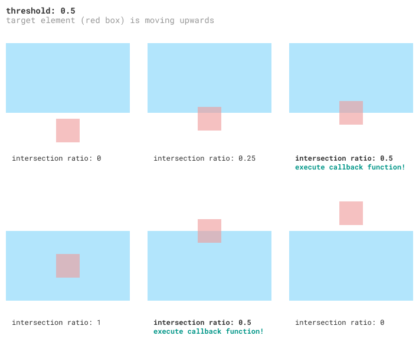
  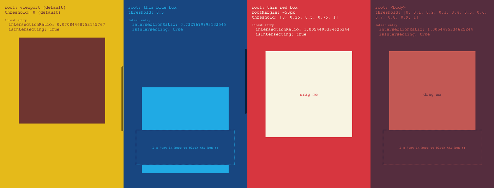

  - It is also possible to set multiple threshold values by passing an array of threshold values

  ```javascript
  const observer = new IntersectionObserver(function (changes) {
    threshold: [0, 0.25, 0.5, 0.75, 1];
  });
  // executes the callback function when the target element enters/exits the intersection root (i.e. intersection ratio of 0), then again when its intersection ratio crosses 0.25, then 0.5, etc.
  ```

```js
const observer = new IntersectionObserver(function (changes) {
  // do something with the changes   });
});

// Use the observer to observe a target element
observer.observe(targetElement);
```

- The `callback function`, when executed, is passed an array of entries, each an instance of `IntersectionObserverEntry`. This is an `array` because the Intersection Observer object can be used to observe multiple target elements
- it is possible to adjust the intersection root’s rectangle by setting `root margin`
- `Example`

  ```javascript
  // Sticky navigation: Intersection Observer API

  const header = document.querySelector('.header');
  const navHeight = nav.getBoundingClientRect().height; // to get the exact height without hard-coding it (instead of writing "-90px")

  // callback function
  const stickyNav = function (entries) {
    const [entry] = entries; // destructuring : same as entry =  entries[0]
    // console.log(entry);
    if (!entry.isIntersecting) nav.classList.add('sticky');
    else nav.classList.remove('sticky');
  };

  const headerObserver = new IntersectionObserver(stickyNav, {
    root: null, // as we are observing the viewport
    threshold: 0, // from intersection ratio
    rootMargin: `-${navHeight}px` //(instead of writing "-90px")
  });

  headerObserver.observe(header);
  ```

- **Lazy Loading Images**

  ```js
  const imgTargets = document.querySelectorAll('img[data-src]');

  const loadImg = function (entries, observer) {
    const [entry] = entries;

    if (!entry.isIntersecting) return; // exit the function if the entry is not intersecting

    // Replace src with data-src
    entry.target.src = entry.target.dataset.src;

    entry.target.addEventListener('load', function () {
      entry.target.classList.remove('lazy-img');
    });

    // stop observing the target element
    observer.unobserve(entry.target);
  };

  const imgObserver = new IntersectionObserver(loadImg, {
    root: null, // as we are observing the viewport
    threshold: 0, // from intersection ratio
    rootMargin: '200px' // to load the image 200px before it appears in the viewport
  });

  imgTargets.forEach(img => imgObserver.observe(img));
  ```

---

## virtual DOM

Virtual DOM is in-memory representation of Real DOM. It is lightweight JavaScript object which is `copy` of Real DOM.

- The `virtual DOM` is a tree based on JavaScript objects created with `React` that resembles a DOM tree. Each time you need to change something in the DOM, `React` employs a different algorithm that exclusively re-renders the DOM nodes that have changed. Meaning, `React` allows developers to write code as if the entire page is rendered on each change while in the underhood `React` ONLY renders sub-components that have actually changed.
- Virtual DOM duty among other things is to abstract real DOM operations we would need to do

### methods to compare nodes

- to compare the (content) of the 2 nodes

  ```js
  node1.isEqualNode(node2); // true/false
  ```

- checking the value (**for textNodes nodes that contains only text and not elements like `<em> or <li>`**) => [nodeValue](https://developer.mozilla.org/en-US/docs/Web/API/Node/nodeValue) is empty or not

  ```js
  node1.firstChild?.nodeValue.trim() !== '';
  ```

> **NOTE**:
> 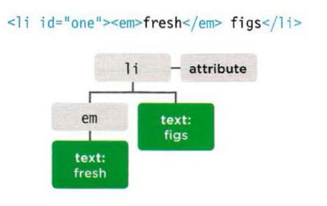
>
> - In order to use **nodeValue** property, you must be on a text node, not the element that contains the text.
> - The **textContent** property allows you to collect or update just the text that is in the containing element (and its children).

### steps

```js
// (1) create a copy of the document(DOM)
let newDOM = document.createRange();
// (2) convert the string(newMarkup) to a real-DOM-object
newDOM = newDOM.createContextualFragment(newMarkup);
// 1,2 in one step =>
const newDOM = document.createRange().createContextualFragment(newMarkup);
// now newDOM is like a big object of (virtual-DOM) that lives in memory NOT tha page

// (5) selecting all elements that lives in our virtual-DOM and converting it to an array so that we can compare it with the real-DOM
const newElements = Array.from(newDOM.querySelectorAll('*'));

// (6) selecting all elements that lives in our real-DOM and converting it to an array so that we can compare it with the virtual-DOM
const curElements = Array.from(this._parentElement.querySelectorAll('*'));

// (7) looping over the 2 arrays at the same time so that we can compare them
newElements.forEach((newEl, i) => {
  const curEl = curElements[i];

  // (8) Updates changed TEXT
  if (
    // comparing the (content) of the 2 nodes
    !newEl.isEqualNode(curEl) &&
    newEl.firstChild?.nodeValue.trim() !== ''
  ) {
    // change the part that differ in the virtual-DOM
    curEl.textContent = newEl.textContent;
  }

  // (9) Updates changed Attributes
  if (!newEl.isEqualNode(curEl))
    Array.from(newEl.attributes).forEach(attr => curEl.setAttribute(attr.name, attr.value));
});
```

---

## Events

An event is a signal that something has happened. All DOM nodes generate such signals (but events are not limited to DOM).

- Here’s a list of the most useful DOM events:
  - **Mouse events**
    - `click` – when the mouse clicks on an element (touchscreen devices generate it on a tap).
    - `contextmenu` – when the mouse right-clicks on an element
    - `mouseover` / `mouseout` – when the mouse cursor comes over / leaves an element.
    - `mousedown` / `mouseup` – when the mouse button is pressed / released over an element.
    - `mousemove` – when the mouse is moved.
  - **Keyboard events**
    - `keydown` and `keyup` – when a keyboard key is pressed and released.
  - **Form element events**
    - `submit` – when the visitor submits a `<form>`.
    - `focus` – when the visitor focuses on an element, e.g. on an `<input>`.
  - **Document events**
    - `DOMContentLoaded` – when the HTML is loaded and processed, DOM is fully built.
  - **CSS events**
    - `transitionend` – when a CSS-animation finishes.

### Event Handling

- **binding event to a DOM node**: Indicate which event on the selected node(s) will trigger the response.
- There are 3 ways to assign event handlers:
  1. HTML attribute: `onclick="..."`
  2. DOM property: `elem.onclick = function`
  3. Methods: `elem.addEventListener(event, handler[, phase])` to add, removeEventListener to remove ✅

#### HTML EVENT HANDLERS (HTML-attribute) (bad practice ❌)

```html
<input type="button" id="button" onclick="sayThanks()" />
```

- here we add parentheses `()` for the handler method

  - The difference is easy to explain. When the browser reads the attribute, it creates a handler function with body from the attribute content. So the markup generates this property:

    ```js
    button.onclick = function (event) {
      sayThanks(); // <-- the attribute content goes here
    };
    ```

- This method of event handling is **no longer used** because it is better to separate the JavaScript from the HTML.
- as we know, HTML attribute names are not case-sensitive, so "ONCLICK" works as well as "onClick" and "onCLICK" But usually attributes are lowercased: "onclick".
- Don’t use `setAttribute()` for handlers. - because attributes are always strings, handler-function becomes a string

#### TRADITIONAL DOM EVENT HANDLERS (in Js for a DOM property ❌)

- The main drawback is that you can only attach a single function to any event
- here, we omit the parentheses
- here, Assign a handler to `elem.onclick`, not `elem.ONCLICK`, because DOM properties are case-sensitive.

  ```js
  el.onblur = checkUsername; // the parentheses are omitted
  ```

#### DOM LEVEL EVENT LISTENERS (addEventListener) ✅

- They **can deal with more than one function at a time**, but they are not supported in older browsers.
- Also, here we can use `removeEventListener` to remove a handler. unlike the other 2 methods

- syntax:

  ```js
  element.addEventListener(event, handler, [options]);
  ```

  - `options`: An additional optional object with properties:

    - `once`: if true, then the listener is automatically removed after it triggers.
    - `capture`: the phase where to handle the event (Bubbling and capturing). For historical reasons, options can also be false/true, that’s the same as {capture: false/true}.
    - `passive`: if true, then the handler will not call `preventDefault`

- `this` in callbacks refers to the selected element in the event but => `this` doesn't work like that if you used an `arrow function`, and if so, you should use `.bind()`

- To remove a handler:

  ```js
  elem.onclick = null;
  element.removeEventListener(event, handler, [options]);
  ```

  - **To remove a handler we should pass exactly the same function as was assigned.**

    ```js
    // ------ This won't work ------ //
    elem.addEventListener('click', () => alert('Thanks!'));
    // ....
    elem.removeEventListener('click', () => alert('Thanks!'));

    // ------ This will ------ //
    function handler() {
      alert('Thanks!');
    }
    input.addEventListener('click', handler);
    // ....
    input.removeEventListener('click', handler);
    ```

- `addEventListener()` vs `onclick()`

  | addEventListener                                                                                       | onclick                                                                                     |
  | ------------------------------------------------------------------------------------------------------ | ------------------------------------------------------------------------------------------- |
  | addEventListener can add multiple events to a particular element.                                      | can add only a single event to an element. It is basically a property, so gets overwritten. |
  | addEventListener can take a third argument that can control the event propagation.                     | Event propagation cannot be controlled by onclick.                                          |
  | addEventListener can only be added within `<script>` elements or in external JavaScript file.          | onclick can be added as an HTML attribute also.                                             |
  | addEventListener does not work in older versions of Internet explorer, which uses attachEvent instead. | onclick works in all browsers.                                                              |
  | addEventListener can do multiple things when event is triggered                                        | onclick can only do one task when event is triggered                                        |
  | can be on an element that doesn't exist yet (ex : `event.target`)                                      | can't do that                                                                               |

- to make a callback function listen to more that one event :

  ```js
  ['click', 'load'].forEach(event => window.addEventListener(event, callback_function));
  ```

- with event handlers and listeners, you wrap the function call (with the arguments) in an **anonymous function**.

---

#### The `Event` object

When an event occurs, the event object tells you information about the event, and the element it happened upon.

- Every time an event fires, the The event object is passed to event object contains helpful any function that is the event data about the event, such as:
  - `Which element the event happened on`
  - `Which key was pressed for a keypress event`
  - `What part of the viewport the user clicked`
    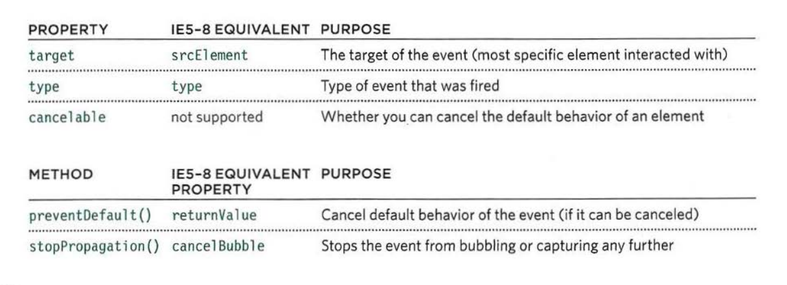
- **`event.currentTarget`**: Element that handled the event. That’s exactly the same as `this` keyword in the handler-function, unless the handler is an arrow function, or its `this` is bound to something else, then we can get the element from `event.currentTarget`

  ```js
  // this is the same as event.currentTarget
  elem.addEventListener('click', function (event) {
    alert(this === event.currentTarget); // true
    alert(this); // HTMLElement (the same as event.currentTarget)
  });
  ```

- **`event.target` vs (`this` | `event.currentTarget`)**:

  - `event.target`: is the “target” element that **initiated** the event, it doesn’t change through the bubbling process.

    - identifies the element on which the event occurred

      ```js
      navEl.addEventListener('click', function (e) {
        console.log(e.target); // the element that was clicked
        console.log(e.currentTarget); // the element that the event listener is attached to -> navEl
      });
      ```

  - `this` or `event.currentTarget`: is the **“current”** element, the one that has a currently running handler on it.
    - always refers to the element to which the event handler has been attached to
  - ex:

    ```js
    form.onclick;
    // this-keyword (=event.currentTarget) is the <form> element, because the handler runs on it.
    // event.target is the actual element inside the form that was clicked.
    ```

- the event-object is passed to any function that is the event handler or listener as an argument
  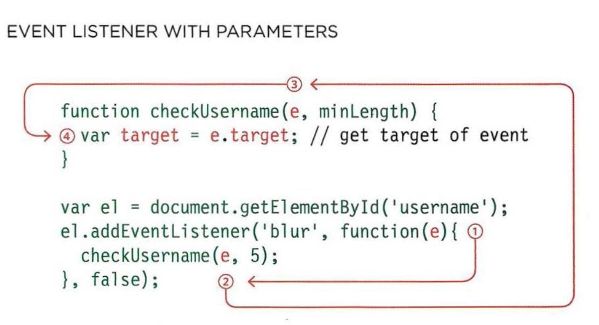

---

### Event Flow (Bubbling and capturing)

HTML elements nest inside each other elements. if you hover or click on a link, you will also be hovering or clicking on its parent elements.

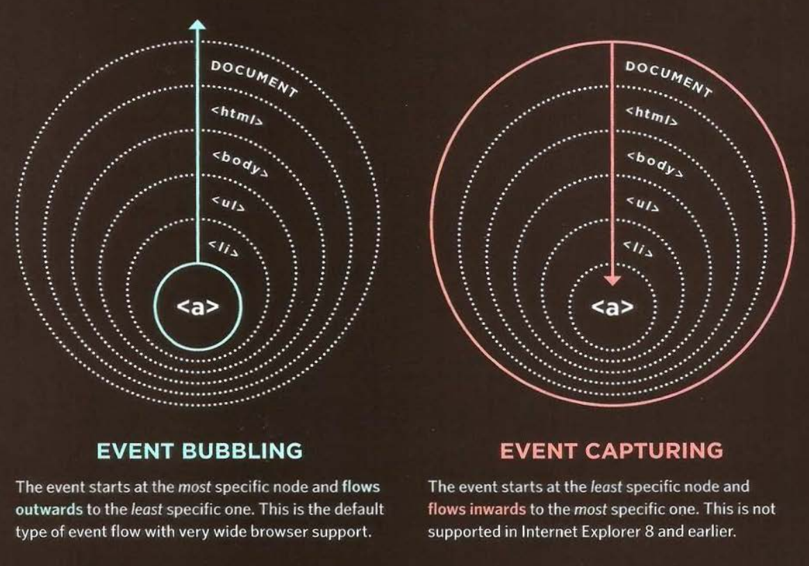

Event handlers/listeners can be bound to the containing `<li>`, `<ul>`, `<body>` and `<html>` elements, plus the document object and the window object. **The order in which the events fire is known as "event flow"**

- the flow of events only matters when your code has event handlers on an element and one of its ancestor or descendant elements
- events flow in 2 directions: Bubbling & Capturing

#### Event Bubbling

- When an event happens on an element, it first runs the handlers on it, then on its parent, then all the way up on other ancestors.
- Ex: clicking on `<p>` will alert `"p"` then `"div"` then `"form"`

  ```html
  <form onclick="alert('form')">
    FORM
    <div onclick="alert('div')">
      DIV
      <p onclick="alert('p')">P</p>
    </div>
  </form>
  ```

- Almost all events bubble, For instance, a `focus` event does not bubble.

##### Stopping Bubbling

A bubbling event goes from the target element straight up. Normally, calling all handlers on the path. But any handler may decide that the event has been fully processed and stop the bubbling. -> **`event.stopPropagation()`**

```html
<!-- here body.onclick doesn’t work if you click on <button> -->
<body onclick="alert(`the bubbling doesn't reach here`)">
  <button onclick="event.stopPropagation()">Click me</button>
</body>
```

> `"Propagation"` means jumping from one element to another, visiting parents and ancestors.

- `event.stopPropagation()` stops the move upwards, but on the current element all other handlers will run.
- `event.stopImmediatePropagation()` To stop the bubbling and prevent handlers on the current element from running.
- Cases when not to stop bubbling?
  - We create a nested menu. Each submenu handles clicks on its elements and calls `stopPropagation` so that the outer menu won’t trigger.
  - catching clicks on the whole window, to track users’ behavior (where people click). Some analytic systems do that. Usually the code uses `document.addEventListener('click'…)` to catch all clicks.
    - analytic won’t work over the area where clicks are stopped by stopPropagation

---

#### Event Capturing

> It is rarely used in real code, but sometimes can be useful.

- The standard DOM Events describes 3 phases of event propagation:

  1. Capturing phase – the event goes down to the element.
  2. Target phase – the event reached the target element.
  3. Bubbling phase – the event bubbles up from the element.
     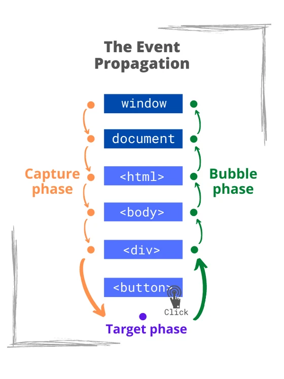

- the final parameter in the `addEventListener()` method lets you choose the direction to trigger events

  - `true` -> capturing phase
  - `false` -> bubbling phase (default value)

  ```js
  elem.addEventListener(..., {capture: true})
  // or, just "true" is an alias to {capture: true}
  elem.addEventListener(..., true)
  ```

- The `event.stopPropagation()` during the capturing also prevents the bubbling

---

#### Event Delegation

Capturing and bubbling allow us to implement one of the most powerful event handling patterns called event delegation.

> Creating event listeners for a lot of elements can slow down a page, but event flow allows you to listen for an event on a parent element.

The idea is that if we have a lot of elements handled in a similar way, then instead of assigning a handler to each of them – we put a single handler on their common ancestor (parent).

- In the handler we get `event.target` to see where the event actually happened and handle it.
- like that we are **delegating** the job of the event listener to a parent of the elements.
- **Advantages:**

  - Simplifies initialization and saves memory: no need to add many handlers.
    - used to `prevent` event listener to create a lot of callback functions listening to all the items in `forEach`, so we use `event.target` as it shows **where the event happened**
    - This will improve performance because we only need one event listener instead of multiple event listeners.
  - Less code: when adding or removing elements, no need to add/remove handlers.
  - DOM modifications: we can mass add/remove elements with innerHTML and the like.

- **limitations:**
  - the event must be bubbling. Some events do not bubble. Also, low-level handlers should not use `event.stopPropagation()`
  - the delegation may add CPU load, because the container-level handler reacts on events in any place of the container, no matter whether they interest us or not. But usually the load is negligible, so we don’t take it into account.
- **Steps:**

  1. Add event listener to common parent element
  2. Determine what element originated the event => `e.target`
  3. if the element has children inside it => use `.closest(element)` to prevent wrong selection

     - The method `elem.closest(selector)` returns the nearest ancestor that matches the selector.

  ```javascript
  tabsContainer.addEventListener('click', function (e) {
    const clickedElement = e.target.closest('.operations__tab'); // goes up from the element and checks each of parents. If it matches the selector, then the search stops, and the ancestor is returned.
    // Don't use `e.target.parentElement`

    // Guard clause (as if you clicked on other than '.operations__tab' element )
    if (!clickedElement) return;
    }
  ```

##### `data` attribute with Event Delegation

You can use the `data-` attribute to distinguish the element with a category in order to do specific things for each category:

```html
Counter:
<input type="button" value="1" data-counter />
One more counter:
<input type="button" value="2" data-counter />

<script>
  document.addEventListener('click', function (event) {
    if (event.target.dataset.counter != undefined) {
      // if the attribute exists...increment the value on each click
      event.target.value++;
    }
  });
</script>
```

> **Note:** For **document**-level handlers – always `document.addEventListener` not `document.on<event>`, because the latter will cause conflicts: new handlers overwrite old ones.

---

### Browser Default Actions

Many events automatically lead to certain actions performed by the browser.

- ex:
  - A click on a link – initiates navigation to its URL.
  - A click on a form submit button – initiates its submission to the server.
  - Pressing a mouse button over a text and moving it – selects the text.

#### Preventing browser actions

There are two ways to tell the browser we don’t want it to act:

1. The main way is to use the `event` object. There’s a method `event.preventDefault()`.

   ```html
   <!-- Prevent going to href link -->
   <a href="/" onclick="event.preventDefault()">here</a>
   ```

2. If the handler is assigned using `on<event>` (not by `addEventListener`), then returning `false` also works the same.

   - The value returned by an event handler is usually ignored.

   - The only exception is `return false` from a handler assigned using `on<event>`.

   ```html
   <a href="/" onclick="return false">Click here</a>
   ```

   ```js
   // or
   menu.onclick = function (event) {
     if (event.target.nodeName != 'A') return;

     let href = event.target.getAttribute('href');
     alert(href); // ...can be loading from the server, UI generation etc

     return false; // prevent browser action (don't go to the URL)
   };
   ```

- Certain events flow one into another. If we prevent the first event, there will be no second.
  - For instance, `mousedown` on an `<input>` field leads to focusing in it, and the focus event. If we prevent the `mousedown` event, there’s no focus.
- when using event propagation and want to do a `event.preventDefault()` on multiple levels, you can first check if the event was already prevented using the property `defaultPrevented`

  ```html
  <p>Right-click for the document menu (added a check for event.defaultPrevented)</p>
  <button id="elem">Right-click for the button menu</button>

  <script>
    elem.oncontextmenu = function (event) {
      event.preventDefault();
      alert('Button context menu');
    };

    document.oncontextmenu = function (event) {
      if (event.defaultPrevented) return;

      event.preventDefault();
      alert('Document context menu');
    };
  </script>
  ```

- **Note:** The `“passive”` handler option
  - The optional `passive: true` option of `addEventListener` signals the browser that the handler is not going to call `preventDefault()`
  - Why might that be needed?
    - There are some events like **touchmove** on mobile devices (when the user moves their finger across the screen), that cause scrolling by default, but that scrolling can be prevented using `preventDefault()` in the handler.
    - So when the browser detects such event, it has first to process all handlers, and then if `preventDefault` is not called anywhere, it can proceed with scrolling. That may cause unnecessary **delays** and “jitters” in the UI.
    - The `passive: true` options tells the browser that the handler is not going to cancel scrolling. Then browser scrolls immediately providing a maximally fluent experience, and the event is handled by the way.

---

### Dispatching custom events

We can generate not only completely new events, that we invent for our own purposes, but also built-in ones, such as `click`, `mousedown` etc. That may be helpful for automated testing.

#### Event constructor

```js
let event = new Event(type[, options]);
```

- Arguments:
  - `type` – event type, a string like "click" or our own like "my-event".
  - `options` – the object with two optional properties:
    - `bubbles`: true/false – if true, then the event bubbles.
    - `cancelable`: true/false – if true, then the “default action” may be prevented.
  - By default both are false: {bubbles: false, cancelable: false}.
- After an event object is created, we should “run” it on an element using the call `elem.dispatchEvent(event)`

> The property **`event.isTrusted`** is true for events that come from real user actions and false for script-generated events.

- **Notes:**
  - We should use `addEventListener` for our custom events, because `on<event>` only exists for built-in events, `document.onhello` doesn’t work.
  - Must set `bubbles:true`, otherwise the event won’t bubble up.

---

### UI Events

- Here’s a short list of classes for UI Events:
  - **`UIEvent`**
  - **`FocusEvent`**
  - **`MouseEvent`**
  - **`WheelEvent`**
  - **`KeyboardEvent`**
  - **`CustomEvent`**
- We should use them instead of `new Event` if we want to create such events. For instance, `new MouseEvent("click")`
- they cover most important user interface events and how to work with them.

More reference and info about (mouse events, drag & drop, pointer events, keyboard, scrolling event) here [javascript.info/event-details](https://javascript.info/event-details)

---

### Events Notes

- The `mousedown` and `mouseup` events separate out the press and release of a mouse button. They are commonly used for adding **drag and drop functionality**, or to add controls in game development.
- the **event** object can tell you where the cursor was positioned when an event was triggered
  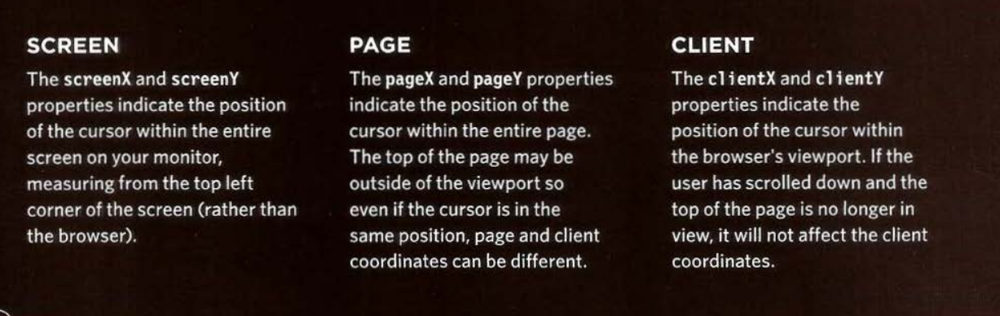
  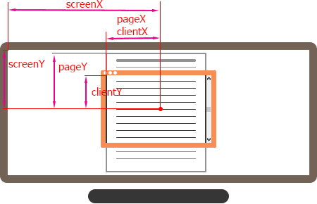

---

## Storage

- `local storage` : always stays
- `session storage` : gets closed when window or tab are closed

---
