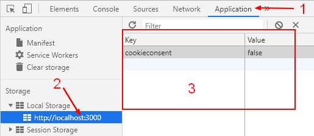
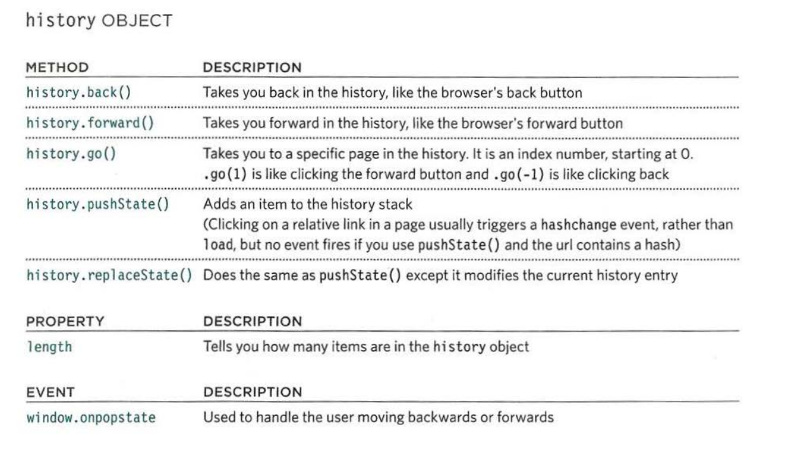

# INDEX

- [INDEX](#index)
  - [Notes](#notes)
  - [APIs Resources](#apis-resources)
  - [HTML5 APIs](#html5-apis)
  - [Geolocation API](#geolocation-api)
  - [Leaflet API](#leaflet-api)
    - [installation](#installation)
    - [code](#code)
  - [JSON](#json)
    - [JSON Methods](#json-methods)
  - [Local Storage](#local-storage)
  - [Session storage](#session-storage)
  - [History API](#history-api)
    - [History Object](#history-object)

---

## Notes

- if you are using hosted version of an Api => don't forget to put `defer` in the `<script>` part of it in the HTML `<head>`
- **API key** is a set of letters and numbers that uniquely identify you to the application so the owners of the site can track how much you use the API and what you use it for.

---

## APIs Resources

- [puplic-Api repo](https://github.com/public-apis/public-apis)

---

## HTML5 APIs

a set of APls define that describe how to interact with features of web browsers.

- each of the HTML5 APIs focuses on one or more objects that browsers implement to deliver specific functionality

| API            | Description                                                         |
| -------------- | ------------------------------------------------------------------- | -------------- |
| geolocation    | How to tell where the user is located                               |
| local Storage  | Store information in the browser (even when user closes tab/window) | sessionStorage |
| sessionStorage | Store information in the browser while a **tab/window** is open     |
| history        | How to access items from the browser's history                      |

---

## Geolocation API

- [documentation](https://developer.mozilla.org/en-US/docs/Web/API/Geolocation_API/Using_the_Geolocation_API#examples)
- The Geolocation API allows the user to provide their location to web applications if they so desire. For privacy reasons, the user is asked for permission to report location information.
- retrieve a user's location information in your web app, for example to plot their location on a map, or display personalized information relevant to their location.
- The developer can now access this location information in a couple of different ways:
  - `Geolocation.getCurrentPosition()`: Retrieves the device's current location.
  - `Geolocation.watchPosition()`: Registers a handler function that will be called automatically each time the position of the device changes, returning the updated location.
- In both cases, the method call takes up to three arguments:
  - A **mandatory** `success callback`: If the location retrieval is successful, the callback executes with a `GeolocationPosition` object as its only parameter, providing access to the location data.
  - An **optional** `error callback`: If the location retrieval is unsuccessful, the callback executes with a `GeolocationPositionError` object as its only parameter, providing access information on what went wrong.
  - **optional** object which provides options for retrieval of the position data.

```javascript
// getCurrentPosition{success, fail)

navigator.geolocation.getCurrentPosition(
  function (position) {
    console.log(position);

    const { latitude } = position.coords;
    const { longitude } = position.coords;
    // console.log(`https://www.google.pt/maps/@${latitude},${longitude}`);
  },
  function () {
    alert('Could not get your position');
  }
);
```

---

## Leaflet API

- [documentation](https://leafletjs.com/SlavaUkraini/)
- it's a library for mobile-friendly interactive `maps`

### installation

- go to [download](https://leafletjs.com/SlavaUkraini/download.html) page and choose to ues hosted version or `NPM`
- go to [tutorial](https://leafletjs.com/SlavaUkraini/examples.html) page and follow the steps

### code

```javascript
// map from (L) object
map = L.map('map').setView(coords, zoomLevel);
// setView method takes 2 parameters :
// 1. coords => array of [latitude, longitude]
// 2. zoomLevel => number of how much to set the zoom of the view

L.tileLayer('https://{s}.tile.openstreetmap.fr/hot/{z}/{x}/{y}.png', {
  attribution:
    '&copy; <a href="https://www.openstreetmap.org/copyright">OpenStreetMap</a> contributors'
}).addTo(map);
// the href can be change for different looks of the map

// see (marker) on the documentation

// Handling clicks on map
map.on('click', callbackFunction);
```

---

## JSON

So it’s easy to use JSON for data exchange when the client uses JavaScript and the server is written on `Ruby`/`PHP`/`Java`/Whatever.

- **JSON** does not support comments. Adding a comment to JSON makes it invalid.
  - There’s another format named [JSON5](http://json5.org/), which allows unquoted keys, comments etc. But this is a standalone library, not in the specification of the language.

---

### JSON Methods

- `JSON.stringify` to convert objects into JSON.
  - The resulting json string is called a **JSON-encoded or serialized or stringified or marshalled object**. We are ready to send it over the wire or put into a plain data store.
  - this method has other parameters other than the object value
    - `JSON.stringify(value, replacer, spaceIndents)`
- `JSON.parse` to convert JSON back into an object (decode a JSON-string).

  - `JSON.parse(str, [reviver])`

    - `reviver`: is an Optional function(key,value) that will be called for each (key, value) pair and can transform the value.

    ```js
    let str = '{"title":"Conference","date":"2017-11-30T12:00:00.000Z"}';

    let meetup = JSON.parse(str, function (key, value) {
      if (key == 'date') return new Date(value);
      return value;
    });
    ```

---

## Local Storage

- The `localStorage` read-only property of the `window` interface allows you to access a `Storage` object for the Document's origin; the stored data is saved across browser sessions. 
- The keys and the values stored with localStorage are always in the `UTF-16 DOMString format`, which uses two bytes per character. As with objects, integer keys are automatically converted to strings.
  - So to store the data structure correctly in localStorage, store it as a **JSON-strings** with `JSON.stringify()`
- localStorage is `Blocking`, so it can slow down the app
- _note_ : when you `get` items from `localStorage`, they lose the `prototype Chain` they had
- **1oca1Storage** is best suited to information that:
  - Only changes at set intervals (such as timetables / price lists), which can be helpful to store offline.
  - The user might want to come back and use again (such as saving preferences / settings).

```javascript
// ---------------add data item to localStorage //object--------------- //
localStorage.setItem('myCat', 'Tom');

// ---------------reading the localStorage item--------------- //
const cat = localStorage.getItem('myCat');

// ---------------Number of items stored--------------- //
const itemsNum = localStorage.length;

// ---------------removing the localStorage item--------------- //
localStorage.removeItem('myCat');

// ---------------removing all the localStorage //items--------------- //
localStorage.clear();

/////////////////////////////////////////////////
// if value is not a string (here (workouts) is an array) => convert it using ( JSON.stringify() )
localStorage.setItem('workouts', JSON.stringify(workouts));
// then to read the item => use ( JSON.parse() )
const data = JSON.parse(localStorage.getItem('workouts'));
```

---

## Session storage

**sessionStorage** is more suited to information that:

- Changes frequently (each time the user visits the site - such as whether they are logged in or location data).
- Is personal and should not be viewed by other users of the device.

---

## History API

If you move from one page to another, the browser's history remembers which pages you visited. But Ajax applications do not load new pages, so they can use the hi story API to update the location bar and history.

- Because the history object is a child of the window object, you can use its name directly in the script; you can write `history. pushState()`, you do not need to write `window.history.pushState()`.

  ```js
  history.pushState(state, title, url);
  ```

### History Object

The HTML5 history API describes the functionality of the history object in modern web browsers. It lets you access and update the browser history (but only for pages the user visited on your site).


