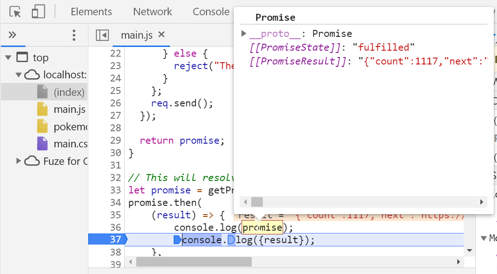
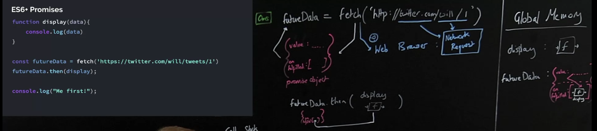

## INDEX

- [INDEX](#index)
- [Notes](#notes)
- [Is JavaScript a `synchronous` or `asynchronous` ?](#is-javascript-a-synchronous-or-asynchronous-)
- [Building a Promise](#building-a-promise)
  - [creating a promise](#creating-a-promise)
  - [Promisifying](#promisifying)
  - [resolve /reject a promise](#resolve-reject-a-promise)
- [consume promise : (Old Way)](#consume-promise--old-way)
  - [AJAX Call : `XMLHttpRequest`](#ajax-call--xmlhttprequest)
  - [Callback Hell](#callback-hell)
- [consume promise : (Modern Way)](#consume-promise--modern-way)
  - [Promises / Fetch API](#promises--fetch-api)
  - [Handling Rejected Promises (2 ways)](#handling-rejected-promises-2-ways)
    - [handling uncaught error](#handling-uncaught-error)
    - [1. Pass a second callback function in `.then()` method](#1-pass-a-second-callback-function-in-then-method)
    - [2. using `.catch()` at the end of the promise chain](#2-using-catch-at-the-end-of-the-promise-chain)
  - [`finally` method](#finally-method)
- [consume promise (ES7)](#consume-promise-es7)
  - [Consuming Promises with Async/Await](#consuming-promises-with-asyncawait)
  - [Error Handling With try...catch](#error-handling-with-trycatch)
- [Sequence promises vs Parallel promises](#sequence-promises-vs-parallel-promises)
  - [Sequence promises](#sequence-promises)
  - [Parallel promises methods](#parallel-promises-methods)
    - [`Promise.all()`](#promiseall)
  - [`Promise.any()`](#promiseany)
  - [`Promise.race()`](#promiserace)
  - [`Promise.allSettled()`](#promiseallsettled)

---

## Notes

- if you are using hosted version of an Api => don't forget to put `defer` in the `<script>` part of it in the HTML `<head>`
- in `event loop` :
  - `callback functions` that are coming from **promises** go to **microTasks queue** not the `callback queue`.
  - **microTasks queue** has priority over **callback queue** in `event loop`

---

## Is JavaScript a `synchronous` or `asynchronous` ?

- JavaScript is always `synchronous` and `single-threaded`
- **but** when `js` runs on certain environments like `browser` or `node.js` --> it allows us to write `asynchronous functionality` like `setTimeOut()` which is not from `javascript` but it's from `window / global` object

> **Async** means that "we don't have it right now"

---

## Building a Promise

- when you create a new promise you put an `execution function` which takes `2` callback functions `(resolve, reject)` as parameters
  - what is returned from `(resolve, reject)` functions will be the fulfilled / rejected value that we handle them using `.then() / .catch()`

### creating a promise

```javascript
// creating the promise
const lotteryPromise = new Promise(function (resolve, reject) {
  console.log('Lotter draw is happening 🔮');
  setTimeout(function () {
    if (Math.random() >= 0.5) {
      resolve('You WIN 💰');
    } else {
      reject(new Error('You lost your money 💩'));
    }
  }, 2000);
});

// using the promise
lotteryPromise.then((res) => console.log(res)).catch((err) => console.error(err));
```

### Promisifying

```javascript
// Promisifying an API (Geolocation API)
const getPosition = function () {
  return new Promise(function (resolve, reject) {
    // navigator.geolocation.getCurrentPosition(
    //   position => resolve(position),
    //   err => reject(err)
    // );
    // or
    navigator.geolocation.getCurrentPosition(resolve, reject);
  });
};
getPosition().then((pos) => console.log(pos));
```

### resolve /reject a promise

```javascript
// immediatly resolve /reject a promise using thees methods from (promise) object
Promise.resolve('abc').then(x => console.log(x));
Promise.reject(new Error('Problem!')).catch(x => console.error(x)
```

---

## consume promise : (Old Way)

### AJAX Call : `XMLHttpRequest`

```javascript
const getCountryData = function (country) {
  const request = new XMLHttpRequest();
  request.open('GET', `https://restcountries.eu/rest/v2/name/${country}`);
  // (method-type, string containing the URL)
  request.send();
  // we can't do this : const data = request.send();  because the results arn't there yet and we have to wait for it

  // instead we add eventListener on it for when it (loads)
  request.addEventListener('load', function () {
    const [data] = JSON.parse(this.responseText);
    // THEN => use the data object to get what you want in its properties
  });
};
```

### Callback Hell

- it's when we have a lot of nested callbacks in order to execute asynchronous tasks in sequence.
- in fact, this happens for all asynchronous tasks, which are handled by callbacks And not just AJAX calls.

```javascript
// AJAX call country 1
const request = new XMLHttpRequest();
request.open('GET', `https://restcountries.eu/rest/v2/name/Egypt`);
request.send();

request.addEventListener('load', function () {
  const [data] = JSON.parse(this.responseText);

  // Get neighbour country (2)
  const [neighbour] = data.borders;

  if (!neighbour) throw new Error('No neighbour found!');

  // AJAX call country 2
  const request2 = new XMLHttpRequest();
  request2.open('GET', `https://restcountries.eu/rest/v2/alpha/${neighbour}`);
  request2.send();

  request2.addEventListener('load', function () {
    const data2 = JSON.parse(this.responseText);
    console.log(data2);

    renderCountry(data2, 'neighbour');
  });
});

// another example
setTimeout(() => {
  console.log('1 second passed');
  setTimeout(() => {
    console.log('2 seconds passed');
    setTimeout(() => {
      console.log('3 second passed');
      setTimeout(() => {
        console.log('4 second passed');
      }, 1000);
    }, 1000);
  }, 1000);
}, 1000);
```

---

## consume promise : (Modern Way)

### Promises / Fetch API

- `Promise` : An object that is used as a placeholder for the future result of an asynchronous operation.
- or: it's an object that may produce a single value some time in the future, either a resolved-value or a (reason that it's rejected)

  
  

- **fetch()**: returns a **promise object** which has 3 properties:
  
  - `value` --> at first it's empty
  - `onFulfilled` --> it's an **array** that has the code that will Javascript run when `value` property gets filled
  - `onRejection` --> it's an **array** that has the code that will Javascript run when error occurs
- Benefits of `promises`
  - We no longer need to rely on events and callbacks passed into asynchronous functions to handle asynchronous results
  - Instead of nesting callbacks, we can chain promises for a
    sequence of asynchronous operations: escaping `callback-hell`
- _note_ : whatever we `return` from a `promise` will be the `fulfilled` value of that promise (which will be used in the `.then()` method), that's why `arrow-functions` are usually used with promises.
- explanation code :

  ```javascript
  fetch(`https://restcountries.eu/rest/v2/name/Egypt`)
    .then((response) => {
      console.log(response); // promise object
      if (!response.ok) throw new Error(`Country not found (${response.status})`);
      return response.json();
      // (.json()) is a method available on all response objects that are coming from (fetch()) function
      // also (.json()) returns a new promise => so we have to return it like we did
    })
    .then((data) => {
      // the data we want
      //  do what you want with data object in this function
    });
  ```

- clean code :

  ```javascript
  fetch(`https://restcountries.eu/rest/v2/name/Egypt`)
    .then((response) => response.json())
    .then((data) => {
      console.log(data);
    });
  ```

### Handling Rejected Promises (2 ways)

#### handling uncaught error

- this is uaually used to customise the `error message`
  - what we write in `Error()` must be a string, so we use `template literals`

```javascript
// Throwing Errors Manually (as it may not consider it an error if (response) isn't "ok")
if (!response.ok) throw new Error(`error is : (${response.status})`);
```

#### 1. Pass a second callback function in `.then()` method

- this second callback function will be executed when promise is `rejected`

```javascript
fetch(`https://restcountries.eu/rest/v2/name/Egypt`)
  .then(
    (response) => {
      if (!response.ok) throw new Error(`Country not found (${response.status})`);

      return response.json();
    },
    (err) => alert(err.message)
  )
  .then(
    (data) => {
      console.log(data);
    },
    (err) => alert(err.message)
  );
```

- problem is thet you will have to do it in every `.then()` method which is a pain, instead we use the second way

---

#### 2. using `.catch()` at the end of the promise chain

- the `.catch()` methods catches any `error` that occures anywhere in the `promise-chain`

```javascript
fetch(`https://restcountries.eu/rest/v2/name/Egypt`)
  .then((response) => {
    // Throwing Errors Manually
    if (!response.ok) throw new Error(`Country not found (${response.status})`);

    return response.json();
  })
  .then((data) => {
    console.log(data);
  })
  .catch((err) => {
    console.error(`${err} 💥💥💥`);
  });
```

---

### `finally` method

- used for something that happens no matter the promise is `fulfilled` or `rejected`

```javascript
// after then & catch
.finally(() => { // any function
       countriesContainer.style.opacity = 1;
       });
```

---

## consume promise (ES7)

### Consuming Promises with Async/Await


- by using the word `async` before a function, you convert it to an `asyncronous function`
  - which will keep running in the background while performing the code inside of it, than when it's done => it returns a `promise`
  - the word `await` awaits the `result` of the promise (stops code-execution of the function until the promise is fulfilled) and give us the ability to store the fulfilled value in a variable without `then()/callbacks` 👌
- Inside an async function you can use the `await` keyword before a call to a function that returns a promise. This makes the code wait at that point until the promise is `settled`, at which point the fulfilled value of the promise is treated as a return value, or the rejected value is thrown.
- This enables you to write code that uses asynchronous functions but looks like synchronous code.

```javascript
function resolveAfter2Seconds() {
  return new Promise((resolve) => {
    setTimeout(() => {
      resolve('resolved');
    }, 2000);
  });
}

async function asyncCall() {
  console.log('calling...');
  const result = await resolveAfter2Seconds();
  console.log(result); // "resolved"
  // this is the same as
  resolveAfter2Seconds().then((res) => console.log(result));
}

asyncCall();
```

- If we try to use `await` **in / without** a `non-async` function, there would be a `syntax error`,so => use `IIFE`

  ```javascript
  (async function () {
    try {
      const result = await resolveAfter2Seconds();
      console.log(result); // "resolved"
    } catch (err) {
      console.error(`2: ${err.message} 💥`);
    }
  })();
  ```

### Error Handling With try...catch

- If a promise resolves normally, then `await promise` returns the result. But in the case of a `rejection`, it throws the error, just as if there were a throw statement at that line.

  ```javascript
  async function f() {
    await Promise.reject(new Error('Whoops!'));
  }

  // …is the same as this:

  async function f() {
    throw new Error('Whoops!');
  }
  ```

- We can catch that error using `try..catch`, the same way as a regular `throw`

  ```javascript
  async function f() {
    try {
      let response = await fetch('/no-user-here');
      let user = await response.json();
    } catch (err) {
      // catches errors both in fetch and response.json
      alert(err);
      console.error(`Error is : ${err.message} 💥`);
    }
  }

  f();
  ```

---

## Sequence promises vs Parallel promises

### Sequence promises

- they depend on each other in their order as if one failed, then all fail as well 

  ```javascript
  const get3Countries = async function (c1, c2, c3) {
    try {
      const [data1] = await getJSON(`https://restcountries.com/v3.1/name/${c1}`);
      const [data2] = await getJSON(`https://restcountries.com/v3.1/name/${c2}`);
      const [data3] = await getJSON(`https://restcountries.com/v3.1/name/${c3}`);
      console.log([data1.capital[0], data2.capital[0], data3.capital[0]]);
    } catch (err) {
      console.error(err);
    }
  };
  get3Countries('portugal', 'canada', 'tanzania');
  ```

---

### Parallel promises methods

#### `Promise.all()`

- takes an iterable (`array`) of promises as an input, and returns a single Promise that resolves to an `array` of the results of the input promises.
- takes an `array` and returns an `array` which you can use array methods like `map()` on it, **but** notice that in `map()` it returns array of `promises and not values`, so we should use `promise.all()` again on this array to get the values
- it `short-circuit` when one promise rejects

```javascript
const loadAll = async function (imgArr) {
  try {
    const imgs = imgArr.map(async (img) => await createImage(img));
    // now imgs is an array of promises

    // now, we get values from the array of promises
    const imgsEl = await Promise.all(imgs);
  } catch (err) {
    console.error(err);
  }
};
loadAll(['img/img-1.jpg', 'img/img-2.jpg', 'img/img-3.jpg']);
```

### `Promise.any()`

- takes an iterable of Promise objects. It returns a single promise that resolves as soon as **any of the promises in the iterable fulfills**

```javascript
const promise1 = Promise.reject(0);
const promise2 = new Promise((resolve) => setTimeout(resolve, 100, 'quick'));
const promise3 = new Promise((resolve) => setTimeout(resolve, 500, 'slow'));
const promiseArr = [promise1, promise2, promise3];

Promise.any(promiseArr).then((value) => console.log(value));
// expected output: "quick"
```

### `Promise.race()`

- returns a promise that **fulfills or rejects** as soon as one of the promises in an iterable fulfills or rejects, with the value or reason from that promise.

```javascript
const promise1 = new Promise((resolve, reject) => {
  setTimeout(resolve, 500, 'one');
});

const promise2 = new Promise((resolve, reject) => {
  setTimeout(resolve, 100, 'two');
});

Promise.race([promise1, promise2]).then((value) => {
  console.log(value);
  // Both resolve, but promise2 is faster
});
// expected output: "two"
```

### `Promise.allSettled()`

- returns a promise that resolves after all of the given promises have either fulfilled or rejected, with an array of objects that each describes the outcome of each promise.
- It is typically used when you have multiple asynchronous tasks that are not dependent on one another to complete successfully, or you'd always like to know the result of each promise.

```javascript
const promise1 = Promise.resolve(3);
const promise2 = new Promise((resolve, reject) => setTimeout(reject, 100, 'foo'));
const promises = [promise1, promise2];

Promise.allSettled(promises).then((results) =>
  results.forEach((result) => console.log(result.status))
);
// expected output:
// "fulfilled"
// "rejected"
```
