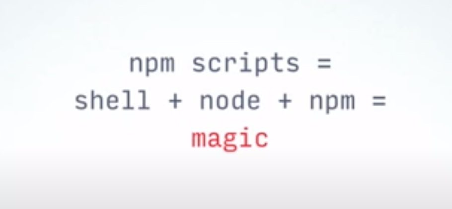
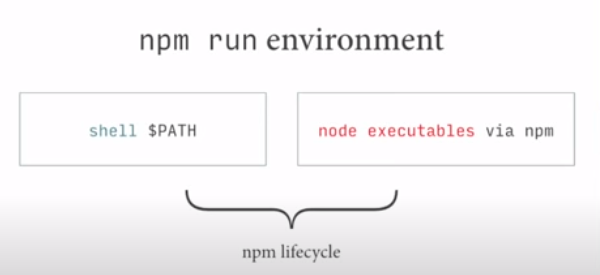
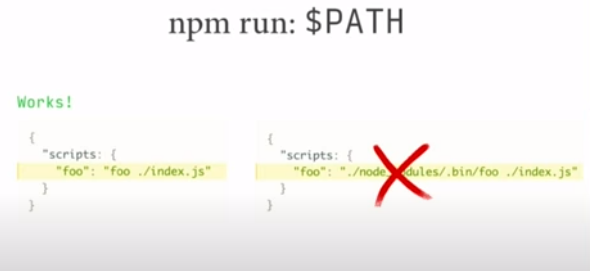
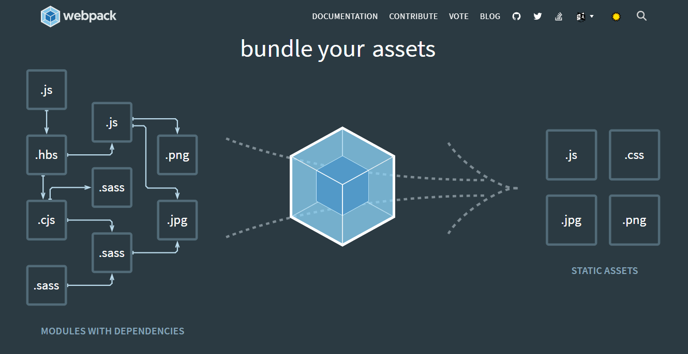

# INDEX

- [INDEX](#index)
  - [Notes](#notes)
  - [Exporting & Importing code](#exporting--importing-code)
    - [Exporting](#exporting)
    - [Importing](#importing)
  - [modular pattern](#modular-pattern)
  - [Old vs Modern Javascript with Package managers](#old-vs-modern-javascript-with-package-managers)
    - [NPM](#npm)
      - [Task runner (npm scripts)](#task-runner-npm-scripts)
    - [Yarn](#yarn)
    - [Package manager Notes](#package-manager-notes)
  - [Modules](#modules)
    - [Problems with script loading](#problems-with-script-loading)
    - [History of Modules](#history-of-modules)
      - [CommonJS](#commonjs)
      - [EcmaScript Modules (ESM)](#ecmascript-modules-esm)
  - [Bundling (parcel / Webpack)](#bundling-parcel--webpack)
    - [Parcel](#parcel)
    - [Webpack](#webpack)
      - [For Development](#for-development)
      - [For Production](#for-production)
  - [Babel (`transpiling` & `Polyfilling`)](#babel-transpiling--polyfilling)
    - [Transpiling code for new language features](#transpiling-code-for-new-language-features)
      - [Configuring Webpack to use Babel](#configuring-webpack-to-use-babel)
    - [Polyfilling](#polyfilling)
  - [Deployment](#deployment)
    - [CI/CD](#cicd)
      - [CI/CD using netlify](#cicd-using-netlify)

---

## Notes

- to use modules specify the script type => in `html` file => in the `<head>`

  ```html
  <script type="module" defer src="script.js"></script>
  ```

- As our program grows bigger, it may contain many lines of code. Instead of putting everything in a single file, you can use `modules` to separate codes in separate files as per their functionality. This makes our code organized and easier to maintain.
- `Module` is a file that contains code to perform a specific task. A module may contain variables, functions, classes etc.

---

## Exporting & Importing code

Most programming languages provide a way to import code from one file into another. JavaScript wasn’t originally designed with this feature, because JavaScript was designed to only run in the browser, with no access to the file system of the client’s computer (for security reasons). So for the longest time, organizing JavaScript code in multiple files required you to load each file with variables shared globally.

In 2009, a project named CommonJS was started with the goal of specifying an ecosystem for JavaScript outside the browser. A big part of CommonJS was its specification for **modules**, which would finally allow JavaScript to import and export code across files like most programming languages, without resorting to global variables. The most well-known of implementation of CommonJS modules is **node.js**.

---

### Exporting

- The `export` statement is used when creating JavaScript modules to export live bindings to functions, objects, or primitive values from the module so they can be used by other programs with the import statement.
- Exported modules are in `strict mode` whether you declare them as such or not.
- exports must happen in top-level code (global scope)

There are two types of exports

1. Named Exports (Zero or more exports per module)

   ```javascript
   // Exporting individual features
   export let name1, name2, …, nameN; // also var, const
   export let name1 = …, name2 = …, …, nameN; // also var, const
   export function functionName(){...}
   export class ClassName {...}

   // multiple exports with Renaming exports
   const totalPrice = 237;
   const totalQuantity = 23;
   export { totalPrice, totalQuantity as tq };

   // Exporting destructured assignments with renaming
   export const { name1, name2: bar } = obj;
   ```

2. Default Exports (One per module)

   - here we don't export `declaration` or `variables` but we export `values` or `(expressions that already return values)`

   ```javascript
   // Default exports
   export default (expression like "ternary operator","arrow function", "short circuiting" );
   export default function (…) { … } // also class, function*
   export default function name1(…) { … } // also class, function*
   ```

---

### Importing

[reference](https://developer.mozilla.org/en-US/docs/Web/JavaScript/Reference/Statements/import#dynamic_imports)

1. for Named Exports

   - It's preferred for large libraries like `lodash` and `reactDom`
     - so you only import what you need from them

   ```javascript
   // creating a `name-space` from importing => to use in the file
   import * as myModule from 'module-name';
   // now "myModule" will act as an object which has properties & mehtods we can use
   myModule.moduleFunc();

   // Import a single export from a module
   // "export1" must be the same name in the module
   import { export1 } from 'module-name';
   import { export1 as alias1 } from 'module-name';

   // Import multiple exports from module
   import { export1, export2 } from 'module-name';
   ```

2. Import a module for its side effects only

   - This runs the module's global code, but doesn't actually import any values.

   ```javascript
   import 'module-name';

   // example : This works with dynamic imports
   (async () => {
     if (somethingIsTrue) {
       // import module for side effects
       await import('/modules/my-module.js');
     }
   })();
   ```

3. Importing defaults

   ```javascript
   // here we can name it whatever we want as it was exported without a name
   import myDefault from '/modules/my-module.js';
   ```

4. Importing (defaults + named) exports

   ```javascript
   import add, { addToCart, totalPrice as price, tq } from './shoppingCart.js';
   // here (add) is the default import
   ```

5. Dynamic Imports

   - The standard import syntax is static and will always result in all code in the imported module being evaluated at load time. In situations where you wish to load a module conditionally or on demand, you can use a dynamic import instead.

   - To dynamically import a module, the `import` keyword may be called as a `function`. When used this way, it returns a `promise`.

   ```javascript
   import('/modules/my-module.js').then(module => {
     // Do something with the module.
     module.loadPageInto(main);
   });

   // or using "await" keyword
   let module = await import('/modules/my-module.js');
   ```

---

## modular pattern

The module pattern is a special Design pattern in which we use IFFI (Immediately invoked function expression), and we return an object. Inside of that object, we can have functions as well as variables.

> note that the thing that make this possible (reaching what the IIFE-function returns after it was self-invoked) is => `closures`

- Private methods or functions are members of given entity than can be seen only within said entity. Public ones can be accessed from the outside of given entity.

  ```javascript
  // IIFE
  const Formatter = (function () {
    const log = message => console.log(`[${Date.now()}] Logger: ${message}`);
  })();

  // using it
  Formatter.log('Hello');
  ```

---

## Old vs Modern Javascript with Package managers

- in old javascript development when we wanted to include a library, we needed to download its `.js` file and include it before our main `.js` file in the `html` file
  - The good thing was that it was easy enough to understand. The bad thing was that it was annoying to find and download new versions of libraries every time they would update.
- Starting around 2010, several competing JavaScript package managers (`npm`, `yarn`, `Bower`) emerged to help automate the process of downloading and upgrading libraries from a central repository
  - Note that `npm` was originally a package manager made specifically for `node.js`, a JavaScript runtime designed to run on the **server**, not the frontend (in the browser).
  - Using package managers generally involves using a command line, which in the past was never required as a frontend dev

---

### NPM

- `npm init`
  - generate a new file named `package.json` This is a configuration file that npm uses to save all project information.
    - it can be described as a manifest of your project that includes the packages and applications it depends on, information about its unique source control, and specific metadata like the project's name, description, and author.
    - it is always structured in the JSON format, which allows it to be easily read as metadata and parsed by machines.
  - > You can use `npm init --yes` to Instantly Initialize a Project
- `npm install package-name`

  - This command does two things:
    1. first, it downloads all the code from the package into a folder called `node_modules`.
    2. Second, it automatically modifies the `package.json` file to keep track of the package as a project dependency.

> This is useful later when sharing a project with others — instead of sharing the `node_modules` folder (which can get very large), you only need to share the `package.json` file and other developers can install the required packages automatically with the command `npm install`

- now to use the library/package, we have 2 choices:

  1. **Use the `.js` file in the `node_modules/package_name` directory**

     - This means we can link to the npm downloaded version of the package in the `index.html` file as follows:

     ```html
     <script src="node_modules/package_name.js"></script>
     <script src="index.js"></script>
     ```

     - So the good thing is that we can now use npm to download and update our packages through the command line. The bad thing is right now we’re digging through the `node_modules` folder to find the location of each package and manually including it in our HTML. That’s pretty inconvenient

  2. **Using a JavaScript module bundler (webpack)**

     - using `node.js` modules. Instead of loading all of `package_name.js` with an HTML script tag, you can load it directly in the JavaScript file as follow:

       ```js
       // index.js
       var moment = require('moment');

       // rest of the main code
       ```

     - This is all great for `node.js`, but if we tried to use the above code in the browser, we get an error saying `require` is not defined. The browser doesn’t have access to the file system, which means loading modules in this way is very tricky — loading files has to be done dynamically, either synchronously (which slows down execution) or asynchronously (which can have timing issues).
     - This is where a module bundler comes in. **A JavaScript module bundler is a tool that gets around the problem with a build step (which has access to the file system) to create a final output that is browser compatible (which doesn’t need access to the file system)**.
       - In this case, we need a module bundler to find all require statements (which is invalid browser JavaScript syntax) and replace them with the actual contents of each required file. The final result is a single bundled JavaScript file (with no require statements)!
     - > The most popular module bundler was [Browserify](https://browserify.org/), Around 2015, [webpack](https://webpack.js.org/) eventually became the more widely used module bundler (fueled by the popularity of the **React** frontend framework, which took full advantage of webpack’s various features).
     - Now that we have webpack’s **dist/main.js** output, we are going to use it instead of `index.js` in the browser, as it contains invalid require statements. This would be reflected in the `index.html` file as follows:

       ```html
       <script src="dist/main.js"></script>
       ```

- Bundling with [Parcel](https://parceljs.org/)
- writing `scripts`

---

#### Task runner (npm scripts)

It is a tool that automates different parts of the build process. For frontend development, tasks include `minifying code`, `optimizing images`, `running tests`, etc.

> In 2013, [Grunt](https://gruntjs.com/) was the most popular frontend task runner, with [Gulp](https://gulpjs.com/) (more about Gulp in [FrontEnd.md file](../Internet/FrontEnd.md)) following shortly after. Both rely on plugins that wrap other command line tools. Nowadays the most popular choice seems to be using the scripting capabilities built into the **npm package manager** itself, which doesn’t use plugins but instead works with other command line tools directly.

it's the `entries` in the `scripts` field of the `package.json` file. The scripts field holds an object where you can specify various commands and scripts that you want to expose.

>  > 
>
> - **shell/bash**: it's good at:
>
>   - file i/o
>   - chaining tasks
>   - running tasks in series/parallel>
>
> - **node**: we can replace shell commands with node-implementations, like
>   - `bash` -> `node`
>   - `cat` -> `catw`
>   - `mkdir` -> `mkdirp`
>   - `rm` -> `rimraf`
>   - `&` -> `npm-run-all -parallel`
>
> This is achievable because most packages come with shell commands

- This is very useful when we have repetitive tasks and we have to automate them.

- [reference](https://docs.npmjs.com/cli/v8/using-npm/scripts)

- in `package.json` :

  ```json
  // you may have to remove the ("main" line) above "scripts" in the file or replace it with "default"
  {
    "default": "index.html",

    "scripts": {
      "start": "parcel index.html",
      "build": "parcel build index.html --dist-dir ./dist"
    }
  }
  ```

> Note that the scripts in `package.json` can run webpack without having to specify the full path `./node_modules/.bin/parcel`, since `node.js` knows the location of each npm module path
> 

- These can be executed using the following command :

  ```bash
  # npm run <script-name>

  npm run start
  # or
  npm start

  # run this after finishing development and removed (dist, modules) folders and you are ready for deployment
  npm run build
  ```

- there's also **npm lifehooks commands**, like:

  ```json
  {
    "scripts": {
      "preinstall": "",
      "postinstall": ""
    }
  }
  ```

---

### Yarn

---

### Package manager Notes

- **devDependency**: this saves it as a development dependency, which means it’s a package that you need in your development environment but not on your production server
  - it's done with the `--save-dev` argument
- `Bundling` with `parcel` creates a `script` not a `module`, so in html we shouldn't write `type="module"` in `<script>`
- if you're using `windows`, don't write scripts with **single quotation** as it won't work, so you'll have to use **double quotation**

---

## Modules

### Problems with script loading

- We have some problems when trying to run javascript in the browser:

  - too many scripts
    - that exceeds the max number of default simultaneous persistent connections per server/proxy
  - unmaintainable scripts
    - `scope`, `size`, `readability`, `fragility`, `monolith files`

- solution:
  - using **IIFE's**, as we treat each file as IIFE (revealing module), also this enables us to (**concatenate** files together): we can safely combine files without concern of scope collision!
- we had other problems:
  - "Full rebuilds every time there's a change"
  - lots of IIFE's are **slow** -> [The cost of small modules](https://nolanlawson.com/2016/08/15/the-cost-of-small-modules/)

---

### History of Modules

#### CommonJS

- With the creation of `Node.js`, we needed a way to run Javascript outside of the browser, this is where `commonJS` was born

  ```js
  const path = require('path');
  ```

- `NPM` was created as a package strategy to share **commonJS node modules** across the entire ecosystem
- Modules also had problems:
  - No live bindings
  - No browser support for commonJS
  - slow module loader (slow) -> as it's **synchronous**
- this is where **bundlers** and **linkers** started to get popular, but they also had problems
- this led to a solution which is -> **ESM**

#### EcmaScript Modules (ESM)

It's a standard pattern for importing JavaScript modules.

```js
import { uniq, forOf, bar } from 'lodash-es';
import * as utils from 'utils';

export const uniqConst = uniq([1, 2, 2, 4]);
```

- it's different from **ES2015**
- it's still not fully compatible with `Node.js`
- but you may ask: "How do they work in the browser?"
  - the answer is: "they're incredibly **SLOW**"; it's like unusable after 10 modules

> **This is where WEBPACK was born**

---

## Bundling (parcel / Webpack)

`JavaScript bundling` is an optimization technique you can use to reduce the number of **server requests** for JavaScript files. Bundling accomplishes this by merging multiple JavaScript files together into one file to reduce the number of page requests.

A JavaScript **module bundler** is a tool that gets around the problem with a build step (which has access to the file system) to create a final output that is browser compatible (which doesn’t need access to the file system).

> Difference:
>
> - Parcel is good for teaching and small exambles as it doesn't require configuration
>   Webpack is better for large production



---

### Parcel

`parcel` is a **zero configuration** build tool for the web. It combines a great out-of-the-box development experience with a scalable architecture that can take your project from just getting started to massive production application.

- results will be in `dist` folder
- [parcel installation](https://parceljs.org/getting-started/webapp/)

  ```shell
  npm i parcel --save-dev
  // or
  npm i parcel -D

  npx parcel index.html  // this will run parcel in development mode
  ```

  - we specify an entry point => `index.html`
  - you can import something from a `package` and parcel will automatically find the path for the module, and even more : if `package` isn't installed => parcel will install it

    ```js
    // instead of this
    import cloneDeep from './node_modules/lodash-es/cloneDeep.js';

    // use this
    import cloneDeep from 'lodash-es';
    ```

  - importing any static assets like `images, icons,...` that are not `programming-files` when importing them (as its location is change when Bundling) => we do it like this:

    ```js
    import icons from '../img/icons.svg'; // Parcel version 1
    import icons from 'url:../../img/icons.svg'; // Parcel version 2 (now)
    ```

- `parcel` is also capable of bundling `sass` files into `css` files

  - this is done by `npm i sass`, and making sure that you are referencing the sass file in the `index.html` file

    ```html
    <link rel="stylesheet" href="src/sass/main.scss" />
    ```

---

### Webpack

It's a **module bundler**

```bash
# installation
npm install webpack webpack-cli webpack-dev-server --save-dev
```

#### For Development

- run the webpack tool that was installed in the `node_modules` folder, start with the `index.js` file, find any `require()` statements, and replace them with the appropriate code to create a single output file (which by default is **dist/main.js**).

  - The `--mode=development` argument is to keep the JavaScript readable for developers, as opposed to a minified output with the argument `--mode=production`.

  ```sh
  ./node_modules/.bin/webpack index.js --mode=development
  ```

- Note that we’ll need to run the webpack command each time we change `index.js`. This is tedious, Webpack can read options from a config file in the root directory of the project named webpack.`config.js`

  - create `webpack.config.js` file that contains this :

  ```js
  // webpack.config.js
  const path = require('path');

  module.exports = {
    mode: 'development',
    entry: './index.js',
    output: {
      filename: 'main.js',
      publicPath: 'dist'
    }
  };
  ```

  - Now each time we change index.js, we can run webpack with the command:

    ```sh
    ./node_modules/.bin/webpack
    ```

- and to use it with a task-runner, in `package.json` add this script :

  ```json
  // (--progress) option to show the percent progress
  "scripts": {
    "build": "webpack --progress --mode=production",
    "watch": "webpack --progress --watch"
    },
  ```

- you can also use **webpack-dev-server**, a separate tool which provides a simple web server with live reloading. To install it as a development dependency:

  ```sh
  npm install webpack-dev-server --save-dev
  ```

  ```json
  // package.json
  "scripts": {
    "build": "webpack --progress -p",
    "watch": "webpack --progress --watch",
    "serve": "webpack-dev-server --open"
    },
  ```

---

#### For Production

- in `package.json` add this script :

  ```json
  "scripts": {
    "start": "webpack-dev-server",
    "build": "webpack --config webpack.config.prod.js"
    },
  ```

- install `clean-webpack-plugin` package to clean the `dist` folder whenever we **rebuild** the project

```bash
npm i --save-dev clean-webpack-plugin
```

- For `Production` --> create `webpack.config.prod.js` file that contains this :

  ```js
  const path = require('path');
  const CleanPlugin = require('clean-webpack-plugin');

  module.exports = {
    mode: 'production',
    entry: './src/app.ts',
    output: {
      filename: 'bundle.js',
      path: path.resolve(__dirname, 'dist')
    },
    devtool: 'none',
    plugins: [new CleanPlugin.CleanWebpackPlugin()]
  };
  ```

---

## Babel (`transpiling` & `Polyfilling`)

How to make our modern code work on older engines that don’t understand recent features yet? -> There are two tools for that:

### Transpiling code for new language features

**Transpiling** code means converting the code in one language to code in another similar language. This is an important part of frontend development — since browsers are slow to add new features, new languages were created with experimental features that transpile to browser compatible languages.

**Transpilers** : special piece of software that translates source code to another source code. It can parse (“read and understand”) modern code and rewrite it using older syntax constructs, so that it’ll also work in outdated engines.

- **Babel** is not a new language but a transpiler that transpiles next generation JavaScript with features not yet available to all browsers (ES2015 and beyond) to older more compatible JavaScript (ES5).
- **Typescript** is a language that is essentially identical to next generation JavaScript, but also adds optional static typing. Many people choose to use babel because it’s closest to vanilla JavaScript.

```js
// before running the transpiler
height = height ?? 100;

// after running the transpiler
height = height !== undefined && height !== null ? height : 100;
```

- Usually, a developer runs the transpiler on their own computer, and then deploys the transpiled code to the server.
- **Babel** is one of the most prominent transpilers out there.

#### Configuring Webpack to use Babel

Modern project build systems, such as **webpack**, provide a means to run a transpiler automatically on every code change, so it’s very easy to integrate into the development process.

- We can configure webpack to use babel-loader by editing the webpack.`config.js` file as follows:

```js
// webpack.config.js
module.exports = {
  mode: 'development',
  entry: './index.js',
  output: {
    filename: 'main.js',
    publicPath: 'dist'
  },
  module: {
    rules: [
      {
        test: /\.js$/,
        exclude: /node_modules/,
        /* we’re telling webpack to look for any .js files (excluding ones in the node_modules folder) 
        and apply babel transpilation using babel-loader with the @babel/preset-env preset.
        */
        use: {
          loader: 'babel-loader',
          options: {
            presets: ['@babel/preset-env']
          }
        }
      }
    ]
  }
};
```

---

### Polyfilling

**Polyfills** : is a piece of code (usually JavaScript on the Web) used to provide modern **functionality** on older browsers that do not natively support it.

- New language features may include not only syntax constructs and operators, but also built-in **functions**. As we’re talking about new functions, not syntax changes, there’s no need to transpile anything here. We just need to declare the missing function.
- For example, `Math.trunc(n)` is a function that “cuts off” the decimal part of a number, e.g `Math.trunc(1.23)` returns 1.

  ```js
  if (!Math.trunc) {
    // if no such function

    Math.trunc = function (number) {
      // Math.ceil and Math.floor exist even in ancient JavaScript engines
      // they are covered later in the tutorial
      return number < 0 ? Math.ceil(number) : Math.floor(number);
    };
  }
  ```

- `Babel` is a JavaScript `transcompiler` that is mainly used to convert ECMAScript 2015+ (ES6+) code into a backwards compatible version of JavaScript that can be run by older JavaScript engines. Babel is a popular tool for using the newest features of the JavaScript programming language.

  - `Babel` can just convert normal `syntax` like `arrow funtion` to `function expression/declaration`, **but** it can't convert new ES6 features like `class`,`promise`, so we use => `polyfilling`.

- `polyfill` is a piece of code (usually JavaScript on the Web) used to provide modern functionality on older browsers that do not natively support it.

  - for it we use a library : `core-js`, `regenerator-runtime`

    ```javascript
    // in js file
    import 'core-js/stable';

    // Polifilling async functions
    import 'regenerator-runtime/runtime';

    // if they are not installed automatically, install them manually
    ```

---

## Deployment

- the `dist` folder is the one that will be moved in the deployment-service like [netlify](https://www.netlify.com/)

### CI/CD


[reference](https://resources.github.com/ci-cd)

#### CI/CD using netlify

- first :
  - deploy the `dist` folder in [netlify](https://www.netlify.com/)
  - you pushed the project files **(wirhout `dist` folder)** into a repository in github
- second :
  - in the project settings in `netlify` go to CI/CD
  - link the github repo of the project
- third :
  - in `netlify => build settings` : write the same build script used in `package.json` file
  - In publish-directory => write : `dist`
