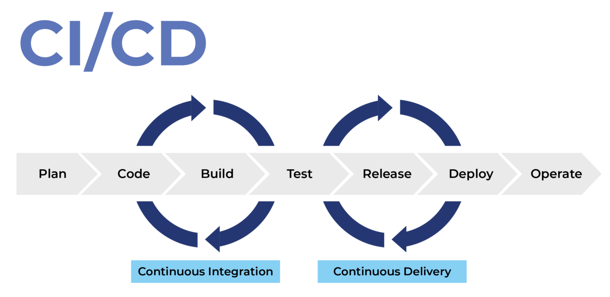

## INDEX

- [INDEX](#index)
- [Notes](#notes)
- [exporting](#exporting)
  - [1. Named Exports (Zero or more exports per module)](#1-named-exports-zero-or-more-exports-per-module)
  - [2. Default Exports (One per module)](#2-default-exports-one-per-module)
- [Importing](#importing)
  - [1. for Named Exports](#1-for-named-exports)
  - [2. Import a module for its side effects only](#2-import-a-module-for-its-side-effects-only)
  - [3. Importing defaults](#3-importing-defaults)
  - [4. Importing (defaults + named) exports](#4-importing-defaults--named-exports)
  - [5. Dynamic Imports](#5-dynamic-imports)
- [modular pattern](#modular-pattern)
- [NPM](#npm)
  - [Steps](#steps)
  - [Notes](#notes-1)
- [Bundling (parcel / Webpack)](#bundling-parcel--webpack)
  - [Parcel](#parcel)
  - [Webpack](#webpack)
    - [For Development](#for-development)
    - [For Production](#for-production)
  - [Babel (`transpiling` & `Polyfilling`)](#babel-transpiling--polyfilling)
  - [scripts](#scripts)
- [Deployment](#deployment)
  - [CI/CD](#cicd)
    - [CI/CD using netlify](#cicd-using-netlify)

---

## Notes

- to use modules specify the script type => in `html` file => in the `<head>`

  ```html
  <script type="module" defer src="script.js"></script>
  ```

- As our program grows bigger, it may contain many lines of code. Instead of putting everything in a single file, you can use `modules` to separate codes in separate files as per their functionality. This makes our code organized and easier to maintain.
- `Module` is a file that contains code to perform a specific task. A module may contain variables, functions, classes etc.

---

## exporting

- The `export` statement is used when creating JavaScript modules to export live bindings to functions, objects, or primitive values from the module so they can be used by other programs with the import statement.
- Exported modules are in `strict mode` whether you declare them as such or not.
- exports must happen in top-level code (global scope)

- There are two types of exports

### 1. Named Exports (Zero or more exports per module)

```javascript
// Exporting individual features
export let name1, name2, …, nameN; // also var, const
export let name1 = …, name2 = …, …, nameN; // also var, const
export function functionName(){...}
export class ClassName {...}

// multiple exports with Renaming exports
const totalPrice = 237;
const totalQuantity = 23;
export { totalPrice, totalQuantity as tq };

 // Exporting destructured assignments with renaming
 export const { name1, name2: bar } = obj;
```

---

### 2. Default Exports (One per module)

- here we don't export `declaration` or `variables` but we export `values` or `(expressions that already return values)`

```javascript
// Default exports
export default (expression like "ternary operator","arrow function", "short circuiting" );
export default function (…) { … } // also class, function*
export default function name1(…) { … } // also class, function*
```

---

## Importing

[reference](https://developer.mozilla.org/en-US/docs/Web/JavaScript/Reference/Statements/import#dynamic_imports)

### 1. for Named Exports

```javascript
// creating a `name-space` from importing => to use in the file
import * as myModule from 'module-name';
// now "myModule" will act as an object which has properties & mehtods we can use
myModule.moduleFunc();

// Import a single export from a module
// "export1" must be the same name in the module
import { export1 } from 'module-name';
import { export1 as alias1 } from 'module-name';

// Import multiple exports from module
import { export1, export2 } from 'module-name';
```

> It's preferred for large libraries like `lodash` and `reactDom`
>
> - so you only import what you need from them

---

### 2. Import a module for its side effects only

- This runs the module's global code, but doesn't actually import any values.

```javascript
import 'module-name';

// example : This works with dynamic imports
(async () => {
  if (somethingIsTrue) {
    // import module for side effects
    await import('/modules/my-module.js');
  }
})();
```

---

### 3. Importing defaults

```javascript
// here we can name it whatever we want as it was exported without a name
import myDefault from '/modules/my-module.js';
```

### 4. Importing (defaults + named) exports

```javascript
import add, { addToCart, totalPrice as price, tq } from './shoppingCart.js';
// here (add) is the default import
```

---

### 5. Dynamic Imports

- The standard import syntax is static and will always result in all code in the imported module being evaluated at load time. In situations where you wish to load a module conditionally or on demand, you can use a dynamic import instead.
- To dynamically import a module, the `import` keyword may be called as a `function`. When used this way, it returns a `promise`.

```javascript
import('/modules/my-module.js').then(module => {
  // Do something with the module.
  module.loadPageInto(main);
});

// or using "await" keyword
let module = await import('/modules/my-module.js');
```

---

## modular pattern

The module pattern is a special Design pattern in which we use IFFI (Immediately invoked function expression), and we return an object. Inside of that object, we can have functions as well as variables.

> note that the thing that make this possible (reaching what the IIFE-function returns after it was self-invoked) is => `closures`

- Private methods or functions are members of given entity than can be seen only within said entity. Public ones can be accessed from the outside of given entity.

  ```javascript
  // IIFE
  const Formatter = (function () {
    const log = message => console.log(`[${Date.now()}] Logger: ${message}`);
  })();

  // using it
  Formatter.log('Hello');
  ```

---

## NPM

### Steps

1. `npm init`
2. `npm install package-name`
3. Bundling with [Parcel](https://parceljs.org/)
4. writing `scripts`

---

### Notes

- `devDependency` is like a tool that we need to build our application, But it's not a dependency that we actually include in our code.
- `Bundling` with `parcel` creates a `script` not a `module`, so in html we shouldn't write `type="module"` in `<script>`

---

## Bundling (parcel / Webpack)

`JavaScript bundling` is an optimization technique you can use to reduce the number of **server requests** for JavaScript files. Bundling accomplishes this by merging multiple JavaScript files together into one file to reduce the number of page requests.

> Difference:
>
> - Parcel is good for teaching and small exambles as it doesn't require configuration
>   Webpack is better for large production


### Parcel

`parcel` is a **zero configuration** build tool for the web. It combines a great out-of-the-box development experience with a scalable architecture that can take your project from just getting started to massive production application.

- results will be in `dist` folder
- [parcel installation](https://parceljs.org/getting-started/webapp/)

  ```shell
  npm i parcel --save-dev
  // or
  npm i parcel -D

  npx parcel index.html  // this will run parcel in development mode
  ```

  - we specify an entry point => `index.html`
  - you can import something from a `package` and parcel will automatically find the path for the module, and even more : if `package` isn't installed => parcel will install it

    ```js
    // instead of this
    import cloneDeep from './node_modules/lodash-es/cloneDeep.js';

    // use this
    import cloneDeep from 'lodash-es';
    ```

  - importing any static assets like `images, icons,...` that are not `programming-files` when importing them (as its location is change when Bundling) => we do it like this:

    ```js
    import icons from '../img/icons.svg'; // Parcel version 1
    import icons from 'url:../../img/icons.svg'; // Parcel version 2 (now)
    ```

- `parcel` is also capable of bundling `sass` files into `css` files

  - this is done by `npm i sass`, and making sure that you are referencing the sass file in the `index.html` file

    ```html
    <link rel="stylesheet" href="src/sass/main.scss" />
    ```

---

### Webpack

```bash
npm install webpack webpack-cli webpack-dev-server --save-dev
```

#### For Development

- in `package.json` add this script :

  ```json
  "scripts": {
    "start": "webpack-dev-server",
    "build": "webpack"
    },
  ```

- For `development` --> create `webpack.config.js` file that contains this :

  ```js
  const path = require('path');

  module.exports = {
    mode: 'development',
    entry: './src/app.ts',
    output: {
      filename: 'bundle.js',
      path: path.resolve(__dirname, 'dist'),
      publicPath: 'dist'
    }
  };
  ```

---

#### For Production

- in `package.json` add this script :

  ```json
  "scripts": {
    "start": "webpack-dev-server",
    "build": "webpack --config webpack.config.prod.js"
    },
  ```

- install `clean-webpack-plugin` package to clean the `dist` folder whenever we **rebuild** the project

```bash
npm i --save-dev clean-webpack-plugin
```

- For `Production` --> create `webpack.config.prod.js` file that contains this :

  ```js
  const path = require('path');
  const CleanPlugin = require('clean-webpack-plugin');

  module.exports = {
    mode: 'production',
    entry: './src/app.ts',
    output: {
      filename: 'bundle.js',
      path: path.resolve(__dirname, 'dist')
    },
    devtool: 'none',
    plugins: [new CleanPlugin.CleanWebpackPlugin()]
  };
  ```

---

### Babel (`transpiling` & `Polyfilling`)

How to make our modern code work on older engines that don’t understand recent features yet? -> There are two tools for that:

1. **Transpilers** : special piece of software that translates source code to another source code. It can parse (“read and understand”) modern code and rewrite it using older syntax constructs, so that it’ll also work in outdated engines.

   ```js
   // before running the transpiler
   height = height ?? 100;

   // after running the transpiler
   height = height !== undefined && height !== null ? height : 100;
   ```

   - Usually, a developer runs the transpiler on their own computer, and then deploys the transpiled code to the server.
   - **Babel** is one of the most prominent transpilers out there.
   - Modern project build systems, such as **webpack**, provide a means to run a transpiler automatically on every code change, so it’s very easy to integrate into the development process.

2. **Polyfills** : is a piece of code (usually JavaScript on the Web) used to provide modern **functionality** on older browsers that do not natively support it.

   - New language features may include not only syntax constructs and operators, but also built-in **functions**. As we’re talking about new functions, not syntax changes, there’s no need to transpile anything here. We just need to declare the missing function.
   - For example, `Math.trunc(n)` is a function that “cuts off” the decimal part of a number, e.g `Math.trunc(1.23)` returns 1.

   ```js
   if (!Math.trunc) {
     // if no such function

     Math.trunc = function (number) {
       // Math.ceil and Math.floor exist even in ancient JavaScript engines
       // they are covered later in the tutorial
       return number < 0 ? Math.ceil(number) : Math.floor(number);
     };
   }
   ```

- `Babel` is a JavaScript `transcompiler` that is mainly used to convert ECMAScript 2015+ (ES6+) code into a backwards compatible version of JavaScript that can be run by older JavaScript engines. Babel is a popular tool for using the newest features of the JavaScript programming language.

  - `Babel` can just convert normal `syntax` like `arrow funtion` to `function expression/declaration`, **but** it can't convert new ES6 features like `class`,`promise`, so we use => `polyfilling`.

- `polyfill` is a piece of code (usually JavaScript on the Web) used to provide modern functionality on older browsers that do not natively support it.

  - for it we use a library : `core-js`, `regenerator-runtime`

    ```javascript
    // in js file
    import 'core-js/stable';

    // Polifilling async functions
    import 'regenerator-runtime/runtime';

    // if they are not installed automatically, install them manually
    ```

---

### scripts

it's the `entries` in the `scripts` field of the `package.json` file. The scripts field holds an object where you can specify various commands and scripts that you want to expose.

- This is very useful when we have repetitive tasks and we have to automate them.

- [reference](https://docs.npmjs.com/cli/v8/using-npm/scripts)

- in `package.json` :

  ```json
  // you may have to remove the ("main" line) above "scripts" in the file or replace it with "default"
  {
    "default": "index.html",

    "scripts": {
      "start": "parcel index.html",
      "build": "parcel build index.html --dist-dir ./dist"
    }
  }
  ```

- These can be executed using the following command :

  ```bash
  # npm run <script-name>

  npm run start
  # or
  npm start

  # run this after finishing development and removed (dist, modules) folders and you are ready for deployment
  npm run build
  ```

---

## Deployment

- the `dist` folder is the one that will be moved in the deployment-service like [netlify](https://www.netlify.com/)

### CI/CD



[reference](https://resources.github.com/ci-cd)

#### CI/CD using netlify

- first :
  - deploy the `dist` folder in [netlify](https://www.netlify.com/)
  - you pushed the project files **(wirhout `dist` folder)** into a repository in github
- second :
  - in the project settings in `netlify` go to CI/CD
  - link the github repo of the project
- third :
  - in `netlify => build settings` : write the same build script used in `package.json` file
  - In publish-directory => write : `dist`
