# INDEX

- [INDEX](#index)
  - [jQuery](#jquery)
  - [Installation](#installation)
    - [Preventing conflicts with other libraries](#preventing-conflicts-with-other-libraries)
    - [Checking a page is ready to work with](#checking-a-page-is-ready-to-work-with)
  - [Selecting elements](#selecting-elements)
    - [jQuery object](#jquery-object)
    - [Indexing](#indexing)
    - [Selecting Form Elements](#selecting-form-elements)
  - [Elements](#elements)
    - [Getting element content](#getting-element-content)
    - [Updating element content](#updating-element-content)
    - [Inserting Elements](#inserting-elements)
    - [Getting and Setting attributes](#getting-and-setting-attributes)
    - [Getting and Setting css properties](#getting-and-setting-css-properties)
      - [Setting multiple CSS properties](#setting-multiple-css-properties)
    - [Cutting & Copying Elements](#cutting--copying-elements)
  - [Event methods](#event-methods)
    - [The Event object](#the-event-object)
    - [Additional parameters for event handlers](#additional-parameters-for-event-handlers)
  - [Effects & Animation](#effects--animation)
    - [Effects](#effects)
    - [Animation](#animation)
  - [JQUERY & AJAX](#jquery--ajax)
    - [requests](#requests)
    - [responses](#responses)
    - [Sending forms using AJAX](#sending-forms-using-ajax)
  - [JQUERY METHODS FOR FILTERING & SORTING](#jquery-methods-for-filtering--sorting)
  - [Notes](#notes)

---

## jQuery

jQuery offers a simple way to achieve a variety of common JavaScript tasks quickly and consistently, across all major browsers and without any fallback code needed.

> `$()` is used as a shorthand to save typing `jQuery()`

- **SELECT ELEMENTS**: simpler to access elements using jQuery's css-selectors than it is using DOM queries
- **PERFORM TASKS**: jQuery's methods let you update the DOM tree, animate elements into and out of view and loop through a set of elements all in one line of code
- **HANDLE EVENTS:** jQuery includes methods that allow you to attach event listeners to selected elements without having to write any fallback code to support older browsers
- **: CROSS-BROWSER COMPATIBILITY**: jQuery automatically handles the inconsistent ways in which browsers select elements and handle events, so you do not need to write cross-browser fallback code
  - To do this, jQuery uses **feature detection** to find the best way to achieve a task. It involves the use of many conditional statements: if the browser supports the ideal way to achieve a task, it uses that approach; otherwise, it tests to see if it supports the next best option to achieve the same task.

```js
// select all of the <hl> - <h6> headings, and add a value of headline to their cl ass attributes.
$(':header').addClass('headline');

/* select the first three list items and do two things: 
• The elements are hidden (in order to allow the next step). 
• The elements fade into view. */
$('li:l(3)').hide().fadeIn(lSOO);

/* set an event listener on each of the <li>elements. When a user clicks on one, it triggers an anonymous function to remove that element from the page. */
$('li').on('click', function () {
  $(this).remove();
});
```

---

## Installation

In order to use jQuery, the first thing you need to do is include the jQuery script in your page. it is included before the closing `</body>` tag.

```html
<body>
  <div id="page"></div>
  <script src="js/jquery-1.11.0.js "></script>
  <script src="js/basic-example.js"></script>
</body>
```

- You often see websites use a version of the jQuery file with the file extension .min . js. It means unnecessary spaces and carriage returns have been stripped from the file. e.g .. `jquery-1.11.0.js` becomes `jquery-1.11.0.min.js`.

---

### Preventing conflicts with other libraries

- You can use the `.noConflict()` method at the start of your script, to tell jQuery to release the$ shortcut so that other scripts can use it. Then you can use the full name rather than the shortcut:

  ```js
  jQuery.noConflict();
  jQuery(function () {
    jQuery('div').hide();
  });
  ```

- You can wrap your script in an llFE and still use `$`:

  ```js
  jQuery.noConflict();
  (function ($) {
    $('div').hide();
  })(jQuery);
  ```

- Or you can specify your own alias instead, e.g., `$j`:

  ```js
  var $j = jQuery.noConflict();
  $j(document).ready(function () {
    $j('div').hide();
  });
  ```

---

### Checking a page is ready to work with

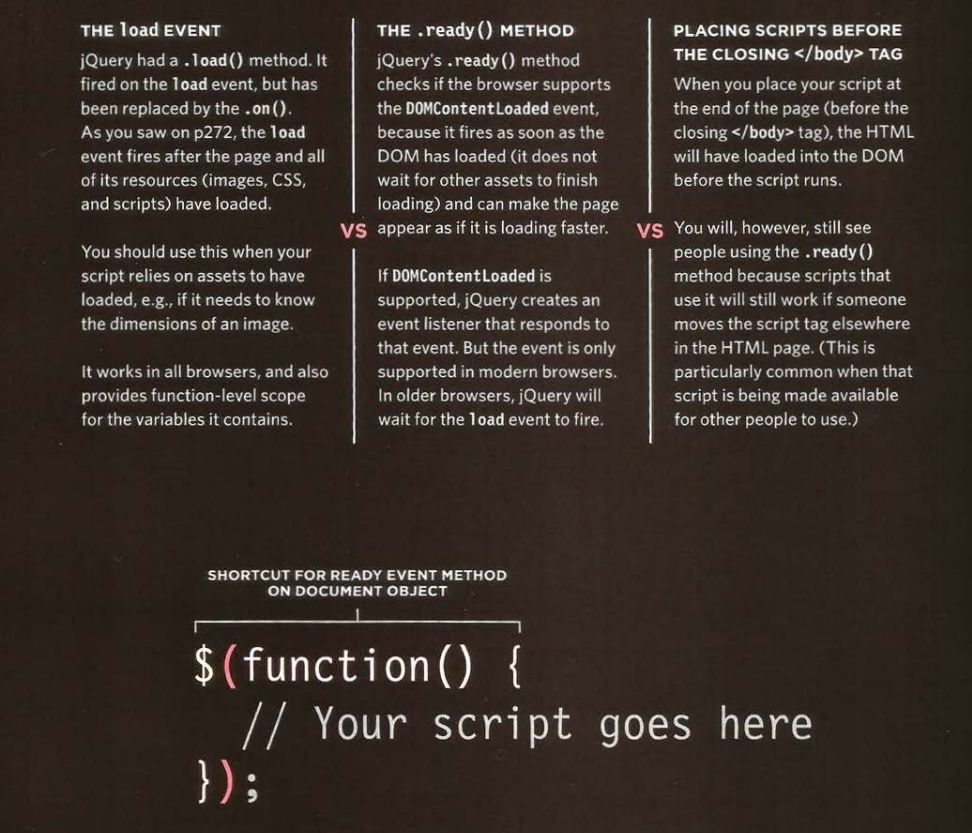

- a positive side-effect of writing jQuery code inside this method is that it creates function-level scope for its variables
- this function-level scope prevents naming-collisions with other scripts that might use the same variable name

---

## Selecting elements

Rather than learn a new way to select elements, jQuery uses a language that is already familiar to front-end web developers: **CSS selectors**.

- when you select one or more elements, a `jQuery-object` is returned and is known as a `matched set` or a `jquery selection`. it holds a **reference** to the (corresponding nodes in the DOM tree), it doesn't create copies of them

  - it means it's storing the location of a piece of information in the **browser's memory**

- jQuery allows you to recreate the functionality of a loop on a selection of elements, using the `.each()` method.

  - It takes one parameter: a `callback function` containing the statements you want to run on each element.
  - As the `.each()` method goes through the elements in a selection, you can access the current element using the `this` keyword.
  - You also often see `$(this)`, which uses the this keyword to create a new jQuery selection containing the current element. **It allows you to use jQuery methods on the current element**.
    - Since `this` refers to the current node, if you want to access a property of that node, e.g .. that element's **id** or **c1ass attributes**, it is better to use plain JavaScript to access those attributes:

  ```js
  $('li').each(function () {
    var ids = this.id;
    $(this).append('<em class="order">' + ids + '</em>');
    // would involve the interpreter creating a new jQuery object, and then using a method to access info that is available as a property.
  });
  ```

### jQuery object

is an array-like object because ot stores a list of the elements in the same order that they appear in the HTML document (unlike other objects where the order of the properties is not usually preserved)

> it will be --> `window.jQuery`

**Caching jQuery selection**: To create a jQuery object, it takes time, processing resources and memory, so the interpreter must:

1. find the matching nodes in the Dom tree
2. Create the jQuery-object
3. store references to the nodes in the jQuery-object

> so if the code needs to use the same selection more than once, it's better to use that same jQuery object again rather that repeat the process, to do this we **store a reference to the jQuery object in a variable**

```js
$listItems = $('li);
```

---

### Indexing

Each item returned by a jQuery selector is given an index number, which can be used to filter the selection.

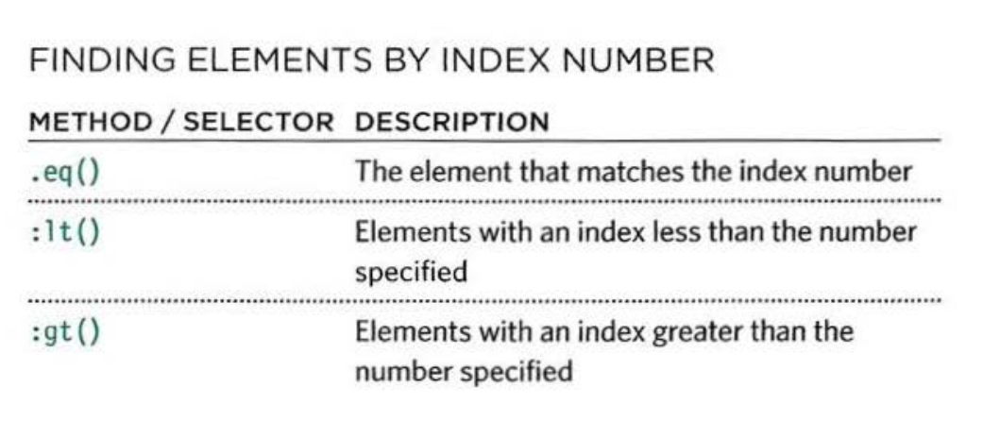

```js
$(function () {
  $('li:lt(2)').removeClass('hot');
  $('li').eq(0).addClass('complete');
  $('li:gt(2)').addClass('cool');
});
```

---

### Selecting Form Elements

- jQuery has selectors that are designed specifically to work with forms, however, they are not always the quickest way to select elements.

  - If you use one of these selectors on its own, jQuery will examine each element in the document to find a match (using code in the jQuery file, which is not as quick as CSS selectors).
  - Therefore, you should narrow down the part of the document the script needs to look through by placing an element name or other jQuery selector before using the selectors shown on this page.

  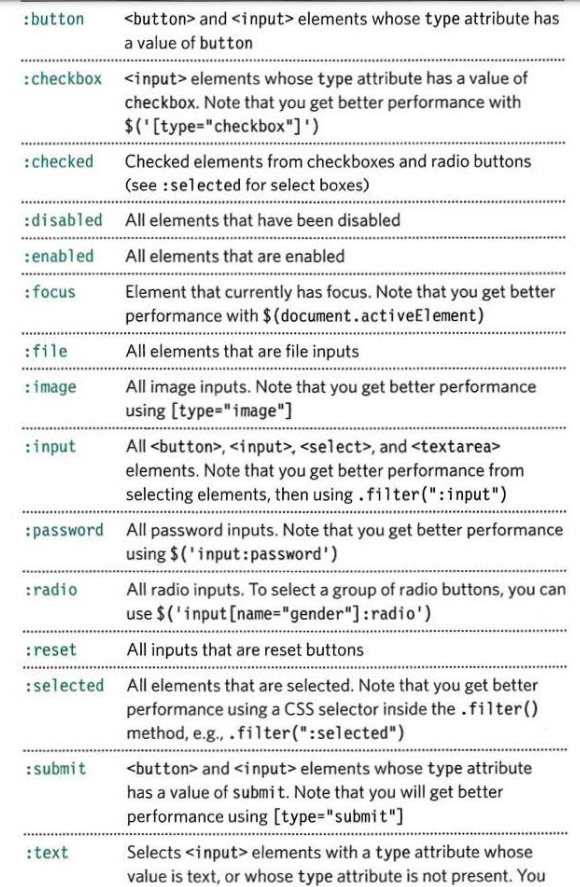

- To retrieve the value of elements -> `.val()`
  - Primarily used with `<input>`, `<se1ect>`, and `<textarea>` elements. It can be used to get the value of the first element in a matched set, or update the value of all of them.

---

## Elements

### Getting element content

The `.htm1()` and `.text()` methods both retrieve and update the content of elements.

- Note that:
  - `.html()` -> this returns only the content of the first matched element.
  - `.text()` -> this returns the text content of all matched elements (including spaces between words), but there are no spaces between the individual list items.
- To get the content from `<input>` or `<textarea>` elements, use the `.val()`

---

### Updating element content

Here are four methods that update the content of all elements in a jQuery selection:

- `.html()` -> gives every element in the matched set the same new content. The new content may include HTML.
- `.text()` -> gives every element in the matched set the same new text content. Any markup would be shown as text.
- `.replaceWith()` -> replaces every element (as well as their content and any child elements) in a matched set with new content. It also returns the replaced elements.
- `.remove()` -> removes all of the elements (as well as their content and any child elements) in the matched set.

The `.html()`,`.text()`, and `.replaceWith()` methods can take a **string** as a parameter. The string can:

- Be stored in a variable
- Contain markup

---

### Inserting Elements

Inserting new elements involves two steps:

1. Create the new elements in a `jQuery object`

   ```js
   var $newltem = $('<li class="new">item</ li>');
   ```

2. Use a method to insert the content into the page
   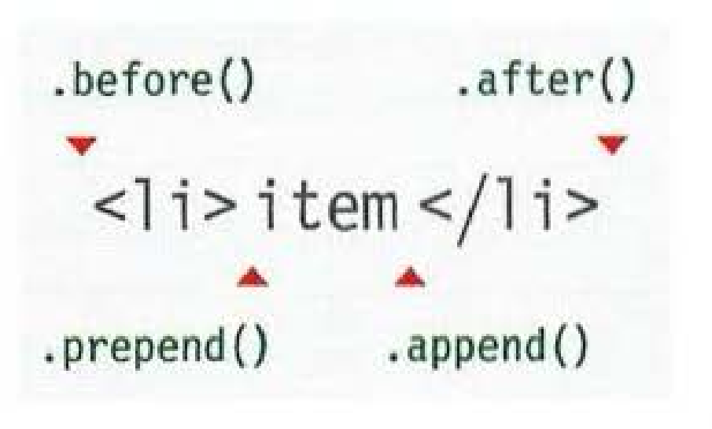

   ```js
   a.prepend(b); // adds b to a
   a.prependTo(b); // adds a to b

   $('ul').before('<p class="notice">Just updated</p>');
   ```

---

### Getting and Setting attributes

- You can work with any attribute on any element using the `attr()` and `removeAttr()` methods.

  ```js
  $('li#one').attr('id', 'hot');
  $('1i#one').removeAttr('id');
  ```

- The value of the class attribute can hold more than one class name (each separated by a space). The `addClass()` and `removeClass()` methods are very powerful because they let you add or remove an individual class name within the value of the class attribute (and they do not affect any other class names).

---

### Getting and Setting css properties

- The `.css()` method lets you retrieve and set the values of CSS properties.
- To set the values of a CSS property, you specify the property name as the first argument in the parentheses, then a comma, followed by its value as the second argument. This will update every element in the matched set.

  ```js
  // get css property
  var backgroundColor = $('li').css('background-color');
  // set css property
  $('li').css('background-color', '#272727');
  ```

- When dealing with dimensions that are specified in `pixels`. you can increase and decrease the values using the `+=` and `-=` operators.

  ```js
  $('li').css('padding-left', '+=20');
  ```

#### Setting multiple CSS properties

You can set multiple properties using **object literal notation**:

```js
$('1i').css({
  'background-color': '#272727',
  'font-family': 'Courier'
});
```

---

### Cutting & Copying Elements

Once you have a jQuery selection, you can use these methods to remove those elements or make a copy of them.

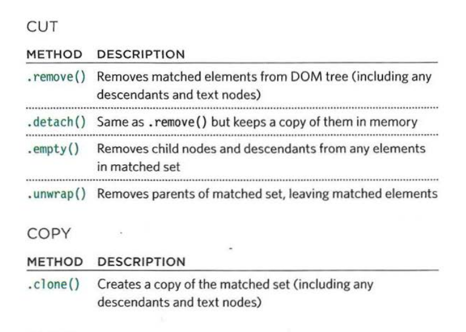

---

## Event methods

The `.on()` method is used to handle all events. Behind the scenes, jQuery handles all of the cross-browser issues

```js
$('li').on('click', function () {
  $(this).addClass('complete');
});
```

### The Event object

Every event handling function receives an event object. It has methods and properties related to the event that occurred.

```js
$('li').on('click', function (e) {
  eventType = e.type;
});
```

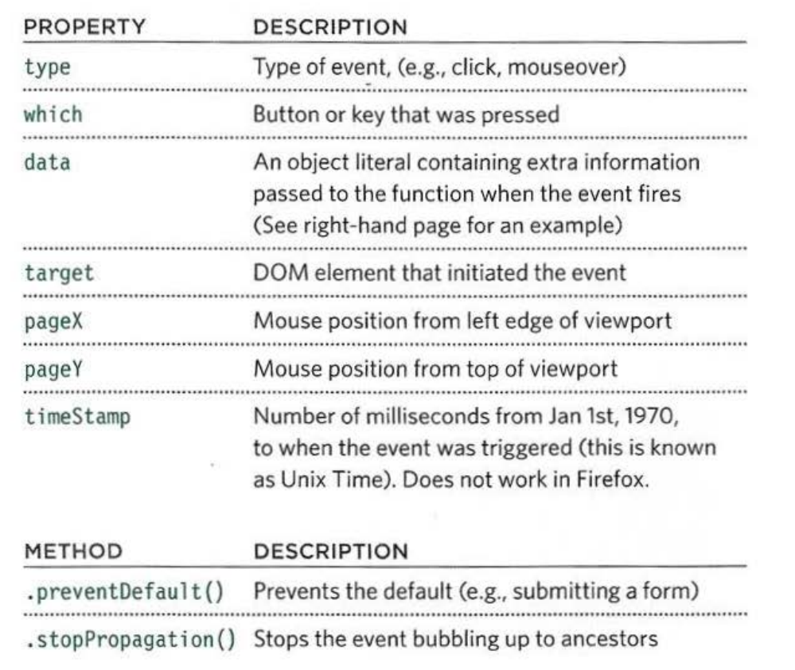

---

### Additional parameters for event handlers

The `.on()` method has two optional properties that let you:

- Filter the initial jQuery selection to respond to a subset of the elements
- Pass extra information into the event handler using object literal notation.

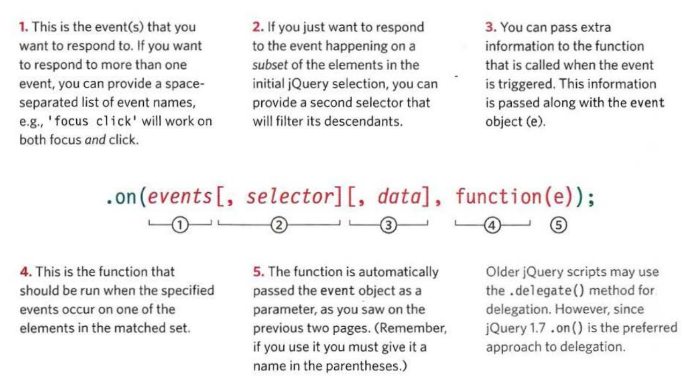

```js
$(function () {
  var listItem, itemStatus, eventType;

  $('ul').on('click mouseover', ':not(#four)', { status: 'important' }, function (e) {
    listItem = 'Item: ' + e.target.textContent + '<br />';
    itemStatus = 'Status: ' + e.data.status + '<br />';
    eventType = 'Event: ' + e.type;
    $('#notes').html(listItem + itemStatus + eventType);
  });
});
```

---

## Effects & Animation

### Effects

effects methods can enhance your web page with transitions and movement.

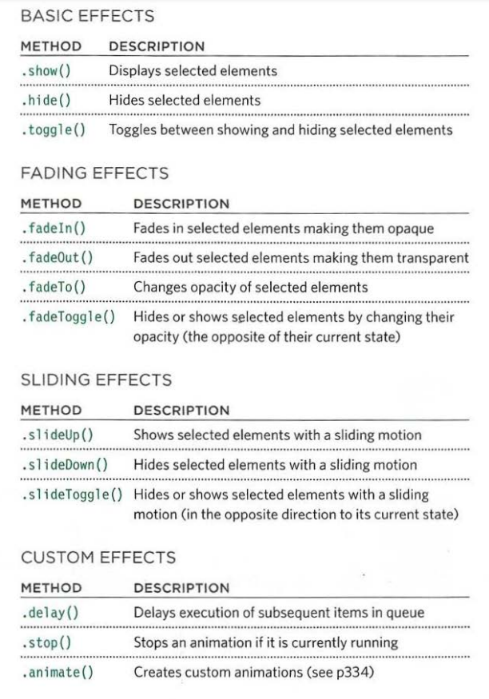

```js
$(function () {
  $('h2').hide().slideDown();
  var $li = $('li');
  $li.hide().each(function (index) {
    $(this)
      .delay(700 * index)
      .fadeIn(700);
  });

  $li.on('click', function () {
    $(this).fadeOut(700);
  });
});
```

---

### Animation

The `.animate()` method allows you to create some of your own effects and animations by changing CSS properties.

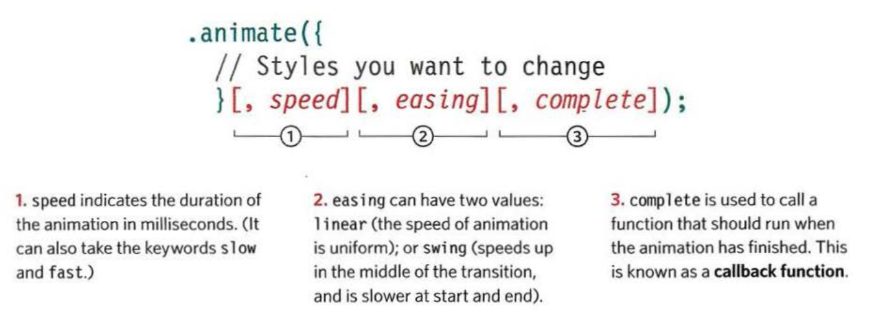

```js
$(function () {
  $('li').on('click', function () {
    $(this).animate(
      {
        opacity: 0.0,
        paddingLeft: '+=80'
      },
      500,
      function () {
        $(this).remove();
      }
    );
  });
});
```

---

## JQUERY & AJAX

### requests

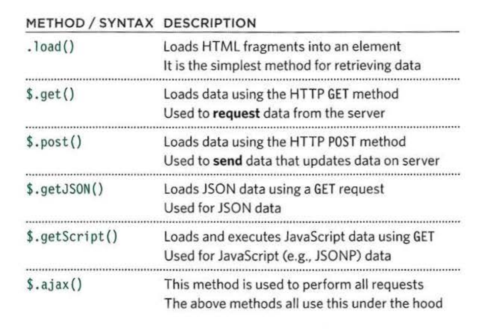

> The `$.ajax()` method gives you greater control over Ajax requests.

You can see that the other five methods are written differently. They are methods of the **global jQuery object**, which is why they start with `$`. They only request data from a server; they do not automatically use that data to update the elements of a matched set, which is why the `$` symbol is not followed by a selector.

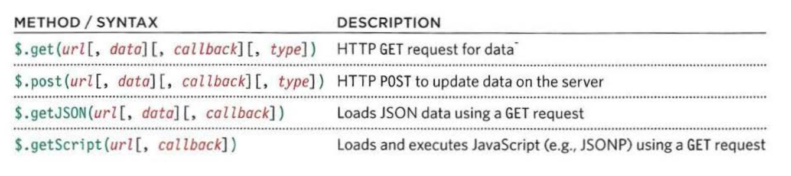

- **url** specifies where the data is fetched from.
- **data** provides any extra information to send to the serve
- **callback** indicates that the function should be called when data is returned (can be named or anonymous).
- **type** shows the type of data to expect from the server.

---

### responses

When using the `.load()` method, the HTML returned from the server is inserted into a jQuery selection. For the other methods, you specify what should be done when the data that is returned using the **jqXHR object**.

> jQuery has an object called **jqXHR**, which makes it easier to handle the data that is returned from the server.

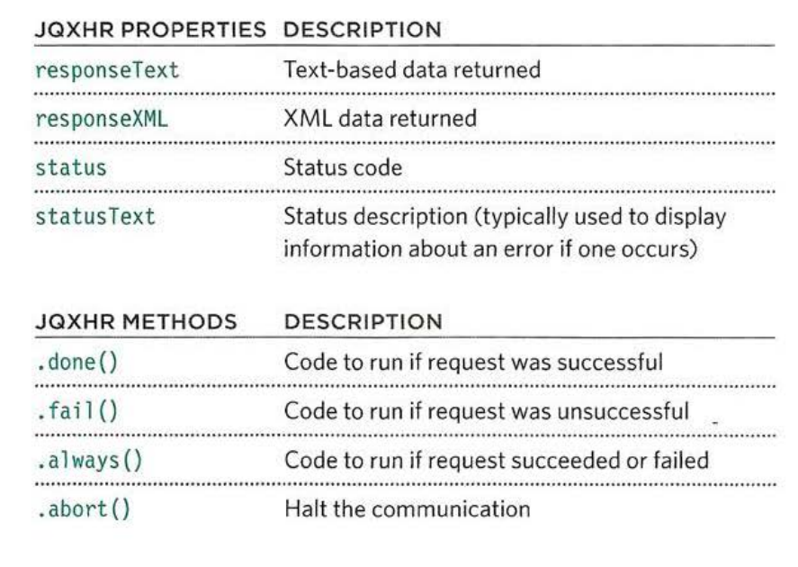

---

### Sending forms using AJAX

To send data to the server, you are likely to use the `.post()` method. jQuery also provides the `.serialize()` method to collect form data.

- collecting form data using `.serialize()` method -> this method does:
  - Selects all of the information from the form
  - Puts it into a string ready to send to the server
  - Encodes characters that cannot be used in a query string
- Sending form data using `.post()` method -> this method does:
  - It takes the same three parameters as the `.get()` method
    1. The name of the file on the (same) server that will process the data from the form
    2. The form data that you are sending
    3. The callback function that will handle the response from the server

```js
$('#register').on('submit', function (e) {
  // When form is submitted
  e.preventDefault(); // Prevent it being sent
  var details = $('#register').serialize(); // Serialize form data
  $.post('register.php', details, function (data) {
    // Use $.post() to send it
    $('#register').html(data); // Where to display result
  });
});
```

---

## JQUERY METHODS FOR FILTERING & SORTING

jQuery collections are array-like objects representing DOM elements. They have similar methods to an array for modifying the elements.

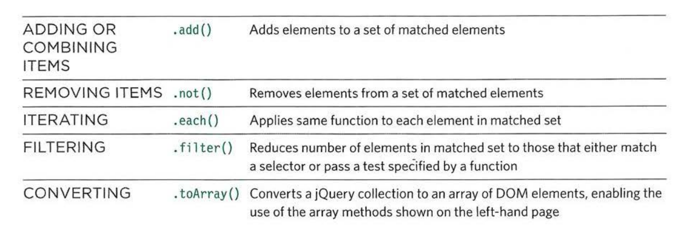

---

## Notes

- **Plugins** are scripts that extend the functionality of the jQuery library. Hundreds have been written and are available for you to use.
  - How to choose a plugin?
    - When was the plugin last updated?
    - How many people are watching the plugin?
    - What do the bug reports say?
- jQuery is an example of a **Library**, The concept of a library is that it allows you to borrow code from one file and use its `functions`, `objects`, `methods`, and `properties` in another script.
  - One of the main drawbacks with a library is that they will usually contain functionality that you will not need to use. This means users have to download code that will not be needed (which can slow your site down).
