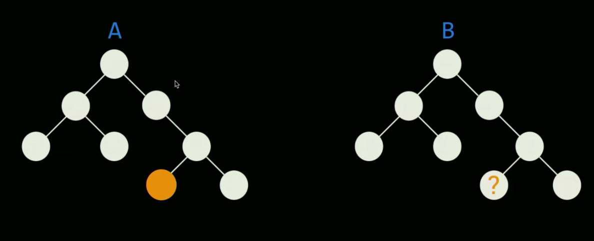

# INDEX

- [INDEX](#index)
  - [`this` keyword](#this-keyword)
  - [Functions](#functions)
  - [Interview Questions](#interview-questions)

---

## `this` keyword

- A dynamically evaluated method call can lose `this`.

  ```js
  let user = {
    name: 'John',
    hi() {
      alert(this.name);
    },
    bye() {
      alert('Bye');
    }
  };

  user.hi(); // works

  // now let's call user.hi or user.bye depending on the name
  (user.name == 'John' ? user.hi : user.bye)(); // Error!
  ```

  - Explanation:
    - Looking closely, we may notice two operations in `obj.method()` statement:
      1. First, the dot `'.'` retrieves the property `obj.method`.
         - the dot `'.'` returns not a function, but **a value of the special `Reference Type`**.
      2. Then parentheses `()` execute it.
         - When parentheses `()` are called on the `Reference Type`, they receive the full information about the object and its method, and can set the right **`this`**.
         - Any other operation like assignment `user.hi` discards the reference type as a whole, takes the value of `user.hi` (a `function`) and passes it on. So any further operation “loses” **`this`**.
  - Solution:
    - we can use `func.bind()`

---

## Functions

- JavaScript does not auto-insert a semicolon before a bracket `()`

  ```js
  let user = {
    name: 'John',
    go: function () {
      alert(this.name);
    }
  }(user.go)(); // error!
  ```

  - Explanation:

    - The error appears because a **semicolon** is missing after `user = {...}`.
    - JavaScript does not auto-insert a semicolon before a bracket `(user.go)()`, so it reads the code like:

      ```js
      let user = { go:... }(user.go)()
      ```

  - Solution:

    - If we insert the semicolon, all is fine:

      ```js
      let user = {
        name: 'John',
        go: function () {
          alert(this.name);
        }
      };

      user.go(); // John
      ```

---

## Interview Questions

**Reference** -> [Front End Interview Handbook
](https://www.frontendinterviewhandbook.com/)

- What are `call()` and `apply()`?

  - **short answer:** They're ways of changing scope of `this` inside a function.

  - **detailed answer:**
    - `call()` and `apply()` are predefined JavaScript methods.
    - Both methods can be used to invoke a function, and both methods must have the owner object as first parameter.
    - `call()` takes series of function arguments separately.
    - `apply()` takes the function arguments in an array.

- How can you tell if an image element is loaded on a page?

  - Use the `complete` property of the image element.

    ```js
    if (document.getElementById('myImg').complete) {
      // do something
    }
    ```

- What is event delegation?
  - It is a technique involving adding event listeners to a parent element instead of adding them multiple times to the descendant elements.
- What is a worker? and when would you use one?

  - A worker is a JavaScript process that runs in the background independently of other scripts and without affecting the performance of the page.
  - You can use workers to perform tasks such as:
    - Simulating user interaction by generating events and performing DOM manipulation.
    - Calculating data without blocking the UI.
    - Parsing large JSON files.
    - Generating images.
    - Implementing an infinite scroll.
  - When to use a worker:
    - When you need to perform a complex task that doesn't need to be executed immediately.
    - When you need to perform a CPU-intensive task without blocking the UI.
    - When you need to perform a series of tasks that can be executed in parallel.

- Can you implement a `bind()` function? (How to change scope)

  ```js
  Function.prototype.bind = function (scope) {
    const fn = this; // "this" is the function that will be bound
    return function () {
      return fn.call(scope); // "scope" is the object to bind to
    };
  };

  // Using it
  const myBoundFunction = myFunction.bind(myObject);
  ```

  - Follow up: How can you handle argument in your solution?

    ```js
    Function.prototype.bind = function (scope) {
      const fn = this;
      return function () {
        return fn.apply(scope, [...arguments]);
      };
    };
    ```

- What is **Debounce** and **Throttle**?

  - **Debounce** and **Throttle** are two similar (but different!) techniques to control how many times we allow a function to be executed over time.
  - **Debounce** will fire only once every **n** milliseconds, while **Throttle** will fire every **n** milliseconds.
    - **Debounce** will wait **n** milliseconds after the last function call to actually call the function.
    - **Throttle** will execute the function every **n** milliseconds, ignoring calls that happen in-between.

  ```js
  // Debounce
  function debounce(fn, time) {
    let timeoutId;
    return function () {
      clearTimeout(timeoutId); // clear the previous timeoutId to avoid calling the function multiple times
      timeoutId = setTimeout(() => fn.apply(this, arguments), time); // "this" is the context of the function
    };
  }

  // Throttle
  function throttle(fn, time) {
    let called = false;
    return function () {
      if (!called) {
        called = true;
        setTimeout(() => {
          fn.apply(this, arguments);
          called = false;
        }, time);
      }
    };
  }
  ```

  - Follow-up: where these techniques are used in real FE applications?
    - **Debounce** is used in `search` bars, so that the search function is not called every time the user types a letter, but only after the user stops typing for a certain amount of time.
    - **Throttle** is used in `scroll` events, so that the function is not called every time the user scrolls, but only after a certain amount of time has passed.

- We have 2 identical `DOM` trees, `A` and `B`. For `DOM` tree `A` we have the `location` of an element. Create a function to find that element in `DOM` tree `B`
  

  - This is a **Reverse-Back** algorithm, meaning that we start from the element we want to find, and we traverse the DOM tree **upwards** to the root. Then, we traverse the DOM tree **downwards** to the element we want to find in the other DOM tree.

    ```js
    function reversePath(element, root) {
      const path = []; // path to the element from the root
      let pointer = element;

      // 1. Traverse the DOM tree Upwards to the root
      while (pointer.parentNode) {
        // get the index of the current node in the parent
        const index = [...pointer.parentNode.children].indexOf(pointer);
        path.push(index);
        pointer = pointer.parentNode;
      }

      // 2. Traverse the DOM tree Downwards to the element we want to find
      pointer = root;
      // now, path has the indexes from the target node to the root
      while (path.length) {
        pointer = pointer.children[path.pop()];
      }
      return pointer;
    }
    ```

- Create a function that moves an element **(Rendering Performance)**

  - Hint: usually here, the interviewer wants to see if you know about `requestAnimationFrame()`, which is a method that tells the browser that you wish to perform an animation and requests that the browser calls a specified function to update an animation before the next **repaint**.

    ```js
    function moveElement(element, duration, distance) {
      const start = performance.now(); // get the start time

      function move(currentTime) {
        const elapsed = currentTime - start; // get the time since the animation started
        const progress = elapsed / duration; // calculate how far along the animation is (ratio of the elapsed time to the total duration)
        const amountToMove = progress * distance; // calculate how far we should move the element

        // move the element
        element.style.transform = `translateX(${amountToMove}px)`;

        // stop the animation after the specified duration
        if (amountToMove < distance) {
          requestAnimationFrame(move); // call the function again to repeat the animation loop
        }
      }
      requestAnimationFrame(move);
    }
    ```

    - trick: usually how the `easing` in animation happens is from changing of the `amountToMove` in the `move()` function.

- Given this function, how can you convert it into a `Promise` ?

  ```js
  // input
  function getData(callback) {
    setTimeout(() => callback('data'), 1000);
  }

  // Solution
  function getData() {
    return new Promise(resolve => {
      setTimeout(() => resolve('data'), 1000);
    });
  }
  ```

- Can you trigger a `Sleep` in Javascript?

  - No, you can't. JavaScript is a single-threaded language, meaning that only one task can be executed at a time. If you block the thread, the browser UI will be blocked as well, and the user won't be able to interact with the page.
  - one trick is to make a function sleeps and not the main thread

    - To do so use `await` in `async` function with a `timeout` function

      ```js
      function sleep(ms) {
        return new Promise(resolve => setTimeout(resolve, ms));
        // we use a promise to make the function asynchronous and wait for the specified amount of time before resolving it
      }

      async function demo() {
        console.log('Taking a break...');
        await sleep(2000);
        console.log('Two seconds later, showing sleep in a loop...');
      }
      ```

    - funny fact: this is similar to `promisify()` function in `node.js`

- what does double brackets mean in properties, ex: `[[prototype]]`?

  - These are **internal properties** that are not accessible directly from the code, but only indirectly through other internal mechanisms.

- How to get the last element in the array in multiple ways?

  ```js
  const arr = [1, 2, 3, 4, 5];

  // 1. using length
  const lastElement = arr[arr.length - 1];

  // 2. using slice
  const lastElement = arr.slice(-1)[0];

  // 3. using at
  const lastElement = arr.at(-1);

  // 4. using pop
  const lastElement = arr.pop();
  ```

- What will happen if you used `forEach` on a `Set`?

  - `forEach` will iterate over the values of the `Set`. where the `index`/`key` will be the same as the `value`.

    ```js
    const set = new Set(['a', 'b', 'c']);
    set.forEach((value, key) => console.log(value, key));
    // a a
    // b b
    // c c
    ```
