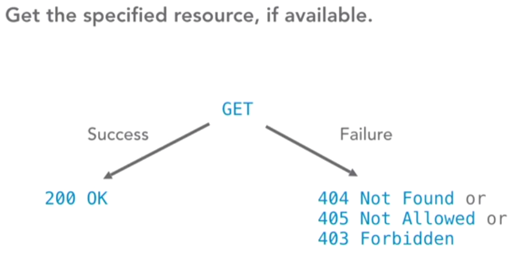
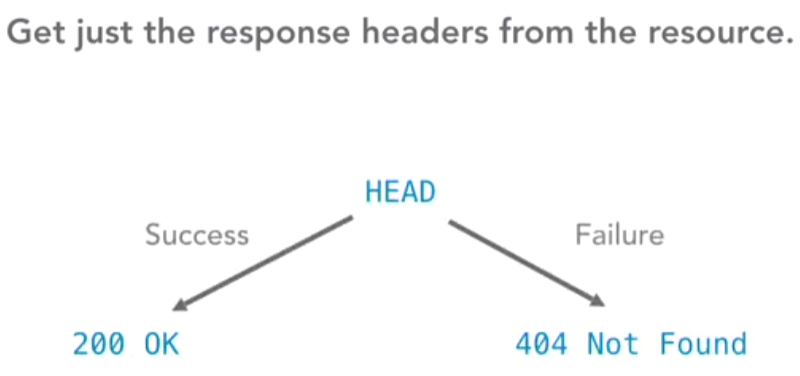
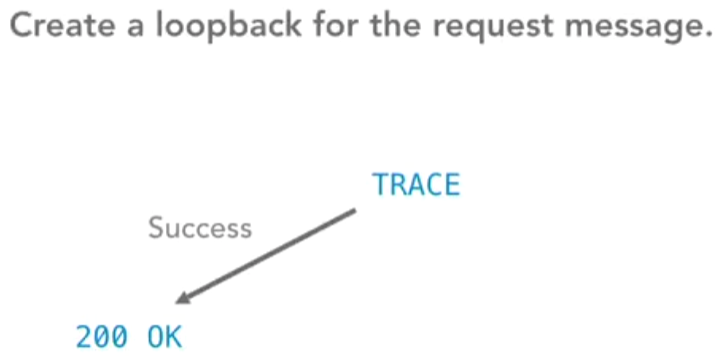

# INDEX

- [INDEX](#index)
  - [HTTP](#http)
    - [HTTP History](#http-history)
    - [HTTP/3 (Not important 🚫)](#http3-not-important-)
      - [Why we need HTTP/3](#why-we-need-http3)
      - [What Is QUIC](#what-is-quic)
  - [URL `universal resource locator`](#url-universal-resource-locator)
  - [HTTP Request Methods](#http-request-methods)
    - [Content methods](#content-methods)
    - [Information-getter methods](#information-getter-methods)
  - [HTTP status messages](#http-status-messages)
  - [HTTP headers](#http-headers)
    - [Cookies](#cookies)
    - [HTTP Security risks](#http-security-risks)
  - [HTTPS](#https)
    - [Why we need HTTPS ?](#why-we-need-https-)
    - [How HTTPS works ?](#how-https-works-)
    - [Handshake](#handshake)
    - [Enabling HTTPS on Your Servers](#enabling-https-on-your-servers)

---

## HTTP

> Reference: [MDN HTTP](https://developer.mozilla.org/en-US/docs/Web/HTTP/Overview)

HTTP (**Hypertext Transfer Protocol**), is the format used to structure request and responses for effective communication between a client and a server.

It's a `TCP/IP` application layer protocol designed to transfer information between networked devices and runs on top of other layers of the network protocol stack.

> "Application layer" refers to one of the seven layers of the [Open Systems Interconnection (OSI) model](./Internet.md#osi-model), which is used to describe the flow of data between two nodes in a network. The application layer is the seventh layer of the OSI model.

- The message that is sent by a client to a server is what is known as an `HTTP request`. When these requests are being sent, clients can use various methods.

  - HTTP methods indicate the specific desired action to be performed on a given resource.

- HTTP is a **stateless** protocol. That means each individual request sent over the protocol is unique and hat each command runs independent of any other command.

  - HTTP doesn't remember previous requests.
    - Go to a web page with a photo gallery, and it will show you the first picture. Go reload your browser or type in the URL again and it will re-request the first picture again.
  - This `statelessness` ensures users don't get trapped in the middle of **sequences** of content, but it also means they can't walk their way through sequences because the requests are not connected.
    - To fix this, HTTP allows `sessions`.

- `sessions` : Stored states shared between the browser and the server by passing information back and forth in the form of `cookies`.

---

### HTTP History

- `HTTP/0.9`
  - only `GET` method was supported and designed to transfer `HTML` documents.
- `HTTP/1.0`
  - `GET`, `POST`, `HEAD` methods and headers were supported and can deal with different types of data (images, videos, etc..)
  - drawback: couldn't have multiple requests at the same time which led to ("Three-way handshake")
- `HTTP/1.1`
  - More methods were added (`PUT`, `DELETE`, ...) and added `Host` header to support multiple websites on the same IP address.
  - Enabled **"persistent connections" (keep-alive)** which means that the connection between the client and the server will be kept open after the first request, so that the client can send multiple requests over the same connection.
  - Included proxy authentication, caching, and more.
- `HTTP/2`

  - It was designed for modern websites and applications to ensure low latency.
  - `Binary Protocol` : HTTP/2 uses binary format instead of text format which makes it faster and more secure.
  - `Multiplexing` : multiple requests can be sent at the same time over the same connection.
    - data will be broken-down and send in chunks according to the priority of the request.
  - `Server Pushing` : multiple responses for a single request.
    - the server can send multiple responses for a single request, so that the client doesn't have to wait for the server to send the response for each request. the server will assume that the browser wants other files like (`css`, `js`), and will send (push) them automatically.
    - > Note: this feature is not used a lot because it's hard to implement and even if it's implemented, it's not always useful. Actually `Chrome` and `Firefox` have disabled this feature by default.
  - `Header Compression` : headers are compressed using a new algorithm called `HPACK` which reduces the size of the headers by `80%`.
  - `Security` : `HTTP/2` requires `HTTPS` to work.

---

### HTTP/3 (Not important 🚫)

Summary: HTTP/3 is a new version of HTTP protocol that uses QUIC instead of TCP. It was designed to improve performance and security but it's not widely used yet.

More details here: [HTTP/3 From A To Z](https://www.smashingmagazine.com/2021/08/http3-core-concepts-part1/)

#### Why we need HTTP/3

we didn’t really need a new `HTTP` version in the first place, but rather an upgrade of the underlying Transmission Control Protocol (**TCP**).

> **TCP** is the main protocol that provides crucial services such as reliability and in-order delivery to other protocols such as HTTP. It’s also one of the reasons we can keep using the Internet with many concurrent users, because it smartly limits each user’s bandwidth usage to their fair share.

TCP has been a cornerstone of the web for decades, but it started to show its age in the late 2000s. Its intended replacement, a new transport protocol named **QUIC**, differs enough from TCP in a few key ways that running HTTP/2 directly on top of it would be very difficult. As such, HTTP/3 itself is a relatively small adaptation of HTTP/2 to make it compatible with the new QUIC protocol, which includes most of the new features people are excited about.

QUIC is needed because TCP, which has been around since the early days of the Internet, was not really built with maximum efficiency in mind.

- For example, TCP requires a **handshake** to set up a new connection.
  - This is done to ensure that both client and server exist and that they’re willing and able to exchange data. It also, however, takes a full network round trip to complete before anything else can be done on a connection. If the client and server are geographically distant, each round-trip time (RTT) can take over 100 milliseconds, incurring noticeable delays.
- TCP sees all of the data it transports as a **single “file” or byte stream**.
  - even if we’re actually using it to transfer several files at the same time (for example, when downloading a web page consisting of many resources). In practice, this means that if TCP packets containing data of a single file are lost, then all other files will also get delayed until those packets are recovered.
  - This is called **head-of-line (HoL) blocking**.

HTTP/2 was adjusted in a few key areas to make it compatible with QUIC. This tweaked version was eventually named HTTP/3 (instead of HTTP/2-over-QUIC), mainly for marketing reasons and clarity. As such, the differences between HTTP/1.1 and HTTP/2 are much more substantial than those between HTTP/2 and HTTP/3.

---

#### What Is QUIC

QUIC is a generic transport protocol which, much like TCP, can and will be used for many use cases in addition to HTTP and web page loading. For example, DNS, SSH, SMB, RTP, and so on can all run over QUIC.

- QUIC runs on top of yet another protocol, called the **User Datagram Protocol (UDP)**.

> **UDP** is the most bare-bones transport protocol possible. It really doesn’t provide any features, besides so-called port numbers (for example, HTTP uses port 80, HTTPS is on 443, and DNS employs port 53). It does not set up a connection with a handshake, nor is it reliable: If a UDP packet is lost, it is not automatically retransmitted. UDP’s “best effort” approach thus means that it’s about as performant as you can get: There’s no need to wait for the handshake and there’s no HoL blocking. In practice, UDP is mostly used for live traffic that updates at a high rate and thus suffers little from packet loss because missing data is quickly outdated anyway (examples include live video conferencing and gaming).

---

## URL `universal resource locator`

It is a human-readable address, describing exactly where on the web and in what location on a server the information you are requesting is located.

---

## HTTP Request Methods

- HTTP request is an action to be performed on a resource identified by a given Request-`URL`
- **HTTP method**, sometimes referred to as an HTTP `verb`, indicates the action that the HTTP request expects from the queried server.

### Content methods

- `GET` vs `POST`

  - `GET`:
    - **retrieve** data from the server
    - it can be used to send small amounts of data to the server using the query string (in the URL)
    - it doesn't have a request `body`, it only has `headers`
    - Sending data through the query string is **not secure** and should be avoided
    - requests can be cached and bookmarked -> `Proxy`
      - this is because `GET` requests are **idempotent** (multiple identical requests have the same effect as one single request)
    - limited amount of data can be sent
  - `POST`:
    - **send** data to the server
    - it can be used to send large amounts of data to the server using the request `body`
    - more secure than `GET` because the data is not visible in the URL
    - requests are never cached and cannot be bookmarked -> `No Proxy`
    - unlimited amount of data can be sent and bigger `payload` size

- `PUT` vs `PATCH`
  - `PUT`: **replace** a source in collection
  - `PATCH`: **modify** a source in collection

---

### Information-getter methods

- methods that get information from the server without really touching the content
- The `HEAD` request method is useful in recovering meta-data that is written according to the headers, without transferring the entire content. The technique is commonly used when testing hypertext links for accessibility, validity, and recent modification.

---

## HTTP status messages

HTTP status codes are **3-digit codes** most often used to indicate whether an HTTP request has been successfully completed. Status codes are broken into the following 5 blocks:

> **`304`** means that you made **`200OK`** request then requested it again and it got you the same message (not modified), and in the server if you modified the response message and requested again it will be **`200OK`** again

---

## HTTP headers

if a client, or the server, or both, need information about the state of the other, or any other information, **we have to send that information along with our request or response** That's what HTTP headers are for.

- **HTTP headers** contain text information stored in key-value pairs, and they are included in every HTTP request (and response, more on that later). These headers communicate core information, such as what browser the client is using what data is being requested.

---

### Cookies

- If a server wants, or needs, the client to remember where it has been or what state it is in, like what movie the client is currently watching. it can use a set `cookie header`, to give the client a cookie, a small piece of data.
  

- The next time the client visits the server, it sends the cookie back, and the server brings the client to the right state.

  
  

> so in summary: the web is stateless(each request is a new one) so we need cookies to persist data over time (on each request until we expire them)

---

### HTTP Security risks

- `HTTP` is not secure against `man-in-the-middle` attacks.
  - `man-in-the-middle` attack is a type of cyber-attack where a malicious actor inserts him/herself into a conversation between two parties, impersonates both parties and gains access to information that the two parties were trying to send to each other.
  - This is because `HTTP` requests are sent in plain text, so anyone on the network can read them.
- This is one of the reasons why `HTTPS` was created.

---

## HTTPS

### Why we need HTTPS ?

We need HTTPS for **Privacy, integrity, and identification.**

- **Privacy** means that no one can eavesdrop on your messages.
  - without `https`, anyone using the same network can access the requests/responses from a `http` connection, and when using `https` the data sent/received is encrypted using **TLS** protocol
- **Integrity** means that the message is not manipulated on the way to its destination.
  - This is often called a **man-in-the-middle attack**.
  - a manipulation could be done by a malware
- **identity** means that I can check that this message is coming from what computer.
  - When visiting a HTTPS website (ex: `www.google.com`) , the browser receives a certificate that the server is actually `google.com` and not other server who is pretending to be `google.com`
  - this is done using A **digital signature** attached to a message can identify the sender
  - identification means that the site that you are visiting is indeed the one you think it is.
  - HTTPS, via **SSL certificates** (secure socket layer), ensures you are connected exactly with the receiver you would expect.

HTTPS also gives us **PWA capabilities**

> a lot of websites are now using HTTPS by default, regardless if sensitive data is going to be exchanged or not. This is because Google is flagging websites as **not secure** if they're not SSL protected.

---

### How HTTPS works ?

- It makes requests secure by encrypting the data using **TLS** protocol.
- This mean that the data is encrypted before being sent and decrypted after being received.
- The encryption is done using **asymmetric encryption** (public key encryption) and **symmetric encryption** (private key encryption)
  - This is done in the `SSL handshake` process.

---

### Handshake

It's the negotiation between a browser and a server where they both established a secure connection to transmit messages.

- During an **SSL handshake**, the server and the client follow the below set of steps:

  1. The client will send the information that will be required by the server to start an HTTPS connection.
  2. Server will send the information that will be required by the client to start an HTTPS connection.
  3. Server Key Exchange Message
  4. SSL Certificate Request (from server to client)
  5. SSL Client Certificate (from client to server to authenticate the client)
  6. Client Key Exchange Message (Secure Connection Established ✅)

> All these steps are done in the `OSI model` layer 5 (session layer)

---

### Enabling HTTPS on Your Servers

- Follow steps [here](https://web.dev/articles/enable-https)
