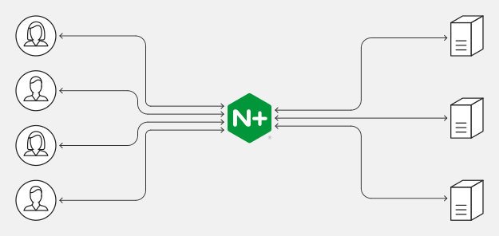

# INDEX

- [INDEX](#index)
  - [Networking](#networking)
    - [OSI Model](#osi-model)
  - [Internet](#internet)
    - [What is Internet](#what-is-internet)
    - [How internet works](#how-internet-works)
  - [Important Concepts](#important-concepts)
    - [Client / Server](#client--server)
    - [IP address](#ip-address)
    - [Packet](#packet)
    - [ISP](#isp)
    - [SSL](#ssl)
    - [TCP/IP](#tcpip)
      - [TCP vs UDP](#tcp-vs-udp)
    - [Domain and DNS](#domain-and-dns)
      - [DNS Records (not important 🚫)](#dns-records-not-important-)
      - [Hosting](#hosting)
    - [SSL / TLS](#ssl--tls)
  - [Application Protocols](#application-protocols)
    - [HTTP](#http)
  - [SSH](#ssh)
    - [How It Works](#how-it-works)
    - [Different Encryption Techniques](#different-encryption-techniques)
      - [Symmetric Encryption](#symmetric-encryption)
      - [Asymmetric Encryption](#asymmetric-encryption)
      - [Hashing](#hashing)
    - [Connecting using SSH](#connecting-using-ssh)
  - [Nginx](#nginx)
    - [Configuration](#configuration)
    - [Web server vs Application server](#web-server-vs-application-server)
  - [Performance](#performance)

---

## Networking

- Here's the network steps in order:
  
  1. `Modem` -> converts the signal from the `ISP` to a signal that the router can understand.
  2. `Router` -> it's the device that connects your devices to the internet
  3. `Switch` -> it's the device that connects your devices to the router (it's like a router but for local network) -> it sends the data to the right device
  4. `Network Interface Card (NIC)` -> it's the device that connects your device to the switch
  5. `Home router` -> it's the device that connects your devices to the internet
     - It's a multi-functional device -> `modem` + `router` + `switch`

### OSI Model

**Open System Interconnection (OSI)**: : It's a standard that defines the steps of the network communication between two systems.


When entering a website, the data goes through all the layers of the OSI model like this:

1. **Application layer** -> the data is in the form of a message (ex: `HTTP` request)
   - Here, it processes the data and adds the **header** to it + it resolves the `domain` name to the `ip` address
2. **Presentation layer** -> It's the layer that converts the data to a format that the application can understand

   - The encryption happens here (if the website is using `HTTPS`) using **TLS** (formerly known as **SSL**) protocol

   ```sh
    # Before encryption
    GET / HTTP/1.1
    Host: www.example.com
    User-Agent: Mozilla/5.0 (Windows NT 10.0; Win64; x64; rv:89.0) Gecko/20100101 Firefox/89.0
    Upgrade-Insecure-Requests: 1

    # After encryption
    GET / HTTP/1.1
    JRPKJSDFDAADSFHDUASFHADJSHFDSALFGUEAHGFJDSEANFJADHUFHEUFGAESYBFGHES
    Host: 196.145.54.11
    JRPKJSDFDAADSFHDUASFHADJSHFDSALFGUEAHGFJDSEANFJADHUFHEUFGAESYBFGHES
   ```

3. **Session layer** -> It's the layer that creates and manages (opens / closes) the connection between the client and the server

   - It's possible to directly work with this layer to handle the connection (as a frontend developer)

4. **Transport layer** -> It's the layer that is responsible for the **End to End** connection between devices (Making sure that the actual communication happens after the connection is established in the `session` layer)

   - It splits the data into `packets` and sends them to the server
   - this is done in the `TCP` protocol (it's a protocol that ensures that the data is sent and received correctly)
   - the size of the `TCP` packet (segment) is `64kb` (it's the maximum size of the packet) and sometimes it's less than that based on the network speed and the size of the data

5. **Network layer** -> It's the layer that is responsible for the communication between **inter & intra** networks (it's the layer that connects the `local` network to the `internet`)

   - It adds the `ip` address to the `packet` and sends it to the server

6. **Data-link layer** -> It's the layer that facilitates the communication between the **devices in the same network**.

   - It connects the `switch` to the `router` using the `mac` address
     - `mac` address is the address of the device (it's unique for each device)
   - It adds the `mac` address to the `packet` and sends it to the server

7. **Physical layer** -> It's the layer that is responsible for transferring `bits` of data over the network using the `cable`.

   - It sends the `packet` to the server using the `cable`
   - At this stage the data is in this form:
      1. `http data` -> from the `application` layer 2. `tcp segment` -> from the `transport` layer 3. `ip packet` -> from the `network` layer 4. `Ethernet frame` -> from the `data link` layer
   - The cable is made of `copper` or `fiber` (fiber is faster than copper)

After all of this, the server receives the data and it goes through the same steps **but in reverse order**


---

## Internet

### What is Internet

The internet is a global network of computers that communicate with each other (network of computer networks) using a common set of rules. These rules are called **protocols**.

> The internet was developed in the late 1960s by the United States Department of Defense as a means of creating a decentralized communication network that could withstand a nuclear attack

- **Network**: is a group of computers / systems that can communicate with each other.

- The internet has **three** basic parts: (Not important 🚫)

  - **The last mile**
    - is the part of the internet that connects homes and small businesses to the internet.
    - it's called **last mile** as it's the last (outer) layer of the internet where user can access
    - it also includes the towers that allow people to access the internet with their cell phones.
  - **Data centers**
    - rooms full of servers that store user data and host online apps and content.
  - **The backbone**
    - consists of long-distance networks — mostly on fiber optic cables — that carry data between data centers and consumers

---

### How internet works

> watch the first question from [this video](https://www.youtube.com/watch?v=qvyvysDV17w)

The internet works by connecting devices and systems together through a series of routers, switches, and servers using a set of rules called **protocols**.

- `protocol` define how information in exchanged between devices and systems and ensure that data is transmitted reliably and securely.
- The core of the internet is a global network of connected **routers** which are responsible for directing traffic to its destination.
  - When sending data over the internet, it's broken up into small `packets` that are sent from your device to a `router` and then to another `router` until it reaches its destination.
    
- To ensure that `packets` are send and received correctly, the internet uses a protocols like **IP** and **TCP** (Transmission Control Protocol).
  - `TCP` ensures that the data is received in the correct order and that no data is lost or corrupted during transmission.
- In addition to these core protocols, there are many other protocols that are used to enable communication and data-exchange over the internet like:
  - `DNS` (Domain Name System) -> used to translate domain names to IP addresses.
  - `HTTP` (HyperText Transfer Protocol) -> used to transfer data between clients and servers.
  - `HTTPS` (HyperText Transfer Protocol Secure) -> a more secure version of `HTTP` that uses `SSL/TLS` encryption to protect data.
  - `SSL` (Secure Sockets Layer) / `TLS` (Transport Layer Security) -> used to encrypt data and ensure that it's sent and received securely.

---

## Important Concepts

### Client / Server

- **Client**: is a device that requests data from a server.
  - it's not only a browser, it can be a mobile app, a desktop app, another server, ...
- **Server**: is a device that provides data to clients (responds to requests from clients)
  - it's not only a server, it can be a database, a file, another client, ...

They communicate using [Application Protocols](#application-protocols)

---

### IP address

Internet Protocol addresses are unique identifiers assigned to every device connected to a network.

- It's responsible for routing data `packets` to their correct destination.
- Ex: `vox.com` -> `216.146.46.10`

- `IPv6` -> is a `32-bit` number (4 bytes) that represents an IP address
  
  

- Now, there's a new standard called `IPv6` which allows for a much larger number of unique addresses.

---

### Packet

It's a small piece of data that is sent over the internet.

- it contains **MetaData** (where to/from the data is sent and headers ..)

  1. breaking message into small parts
  2. labeling these parts individually
  3. then throwing them into the shared network (the cloud)

- A packet has two parts:
  
  - `header` contains information that helps the packet get to its destination, including the `length` of the packet, its `source` and destination
  - `checksum value` that helps the recipient detect if a packet was damaged in transit.
- transmission speed of packets depend on bandwidth as packet consists of `bytes`
  - bandwidth is number of `bytes` ber `second`
- in order to send the `0 | 1` data we want a way which has low data-loss and can transfer for long distances, thats why we use **light** and not electricity
  - light is transmitted in **fiber / copper** cables

---

### ISP

**Internet Service Provider (ISP)**: is a company that provides customers with internet access by connecting them to its network.

- Ex: `Verizon`, `AT&T`

---

### SSL

SSL, short for **Secure Sockets Layer**, is a family of encryption technologies that allows web users to protect the privacy of information they transmit over the internet.

- That **lock** is supposed to signal that third parties won't be able to read any information you send or receive.
- Under the hood, SSL accomplishes that by transforming your data into a coded message that only the recipient knows how to decipher.
  - if a malicious party is listening to the conversation, it will only see a seemingly random string of characters, not the contents of your emails, Facebook posts, credit card numbers, or other private information.

---

### TCP/IP

**Transmission Control Protocol/Internet Protocol (TCP/IP)**: is a set of rules that governs the connection of devices on the internet and provides a reliable, ordered, and error-checked delivery of data

- TCP/IP key concepts:
  - `Ports` -> is a number that identifies a specific process or service on a computer or server. Each application or service is assigned a unique `port` number, allowing data to be sent to the correct destination.
    - ex: `80` for `HTTP` and `443` for `HTTPS`
  - `Sockets` -> is a combination of an IP address and a port number. It's used to establish a connection between a client and a server.
  - `Connection` -> is a communication channel established between two devices on a network. It's used to exchange data between the two devices.

When building applications with `TCP/IP`, We need to ensure that the application is designed to work with the appropriate `ports`, `sockets`, and `connections`.

#### TCP vs UDP

- `TCP` is a **connection**-oriented protocol (it's like saying "hi" and wait to see if the other side heard it)

  - TCP do this by checking the packets in the receiver part and see if they're complete and all is there
    
  - It provides **reliability** and **error checking**

- `UDP` is a **connection-less** protocol. (it's like yelling "HI!" and assume that the other side heard it and keep sending data like that anyway)

A key difference between TCP and UDP is **speed**, as `TCP` is comparatively slower than `UDP`. Overall, **UDP is a much faster**, simpler, and efficient protocol, However, retransmission of lost data packets is only possible with `TCP`.

---

### Domain and DNS

**Domain name**: is a human-readable address for a website. It’s what you type into a web browser’s address bar to go to a website. it's translated to an `IP` address by the `DNS` server.

- **Domain name system (DNS)**:
  - It's part of the internet infrastructure that translates domain names to IP addresses.
  - It is the phone-book of the Internet
  - DNS servers are connected to each other in a hierarchy or tree-like structure to split responsibility for translating domain names to different `domains` like `.com` or `.org`.
- **Domain**: Is a piece of string that helps to spot a specific web site
  

- `TLD`: top level domain -> `.com`
- `path`: `/about` -> it's the path to the page after the domain
- Modern web browsers are designed by default to **cache** `DNS` records for a set amount of time after they’re first requested.
  

#### DNS Records (not important 🚫)

**DNS records**: they hold information related to your domain name and help people find your website, email servers, and more

**Categories**:

- **NS-records (Name Servers)**: point to your `control center` where all of your other DNS-records will live
  - ex: `GoDaddy`
  - `ns11.domaincontrol.com` or `jeff.ns.cloudflare.com`
- **A-record**: maps name(**the Domain name that you bought**) to IP address -> `www.jemyoung.com` maps to `23.23.185.61`
- **CNAME-record**: maps name(subDomain) to name(id) -> `blog.jemyoung.com` maps to `www.jemyoung.com` then to `23.23.185.61`
- **MX-record**: it's for mail exchanger
- **TXT-record**: text record, allows for adding text to domain name

> You can check that using command: **dig**
> you can look up domain using [mxtoolbox.com](https://mxtoolbox.com/)
> for more detailed info -> [watch this great video](https://www.youtube.com/watch?v=YV5tkQYcvfg)

---

#### Hosting

Shared Hosting vs. VPS (virtual private server) Hosting vs. Dedicated Server


---

### SSL / TLS

It's a protocol used to **encrypt** data being transmitted over the internet. It is commonly used to **provide secure connections** for applications such as web browsers, email clients, and file transfer programs.

- When using `SSL/TLS` to secure internet communication, there are a few key concepts to understand:
  - `Certificate`: is a digital document that contains information about the identity of a website or service. It's used to establish trust between the client and server. It's signed by a **certificate authority (CA)** to verify their authenticity.
  - `Handshake`: is the process of establishing a secure connection where the client and server exchange information about their identity and the encryption algorithms they support.
  - `Encryption`: is the process of encoding data so that only the intended recipient can read it. It's used to protect data from being intercepted by malicious parties.
    - `Public key`: is a long string of characters that is used to **encrypt** data. It is included in the certificate and is publicly available.
    - `Private key`: is a long string of characters that is used to **decrypt** data. It is kept secret and is only known to the owner of the certificate.

---

## Application Protocols

Usually, the client and the server communicate using **Remote Procedure Call (RPC)** or **Representational State Transfer (REST)**.

- **Remote Procedure Call (RPC)**: is a protocol that allows a computer program to execute a subroutine or procedure on another computer without the programmer needing to explicitly code the details for this remote interaction.
- Most of the application-protocols are built on top of `TCP/IP` protocol

### HTTP

is a (request / response) protocol that governs the communication between clients and servers on the internet. It's used to transfer data between clients and servers.

- more here -> [HTTP](./HTTP.md)

---

## SSH

**Secure Socket Shell (SSH)**: is a network `protocol` that allows users to access, control, and modify their remote servers over the internet. (It's a way for computers to talk to each other)


- It's a **secure way to access a computer over an unsecured network**. you can think of it like `HTTPS` but for **remote access and control between computers**.
  
- It depends on 2 keys
  - Public key (`.pub`)
    - used to `encrypt` (lock) data (message)
    - the remote server (cloud) uses this
  - Private Key
    - your computer/server uses this key to **ssh (access) into the server that have the public key**
    - it's used to `decrypt` data and have access (open a box locked with the public key pair.)

> This is great not only for privacy, but also for **identification** since we know for sure that only the owner of the 2 keys can open the message.

### How It Works

- The **SSH command** consists of 3 distinct parts:

  ```sh
  ssh {user}@{host}

  # Ex:
  ssh -i <location_of_Private_key> root@165.22.140.238
  ```

> You can add your private key to keyChain to prevent writing it each time
> 

---

### Different Encryption Techniques

1. Symmetrical encryption
2. Asymmetrical encryption
3. Hashing

#### Symmetric Encryption

is a form of encryption where **one** secret key is used for both `encryption` and `decryption` of a message by both the client and the host.


- It's often called **shared key** or **shared secret encryption**.
- if anyone knows the key, they can decrypt the message (it's not secure)

#### Asymmetric Encryption

Unlike `symmetrical encryption`, Asymmetrical encryption uses **two** separate keys for `encryption` and `decryption`. These two keys are known as the **public key** and the **private key**. Together, both these keys form a public-private key pair.


> A public key can be used by any individual to encrypt a message and can only be decrypted by the recipient who possesses their particular private key, and vice versa.

#### Hashing

One-way-hash functions differ from the above two forms of `encryption` in the sense that they are never meant to be `decrypted`. They generate a unique value of a fixed length for each input that shows no clear trend which can be exploited. This makes them practically impossible to reverse.

- It's used to hash the data sent from the client to the server to ensure that the data is not changed during the transmission by a hacker

---

### Connecting using SSH

1. You can use the `password` but it can be compromised by hacker
2. You can Create SSH Keys -> **rsa**

   - create a public key and a private key to use them to connect to the server
   - `rsa` is a type of encryption algorithm that uses 2 keys (public and private)
   - you can create them using `ssh-keygen` command

     ```sh
     ssh-keygen -t rsa -b 4096 -C "
     # this generates 2 files:
      # 1. id_rsa -> private key
      # 2. id_rsa.pub -> public key
     ```

---

## Nginx




NGINX is open source software for **web serving**, **reverse proxying**, **caching**, **load balancing**, **media streaming**, and more.

- NGINX can also function as a **proxy server** for email (IMAP, POP3, and SMTP) and a **reverse proxy** and **load balancer** for HTTP, TCP, and UDP servers.
- when you go to a domain/DNS of a local/remote running server -> nginx says hey, I know where to go, I will direct you to the default page or what page is in configuration
  
- it works on **port 80** in default
- you can add **HTTPS** to nginx using [Certbot](https://certbot.eff.org/)
  - it will modify your nginx configuration

> **proxy server** is a go‑between or intermediary server that forwards requests for content from multiple clients to different servers across the Internet.

### Configuration

- **Redirect** -> for redirecting to a temporary/permanent page in case of a certain response code (`ex: 404`)
- **Subdomain** :
  
- **Gzip settings** -> for file-compression and performance and power

### Web server vs Application server


**Web server**: accepts and fulfills requests from clients for **static content** (i.e., HTML pages, files, images, and videos) from a website. Web servers handle HTTP requests and responses only.

- Ex: `nginx`

**Application server**: exposes **business logic** to the clients, which generates dynamic content. - It is a software framework that transforms data to provide the specialized functionality offered by a business, service, or application. Application servers enhance the interactive parts of a website that can appear differently depending on the context of the request.

- EX: `node.js`

---

## Performance


- [FE performance](./FrontEnd.md#performance)
- [BE performance](./BackEnd.md#performance)

---
