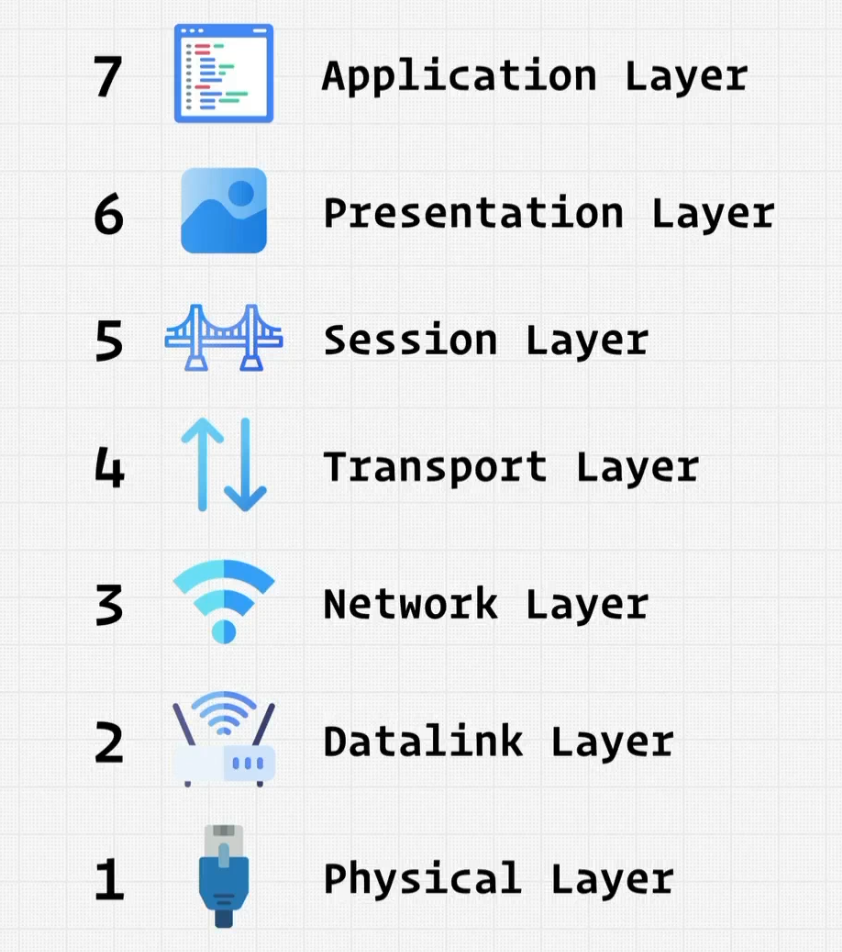
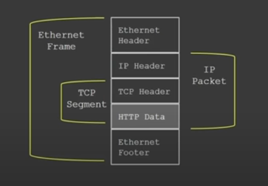
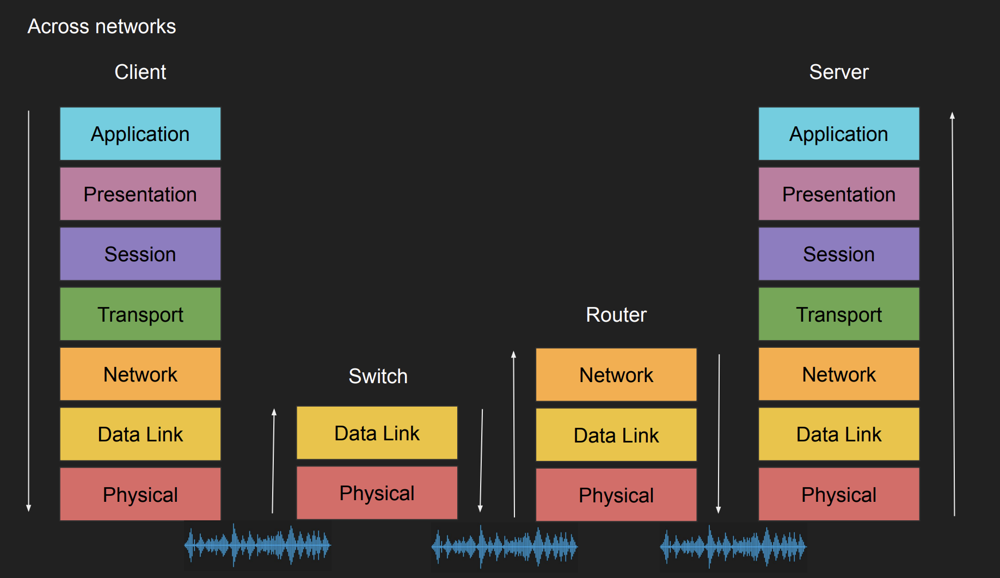
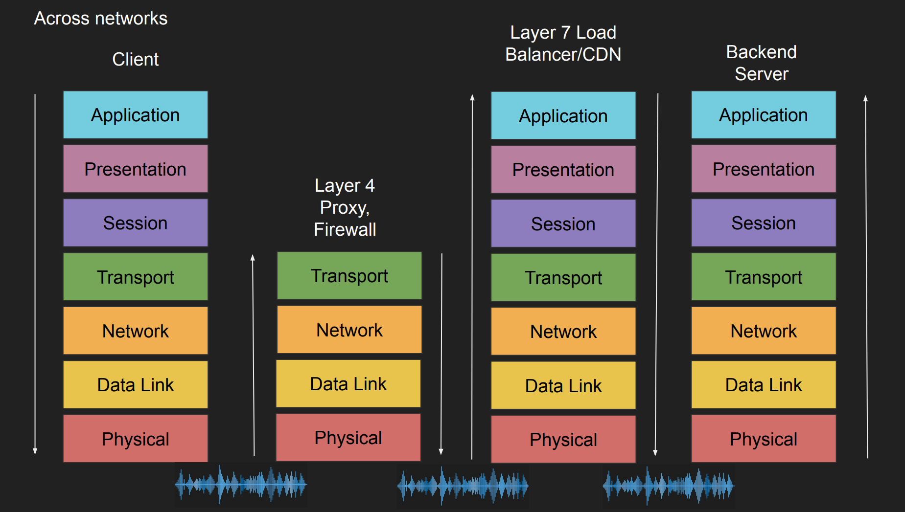
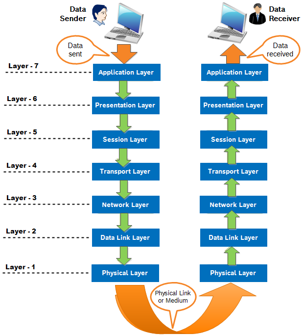
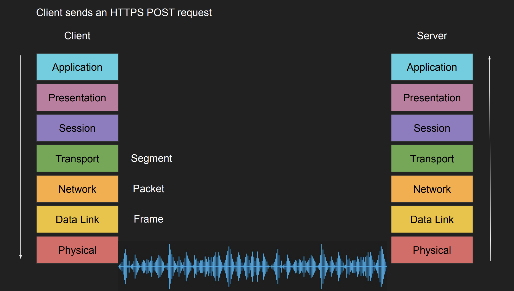
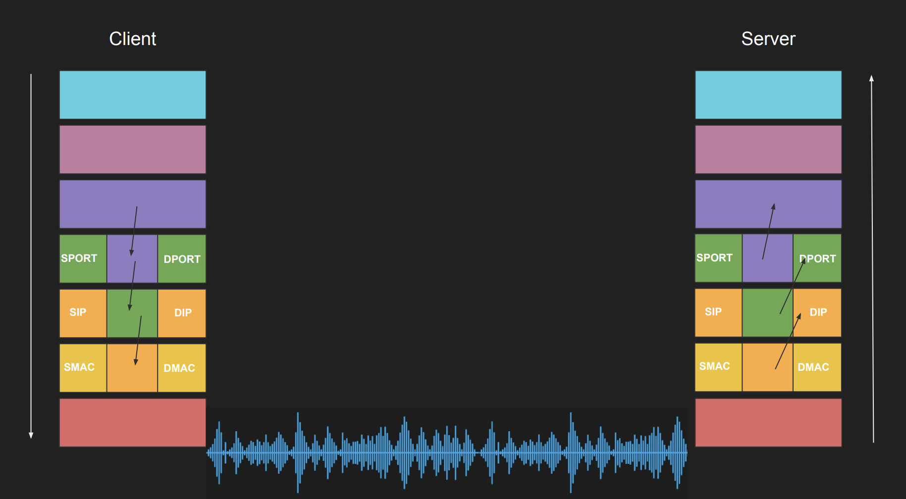

# INDEX

- [INDEX](#index)
  - [Networking](#networking)
    - [Client-Server Architecture](#client-server-architecture)
  - [Network Models](#network-models)
    - [OSI Model](#osi-model)
      - [OSI layers in details](#osi-layers-in-details)
      - [OSI Examples](#osi-examples)
      - [Shortcomings of the OSI model](#shortcomings-of-the-osi-model)
    - [TCP/IP Model](#tcpip-model)
  - [Host to Host Communication](#host-to-host-communication)

---

## Networking

- Here's the network steps in order:
  
  1. `Modem` -> converts the signal from the `ISP` to a signal that the router can understand.
  2. `Router` -> it's the device that connects your devices to the internet
  3. `Switch` -> it's the device that connects your devices to the router (it's like a router but for local network) -> it sends the data to the right device
  4. `Network Interface Card (NIC)` -> it's the device that connects your device to the switch
  5. `Home router` -> it's the device that connects your devices to the internet
     - It's a multi-functional device -> `modem` + `router` + `switch`

---

### Client-Server Architecture

- **Client**: is a device that requests data from a server.
  - it's not only a browser, it can be a mobile app, a desktop app, another server, ...
- **Server**: is a device that provides data to clients (responds to requests from clients)
  - it's not only a server, it can be a database, a file, another client, ...

> **Client-Server Architecture:**
>
> - Application is separated into two parts:
>   - **Client**: where they call servers to perform expensive tasks, but also they can perform lightweight operations like data validation, UI rendering, etc. -> Can run on cheap machines
>   - **Server**: handles the heavy lifting (database queries, business logic, etc.) -> requires expensive machines
>
> That's where **Remote Procedure Call (RPC)** comes from. It's just a concept or an architecture that is used to communicate between clients and servers
>
> However, **we need a communication model** to define how clients and servers communicate with each other -> [OSI Model](#osi-model)

They communicate using **[Application Protocols](./Internet.md#application-protocols)**.

---

## Network Models

### OSI Model

**Open System Interconnection (OSI)**: It's a standard that defines the steps of the network communication between two systems.


- Why do we need a communication model?
  - Agnostic applications
    - To have agnostic applications that can run on any system without worrying about the underlying hardware and software (without knowing how the communication happens, like having different versions of the same application that can run on different connection like wifi, 4G, 5G, ... without worrying about the underlying communication)
  - Network equipment management (routers, switches, firewalls, load balancers, ...)
    - Without a standard model, upgrading network equipment would be a difficult task. Each manufacturer would have its own way of communicating with the equipment, and it would be difficult to manage and maintain the network.
    - With a standard model, we can have network equipment that can work together and communicate with each other regardless of the manufacturer or the underlying technology.
  - Decoupled innovation
    - To have decoupled innovation (different layers can be developed and improved independently without affecting the other layers)

- When entering a website, the data goes through all the layers of the OSI model like this:

  ```
  Layer 7 - Application - HTTP/FTP/gRPC
  Layer 6 - Presentation - Encoding, Serialization and Encryption - serializing JSON to byte-string
  Layer 5 - Session - Connection establishment - TLS, State management, handshakes
  Layer 4 - Transport - End-to-end communication - TCP/UDP - Ports and Sockets (choose the right port for the right service)
  Layer 3 - Network - Inter-network communication - IP
  Layer 2 - Data-link - Frames, Mac address - Ethernet / WiFi
  Layer 1 - Physical - Transmission of raw bits - Cables, Fiber, ...
  ```

#### OSI layers in details

1. **Application layer** -> the data is in the form of a message (ex: `HTTP` request)
   - Here, it processes the data and adds the **header** to it + it resolves the `domain` name to the `ip` address
2. **Presentation layer** -> It's the layer that converts the data to a format that the application can understand
   - The encryption happens here (if the website is using `HTTPS`) using **TLS** (formerly known as **SSL**) protocol

   ```sh
    # Before encryption
    GET / HTTP/1.1
    Host: www.example.com
    User-Agent: Mozilla/5.0 (Windows NT 10.0; Win64; x64; rv:89.0) Gecko/20100101 Firefox/89.0
    Upgrade-Insecure-Requests: 1

    # After encryption
    GET / HTTP/1.1
    JRPKJSDFDAADSFHDUASFHADJSHFDSALFGUEAHGFJDSEANFJADHUFHEUFGAESYBFGHES
    Host: 196.145.54.11
    JRPKJSDFDAADSFHDUASFHADJSHFDSALFGUEAHGFJDSEANFJADHUFHEUFGAESYBFGHES
   ```

3. **Session layer** -> It's the layer that creates and manages (opens / closes) the connection between the client and the server
   - It's possible to directly work with this layer to handle the connection (as a frontend developer)

4. **Transport layer** -> It's the layer that is responsible for the **End to End** connection between devices (Making sure that the actual communication happens after the connection is established in the `session` layer)
   - It splits the data into `packets` and sends them to the server
   - this is done in the `TCP` protocol (it's a protocol that ensures that the data is sent and received correctly)
   - the size of the `TCP` packet (segment) is `64kb` (it's the maximum size of the packet) and sometimes it's less than that based on the network speed and the size of the data

5. **Network layer** -> It's the layer that is responsible for the communication between **inter & intra** networks (it's the layer that connects the `local` network to the `internet`)
   - It adds the `ip` address to the `packet` and sends it to the server

6. **Data-link layer** -> It's the layer that facilitates the communication between the **devices in the same network**. -> frames and `mac` address
   - It connects the `switch` to the `router` using the `mac` address
     - `mac` address is the address of the device (it's unique for each device), and it's the lowest level of addressing in the network (it's used to identify the device in the local network)
   - It adds the `mac` address to the `packet` and sends it to the server
   - `frame` is a data-link layer protocol that is used to encapsulate the `packet` and add the `mac` address to it

7. **Physical layer** -> It's the layer that is responsible for transferring `bits` of data over the network using the `cable`, or the `wireless` connection (wifi, 4G, 5G, ...)
   - It sends the `packet` to the server using the `cable` (electric signals, fiber, radio waves, ...)
   - At this stage the data is in this form:
     
     1. `http data` -> from the `application` layer
     2. `tcp segment` -> from the `transport` layer
     3. `ip packet` -> from the `network` layer
     4. `Ethernet frame` -> from the `data link` layer
   - The cable is made of `copper` or `fiber` (fiber is faster than copper)

- Notes:
  - When we say "the app is a layer-5 app", it means that the app is working on the `session` layer (it handles the connection between the client and the server), and so on for the other layers.
  - Most of the applications we use are working on the `application` layer, but some of them are working on the `session` layer (like `TLS`) and some of them are working on the `transport` layer (like `TCP`).
  - Most apps deal with layer (4 to 7) and the lower layers are handled by the operating system and the network equipment (routers, switches, ...) mainly with devops.
  - Every layer is independent of the other layers, and they can be developed and improved independently without affecting the other layers (decoupled innovation).
    - For example layer 3 (network layer) doesn't care or know about the packets and if they arrive in the right order or not, it just cares about routing the packets to the right destination based on the `ip` address like `192.168.1.1`. On the other hand, layer 4 (transport layer) cares about the order of the packets and if they arrive or not, but it doesn't care about the `ip` address and how to route the packets to the right destination.
    - For example:
      - **"Switch"** is a layer 2 device, it doesn't care about the `ip` address and how to route the packets to the right destination, it just cares about the `mac` address and how to forward the packets to the right destination based on the `mac` address.
      - **"Router"** is a layer 3 device, it cares about the `ip` address and how to route the packets to the right destination based on the `ip` address.
        
      - **Proxy/Firewall** is a layer 4 device, it cares about the order of the packets and if they arrive or not and the connection details (ports, headers), but it doesn't care about the `ip` address and how to route the packets to the right destination.
      - **Load Balancer/CDN** is a layer 7 device, it cares about the content of the packets and how to route the packets to the right destination based on the content of the packets (like the URL, headers, ...), but it doesn't care about the `ip` address and how to route the packets to the right destination.
        - CDN or Load Balancer are layer 7 devices because they need to look at the content of the packets to decide where to route them, for example if the URL is `/images` it will route the packet to the image server, if the URL is `/api` it will route the packet to the API server, and so on.
          
      - **VPN** is a layer 3 device, it takes the ip and wraps it in another ip and encrypts the data, so it cares about the `ip` address and how to route the packets to the right destination based on the `ip` address, but it doesn't care about the order of the packets and if they arrive or not.
        - That's why the ISP can't see the content of the packets when using a VPN, because the data is encrypted and wrapped in another `ip` address, so the ISP can only see the `ip` address of the VPN server and not the actual destination of the packets.
  - We don't need to go through all the layers for every request, for example if we are still in the process of establishing the connection (handshake) we don't need to go to the `application` layer, we can stay in the `session` layer until the connection is established and then we can go to the `application` layer.
  - The order in which the layers are executed is different between the sender and the receiver.
    
    - The sender starts from the `application` layer and goes down to the `physical` layer, while the receiver starts from the `physical` layer and goes up to the `application` layer.
    - See [OSI Examples](#osi-examples) for more details.
  - The more layers we go through, the longer it takes for the data to be transmitted, That's why "routers" (layer 3) are faster than "CDN/Load Balancer" (layer 7) because they don't need to look at the content of the packets and they don't need to go through all the layers, they just need to look at the `ip` address and route the packets to the right destination.

---

#### OSI Examples

- Sender example

  ```
  Example sending a POST request to an HTTPS webpage

  ● Layer 7 - Application
    ○ POST request with JSON data to HTTPS server
  ● Layer 6 - Presentation
    ○ Serialize JSON to flat byte strings
  ● Layer 5 - Session
    ○ Request to establish TCP connection/TLS(because it's HTTPS)
  ● Layer 4 - Transport
    ○ Sends SYN request target port 443 (default port for HTTPS) and waits for SYN-ACK response from server to establish connection
  ● Layer 3 - Network
    ○ SYN is placed an IP packet(s) and adds the source/dest IPs
  ● Layer 2 - Data link
    ○ Each packet goes into a single frame and adds the source/dest MAC addresses
  ● Layer 1 - Physical
    ○ Each frame becomes string of bits which converted into either a radio signal (wifi), electric signal (ethernet), or light (fiber)
  ```

- Receiver example

  ```
  Receiver computer receives the POST request the other way around

  ● Layer 1 - Physical
    ○ Radio, electric or light is received and converted into digital bits
  ● Layer 2 - Data link
    ○ The bits from Layer 1 is assembled into frames
  ● Layer 3 - Network
    ○ The frames from layer 2 are assembled into IP packet.
  ● Layer 4 - Transport
    ○ The IP packets from layer 3 are assembled into TCP segments
    ○ Deals with Congestion control/flow control/retransmission in case of TCP (order, loss, duplicates)
    ○ If Segment is SYN we don’t need to go further into more layers as we are still processing the connection request
  ● Layer 5 - Session
    ○ The connection session is established or identified
    ○ We only arrive at this layer when necessary (three way handshake is done)
  ● Layer 6 - Presentation
    ○ Deserialize flat byte strings back to JSON for the app to consume
  ● Layer 7 - Application
    ○ Application understands the JSON POST request and your express json or apache request receive event is triggered
  ```

- Diagram explaining the OSI model layers in client (sender) and server (receiver)
  
  

---

#### Shortcomings of the OSI model

- The OSI model is a theoretical model that was developed in the 1980s, and it has some shortcomings:
  - It is not widely used in practice, as most of the internet protocols are based on the [TCP/IP model](tcp-ip-model.md), which is a simpler model that was developed around the same time as the OSI model.
  - It is too complex and has too many layers, which makes it difficult to implement and understand.
  - It does not account for the fact that some protocols can operate at multiple layers (for example, `HTTP` can operate at both the `application` layer and the `transport` layer).
  - It does not account for the fact that some protocols can operate at different layers depending on the context (for example, `TLS` can operate at both the `session` layer and the `presentation` layer).

- Despite its shortcomings, the OSI model is still a useful tool for understanding the different layers of the network and how they interact with each other. It provides a common language and framework for discussing network protocols and technologies, and it can help developers and network engineers to design and troubleshoot network applications and systems.

---

### TCP/IP Model

**Transmission Control Protocol/Internet Protocol (TCP/IP)**: is a set of rules that governs the connection of devices on the internet and provides a reliable, ordered, and error-checked delivery of data.

- Compared to the OSI model, the TCP/IP model is a simpler model that has only 4 layers:
  1. Application layer (layer 5, 6, 7 in OSI)
  2. Transport layer (layer 4 in OSI)
  3. Internet layer (layer 3 in OSI)
  4. Network access layer (layer 2 in OSI)
  5. Physical layer is not included in the TCP/IP model, as it is assumed to be handled by the underlying hardware and network infrastructure.

---

## Host to Host Communication

- **How messages are sent from one computer to another?**
  - When a client wants to communicate with a server (or server wants to communicate with another server), it needs to know the `ip` address of the server and the `port` number of the service it wants to access (for example, `HTTP` uses port `80`, `HTTPS` uses port `443`, ...).
  - Each host (client or server) has:
    - a unique `ip` address that identifies it on the network, and each service (like `HTTP`, `FTP`, `SSH`, ...) has a unique `port` number that identifies it on the host.
    - a network card that has a unique `mac` address that identifies it on the local network (Media Access Control address) -> e.g. `00:1A:2B:3C:4D:5E`
  - The client sends a request to the server using the `ip` address and the `port` number, and the server responds to the client using the same `ip` address and `port` number.
  - The communication between the client and the server is done using the `TCP` protocol, which ensures that the data is sent and received correctly, and it also handles the congestion control, flow control, and retransmission in case of packet loss.
  - If "A" sends a message to "B" specifying the `MAC` address of "B", then the message will be sent to everyone in the local network, but only "B" will receive the message and process it, while the other devices will ignore it.

    > ⚠️ That's why in public wifi, the attacker can sniff the traffic and see the messages sent by other devices in the same network, because they are sent to everyone in the local network, but only the intended recipient will process the message.

  - 💡 So, we need a way to eliminate the need to send messages to everyone in the local network, and that's where the `ip` address comes in, it allows us to send messages directly to the intended recipient without sending them to everyone in the local network. -> **Routability**

- **Routability**: is the ability to send messages directly to the intended recipient without sending them to everyone in the local network. This is achieved by using the `ip` address, which allows us to route the messages to the right destination based on the `ip` address.

- That's a good interview question: _"Why do we need `ip` address if we already have `mac` address?"_
  - Because `mac` address is only used for communication within the local network, while `ip` address is used for communication between different networks (like the internet). The `ip` address allows us to route the messages to the right destination based on the `ip` address, while the `mac` address only allows us to identify the device in the local network.
  - Without `ip` address, we don't know where to send the message in the world, because most likely the recipient is not in the same local network as the sender, so we need a way to route the message to the right destination, and that's where the `ip` address comes in.
  - Think of it as "index in databases", we need an index to quickly find the data we want, without it we would have to scan the entire database to find the data we want, which is inefficient and slow. Similarly, without `ip` address, we would have to send the message to everyone in the local network and hope that the intended recipient receives it and processes it, which is inefficient and slow.
