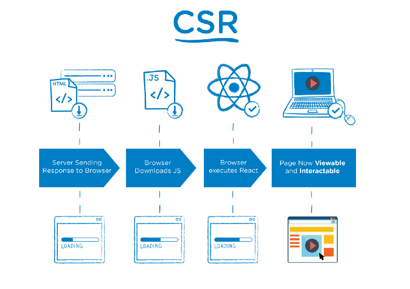
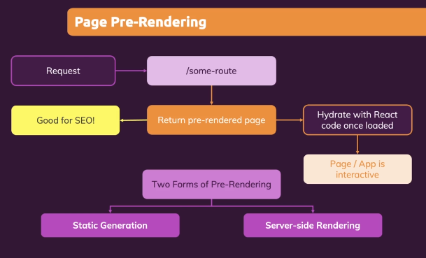
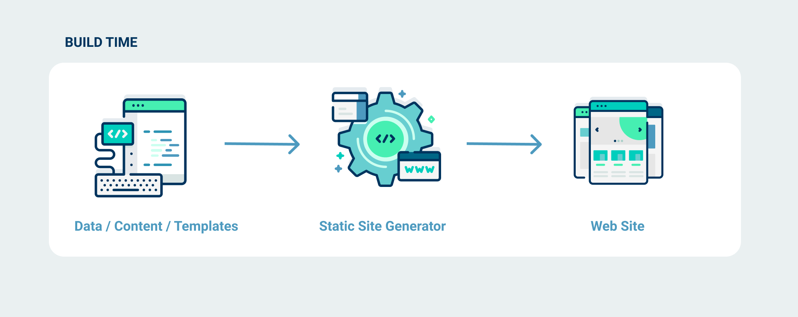
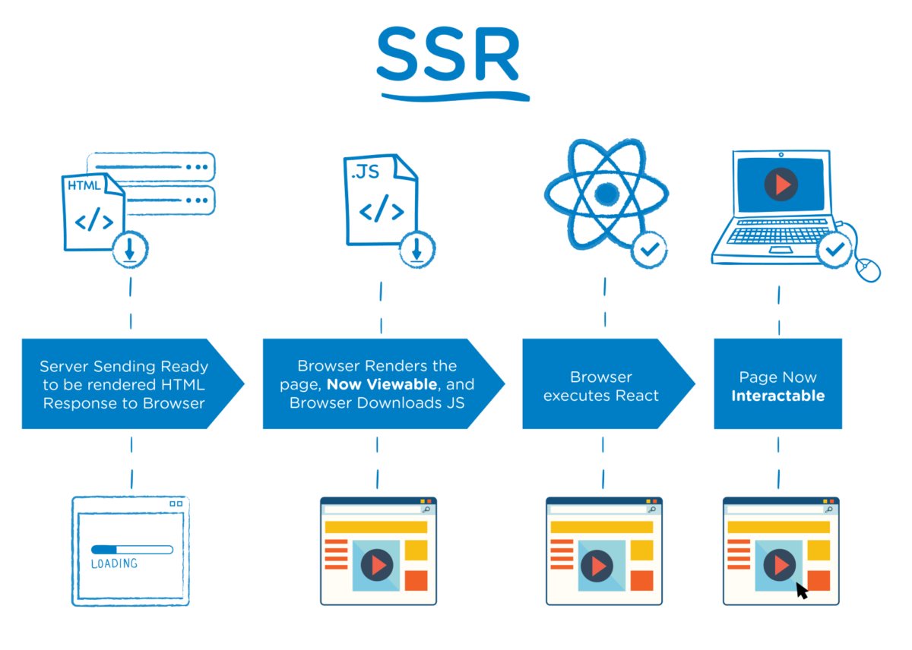
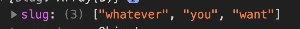
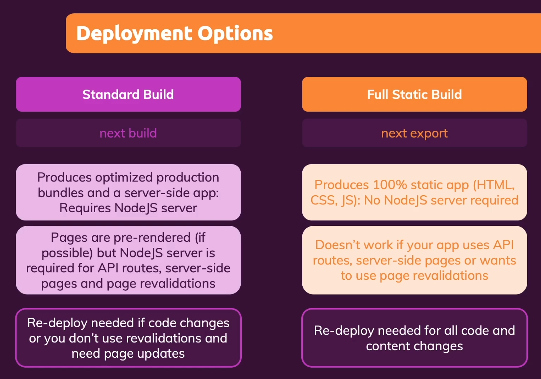

# INDEX

- [INDEX](#index)
  - [Next.js](#nextjs)
    - [React Drawbacks](#react-drawbacks)
    - [Next.js Features](#nextjs-features)
  - [Install](#install)
  - [Prerender](#prerender)
    - [Solution](#solution)
  - [Static Site Generation (SSG)](#static-site-generation-ssg)
    - [`getStaticProps()`](#getstaticprops)
      - [getStaticPaths()](#getstaticpaths)
    - [Incremental Static Regeneration](#incremental-static-regeneration)
  - [Server Side Rendering (SSR)](#server-side-rendering-ssr)
    - [getServerSideProps()](#getserversideprops)
  - [Data Fetching](#data-fetching)
  - [File-based Routing](#file-based-routing)
    - [Dynamic routes](#dynamic-routes)
      - [Catch-All Routes](#catch-all-routes)
    - [Navigation through routes](#navigation-through-routes)
    - [Custom 404 Page](#custom-404-page)
  - [Optimization](#optimization)
    - [Head (meta data)](#head-meta-data)
    - [Optimizing Images](#optimizing-images)
  - [API Routes](#api-routes)
  - [Deployment](#deployment)
    - [Deployment Options](#deployment-options)
    - [configuration](#configuration)

---

## Next.js

It's a React framework for production

- By framework, we mean Next.js handles the tooling and configuration needed for React, and provides additional structure, features, and optimizations for your application.


[NEXT.JS VS REACT](https://pagepro.co/blog/nextjs-vs-react/)

- Is it like `create react app`?
  - Yes and NO
  - Yes, in that both make your life easier
  - No, in that it enforces a structure so that we can do more advanced things like:
    - server side rendering
    - automatic code splitting
  - In addition, Next.js provides 2 built-in features that are critical for every single website:
    - routing with lazy component loading
    - a way for components to alter `<head>`: `<Head>`

### React Drawbacks

- client-side-rendering **CSR** can cause problems like in Search-engine-optimization **SEO** as in the beginning the html page is empty so that is bad for SEO

  

---

### Next.js Features

- **Built-in Server Side Rendering SSR** : prerendering react apps in the server

- **File-based routing**

  - define pages and routes with files and folders instead of code

- **Fullstack capabilities**
  - ability to add backend (server-side) code to the app

---

## Install

```sh
npx create-next-app@latest
```

---

## Prerender

**Pre-rendering** to HTML means that we will convert the React Component to an HTML file and send the HTML file to the client so it can quickly show that to our user without much processing or bandwidth.

Next.js by default doesn't wait for the data to be fetched even if it's in `useEffect()` instead it renders the data with the initial state

- `Hydration`: it means that react takes over once page is loaded from server-side
  - in this step react then start **fetching** for required data if needed

### Solution



---

## Static Site Generation (SSG)



Static Generation describes the process of compiling and rendering a website or app **at build time**.

So it doesn't have to do it for every request, and neither does the browser have to do it on the client-side.

- Benefit:

  - `SEO`

  - `Speed` : HTML page is much faster for the end-user because the browser doesn't have to do much processing upfront. The pre-rendering makes it easy for the browser to fetch the HTML and render it straight up.

  - `Caching with CDNs`

Next.js provides a few different APIs to fetch data including `getStaticProps` and `getServerSideProps`, which determines how Next.js will build your app.

- **The issue of Static Site Generation:**
  - The build time will increase followed by the number of pages. The time you need to wait could be from minutes to hours. This is a huge blocker when you need to make changes to something in your content.

---

### `getStaticProps()`

[Docs](https://nextjs.org/docs/api-reference/data-fetching/get-static-props)

If you export a function called `getStaticProps` from a page, Next.js will pre-render this page **at build time** using the props returned by getStaticProps.

- fetch that data at build time
- **Always runs on the server and never on the client.**
- it prepares and **returns** props for the component, then execute the component function
- inside it, you can Write server-side code directly(**node.js**)

The code in this function won't happen on Client-Side as it will be in the server and after they are done the component will be rendered (after data has been fetched), ususally they return a **props object** + we can control how often the page gets regenerated if there's a changing data

```js
export async function getStaticProps(context) {
  return {
    props: {} // will be passed to the page component as props
  };
}
```

- Context parameter:

  - `params`: contains the route parameters for pages using dynamic routes.
    - if the page name is [id].js , then params will look like { id: ... }
  -

- when to use it?
  - when the page must be pre-rendered (for SEO) and be very fast — getStaticProps generates HTML and JSON files, both of which can be cached by a CDN for performance

#### getStaticPaths()

If a page has **Dynamic Routes** and uses `getStaticProps`, it needs to define a list of paths to be statically generated.

- Next.js will statically pre-render all the paths specified by `getStaticPaths`.

```js
export async function getStaticPaths() {
  return {
    paths: pathsArr,
    fallback: true // false or 'blocking'
  };
}
```

---

### Incremental Static Regeneration

Next.js allows you to create or update static pages **after** you’ve built your site. Incremental Static Regeneration (**ISR**) enables you to use static-generation on a per-page basis, **without needing to rebuild the entire site**. With ISR, you can retain the benefits of static while scaling to millions of pages.


- **Pros**: Possible to choose the number of pages to generate with an adjustable stale time with revalidate. Really fast performance with less build time.

- **Cons**: There's still stale time in the beginning.

```js
// This function gets called at build time on server-side.
// It may be called again, on a serverless function, if
// revalidation is enabled and a new request comes in
export async function getStaticProps() {
  const res = await fetch('https://.../posts');
  const posts = await res.json();

  return {
    props: {
      posts
    },
    // Next.js will attempt to re-generate the page:
    // - When a request comes in
    // - At most once every 10 seconds
    revalidate: 10 // In seconds
  };
}
```

---

## Server Side Rendering (SSR)

Here, when a user accesses a website, this request’s information is sent directly to the server, which responds with a file with the complete HTML code. From this content, the website will be properly loaded in full.



Server-side rendering refers to an application’s ability to display the web-page on the server rather than rendering it in the browser. When a website’s JavaScript is rendered on the website’s server, a fully rendered page is sent to the client and the client’s JavaScript bundle engages and enables the Single Page Application framework to operate.

> if you did a `console.log()` in a SSR file, you will find that the log is in (the Node server terminal +  the browser)

### getServerSideProps()

It's similar to [getStaticProps()](#getstaticprops) but the difference is in the parameter **context**, as here we can access all the data from the **request and response**

---

## Data Fetching

[SWR](https://swr.vercel.app/) -> It's a React Hook for Data Fetching

---

## File-based Routing

here we used file-based instead of code-based as we don't use react-router


### Dynamic routes

```js
// in pages/post/[id].js
import { useRouter } from 'next/router';

const Post = () => {
  const router = useRouter();
  const productID = router.query.id;

  return <p>Post: {productID}</p>;
};
```

#### Catch-All Routes

```js
// in pages/listing/[...slug].js
import { useRouter } from 'next/router';

const Post = () => {
  const router = useRouter();
  const paths = router.query.slug; // this will be an Array of all routes

  return <p></p>;
};
```



---

### Navigation through routes

- **Clickable**:

  ```js
  import Link from 'next/link';

  <Link href='/products'>products</Link>;
  ```

- **Programmatically**:

  ```js
  // like in react
  router.push('/clients/max');
  ```

---

### Custom 404 Page

-The file must be named `404.js`

---

## Optimization

### Head (meta data)

To inject `head`, `meta` content in the real html page

```js
import Head from 'next/head';

function IndexPage() {
  return (
    <div>
      <Head>
        <title>My page title</title>
        <meta property='og:title' content='My page title' key='title' />
      </Head>
      <Head>
        <meta property='og:title' content='My new title' key='title' />
      </Head>
      <p>Hello world!</p>
    </div>
  );
}

export default IndexPage;
```

> You can also put a global header in `_app.js` or `_document.js` which will be applied for all components

- If you have more than one `head`, next.js will **merge** them

---

### Optimizing Images

`Image` component is an extension of the HTML `` element, evolved for the modern web. It includes a variety of built-in performance optimizations to help you achieve good Core Web Vitals. These scores are an important measurement of user experience on your website, and are factored into Google's search rankings.

- optimization:
  - **Improved Performance**: Always serve correctly sized image for each device, using modern image formats
  - **Cashing**
  - **Lazy Loading**: images are loaded when needed

```js
import Image from 'next/image';

<Image
  src={profilePic}
  alt='Picture of the author'
  // width={500} automatically provided
  // height={500} automatically provided
  // blurDataURL="data:..." automatically provided
  // placeholder="blur" // Optional blur-up while loading
/>;
```

---

## API Routes

- must be in `api` folder, inside it we can write **Server-Side** code and will never be exposed to the client-side

---

## Deployment

### Deployment Options



### configuration

- `next.config.js`: It's a regular Node.js module, not a JSON file. It gets used by the Next.js **server and build phases**, and it's not included in the browser build.
  - here we can use options and things that will be available upon building for the server, like: `environmental variables,etc`
