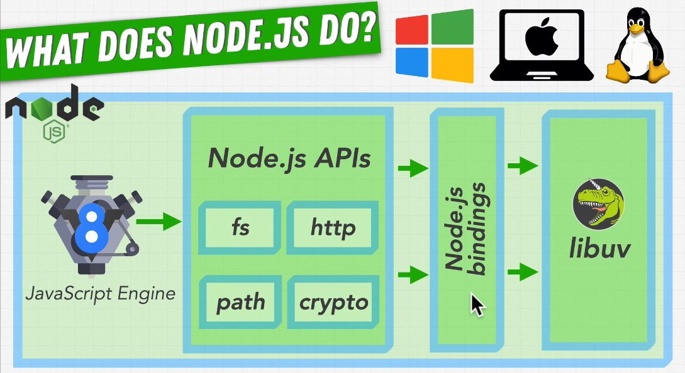
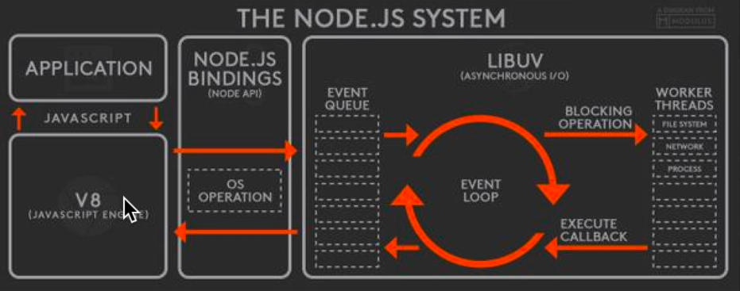
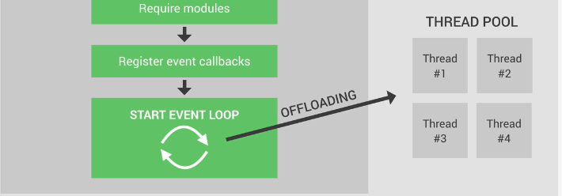
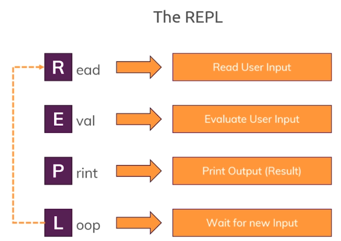
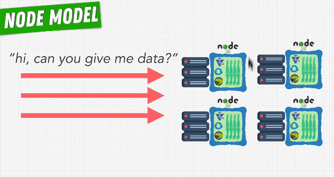

# INDEX

- [INDEX](#index)
  - [Node.js and the V8 Engine](#nodejs-and-the-v8-engine)
    - [Node.js Runtime](#nodejs-runtime)
    - [Node.js Architecture (How it works)](#nodejs-architecture-how-it-works)
      - [More about Node.js and libuv](#more-about-nodejs-and-libuv)
    - [Node Process and Threads (thread pool)](#node-process-and-threads-thread-pool)
    - [Phases of Event-Loop](#phases-of-event-loop)
    - [Node vs Javascript](#node-vs-javascript)
    - [Node.js vs python / PHP](#nodejs-vs-python--php)
  - [Thread Pool (Asynchronous I/O)](#thread-pool-asynchronous-io)
    - [Thread pool process (How Node runs Asynchronously)](#thread-pool-process-how-node-runs-asynchronously)
  - [Events](#events)
    - [EventEmitter](#eventemitter)
  - [REPL](#repl)
  - [Modules](#modules)
    - [Common-JS Module System](#common-js-module-system)
      - [What happens when we `require()` a module](#what-happens-when-we-require-a-module)
    - [ECMAScript (ES) Module System](#ecmascript-es-module-system)
    - [Module vs NPM Package](#module-vs-npm-package)
    - [Core-modules : Process Module](#core-modules--process-module)
    - [Core-modules : Path Module](#core-modules--path-module)
    - [Core-modules : File System Module](#core-modules--file-system-module)
    - [Core-modules : HTTP/HTTPS - URL](#core-modules--httphttps---url)
  - [NPM Packages Installation](#npm-packages-installation)
    - [semantic versioning](#semantic-versioning)
    - [globally vs locally installation](#globally-vs-locally-installation)
      - [globally (-g)](#globally--g)
      - [locally (--save-dev)](#locally---save-dev)
    - [--save and --save-dev](#--save-and---save-dev)
  - [Application Programming Interface (API)](#application-programming-interface-api)
    - [REST Architecture (RESTFUL APIs)](#rest-architecture-restful-apis)
  - [HTTP server](#http-server)
    - [What happens when we access a webpage? (How server Works)](#what-happens-when-we-access-a-webpage-how-server-works)
    - [Create Node.js Web Server](#create-nodejs-web-server)
      - [Shutting Down Node/Express Server](#shutting-down-nodeexpress-server)
    - [HTTP Header](#http-header)
    - [Routing](#routing)
    - [Parsing Request Body (Streams \& Buffer)](#parsing-request-body-streams--buffer)
      - [Streams](#streams)
      - [Buffer](#buffer)
  - [Import / Export Async Data (Streams-Promises)](#import--export-async-data-streams-promises)
    - [Streams Promises API](#streams-promises-api)
    - [stream-promise package](#stream-promise-package)
  - [Logs](#logs)
    - [morgan](#morgan)
      - [installation](#installation)
  - [Improving Performance](#improving-performance)
    - [Running multiple node-processes](#running-multiple-node-processes)
      - [Node Cluster Module](#node-cluster-module)
      - [Process Manager 2 (PM2)](#process-manager-2-pm2)
  - [Work Threads](#work-threads)

---

## Node.js and the V8 Engine

- `runtime` is the environment that `javascript` runs on. for example:

  - **V8 engine** on browsers(chrome) is used to run`javascript`on the **client-side** --> so **web-browser is a javascript runtime**
    

- Benefits (features we get) of running Javascript in **Browser**:
  - devtools
  - console
  - sockets
  - network requests -> `fetch / xhr`
  - HTML DOM -> `document`
  - Timer -> `setTimeOut`, `setInterval`
- Benefits of running Javascript in **Node.js**:
  - accessing file system
  - better networking capabilities
  - These benefits enable us to have perfect conditions for using Node.js as a **web server**

---

### Node.js Runtime

- `Node.js` is a `Javascript-Runtime` **not** a language or framework, which allows us to run javascript outside browsers, with additional javascript-features (e.g. accessing file system files)
  

---

### Node.js Architecture (How it works)

**Node.js Architecture** can be presented based on dependencies which are libraries that Node depends on them in order to work properly, the most important ones are `V8 engine` and `libuv`


- If it wasn't for `V8`, Node would have no way of understanding the javascript code, as `v8 engine` converts javascript code into machine code that the computer can understand
- `libuv` is an open source library with a strong focus on **Asynchronous I/O**. This layer is what gives Node access to the underlying operating system (`file-system`, `networking`, ...)

  - Also, `libuv` implements 2 important features of Nodejs which are:
    1. **Event Loop** --> for handling easy tasks like executing callBacks and network I/O
    2. **Thread Pool** --> for more heavy work like file accessing or compression
  - > `libuv` has binding to other languages like `ruby`, `python`

- This architecture provides us with a level of **Abstraction**, as the dependencies are written in `C++` but they make us have access to their functions in pure javascript

---

#### More about Node.js and libuv

- Node uses `libuv` so that if `V8 engine` didn't find a `js` syntax like `process module` --> it goes to `libuv`

  - > **libuv** is a multi-platform C library that provides support for Asynchronous I/O based on event loops

- `libuv` abstracts away all specific way do deal with `files` in different `Operation-Systems`, so that `node.js` can work on any system/platform, it does so by `binding` these ways to `node`
  - this means that there's a binding(communication) between `V8 engine` and `libuv`, so **whenever they encounter something that may need Asynchronous I/O, then we hand it over to `libuv`**
  - these bindings (Node.js bindings) lets our javascript code call functionality that is implemented in `C` & `C++`
  - `libuv` has the code for Node.js core functionalities, `v8 engine` **delegates** responsibility of handling the code related to Node.js core functionalities to `libuv`

> **Asynchronous I/O :** it's delegating tasks to the operating-system, so that our Node.js program (javascript) doesn't have to wait for the response




---

### Node Process and Threads (thread pool)

When we use Node on a computer, it means that there's a Node `process` running on that computer (the `process` is just a program in execution).


- In that process, Node.js runs in a single thread (sequence of instructions). And this is what happen in a thread when starting a Node application

  1. all the top level code is executed (not inside any callback function)
  2. all the modules that the app needs are required
  3. all callbacks are registered
  4. the event loop starts running
     - Some tasks are too heavy (expensive to be executed) in the event loop, because they would block the single thread. That's where the **thread pool** comes in

- The thread pool is provided to Node.js by the `libuv` library, and it gives us **4 additional threads** that are separate from the main single-thread (we can configure it up to 128 threads)

  - The event loop can **offload** heavy tasks to the thread pool (behind the scenes)
    - > More [here](#thread-pool-asynchronous-io)
  - the more threads we have the faster we get the (tasks offloaded to the thread pool) to be executed

    ```js
    // change number of threads in the thread pool
    process.env.UV_THREADPOOL_SIZE = 2; // default is 4
    ```

---

### Phases of Event-Loop

**Event Loop**: is all the application code that is inside callback functions (non top level code)

- Node.js is build around callback functions, as it uses **"Event-driven Architecture"** with "Observer Pattern" where:
  

  1. events are emitted
  2. the event-loop picks them up when they're emitted, and the more expensive tasks go to thread-pool
  3. then, the necessary callbacks are called.

> Most Node.js core modules like (HTTP, file-system and others) implement events internally by inheriting from the `EventEmitter` Class -> `server.on('request', (req, res)=> {})`

- The event-loop does the Orchestration in Node.js with specific order of execution
- Execution Order :
  

  > **Notes:**
  >
  > - `setImmediate` is called "immediate", because it runs immediately after any I/O operations have finished executing
  > - `close callbacks`: it's the last phase because this is for when you close a (file or a network connection) and you have a callback that executes when that connection is closed

- The event-loop is what makes Asynchronous programming possible in Node.js, making it the most important feature in Node.js design and this is what makes it different from other BE languages
  

  - **node.js** -> single thread which is good for resources but can be bad if the thread is slowed or blocked
  - **php** -> multiple threads which is more resources-intensive but no danger of blocking

- In addition to the main 4 callback queues, there're also 2 other queues (`nextTick` queue and the **microtasks** queue -> for resolved promises)

  - if there's any callback to be processed in one of these 2 queues, they will be executed right after the current phase of the event loop finishes instead of waiting for the entire loop to finish
  - So, callbacks from these 2 queues will be **executed right away**

  

---

### Node vs Javascript


- In Javascript, we have the **`window`** object
- In Node.js, we have the **`global`** object

---

### Node.js vs python / PHP

- Node.js works best when you deal with `input/output` or `servers`, `(serving data / streaming)`

- Node.js doesn't work well for heavy server-side processing 7 calculation (CPU/GPU-Intensive) like `machine learning`, `video processing`, `3D-games`
  - in this case other languages are better

> With libuv and the thread-pool, we won't need for additional web-server like **Apache** or **Nginx** to create thousands of threads

---

## Thread Pool (Asynchronous I/O)

- `Node` runs on a `single thread` even if you have millions of users, so make sure you don't **block that thread**, --> here comes the rule of `Libuv` which gives us **4** additional threads **(or more)**

  

  - so `node` takes care of heavy things by `offloading` them to the `thread pool`
  - it simulates `asynchronous` task by doing each task in a single `call-stack (thread)`

- `Libuv Library` : A library written in `C` that provides **multithreading** to Node.js and allows for heavy processing.
  
- The thread-pool(collection of threads) in `libuv` are se-up ahead of time and are ready to take on work as it comes in

  - libuv is written in C++, that's why it have threads
    

- The default thread pool includes `4` threads

### Thread pool process (How Node runs Asynchronously)

- There's a common misconception that "all Asynchronous functions are executed in the thread-pool". Instead Node try to save the thread-pool for only the heavy tasks, and for normal tasks, libuv uses the operation-system (**kernel**) directly
  
  - `kernel`: is the core-part of the OS that talks to the computer's hardware and has multiple threads of its own
    - the kernel is really good at doing basic operations, So whenever the functionality exists in the OS, libuv will make the appropriate call saving us from using the valuable resources of the thread-pool
- Libuv takes advantage of the operating system's asynchronous interfaces before engaging the thread pool
- The thread pool is engaged for events that require more processing power including compression and encryption tasks

> So, for most of the Async operations, we skip over the thread-pool and instead the event-loop uses the OS-kernel
>
> - by using javascript with node with is single-threaded, we won't have to manage multiple threads manually because Node handles it and simplify our code

---

## Events

### EventEmitter

- On the backend side, Node.js offers us the option to build a similar system like (mouse clicks, keyboard button presses, reacting to mouse movements, and so on.) using the events module.
- EventEmitter provides multiple properties like `on` and `emit`. on property is used to bind a function with the event and emit is used to fire an event.
  - `emit` is used to trigger an event
  - `on` is used to add a callback function that's going to be executed when the event is triggered
- it works on the idea of **Observer Pattern** where

  - `emit` triggers an event
  - `on` observes an event and wait until it occurs

  

```js
const EventEmitter = require('events'); // class

const celebrity = new EventEmitter(); // instance
// This object exposes, among many others, the (on) and (emit) methods

// subscribe to celebrity for Observer-1
celebrity.on('new song released', function () {
  console.log('check the new song of your favourite singer');
});

// triggering the event
eventEmitter.emit('new song released');
```

---

## REPL

- **REPL** stands for [`Read`, `Evaluate`, `Print`, `Loop`] (the place we write js code in terminal after writing `$node`)

  

  - To access the Node.js REPL environment, run: `$node`
  - To exit node => `ctrl`+`d`
  - To run `index.js` use:
    - `$node src/index.js`
    - `$node src/index`
    - `$node src/.`
    - `$node src`
  - To run other files use:
    - `$ node src/path-to-file.js`
    - `$ node src/path-to-file`
  - try not to use `./` as you may run the node from another place than the one which has the `js` file

---

## Modules

The module system creates the ability to `export` and `import` JavaScript from separate files.

- Node Modules are used to:
  1. Reuse existing code
  2. Organize code
  3. Expose only what will be used

### Common-JS Module System

- Node.js uses the `Common JS module` system to break code into smaller chunks.

  - TypeScript compiles to the Common JS Module System.

- **`export`**

  ```js
  // Default export
  module.exports = myOnlyFunction;

  // exports as object  {actual_item : desired_name}
  module.exports = {
    myFirstFunction: myFirstFunction,
    mySecondFunction: mySecondFunction
  };

  // or using ES6 shorthand property names
  module.exports = {
    myFirstFunction,
    mySecondFunction
  };
  // or
  exports.myFirstFunction = myFirstFunction;
  exports.mySecondFunction = mySecondFunction;
  ```

- **`require()`**

  - When using `require`, a preceding `slash (/)` must come before a locally created module name; otherwise, Node.js will search the `core modules` and then `node_modules`.
  - also by default, `require()` doesn't need `.js` extension for javascript file as it's set to look for these extensions in this order:
    1. `.js`
    2. `.json`
    3. `.node`

  ```js
  const logger = require('./util/logger.js');

  // using ES6 object destructuring, to only get (myFirstFunction)
  const { myFirstFunction } = require('./util/logger.js');
  ```

- `__dirname` and `__filename`

  ```js
  // working file = /app/util/logger.js

  console.log(__dirname);
  // path of current module -->  /app/util

  console.log(__filename);
  // name of current module -->  /app/util/logger.js
  ```

---

#### What happens when we `require()` a module

1. **Resolving path to the required module and loading the file**
   
2. **Wrapping the module in a function**
   

   - The module's code is wrapped into an **IIFE**, which will give us access to a couple of special objects and methods like `require()`
   - This is why in every module, we automatically have access to stuff like `require` function and global variables that are injected into every module
   - All the module code is executed inside a function body
   - This is also used to keep the top-level variables defined in each module private and scoped only to the current module instead of leaking everything into the global object

3. **Executing the module code by the Node.js runtime**
4. **Returning the module exports**
   
5. **Caching the module after first load for future requires**
   - this will make the code in the module run only one time -> (interview question)

---

### ECMAScript (ES) Module System

Starting from `Node.js 13.2.0`, `Node.js` supports ECMAScript modules, known for their `import` and `export` statements

- The default format of modules in Node.js is the `CommonJS`. To make Node.js understand `ES` modules format, you have to explicitly make so.


- Additional Steps in order to use `ECMAScript-modules` :

  - The module's file extension is `.mjs`, if not using a special compiler that handles this
  - Or the module's nearest parent folder has `{ "type": "module" }` in `package.json`

- **NOTE**: You must specify the file extension when importing

  ```js
  // won't work
  import notFoundMiddleware from './middlewares/not-found';

  // will work
  import notFoundMiddleware from './middlewares/not-found.js';
  import notFoundMiddleware from './middlewares/not-found.mjs';
  ```

---

### Module vs NPM Package

- `module` : a file containing some code that could be exported from this module

- `package` : collection of modules that have been **packaged** together

---

### Core-modules : Process Module

It's not found in the browser APIs, `Process` relates to the global node execution process which occurs when you run a `.js` file through Node.js.

- The `process` object is a **global** that provides information about (and control) the current Node.js process.
  - As it's a `global`, it's always available to Node.js applications without using `require()`. It can also be explicitly accessed using `require()`
- The Process module contains the ability to perform tasks immediately before the process exits, and when it exits.

  - `beforeExit` allows for asynchronous calls which can make the process continue.
  - `exit` only happens once all synchronous and asynchronous code is complete.

    ```js
    // create conditions for exit code options
    // example: 0 typically implies no errors, 1 does.

    process.exitCode = 1;

    process.on('beforeExit', () => {
      console.log('beforeExit event');
    });

    process.on('exit', code => {
      console.log(`exit event with code: ${code}`);
    });
    ```

- `process.env` -> **(ENVIRONMENT VARIABLES)**

  - `Process.env` gives you access to the environment information of your Node.js application. It also allows you to add environment variables that can be used if your code is dependent on the environment it is run in.
  - To add new environment-variables in our Node process, we have 2 ways:

    1. manually in terminal before the start script:

       ```sh
       NODE_ENV=production nodemon server.js
       ```

    2. by using a `.env` configuration file that contains all our environment-variables and access it using [dotenv package](https://www.npmjs.com/package/dotenv)

       ```js
       const dotenv = require('dotenv');

       // specify the path of configuration file
       dotenv.config({ path: './config.env' }); // MUST BE BEFORE requiring app file

       // now we can access the variables in the config file like this:
       console.log(process.env.PORT);
       ```

- `process.stdout` it's like `console.log` but it does not force a new line break. This allows you to create helpful tools like progress bars.

- `process.argv`

  - An array containing your console arguments information for your executed process.

- `process.nextTick()`
  - Allows you to run JavaScript between the different phases of the event loop. process.
  - When we pass a function to `process.nextTick()`, we instruct the engine to invoke this function **at the end of the current operation**, before the next event loop tick starts

---

### Core-modules : Path Module

Using the path module allows us to normalize paths to work across platforms(Windows/Mac/Linux).

- The path module must be imported via `require('path')`. Once imported, there are three commonly used options

```js
const path = require('path');

// Enables you to get the absolute path from a relative path.
console.log(path.resolve('index.js'));
// prints /Users/user/Desktop/app/index.js

// Normalizes any path by removing instances of . , turning double slashes into single slashes and removing a directory when .. is found.
console.log(path.normalize('./app//src//util/..'));
// prints app/src

// Used to concatenate strings to create a path that works across operating systems. It joins the strings, then normalizes the result.
console.log(path.join('/app', 'src', 'util', '..', '/index.js'));
// prints  /app/src/index.js
```

---

### Core-modules : File System Module

- `const fs = require('fs');`
- allows for reading and writing to files with many options.

---

### Core-modules : HTTP/HTTPS - URL


---

## NPM Packages Installation

```bash
npm i module-name # install module to dependencies
npm i --save-dev module-name # install to dev dependencies (only for development and not for production)
npm i --save-dev module-name@1.19 # install a specific version (1.19 here) of module
```

- `package-lock.json`

  - contains all of the information for the dependencies of the modules you have installed.
  - it has the dependencies for the package you installed so that the main `package.json` is clean.
  - it's important to get the exact `semantic versioning`
  - It is best practice to add `package-lock.json` as well as `./node_modules` to your `.gitignore` file
  - It is best practice to add `package-lock.json` as well as `./node_modules` to your `.gitignore` file

- `npm audit` --> It shows all vulnerabilities your dependencies got (excluding peerDependencies).
  - You can disable the warning for single package installations with the `--no-audit` flag

---

### semantic versioning

[npm semver calculator](https://semver.npmjs.com/)


- `*` means that you'll accept all updates
- `^` means that you'll only accept minor releases
- `~` means that you'll only accept patch releases
- `>, >=, <=, <` are also valid for saying you'll accept versions greater/less/equal to the listed version
- `||` allows you to combine instructions
  - ex : "prettier": "2.2.1 || >2.2.1 < 3.0.0" which says use prettier greater than 2.2.1 and less than version 3.0.0.

---

### globally vs locally installation

> In general, all packages should be installed locally.

#### globally (-g)

- it install the package globally on the system, so you can use it in the `terminal` & on the `scripts`

#### locally (--save-dev)

- it makes the package available to the current project (where it stores all of the node modules in node_modules)
- It will not be available as a command that the shell can resolve until you install it globally

---

### --save and --save-dev

| dependencies                                                                                 | dev-dependencies                                                                                                                                                 |
| -------------------------------------------------------------------------------------------- | ---------------------------------------------------------------------------------------------------------------------------------------------------------------- |
| These are the packages that are required for the application to work properly.               | These are the packages that you need while developing the project but not when deploying the project. These packages are not built when the project is deployed. |
| `--save` saves the name and version of the package being installed in the dependency object. | `--save-dev` saves the name and version of the package being installed in the dev-dependency object.                                                             |

---

## Application Programming Interface (API)

It's a piece of software that can be used by another piece of software, in order to **allow application to talk to each other**

- API has a broader meaning than building Web APIs, It can be a "web api" or other things like Node-APIs:
  

- Web API is usually what's important in the context of Node.js, which is build using the **REST Architecture**
  - **REST APIs**: are APIs following the REST Architecture

### REST Architecture (RESTFUL APIs)

It stands for "Representational States Transfer", It's a way of building web APIs in a logical way making them easy to consume. This requires some principles:

1. **Separate API into logical resources**
   - all data to be shared by the API should be divided into logical resources
     
2. **Expose these resources using URLs**
   
3. **Use HTTP methods to perform different actions on data**
   - we should only use endpoints with HTTP methods in order to perform actions on data
     
   - we only send response to client if the cline uses a HTTP method to access the endpoint
     
4. **Send data back to client with existing format-standards (usually JSON format)**
   - `JSON` is a lightweight data interchange format used by web APIs coded in any programming language (not just related to javascript)
   - It's used a lot because it's easy for both humans and computers to understand and write JSON (key-value pairs)
     
5. **The API must be stateless and cacheable**
   - Stateless:
     - each request is separate and not connected to any state on the client in the request
     - The server shouldn't have to remember the previous request in order to process the current request
       
   - Cacheable:
     - by caching the request, we save the result of it for future use, this reduce the work from the server and improve performance

---

## HTTP server

`http` / `https` are languages used to communicate between server & client in a way called **"Request-Response Model"** or **"Client-Server Architecture"**

### What happens when we access a webpage? (How server Works)

This is what happens when we access a webpage or accessing a wep API:


1. client type the URL(domain) to access, ex `https://www.google.com/maps`, (`https` is for the protocol of the connection)
   - the domain name is not the address written by the user (which is for us to memorize the domain easily), instead it's converted to the real address of the server and that happens through a **DNS Lookup** in a special server -> `https://216.58.211.206:443`
     - > this actually happens through your internet service provider **(ISP)**
   - the **port** number is just really to identify a specific service running on a server (sub-address)
2. After having the web address, a **TCP/IP** Socket Connection is established between the browser and the server, and this connection is kept alive for the entire time it takes to transfer all the files of the website from the server to the client
   - `TCP`: is "Transmission Control Protocol" and `IP` is "Internet Protocol", and together they are communication protocols that define how data travels across the web
     - The job of **TCP protocol** is:
       
       - to break out the requests and responses into thousands of small chunks called **"packets"** before they're sent
       - and once they get to their destination, It will reassemble all the packets into (the original request or response) so that the message arrives at the destination as quick as possible, which wouldn't be possible if we sent the website as one big chunk
     - The job of **IP protocol** is:
       - to send and route all of these packets through the internet
       - So it endures that all of them arrive at the destination
   - **Communication Protocols**: are system of rules that allows 2 or more parties to communicate
     - > They are the ones that set the rules on how data moves on the internet
3. After establishing the connection, We make a **HTTP Request**, and the request message contains multiple sections (start line, request headers, request body)

   - **HTTP:** is a communication protocol that allows clients and web servers to communicate by sending requests and response messages from client to server and back

4. After the request hits the server and the server has the data ready to be send back, The server will send back a **HTTP Response**, and the response message will look similar to the request message
5. The request/response cycle doesn't happen just once, As at first request, We get back just the initial HTML file, which then gets scanned for all the assets needed for the website (`js`, `css`, `img`,...) that require additional requests
   - for each file, the browser will make a new HTTP request to the server
   - the number of request/response happening at the same time is limited, so that the connection won't slow down
   - When all files have arrived in the browser and are ready, they are rendered

---

### Create Node.js Web Server

Node.js makes it easy to create a simple web server that processes incoming requests `asynchronously`.

- `req`is a readable stream, which we can be listened to by using the `.on()` function
- `res`is a writable stream, which we can be listened to by using the `write` functions to write data to it like (headers, body, etc)

- explanation of code below :

  - `requestListener` function is the callback function that takes a request `object` and a response `object` as parameters.

  - The `request` object contains things such as the `requested URL`, but in this example we ignore it and always return "Hello World".

    - when using `request` with other servers, you must `end` it in order to be sent ---> `req.end()`

  - The `response` object is how we send the headers and contents of the response back to the user making the request.

    - Here we return a `200` response code (signaling a `successful response`) with the body "Hello World".

  - `http.createServer` method creates(returns) a **server** that calls `requestListener` whenever a request comes in.

  - `server.listen(8080)` : tells the server to wait (listen) for incoming requests on the specified `port 8080`

```js
const http = require('http');

// callback function
const requestListener = function (req, res) {
  res.writeHead(200, {
    'Content-Type': 'text/plain'
  });
  res.write('<h1>Hello from Node.js Server!</h1>');
  res.end('This is the massage that will be shown in the browser!'); // indicate that the response is complete and ready to be sent
};

const server = http.createServer(requestListener);
server.listen(PORT, () => {
  // this callback-function is optional, it display this message on the console when you start the server --> node index.js
  console.log(`listening on port ${PORT}`);
});

//-----------------------or-----------------------//

// creating a new server
const server = require('http').createServer();

// request will be when i open the link http://127.0.0.1:8000/
server.on('request', (req, res) => {
  fs.readFile('test-file.txt', (err, data) => {
    // here the stuf to do after the file was read
    if (err) console.log(err);
    res.end(data);
  });
});

// starting the server (will run on http://127.0.0.1:8000/)
server.listen(8000, '127.0.0.1', () => {
  console.log('listening.......');
});
```

---

#### Shutting Down Node/Express Server

To shut down server we use `process.exit(1)` which ends the program (**immediately** abort all the requests that are currently still running or pending which may not be good), So usually it's better to shut down the server **gracefully**(we first close the server and only then we shut down the application)

```js
// Shut down gracefully
server.close(() => {
  process.exit(1);
});
```

---

### HTTP Header

It's a piece of information about the response that we are sending back

- writing header/statusCode always need to be set before we send out the response
- headers can be used to send metadata

```js
// Calling response.writeHead method
response.writeHead(404, {
  'Content-Length': Buffer.byteLength(body),
  'Content-Type': 'text/plain'
});
```

---

### Routing

- when you have a `server` that has different `URLs` that response differently on which one is being requested --> we call these different `URLs` : `EndPoints`
- `Routing` refers to how an application’s endpoints (`URIs`) respond to client `requests`.
- There are two ways to implement routing in node.js which are :

  - Without using Framework: based on the request-url, we will send corresponding response

    ```js
    if (req.url === '/message') {
      res.end('Here are your messages!');
    } else {
      // fallback response for not-found route
      res.statusCode = 404;
      res.end();
    }
    ```

  - to access route params, we first need to parse the URL:

    ```js
    const parsedUrl = url.parse(req.url, true);
    console.log(parsedUrl.query.id);
    ```

  - By Using Framework => [Express.js](./2-Express.md)

---

### Parsing Request Body (Streams & Buffer)


#### Streams

> **Streams:** Used to process (read/write) data piece by piece (chunks), without completing the whole read or write operation, and therefore without keeping all the data in memory

- **Stream**: is an ongoing process, as the request is read by Node.js **in chunks**

  - This is done so that we can start working on the individual chunks without having to wait for the full request being read
    - Ex: uploading a file or streaming-services like netflix, youtube
  - streams are perfect for handling large volumes of data like videos
  - streams are more a efficient data processing in terms of memory (no need to keep all data in memory) and time (we don't have to wait u til all data is available)
  - This is how Node handles all requests because it doesn't know in advance how complex and big they request-chunks are.

- **Streams Types and events**
  

- **streams & `pipe()`**

  - sometimes, there's a problem when reading streams, as the readable stream used to read file from the disk is much faster than sending the result with the response writable stream over the network, and this will overwhelm the response-stream which can't handle all the incoming data so fast. This problem is called "Back Pressure"
    - **"Back Pressure"**: It's when the response can't send the data nearly as fast as it's receiving it from the file
  - `pipe` operator is available in all readable streams and allows us to pipe the output of a readable stream into the input of a writable stream
    - This fixes the problem of "Back Pressure", because it will automatically handle the speed of the data coming `in` and `out`

- Streams Examples:

  ```js
  // Instead of this:
  fs.readFile('rest.txt', (err, data) => {
    res.end(data); // write everything at once into a variable (data) and once that was ready, we then send that entire piece to the client
  });

  // --------------------------------------------------------- //

  // Solution 1: Streams
  const readable = fs.createReadStream('rest.txt');
  // listening to the "data" event
  readable.on('data', chunk => {
    res.write(chunk); // streaming the content of the file to the client (reading one piece and send it as soon as it's available and so on until all the file is read (streamed to the client))
  });
  readable.on('end', () => {
    res.end(); // notifying the server that no more streams will be send
  });

  // Solution 2: Streams with pipe -> BEST SOLUTION
  const readable = fs.createReadStream('rest.txt');
  readable.pipe(res);
  // - (readable) is the source
  // - (res) is the writable destination -> where the data goes to
  ```

> The problem with streams is that we can't arbitrarily try to work with these chunks. Instead to organize the incoming chunks, we use **buffer**

---

#### Buffer

- **Buffer**

  - It's like a bus-stop, as buses are always driving, but "it's for users", and so to climb on the bus and leave the bus, you need bus-stops where you can track the bus, and that is what the `buffer` is
  - It's a construct which allows you to hold multiple chunks and work with them before they are released once you are done

- This is done using events:

  ```js
  const dataArr = [];
  req.on('data', chunk => {
    dataArr.push(chunk);
  }); // "data" event will be fired whenever a new chunk is ready to be read
  req.on('end', chunk => {
    const parsedBody = Buffer.concat(dataArr).toString(); // this is what we can work with
    // ...
  }); // "done" event will be fired whenever it's done parsing the incoming requests-data
  // -> when calling "res.end()"
  ```

---

## Import / Export Async Data (Streams-Promises)

- when you have `async data` that is exported we want it to be done when it's exported so that we don't get empty data
- AKA: when you deal with streams you include them in a promise
- to do so we use `Promise`
  - we export the promise and not the function
  - we include the function you want to be the resolved value of the promise
  - in the server-listening place we run(await) the function

```js
const server = http.createServer(app); // using express as a listening function for the http-server

async function startServer() {
  // this is done so that we have the data ready when we start the server before any requests so that it's available for any request
  await loadPlanetsData(); // the function that contains the promise

  server.listen(PORT, () => {
    console.log(`listening on port http://localhost:${PORT}`);
  });
}
startServer();
```

---

### Streams Promises API

The `stream/promises API` provides an alternative set of asynchronous utility functions for streams that return `Promise objects` rather than using `callbacks`.

- The API is accessible via
  - `require('stream/promises')`
  - `require('stream').promises`

---

### stream-promise package

it's a 3rd party library can be used instead of the above

- Convert any Stream instance to `thenable`
- [stream-promise](https://www.npmjs.com/package/stream-promise)

---

## Logs

### [morgan](https://www.npmjs.com/package/morgan)

**Morgan** is an HTTP request level `Middleware`.

- It is a great tool that logs the requests along with some other information depending upon its configuration and the preset used.
- It's helpful while debugging and also if you want to create `Log files`.
- It's not only used in development mode, as date from it is used in production mode, so it's a regular dependency and not a dev-dependency

#### installation

- usually it should be before any security consideration or after `CORS`

  ```js
  app.use(cors(corsOptions)); // Middleware
  app.use(morgan('combined')); // Middleware
  ```

---

## Improving Performance

### Running multiple node-processes



- node.js runs on a single thread, so to do multithreading:

  - run node on multiple processes side-by-side to share the `work`
  - it means that instead of taking each request and handling it in `one node server (process)`, we instead `spread` the requests out between multiple node.js processes
  - they run side-by-side without effecting the performance

- It's done when you want maximum performance on the server

---

#### Node Cluster Module

The Node. js Cluster module enables the creation of child processes (workers) that run simultaneously and share the same server port. Each spawned child has its own event loop, memory, and V8 instance.


- each time you use `fork()` method you create new process

- the number of process should equall number of `cors in the cpu`

  ```js
  const NUM_WORKERS = os.cups().length;
  ```

- this is similar to `Load Balancer` or `Horizontal Scalling` or `round robin`

  

```js
const cluster = require('cluster');
const os = require('os');

if (cluster.isMaster) {
  // any code here will be executed first time whe server is executed
  console.log('master has started');

  const NUM_WORKERS = os.cups().length;

  for (let i = 0; i < NUM_WORKERS; i++) {
    cluster.fork(); // create a worker
  }
} else {
  // the code here will run when code is running as a worker-process
  console.log('worker has started');
  app.listen(5000);
}
```

---

#### Process Manager 2 (PM2)

- [PM2](https://pm2.keymetrics.io/)
- [NPM PM2](https://www.npmjs.com/package/pm2)
- It's much easier than `Node Cluster Module`

```js
console.log('worker has started');
app.listen(5000);
```

```bash
# you should install pm2 globally
pm2 start server.js -i max # name of the js-file, i -> for "instance"

# same thing but sends log to a file
pm2 start server.js -l logs.txt -i max
```

---

## Work Threads

- `work threads` vs `clusters`

  

- `work threads` make us work on one process with multiple threads

---
