# INDEX

- [INDEX](#index)
  - [Express](#express)
  - [App Structure with Express](#app-structure-with-express)
  - [installation](#installation)
  - [Express Basics](#express-basics)
    - [Endpoints](#endpoints)
    - [Request](#request)
    - [Response](#response)
  - [MVC Architecture in Express App](#mvc-architecture-in-express-app)
    - [MVC Steps (lifecycle)](#mvc-steps-lifecycle)
    - [MVC Application vs Business Logic](#mvc-application-vs-business-logic)
  - [Middleware](#middleware)
    - [Middleware in Express Development](#middleware-in-express-development)
    - [Types of Middleware](#types-of-middleware)
    - [Using Middleware](#using-middleware)
  - [POST requests](#post-requests)
  - [Routes](#routes)
    - [Handling unhandled routes](#handling-unhandled-routes)
  - [Serving Files / HTML Pages](#serving-files--html-pages)
    - [Static vs Dynamic Websites / APIs](#static-vs-dynamic-websites--apis)
    - [Serving files statically](#serving-files-statically)
    - [Serving Apps with Client-Side Routing](#serving-apps-with-client-side-routing)
  - [Template Engines](#template-engines)
    - [handlebars (hbs)](#handlebars-hbs)
  - [Error Handling](#error-handling)
    - [Unhandled Rejections and Exceptions](#unhandled-rejections-and-exceptions)
      - [Handling Asynchronous promise rejections](#handling-asynchronous-promise-rejections)
      - [Handling Synchronous Exceptions](#handling-synchronous-exceptions)

---

## Express

- Express is a minimal node.js framework (build on top of Node.js) that contains features like:

  - Set up the server
    - easier handling of requests and responses
    - as the server logic is complex, and we want to focus on the business logic and not the nitty-gritty details
  - complex routing
  - Apply middleware
  - server-side rendering
  - makes it easier to organize application into the **MVC** architecture

> **Framework**: helper-functions, tools and rules that help you build your applications

- Express solves problems, because it:
  - Builds on HTTP module
  - Handles requests and parses data with minimal configuration
  - Makes it easy to add middleware, so that you can expand server's functionality easily

---

## App Structure with Express

An Express Project Is Organized Like a **Book**

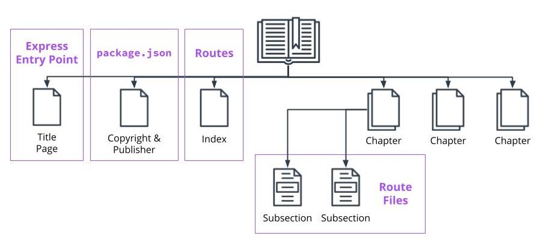

---

## installation

```bash
npm i express # it's important for production, so we use it as dependency
npm i --save-dev @types/express   # for typescript
```

---

## Express Basics

- `The Application Object` --> `app` : defines how the server works.

  ```js
  const app = express(); // create express app that stores & manage a lot of things for us behind the scenes
  ```

- Express.js is all about [middleware](#middleware),
  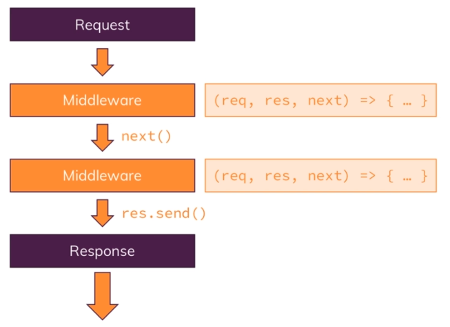

  - As the incoming request is automatically funneled through a bunch of functions by express.js, so instead of just having one request handler, you will actually have possibility of **hooking** in multiple functions which the request will go through **until you send a response**
  - this allows you to split your code into multiple blocks instead of having one huge function
  - this is the **pluggable nature of express.js**, where you can easily add other third party packages which give you such middleware functions that you can plug into express.js nd add certain functions

- Express is really good at routing, and it provides methods to respond to different HTTP-requests with **Core Methods**:
  

  - `.listen()` - listens for connections to a specified host and port
  - `.get()` - used to get a route and takes a route and a callback function as arguments. The callback function takes two arguments, the request from the browser and the response from the server. Additionally, middleware can also be passed in as an argument
  - `.post(),` `.put(),` `.delete()` - the other app methods that make up endpoints. They require having the ability to store data.

- ports and Hosts

  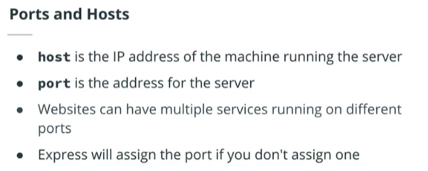

---

### Endpoints

- Endpoints are made up of a `method` you wish to perform on your data, and the `route` you would like to use for that data.

  - ex : `GET https://restcountries.eu/rest/v2/name/canada`

- create an endpoint

```js
app.method('/route', middleware, callback => {
  // what you want to do with the request or response
});

app.get('/students', (req, res) => {
  // perform an action with req or res.
});
```

---

### Request

Request has many properties and methods available to it for getting information about the request from the browser.

- some properties : `ip`, `cookies`, `path`, `subdomains`, `params()`, `query`
- to get parameters from the `url` ->

  - the `:` is express-syntax to make it know that what comes after it is a `parameter`

    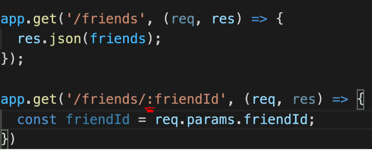

---

### Response

It is the response from server back to the browser. Like request, it has many properties and methods available to it.

- some methods :
  - `end()` ----> for `string`
  - `send()` ----> by default sends the appropriate (content-type) based on the response body
  - `status()`, `cookie()`
  - `sendFile()` : to send HTML-files
  - `json()` : to send response in a "`application/json`" format
- To override the default response **header**: use `setHeader()` method

  ```js
  app.use((req, res, next) => {
    res.setHeader(''); // optional
    res.send('<h1>hello world</h1>');
  });
  ```

---

## MVC Architecture in Express App

We use this architecture/pattern as it allows us to write a more modular applications which is easier to maintain in scale as necessary

- **The model layer** is concerned with everything about the application data and the business logic
- **The controller layer** is concerned with the Application-logic and is responsible for:
  - handling the application's requests
  - interacting with the models and
  - sending responses back to the client
- **The view layer** is concerned with the Presentation-logic is necessary if we have a graphical interface in our app or when building a **server-side-rendered SSR** websites
  - It consists of the templates used to generate the view (website we send back to the client)

---

### MVC Steps (lifecycle)

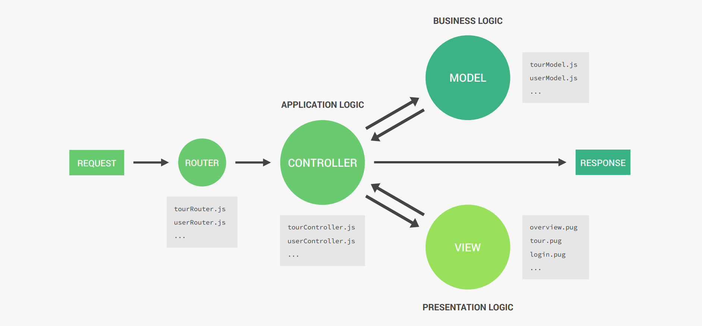

- Steps

  1. A request will hit one of our routers(one for each resource), and the router delegate the request to the correct handler function which will be on the corresponding controller
  2. Depending on the incoming request, The controller might need to interact with one of the models (ex: to retrieve a certain document from the database or to create a new one)
     - There's one model for each resource
  3. After getting the dta from the model, The controller might then be ready to send back a response (containing that data) to the client
  4. In case we want to render a website, there's one step involved, which is after getting the data from the model, the controller will go to the view layer and select the corresponding template and inject the data into it

     - That rendered website will then be send back to the client with the data
     - in the View-layer, there's usually 1 view template for each page

> In Java, the MVC is implemented using Classes, but in Node.js, it's implemented using modules(files)

---

### MVC Application vs Business Logic

- Application logic is the logic that makes the app actually works (technical stuff like managing requests/responses)
- Business Logic is about the stuff related to business operations

> They sometimes are hard to separate and may overlap

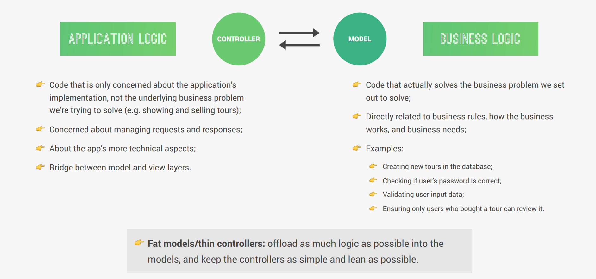

---

## Middleware

Middleware is a `function/s` that is applied between the request and response. Meaning you get the request, do something with it, and then send the response.

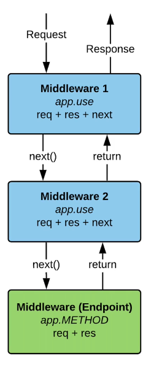

- Common uses of middleware include checking the `authentication` status of a user before sending a response or logging the request before sending the response.
- We have to call `next()` to allow the request to travel to the next middleware in line.

- **`next()`**
  - It's a method from the `express router`
  - It calls the next middleware in a chain of middlewares
  - Without adding `next` to your middleware function, your application will get stuck on the middleware.

---

### Middleware in Express Development

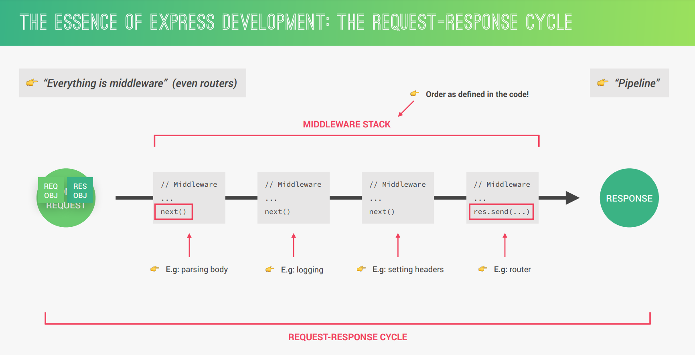

- In the **request-response-cycle**, when Express app receives a request is when someone hits a server for which it will then create a `request` and `response` objects
- The `data` then will be used and processed to generate and send back a `response`
  - in order to process that `data`, Express uses **Middlewares** which can manipulate the `request` or `response` objects, or execute any code that we want (doesn't have to be for the `request` or `response` objects)
- It's called "Middleware", because it's a function that is executed in the middle of receiving the request and sending the response
  - > **Note:** In Express, everything is a middleware (even routers as they are middleware functions that are only executed for certain routes)
- All the middlewares in the app are called: **"Middleware Stack"**
  - At the end of each middleware function, a `next()` function is called, which executes the next middleware in the stack with the exact same `request` or `response` objects. and this happens in all the middlewares until we reach the last one which is a route handler which send the response data back to the client
    - without calling the `next()` function, the middleware will be stuck
  - this process is like a **"Pipeline"**

**Notes:**

- As the routes are middlewares, the order of them matter,and also if a custom-middleware was after one route, It won't apply for this route
  - That's why we define all middlewares at the top of the app before anything

---

### Types of Middleware

- Built-in Middleware

  - `.static()` - for serving static files
  - `.json()` - for automatic-parsing of incoming JSON-request-body

    ```js
    app.use(express.json());
    ```

    - > This is different from `res.json()`

  - `.urlencoded()` - for parsing incoming urlencoded data

- 3rd Party Middleware

- Custom Middleware

---

### Using Middleware

two ways of applying middleware:

- Application/route level

  - `.use()` method is a method that can be applied to the application object or to route objects. It is used for applying middleware and can take in a route, and middleware as arguments

    - it uses **partial-matching** of the `route` --> ((start with) '/page1')

    ```js
    app.use(middleware);

    //--------------------------------------------------//

    // or with handling different routes
    app.use('/page1', middleWare_function1); // here it means that the route must (start with) '/page1'
    app.use('/', middleWare_function2); // here it means that the route must (start with) '/'

    // note : we always puth the one with '/' at the end as all routes start with '/'
    ```

    - in this way, we don't call `next()`

  - `.get()` / `.post()` are like `use()` but only GET or POST requests
    - it uses **Exact-matching** of the `route` --> ((must be eaual to) '/page1')

- Endpoint level

  ```js
  students.get('/', middleware, (req, res) => { // do stuff });
  ```

---

## POST requests

- when we take data from the client it should be in `JSON` format, so we use `.json()` method from `Express`
  - The `express.json()` function is a built-in **middleware function** in Express.
  - It parses incoming requests with JSON payloads and is based on `body-parser`.
  - should be before any `routing` / `POST requests`

```js
// this middleware is required to be able to access the request body
app.use(express.json())

app.post('/friends',(req,res)={
  const newFriend = {
    name: req.body.name,
  }
})
```

---

## Routes

- With the `router object`, you're able to create a directory of routes and separate the functionality of each route onto its own file.

- `Router()` --> The router method is applied to the top-level express object. With this method, you can create a routes object that you can apply your endpoints to rather than the application object.

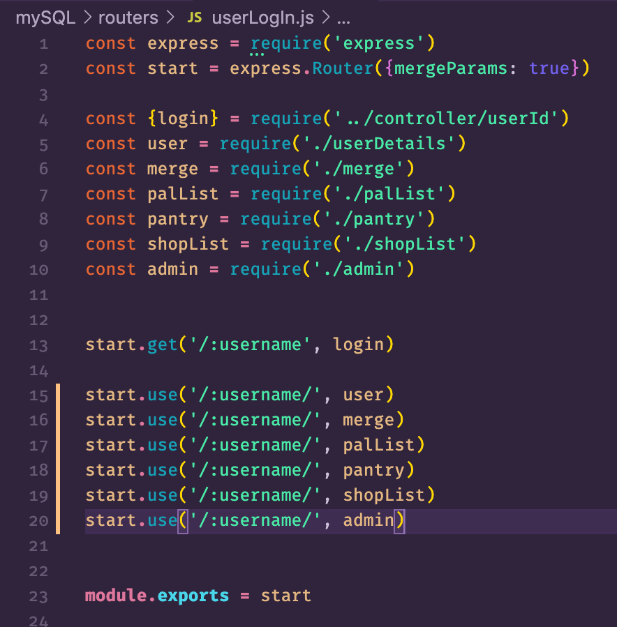

- in `Main Route Index file`

  ```js
  import express from 'express';
  const routes = express.Router(); // creating routes object

  routes.get('/', (req, res) => {
    //do something
  }); // instead of app.get(...)

  export default routes;
  ```

- in `Main Application Entrypoint file`

  ```js
  import routes from './routes/index';

  app.use(routes);
  // or with providing base-url to the router
  app.use("filter-path, example : '/' ", routes);
  ```

- Whenever we have a condition when handling request, so that it will send error response to client, It's better to return this response, so that we don't continue with the remaining request-handling-logic

---

### Handling unhandled routes

- This must be after all routes

  ```js
  app.all('*', (req, res, next) => {
    res.status(404).json({
      status: 'fail',
      message: `Can't find ${req.originalUrl} on this server`
    });
  });
  ```

---

## Serving Files / HTML Pages

- we have to use **Absolute Path**, so use `Path` package
- we use `path.join()` because this will automatically build the file-system-path in a way that works on both Linux systems and Windows systems which have different paths "`/`" or "`\`"

```js
const path = require('path');

// __dirname -> is a global variable from Node.js that holds the absolute path in the current OS

router.get('/add-product', (req, res, next) => {
  res.sendFile(path.join(__dirname, '..', 'views', 'add-product.html'));
});
```

---

### Static vs Dynamic Websites / APIs

- **Static vs Dynamic Websites**
  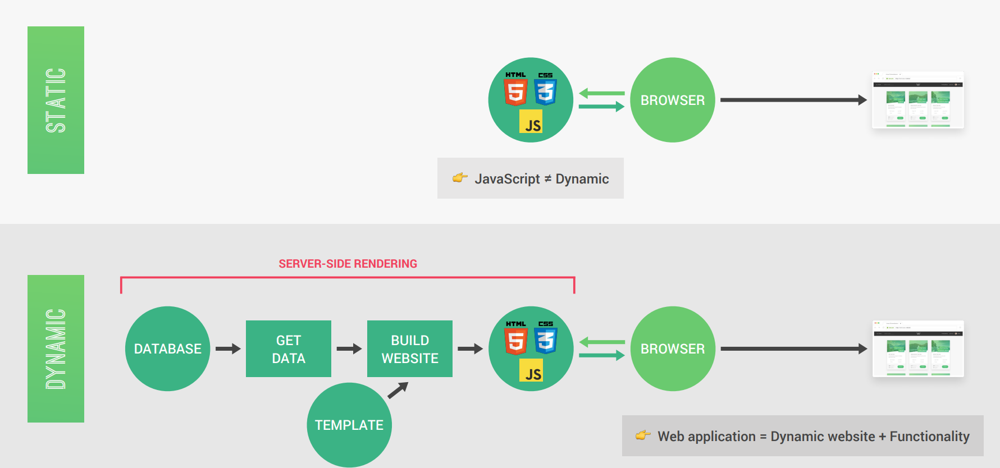
- **Static vs API-Powered Websites**
  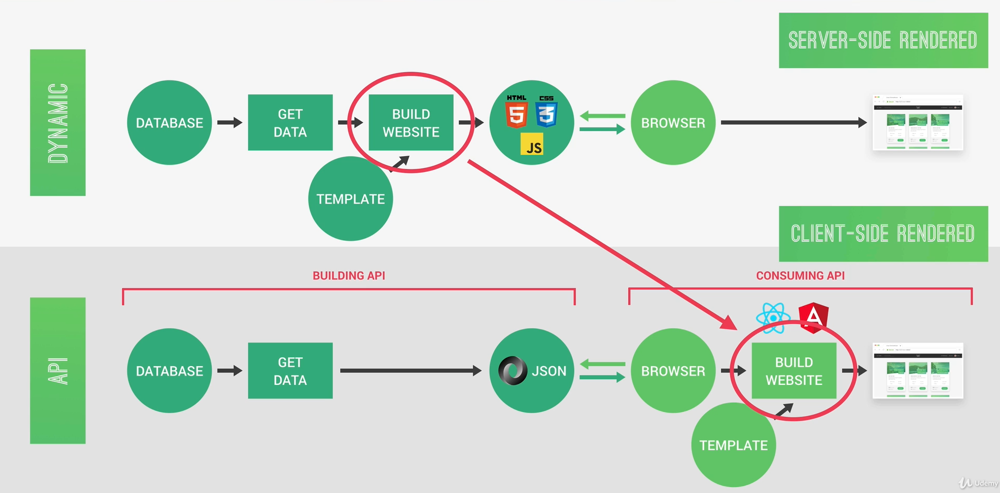

---

### Serving files statically

To serve static files such as images, CSS files, and JavaScript files, use the `express.static()` built-in middleware function in Express.

```js
// express.static(root, [options])
app.use(express.static('public'));

// Now, you can load the files that are in the public directory (without writing "public" as it will be the root):
http://localhost:3000/images/kitten.jpg
http://localhost:3000/css/style.css
http://localhost:3000/js/app.js
http://localhost:3000/images/bg.png
http://localhost:3000/index.html
```

- for that we specify a `public` folder which has the static files

  - By using `express.static('public')`, we define that all the static assets will always automatically be served from a folder called **"public"**

  ```js
  // in main app --> use this middleware
  app.use(express.static(path.join(__dirname, 'public')));
  // now when importing the css file in html, we act as we're inside the "public" folder
  ```

- To create a virtual path prefix (where the path does not actually exist in the file system) for files that are served by the express.static function, specify a mount path for the static directory, as shown below:

  ```js
  app.use('/static', express.static('public'))

  http://localhost:3000/static/images/kitten.jpg
  http://localhost:3000/static/css/style.css
  ```

---

### Serving Apps with Client-Side Routing

- when dealing with FE-SPA apps like `React`, we may use router like `react-router` and to do this, we need to tell express that if the endpoint-requested is not handled in the backend, we delegate the routing to the client-side-router using `/*`

```js
app.use(express.static(path.join(__dirname, 'build')));

// app.get('/', function (req, res) {}) // won't work

// will work
app.get('/*', function (req, res) {
  res.sendFile(path.join(__dirname, 'build', 'index.html'));
});
```

> More info [here](https://create-react-app.dev/docs/deployment/#serving-apps-with-client-side-routing)

---

## Template Engines


Template engines are used when you want to rapidly build web applications that are split into different components. Templates also enable fast rendering of the server-side data that needs to be passed to the application.

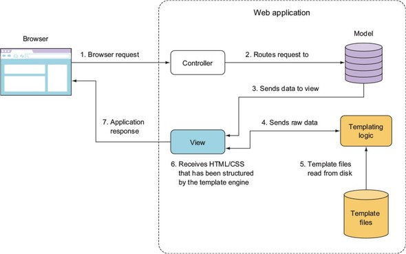


- For a server-side application written with NodeJS runtime, you can use a template engine to produce dynamic input based on variables passed to the templating-engine. (**it's like props passed to a component**)

  ```js
  render.get('/', (req, res, next) => {
    const products = ['product1', 'product2'];
    res.render('shop', { prods: products, docTitle: 'shop' });
  });
  ```

---

### handlebars (hbs)

- installation

  ```bash
  npm install hbs
  ```

- we don't have to import it but we have to tell `Express` --> where to find the `templates` in the app-settings

  - This will render `.hbs` files when `res.render` is called.
  - you also should put `.hbs` files in `views` folder

    ```js
    app.set('view engine', 'hbs'); // Using hbs as the default view engine
    app.set('views', path.join(__dirname, '..', 'views')); // selecting where the views could be found

    // rendering the hbs file
    app.get('/', (req, res) => {
      //Serves the body of the page aka "main handlebars" to the container //aka "index.handlebars"
      res.render('main', {
        firstName: 'Abdelrahman',
        lastName: 'Soltan'
      });
    });
    ```

---

## Error Handling

In Express, there's 2 types of errors that can happen: **Operation errors** and **Programming errors**

- **Operation Errors:** are problems that we can predict will inevitably happen at some point in the future, So we need to handle them in advance.
  - They have nothing to do with bugs in our code. instead, they depend on the user or the system or the network
  - ex:
    - user accessing an invalid route
    - inputting invalid data
    - application failing to connect to the database
- **Programming Errors:** They are bugs that developers introduce into our code
  - ex:
    - trying to read properties from `undefined` variable using `await` without `async`
    - accidentally using `request.query` instead of `request.body`

So when handling errors in express, we mean to handle **Operation errors** using one central error handling middleware

---

### Unhandled Rejections and Exceptions

After handling operation/programming errors, some errors may be still unhandled like (connecting to DB) or synchronous errors or else, we should handle each of these errors individually on its location, but it's also better to create global handling as a **safety net**

#### Handling Asynchronous promise rejections

For this, we use event-listener:

- Each time an unhandled rejection occurs somewhere in the app, the `process` object will **emit** an object called `"unhandledRejection"`
- we can subscribe to that event -> `process.on('unhandledRejection')`
- > can be after the server initialization

  ```js
  // server.js
  process.on('unhandledRejection', error => {
    console.log('UNHANDLED REJECTION! Shutting 💥 down...');
    console.log(err.name, err.message);

    // Shut down gracefully
    server.close(() => {
      process.exit(1);
    });
  });
  ```

#### Handling Synchronous Exceptions

**Uncaught Exceptions:** Any errors/bugs that occur in our synchronous code but are not handled anywhere

For this, we use event-listener:

- Each time an uncaught exceptions occurs somewhere in the app, the `process` object will **emit** an object called `"uncaughtException"`
- we can subscribe to that event -> `process.on('uncaughtException')`
- > **Note:** It must be on the very top of the code so that it's executed first to catch all sync-errors after that

  ```js
  // server.js
  // MUST BE ON TOP OF THE FILE
  process.on('uncaughtException', error => {
    console.log('Uncaught Exception! Shutting 💥 down...');
    console.log(err.name, err.message);

    // Here we must Shut down immediately
    process.exit(1);
  });
  ```
