## INDEX

- [INDEX](#index)
- [Node.js and the V8 Engine](#nodejs-and-the-v8-engine)
  - [Node.js Runtime](#nodejs-runtime)
  - [Phases of Event-Loop](#phases-of-event-loop)
  - [Node vs Javascript](#node-vs-javascript)
- [Thread Pool (Asynchronous I/O)](#thread-pool-asynchronous-io)
- [Node.js vs python / PHP /..](#nodejs-vs-python--php-)
- [Events](#events)
  - [EventEmitter](#eventemitter)
- [REPL](#repl)
- [Modules](#modules)
  - ["Common-JS" Module System](#common-js-module-system)
  - ["ECMAScript (ES)" Module System](#ecmascript-es-module-system)
  - [Module vs Package](#module-vs-package)
  - [Core-modules : Process Module](#core-modules--process-module)
  - [Core-modules : Path Module](#core-modules--path-module)
  - [Core-modules : File System Module](#core-modules--file-system-module)
  - [Core-modules : HTTP/HTTPS - URL](#core-modules--httphttps---url)
- [Installation](#installation)
  - [semantic versioning](#semantic-versioning)
  - [globally vs locally installation](#globally-vs-locally-installation)
    - [globally (-g)](#globally--g)
    - [locally (--save-dev)](#locally---save-dev)
  - [--save and --save-dev](#--save-and---save-dev)
- [HTTP server](#http-server)
  - [Create Node.js Web Server](#create-nodejs-web-server)
  - [HTTP Header](#http-header)
  - [Routing](#routing)
- [Import / Export Async Data (Streams-Promises)](#import--export-async-data-streams-promises)
  - [Streams Promises API](#streams-promises-api)
  - [stream-promise package](#stream-promise-package)
- [Logs](#logs)
  - [morgan](#morgan)
    - [installation](#installation-1)
- [Improving Performance](#improving-performance)
  - [Running multiple node-processes](#running-multiple-node-processes)
    - [Node Cluster Module](#node-cluster-module)
    - [Process Manager 2 (PM2)](#process-manager-2-pm2)
- [Work Threads](#work-threads)
- [Authentication using JWT](#authentication-using-jwt)
  - [NPM library jsonwebtoken](#npm-library-jsonwebtoken)

---

## Node.js and the V8 Engine

- `runtime` is the environment that `javascript` runs on
- `V8 engine` on browsers is used to run `javascript` on the **client-side** --> so `web-browser is a javascript runtime`

  

---

### Node.js Runtime

- `Node` is a `Javascript-Runtime` **not** a language or framework

- it uses `libuv` so that if `V8 engine` didn't find a `js` syntax like `process module` --> it goes to `libuv`

- `libuv` abstracts away all specific way do deal with `files` in different `Operation-Systems`, so that `node.js` can work on any system/platform, it does so by `binding` these ways to `node`

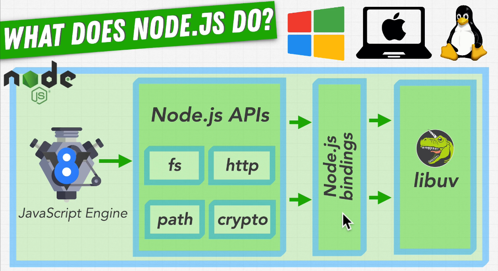
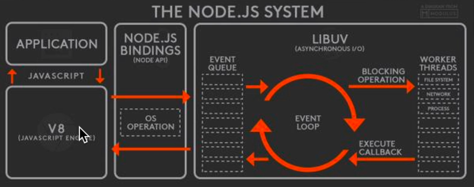

---

### Phases of Event-Loop

- Execution in this order :

  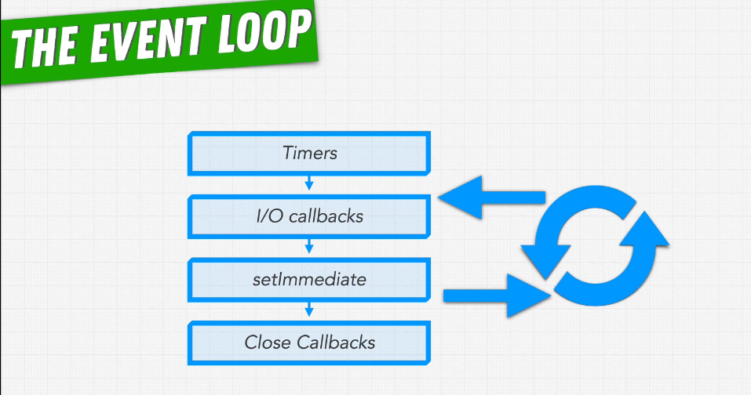
  
  

---

### Node vs Javascript

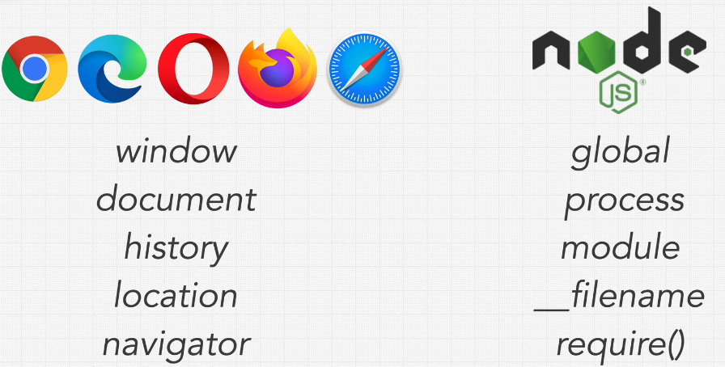

- `window` in `js` is ----> `global` in `node`

---

## Thread Pool (Asynchronous I/O)

- `node` runs on a `single thread` even if you have millions of users, so make sure you don't **block that thread**, --> here comes the rule of `Libuv` which gives us `4` additional threads **(or more)**

  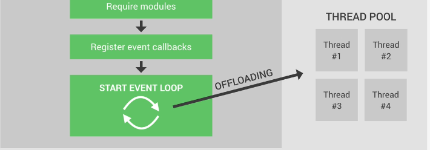
  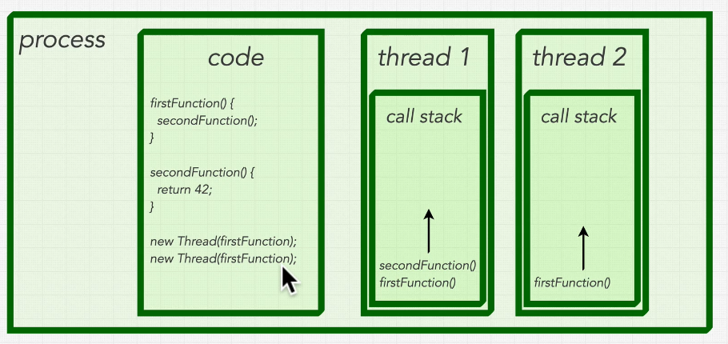

  - so `node` takes care of heavy things by `offloading` them to the `thread pool`
  - it simulates `asynchronous` task by doing each task in a single `call-stack (thread)`

- `Libuv Library` : A library written in `C` that provides **multithreading** to Node.js and allows for heavy processing.

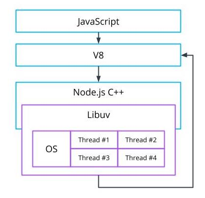

- Libuv takes advantage of the operating system's asynchronous interfaces before engaging the thread pool
- The thread pool is engaged for events that require more processing power including compression and encryption tasks
- The default thread pool includes `4` threads

---

## Node.js vs python / PHP /..

- node works best when you deal with `input/output` or `servers`, `(serving data / streaming)`

- it doesn't work well for heavy calculation like `machine learning`, `video processing`, `3D-games`

---

## Events

### EventEmitter

- On the backend side, Node.js offers us the option to build a similar system like (mouse clicks, keyboard button presses, reacting to mouse movements, and so on.) using the events module.
- EventEmitter provides multiple properties like `on` and `emit`. on property is used to bind a function with the event and emit is used to fire an event.
  - `emit` is used to trigger an event
  - `on` is used to add a callback function that's going to be executed when the event is triggered
- it works on the idea of `observer pattern` where

  - `emit` triggers an event
  - `on` observes an event and wait until it occurs

  
  

```js
const EventEmitter = require("events"); // class

const celebrity = new EventEmitter(); // instance
// This object exposes, among many others, the (on) and (emit) methods

// subscribe to celebrity for Observer-1
celebrity.on("new song released", function () {
  console.log("check the new song of your favourite singer");
});

// triggering the event
eventEmitter.emit("new song released");
```

---

## REPL

- `REPL` stands for [Read, Evaluate, Print, Loop] (the place we write js code in terminal after writing `$node`)

  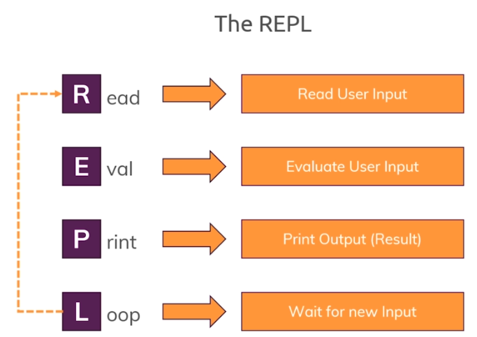

  - To access the Node.js REPL environment, run: `$node`
  - To exit node => `ctrl`+`d`
  - To run `index.js` use:
    - `$node src/index.js`
    - `$node src/index`
    - `$node src/.`
    - `$node src`
  - To run other files use:
    - `$ node src/path-to-file.js`
    - `$ node src/path-to-file`
  - try not to use `./` as you may run the node from another place than the one which has the `js` file

---

## Modules

The module system creates the ability to `export` and `import` JavaScript from separate files.

### "Common-JS" Module System

- Node.js uses the `Common JS module` system to break code into smaller chunks.

  - TypeScript compiles to the Common JS Module System.

- `export`

  ```js
  // exports as object  {actual_item : desired_name}
  module.exports = {
    myFirstFunction: myFirstFunction,
    mySecondFunction: mySecondFunction,
  };

  // or using ES6 shorthand property names
  module.exports = {
    myFirstFunction,
    mySecondFunction,
  };
  ```

- `Require`

  - When using `require`, a preceding `slash (/)` must come before a locally created module name; otherwise, Node.js will search the `core modules` and then `node_modules`.

  ```js
  const logger = require("./util/logger.js");

  // using ES6 object destructuring, to only get (myFirstFunction)
  const { myFirstFunction } = require("./util/logger.js");
  ```

- `__dirname` and `__filename`

  ```js
  // working file = /app/util/logger.js

  console.log(__dirname);
  // path of current module -->  /app/util

  console.log(__filename);
  // name of current module -->  /app/util/logger.js
  ```

---

### "ECMAScript (ES)" Module System

Starting from `Node.js 13.2.0` now `node.js` supports ECMAScript modules, known for their `import` and `export` statements

- The default format of modules in Node.js is the `CommonJS`. To make Node.js understand `ES` modules format, you have to explicitly make so.


- Additional Steps in order to use `ECMAScript-modules` :

  - The module's file extension is .mjs
  - Or the module's nearest parent folder has `{ "type": "module" }` in `package.json`

---

### Module vs Package

- `module` : a file containing some code that could be exported from this module

- `package` : collection of modules that have been **packaged** together

---

### Core-modules : Process Module

Not found in the browser APIs, Process relates to the global node execution process which occurs when you run a js file through Node.js.

- The Process module contains the ability to perform tasks immediately before the process exits, and when it exits.

  - `beforeExit` allows for asynchronous calls which can make the process continue.
  - `exit` only happens once all synchronous and asynchronous code is complete.

    ```js
    // create conditions for exit code options
    // example: 0 typically implies without errors, 1 with.

    process.exitCode = 1;

    process.on("beforeExit", () => {
      console.log("beforeExit event");
    });

    process.on("exit", (code) => {
      console.log(`exit event with code: ${code}`);
    });
    ```

- `process.env`

  - Process.env gives you access to the environment information of your Node.js application. It also allows you to add environment variables that can be used if your code is dependent on the environment it is run in.

- `process.stdout` it's like `console.log` but it does not force a new line break. This allows you to create helpful tools like progress bars.

- `process.argv`

  - An array containing your console arguments information for your executed process.

- `process.nextTick()`
  - Allows you to run JavaScript between the different phases of the event loop. process.
  - When we pass a function to `process.nextTick()`, we instruct the engine to invoke this function **at the end of the current operation**, before the next event loop tick starts

---

### Core-modules : Path Module

Using the path module allows us to normalize paths to work across platforms(Windows/Mac/Linux).

- The path module must be imported via `require('path')`. Once imported, there are three commonly used options

```js
const path = require("path");

// Enables you to get the absolute path from a relative path.
console.log(path.resolve("index.js"));
// prints /Users/user/Desktop/app/index.js

// Normalizes any path by removing instances of . , turning double slashes into single slashes and removing a directory when .. is found.
console.log(path.normalize("./app//src//util/.."));
// prints app/src

// Used to concatenate strings to create a path that works across operating systems. It joins the strings, then normalizes the result.
console.log(path.join("/app", "src", "util", "..", "/index.js"));
// prints  /app/src/index.js
```

---

### Core-modules : File System Module

- `const fs = require('fs');`
- allows for reading and writing to files with many options.

---

### Core-modules : HTTP/HTTPS - URL


---

## Installation

```bash
$ npm i module-name # install module to dependencies
$ npm i --save-dev module-name # install to dev dependencies (only for development and not for production)
$ npm i --save-dev module-name@1.19 # install a specific version (1.19 here) of module
```

- `package-lock.json`

  - contains all of the information for the dependencies of the modules you have installed.
  - it has the dependencies for the package you installed so that the main `package.json` is clean.
  - it's important to get the exact `semantic versioning`
  - It is best practice to add `package-lock.json` as well as `./node_modules` to your `.gitignore` file
  - It is best practice to add `package-lock.json` as well as `./node_modules` to your `.gitignore` file

- `npm audit` --> It shows all vulnerabilities your dependencies got (excluding peerDependencies).
  - You can disable the warning for single package installations with the `--no-audit` flag

---

### semantic versioning

[npm semver calculator](https://semver.npmjs.com/)

- `*` means that you'll accept all updates
- `^` means that you'll only accept minor releases
- `~` means that you'll only accept patch releases
- `>, >=, <=, <` are also valid for saying you'll accept versions greater/less/equal to the listed version
- `||` allows you to combine instructions
  - ex : "prettier": "2.2.1 || >2.2.1 < 3.0.0" which says use prettier greater than 2.2.1 and less than version 3.0.0.

---

### globally vs locally installation

> In general, all packages should be installed locally.

#### globally (-g)

- it install the package globally on the system, so you can use it in the `terminal` & on the `scripts`

#### locally (--save-dev)

- it makes the package available to the current project (where it stores all of the node modules in node_modules)
- It will not be available as a command that the shell can resolve until you install it globally

---

### --save and --save-dev

| dependencies                                                                                 | dev-dependencies                                                                                                                                                 |
| -------------------------------------------------------------------------------------------- | ---------------------------------------------------------------------------------------------------------------------------------------------------------------- |
| These are the packages that are required for the application to work properly.               | These are the packages that you need while developing the project but not when deploying the project. These packages are not built when the project is deployed. |
| `--save` saves the name and version of the package being installed in the dependency object. | `--save-dev` saves the name and version of the package being installed in the dev-dependency object.                                                             |

---

## HTTP server

### Create Node.js Web Server

Node.js makes it easy to create a simple web server that processes incoming requests `asynchronously`.

- explanation of code below :

  - `requestListener function` is the callback function that takes a request `object` and a response `object` as parameters.

  - The `request` object contains things such as the `requested URL`, but in this example we ignore it and always return "Hello World".

    - when using `request` with other servers, you must `end` it in order to be sent ---> `req.end()`

  - The `response` object is how we send the headers and contents of the response back to the user making the request.

    - Here we return a `200` response code (signaling a `successful response`) with the body "Hello World".

  - `http.createServer` method creates a server that calls `requestListener` whenever a request comes in.

  - `server.listen(8080)` : tells the server to wait (listen) for incoming requests on the specified `port 8080`

```js
const http = require("http");

const requestListener = function (req, res) {
  res.writeHead(200, {
    "Content-Type": "text/plain",
  });
  res.end("This is the massage that will be shown in the browser!"); // endicate that the respones is complete and ready to be sent
};

const server = http.createServer(requestListener);
server.listen(PORT, () => {
  // this callback-function is optional, it display this message on the console when you start the server --> node index.js
  console.log(`listening on port ${PORT}`);
});

//-----------------------or-----------------------//

// creating a new server
const server = require("http").createServer();

// request will be when i open the link http://127.0.0.1:8000/
server.on("request", (req, res) => {
  fs.readFile("test-file.txt", (err, data) => {
    // here the stuf to do after the file was read
    if (err) console.log(err);
    res.end(data);
  });
});

// starting the server (will run on http://127.0.0.1:8000/)
server.listen(8000, "127.0.0.1", () => {
  console.log("listening.......");
});
```

### HTTP Header

it's a piece of information about the response that we are sending back

```js
// Calling response.writeHead method
response.writeHead(404, {
  "Content-Length": Buffer.byteLength(body),
  "Content-Type": "text/plain",
});
```

---

### Routing

- when you have a `server` that has different `URLs` that response differently on which one is being requested --> we call these different `URLs` : `EndPoints`
- `Routing` refers to how an application’s endpoints (`URIs`) respond to client `requests`.
- There are two ways to implement routing in node.js which are :

  - By Using Framework => `Express.js`
  - Without using Framework

    ```js
    if (req.url === "/message") {
      res.end("Here are your messages!");
    } else {
      res.statusCode = 404;
      res.end();
    }
    ```

---

## Import / Export Async Data (Streams-Promises)

- when you have `async data` that is exported we want it to be done when it's exported so that we don't get empty data
- AKA: when you deal with streams you include them in a promise
- to do so we use `Promise`
  - we export the promise and not the function
  - we include the function you want to be the resolved value of the promise
  - in the server-listening place we run(await) the function

```js
const server = http.createServer(app); // using express as a listening function for the http-server

async function startServer() {
  // this is done so that we have the data ready when we start the server before any requests so that it's available for any request
  await loadPlanetsData(); // the function that contains the promise

  server.listen(PORT, () => {
    console.log(`listening on port http://localhost:${PORT}`);
  });
}
startServer();
```

---

### Streams Promises API

The `stream/promises API` provides an alternative set of asynchronous utility functions for streams that return `Promise objects` rather than using `callbacks`.

- The API is accessible via
  - `require('stream/promises')`
  - `require('stream').promises`

---

### stream-promise package

it's a 3rd party library can be used instead of the above

- Convert any Stream instance to `thenable`
- [stream-promise](https://www.npmjs.com/package/stream-promise)

---

## Logs

### [morgan](https://www.npmjs.com/package/morgan)

Morgan is an HTTP request level `Middleware`.

- It is a great tool that logs the requests along with some other information depending upon its configuration and the preset used.
- It's helpful while debugging and also if you want to create `Log files`.

#### installation

- usually it sould be before any sequrity condsederation or after `cors`

```js
app.use(cors(corsOptions)); // Middleware
app.use(morgan("combined")); // Middleware
```

---

## Improving Performance

### Running multiple node-processes

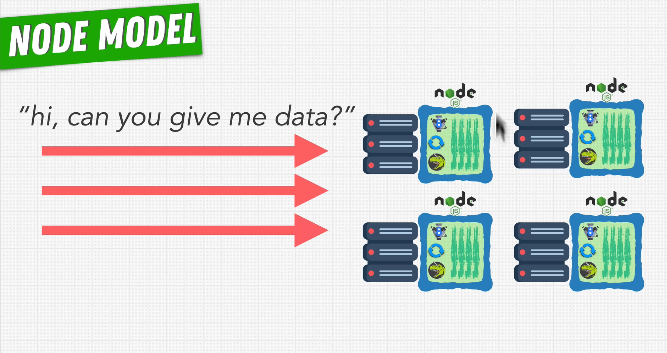

- node.js runs on a single thread, so to do multithreading:

  - run node on multiple processes side-by-side to share the `work`
  - it means that instead of taking each request and handling it in `one node server (process)`, we instead `spread` the requests out between multiple node.js processes
  - they run side-by-side without effecting the performance

- It's done when you want maximum performance on the server

---

#### Node Cluster Module

The Node. js Cluster module enables the creation of child processes (workers) that run simultaneously and share the same server port. Each spawned child has its own event loop, memory, and V8 instance.

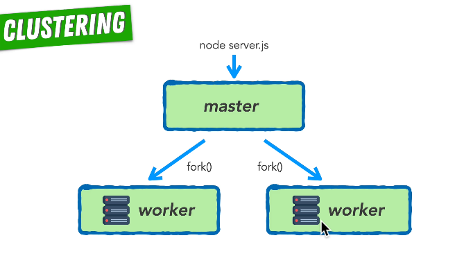

- each time you use `fork()` method you create new process

- the number of process should equall number of `cors in the cpu`

  ```js
  const NUM_WORKERS = os.cups().length;
  ```

- this is similar to `Load Balancer` or `Horizontal Scalling` or `round robin`

  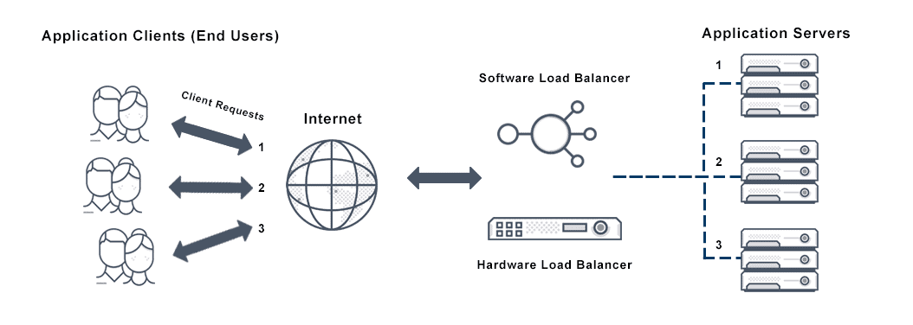

```js
const cluster = require("cluster");
const os = require("os");

if (cluster.isMaster) {
  // any code here will be executed first time whe server is executed
  console.log("master has started");

  const NUM_WORKERS = os.cups().length;

  for (let i = 0; i < NUM_WORKERS; i++) {
    cluster.fork(); // create a worker
  }
} else {
  // the code here will run when code is running as a worker-process
  console.log("worker has started");
  app.listen(5000);
}
```

---

#### Process Manager 2 (PM2)

- [PM2](https://pm2.keymetrics.io/)
- [NPM PM2](https://www.npmjs.com/package/pm2)
- It's much easier than `Node Cluster Module`

```js
console.log("worker has started");
app.listen(5000);
```

```bash
# you should install pm2 globally
pm2 start server.js -i max # name of the js-file, i -> for "instance"

# same thing but sends log to a file
pm2 start server.js -l logs.txt -i max
```

---

## Work Threads

- `work threads` vs `clusters`

  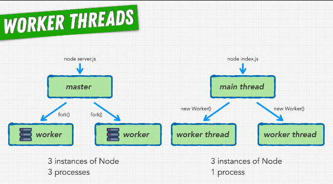

- `work threads` make us work on one process with multiple threads

---

## Authentication using JWT

> see Authentication section in the database-notes file

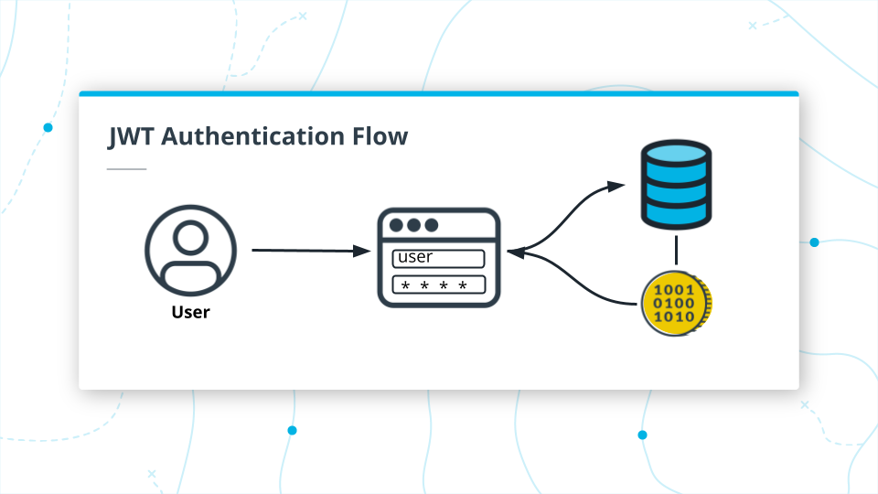

### NPM library [jsonwebtoken](https://www.npmjs.com/package/jsonwebtoken)

- creating user

  ```ts
  const create = async (req: Request, res: Response){
    const user: User {
      username: req.body.username,
      password: req.body.password,
      }
    try {
      const newUser = await store.create(user)
      var token = jwt.sign({ user: newUser }, process.env.TOKEN_SECRET); // store TOKEN_SECRET in .env file

      res.json(token) // send the token so that the client can use it for future HTTP-requests
    } catch(err) {
    res.status(400)
    res.json(err + user)
    }
  }
  ```

- verifing the user
  - use the `jwt.verify` method
- in real life, the token will not be part of the request body. Instead, tokens live as part of the `request header`.

  - When we use JWTs, we pass them as a special header called the Authorization header using this format:
    - ```ts
      Authorization: Bearer <token>
      ```
  - In Node, we can locate the authorization header sent with a request like this:

    ```ts
    const authorizationHeader = req.headers.authorization;
    const token = authorizationHeader.split(" ")[1]; // Parsing the header
    ```

- putting it all together

  ```ts
  const create = async (req: Request, res: Response) => {
      try {
          const authorizationHeader = req.headers.authorization
          const token = authorizationHeader.split(' ')[1]
          jwt.verify(token, process.env.TOKEN_SECRET)
      } catch(err) {
          res.status(401)
          res.json('Access denied, invalid token')
          return
      }

      ....rest of method is unchanged
  }
  ```
