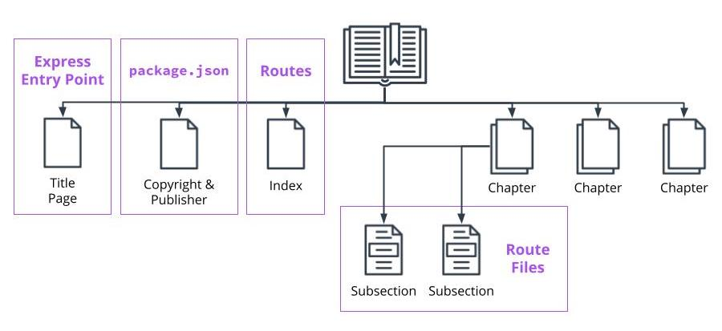
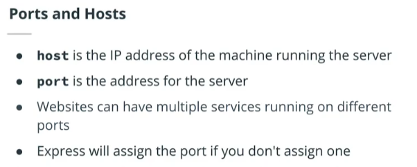
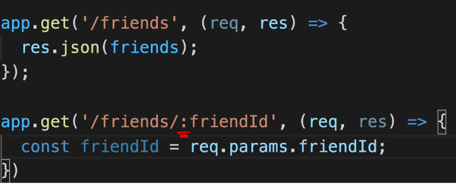
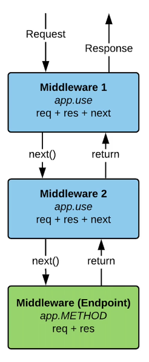

## INDEX

- [INDEX](#index)
- [Express](#express)
- [App Structure with Express](#app-structure-with-express)
- [installation](#installation)
- [Express Basics](#express-basics)
  - [Endpoints](#endpoints)
  - [Request](#request)
  - [Response](#response)
- [Middleware](#middleware)
  - [Types of Middleware](#types-of-middleware)
  - [Using Middleware](#using-middleware)
- [POST requests](#post-requests)
- [Routes](#routes)
- [Serving Files / HTML Pages](#serving-files--html-pages)
  - [Serving files statically](#serving-files-statically)
- [Templating Engines](#templating-engines)
  - [handlebars (hbs)](#handlebars-hbs)

---

## Express

- Express is a framework used to:

  - Set up the server
  - Work with routes
  - Apply middleware

- Express solves problems, because it:
  - Builds on HTTP module
  - Handles requests and parses data with minimal configuration
  - Makes it easy to add middleware, so that you can expand server's functionality easily

---

## App Structure with Express

An Express Project Is Organized Like a **Book**



---

## installation

```bash
npm i express
npm i --save-dev @types/express   # for typescript
```

---

## Express Basics

- `The Application Object` --> `app` : defines how the server works.

  ```js
  const app = express();
  ```

- Core Methods
  

  - `.listen()` - listens for connections to a specified host and port
  - `.get()` - used to get a route and takes a route and a callback function as arguments. The callback function takes two arguments, the request from the browser and the response from the server. Additionally, middleware can also be passed in as an argument
  - `.post(),` `.put(),` `.delete()` - the other app methods that make up endpoints. They require having the ability to store data.

- ports and Hosts

  

---

### Endpoints

- Endpoints are made up of a `method` you wish to perform on your data, and the `route` you would like to use for that data.

  - ex : `GET https://restcountries.eu/rest/v2/name/canada `

- create an endpoint

```js
app.method("/route", middleware, (callback) => {
  // what you want to do with the request or response
});

app.get("/students", (req, res) => {
  // perform an action with req or res.
});
```

---

### Request

Request has many properties and methods available to it for getting information about the request from the browser.

- some properties : `ip`, `cookies`, `path`, `subdomains`, `params()`, `query`
- to get parameters from the `url` ->

  - the `:` is express-syntax to make it know that what comes after it is a `parameter`

    

---

### Response

It is the response from server back to the browser. Like request, it has many properties and methods available to it.

- some methods :
  - `end()` ----> for `string`
  - `send()` ----> for `HTML`-syntax
  - `status()`, `cookie()`
  - `sendFile()` : to send HTML-files
  - `json()` : to send Json format

---

## Middleware

Middleware is a `function/s` that is applied between the request and response. Meaning you get the request, do something with it, and then send the response.

 

- Common uses of middleware include checking the `authentication` status of a user before sending a response or logging the request before sending the response.

- `next()`
  - It's a method from the `express router`
  - It calls the next middleware in a chain of middlewares
  - Without adding `next` to your middleware function, your application will get stuck on the middleware.

### Types of Middleware

- Built-in Middleware

  - `express.static` - for serving static files
  - `.json` - for parsing incoming JSON
  - `.urlencoded` - for parsing incoming urlencoded data

- 3rd Party Middleware

- Custom Middleware

---

### Using Middleware

two ways of applying middleware:

- Application/route level

  - `.use()` method is a method that can be applied to the application object or to route objects. It is used for applying middleware and can take in a route, and middleware as arguments

    - it uses **partial-matching** of the `route` --> ((start with) '/page1')

    ```js
    app.use(middleware);

    //--------------------------------------------------//

    // or with handling different routes
    app.use("/page1", middleWare_function1); // here it means that the route must (start with) '/page1'
    app.use("/", middleWare_function2); // here it means that the route must (start with) '/'

    // note : we always puth the one with '/' at the end as all routes start with '/'
    ```

  - `.get()` / `.post()` are like `use()` but only GET or POST requests
    - it uses **Exact-matching** of the `route` --> ((must be eaual to) '/page1')

- Endpoint level
  ```js
  students.get('/', middleware, (req, res) => { // do stuff });
  ```

---

## POST requests

- when we take data from the client it should be in `JSON` format, so we use `.json()` method from `Express`
  - The `express.json()` function is a built-in **middleware function** in Express.
  - It parses incoming requests with JSON payloads and is based on `body-parser`.
  - should be before any `routing` / `POST requests`

```js
// this middleware is required to be able to access the request body
app.use(express.json())

app.post('/friends',(req,res)={
  const newFriend = {
    name: req.body.name,
  }
})
```

---

## Routes

- With the `router object`, you're able to create a directory of routes and separate the functionality of each route onto its own file.

- `Router()` --> The router method is applied to the top-level express object. With this method, you can create a routes object that you can apply your endpoints to rather than the application object.

  - in `Main Route Index`

    ```js
    import express from 'express';
    const routes = express.Router(); // creating routes object

    routes.get('/', (req, res) => { //do something });

    export default routes;
    ```

  - in `Main Application Entrypoint`

    ```js
    import routes from "./routes/index";

    app.use("filter-path, example : '/' ", routes);
    ```

---

## Serving Files / HTML Pages

- we have to use `absolute path`, so use `Path` package

```js
const path = require("path");

router.get("/add-product", (req, res, next) => {
  res.sendFile(path.join(__dirname, "../", "views", "add-product.html"));
});
```

---

### Serving files statically

- like when you have `css` files you want to use in the `html` file

  - for that we specify a `public` folder which has the static files

  ```js
  // in main app --> use this middleware
  app.use(express.static(path.join(__dirname, "..", "public")));
  ```

---

## Templating Engines

Template engines are used when you want to rapidly build web applications that are split into different components. Templates also enable fast rendering of the server-side data that needs to be passed to the application.


- For a server-side application written with NodeJS runtime, you can use a template engine.

---

### handlebars (hbs)

- installation

  ```bash
  npm install hbs
  ```

- we don't have to import it but we have to tell `Express` --> where to find the `templates` in the app-settings

  - This will render `.hbs` files when `res.render` is called.
  - you also should put `.hbs` files in `views` folder

    ```js
    // Using hbs as the default view engine
    app.set("view engine", "hbs");

    // selecting where the views could be found
    app.set("views", path.join(__dirname, "..", "views"));

    // rendering the hbs file
    app.get("/", (req, res) => {
      //Serves the body of the page aka "main handlebars" to the container //aka "index.handlebars"
      res.render("main", {
        firstName: "Abdelrahman",
        lastName: "Soltan",
      });
    });
    ```

---
