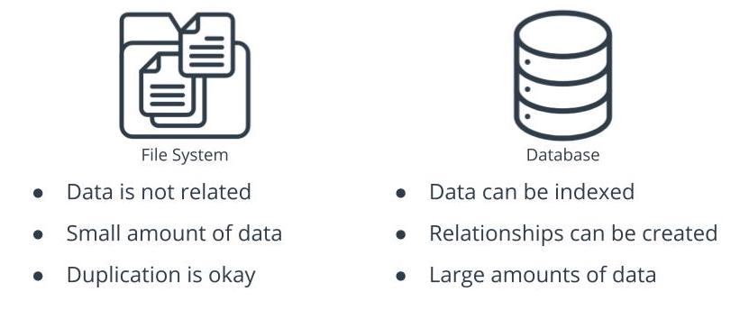
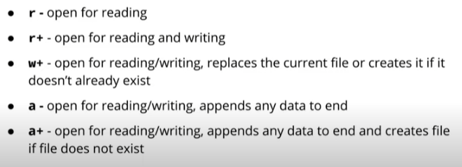
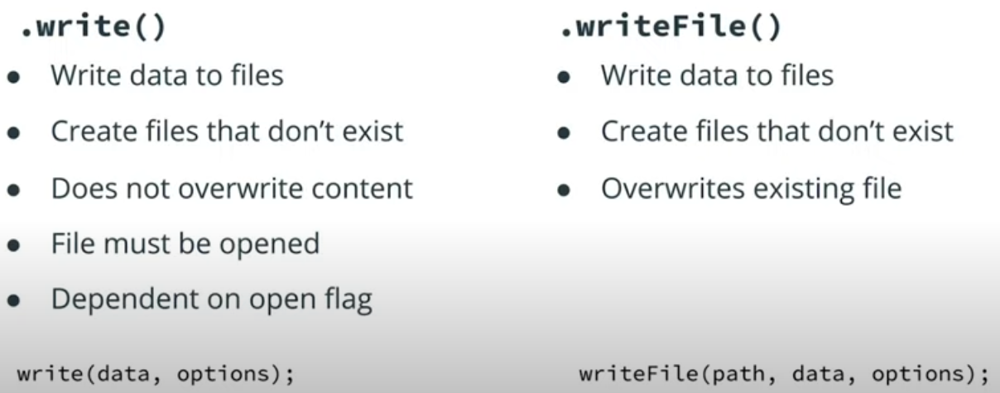
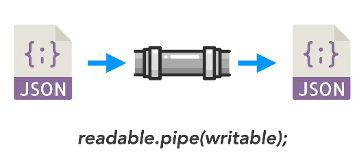

# INDEX

- [INDEX](#index)
  - [Asynchronous node.js and Callbacks](#asynchronous-nodejs-and-callbacks)
    - [callbacks](#callbacks)
    - [Asynchronous node.js and Callbacks](#asynchronous-nodejs-and-callbacks-1)
  - [File System vs Database](#file-system-vs-database)
  - [Using File System to Open and Write Files](#using-file-system-to-open-and-write-files)
    - [File System Flags](#file-system-flags)
    - [Reading and Writing with File System](#reading-and-writing-with-file-system)
    - [Reading, Moving, Renaming and Deleting Files](#reading-moving-renaming-and-deleting-files)
  - [Streams](#streams)
    - [Pipe](#pipe)

---

## Asynchronous node.js and Callbacks

- Node.js introduced a `non-blocking I/O` environment to extend this concept to file access, network calls and so on.

---

### callbacks

- we use `callbacks` a lot in `node` as we deal with `events`, `requests`, .. and we don't know when they will be executed
- to escape from `callback-hell` we use `Promises or Async/Await`

- instead use `__dirname` in `template-literals` which indicate the place where the `js` file exists ->

  ```js
  const tempOverview = fs.readFileSync(
    `${__dirname}/templates/template-overview.html`,
    "utf-8"
  );
  ```

---

### Asynchronous node.js and Callbacks

- Node.js introduced a `non-blocking I/O` environment to extend this concept to file access, network calls and so on.

- To avoid using callbacks, we can use the `File System Promises API` which allows the asynchronous methods to return promises.

```js
import {promises as fsPromises} from fs;
// or
import {promises as fs} from fs;
```

---

## File System vs Database



- databases are just files.

  - With Databases the content is structured, can be relational, and indexed.

- With File System, you can only control where you write to the file, and where you read from the file
  - so File System is only good for **simple data storage**.

---

## Using File System to Open and Write Files

### File System Flags

File System Flags are used for identifying `read/write` operations available when **opening** a file.



---

### Reading and Writing with File System

- `.open()` - Used to open a file. Takes a filename and flag as arguments.

  ```js
  const writeData = async () => {
  const myFile = await fsPromises.open('myfile.txt', a+);
  }
  ```

- `.write()` / `.writeFile()` Takes data, and options as arguments.
- 

  ```js
  const writeData = async () => {
    const myFile = await fsPromises.open('myfile.txt', a+);
    await myFile.write('add text');
  }

  // or

  const writeData = async () => {
  const myFile = await fsPromises.writeFile('myfile.txt', 'The added text');
  }
  ```

---

### Reading, Moving, Renaming and Deleting Files

- `.read()` - Used to read a file. The file must be opened first. requires the creation of a `buffer` to do so. Takes a buffer and options as arguments.

  ```js
  const readData = async () => {
    const buff = new Buffer.alloc(26);  // 26 characters max
    const myFile = await fsPromises.open('myfile.txt', a+);
    await myFile.read(buff, 0, 26);
    console.log(myFile);
  }
  ```

- `.readFile()` - Used to read the entire contents of a file. Takes a path and options as arguments.

  ```js
  const readData = async () => {
    const myFile = await fsPromises.readFile("myfile.txt", "utf-8");
    console.log(myFile);
  };
  ```

- `.rename()` - Used to rename or move a file. Takes the old file path and new file path as arguments.

- `.mkdir()` - Used to make new directories. Takes a directory path as an argument.

- `.unlink()` - Used to **remove** a file. Takes a file path as an argument.

- `.rmdir()` - Used to remove an empty directory. Takes a directory path as an argument.

- For removing directories that contain files without needing to remove the files first, it's easiest to use a third-party module such as [rimraf](https://www.npmjs.com/package/rimraf)

---

## Streams

- it's a good idea to `stream` large datasets so that they don't overwhelm te (cpu, Ram,..)
- to read streams we use the `File System (fs)` : it `emmits` a event called `'data'`

```js
fs.createReadStream("kepler_data.csv").on("data", (data) => {
  console.log(data);
});
```

### Pipe

- It connects `stream source` with `stream distination`
- in the `pipe`, we put the thing that deal with incoming data in the start of the `pipe`, ex : parsing data functionality




```js
fs.createReadStream("kepler_data.csv")
  .pipe(parser) // do parsing on incoming data
  .on("data", (data) => {
    console.log(data);
  });
```
