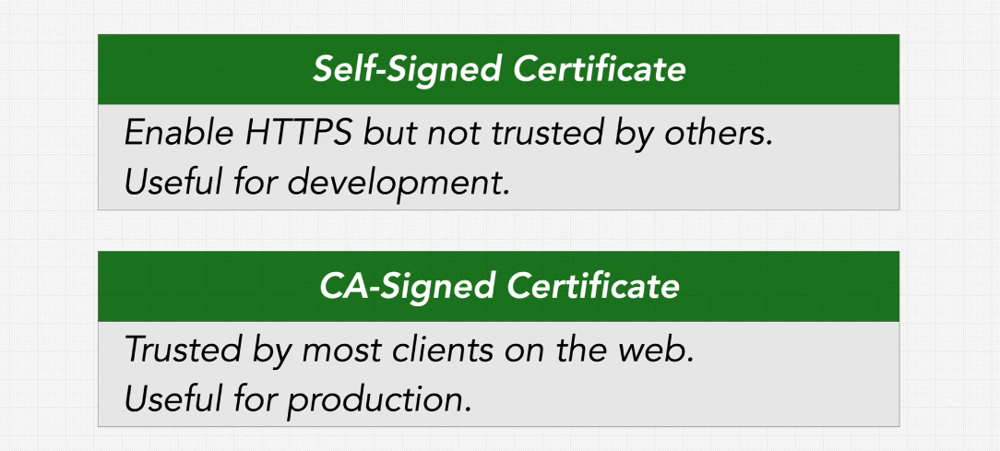
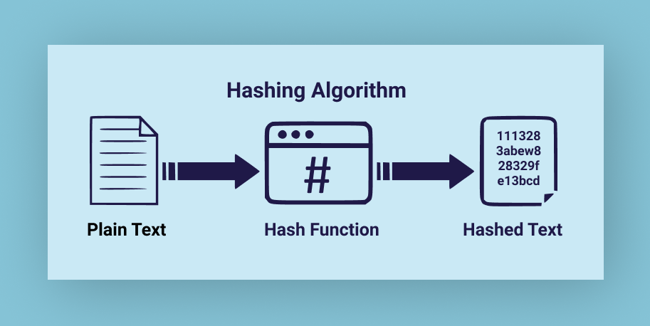
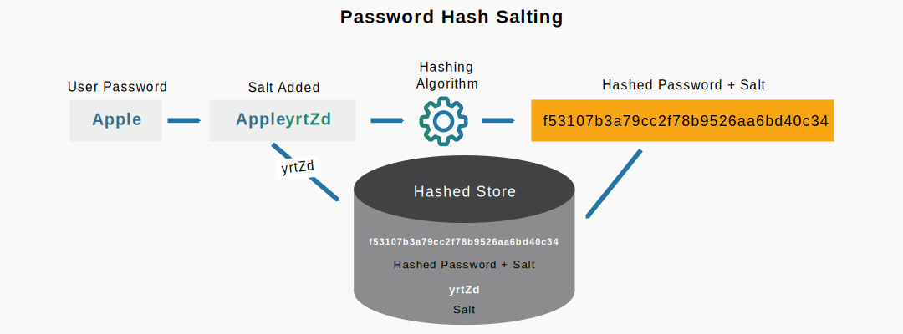
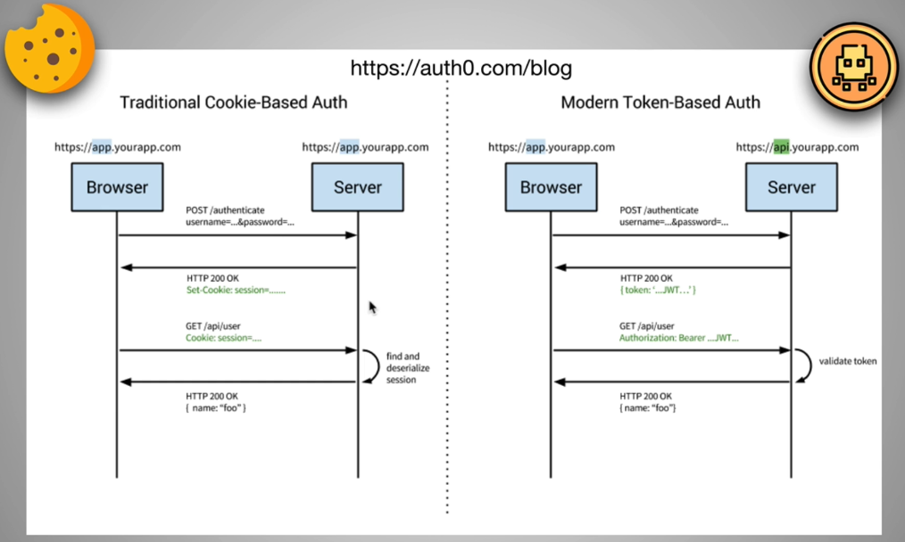

# INDEX

- [INDEX](#index)
  - [SSL, TLS and HTTPS](#ssl-tls-and-https)
    - [TLS Certificates](#tls-certificates)
    - [HTTPS with Node](#https-with-node)
  - [CORS with `node.js`](#cors-with-nodejs)
  - [Database Security](#database-security)
    - [Protecting Passwords (AUTHENTICATE)](#protecting-passwords-authenticate)
    - [`Hashing`](#hashing)
      - [`salt`](#salt)
  - [Authorization](#authorization)
    - [API Key](#api-key)
    - [Cookie-vs-Token](#cookie-vs-token)
    - [Sessions](#sessions)
    - [JSON Web Tokens (JWTs)](#json-web-tokens-jwts)
      - [Parts of a JSON Web Token](#parts-of-a-json-web-token)
  - [Oath2](#oath2)
    - [OAuth 2.0 With Google](#oauth-20-with-google)
      - [passport_js](#passport_js)

---

## SSL, TLS and HTTPS

- `SSL` stands for **Secure Sockets Layer** and, it's the standard technology for keeping an internet connection secure and safeguarding any sensitive data that is being sent between two systems, preventing criminals from reading and modifying any information transferred, including potential personal details. The two systems can be a server and a client or server to server

- `TLS` (**Transport Layer Security**) is just an updated, more secure, version of SSL. We still refer to our security certificates as SSL because it is a more commonly used term.

- `HTTPS` (**Hyper Text Transfer Protocol Secure**) appears in the URL when a website is secured by an SSL certificate.

### TLS Certificates



---

### HTTPS with Node


- video 184

- [npm helmet](https://www.npmjs.com/package/helmet?activeTab=versions)

---

## CORS with `node.js`

- [npm cors](https://www.npmjs.com/package/cors)

```js
// in app.js file
const cors = require('cors');

// CORS
const corsOptions = {
  origin: 'http://localhost:3001',
  optionsSuccessStatus: 200 // some legacy browsers (IE11, various SmartTVs) choke on 204
};

// ---------------Middlewares--------------- //
app.use(cors(corsOptions)); // global Middleware to all routes
```

---

## Database Security

### Protecting Passwords (AUTHENTICATE)

- In case you have passwords in the database:
  - Never store plain text passwords! Not in the database and not in your code
- `Password Hashing` and `Salt` obscure passwords, so raw password strings are never stored or persisted

---

### `Hashing`



- hashed password run through a **function** that generates a long encrypted string from the original password.
- same input will always result same output, this is a weakness of `reverse-lookup` where a `hash` can be compared against dictionary of hashes and their passwords ----> `salt` solves this problem
- `hashing functions` work on one way only (can't be reversed)
  - you can't put a `hash` input and get a `string` output
  - you can only put a `string` and get out a `hash`
- `Bcrypt` is a very common library for password hashing in web apps

---

#### `salt`

- By adding `Salt`, an extra string sequence to the beginning or end of a password before hashing it which makes it much harder for attackers to decrypt passwords




- `bcrypt` hashing method with `salt` and `pepper`
- [npm bcrypt](https://www.npmjs.com/package/bcrypt)

- **Steps**:

  1. `.env file`

     ```bash
     BCRYPT_PASSWORD=speak-friend-and-enter # the extra string can be anything
     SALT_ROUNDS=10 I
     ```

  2. `model.js`

     ```ts
     // in the class
     // create method
     async create(u: User): Promise<User> {
      try {
        // @ts-ignore
        const conn = await Client.connect()
        const sql = 'INSERT INTO users (username, password_digest) VALUES($1, $2) RETURNING *'

        // bcrypt
        const hash = bcrypt.hashSync(
          u.password + pepper,
          parseInt(saltRounds) // from data in .env above
        );
        // now we have the hashed-password to store in the database

        const result = await conn.query(sql, [u.username, hash])
        const user = result.rows[0]

        conn.release()

        return user
      } catch(err) {
        throw new Error(`unable create user (${u.username}): ${err}`)
      }
     };
     ```

     - or to `AUTHENTICATE`

     ```ts
     async authenticate(username: string, password: string): Promise<User | null> {
         const conn = await Client.connect()
         const sql = 'SELECT password_digest FROM users WHERE username=($1)'

         const result = await conn.query(sql, [username])

         console.log(password+pepper)

         if(result.rows.length) {

           const user = result.rows[0]

           console.log(user)

           if (bcrypt.compareSync(password+pepper, user.password_digest)) {
             return user
           }
         }

         return null
       }
     ```

---

## Authorization

### API Key

is a code used to identify and authenticate an application or user.

- API keys are available through platforms, such as a white-labeled internal marketplace.
- They also act as a unique identifier and provide a secret token for authentication purposes.

---

HTTP is stateless. All the requests are stateless. However, there are situations where we would like our states to be remembered. To overcome the stateless nature of HTTP requests, we could use either a session or a token.

- There're 2 ways for user-authenticating
  - sessions
  - tokens
- The biggest difference here is that
  - in `JWT` : the user’s state is not stored on the server, as the state is stored inside the token on the `client side` instead.
  - in `sessions` : the server have to do additional step (make a request to the `database` to look up the session)
- Most of the modern web applications use JWT for authentication for reasons including scalability and mobile device authentication.

---

### Cookie-vs-Token



There're pros and cons for each, and based on situation we choose what suits us, more on that [here](https://developer.okta.com/blog/2022/02/08/cookies-vs-tokens)

- **Web Token**:
  - It's an encoded string for storing data, used to transport data between the client and the server
  - digitally signed (can't modify the token or it will be invalid)
- **Stateless Authentication**:
  - the server doesn't actively keep track of who's logged in
  - a **token** is used to verify the user instead
    - the token is saved in the LocalStorage in the first auth request(login), and then it's sent in every request to the server when we request data related to the authenticated user (with the unique token)

---

### Sessions


Here, the server will create a session for the user after the user logs in. The session id is then **stored on a cookie on the user’s browser**. While the user stays logged in, the cookie would be sent along with every subsequent request. The server can then compare the session id stored on the cookie against the session information stored in the memory to verify user’s identity and sends response with the corresponding state!

---

### JSON Web Tokens (JWTs)


Here, the server creates JWT with a secret and sends the JWT to the client. The client stores the JWT (usually in local storage) and includes JWT in the header with every request. The server would then validate the JWT with every request from the client and sends response.

- It's `Stateless`
- It's very usefull when you have 2 or more seperate servers or `load-balancers` that share the same `secret-key` and you can access them without having to `log in` each time

#### Parts of a JSON Web Token


- `Header` : consists of two parts: the type of the token, which is JWT, and the signing algorithm being used, such as `HMAC` `SHA256` or `RSA`.

- `Payload` : responsible for containing information specific to the currently authenticated user --> (who is making the request?) **NOT SECRET**

- `Signature` : If the signature strings match, we can trust that the data within the JWT is **authentic**.
  - To create the signature part you have to take the encoded header, the encoded payload, a secret, the algorithm specified in the header, and sign that.
    
  - it's **SECRET**

The output is three Base64-URL strings separated by dots that can be easily passed in HTML and HTTP environments

- [JWT playground](https://jwt.io/)

---

## Oath2

OAuth 2.0, which stands for “Open Authorization”, is a standard designed to allow a website or application to access resources hosted by other web apps(ex: `google sign in`) on behalf of a user.


- `OAuth 2.0` is an **authorization protocol** and NOT an authentication protocol.

  - it is designed primarily as a means of granting access to a set of resources, for example, remote APIs or user’s data.

- `Access Token` is a piece of data that represents the **authorization** to access resources on behalf of the end-user.
  - `JWT` format is often used

---

### OAuth 2.0 With Google

- [source](https://developers.google.com/identity/protocols/oauth2)
- Video 193

#### [passport_js](https://www.passportjs.org/)

Passport is authentication middleware for Node.js

- each `strategy` implies a package
