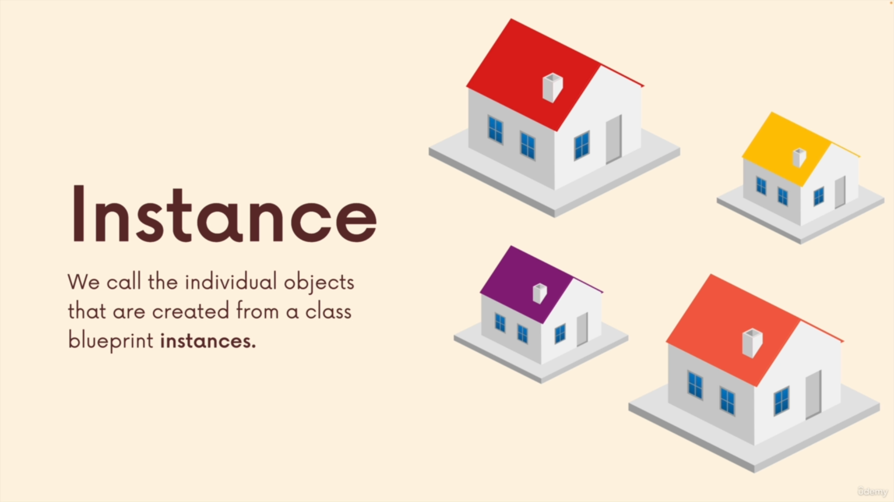
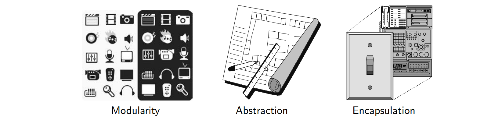
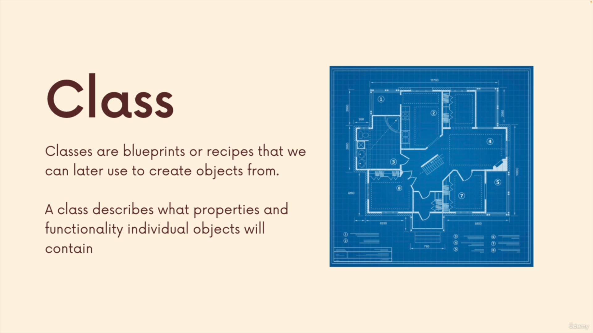
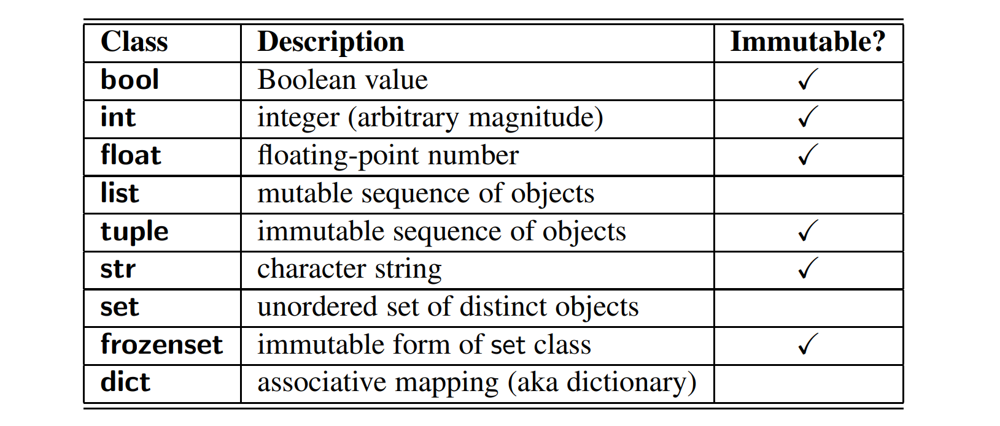
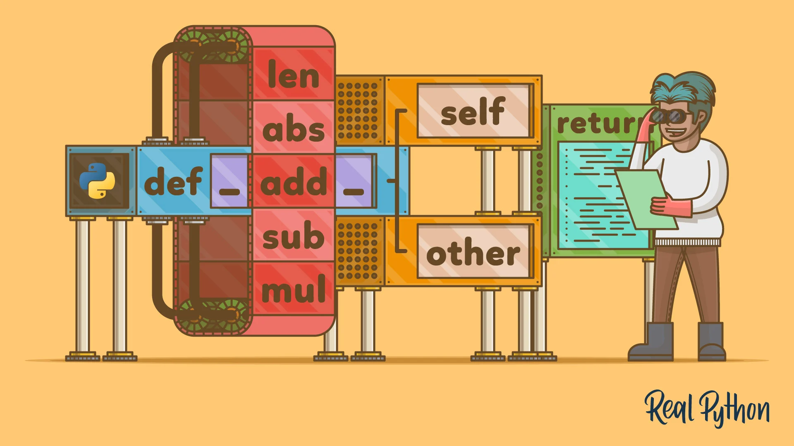
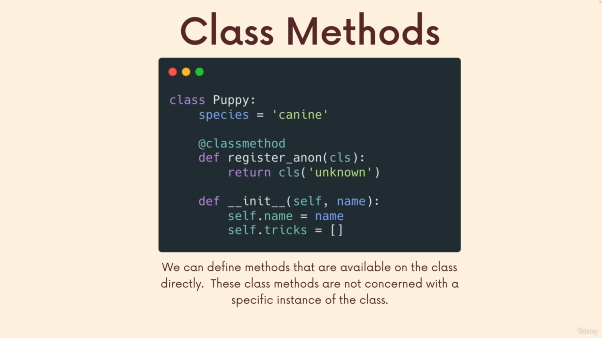
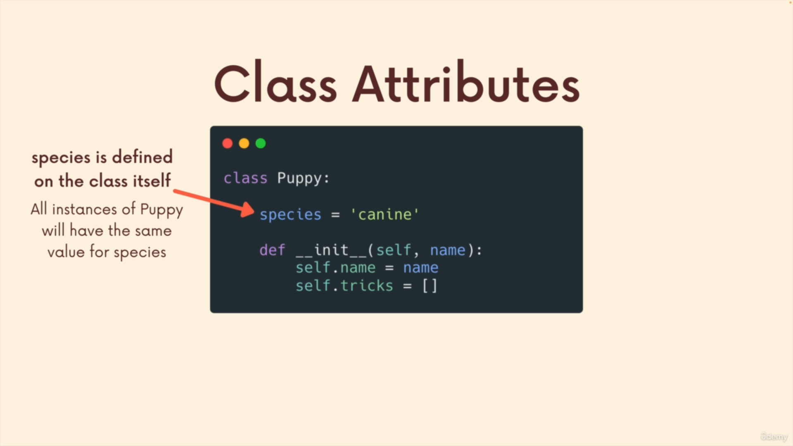
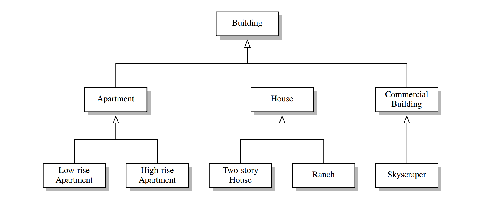
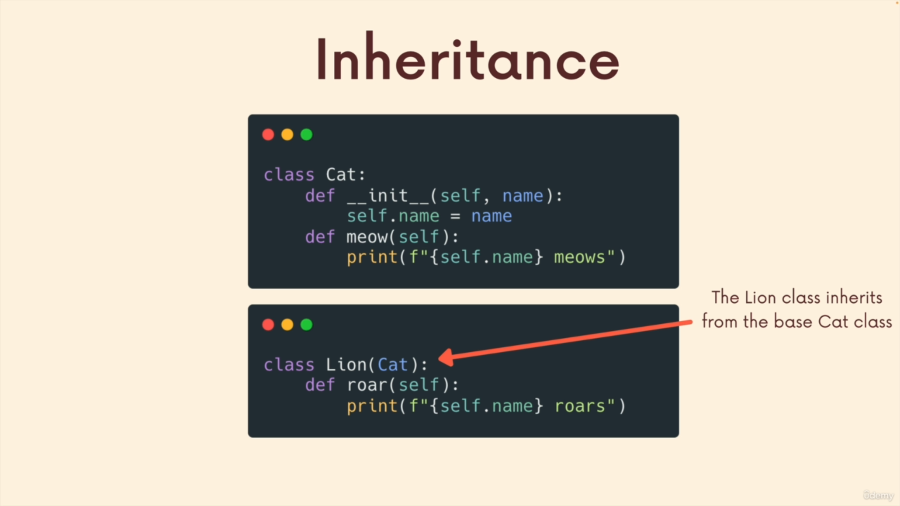
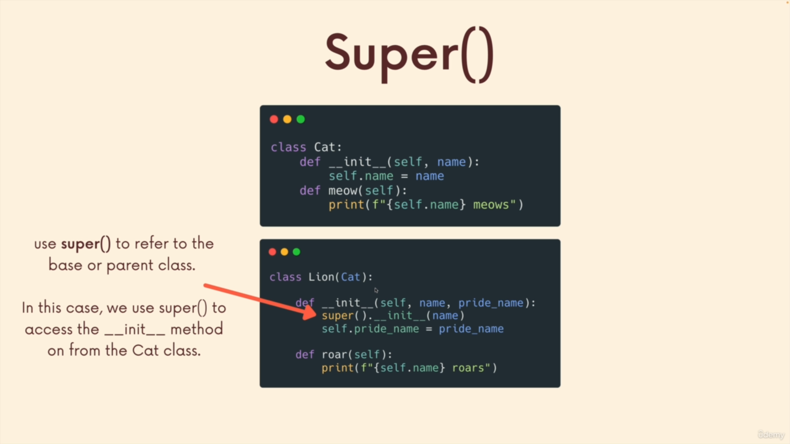

# INDEX

- [INDEX](#index)
  - [OOP](#oop)
  - [Object-Oriented Design Principles](#object-oriented-design-principles)
    - [Modularity Principle](#modularity-principle)
    - [Abstraction Principle](#abstraction-principle)
    - [Encapsulation Principle](#encapsulation-principle)
  - [Classes](#classes)
    - [The `self` Identifier](#the-self-identifier)
    - [Constructor](#constructor)
    - [Python’s Built-In Classes](#pythons-built-in-classes)
    - [Operator and Function Overloading in Custom Python Classes](#operator-and-function-overloading-in-custom-python-classes)
    - [Class Methods](#class-methods)
    - [Attributes (Class Data Members)](#attributes-class-data-members)
  - [Encapsulation](#encapsulation)
  - [Inheritance](#inheritance)
    - [Abstract Base Classes](#abstract-base-classes)

---

## OOP

**Object Oriented Programming**: is an approach to programming that involves modeling things into python objects. These objects can contain both `data` and `functionality` all wrapped-up together into a reusable component

The main “actors” in the object-oriented paradigm are called objects. Each object is an instance of a class. Each class presents to the outside world a concise and consistent view of the objects that are instances of this class



---

## Object-Oriented Design Principles



### Modularity Principle

- Modern software systems typically consist of several different components that must interact correctly in order for the entire system to work properly. Keeping these interactions straight requires that these different components be well organized.
- Modularity refers to an organizing principle in which different components of a software system are divided into separate functional units (modules).
- This is particularly relevant in a study of **data structures**, which can typically be designed with sufficient abstraction and generality to be reused in many applications.

### Abstraction Principle

- The notion of abstraction is to distill a complicated system down to its most fundamental parts. Typically, describing the parts of a system involves naming them and explaining their functionality.
- Applying the abstraction paradigm to the design of data structures gives rise to abstract data types (**ADTs**).
  - An ADT is a mathematical model of a data structure that specifies the type of data stored, the operations supported on them, and the types of parameters of the operations.
  - An ADT **specifies what each operation does, but not how it does it**.
- Python has a tradition of treating abstractions implicitly using a mechanism known as **"duck typing"**. As an interpreted and dynamically typed language, there is no “compile time” checking of data types in Python, and no formal requirement for declarations of abstract base classes. Instead programmers assume that an object supports a set of known behaviors, with the interpreter raising a run-time error if those assumptions fail.
  - > The description of this as “duck typing” comes from an adage attributed to poet James Whitcomb Riley, stating that “when I see a bird that walks like a duck and swims like a duck and quacks like a duck, I call that bird a duck.”
- Python supports abstract data types using a mechanism known as an **abstract base class (ABC)**. An abstract base class cannot be instantiated (i.e., you cannot directly create an instance of that class), but it defines one or more common methods that all implementations of the abstraction must have. An ABC is realized by one or more concrete classes that inherit from the abstract base class while providing implementations for those method declared by the `ABC`.

### Encapsulation Principle

- Different components of a software system should not reveal the internal details of their respective implementations.
- One of the main advantages of encapsulation is that it gives one programmer freedom to implement the details of a component, without concern that other programmers will be writing code that intricately depends on those internal decisions.
- It allows the implementation details of parts of a program to change without adversely affecting other parts, thereby making it easier to fix bugs or add new functionality with relatively local changes to a component.
- Python provides only loose support for encapsulation. By convention, names of members of a class (both data members and member functions) that start with a single underscore character (e.g., **`_secret`**) are assumed to be nonpublic and should not be relied upon.

---

## Classes



- Use meaningful names for identifiers:
  - Classes (other than Python’s built-in classes) should have a name that serves as a singular noun, and should be capitalized (e.g., `Date` rather than date or `Dates`). When multiple words are concatenated to form a class name, they should follow the so-called **“CamelCase” convention** in which the first letter of each word is capitalized (e.g., `CreditCard`).
  - Identifiers that represent a value considered to be a constant are traditionally identified using all capital letters and with underscores to separate words (e.g., `MAX_SIZE`).
  - identifiers in any context that begin with a single leading underscore (e.g., `_secret`) are intended to suggest that they are only for “internal” use to a class or module, and not part of a public interface.
  - Functions, including **member functions** of a class, should be lowercase. If multiple words are combined, they should be separated by underscores (e.g., `make_payment`). The name of a function should typically be a verb that describes its affect. However.
    - if the only purpose of the function is to `return` a value, the function name may be a noun that describes the value (e.g., `sqrt` rather than `calculate_sqrt`).

---

### The `self` Identifier

Each instance from a class must maintain its own properties & methods. Therefore, each instance stores its own instance variables to reflect its current state.

> **`self`** identifies the **created instance** upon which a method is invoked

- It initializes an empty object that refers to the newly created instance, and which is passed as the first parameter to the `__init__` method.
- when using a class-method that is called with one parameter, for example, as my `card.charge(200)`. The `self` parameter is not passed explicitly by the programmer when invoking a method. Instead, the interpreter automatically binds the instance upon which the method is invoked to the `self` parameter.

---

### Constructor

it initializes the data members of the class when an object of class is created by calling the specially-named `__init__` method that serves as the constructor of the class

- **"Dender" (double underScore) init method** `__init__()` which is a reserved method called when an object is created, It's responsible for establishing the **state** of a newly created instance object with appropriate instance variables

```py
class Person:
  def __init__(self, name, age):
    self.name = name
    self.age = age
    self.hobbies = []
```

- The process of creating a new instance of a class is known as instantiation. In general, the syntax for **instantiating** an object is to invoke the `constructor` of a class.

  ```py
  # instantiating
  p1 = Person("John", 36) # Object definition
  ```

---

### Python’s Built-In Classes

- A class is **"immutable"** if each object of that class has a fixed value upon instantiation that cannot subsequently be changed. For example, the `float` class is immutable. Once an instance has been created, its value cannot be changed
- Commonly used built-in classes for Python:
  

---

### Operator and Function Overloading in Custom Python Classes



- If you’ve used the `+` or `*` operator on a `str` object in Python, you must have noticed its different behavior when compared to `int` or `float` objects:
- You might have wondered how the same built-in operator or function shows different behavior for objects of different classes. This is called `operator overloading` or `function overloading` respectively.
- By default, the `+` operator is undefined for a new class. However, the author of a class may provide a definition using a technique known as operator overloading. This is done by implementing a specially named method. In particular, the `+` operator is overloaded by implementing a method named `"__add__"` , which takes the right-hand operand as a parameter and which returns the result of the expression. That is, the syntax, `a+b`, is converted to a method call on object a of the form, "a.`__add__`(b)".

> When a binary operator is applied to two instances of different types, as in **3 \* "love me"** , Python gives deference to the class of the left operand. In this example, it would effectively check if the int class provides a sufficient definition for how to multiply an instance by a string, via the `__mul__` method. However, if that class does not implement such a behavior, Python checks the class definition for the right-hand operand, in the form of a special method named `__rmul__` (i.e., “right multiply”). This provides a way for a new user-defined class to support mixed operations that involve an instance of an existing class (given that the existing class would presumably not have defined a behavior involving this new class).

```py
class Person:
    def __init__(self, first_name, last_name, age):
        self.first_name = first_name
        self.last_name = last_name
        self.age = age

    # overloading the + operator to add the ages of two people
    def __add__(self, other):
        return self.age + other.age

    # overloading the * operator to multiply the ages of two people
    def __mul__(self, other):
        return self.age * other.age

    # overloading the str() function to return the full name of a person
    def __str__(self):
        return f'Person({self.first_name},{self.last_name},{self.age})'

    # overloading the repr() function to return the full name of a person
    def __repr__(self):
        return f'Person({self.first_name},{self.last_name},{self.age})'

    john = Person('John', 'Sam', 36)
    john2 = Person('John', 'Sam', 36)

    print(john + john2) # 72
    print(john * john2) # 1296
    print(str(john)) # Person(John,Sam,36)
    print(repr(john)) # Person(John,Sam,36)
```

---

### Class Methods

- Some methods return information about the state of an object, while others modify the state of an object.

  - Methods that modify the state of an object are known as **mutators**.
  - Methods that return information about the state of an object are known as **accessors**.

- **Instance Method**

  ```py
  class Person:
    def __init__(self, first_name, last_name, age):
        self.first_name = first_name
        self.last_name = last_name
        self.age = age

    def get_full_name(self):
        return f'Person({self.first_name},{self.last_name},{self.age})'

    john = Person('John', 'Sam', 36)
    print(john.get_full_name())
  ```

- **Class Method**

  - here we use the decorator `@classmethod` to define a class method that is invoked on the class rather than on an instance of the class
    
  - it uses the `cls` identifier (`class` is a reserved keyword in Python)
  - It's usually used to instantiate a class from a string
  - To solve the problem of "The chicken or the egg" -> "How to create an instance of a class from a string if we don't have an instance of the class yet?"
    - We can use a `class method` to create an instance of a class from a string
    - Then we can use that instance to create other instances of the class
    - Python knows the order of execution of the code when it sees **`@classmethod` decorator**

  ```py
  class Person:
      def __init__(self, first_name, last_name, age):
          self.first_name = first_name
          self.last_name = last_name
          self.age = age

      def get_full_name(self):
          return f'Person({self.first_name},{self.last_name},{self.age})'

      @classmethod
      def from_string(cls, string):
          first_name, last_name, age = string.split(',')
          return cls(first_name, last_name, age)

      john = Person('John', 'Sam', 36)
      print(john.get_full_name())

      john2 = Person.from_string('John,Sam,36')
      print(john2.get_full_name())
  ```

- Difference between `instance method` and `class method`
  - `instance method` is invoked on an instance of the class
  - `class method` is invoked on the class itself
  - `instance method` takes `self` as the first parameter (because it refers to the instance itself)
  - `class method` takes `cls` as the first parameter (because it refers to the class itself)

---

### Attributes (Class Data Members)

As an object-oriented language, Python provides two scopes for attributes: **class attributes** and **instance attributes**.

- **class attribute**
  
  - is a Python variable that belongs to a class rather than a particular object. It is shared between all the objects of this class and it is defined outside the constructor function, **init**(self,...), of the class.
  - all instances of the class will have the same value of that attribute
  - defined outside the constructor.
- **instance attribute**
  - is a Python variable belonging to one, and only one, object. This variable is only accessible in the scope of this object and it is defined inside the constructor function, `__init__(self,..)` of the class.
  - defined inside the constructor.

A `class-level data member` is often used when there is some value, such as a constant, that is to be shared by all instances of a class. In such a case, it would be unnecessarily wasteful to have each instance store that value in its instance namespace.

---

## Encapsulation

It's a way to hide the data and the methods that operate on data from the outside world. It is a concept of bundling data and methods that work on that data within one unit, e.g., a `class` in Python.

- in `c++`, `java`, this concept is more loaded with **hiding** things from outsiders

  - but `python` has another philosophy: **trust other programmers**
    - Python does not support formal access control, but names beginning with a single underscore (`_`) are conventionally akin to **protected**, while names beginning with a double underscore (`__`) (other than special methods) are akin to **private**.

- Using the underscore `_` symbol

  - **single underscore** `_` is used to **mark a variable as protected** for internal use. It is just a convention and not enforced by the Python interpreter.
  - **double underscore** `__` is used to **mark a variable as private** for internal use. The interpreter changes the name of the variable to prevent accidental access.

  ```py
  class Person:
      def __init__(self, first_name, last_name, age):
          self._first_name = first_name
          self._last_name = last_name
          self._age = age

      def get_full_name(self):
          return f'Person({self._first_name},{self._last_name},{self._age})'

      john = Person('John', 'Sam', 36)
      print(john._first_name) # John -> we can access it but it's not recommended
      print(john.get_full_name()) # Person(John,Sam,36) -> better way to access it
  ```

> Note: Python doesn't support access control keywords like `private`, `protected`, and `public`, etc. like other languages do. However, it has a naming convention for variables to indicate the access level.

---

## Inheritance

A natural way to organize various structural components of a software package is in a **hierarchical** fashion, with similar abstract definitions grouped together in a level-by-level manner that goes from specific to more general as one traverses up the hierarchy. An example of such a hierarchy is shown in the Figure. Using mathematical notations, the set of `houses` is a **subset** of the set of buildings, but a **superset** of the set of `ranches`. The correspondence between levels is often referred to as an **“is a” relationship**, as a house is a building, and a `ranch` is a `house`.



- In object-oriented programming, the mechanism for a modular and hierarchical organization is a technique known as **inheritance**.
- This allows a new class to be defined based upon an existing class as the starting point.
- In object-oriented terminology, the existing class is typically described as the **base class**, **parent class**, or **superclass**, while the newly defined class is known as the **subclass** or **child class**.
- There are two ways in which a subclass can differentiate itself from its superclass. A subclass may specialize an existing behavior by providing a new implementation that overrides an existing method. A subclass may also extend its superclass by providing brand new methods.
- EX:
  
- The mechanism for calling the inherited constructor relies on the syntax, `super()`
  
  - it calls the `__init__` method that was inherited from the superclass
- To access inherited properties and methods, we use the `super()` function -> `super().method_name()`

  ```py
  class Building:
      def __init__(self, name, address):
          self.name = name
          self.address = address

      def get_address(self):
          return self.address

      def get_name(self):
          return self.name

  class House(Building):
      def __init__(self, name, address, num_bedrooms):
          super().__init__(name, address)
          self.num_bedrooms = num_bedrooms

      def get_num_bedrooms(self):
          return self.num_bedrooms

      # override the method with access to the superclass method
      def get_name(self):
          return f'House: {super().get_name()}'
  ```

---

### Abstract Base Classes

In classic object-oriented terminology, we say a class is an abstract base class if its only purpose is to serve as a base class through inheritance. More formally, an **"abstract base class"** is one that cannot be directly instantiated, while a **"concrete class"** is one that can be instantiated.

> Python’s collections module provides several abstract base classes that assist when defining custom data structures that share a common interface with some of Python’s built-in data structures. These rely on an object-oriented software design pattern known as the **template method pattern**

---
