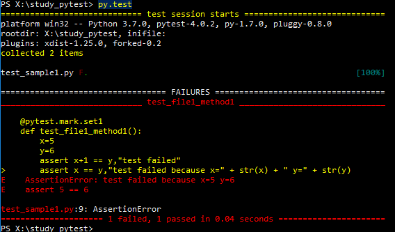

# INDEX

- [INDEX](#index)
  - [Unit testing in Python](#unit-testing-in-python)
  - [Testing Classes](#testing-classes)
  - [Testing functions](#testing-functions)
  - [Handing Test Exceptions](#handing-test-exceptions)
  - [pytest](#pytest)

---

## Unit testing in Python

- Python has a built-in module called `unittest` that you can use to write unit tests for your programs.
- You can use this module to write tests for your own functions and make sure your code is working as expected.
- Unit tests are some pieces of code to exercise the input, the output and the behaviour of your code.

---

## Testing Classes

- To test a class, we need to create a class that inherits from `unittest.TestCase`.
- We use the `setUp()` method to create instances of the class we want to test.
- We use the `assertEqual()` method to verify that the result obtained is the same as the expected result.

```python
import unittest

def add(x, y):
    return x + y

class TestAdd(unittest.TestCase):
    def test_add(self):
        self.assertEqual(add(10, 20), 30)
        self.assertEqual(add(-10, 20), 10)
        self.assertEqual(add(-10, -20), -30)
        self.assertEqual(add(0, 0), 0)

if __name__ == '__main__':
    unittest.main()
```

---

## Testing functions

- `assert`

  - is a method provided by the `unittest` module.
  - It tests whether the result obtained is the same as the expected result.

    ```py
    import unittest

    def main():
        test_add()

    def add(x, y):
        return x + y

    def test_add():
        assert add(10, 20) == 30
        assert add(-10, 20) == 10
        assert add(-10, -20) == -30
        assert add(0, 0) == 0

    if __name__ == '__main__':
      main()
    ```

- `assertRaises`

  - is a method provided by the `unittest` module.
  - It tests whether the function raises an exception when it is called with the given arguments.

    ```py
    import unittest

    def main():
        test_divide()
        test_divide_raises()

    def divide(x, y):
        if y == 0:
            raise ValueError("Can not divide by zero!")
        return x / y

    def test_divide():
        assert divide(10, 2) == 5
        assert divide(10, 5) == 2
        assert divide(10, 0) == 0

    def test_divide_raises():
        with assertRaises(ValueError):
            divide(10, 0)

    if __name__ == '__main__':
      main()
    ```

---

## Handing Test Exceptions

- `AssertionError`

  - is raised when an `assert` statement fails.
  - it gives us ability to provide a custom message to be displayed when the assertion fails.

```py
import unittest

def main():
    test_divide()

def divide(x, y):
    if y == 0:
        raise ValueError("Can not divide by zero!")
    return x / y

def test_divide():
    try:
        divide(10, 0)
    except AssertionError:
        print("AssertionError: Can not divide by zero!")

if __name__ == '__main__':
  main()
```

---

## pytest

// TODO: read this [tutorial](https://www.guru99.com/pytest-tutorial.html) and add notes

It's a framework that makes building simple and scalable tests easy.

- it will run all files of the form `test_*.py` or `*_test.py` in the current directory and its subdirectories.
- it will run all functions and classes which have names that start with `test_` prefixed.

- Example:

  - Test file: `test_add.py`

    ```py
    import pytest

    def add(x, y):
        return x + y

    def test_add():
        # testing logic
    ```

  - To run the tests, enter the following command in the terminal:

    ```sh
    pytest
    ```

- It provide us with descriptive output
  
