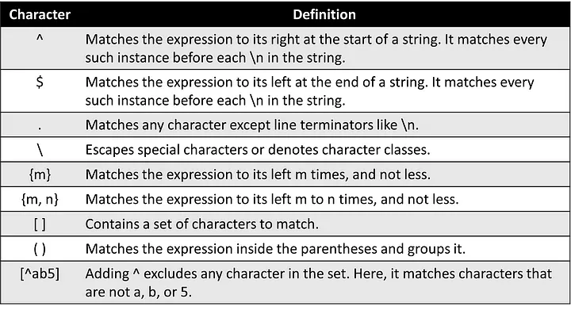

# INDEX

- [INDEX](#index)
  - [Regular Expressions (Regex)](#regular-expressions-regex)
  - [Regex Rules](#regex-rules)

---

## Regular Expressions (Regex)

**Regular expressions** are a powerful language for matching text patterns. This section will explain the basic syntax of regular expressions, and demonstrate how they can be used to search text for patterns.

- It's used instead of manually searching for a string or pattern in a text

  ```py
  # Manually (BAD)
  if '@' in email and '.' in email:
    print('Valid email')

  # Regex (GOOD)
  import re
  if re.search(r'@.*\.', email): # '\' before '.' to escape it (e.g. ".com")
    print('Valid email')
  ```

  - `r` in front of the string means that it's a **raw string** and not a normal string. which means that it will ignore the special characters like `\n` and `\t` and treat them as normal characters

- It's done using `re` library

---

## Regex Rules

They are a set of rules that are used to match a pattern in a string.



- It can be used to match a single character or a group of characters (e.g. a word) and the position of the match in the string

Examples:

- `.`: matches any character except a newline

  ```py
  # any character followed by '@'
  re.search(r'.@', 'Hello World') # false
  re.search(r'.@', 'Hello@World') # true
  ```

  - If you want to use literal `.` you have to escape it using `\` (e.g. `\.`)

    ```py
    # any character followed by '.' ✅
    re.search(r'.\.', 'Hello World') # false
    re.search(r'.\.', 'Hello.World') # true

    # any character followed by '.' ❌
    re.search(r'..', 'Hello World') # true -> "He
    ```

- `+`: matches **one or more** repetitions of the preceding regex

  ```py
  re.search(r'.+', 'Hello World') # "Hello World" (1 or more characters)

  # any character followed by '@' followed by any character
  re.search(r'.+@.+', 'Hello') # false
  re.search(r'.+@.+', 'Hello@') # false
  re.search(r'.+@.+', 'Hello@World') # true
  ```

  - It's equivalent to `{1,}` or `..*`

    ```py
    re.search(r'.+', 'Hello World') # "Hello World" (1 or more characters)
    re.search(r'.{1,}', 'Hello World') # "Hello World" (1 or more characters)
    re.search(r'..*', 'Hello World') # "Hello World" (1 character followed by 0 or more characters) (equivalent to .+)
    ```

- `*`: matches **zero or more** repetitions of the preceding regex

  - When mixed with `.` it will match any number of characters and not just one

    ```py
    re.search(r'..', 'Hello World') # true -> "He"

    # Matches zero or more repetitions of the preceding regex
    re.search(r'..*', 'Hello World') # "Hello World" (0 or more characters)
    re.search(r'..*', ' Hello World') # " " (0 or more characters)
    ```

- `?`: matches **zero or one** repetitions of the preceding regex

  ```py
  # Matches zero or one repetitions of the preceding regex
  re.search(r'..?', 'Hello World') # "He" (0 or 1 characters)
  re.search(r'..?', ' Hello World') # " H" (0 or 1 characters)
  ```

- `{m}`: matches exactly `m` repetitions of the preceding regex

  ```py
  # Matches exactly m repetitions of the preceding regex
  re.search(r'.{2}', 'Hello World') # "He"
  re.search(r'.{2}', ' Hello World') # " H"
  ```

- `{m, n}`: matches any number of repetitions of the preceding regex from `m` to `n`

  ```py
  # Matches any number of repetitions of the preceding regex from m to n
  ```

- `^` and `$` are used to match the start and end of a string respectively

  ```py
  # Matches the start of a string
  re.search(r'^Hello', 'Hello World') # "Hello"

  # Matches the end of a string
  re.search(r'World$', 'Hello World') # "World"
  ```

- `[]`: matches any character inside the brackets

  - It's used when you want to look for a **specific** set of characters (e.g. vowels, numbers, etc.), instead of using `.` which matches any character

    ```py
    re.search(r'[xzy]', 'Hello World') # means any character from x, z, or y -> false
    re.search(r'[aeiou]', ' Hello World') # means any character from a, e, i, o, or u -> true because of "e"
    ```

  - `[a-z]`: matches any character from `a` to `z`

    ```py
    re.search(r'[a-z]', 'Hello World') # means any character from a to z
    re.search(r'[a-z]+', 'Hello World') # means any number of characters from a to z (equivalent to [a-z]*)
    ```

  - `[^]`: matches any character **not** inside the brackets

    ```py
    re.search(r'[^a-z]', 'Hello World') # means any character not from a to z -> false because of "H"
    re.search(r'[^a-z]', ' Hello World') # means any character not from a to z -> true because of " "
    ```

- `|`: matches either the regex before or after it -> **(OR)**

  ```py
  re.search(r'Hello|World', 'Hello World') # "Hello"
  re.search(r'Hello|World', 'Hello') # "Hello"
  re.search(r'Hello|World', 'World') # "World"
  ```

- `\w`: matches any word character (a-z, A-Z, 0-9, \_)

  ```py
  # Matches any word character (a-z, A-Z, 0-9, _)
  re.search(r'\w', 'Hello World') # "H"
  re.search(r'\w\w', 'Hello World') # "He"
  ```

- `\W`: matches any non-word character (spaces, symbols, etc.)

  ```py
  # Matches any non-word character (spaces, symbols, etc.)
  re.search(r'\W', 'Hello World') # " "
  re.search(r'\W\W', 'Hello World') # " H"

  re.search(r'^.+@.+\.com$', 'test@test.com') # true (email)
  re.search(r'^.+@.+\.com$', 'test@test') # false (doesn't end with .com)
  ```

- `\s`: matches any whitespace character (spaces, tabs, newlines, etc.)

  ```py
  # Matches any whitespace character (spaces, tabs, newlines, etc.)
  re.search(r'\s', 'Hello World') # " "
  re.search(r'\s\s', 'Hello World') # "  "
  ```

- `?`: matches zero or one repetitions of the preceding regex (to its left) -> **(optional)**

  ```py
  # Matches zero or one repetitions of the preceding regex
  re.search(r'\s?', 'Hello World') # " "
  re.search(r'\s?\s?', 'Hello World') # "  "

  re.search(r'^https?://', 'https://google.com') # "https://"
  re.search(r'^https?://', 'http://google.com') # "http://"
  # instead of:
  re.search(r'^(https|http)://', 'https://google.com') # "https://"
  re.search(r'^(https|http)://', 'http://google.com') # "http://"
  ```

  - It's usually used with `()` to group a regex and make it optional

    ```py
    re.search(r'(\s)?', 'Hello World') # " "
    ```

- `()`: is used to group a regex or capture a group of characters

  ```py
  # is used to group a regex
  re.search(r'(\s)?', 'Hello World') # " "

  # is used to capture a group of characters
  match = re.search(r'(\w+)@(\w+)\.com', 'test@test.com')
  print(match.group(0)) # test@test
  print(match.group(1)) # test
  print(match.group(2)) # test
  last, first = match.groups() # tuple unpacking
  ```

  - Example of using `()` instead of `.split()` to capture a group of characters

    ```py
    # Using .split()
    name = 'John, Smith'
    first, last = name.split(', ') # tuple unpacking

    # Using () regex
    name = 'John, Smith'
    match = re.search(r'^(.+), (.+)$', name)
    first, last = match.groups() # tuple unpacking
    ```
