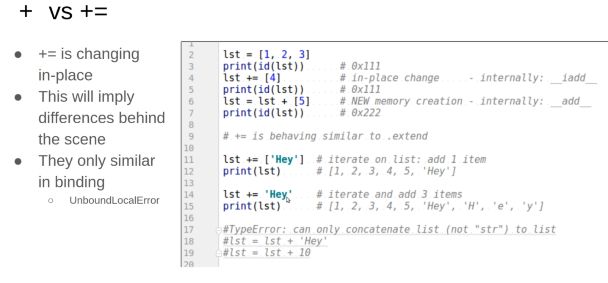
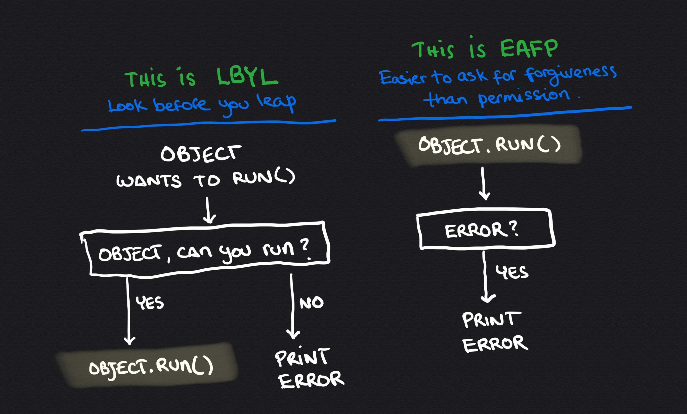

# INDEX

- [INDEX](#index)
  - [Python](#python)
    - [Running Python](#running-python)
    - [The Style Guide](#the-style-guide)
  - [Data Types](#data-types)
  - [Operators](#operators)
  - [Conditional Flow](#conditional-flow)
    - [Conditional Expressions](#conditional-expressions)
  - [Loops](#loops)
    - [while loop](#while-loop)
    - [for loop](#for-loop)
  - [Iterators and Generators](#iterators-and-generators)
    - [Iterator](#iterator)
    - [Iterable](#iterable)
    - [Generators](#generators)
  - [Functions](#functions)
    - [Built-in Functions](#built-in-functions)
    - [parameters](#parameters)
      - [parameters types](#parameters-types)
      - [arguments](#arguments)
    - [docstring](#docstring)
  - [Scope (Namespaces) and NameBinding](#scope-namespaces-and-namebinding)
    - [Scope Types (Namespaces)](#scope-types-namespaces)
    - [Scope Notes](#scope-notes)
    - [NameBinding](#namebinding)
  - [First-Class Objects](#first-class-objects)
  - [List](#list)
    - [List methods](#list-methods)
      - [Shallow and Deep Copying](#shallow-and-deep-copying)
        - [Shallow copy](#shallow-copy)
        - [Deep Copy Using "copy" module](#deep-copy-using-copy-module)
    - [Comparing Lists](#comparing-lists)
    - [List Unpacking](#list-unpacking)
    - [List Comprehension](#list-comprehension)
  - [Tuples](#tuples)
    - [Packing / Unpacking](#packing--unpacking)
    - [tuple zip function](#tuple-zip-function)
  - [Sets](#sets)
    - [Set methods](#set-methods)
    - [Set Operators](#set-operators)
  - [String](#string)
    - [Multi-line strings (Triple Quotes)](#multi-line-strings-triple-quotes)
    - [String methods](#string-methods)
    - [String Formatting](#string-formatting)
      - [f-strings](#f-strings)
    - [String formatting (new way)](#string-formatting-new-way)
  - [List of lists (2D Array) Matrix](#list-of-lists-2d-array-matrix)
    - [Position Neighbors](#position-neighbors)
  - [Dictionary](#dictionary)
    - [Iterating over Dictionaries](#iterating-over-dictionaries)
    - [Dictionary methods](#dictionary-methods)
  - [Errors / Exceptions](#errors--exceptions)
    - [Raising exceptions](#raising-exceptions)
    - [Catching Exceptions](#catching-exceptions)
      - [try / except](#try--except)
    - [Exception Handling](#exception-handling)
  - [Modules](#modules)
    - [Importing Modules](#importing-modules)
      - [loading the module](#loading-the-module)
    - [Modules Types](#modules-types)
      - [Built-in Modules -\> Python standard library](#built-in-modules---python-standard-library)
      - [custom Modules](#custom-modules)
      - [3rd party Modules (`pip`)](#3rd-party-modules-pip)
  - [Notes](#notes)

---

## Python

Python is an **interpreted language**. Commands are executed through a piece of software known as the Python interpreter

> - Python is an **object-oriented language** and `classes` form the basis for all data types
> - Python is a **dynamically typed language**, as there is no advance declaration associating an identifier with a particular data type

### Running Python


### The Style Guide

One of the oldest PEPs is **PEP 8**, which instructs Python programmers on how to style their code. The Python style guide was written with the understanding that code is read more often than it is written

> The PEP 8 guidelines are not set in stone, and some teams prefer a different values. Don’t worry too much about them in your code as you’re working alone, but be aware that people who are working collaboratively almost always follow the PEP 8 guidelines

- Indentation (Whitespace)
  - PEP 8 recommends that you use four spaces per indentation level. Using four spaces improves readability while leaving room for multiple levels of indentation on each line.
- Line Length
  - each line should be less than 80 characters (**79 Character limit**)
  - PEP 8 also recommends that you limit all of your comments to 72 characters per line, because some of the tools that generate automatic documentation for larger projects add formatting characters at the beginning of each commented line.

---

## Data Types

A **Type** is a classification of data that tells the computer possible values for that type and the operations that can be performed on it

> In Python, everything is an object, and every object has a type


---

## Operators


- if you have a constant-number: (variable whose value stays the same throughout the life of a program), then Python doesn’t have built-in constant types, but Python programmers use **all capital letters to indicate a variable should be treated as a constant** and never be changed:

  ```py
  MAX_CONNECTIONS = 5000
  ```

> - **`/`** this is called **"True Division"** returning a floating-point result

- **floor division**: also called integer-division (results in an integer by discarding the fraction part)

  - it **rounds down** to a small value ->

    ```py
    print(14 // 8) # 1`
    print(-14 // 8) # -2`
    print(-27 // 4) # -7`
    ```

  - floor dividing by 10s removes last digits

    ```py
    print(12345 // 10) # 1234`
    print(12345 // 1000) # 12`
    ```

- **modulus(remainder) operator** `%` returns the remainder

  - module dividing by 10s gets last digits

    ```py
    print(12345 % 10) # 5`
    print(12345 % 1000) # 345`
    print(-27 % 4) # -1 (not 6)
    ```

- **multiple assignments**

  ```py
  m = 3
  m, n = 10 * m, m + 1 # 30, 4 (uses old value of m)
  # try not to do it complicated like that to avoid errors
  ```

- **operators precedence**:

  ```py
  -2**2 # -4
  (-2)**2 # 4
  ```

- **Relational operators**:

  - boolean operation are converted to **integer**

  ```py
  5 * (2 < 4) # 5
  5 * (2 > 4) # 0

  x = 2
  x += 2 < 8 # 3
  ```

- **strings comparison**: Based on English Dictionary (Letter by letter comparison)

  ```py
  # If a word has a smaller letter: it appears first
  print('love' < 'zebra') # True  l is before z
  print('love' < 'long')  # False: lo are common, but v > n
  print('love' != 'long') # True

  # If one word is done in comparison: the smaller in length comes first
  print('counter' < 'counterattack')  # True

  # Upper letters are smaller than small letters
  print('A' < 'a')            # True
  print('A' < 'z')            # True
  print('Z' < 'a')            # True
  print('loVE' < 'love')      # True V < v
  print('loVE' < 'long')      # True V < n

  print('' < 'A')             # True empty is smaller

  print(' ' < 'A')            # True: space smaller than letters
  print(' ' < 'a')            # True: space smaller than letters

  print('0' < 'A')            # True: Digits smaller than letters
  print('0' < 'a')            # True: Digits smaller than letters
  ```

- **Float comparison** try to avoid it

  ```py
  a = 3 / 7 # 0.42857142857142855
  b = 0.1 + 3/7 - 0.1 # 0.4285714285714286

  print(a == b)   # False

  x = 5.0
  y = 4.9999999999999999999999999999999999999
  print(x == y)   # True: y is approximated to 5
  ```

- **Extended Assignment Operators**

  - For immutable types, we shouldn't assume that this syntax changes the value of the existing variable. Instead, it creates a new variable and assigns it to the existing variable name

    ```py
    x = 5
    x += 1 # x = x + 1
    ```

  - For mutable types, we can assume that the syntax changes the value of the existing variable

    ```py
    x = [1, 2, 3]
    x += [4, 5] # x = x + [4, 5]
    ```

- **Membership (Containment check) operators** -> `in`, `not in` operators

  - **Prefix**: any string starts from the first character (n prefixes)
    - `ex`: "ahmed omar" -> "ahme"
    - `ex`: URL with the common prefix `https://`
  - **Suffix**: any string ends from the last character (n Suffix)
    - `ex`: "ahmed omar" -> "d omar"
  - **Substring**: starts and ends wherever, but consecutive
    - `ex`: "ahmed omar" -> "med oma"
  - **Sub-sequence**: not consecutive, but must be in order (next letter must has bigger index)
    - `ex`: "ahmed omar" -> "amd"

- **identity operator** -> `is` / `is not`
  - returns True if two variables are the same object-reference **in memory**
  - don't use it with immutable objects
  - In most programming situations, the equivalence tests `==` and `!=` are the appropriate operators; use of `is` and `is not` should be reserved for situations in which it is necessary to detect true **"aliasing"**.

---

## Conditional Flow


### Conditional Expressions

Python supports a conditional expression syntax that can replace a simple control structure. The general syntax is an expression of the form:

```py
# expr1 if condition else expr2
param = n if n >= 0 else −n
```

---

## Loops

Python supports two types of loops: `while` and `for` loops.

- **while loop** : allows for repeated execution of a block of code as long as a condition is true.
- **for loop** : provides a more convenient way to iterate over a (sequence of values).

### while loop

```py
while (condition):
  # do something
```

---

### for loop


```py
for i in range(5):
  print(i, end=' ') # 0 1 2 3 4

# How range works:
def range(start, stop=None, step=1):
  if stop is None:
    stop = start
    start = 0
  # ...
```

- range can be one number(0->number) or range (number1 -> number2) or you can also specify the value of each step
  - last number in the range is not included
  - if you used a negative value as a step, this means you decrease and not increase (**iterating backwards**)
- **enumerate function** : returns an enumerated object

  ```py
  for i, value in enumerate(range(5, 8)):
  print(i, value)

  for i, value in enumerate('ali'):
  print(i, value)
  ```

- `for else` -> loop that can have an optional (else block), the else part is executed if the items in the sequence used in for loop exhausts
  - else block is not executed (ignored) if you **break** from the loop

> **Note**: we can use a `for` loop in cases for which a `while` loop does not apply, such as when iterating through a collection, such as a `set`, that does not support any direct form of indexing.

---

## Iterators and Generators

- In Python, the mechanism for iteration is based upon the following conventions: `iterator` & `iterable`
  

### Iterator

An **iterator** is an object that manages an iteration through a series of values. If variable, `i`, identifies an iterator object, then each call to the built-in function, `next(i)`, produces a subsequent element from the underlying series, with a StopIteration exception raised to indicate that there are no further elements.

- That iterator does not store its own copy of the list of elements. Instead, it maintains a current index into the original list, representing the next element to be reported.
  - Therefore, if the contents of the original list are modified after the iterator is constructed, but before the iteration is complete, the iterator will be reporting the updated contents of the list.

---

### Iterable

An **iterable** is an object, obj, that produces an iterator via the syntax `iter(obj)`.

- For example, calling `iter(data)` on a list instance (`data`) produces an instance of the list iterator class

  ```py
  data = [1, 2, 3]
  next(data) # ❌ TypeError: 'list' object is not an iterator
  i = iter(data) # ✅
  print(next(i)) # 1
  ```

- Python also supports functions and classes that produce an implicit iterable series of values, that is, without constructing a data structure to store all of its values at once.

  - For example, the call `range(1000000)` does not return a list of numbers; it returns a range object that is iterable. This object generates the million values one at a time, and only as needed.
  - Such a **"lazy evaluation" technique** has great advantage:
    - In the case of `range`, it allows a loop of the form, `for j in range(1000000)`, to execute without setting aside memory for storing one million values.
    - Also, if such a loop were to be interrupted in some fashion, no time will have been spent computing unused values of the `range`.

- > We see **"lazy evaluation"** used in many of Python’s libraries. For example, the dictionary class supports methods `keys()`, `values()`, and `items()`, which respectively produce a “view” of all keys, values, or `(key,value)` pairs within a dictionary. None of these methods produces an explicit list of results. Instead, the views that are produced are iterable objects based upon the actual contents of the dictionary.

- Using `range()` to Make a List of Numbers instead of iterables

  - If you want to make a list of numbers, you can convert the results of `range()` directly into a list using the `list()` function

    ```py
    numbers = list(range(1, 6))
    ```

- An explicit list of values from such an iteration can be immediately constructed by calling the list class constructor with the iteration as a parameter

  ```py
  num_list = list(range(1000)) # produces a list instance with values from 0 to 999
  ```

---

### Generators

- The most convenient technique for creating iterators in Python is through the use of generators
- A **generator** is implemented with a syntax that is very similar to a function, but instead of returning values, a yield statement is executed to indicate each element of the series.

```py
def factors(n): # traditional function that computes factors
  results = [ ] # store factors in a new list
  for k in range(1,n+1):
    if n % k == 0: # divides evenly, thus k is a factor
      results.append(k) # add k to the list of factors
  `return results # return the entire list

# ------------------------------------------------------

# implementation of a generator for computing those factors
def factors(n): # generator that computes factors
  for k in range(1,n+1):
    if n % k == 0: # divides evenly, thus k is a factor
      yield k # yield this factor as next result
```

- Notice use of the keyword `yield` rather than `return` to indicate a result. This indicates to Python that we are defining a generator, rather than a traditional function.
  - It is illegal to combine `yield` and `return` statements in the same implementation,
- How it works?
  - For each iteration of the loop, Python executes our procedure until a `yield` statement indicates the next value. At that point, the procedure is temporarily interrupted, only to be resumed when another value is requested.
  - When the flow of control naturally reaches the end of our procedure (or a `zero-argument` return statement), a **"StopIteration" exception** is automatically raised.

---

## Functions


- the keyword **`def`**, serves as the function’s **"signature"**
- Each time a function is called, Python creates a dedicated **activation record** that stores information relevant to the current call. This activation record includes what is known as a **"namespace"** ) to manage all identifiers that have `local scope` within the current call.
  - The namespace includes the function’s parameters and any other identifiers that are defined locally within the body of the function.
- If a `return` statement is executed without an explicit argument, the `None` value is automatically returned.
  - Likewise, `None` will be returned if the flow of control ever reaches the end of a function body without having executed a return statement.

### Built-in Functions

> In documentations, when you find a `function` or a `method`, have argument like this: `method([argument])`, this means that the argument is **optional**

- **Casting Types**

  

  ```py
  int(3.14) # Output: 3
  int(3.98) # Output: 3
  int(-3.98) # Output: -3
  int("3") # Output: 3
  int("3.14") # Output: ValueError: invalid literal for int() with base 10: '3.14'

  # ------------------------------------------------------

  float() # Output: 0.0
  float("3") # Output: 3.0
  float("3.14") # Output: 3.14
  ```

- **Get number for a Unicode character (Character Encoding)**

  - `ord()` function -> returns an integer representing the Unicode character.

    ```py
    # find unicode of P
    print(ord('P')) # Output: 80
    print(chr(80)) # Output: 'P'
    ```

  - this is useful to understand how python compares lowerCase letter and upperCase letters

    ```py
    print("aaa" > "AAA") # True
    ```

  

---

### parameters


#### parameters types

> Python provides means for functions to support more than one possible `calling signature`. Such a function is said to be **polymorphic** (which is Greek for “many forms”).

- Default Parameters

  - they must be the last argument when defining the function

- Parameter Naming types

  - **positional** arguments

    - It's the default mechanism for matching the actual parameters sent by a caller

    ```py
    def f(a,b,c):
      print(a,b,c)

    f(1,3,2)
    ```

  - **keyword** arguments (in-order or out-of-order)

    ```py
    def f(a,b,c):
      print(a,b,c)

    f(a=1,c=2,b=3)
    ```

  - You can't use positional-argument after a keyword-argument

---

#### arguments

- **`*args`** -> we can use the wildcard (`*`) notation to write functions that accept an Arbitrary number of arguments

  - it gathers all remaining arguments into a `tuple` with name "**args**"
  - it doesn't have to be called `*args`, you can use any name, e.g. `*jobs` / `*scores`

  ```py
  def average(*args):
    total = 0
    for arg in args:
      total += arg
    return total/len(args)
  ```

  - Mixing Positional and Arbitrary Arguments

    - If you want a function to accept several different kinds of arguments, the parameter that accepts an arbitrary number of arguments must be placed **last** in the function definition

      ```py
      def make_pizza(size, *toppings):
      ```

- **`**kwargs`\*\* -> we can use the wildcards notation to write functions that accept an Arbitrary number of keyword arguments (key-value pairs)
  - The double asterisks before the parameter cause Python to create a dictionary containing all the extra name-value pairs the function receives.

```py
def print_ages(**kwargs):
  for k,v in kwargs.items():
    print(f"{k} is {v} years old")

print_ages(max=67, sue=59, kim= 14)
# max is 67 years old
# sue is 59 years old
# kim is 14 years old
```

---

### docstring

Python provides integrated support for embedding formal documentation directly in source code using a mechanism known as a `docstring`. Formally, any string literal that appears as the first statement within the body of a `module`, `class`, or `function` (including a member function of a class) will be considered to be a docstring. By convention, those string literals should be delimited within triple quotes (`”””`)

```py
def scale(data, factor):
  ”””Multiply all entries of numeric data list by the given factor."""
  for j in range(len(data)):
    data[j] = factor
```

- More detailed `docstrings` should begin with a single line that summarizes the purpose, followed by a blank line, and then further details.

  - It serves as documentation and can be retrieved in a variety of ways. For example, the command help(x), within the Python interpreter, produces the documentation associated with the identified object x

  ```py
  def scale(data, factor):
    ”””Multiply all entries of numeric data list by the given factor.

    data  an instance of any mutable sequence type (such as a list) containing numeric elements

    factor  a number that serves as the multiplicative factor for scaling
    ”””
    for j in range(len(data)):
      data[j] = factor
  ```

---

## Scope (Namespaces) and NameBinding


> in every scope, a `NameError` will be raised if no such definitions are found. The process of determining the value associated with an identifier is known as **"name resolution"**.

---

### Scope Types (Namespaces)


- In python, there're 4 types of namespaces:

  1. built-in -> like (len, int, max, sum, TypeError)
     
  2. global
     
  3. enclosing
     
  4. local
     - this local-scope limitations only apply in **functional-scope** and not in a **Block-scope**
       - we can access local-scope variables from block-scope inside of global-scope
         

- order of using a variable in a function: (**python search order**):
  `local` -> `enclosing` -> `global` -> `build-in`
  

### Scope Notes

- in **functional-scope** you can't access **global** variables

  - to access global variable inside a function --> use **"`global`"** word

    ```py
    b = 20

    def f():
      global b
      b = 5 # now you can access & change global variables

    f()
    print(b) # 5
    ```

  - in block-scope (`if` / `loop`) you can access global variables

- A **namespace** is an abstraction that manages all of the identifiers that are defined in a particular scope, mapping each name to its associated value. In Python, functions, classes, and modules are all first-class objects, and so the “value” associated with an identifier in a namespace may in fact be a function, class, or module.

---

### NameBinding


---

## First-Class Objects

> In the terminology of programming languages, **first-class objects** are instances of a type that can be assigned to an identifier, passed as a parameter, or returned by a function

It's a **"data-type"** that can be: `assigned` / `passed` / `returned`

- In Python, `functions` and `classes` are also treated as first-class objects. For example, we could write the following:

  ```py
  scream = print # assign name ’scream’ to the function denoted as ’print’
  scream( Hello ) # call that function
  ```

  - an assignment such as `scream = print`, introduces the identifier, `scream`, into the current namespace, with its value being the object that represents the built-in function, `print`
  - this demonstrates the mechanism that is used by Python to allow one function to be passed as a parameter to another

---

## List

It's an **"ordered"** collection of data

- It's a **referential structure**, as it technically stores a sequence of references to its elements
- can hold different data types
- we can use `in` operator to iterate

  ```py
  print(2 in my_list) # True / False

  for item in my_list:
    # code
  ```

- you can concatenate lists using `+` operator
  
- you can duplicate lists using `*` operator
- to create a list from a tuple -> `List()`

---

### List methods

- add items to list

  ```py
  my_list = [1, 5, 10, 17, 2]
  # append: add one item to the end
  my_list.append('Hii') # 1 5 10 17 2 Hii

  # ------------------------------------------------- #
  # Extend the list by appending all the items from the iterable
  another_lst = [3, 1]
  # accepts an iterable (another_lst) and appends each item from that iterable to the end of the list
  my_list.extend(another_lst) # 1 5 10 17 2 Hii 3 1

  #TypeError: 'int' object is not iterable
  #my_list.extend(2)

  # ------------------------------------------------- #
  # Insert an item at a given position
  # insert( index before which to insert the element, element to be inserted)
  my_list.insert(2, 'Wow')
  # 1 5 Wow 10 17 2 Hii 3 1
  ```

- removing items from list

  ```py
  my_list = [1, 5, 10, 17, 2, 'Hii']

  # pop removes the item at a specific index and returns it.
  # it's useful if you want to use the value of an item after removing it from a list
  print(my_list.pop())    # Hii  - default last item
  # Now list is : 1 5 10 17 2

  # .pop(index) -> removes the item at that index and returns it
  print(my_list.pop(3))    # 17
  # Now list is : 1 5 10 2

  # del removes the item at a specific index:
  del my_list[0]  # 5 10 2

  # "remove()" lets us remove by value and not index -> removes ONLY the first matching value, not a specific index:
  # If there’s a possibility the value appears more than once in the list, you’ll need to use a loop to make sure all occurrences of the value are removed
  my_list.remove(10)  # 5 2

  # ValueError: list.remove(x): x not in list
  #my_list.remove('Hei')

  # removes all items from the list
  my_list.clear()
  ```

  - to delete selectively from a list, don't iterate forwards as there will be conflict in indexes if you delete element, instead iterate backwards

- searching for item in list

  ```py
  my_list = [1, 15, 7, 'mostafa', 7, True, 0]

  # search and return the FIRST index
  print(my_list.index(7))     # 2
  print(my_list.index(True))  # (any index of the first value that isn't false) -> 0
  print(my_list.index(False)) # 6

  #ValueError: 'Wow' is not in list
  #print(my_list.index('Wow'))

  my_list.clear()
  print(len(my_list))  # 0
  ```

- Sorting

  - `sort` method -> **Permanently & in-place**

    ```py
    my_list = [5, 7, 2]

    # no new list -> in-place (memory-efficient)
    my_list.sort()  # [2, 5, 7]

    # common mistake:
    my_list = my_list,sort() # NONE
    ```

  - `sorted` function -> **Temporarily**

    - returns a sorted list of a specified **iterable** object

    ```py
    my_list = [5, 7, 2]

    new_list = sorted(my_list)  # [2, 5, 7]
    # my_list doesn't change

     new_string = sorted('zacb')  # ['a', 'b', 'c', 'z']
    # my_list doesn't change

    # common mistake:
    my_list = my_list,sort() # NONE
    ```

  - same for `reverse()` method and `reversed()` function
    - which reverses a list **in-place (reverse the main list and not returning a new list)**
    - > **Notice** that `reverse()` doesn’t sort backward alphabetically; it simply reverses the order of the list

- `all` & `any` functions
  - return `true/false` if all/some elements of the iterable are `true/false`

#### Shallow and Deep Copying

##### Shallow copy

- We want to subsequently be able to add additional colors to palette, or to modify or remove some of the existing colors, without affecting the contents of `warmtones`. If we were to execute the command

  ```py
  palette = warmtones
  ```

  - this creates an alias, as shown in the Figure. No new list is created; instead, the new identifier palette references the original list.
    
  - if we subsequently add or remove colors from `palette`, we modify the list identified as `warmtones`.

- We can instead create a new instance of the list class by using the syntax:

  ```py
  palette = list(warmtones)
  ```

  - This causes a new list to be created, as shown in the Figure; however, it is what is known as a **"shallow copy"**
    

##### Deep Copy Using "copy" module

- Copying lists
  - `.copy()` -> returns a **shallow copy** of a list that is different from the original
    - nested objects are not copied and they will use the referenced objects from the first list
      
  - using slicing -> `new_list = list[:]`
  - using `copy` module for **deep-copy**
    
- count
  - the `.count()` method returns the number of times a value occurs in a list
  - if the value is not in the list, it returns **"0"**

---

### Comparing Lists


---

### List Unpacking

It's like **destructuring**


---

### List Comprehension

List comprehension offers a shorter syntax when you want to create a new list based on the values of an existing list.

```py
[expression for value in iterable if condition]

# equal to:
result = [ ]
for value in iterable:
  if condition:
    result.append(expression)
```


```py
lst1 = [2, 3, 4, 1]

# Old syntax
lst2 = []
for i in lst1:
    lst2.append(i *i + 1)

print(lst2)     # [5, 10, 17, 2]

# new syntax
lst2 = [i*i+1   for i in lst1]
print(lst2)     # [5, 10, 17, 2]
```

> Python supports similar comprehension syntaxes that respectively produce a `set`, `generator`, or `dictionary`
>
> ```py
> [ k k for k in range(1, n+1) ] list comprehension
> { k k for k in range(1, n+1) } set comprehension
> ( k k for k in range(1, n+1) ) generator comprehension
> { k:k k for k in range(1, n+1) } dictionary comprehension
> ```

---

## Tuples

> Lists work well for storing collections of items that can change throughout the life of a program. However, sometimes you’ll want to create a list of items that **cannot change**. Tuples allow you to do just that. Python refers to values that cannot change as immutable, and an immutable list is called a tuple.

They're **immutable**, **ordered**, **indexed** collections/sequences

- If you want to define a tuple with one element, you need to include a trailing comma at the end
  

  ```py
  t = (10) # wrong
  t = (10,) # right

  # notice the different (string vs tuple)
  print(('Hi') * 4)    # HiHiHiHi
  print(('Hi',) * 4)   # ('Hi', 'Hi', 'Hi', 'Hi')
  ```

- you can't mutate the items in the tuple unlike lists

---

### Packing / Unpacking

- **automatic packing** of a tuple of a tuple:

  - If a series of comma-separated expressions are given in a larger context, they will be treated as a single tuple, even if no enclosing parentheses are provided.
  - One common use of packing in Python is when returning multiple values from a function

    ```py
    return x, y # returning a single object that is the tuple (x, y)
    ```

- **automatic unpacking**:

  - allowing one to assign a series of individual identifiers to the elements of sequence. - side expression can be any iterable type, as long as the number of variables on the left-hand side is the same as the number of elements in the iteration

  ```py
  a, b, c, d = range(7, 11) # a=7, b=8, c=9, and d=10

  # This technique can be used to unpack tuples returned by a function
  quotient, remainder = divmod(a, b)

  # This syntax can also be used in the context of a for loop
  for x, y in [ (7, 2), (5, 8), (6, 4) ]:
  ```

- **Simultaneous Assignments**

  - The combination of `automatic packing` and `unpacking` forms a technique known as `simultaneous assignment`, whereby we explicitly assign a series of values to a series of identifiers, using a syntax:

  ```py
  x, y, z = 6, 2, 5
  ```

  - It provides a convenient means for **swapping** the values associated with two variables:

    ```py
    j, k = k, j
    ```

    - With this command, `j` will be assigned to the old value of `k`, and `k` will be assigned to the old value of `j`. Without `simultaneous assignment`, a swap typically requires more delicate use of a `temporary variable`

- **unpacking**: to make a variable equal the rest of element from the beginning or the end or the middle, this is done using the **astrict `*` operator**

  ```py
  a, b, *c = 1, 2, 3, 4, 5
  print(c) # [3, 4, 5]
  ```

---

### tuple zip function

- **Zip** function : when you have multiple **sequences** and want to iterate such that in each iteration you have a single item

  ```py
  numbers = [1, 2, 3]
  letters = ['a', 'b', 'c']

  # zip class constructor: def __init__(self, *iterables)
  zipped = zip(numbers, letters)
  print(list(zipped))
  # [(1, 'a'), (2, 'b'), (3, 'c')]
  ```

---

## Sets

They're **unordered** collections with **no duplicate** elements

- Why use sets ?

  - sets make it easy/fast to check if a value exists in a collection
    - as in `lists` there's a `hashing` and other operations that may slow operation compare to `sets`
  - sets are an easy way to remove duplicates from a collection

- can **contain only immutable elements** (no `lists`/`dictionaries`/`sets` which are **mutable-types**) --> so that it contains only unique elements
- to create an empty set, you must write it like this:

  ```py
  empty_set = {} # wrong -> will be declared as a dictionary not a set
  empty_set = set() # correct
  ```

### Set methods

```py
set('hello') # {'e', 'h', 'l', 'o'}

# add item
even = {2, 4, 6}
even.add(8)

# Remove item
even.remove(6)
even.remove(3) # error
even.discard(3) # no error
```

---

### Set Operators


- Subset and Superset

  ```py
  s1 <= s2 # s1 is a subset of s2
  s1 < s2 # s1 is a proper subset of s2
  s1 >= s2 # s1 is a superset of s2
  s1 > s2 # s1 is a proper superset of s2
  ```

---

## String

### Multi-line strings (Triple Quotes)

you can use single or double quotes

```py
"""
dsfs
'dsfdsf'
sf
"fff"
"""
# or
'''
dsfdsf
sdfdf
'''
```

---

### String methods


- `.find()`: if doesn't find the text it returns **`-1`**

  - `.rfind()`: same as `find()` but returns `ValueError` if not found

- Slice:
  
  

- `removePrefix()` :
  - **Prefix**: any string starts from the first character (n prefixes)
    - `ex`: "ahmed omar" -> "ahme"
    - `ex`: URL with the common prefix `https://`
      - When you see a URL in an address bar and the `https://` part isn’t shown, the browser is probably using a method like `removeprefix()` behind the scenes.

---

### String Formatting

```py
name, age = 'mostafa', 33
print(name, 'is', age, 'years old')             # 1 old way
print(name + ' is ' + str(age) + ' years old')  # 2 old way

# The first {} is replaced with mostafa
# the 2nd is replaced with 33
print('{} is {} years old'.format(name, age))   # mostafa is 33 years old
```

#### f-strings

The `f` is for format, because Python formats the string by replacing the name of any variable in braces with its value. The output from the previous code is:

```py
# new way:
name, age = 'mostafa', 33
print(f'{name} is {age} years old')     # mostafa is 33 years old

# old way:
# we call this string with curly braces {} as template
#IndexError: tuple index out of range   - u need to provide 3 arguments
#print('{}{}{}'.format('Hey'))

print('{}{}{}'.format(1, 2, 3, 4, 5, 6))    # 123 - OK to provide more. Ignored
```

- Formatting with replacements fields

  ```py
  name, age = 'mostafa', 33

  print('{0} is {1} years old'.format(name, age))     # mostafa is 33 years old

  #print('{0} is {2} years old'.format(name, age))     # IndexError - no idx 2

  print('{0} is {1} years old. Are you {1} years as {0}'.format(name, age))
  # mostafa is 33 years old. Are you 33 years as mostafa
  # pros: you provie positional argument once and use it many

  print('{name} is {AGE} years old. Are you {AGE} years as {name}'.format(name=name, AGE=age))
  # mostafa is 33 years old. Are you 33 years as mostafa
  # similarly, we can use keyword arguments but flxible order!

  # Be careful from mixing
  print('{} is {age} years old'.format(name, age=age))    # mostafa is 33 years old
  print('{0} is {age} years old'.format(name, age=age))   # mostafa is 33 years old

  #print('{1} is {age} years old'.format(age=age, name))
  # SyntaxError: positional argument follows keyword argument
  #print('{1} is {age} years old'.format(name, age=age))   # IndexError
  ```

- Formatting with specified **width** of text place

  - **right aligning**

    ```py
    for i in range(0, 20, 2):
        print('Given i={:2}: i^4 = {:7} i^3 = {:4}'.format(i, i* i * i * i, i * i * i))

    """
    {1:7}: Format position 1 in field of 7 spaces

    Given i= 0: i^4 =       0 i^3 =    0
    Given i= 2: i^4 =      16 i^3 =    8
    Given i= 4: i^4 =     256 i^3 =   64
    Given i= 6: i^4 =    1296 i^3 =  216
    Given i= 8: i^4 =    4096 i^3 =  512
    Given i=10: i^4 =   10000 i^3 = 1000
    Given i=12: i^4 =   20736 i^3 = 1728
    Given i=14: i^4 =   38416 i^3 = 2744
    Given i=16: i^4 =   65536 i^3 = 4096
    Given i=18: i^4 =  104976 i^3 = 5832
    """
    ```

  - **left aligning**

    ```py
    for i in range(0, 20, 2):
      print('Given i={:<2}: i^4 = {:<7} i^3 = {:<4}'.format(i, i* i * i * i, i * i * i))

    """
    Using :<7 makes it left-aligned

    Given i=0 : i^4 = 0       i^3 = 0
    Given i=2 : i^4 = 16      i^3 = 8
    Given i=4 : i^4 = 256     i^3 = 64
    Given i=6 : i^4 = 1296    i^3 = 216
    Given i=8 : i^4 = 4096    i^3 = 512
    Given i=10: i^4 = 10000   i^3 = 1000
    Given i=12: i^4 = 20736   i^3 = 1728
    Given i=14: i^4 = 38416   i^3 = 2744
    Given i=16: i^4 = 65536   i^3 = 4096
    Given i=18: i^4 = 104976  i^3 = 5832
    """
    ```

  - **formatting precision** -> `{value:width.precision}`

    ```py
    val = 71.01234567890123456789012345678901234567890123456789

    print(val)                      #71.01234567890124 ==> 14 decisimal precision printed
    print('{:20}'.format(val))      #   71.01234567890124 ==> total 20 output units, right-aligned
    print('{:11f}'.format(val))     #  71.012346 ==>  print 11 units. Use default precision (typically 6)
    print('{:11.3f}'.format(val))   #     71.012 ==> 11 output units, 3 of them precision
    print('{:3.5f}'.format(val))    #71.01235 ==> 5 precision. It will have more priority
    print('{:.8f}'.format(val))     #71.01234568 ==> 8 precision. No specific alignments
    #print('{.8f}'.format(val))     #AttributeError

    val = 2.67
    print(val)                     #2.67
    print('{:11f}'.format(val))    #   2.670000 ==>  trailing zeros  : 11 output units (6 is precision)
    print('{:11.2f}'.format(val))  #       2.67   (.2f use 2 precision)
    print('{:11.1f}'.format(val))  #        2.7   rounding
    print('{:11.0f}'.format(val))  #          3   rounding

    print('{:11.0f}'.format(2.5))  #          2   rounding to 2
    print('{:11.0f}'.format(-2.5))  #        -2   rounding to -2
    ```

---

### String formatting (new way)

This is called **F-string**


```py
name, age = 'mostafa', 33
# mostafa is 33 years old
print(f'{name} is {age} years old')

val = 71.0123456789012345678901234
#     71.012
print(f'{val:11.3f}')
```

---

## List of lists (2D Array) Matrix


- be aware of **shallow-copying**

### Position Neighbors


```py
def get_neibghours(i, j):
    # {down, right, up, left};
    di = [1, 0, -1, 0]
    dj = [0, 1, 0, -1]
    return [(i+di[d], j+dj[d]) for d in range(4)]

print(get_neibghours(0, 0))
# [(1, 0), (0, 1), (-1, 0), (0, -1)]

print(get_neibghours(3, 6))
# [(4, 6), (3, 7), (2, 6), (3, 5)]
```

---

## Dictionary

It's a **key-value pairs**, unlike `lists` which are **index-value pairs**

- **Dictionaries**, like **sets**, do not maintain a well-defined order on their elements. Furthermore, the concept of a subset is not typically meaningful for dictionaries, so the dict class does not support operators such as `<`. Dictionaries support the notion of equivalence, with d1 == d2 if the two dictionaries contain the same set of keyvalue pairs.

### Iterating over Dictionaries

They return something that iterable (NOT a list)


> To convert them to lists, use the built-in method: **`list()`**

---

### Dictionary methods

- Getting values from **`.get()`**

  - when you want to check if a key exists in the dictionary, we use `in` first then get the value
  - instead, you can use the `.get()` method, which will look for a given key in a dictionary. if the key exists, it will return the corresponding value. otherwise it **returns `None`**
    - unlike using the bracket-syntax which raises a **KeyError**
  - The `get()` method requires a key as a first argument. As a second optional argument, you can pass the value to be returned if the key doesn’t exist:

    ```py
    alien_0 = {'color': 'green', 'speed': 'slow'}
    alien_0.get('points', 'No point value assigned.')
    ```

    - > **Note**: this is a good trick to use when looping on a dictionary keys count each key value

    ```py
    word = "ssdfdfsdsf"
    count = {}
    for char in word):
      count[char] = 1 + count.get(char,0)
      # this is instead of this:
      # if not count[char]: count[char] = 0
      # count[char] += 1
    ```

- Join (concatenate) 2 dictionaries
  - using`.update()` method
    
  - using `**` syntax (like spread operator`...`)
    
  - using the new pipe `|` syntax (union operator)
    

---

## Errors / Exceptions

**Exceptions** are unexpected events that occur during the execution of a program. An exception might result from a logical error or an unanticipated situation. In Python, exceptions (also known as **errors**) are objects that are **raised** (or **thrown**) by code that encounters an unexpected circumstance.

- When an error occurs in your program, the Python interpreter does its best to help you figure out where the problem is. The interpreter provides a **traceback** when a program cannot run successfully.
  - > A **traceback** is a record of where the interpreter ran into trouble when trying to execute your code.
- Python includes a rich hierarchy of exception classes that designate various categories of errors
  

| Class               | Description                                                    |
| ------------------- | -------------------------------------------------------------- |
| `Exception`         | A base class for most error types                              |
| `AttributeError`    | Raised by syntax `obj.foo`, if `obj` has no member named `foo` |
| `EOFError`          | Raised if “end of file” reached for console or file input      |
| `IOError`           | Raised upon failure of I/O operation (e.g., opening file)      |
| `IndexError`        | Raised if index to sequence is out of bounds                   |
| `KeyError`          | Raised if nonexistent key requested for set or dictionary      |
| `KeyboardInterrupt` | Raised if user types `ctrl-C` while program is executing       |
| `NameError`         | Raised if nonexistent identifier used                          |
| `StopIteration`     | Raised by `next(iterator)` if no element                       |
| `TypeError`         | Raised when wrong type of parameter is sent to a function      |
| `ValueError`        | Raised when parameter has invalid value (e.g., `sqrt(−5)`)     |
| `ZeroDivisionError` | Raised when any division operator used with `0` as divisor     |

### Raising exceptions

- You can raise your own exceptions(force them to happen) whenever you want, using the `raise` keyword

  ```py
  raise ValueError
  ```

- You can provide a specific message when raising an exception

  ```py
  raise ValueError("invalid character")
  ```

```py
def sqrt(x):
    if not isinstance(x, (int, float)):
        raise TypeError("x must be numeric")
    if x < 0:
        raise ValueError("x can't be negative")
    # ... compute the square root of x ...
```

---

### Catching Exceptions

There are several philosophies regarding how to cope with possible exceptional cases when writing code

- One philosophy for managing exceptional cases is to **“look before you leap (LBYL)”**

  - The goal is to entirely avoid the possibility of an exception being raised (avoid leaping into the logic) through the use of a proactive conditional test.
    

    ```py
    if y != 0:
      ratio = x / y
    else:
      #... do something else ...

    # ------------------------------------------------
    # or (input validation)
    inpdata = input("Enter a number > ")
    if not isinstance(inpdata,int):
        print("input value must be integer")
    ```

- A second philosophy, often embraced by Python programmers (the "pythonic" way), is that **“it is easier to ask for forgiveness than it is to get permission (EAFP)”**

  - This philosophy is implemented using a `try-except` control structure

    ```py
    try:
      ratio = x / y
    except ZeroDivisionError:
      # ... do something else ...
    ```

  - The relative advantage of using a `try-except` structure is that the non-exceptional case runs efficiently, without extraneous checks for the exceptional condition.
  - the `try-except` clause is best used when there is reason to believe that the exceptional case is relatively unlikely, or when it is prohibitively expensive to proactively evaluate a condition to avoid the exception.

#### try / except


It's best used when there is reason to believe that the exceptional case is relatively unlikely, or when it is prohibitively expensive to proactively evaluate a condition to avoid the exception.

> It is significantly easier to attempt the command and catch the resulting error than it is to accurately predict whether the command will succeed.

- usually it's better to except a specific exception and handle it, rather than handling any possible exception that could occur

  ```py
  try:
    num = int(input("Enter a number: "))
  except ValueError:
    print("Oh no, that ins't a number!")
  ```

- you can specify the error in the handling:

  ```py
  try:
    fp = open( sample.txt )
  except IOError as e:
    print( Unable to open the file: , e) # here we pass the error ("e")
  ```

- You can also do multiple exceptions for multiple errors

  ```py
  age = int(input( Enter your age in years: ))

  while age <= 0:
    try:
      age = int(input( Enter your age in years: ))
      if age <= 0:
        print( Your age must be positive )
    except (ValueError, EOFError): # multiple errors
      print( Invalid response )
  ```

- a **`finally`** clause, with a body of code that will always be executed in the standard or exceptional cases, even when an uncaught or re-raised exception occurs.
  - That block is typically used for critical cleanup work, such as closing an open file.

---

### Exception Handling

- Exception handling is particularly useful when working with `user input`, or when `reading from or writing to files`, because such interactions are inherently less predictable.
- The keyword, **`pass`**, is a statement that does nothing, yet it can serve syntactically as a body of a control structure. In this way, we quietly catch the exception, thereby allowing the surrounding while loop to continue.

  ```py
  except (ValueError, EOFError):
    pass
  ```

---

## Modules


Beyond the built-in definitions, the standard Python distribution includes perhaps tens of thousands of other values, functions, and classes that are organized in additional libraries, known as **modules**, that can be `imported` from within a program.

> **"module"** is a collection of closely related functions and classes that are defined together in a single file of source code.

### Importing Modules

- Python’s import statement loads definitions from a module into the **current namespace**. One form of an `import` statement uses a syntax such as the following:

  ```py
  from math import pi, sqrt # adds both "pi" and "sqrt", as defined in the math module, into the current namespace
  ```

- If there are many definitions from the same module to be imported, an `asterisk (*)` may be used as a wild card, as in:

  ```py
  from math import *
  ```

  > but this form should be used sparingly. The **danger** is that some of the names defined in the module may conflict with names already in the current namespace (or being imported from another module), and the import causes the new definitions to replace existing ones.

- Another approach that can be used to access many definitions from the same module is to import the module itself, using a syntax such as:

  ```py
  import math # adds the identifier, math, to the current namespace, with the module as its value
  ```

  - Modules are also **first-class objects** in Python. Once imported, individual definitions from the module can be accessed using a fully-qualified name, such as `math.pi` or `math.sqrt(2)`.

#### loading the module

- It is worth noting that top-level commands with the module source code are executed when the module is first imported, almost as if the module were its own script.
- There is a special construct for embedding commands within the module that will be executed if the module is directly invoked as a script, but not when the module is imported from another script. Such commands should be placed in a body of a conditional statement of the following form:

  ```py
  # in the module file, ex: utility.py
  if __name__ == __main__ :
    # module
  ```

  - commands will be executed if the interpreter is started with a command python utility.py, but not when the utility module is imported into another context.
  - This approach is often used to embed `unit tests` within the module

---

### Modules Types

#### Built-in Modules -> Python standard library


- python comes with tons of build-in modules that we can use, if we **import** them

  - each module consists of methods and functionality bundled together

  - Ex: Methods supported by instances of the **Random class**:
    

    ```py
    # use import statement to import modules
    import random
    r = random.randint(1,10)

    # use from-import statements to import functions
    from random import randint
    r = randint(1,10)

    # use from module import * statement to import all functions
    from random import *
    r = randint(1,10)
    3
    ```

#### custom Modules

- It's for creating your custom modules files

  ```py
  # utils.py
  def add(a, b):
    """This program adds two
    numbers and return the result"""

    result = a + b
    return result
  ```

#### 3rd party Modules (`pip`)

- **pip**: is the python package installer that we can use to install hundreds of thousands of packages for use in our projects
- to install a package, use:

  ```sh
  python3 -m pip install <package_na  me>
  ```

---

## Notes

- for variables names, the "Pythonic" way is to use **"snake_case"**, unlike in `Javascript` where we usually use **"camelCase"**:

  ```py
  first_name = 'Ahmed'
  ```

- when you have 2 variables point to the same memory location, the second variable is called an **"alias"**

  ```py
  temperature = 23
  original = temperature
  # original is called -> "alias"
  ```

- `print()` can have other optional parameters like:

  - `end='end'` Optional. Specify what to print at the end. Default is `'\n'` (line feed)

    ```py
    # make separator "," instead of new line "\n"
    print(x, end=',')
    ```

  - `sep='separator'` Optional. Specify how to separate the objects, if there is more than one. Default is ' ' (space).

    ```py
    # make separator "," instead of space " "
    print(x, y, z, sep=',')
    ```

- `del` -> removes the bind from name of variable to the value in memory, so the variable will equal `undefine` (**unboundLocalError**)

  ```py
  del alien_0['points']
  ```

- **object memory location** -> to get identifier (location in memory) -> use built-in method `id()`

  - `id()` method is used to return a unique id for the specified object -> **object memory address**
    
  - when we have different variables pointing to the same address --> **Alias**
  - every thing in python is an object (mutable (reference) / immutable (primitive))
  - Immutable objects
    
  - Python interpreter already maintains what are known as **"reference counts"** for each object; this count is used in part to determine if an object can be garbage collected.

```

```
