## INDEX

- [INDEX](#index)
- [installation](#installation)
- [React fundementals](#react-fundementals)
  - [Declarative vs imperative](#declarative-vs-imperative)
  - [multi-page application](#multi-page-application)
  - [single-page application (SPA)](#single-page-application-spa)
- [JSX](#jsx)
  - [Dynamic expressions in JSX](#dynamic-expressions-in-jsx)
- [Virtual DOM vs Real DOM](#virtual-dom-vs-real-dom)
  - [How does it work?](#how-does-it-work)
- [Router](#router)
  - [Set Up](#set-up)
  - [Using it](#using-it)
  - [Dynamic Routes](#dynamic-routes)
  - [Programmatically navigation](#programmatically-navigation)
    - [changing the page's url](#changing-the-pages-url)
    - [Accessing the page's url](#accessing-the-pages-url)
  - [Prompt](#prompt)
- [Styling and CSS](#styling-and-css)
  - [Inline style](#inline-style)
  - [Styled-components](#styled-components)
    - [Other casess](#other-casess)
  - [CSS Modules](#css-modules)
- [Components](#components)
  - [why components](#why-components)
  - [component tree](#component-tree)
  - [List Components](#list-components)
    - [update list-items](#update-list-items)
- [Custom Components (fragment)](#custom-components-fragment)
  - [fragment](#fragment)
  - [Portals](#portals)
  - [Refs](#refs)
  - [Smart vs Dumb components](#smart-vs-dumb-components)
  - [Controlled vs. uncontrolled components](#controlled-vs-uncontrolled-components)
    - [Controlled components](#controlled-components)
    - [Uncontrolled components](#uncontrolled-components)
- [Component Props](#component-props)
  - [single prop](#single-prop)
  - [Multiple props](#multiple-props)
- [Communicating Between Components](#communicating-between-components)
  - [From Parent to Child](#from-parent-to-child)
  - [From Child to Parent](#from-child-to-parent)
  - [lifting the state up](#lifting-the-state-up)
- [React Composition](#react-composition)
  - [Why Use React Composition?](#why-use-react-composition)
- [Handling Events](#handling-events)
  - [Events in HTML vs React](#events-in-html-vs-react)
  - [Data binding](#data-binding)
- [Forms](#forms)
  - [Form-Input](#form-input)
  - [Validation](#validation)
- [Environmental Variables](#environmental-variables)
- [Interview Questions](#interview-questions)

---

## installation

- `npx` is used to execute commands without installing dependencies (**install something and running it immediately**)

```bash
npx create-react-app my-app # equivalent to installing react globally first then >> creating react app

# to run it again
cd my-app
npm install
npm start
```

- one `HTML` file is delivered => `index.html`

- in `index.js` you render the app to `index.html`

  ```js
  // we tell ReactDOM to render something (<App>) in the place of ("root" id)
  ReactDOM.render(
    <React.StrictMode>
      <App />
    </React.StrictMode>,
    document.getElementById("root")
  );
  ```

---

## React fundementals

### Declarative vs imperative

- Functional Programming is a declarative programming paradigm, in contrast to imperative programming paradigms.

  - `Declarative programming` is a paradigm describing `WHAT` the program does, without explicitly specifying its control flow.
    - allows you to control flow and state in your application by saying `"It should look like this"`
  - `Imperative programming` is a paradigm describing `HOW` the program should do something by explicitly specifying each instruction (or statement) step by step, which mutate the program's state.
    - allows you to control your application by saying `"This is what you should do"`

- React's declarative approach
  - Define the desired target state(s) and let React figure out the actual JavaScript DOM instructions 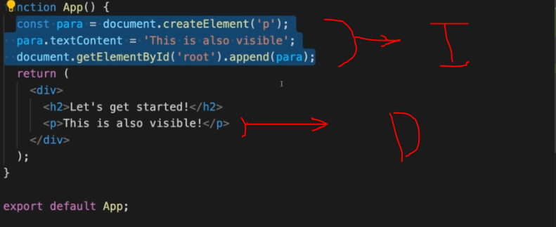

---

### multi-page application

- As the name suggests, a multi-page application (MPA) is an app that has more than one page. It works in a traditional way, requiring the app to reload entirely every time a user interacts with it.

### single-page application (SPA)


- `Single-page applications` can work in different ways. One way a single-page app loads is by downloading the entire site's contents all at once. This way, when you're navigating around on the site, everything is already available to the browser, and it doesn't need to refresh the page. Another way single-page apps work is by downloading everything that's needed to render the page the user requested. Then when the user navigates to a new page, asynchronous JavaScript requests are made for just the content that was requested.

  - Another key factor in a good single-page app is that the URL controls the page content. Single-page applications are highly interactive, and users want to be able to get back to a certain state using just the URL. --> [React Router](#router)

- The browser downloads the entire app data when you visit SPA web applications. Thus, you can browse through different parts of the app seamlessly and the page won’t reload every time you click on something.

- This is because a single page application executes the logic in the browser, instead of a server. It does so with JavaScript frameworks that can lift this heavy data on the client-side. JavaScript also enables an SPA to reload only those parts of the app that a user requests for, not the entire app. As a result, SPAs are known to deliver fast and efficient performance.

---

## JSX


- **JSX** = "HTML in JavaScript"
- it's a "Syntactic sugar", does not run in the
  browser like this!
- It's like functions as when react sees them it **invokes them**
- in older versions of react : to use `JSX` you had to write this in the file :

  ```js
  import React from "react";
  // we don't have to write it anymore
  ```

- what [Babel](https://babeljs.io/repl#?browsers=defaults%2C%20not%20ie%2011%2C%20not%20ie_mob%2011&build=&builtIns=false&corejs=3.21&spec=false&loose=false&code_lz=Q&debug=false&forceAllTransforms=false&shippedProposals=false&circleciRepo=&evaluate=false&fileSize=false&timeTravel=false&sourceType=module&lineWrap=true&presets=env%2Creact%2Cstage-2&prettier=false&targets=&version=7.17.9&externalPlugins=&assumptions=%7B%7D) do to jsx :

```js
// jsx that we write
<p title="Intro text">React.js is a library for building user interfaces.</p>;

// Babel converts it to this
React.createElement(
  "p",
  { title: "Intro text" },
  "React.js is a library for building user interfaces."
);
```
>
> - if you don't have attributes you can use `{}` or `null` instead
> - to have multiple child elements -> use an array

### Dynamic expressions in JSX

- to write javascript expressions in JSX => `{your_expression}`
- it must be **expressions** and not **declarations** or **blocks**
- **NOTE** : when you write a `array` in JSX, the JSX automatically `joins` the `array`, that's why you can't use `forEach`

  ```js
  const names - ["ahmed", "esraa", "mona"];
  return (
      <Fragnent>
          <p>
            {names}
          </p>
      </Fragent>
  )
  // results : ahmedesraamona
  ```

---

## Virtual DOM vs Real DOM

**Dom Manipulation** can be very slow and heavy. For example, if you have several image tags inside a div and you replace one of the images inside with a different image source, the DOM re-renders the entire div. What would happen if you frequently update and make a lot of transformations? To address this problem, the React developers came up with an idea to manipulate the VDOM instead which is faster since nothing gets drawn on your browser.

- `Virtual DOM (VDOM)`: is a concept where a virtual representation of a UI is kept in `memory` and synced with the real DOM by a library (such as ReactDOM).

  - You can simply think of it as a lightweight copy of the Real DOM.

- `ReactDOM`: React takes a look at what specific transformations need to be made to the initial DOM and updates them very quickly.
  - React re-renders only the parts that need to be updated compared to the initial DOM.

### How does it work?

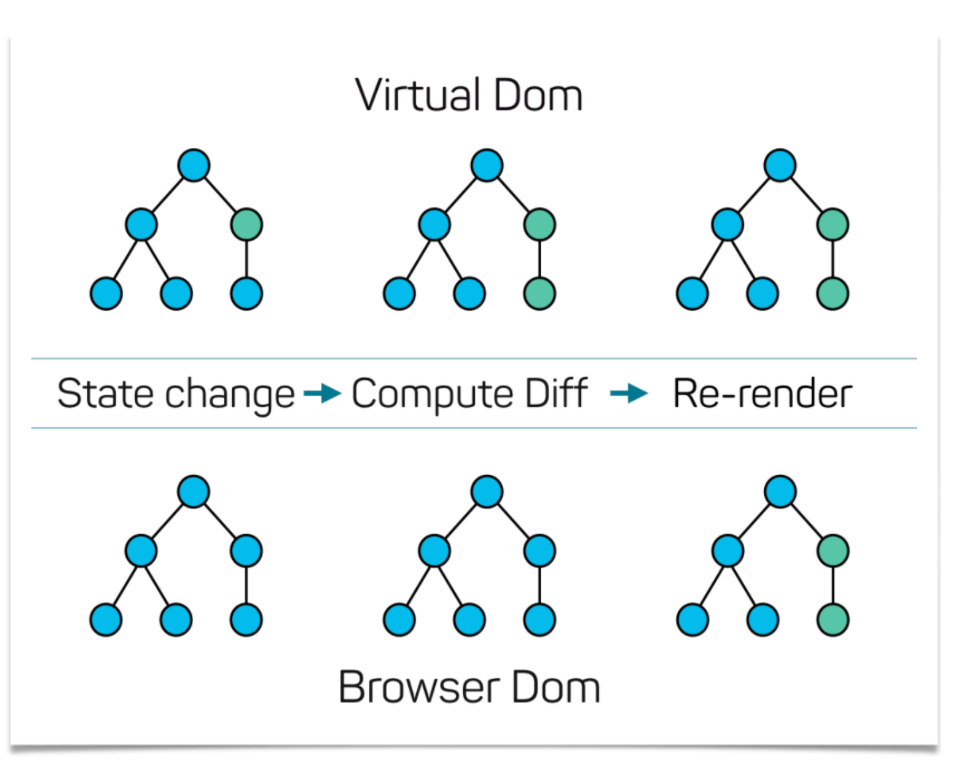

1. React generates a new Virtual DOM for our application.
2. React compares the initial Virtual DOM (representing the current html DOM) to the new Virtual DOM.
3. Based on the comparison above, React runs its **Diffing Algorithm** to calculate the minimum number of operations to update the initial Virtual DOM to the new Virtual DOM.

> **Re-Evaluating Components !== Re-Rendering the DOM** > 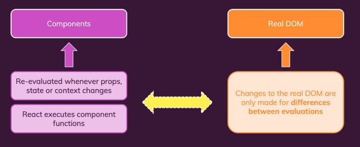

---

## Router

React Router turns React projects into single-page applications. It does this by providing a number of specialized components that manage the creation of links, manage the app's URL, provide transitions when navigating between different URL locations, and so much more.

### Set Up

- first install it

  ```bash
  npm install react-router-dom@6
  ```

- in `index.js` :

  ```js
  import { BrowserRouter } from "react-router-dom";

  // then wrap the app in a BrowserRouter fragment
  // You may also use different types of router like "hashRouter"

  root.render(
    <React.StrictMode>
      <BrowserRouter>
        <App />
      </BrowserRouter>
    </React.StrictMode>
  );
  ```

  > **StrictMode**: provides additional warnings when using legacy or soon to be deprecated code.

- now in `app.js`

  ```js
  import { Route, Routes } from "react-router-dom";

  function App() {
    return (
      // rapping the component in a routes and the route specify the endpoint
      <Routes>
        <Route path="/home" element={<Home />} />
        // means that when route matches "/home" -> render the Home component
      </Routes>
    );
  }
  ```

- or if you want nested Routes:

  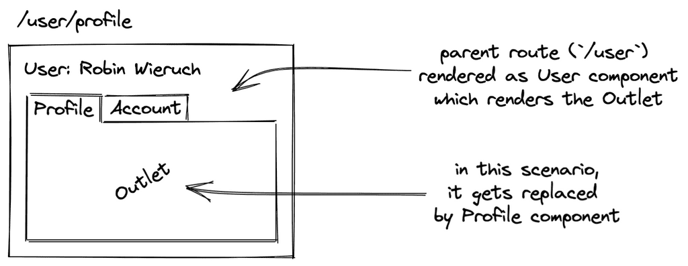

  ```js
  // in `app.js`
  function App() {
    return (
      // now we want to tell the parent compont (Home) where we want the react-router-dom to render the nested-matching-element (Shop) --> using "Outlet componet" from react-router-dom
      <Routes>
        <Route path="/home" element={<Home />}>
          <Route path="shop" element={<Shop />} />
        </Route>
      </Routes>
    );
  }
  ```

  ```js
  function Home() {
    // in `Home.jsx`
    return (
      <div>
        <Outlet />
        <h1>this is home page</h1>
      </div>
    );
  }
  ```

- `<switch>` **ONLY IN VERSION 5** -> `<Routes>` in version 6:
  - It Renders the first child `<Route>` or `<Redirect>` that matches the location.
  - makes sure that only one component from components with matching routes are displayed
  - it displays the first match it finds, so the order is important or you can use `exact`
  - to make a "not found page" make: `path="*"`

```js
import { Route, Switch } from "react-router";

<Switch>
  <Route exact path="/">
    <Home />
  </Route>
  <Route path="/about">
    <About />
  </Route>
</Switch>;
```

- `exact` matches the full-path **ONLY IN VERSION 5**

  - not needed in v6

- `<Redirect>` **ONLY IN VERSION 5**: navigate to a new location. The new location will override the current location
  - for **V6**: we use `<Navigate>`

```js
<Redirect to="/somewhere/else" />

<Navigate to="/somewhere/else" />

// Or
<Redirect
  to={{
    pathname: "/login",
    search: "?utm=your+face",
    state: { referrer: currentLocation }
  }}
/>

```

---

### Using it

- when you want to change the page's URL, we don't use `<a>` as it will make the page **reload**(make a new request)
- Instead we use `<Link>` from `react-router-dom`
- **Note**: `<Link>` can be represented as `<a>` in **css**

```js
import { Link } from "react-router-dom";

<Link to="/about">About Us</Link>;
```

- To use link with **highlighting the active link** --> use `<NavLink>`
  - it sets a css-class to the clicked link

```js
import { NavLink } from "react-router-dom";

// VERSION 5
<NavLink aciveClassName="name_of_the_class" to="/about">
  About Us
</NavLink>;

// VERSION 6
<NavLink
  className={(navData) => (navData.isActive ? "name_of_the_class" : "")}
  to="/about"
>
  About Us
</NavLink>;
```

---

### Dynamic Routes

- here we use query-parameters `/:`
- to access this **param** we use `useParams` hook

```js
<Route path="/product/:id" component={Product} />
```

```js
// in Product.component.jsx
import { useParams } from "react-router-dom";

const params = useParams();
// or const {productId} = useParams()

console.log(params.productId);
```

---

### Programmatically navigation

#### changing the page's url

- **V5** it's done using `useHistory()` hook
- **V6** it's done using `useNavigate()` hook

- `history.replace` vs `history.push`:
  - in case of `push` - a new record is added in the history, and user can go back
  - in case of `replace` it deletes the last record and puts the new one. So if you will not use the go back, Usually when redirecting from an invalid url

```js
import { useHistory } from "react-router-dom";

const history = useHistory();

// ...in a handler-function
history.push("/home");

//-----------------------------//
// V6
const navigate = useNavigate();

// ...in a handler-function
navigate("/home", { push: true });
```

#### Accessing the page's url

It's done using `useLocation()` hook

- usually used to access query-parameters

```js
import { useLocation } from "react-router-dom";

const location = useLocation();

// for parameters
const queryParams = new URLSearchParameters(location.search);

const something = queryParams.get("wanted_param");
```

---

### Prompt

Used to prompt the user before navigating away from a page. When your application enters a state that should prevent the user from navigating away (like a form is half-filled out), render a `<Prompt>`.

- [Guide](https://v5.reactrouter.com/core/api/Prompt)

---

## Styling and CSS

### Inline style

The style attribute accepts a JavaScript `object` with `camelCased` properties rather than a CSS string.

- **NOTE**: in `style=` -> first `{}` is for writing JavaScript in JSX, and the second `{}` is for the object that contains the styles

```js
const divStyle = {
  color: "blue",
  backgroundImage: "url(" + imgUrl + ")",
};

function HelloWorldComponent() {
  return <div style={divStyle}>Hello World!</div>;
}

// or
function HelloWorldComponent() {
  return (
    <div
      style={{
        color: "blue",
        backgroundImage: "url(" + imgUrl + ")",
      }}
    >
      Hello World!
    </div>
  );
}
```

---

### Styled-components

[styled-components](https://styled-components.com/) package

- `Styled-components` is a library built for React and React Native developers. It allows you to use component-level styles in your applications. Styled-components leverage a mixture of JavaScript and CSS using a technique called `CSS-in-JS`.

- `Styled-components` are based on `tagged template literals`, meaning actual CSS code is written between backticks when styling your components.

- With styled-components, there is no need to map your created components to external CSS styles.

- [more info](https://www.section.io/engineering-education/working-with-styled-components-in-react/#what-are-Styled-components)
- for pseudo elements / classes use `&` like in `sass`

```bash
npm install --save styled-components
```

```js
// in file.styles.jsx

import styled from "styled-components";

// Create a Title component that'll render an <h1> tag with some styles
export const Title = styled.h1`
  font-size: 1.5em;
  text-align: center;
  color: palevioletred;
`;

// Create a Wrapper component that'll render a <section> tag with some styles
export const Wrapper = styled.section`
  padding: 4em;
  background: papayawhip;
`;

//-------------------------------------------------------------//

// in file.component.jsx

// import {Title, Wrapper} from ..

// Use Title and Wrapper like any other React component – except they're styled!
render(
  <Wrapper>
    <Title>Hello World!</Title>
  </Wrapper>
);
```

- Adapting based on `props`

```js
// Adapt the colors based on primary prop
const Button = styled.button`
  background-color: ${(props) => (props.primary ? "red" : "white")};

  font-size: 1em;
  margin: 1em;
  padding: 0.25em 1em;
  border: 2px solid palevioletred;
  border-radius: 3px;
`;

render(
  <div>
    <Button>Normal</Button>
    <Button primary>Primary</Button>
  </div>
);
```

---

#### Other casess

- router

  ```js
  import { Link } from "react-router-dom";

  const NavLink = styled(Link)`
    /* style for Link Component */
  `;
  ```

- Sass `Mixins`

  ```js
  import { css } from "react-router-dom";

  const shlabel = css`
    /* style for the mixin */
  `;

  // in other compoent
  @include shlabel
  ```

---

### CSS Modules

CSS Modules let you use the same CSS class name in different files without worrying about naming clashes.

- you must give the css-file this format : `.module.css`

```css
/* in Button.module.css */

.errorMessage {
  background-color: red;
}
```

```js
// in button.component.jsx

import styles from "./Button.module.css"; // Import styles object from the css file

const Button = () => {
export   return <button className={styles.errorMessage}>Error Button</button>;
  // note: if the class name is not  a single word like "btn--inner" we then use bracket notation for the styles object => className={styles["btn--inner"]}
};

// Result
<button class="Button_error_ax7yz">Error Button</button>;
```

> **Note**: we use `className` word instead of `class` because in Javascript, `class` word is reserved for ES6 Classes

---

## Components

### why components

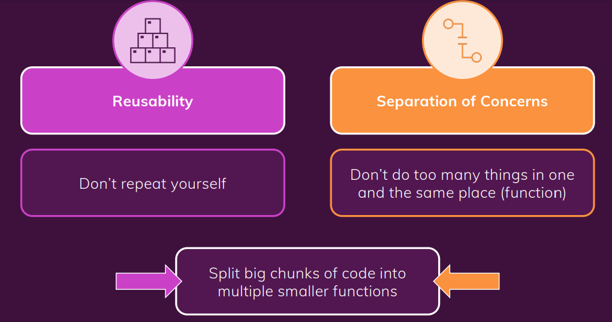

### component tree

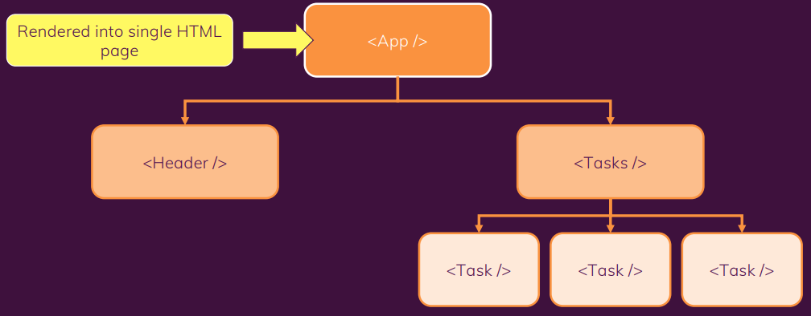

### List Components

- we can use the array `map` method to iterate over our list items to map them from JavaScript primitive to HTML elements.

  - Each element must receive a **mandatory** `key` prop

- `Keys` : Keys help React identify which items have changed, been added, or been removed. so that react only updates this item and not the whole list of items.
  - Keys should be given to the elements inside the array to give the elements a stable identity.

```js
const numbers = [1, 2, 3, 4, 5];
const listItems = numbers.map((number) => (
  <li key={number.toString()}>{number}</li>
));
```

#### update list-items

```js
const initialList = [];

const List = () => {
  const [list, setList] = React.useState(initialList);

  return (
    <div>
      <ul>
        {list.map((item) => (
          <li key={item}>{item}</li>
        ))}
      </ul>
    </div>
  );
};
```

---

## Custom Components (fragment)

- they must start with an `UPPERCASE letter` : `<Expenses />`

### fragment

- Each custom component must return only `one root element`, so you should wrap it's contents in a :
  - empty brackets `<> </>` : not recommended as vs-code won't know how to organize the code
  - Fragment `<React.Fragment> </React.Fragment>`

---

### Portals

Portals provide a first-class way to render children into a DOM node that exists **outside the DOM hierarchy** of the parent component.

- it helps for more `semantic HTML`
  -usually with **modals**
- without portals 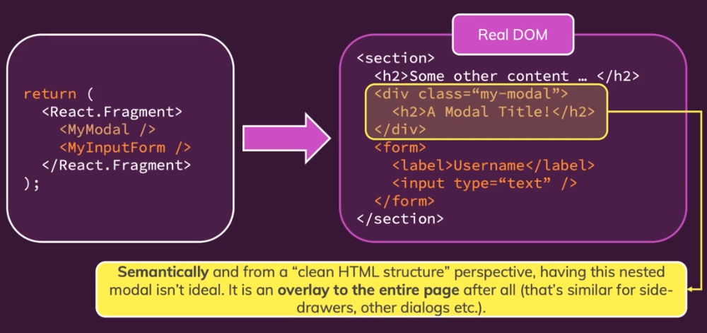
- with portals 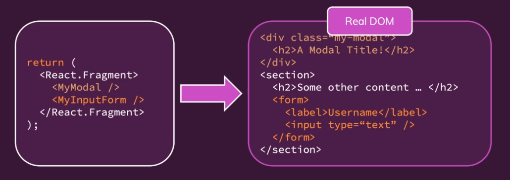

Portals need 2 things:

- the child is a React element
- (the container): the DOM location(node) to which the portal should be injected

```js
import ReactDOM from "react-dom";

ReactDOM.createPortal(child, container);
```

---

### Smart vs Dumb components

**Dumb components** are also called ‘presentational’ components because their only responsibility is to present something to the DOM. Once that is done, the component is done with it.

**Smart components** (or container components) on the other hand have a different responsibility. Because they have the burden of being smart, they are the ones that keep track of state and care about how the app works.

---

### Controlled vs. uncontrolled components

In React, there are two ways to handle **Form data** in our components.

#### Controlled components

Controlled components are those in which form data is handled by the component’s state.

It is the one that takes its current value through props and notifies changes through callbacks like onChange. A parent component "controls" it by handling the callback and managing its own state and passing the new values as props to the controlled component. You could also call this a "dumb component".

```js
function App() {
  const [name, setName] = useState("");
  const [email, setEmail] = useState("");

  function onSubmit() {
    console.log("Name value: " + name);
    console.log("Email value: " + email);
  }
  return (
    <form onSubmit={onSubmit}>
      <input
        type="text"
        name="name"
        value={name}
        onChange={(e) => setName(e.target.value)}
        required
      />
      <input
        type="email"
        name="email"
        value={email}
        onChange={(e) => setEmail(e.target.value)}
        required
      />
      <input type="submit" value="Submit" />
    </form>
  );
}
```

#### Uncontrolled components

Uncontrolled components are those for which the form data is handled by the DOM itself. “Uncontrolled” refers to the fact that these components are not controlled by React state.

It is the one that stores its own state internally, and you query the DOM using a ref to find its current value when you need it. This is a bit more like traditional HTML.

> components that use **ref** are uncontrolled, as they aren't controlled by React

```js
function App() {
  function onSubmit() {
    console.log("Name value: " + window.name.value);
    console.log("Email value: " + window.email.value);
  }
  return (
    <form onSubmit={onSubmit}>
      <input type="text" name="name" id="name" required />
      <input type="email" name="email" id="email" required />
      <input type="submit" value="Submit" />
    </form>
  );
}
```

---

## Component Props

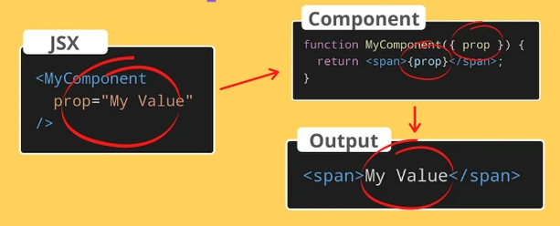

[reference](https://dmitripavlutin.com/react-props/)

- they make components more `flexible`

### single prop

- ex: add the `who` prop to `<Message>` component

```js
// 1) Make the function of your component read the props from the props parameter
function Hello(props) {
  return <div>Hello, {props.who}!</div>;
}
/* Now Hello function has a parameter props. When rendering the component,
React will make sure to assign to props object all the props you assign to the component.*/

// 2) When rendering the component, add the prop to the component using the attribute-like syntax who="Earth"
<Hello who="Earth" />
// Output
<div>Hello, Earth!</div>
```

### Multiple props

```js
// using destructuring
function Message({ greet, who }) {
  return (
    <div>
      {greet}, {who}!
    </div>
  );
}

// Render
<Message greet="Welcome" who="Aliens" />
// Output
<div>Welcome, Aliens!</div>
```

---

## Communicating Between Components

[reference](https://www.pluralsight.com/guides/react-communicating-between-components)

### From Parent to Child

- use [props](#component-props)

### From Child to Parent

- use Callbacks :
  - child component must first receive a mechanism to communicate back from its parent.
  - parents pass data to children through `props`.
  - A "special" prop of type `function` can be passed down to a child. At the time of a relevant event, the child can then call this function as a callback.

```js
// in BookTitle component file (CHILD)
// It receives a "onTitleChange" function in the props, sent from its parent.
function BookTitle(props) {
  return (
    <label>
      Title:
      <input onChange={props.onTitleChange} value={props.title} />
    </label>
  );
}
```

```js
// in BookEditForm component file (PARENT)
// the parent, "BookEditForm", has reference to this function, it can receive the "arguments" that are passed to the function:
function BookEditForm(props) {
  const [title, setTitle] = useState(props.book.title);
  function handleTitleChange(e) {
    setTitle(e.target.value);
  }
  return (
    <form>
      <BookTitle onTitleChange={handleTitleChange} title={title} />
    </form>
  );
}
```

### lifting the state up

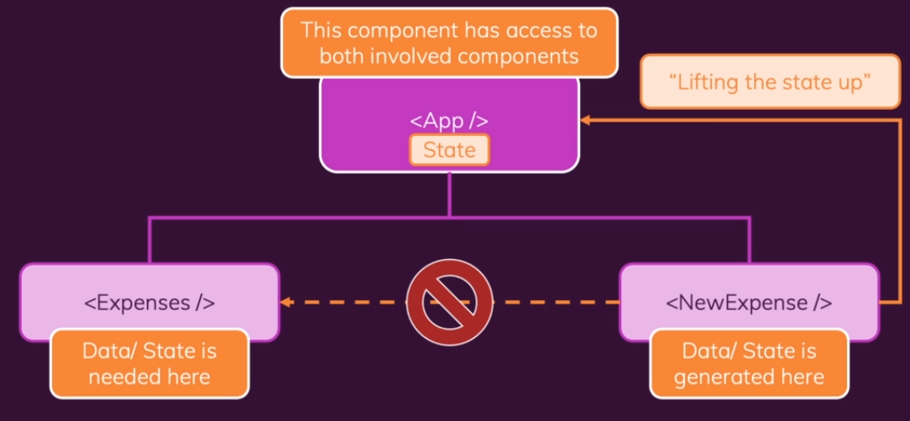

---

## React Composition

React Composition is a development pattern based on React's original component model where we build components from other components using explicit defined props or the implicit `children` prop.

### Why Use React Composition?

- This technique prevents us from building too many `similar` components containing duplicate code and allows us to build fewer components that can be reused anywhere within our application, making them easier to understand and maintain for your team.

```js
function Card(props) {
  const classes = "card " + props.className;
  // idea is to use {props.children}
  return <div className={classes}>{props.children}</div>;
}

export default Card;

///////////////////////////////////////////////////////

// then in the file that we will use the card-component
import Card from "../UI/Card";

const Expenses = (props) => {
  return (
    <div>
      <Card className="expenses">
        <components />
      </Card>
    </div>
  );
};
```

---

## Handling Events

- React events are named using `camelCase`, rather than lowercase.
- With JSX you pass a function as the event handler, rather than a string.

---

### Events in HTML vs React

```html
<!-- in html -->
<button onclick="activateLasers()">Activate Lasers</button>
```

```js
// in React
<button onClick={activateLasers}>Activate Lasers</button>
// always try to use the callbackfunction like this instead of defining it in the {} as this improves performance as you won't create it each time you do a (click)
```

- Another difference is that you cannot `return false` to prevent default behavior in React. You must call `preventDefault` explicitly. For example, with plain HTML, to prevent the default form behavior of submitting, you can write:

---

### Data binding

Data binding in React can be achieved by using a `controlled input`. A controlled input is achieved by binding the `value` to a `state variable` and an `onChange` event to change the state as the `input value` changes.

```js
// 2 way data-binding because of (value={value})
const App = () => {
  const [value, setValue] = useState("Hello World");
  const handleChange = (e) => setValue(e.target.value);
  return (
    <div>
      <input type="text" value={value} onChange={handleChange} />
      <p>{value}</p>
    </div>
  );
};
```

---

## Forms

[Here](https://formik.org/)

### Form-Input

to access input-value:

- use **state**
  - this is preferred if you will do something on the input-value (like resetting the input-value after submitting)
- use **refs**
  - if you want to just access the value without modifying it

### Validation

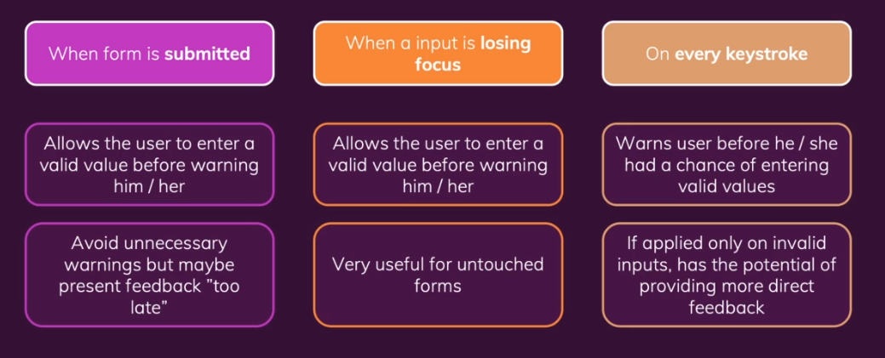

---

## Environmental Variables

in `.env` file:

- You must create custom environment variables beginning with `REACT_APP_`
- [Docs](https://create-react-app.dev/docs/adding-custom-environment-variables/#adding-development-environment-variables-in-env)

---

## Interview Questions

[React Interview Questions & Answers](https://github.com/sudheerj/reactjs-interview-questions)

- Why React Hook useState uses const and not let?

  --> because When the component is rerendered, the function is executed again, creating a new scope, creating a new `color` variable, which has nothing to do with the previous variable.

- why if I write

  ```js
  <h1
    onClick={() => {
      this.state.name = "Ahmed";
    }}
  >
    Hi {this.state.name}
  </h1>
  ```

  it doesn't change the name in the page but if console.log it I see that the name is equal to 'Ahmed'

  --> because the state is changed but the component needs to be rerendered as what is shown on the page is what we call `object's reference by memory`, so when we rerender we create a new object(state), so we should use

  ```js
  this.setState(() => {
    name: "Ahmed",
  });
  ```

- Why (fetching with setting the state to the resolved value) without `componentDidMount()` or `useEffect()` results **infinit render**
  - because the resolved object/array is different from the one in the memory so the state gets reseted over and over
