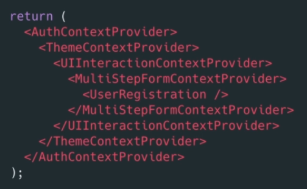

# INDEX

- [INDEX](#index)
  - [Functional Components](#functional-components)
  - [Component's State](#components-state)
    - [State is Async](#state-is-async)
    - [Difference between state and props](#difference-between-state-and-props)
    - [Using the state](#using-the-state)
  - [UseRef Hook](#useref-hook)
    - [Refs](#refs)
    - [The Reference object](#the-reference-object)
    - [useRef](#useref)
      - [Why use it ?](#why-use-it-)
    - [Example](#example)
  - [Effect Hook](#effect-hook)
    - [useEffect](#useeffect)
      - [useEffect cleanup function](#useeffect-cleanup-function)
  - [useReducer()](#usereducer)
  - [useContext()](#usecontext)
    - [Prop drilling](#prop-drilling)
    - [Soulution](#soulution)
    - [useContext Hook](#usecontext-hook)
    - [Context Limitations](#context-limitations)
  - [Hooks Rules](#hooks-rules)
  - [Custom Hooks](#custom-hooks)

---

## Functional Components

here each time the state change the entire function get called and rerendered unlike in `class components` where only the `render()` method was called

---

## Component's State

[reference](https://reactjs.org/docs/faq-state.html#gatsby-focus-wrapper)

- `setState()` schedules an update to a component’s state object. When state changes, the component responds by `re-rendering`.
  - it happens `ASynchronously` as react finds the best strategy to change it, so it's better to use a callback function inside of `setState`

### State is Async

- Notice that the state changes **asynchronously**

> you can check that with console.logging the state inside tha handler function that sets the state

---

### Difference between state and props

props (short for “properties”) and state are both plain JavaScript objects. While both hold information that influences the output of render, they are different in one important way:

- `props` get passed to the component (similar to function `parameters`)
- `state` is managed within the component (similar to `variables` declared within a function).

---

### Using the state

- In React, both this.props and this.state represent the rendered values, i.e. what’s currently on the screen.
- Calls to setState are asynchronous - don’t rely on this.state to reflect the new value immediately after calling setState. Pass an updater function instead of an object if you need to compute values based on the current state

- `useState`

  - The React `useState` Hook allows us to track state in a (function component).
  - it `must` be written inside the `component` function

```js
// in the top of the file
import { useState } from "react";

function FavoriteColor() {
  const [color, setColor] = useState("red");
  // color is our current state
  // setColor is the function that is used to update our state

  return <h1>My favorite color is {color}!</h1>;
}

// or with Updating the State
function FavoriteColor() {
  const [color, setColor] = useState("red");

  return (
    <>
      <h1>My favorite color is {color}!</h1>
      <button type="button" onClick={() => setColor("blue")}>
        Change Color
      </button>
    </>
  );
}
```

- `useState` accepts an `initial state` and returns an `array` with two elements:
  - The current state.
  - A function that updates the state.

```js
// updating state with depending on previous state
const total = setTotal((state) => {
  return state + 4;
});
```

---

## UseRef Hook

### Refs

[reference](https://blog.logrocket.com/complete-guide-react-refs/)

- **Allow us to access DOM properties directly**. Normally, React uses `state` to update the data on the screen by re-rendering the component for us. But there are certain situations where you need to deal with the DOM properties directly, and that’s where refs come in.
- can be very useful when dealing with different frameworks like `react + JQuery` or `react + Angular`

> Note: refs are escape hatches for React developers, and we should try to avoid using them if possible.

- You can gain access to the actual HTML element by creating a React reference and passing it to the element itself.

  - This way, at any time in the lifecycle of the component, we can access the actual HTML element at `buttonRef.current`

  ```js
  import React, { useRef } from "react";
  const ActionButton = ({ label, action }) => {
    const buttonRef = useRef(null);
    return (
      <button onClick={action} ref={buttonRef}>
        {label}
      </button>
    );
  };
  export default ActionButton;
  ```

---

### The Reference object

the variable you use `useRef` with will become a frozen object with a **current** property which contains the referenced element

---

### useRef

- It allows you to persist values between renders.

- It can be used to store a mutable value that does not cause a re-render when updated.

- It can be used to access a DOM element directly.

- usually used For:
  - **form-input**
  - Accessing DOM elements
    - used when you need to have programmatic access to a DOM node

#### Why use it ?

If we tried to count how many times our application renders using the `useState` Hook, we would be caught in an infinite loop since this Hook itself causes a re-render.

> **ref**: is like I have one value that I need to refer to the exact same thing across all renders, so that different renders have access to one exact version of the state
>
> **useRef** make sure we get same thing each render

To avoid this, we can use the useRef Hook.

---

### Example

```js
// Using useRef to focus the input

import { useRef } from "react";

function App() {
  const inputElement = useRef();

  const focusInput = () => {
    inputElement.current.focus();
  };

  return (
    <>
      <input type="text" ref={inputElement} />
      <button onClick={focusInput}>Focus Input</button>
    </>
  );
}
```

**Note**: You can also access form-inputs with useState ->

```js
 handleChange(e) {
  setState(e.target.value);
}

<input type="text" value={state} onChange={handleChange} />
```

---

## Effect Hook

- when changing the state => the **whole function-component** `rerenders`.
- Data fetching(`HTTP requests`), subscriptions, or manually changing the DOM from React components. We call these operations `side effects` (or `effects` for short) because they can affect other components and **can’t be done during rendering.**
  - so such `sideEffects` shouldn't go directly inside the component-function as it will create bugs
- The Effect Hook, `useEffect`, adds the ability to perform side effects from a function component. It serves the same purpose as `componentDidMount`, `componentDidUpdate`, and `componentWillUnmount` in React classes, but unified into a single API

> **Side-Effects**: Tasks that must happen outside of the component-evaluation and render-cycle, as they might block rendering (ex: HTTP request)

### useEffect


- When you call `useEffect`, you’re telling React to run your `effect` function after flushing changes to the `DOM`. Effects are declared inside the component so they have access to its props and state. By default, React runs the effects after every render — including the first render.

> it happens after all other functions and state
> 

#### useEffect cleanup function

- it saves applications from unwanted behaviors like memory leaks by cleaning up effects. In doing so, we can optimize our application’s performance.
- it allows us to tidy up our code before our component unmounts. When our code runs and reruns for every render, useEffect also cleans up after itself using the cleanup function.
- The `useEffect` Hook is built in a way that we can return a function inside it
  - this `return function` is where the cleanup happens.
  - The cleanup function prevents memory leaks and removes some unnecessary and unwanted behaviors.

```js
useEffect(() => {
  effect;
  return () => {
    cleanup;
  };
}, [dep]);
```

- the `cleanup` function runs before every new side effect function execution and before the component is removed.
- it does not run `before` the first side effect function execution. But thereafter, it will run `before` every next side effect function execution.

---

## useReducer()


- in `useState()` the state management logic takes a good part of the component body.

  - That's a problem because the React component in nature should contain the logic that calculates the output. But the state management logic is a different concern that should be managed in a separate place. Otherwise, you get a mix of state management and rendering logic in one place, and that's difficult to read, maintain, and test! as the order of depending states may differ and cause wrong action!

- `useReducer()` does so by extracting the state management out of the component.

- Use-Cases :

  - When you have states that belongs together
  - if you have a state updates (is setted) that depend on other state.
  - If you find yourself keeping track of multiple pieces of state that rely on complex logic

- It's similar to `useState()` as the hook returns an `array of 2 items`: the `current state` and the `dispatch function`.
- `reducer function` can be outside the component as it doesn't use any items from the component, it only uses **items rendered by react**

---


- `reducer function` contains your custom state logic(different senarios).
  - after executing the senario-code, you should return a new state object
- `initialState` can be a simple value but generally will contain an **object** as it's for more complex state.
- `dispatch` : is what we call in order to update the state --> it's like `setState()`
  - it will call the `reducer function` for us with `argument = action-object`
- `action` is an **object** that tells the reducer how to change the state.
  - It must contain a **type** property
  - It can contain an optional **payload** object which has properties you want to add to the state(parameters to be used)
- Finally: when state is updated the component gets rerendered just like in `useState()`


```js
import { useReducer } from "react";

// reducer function can be here outside the component

const [state, dispatch] = useReducer(reducer, initialState);

function reducer(state, action) {
  let newState;
  switch (action.type) {
    case "increase":
      newState = { counter: state.counter + 1 };
      break;
    case "descrease":
      newState = { counter: state.counter - 1 };
      break;
    default:
      throw new Error();
  }
  return newState;
}
```

---

## useContext()

### Prop drilling

`Prop drilling` is basically a situation when the same data is being sent at almost every level due to requirements in the final level.


---

### Soulution

Context provides a way to pass data through the component tree without having to pass `props` down manually at every level.

- without context

  

- with context

  

- React Context is a way to manage state globally.
  - it stores data in a external object so that it can be accessed globally.
- Context is designed to share data that can be considered `global` for a tree of React components, such as the current authenticated user, theme, or preferred language.
- It's sometimes used instead of `Redux` by a lot of users
- we'll use the `Context Provider` to wrap the tree of components that need the state Context.
  - `Context Provider` Wrap child components in the Context Provider and supply the state value.
- we'll use the `Context Consumer` to get values from the state Context.
- `without context` (Passing "props" through nested components:)

  ```js
  import { useState } from "react";
  import ReactDOM from "react-dom";

  function Component1() {
    const [user, setUser] = useState("Jesse Hall");

    return (
      <>
        <h1>{`Hello ${user}!`}</h1>
        <Component2 user={user} />
      </>
    );
  }

  function Component2({ user }) {
    return (
      <>
        <h1>Component 2</h1>
        <Component3 user={user} />
      </>
    );
  }

  function Component3({ user }) {
    return (
      <>
        <h1>Component 3</h1>
        <Component4 user={user} />
      </>
    );
  }

  function Component4({ user }) {
    return (
      <>
        <h1>Component 4</h1>
        <Component5 user={user} />
      </>
    );
  }

  function Component5({ user }) {
    return (
      <>
        <h1>Component 5</h1>
        <h2>{`Hello ${user} again!`}</h2>
      </>
    );
  }
  ```

- `with context`

  ```js
  import { useState, createContext } from "react";
  import ReactDOM from "react-dom";

  const UserContext = createContext();

  function Component1() {
    const [user, setUser] = useState("Jesse Hall");

    return (
      // in the provider the attribute must be named "value"
      <UserContext.Provider value={user}>
        <h1>{`Hello ${user}!`}</h1>
        <Component2 user={user} />
      </UserContext.Provider>
      // Now, all components in this tree will have access to the user Context.


    );
  ```

### useContext Hook

- In order to use the Context in a child component, we need to access it using the useContext Hook.

```js
import { useState, createContext, useContext } from "react";

function Component5() {
  // inside the component
  const user = useContext(UserContext);

  return (
    <>
      <h1>Component 5</h1>
      <h2>{`Hello ${user} again!`}</h2>
    </>
  );
}
```

---

### Context Limitations

- shouldn't be used to replace all components-communications and **Props**
- Complex Setup
  
- can lead to deeply-nested jsx code and huge context-provider components
  
- Performance
- context is not optimized for high-frequency state changes

---

## Hooks Rules


---

## Custom Hooks

- When you have component logic that needs to be used by multiple components, we can extract that logic to a custom Hook
  - they're reusable functions.
- Custom Hooks start with "`use`". Example: `useFetch`

- Example:

  ```js
  // in useBreedList.js
  import { useState, useEffect } from "react";

  const localCache = {};

  export default function useBreedList(animal) {
    const [breedList, setBreedList] = useState([]);
    const [status, setStatus] = useState("unloaded");

    useEffect(() => {
      if (!animal) {
        setBreedList([]);
      } else if (localCache[animal]) {
        setBreedList(localCache[animal]);
      } else {
        requestBreedList();
      }

      async function requestBreedList() {
        setBreedList([]);
        setStatus("loading");
        const res = await fetch(
          `http://pets-v2.dev-apis.com/breeds?animal=${animal}`
        );
        const json = await res.json();
        localCache[animal] = json.breeds || [];
        setBreedList(localCache[animal]);
        setStatus("loaded");
      }
    }, [animal]);

    return [breedList, status];
  }
  ```
