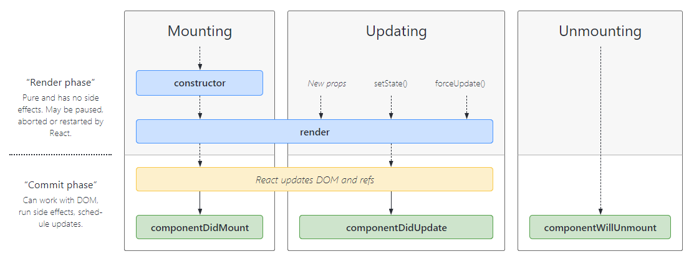
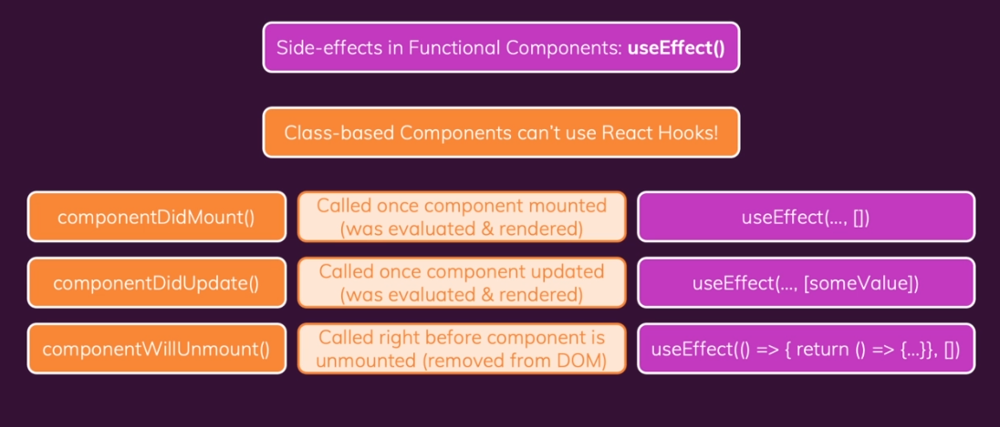

## INDEX

- [INDEX](#index)
- [class component](#class-component)
- [Component Constructor](#component-constructor)
  - [State](#state)
  - [Setting the state](#setting-the-state)
  - [Props in the Constructor](#props-in-the-constructor)
  - [Context.Consumer](#contextconsumer)
- [this keyword](#this-keyword)
- [component life-Cycles](#component-life-cycles)
  - [Order of executing](#order-of-executing)
- [Error Boundaries](#error-boundaries)

---

## class component

- Before React 16.8, Class components were the only way to track state and lifecycle on a React component. Function components were considered "state-less".

- we inheret from the `component` **parent-Class** in order to use the `props` => `extends React.Component`
- The component also requires a `render()` method, this method returns HTML.

```js
import { Component } from "react";

class Welcome extends Component {
  render() {
    return <h1>Hello, {this.props.name}</h1>;
  }
}
```

---

## Component Constructor

- The `constructor function` is where you initiate the component's properties.

### State

- In React, component properties should be kept in an **object** called `state`
- `state` in class-component is **Always** an `object` but in functional-component it is any type
- `setState` -> re-invoke the `render()` method from the `component` class

```js
import { component } from "react";

class Car extends React.Component {
  constructor() {
    super();
    this.state = { color: "red" };
  }
  render() {
    return <h2>I am a {this.state.color} Car!</h2>;
  }
}
```

---

### Setting the state

```js
this.setState({ stateName: updatedStateValue });

// OR
this.setState((prevState) => ({
  stateName: prevState.stateName + 1,
}));
```

---

### Props in the Constructor

- If your component has a constructor function, the props should always be passed to the constructor and also to the React.Component via the `super()` method.

```js
class Car extends React.Component {
  constructor(props) {
    super(props); // gives the props to the React.component parent class so that it(react) handles them
  }
  render() {
    return <h2>I am a {this.props.model}!</h2>;
  }
}

ReactDOM.render(<Car model="Mustang" />, document.getElementById("root"));
```

---

### Context.Consumer

`Context.Consumer`: A React component that subscribes to context changes. Using this component lets you subscribe to a context within a function component.

```js
<MyContext.Consumer>
  {value => /* render something based on the context value */}
</MyContext.Consumer>
```

- Requires a function as a child. The function receives the current context value and returns a React node. The value argument passed to the function will be equal to the value prop of the closest Provider for this context above in the tree. If there is no Provider for this context above, the value argument will be equal to the defaultValue that was passed to `createContext()`.

---

## this keyword

when using handler methods and inside it you want to access property of the component or the props of the component, you have 2 ways:

1. use arrow function for the method (**Recommended**)
2. in the constructor:
   - bind the method to `this`

   ```js
   constructor(props){
    super(props);
    this.handlerIndexClick = this.handleIndexClick.bind(this);
   }
   ...

   handlerIndexClick(event){
    console.log(this)
   }
   ```

---

## component life-Cycles

We have 3 different life cycles in general

- Mounting
- Updating
- Unmounting



- **NOTE: THERE ISN'T LIFE CYCLES FOR FUNCTIONAL COMPONENTS ONLY SIMULATING THE ONES IN CLASS COMPONENTS**

  

```js
// example with the lifecycle & updating the state
class Clock extends React.Component {
  constructor(props) {
    super(props);
    this.state = { date: new Date() }; // initializing the state
  }

  // this is after the state is initialized
  componentDidMount() {
    this.timerID = setInterval(() => this.tick(), 1000);
  }

  componentWillUnmount() {
    clearInterval(this.timerID);
  }

  // note that setState uses the new state in (object)
  tick() {
    this.setState({
      date: new Date(),
    });
  }

  render() {
    return (
      <div>
        <h1>Hello, world!</h1>
        <h2>It is {this.state.date.toLocaleTimeString()}.</h2>
      </div>
    );
  }
}
```

---

### Order of executing

1. `constructor` -> this.state = {} -> (initial state)
2. `render()` method
3. `componentDid...` methods -> (setting the new state)
4. rerender using `render()` method again

---

## Error Boundaries

Error Boundaries basically provide some sort of boundaries or checks on errors, They are React components that are used to handle JavaScript errors in their `child component tree`.

- Error boundaries are React components that catch JavaScript errors anywhere in their child component tree, log those errors, and display a fallback UI instead of the component tree that crashed. Error boundaries catch errors during rendering, in lifecycle methods, and in constructors of the whole tree below them.
- **must be used in class-components**
- Error boundaries work like a JavaScript `catch {} block`, but for components.

```js
class ErrorBoundary extends React.Component {
  constructor(props) {
    super(props);
    this.state = { hasError: false };
  }

  static getDerivedStateFromError(error) {
    // Update state so the next render will show the fallback UI.
    return { hasError: true };
  }

  componentDidCatch(error, errorInfo) {
    logErrorToMyService(error, errorInfo);
    // You can also log the error to an error reporting service
    // console.error(error, errorInfo)
  }

  render() {
    if (this.state.hasError) {
      // You can render any custom fallback UI
      return <h1>Something went wrong.</h1>;
    }

    return this.props.children;
  }
}

// Then you can use it as a regular component:
<ErrorBoundary>
  <MyWidget />
</ErrorBoundary>;
```

---
