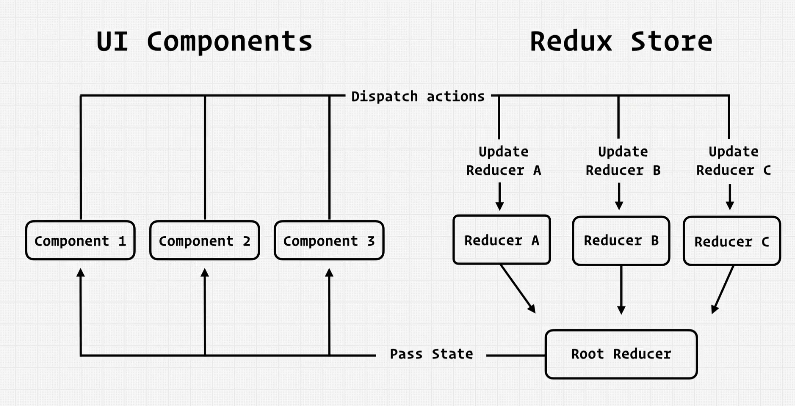

## INDEX

- [INDEX](#index)
- [Types of state](#types-of-state)
  - [Disadvantages of Contex](#disadvantages-of-contex)
- [Installation](#installation)
- [Redux](#redux)
  - [Core Concept](#core-concept)
  - [(usecontext + useReducer) vs Redux](#usecontext--usereducer-vs-redux)
- [Files](#files)
  - [Setup](#setup)
  - [store.js](#storejs)
  - [root-reducer.js](#root-reducerjs)
  - [user.types.js](#usertypesjs)
  - [user.selector.js](#userselectorjs)
  - [user.reducer.js](#userreducerjs)
  - [user.action.js](#useractionjs)
- [Redux Hooks](#redux-hooks)
  - [useDispatch()](#usedispatch)
  - [useSelector()](#useselector)
- [Reselect](#reselect)
- [Redux-persist](#redux-persist)
- [Redux Async Data Flow [Side-Effects]](#redux-async-data-flow-side-effects)
  - [Redux Middleware and Side Effects](#redux-middleware-and-side-effects)
  - [Examples of MiddleWares:](#examples-of-middlewares)
- [Redux Thunk Middleware](#redux-thunk-middleware)
- [Redux Saga Middleware](#redux-saga-middleware)
  - [Saga vs Thunk](#saga-vs-thunk)
- [Redux in class components](#redux-in-class-components)
- [Redux in Typescript](#redux-in-typescript)

---

## Types of state


### Disadvantages of Contex

1- Complex Setup

- can lead to deeply-nested jsx code and huge context-provider components
  

2- Performance

- context is not optimized for high-frequency state changes

---

## Installation

```sh
# Redux Core
npm install redux

# Complementary Packages
npm install react-redux
npm install --save-dev @redux-devtools/core
```

`React-Redux` library lets your React components talk to a Redux store.

---

## Redux

It's a **state management system** for cross-component or app-wide state

Redux is really:

- A single store containing "global" state
- Dispatching plain object actions to the store when something happens in the app
- Pure reducer functions looking at those actions and returning immutably updated state

### Core Concept


- one central data(state) store
- components subscripe to the store-data(state)
- components **Never directly manipulate** the store-data, instead we use `Reducer-function`

---

### (usecontext + useReducer) vs Redux




- usually, you don't use `usecontext` with `Redux` at the same time as data can be stored in redux

---

## Files

### Setup

In `index.js`:

- we use `provider component` from `react-redux` & give it a `store prop` that can be used in the entire application


---

Folder structure:


### store.js

```js
import { compose, createStore, applyMiddleware } from "redux";
import logger from "redux-logger";

import { rootReducer } from "./root-reducer";

// they run before actions hit the reducers
const middleWares = [process.env.NODE_ENV === "development" && logger].filter(
  Boolean
);

// Generate composed enhancers that apply middlewares
const composedEnhancers = compose(applyMiddleware(...middleWares));

// create a redux-store that holds the complete state-tree of the app
export const store = createStore(rootReducer, undefined, composedEnhancers);
```

---

### root-reducer.js

```js
import { combineReducers } from "redux"; // to create final reducer that combine multiple reducer

import { userReducer } from "./user/user.reducer";

// here we pass an object that has key of reducer's slice Name - value of function itself
export const rootReducer = combineReducers({
  user: userReducer,
});
```

---

### user.types.js

```js
export const USER_ACTION_TYPES = {
  SET_CURRENT_USER: "SET_CURRENT_USER",
};
```

---

### user.selector.js

it takes a `function` that selects the part that we want from the state-object

```js
export const selectCurrentUser = (state) => state.user.curr;
```

this exported function will be called by the `useSelector() Hook`

---

### user.reducer.js

- `Note`: in the reducer, you should **never mutate the previos state**, You must always return new state-object as it's a **Reference-Type**, so do it for memory-management and so that you don't get unwanted side-effects

```js
import { USER_ACTION_TYPES } from "./user.types";

export const USER_INITIAL_STATE = {
  currentUser: null,
};

// here we neep to manually-provide the state with initial state as it doesn't have access to the useReduce-Hook & in the beginning the (previos state is undefined)
export const userReducer = (state = USER_INITIAL_STATE, action = {}) => {
  const { type, payload } = action;

  switch (type) {
    case USER_ACTION_TYPES.SET_CURRENT_USER:
      return { ...state, currentUser: payload }; // return the object but modify the currentUser
    default:
      return state; // here we don't return an error, instead -> we return the (current state-object) as this means that the action is not for this particular reducer
    // the object is the same in memory, so it won't result reRendering
  }
};
```

---

### user.action.js

```js
import { createAction } from "../../utils/reducer.utils";
import { USER_ACTION_TYPES } from "./user.types";

// this function creates an action that will be dispatched from root-reducer
export const setCurrentUser = (user) =>
  createAction(USER_ACTION_TYPES.SET_CURRENT_USER, user);
```

---

## Redux Hooks

### useDispatch()

It's a Hook that you pass a **selector function** into it which selects the state that you want from the global state-object in `Redux`

- It dispatch generated actions to every reducer-function in `root-reducer`

```js
import { useDispatch } from "react-redux";

const dispatch = useDispatch();

// setCurrentUser() function generates an action
dispatch(setCurrentUser(user));
```

---

### useSelector()

It's a Hook for using the `state-object` in Redux to access the data

```js
import { useSelector } from "react-redux";
import { selectCurrentUser } from "../../store/user/user.selector";

const currentUser = useSelector(selectCurrentUser);
```

---

## Reselect

A library for creating **memoized** "selector" functions. Commonly used with Redux

- Reselect exports a `createSelector API`, which generates memoized selector functions. createSelector accepts one or more "input" selectors, which extract values from arguments, and an "output" selector that receives the extracted values and should return a derived value.
- If the generated selector is called multiple times, the output will only be recalculated when the extracted values have changed.

it's like `pure function` -> as long as the input hasn't change, the output will be the same

```sh
npm i reselect
```

```js
// in categories.selector.js

import { createSelector } from "reselect";

// creating a memoized (CASHED) version of selectCategories (This is what will run if nothing changed)
const selectCategoryReducer = (state) => state.categories;

// creating dependencies for the chashed values
export const selectCategories = createSelector(
  [selectCategoryReducer],
  (categoriesSlice) => categoriesSlice.categories
);

// as long as "selectCategories" doesn't change, Don't run this function
export const selectCategoriesMap = createSelector(
  [selectCategories],
  (categories) =>
    categories.reduce((acc, category) => {
      // acc is for 'accumulator'
      const { title, items } = category;
      acc[title.toLowerCase()] = items;
      return acc;
    }, {})
);
```

---

## Redux-persist

[Guide](https://dev.to/dawnind/persist-redux-state-with-redux-persist-3k0d)

When we refresh page in a web-app, the state always resets back to the initial values which in not a good thing when you try to build some large web-app like e-commerce.

We can manually do the state persistent using the native JavaScript `localStorage.setItem()` method but honestly we will have to write everything from start and we have to maintain the structure of the state.

- `redux-persist` helps us to persist the state after page refresh.

- Every app needs to decide how many levels of state they want to "merge". The default is 1 level.

```sh
npm i redux-persist
```

```js
// Store.js

import { createStore } from "redux";
import { persistStore, persistReducer } from "redux-persist";
import storage from "redux-persist/lib/storage"; // defaults to localStorage for web

import rootReducer from "./reducers";

const persistConfig = {
  key: "root",
  storage,
};

const persistedReducer = persistReducer(persistConfig, rootReducer);

export default () => {
  let store = createStore(persistedReducer);
  let persistor = persistStore(store);
  return { store, persistor };
};
```

- wrap your root component with PersistGate. This delays the rendering of your app's UI until your persisted state has been retrieved and saved to redux.

  ```js
  import { PersistGate } from "redux-persist/integration/react";

  // ... normal setup, create store and persistor, import components etc.

  const App = () => {
    return (
      <Provider store={store}>
        <PersistGate loading={null} persistor={persistor}>
          <RootComponent />
        </PersistGate>
      </Provider>
    );
  };
  ```

---

## Redux Async Data Flow [Side-Effects]

### Redux Middleware and Side Effects


By itself, a `Redux store` doesn't know anything about async logic. **It only knows how to synchronously dispatch actions**, update the state by calling the root reducer function, and notify the UI that something has changed. **Any asynchronous code has to happen outside the reducer-function**.

- A "`side effect`" is any change to state or behavior that can be seen outside of returning a value from a function.
- Common side effects:

  - Logging a value to the console
  - Saving a file
  - Setting an async timer
  - Making an AJAX HTTP request
  - Modifying some state that exists outside of a function, or mutating arguments to a function
  - Generating random numbers or unique random IDs (such as `Math.random()` or `Date.now()`)

- we could actually pass something that isn't a plain action object to dispatch, as long as a middleware intercepts that value and doesn't let it reach the reducers.


### Examples of MiddleWares:

```js
import { client } from "../api/client";

const fetchTodosMiddleware = (storeAPI) => (next) => (action) => {
  if (action.type === "todos/fetchTodos") {
    // Make an API call to fetch todos from the server
    client.get("todos").then((todos) => {
      // Dispatch an action with the todos we received
      storeAPI.dispatch({ type: "todos/todosLoaded", payload: todos });
    });
  }

  // The next step: going to the reducer-function
  return next(action);
};

//  writing a middleware that let us pass a function to dispatch, instead of an action object
const asyncFunctionMiddleware = (storeAPI) => (next) => (action) => {
  // If the "action" is actually a function instead...
  if (typeof action === "function") {
    // then call the function and pass `dispatch` and `getState` as arguments
    return action(storeAPI.dispatch, storeAPI.getState);
  }

  // Otherwise, it's a normal action - send it onwards
  return next(action);
};
```

---

## Redux Thunk Middleware


Redux already has "**async function** middleware", called the Redux "Thunk" middleware.

- It allows the application to fire actions, and these actions don't have to flow in the redux-default-data-flow **in a syncronous way** but instead it (read from the store or dispatch actions within the middleware) **in an asyncronous way**
- it receives `async-actions` in the form of `functions`
  - Redux takes the function and passes into it a `dispatch` as a parameter
  - now we can dispatch new actions in this Thunk, so that we can abstract some logic in the Thunk and so that Actions can be dispatched outside the component

The thunk middleware allows us to write functions that get dispatch and getState as arguments. The thunk functions can have any async logic we want inside, and that logic can dispatch actions and read the store state as needed.


- All Thunks really do is: **allow actions to be passed as functions**

```sh
npm install redux-thunk
```

```js
// in src/store.js
import { createStore, applyMiddleware } from "redux";
import thunkMiddleware from "redux-thunk";
import { composeWithDevTools } from "redux-devtools-extension";
import rootReducer from "./reducer";

const composedEnhancer = composeWithDevTools(applyMiddleware(thunkMiddleware));

// The store now has the ability to accept thunk functions in `dispatch`
const store = createStore(rootReducer, composedEnhancer);
export default store;
```

```js
// in categories.action.js
import CATEGORIES_ACTION_TYPES from "./categories.types";
import { createAction } from "../../utils/reducer.utils";
import { getCategoriesAndDocuments } from "../../utils/firebase.utils";

// -------------------THE ASYNC ACTIONS------------------- //
export const fetchCategoriesStart = () =>
  createAction(CATEGORIES_ACTION_TYPES.FETCH_CATEGORIES_START);

export const fetchCategoriesSuccess = (categoriesArray) =>
  createAction(
    CATEGORIES_ACTION_TYPES.FETCH_CATEGORIES_SUCCESS,
    categoriesArray
  );

export const fetchCategoriesFailure = (error) =>
  createAction(CATEGORIES_ACTION_TYPES.FETCH_CATEGORIES_FAILED, error);

// -------------------THE THUNK ACTION------------------- //
// it's a function that returns a function that gets a dispatch as an argument
export const fetchCategoriesStartAsync = () => {
  return async (dispatch) => {
    dispatch(fetchCategoriesStart());
    try {
      const categoriesArray = await getCategoriesAndDocuments("categories"); // doing the logic here instead of in the component
      dispatch(fetchCategoriesSuccess(categoriesArray));
    } catch (error) {
      dispatch(fetchCategoriesFailure(error));
    }
  };
};
```

---

## Redux Saga Middleware

It's an intuitive Redux **side-effect manager**.

In most middlewares, actions hit `middleware` before they hit the `reducer`, **But** Saga is different -> the actions will hit the reducer first before moving to the saga **(after the reducers have updated**)

- when actions hit the saga, it will respond to these actions and perform (buisness-logic, async-requests,..)

- **NOTE**: Actions fired by sagas can trigger another sagas:
  - Actions triggered by sagas can also flow through the saga again


- Saga uses [Generator Functions](https://javascript.info/generators)
  

Look at the **Example Usage** [here](https://redux-saga.js.org/)

---

### Saga vs Thunk


---

## Redux in class components

- `connect()` --> [Code](https://codesandbox.io/s/r1kqd?file=/src/App.js:591-600)

---

## Redux in Typescript

[Here](https://github.com/piotrwitek/react-redux-typescript-guide)
