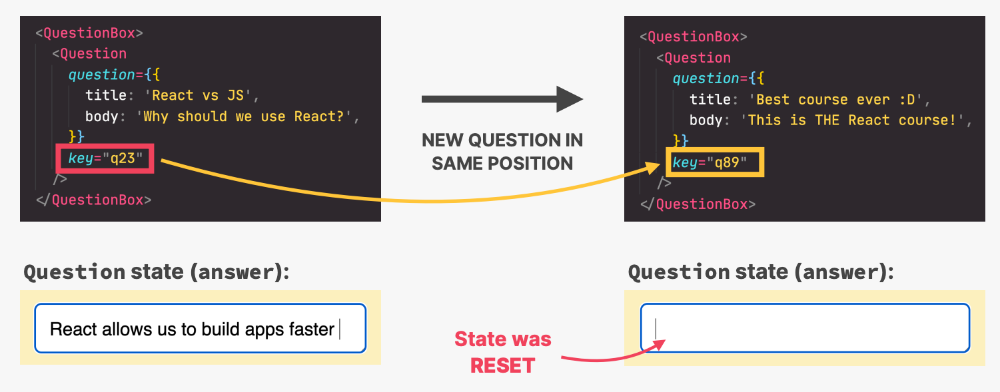
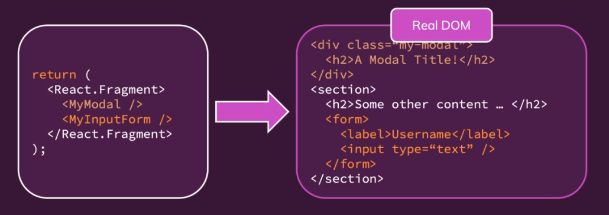
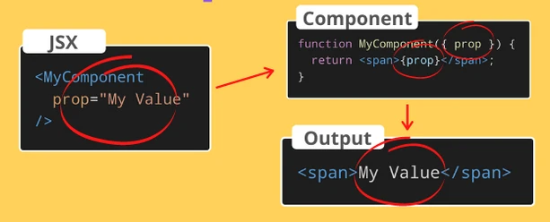
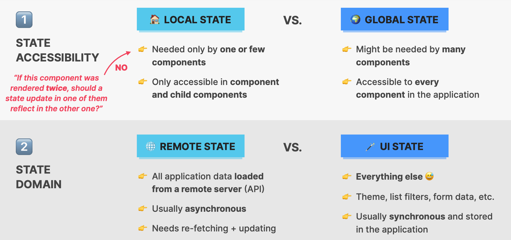
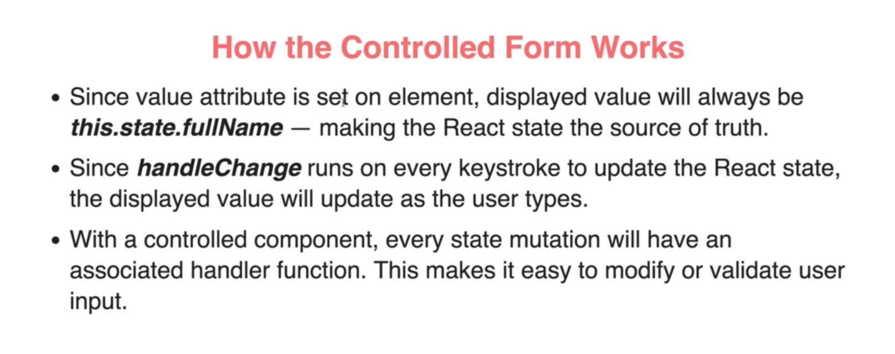
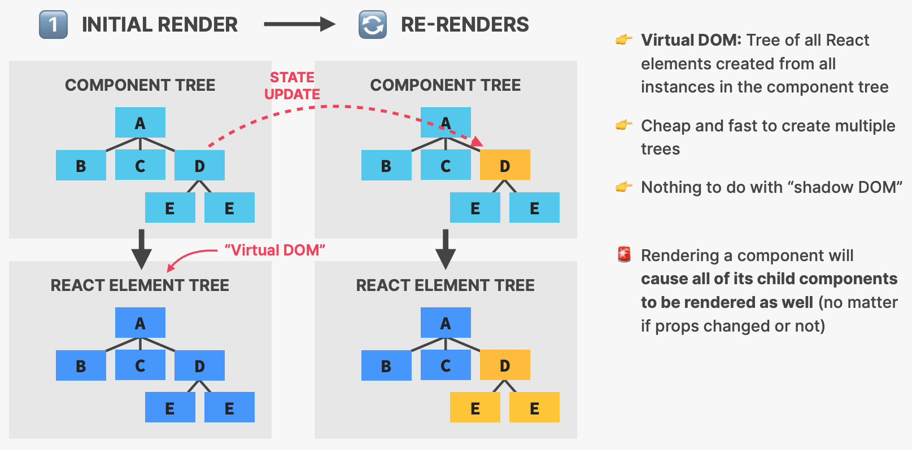

# INDEX

- [INDEX](#index)
  - [React Fundamentals](#react-fundamentals)
    - [React Concepts](#react-concepts)
    - [Declarative vs imperative](#declarative-vs-imperative)
    - [Multi-page application](#multi-page-application)
    - [Single-page application (SPA)](#single-page-application-spa)
    - [What to choose with React: ( CSR or SSR )](#what-to-choose-with-react--csr-or-ssr-)
    - [Function components vs class components](#function-components-vs-class-components)
  - [installation](#installation)
    - [Create React App installation](#create-react-app-installation)
    - [Vite installation](#vite-installation)
    - [Folder Structure and Assets](#folder-structure-and-assets)
    - [`react` and `react-dom` modules(libraries)](#react-and-react-dom-moduleslibraries)
  - [JSX](#jsx)
    - [Dynamic expressions in JSX](#dynamic-expressions-in-jsx)
    - [Conditional rendering](#conditional-rendering)
  - [Styling and CSS](#styling-and-css)
    - [Inline style](#inline-style)
    - [Dynamic classes](#dynamic-classes)
    - [Styled-components](#styled-components)
    - [CSS Modules](#css-modules)
      - [CSS Modules In React Application](#css-modules-in-react-application)
  - [Components](#components)
    - [why components](#why-components)
    - [List Components (Looping)](#list-components-looping)
      - [`key` prop](#key-prop)
      - [update list-items](#update-list-items)
    - [Component logic and structure](#component-logic-and-structure)
    - [Smart vs Dumb components](#smart-vs-dumb-components)
  - [Custom Components (fragment)](#custom-components-fragment)
    - [fragment](#fragment)
    - [Portals](#portals)
      - [Modal notes](#modal-notes)
  - [Forms: Controlled vs uncontrolled components](#forms-controlled-vs-uncontrolled-components)
    - [Controlled components](#controlled-components)
    - [Uncontrolled components](#uncontrolled-components)
  - [Props](#props)
    - [Passing props](#passing-props)
    - [passing all props through components (implicitly)](#passing-all-props-through-components-implicitly)
    - [`children` prop](#children-prop)
    - [Validating Props (PropTypes)](#validating-props-proptypes)
    - [Default Prop Values](#default-prop-values)
  - [React Component Composition](#react-component-composition)
  - [Events](#events)
    - [How React handles events](#how-react-handles-events)
    - [Synthetic Events](#synthetic-events)
  - [State](#state)
    - [State management](#state-management)
    - [State vs Props](#state-vs-props)
    - [State Batch Updates](#state-batch-updates)
    - [Async \& Derived State](#async--derived-state)
    - [Communicating Between Components](#communicating-between-components)
      - [From Parent to Child](#from-parent-to-child)
      - [From Child to Parent (lifting the state up)](#from-child-to-parent-lifting-the-state-up)
  - [Handling Events](#handling-events)
    - [Events in HTML vs React](#events-in-html-vs-react)
    - [DocumentWide event handlers (Refs)](#documentwide-event-handlers-refs)
    - [Data binding](#data-binding)
  - [Forms](#forms)
    - [Controlled Forms](#controlled-forms)
      - [Form-Input](#form-input)
    - [Form Validation](#form-validation)
  - [Side Effects and Lifecycles](#side-effects-and-lifecycles)
    - [Component Lifecycle](#component-lifecycle)
    - [Side Effects](#side-effects)
  - [How React Works (under the hood)](#how-react-works-under-the-hood)
    - [Rendering](#rendering)
    - [1. Triggering Phase](#1-triggering-phase)
      - [2. Render Phase](#2-render-phase)
      - [3. Commit Phase](#3-commit-phase)
      - [4. Browser Paint Phase](#4-browser-paint-phase)
    - [Virtual DOM vs Real DOM](#virtual-dom-vs-real-dom)
      - [How does it work?](#how-does-it-work)
  - [Environmental Variables](#environmental-variables)
  - [Professional React Development](#professional-react-development)
    - [React Project Structure](#react-project-structure)

---

## React Fundamentals

It's a **library** not a framework. However, few people use react on its own, but when combined with things/tools like `react-router`, `webpack`, `redux` -> ("React Ecosystem"), then it become more like a framework


- It's a library for building user interfaces, based on components, declarative, stateful, and reusable
- React ecosystem is a collection of libraries that work together to solve a common problem
  

- There's an actual framework built around React -> **Next.js**
  

---

### React Concepts

React is based on these concepts:

1. Don't touch the DOM, I'll do it --> **Declarative**
   - This idea of declarative style, means that we don't have to directly say "do this and if this happens then do that and so on...", Instead we tell React that this is the state of our app and React will automatically just does the rest for us.
2. Build websites like lego blocks --> **Components**
   - React is designed on the concept of reusable-components that are grouped together to form bigger components
3. Unidirectional(One way) data-flow --> **State(data) can never move up**
   - Anytime we want something to change on our page, the state has to change, so that React "reacts" to this change and use the new state to update the DOM (the data flows only in one way)
4. React handles the UI (View) and the rest in on you --> **library and not framework**
   - React only handles the View using the virtual-dom, Everything else that you need, You can use other modules and libraries and mix and match whatever you want customized to your need.
   - React is not like a kitchen, It's like a stove

---

### Declarative vs imperative

- Functional Programming is a declarative programming paradigm, in contrast to imperative programming paradigms.

  - `Declarative programming` is a paradigm describing `WHAT` the program does, without explicitly specifying its control flow.
    - allows you to control flow and state in your application by saying `"the state should look like this" and React will handle the rest`
  - `Imperative programming` is a paradigm describing `HOW` the program should do something by explicitly specifying each instruction (or statement) step by step, which mutate the program's state.
    - allows you to control your application by saying `"This is what you should do"`

- React's declarative approach
  
  - Define the desired target state(s) and let React figure out the actual JavaScript DOM instructions
    

---

### Multi-page application

- As the name suggests, a multi-page application (MPA) is an app that has more than one page. It works in a traditional way, requiring the app to reload entirely every time a user interacts with it.

---

### Single-page application (SPA)


- Why? -> it's to make application more **"reactive"** like `mobile-apps` and `desktop-apps` which things happen instantly (you don't wait for new pages or responses to load or actions to start)
- `Single-page applications` can work in different ways. One way a single-page app loads is by downloading the entire site's contents all at once. This way, when you're navigating around on the site, everything is already available to the browser, and it doesn't need to refresh the page. Another way single-page apps work is by downloading everything that's needed to render the page the user requested. Then when the user navigates to a new page, asynchronous JavaScript requests are made for just the content that was requested.

  - Another key factor in a good single-page app is that the URL controls the page content. Single-page applications are highly interactive, and users want to be able to get back to a certain state using just the URL. --> [React Router](./4-React-router.md)

- The browser downloads the entire app data when you visit SPA web applications. Thus, you can browse through different parts of the app seamlessly and the page won’t reload every time you click on something.

- This is because a single page application executes the logic in the browser, instead of a server. It does so with JavaScript frameworks that can lift this heavy data on the client-side. JavaScript also enables an SPA to reload only those parts of the app that a user requests for, not the entire app. As a result, SPAs are known to deliver fast and efficient performance.

---

### What to choose with React: ( CSR or SSR )

- The standard way of building a React apps was to build single-page applications (SPAs) that run in the browser. This is called `Client-Side Rendering (CSR)`. But there's another way to build React apps, which is `Server-Side Rendering (SSR)`

- The React team recently started to recommend using `Server-Side Rendering (SSR)` for most use cases, and only using `Client-Side Rendering (CSR)` when you have a good reason to do so.

  - `Server-Side Rendering (SSR)` is the process of rendering your React components on the server-side, before sending them to the client. This means that the HTML is generated on the server-side instead of the client-side. This is the traditional way of building web applications.

- Here is a comparison between `CSR` and `SSR` for React applications:

  

---

### Function components vs class components

React always had `function components` and `class components`, but before `React Hooks` we had to use `class components` to use `state` and `lifecycle methods`, but now we can use `function components` with `hooks` to use `state` and `lifecycle methods`


---

## installation

- Options for setting up React:
  

  - **create-react-app** is built on top of **Webpack**, which:
    - Enables module importing/exporting
      - packages/bundles up all `css`/`images`/`js` into a single file for the browser
      - reduce number of `HTTP` requests for performance
    - **HMR**, hot module reloading (when changing a source file, automatically reloads(only reloads relevant files))
    - Enables easy testing & deployment
  - **Vite** can also be used instead of `create-react-app`
    - with `vite`, the starting file will be `main.jsx` instead of `index.js`

### Create React App installation

- **`npx`** is a command that lets you run **(execute)** code built with Node.js and published through the NPM registry without installing it first locally (It's a Node.js package runner). It's used to execute commands without installing dependencies (**install latest version of something and run it immediately**)

```bash
npx create-react-app my-app # equivalent to installing react globally first then >> creating react app

# to run it again
cd my-app
npm install
npm start
```

- When using the `Create-React-App` tool you are provided with a handy script(command) `eject` that allows you to configure Webpack among other features at your heart content.

  - > if you use the script `npm run eject`, it will get you `config` folder which is everything that `create-react-app` does, and it's not recommended to change it or even to `eject` as the configuration is made by people who figured out the best configuration

- in `index.js` you render the app to `index.html`

  ```js
  // we tell ReactDOM to render something (<App>) in the place of ("root" id)
  ReactDOM.render(
    <React.StrictMode>
      <App />
    </React.StrictMode>,
    document.getElementById('root')
  );
  ```

> **StrictMode**: It's a tool for highlighting potential problems in the app. It provides additional checks and warnings for its descendence-components when using legacy or soon to be deprecated code.
>
> - It only runs in `dev-mode` and may result **rendering twice** so that it can catch any weird behaviors that might occur in the side-effects inside the functional component, and **won't run in production mode** so no logs will be shown there
> - also the re-render happens when the `props` change, which is the case when providing `props`

---

### Vite installation

- Here, we need to configure `ESLint` manually:

  1. Install `ESLint` and `eslint-plugin-react` and `eslint-config-react-app` as dev-dependencies

     ```sh
     npm install eslint vite-plugin-eslint eslint-plugin-react eslint-config-react-app --save-dev
     ```

  2. Create `.eslintrc.json` file in the root directory and add the following:

     ```json
     {
       "extends": ["react-app", "react-app/jest"]
     }
     ```

  3. Add the following to `vite.config.js` file:

     ```js
     import { defineConfig } from 'vite';
     import reactRefresh from '@vitejs/plugin-react-refresh';
     import eslint from 'vite-plugin-eslint';

     // https://vitejs.dev/config/
     export default defineConfig({
       plugins: [react(), eslint()]
     });
     ```

---

### Folder Structure and Assets

- **Folder structure**
  
- **Images**
  - external images (hosted on different server) -> just need `url`
  - local images **(public folder)** -> less performant as they don't get optimized ❌
  - local images **(src folder)** -> better solution for assets, since under the hood they get optimized ✅

---

### `react` and `react-dom` modules(libraries)

These 2 libraries from React are critical for React to work, these 2 combined is what actually allows us to build web application in React

- `react`: is the engine which does all of the work of how React functions works and be built -> **Application Builder**
  - How react works
- `react-dom`: is related to the Web-DOM being the document-object-model, which is the different tools that help us actually build web-applications
  - what react renders
  - It specifies that the engine should be directed towards web related applications

---

## JSX

It's a declarative syntax extension to JavaScript that allows us to write `HTML`-like syntax in our JavaScript code.


- **JSX** = "HTML in JavaScript"
- it's a Syntactic sugar (syntax extension of javascript which extends the functionality of javascript), does not run in the browser like this!
- It's not legal Javascript; It has to be transpiled to Javascript using **Babel**
- It's like functions as when react sees them it **invokes them**
- in older versions of react : to use `JSX` you had to write this in the file :

  ```js
  import React from 'react';
  // we don't have to write it anymore after V17
  ```

- what `Babel` does to `jsx` :

  ```jsx
  // jsx that we write
  <p title='Intro text'>React.js is a library for building user interfaces.</p>;

  // Babel converts it to this
  React.createElement(
    'p',
    { title: 'Intro text' },
    'React.js is a library for building user interfaces.'
  );
  ```

- **Notes:**
  - if you don't have attributes you can use `{}` or `null` instead
  - to have multiple child elements -> use an array
  - Don't use objects as react can't show an object as text content (string interpolation)
  - JSX attributes rules:
    

### Dynamic expressions in JSX

- to write javascript expressions in JSX => `{your_expression}`
- it must be **expressions** and not **declarations** or **blocks**
- **NOTE** : when you write a `array` in JSX, the JSX automatically `joins` the `array`, that's why you can't use `forEach`

  ```js
  const names = ["ahmed", "esraa", "mona"];
  return (
      <Fragnent>
          <p>
            {names}
          </p>
      </Fragent>
  )
  // results : ahmedesraamona
  ```

---

### Conditional rendering

- **if-else** statements can't be used inside JSX, but we can use **ternary operator** or **logical && operator** instead

  ```jsx
  const isLoggedIn = true;
  return (
    <div>
      {isLoggedIn ? <p>Logged in</p> : <p>Logged out</p>}
      {isLoggedIn && <p>Logged in</p>}
    </div>
  );
  ```

  - **Important Note**: in `jsx`, you must provide a boolean value when using short-circuiting `&&` operator, you should't depend on `type coercion`

    ```jsx
    const arr = [];

    return (
      <div>
        {arr && <p>Logged in</p>} // this will be rendered
        {arr.length && <p>Logged in</p>} // this won't be rendered | or might return 0 {}
        {arr.length > 0 && <p>Logged in</p>} // Best approach ✅
      </div>
    );
    ```

- Another way to do conditional rendering is to use multiple `return` statements inside a function

  ```jsx
  const isLoggedIn = true;

  if (isLoggedIn) {
    return <p>Logged in</p>;
  } else {
    return <p>Logged out</p>;
  }
  ```

---

## Styling and CSS


There're many ways to style react components:

1. Inline style -> `style={{color: "red"}}`
2. CSS Modules -> `import styles from "./Button.module.css";`
3. Styled-components -> `import styled from "styled-components";`
4. CSS-in-JS -> `import { css } from "@emotion/react";`

### Inline style

The style attribute accepts a JavaScript `object` with `camelCased` properties rather than a CSS string.

- **NOTE**: in `style=` -> first `{}` is for writing JavaScript in JSX, and the second `{}` is for the object that contains the styles

```js
const divStyle = {
  color: 'blue',
  backgroundImage: 'url(' + imgUrl + ')'
};

function HelloWorldComponent() {
  return <div style={divStyle}>Hello World!</div>;
}

// or
function HelloWorldComponent() {
  return (
    <div
      style={{
        color: 'blue',
        backgroundImage: 'url(' + imgUrl + ')'
      }}>
      Hello World!
    </div>
  );
}
```

---

### Dynamic classes

To add classes based on certain values, we can use normal conditions `if..else` or short-circuiting `&&` or we can use [classnames](https://www.npmjs.com/package/classnames) package


- Another way is to use `template literals` to add classes dynamically

  ```js
  const Button = () => {
    const [isError, setIsError] = useState(false);

    return (
      <button className={`btn ${isError ? 'btn--error' : ''}`} onClick={() => setIsError(true)}>
        Error Button
      </button>
    );
  };
  ```

---

### Styled-components

[StyledComponents File](../CSS%20Frameworks%20%26%20Mehtodologies/StyledComponents.md)

---

### CSS Modules

CSS Modules are “CSS files in which all class names and animation names are scoped locally by default”

- CSS Modules are not specs or an implementation in the browser, but rather a process in a **build step** (with the help of `Webpack` or `Browserify`) that changes class names and selectors to be scoped (kinda like **namespaced**).

  - Our build step would then process both these things into new, separate `HTML` and `CSS` files, with a new string of characters replacing both the HTML class and the CSS selector class. Now the `HTML` and `CSS` generated by our build tool might look like this:

    ```html
    <!-- Before -->
    <h2 class="${styles.greeting}">Good Morning</h2>

    <!-- After -->
    <h2 class="_styles_greeting_344389">Good Morning</h2>
    ```

- CSS Modules is a great approach for making CSS locally scoped and for preventing naming clashes in medium to large projects.
- It creates a **unique namespace** for each class/style that you use in the component

#### CSS Modules In React Application

There are two different ways of using CSS Modules in a React application.

1. When using the `Create-React-App` tool you are provided with a handy script(command) `eject` that allows you to configure Webpack among other features at your heart content.

   - more info [here](https://medium.com/nulogy/how-to-use-css-modules-with-create-react-app-9e44bec2b5c2)

2. Name and import your CSS files differently.

   - you must give the css-file this format : `[name].module.css`
   - This lets React and Webpack know that we are using CSS Modules.

   ```css
   /* in Button.module.css */

   .errorMessage {
     background-color: red;
   }
   ```

   ```jsx
   // in button.component.jsx
   import styles from "./Button.module.css"; // Import styles object from the css file

   const Button = () => {
   export   return <button className={styles.errorMessage}>Error Button</button>;
     // note: if the class name is not  a single word like "btn--inner" we then use bracket notation for the styles object => className={styles["btn--inner"]}
   };

   // Result
   <button class="Button_error_ax7yz">Error Button</button>;
   ```

- **Notes**:

  - When writing classes names in the `module.css` file, use `camelCase` instead of `kebab-case` as it will be converted to `camelCase` in the `styles` object
  - if you used the same `module.css` file in different components, the hashed class names will be different in each component. So don't worry about the class names being the same in different components
  - There's a gotcha (tradeoff) when using css-modules, which is that it doesn't affect `elements selectors, So you shouldn't use them in css-modules`

    ```css
    /* this won't be namespaced */
    ul li {
      font-style: italic;
    }

    /* solution mix them with classes */
    .list li {
      font-style: italic;
    }
    ```

  - To make a global style, you can use `:global` selector

    ```css
    :global (.btn) {
      color: red;
    }
    ```

    - now, we can use it without importing it in any component

      ```jsx
      const Button = () => {
        return <button className='btn'>Error Button</button>;
      };
      ```

- To easily import css modules files, use this vs-code snippet:

  ```json
  "ImportCSSModules": {
    "prefix": "csm",
    "scope": "javascript,typescript,typescriptreact",
    "body": [
      "import styles from './${TM_FILENAME_BASE}.module.css';",
      "$1"
    ],
    "description": "Import CSS Modules as `styles`"
  }
  ```

  - Then add it to your `keybindings.json` file (File -> Preferences -> Keyboard Shortcuts -> Open Keyboard Shortcuts (JSON))

- When we have a `prop` that is used to select the css modules class, we can use `template literals` to add classes dynamically

  ```jsx
  const Button = ({ type }) => {
    return <button className={`${styles.btn} ${styles[`btn--${type}`]}`}>Error Button</button>; // class: btn--primary
  };
  ```

---

## Components

They are the building blocks of React, They describe a part of the user interface.


- They are javascript `classes` / `functions` that return `JSX` elements and know how to render themselves into HTML
- They start with a capital letter `<ContactList/>` to let react differentiate it with HTML elements which start with lower-case letter elements like: `<div>`
- **Component Instance** : is a component that is rendered by React and is an `instance` of the component `class`
  

  - React component should only be instantiated using JSX syntax

    ```jsx
    // Correct ✅
    return <MyComponent />;
    // Incorrect ❌
    return MyComponent(); // This will result uncorrect state and component instance
    ```

- **React Element** : is a plain `object` describing what you want to appear on the screen in terms of the `DOM` nodes or other components.

  - React elements are created with `React.createElement()` function and are immutable.
    

    - interview question:

      ```jsx
      // What is the expected output?
      console.log(<Test />);
      // result:
      ReactElement { type: 'div', props: { children: 'Hello World' }, key: null, ref: null }
      ```

  - It's inserted to the `DOM` as a `HTML` element
    

### why components


- Some might say that React doesn't have a "Separation of Concerns" because it mixes `HTML` and `JS` together, but this is not true as React separates the concerns of the UI into `components`, and each component has its own concerns (`HTML`, `CSS`, `JS`)
  

---

### List Components (Looping)

- we can use the array `map` method to iterate over our list items to map them from JavaScript primitive to HTML elements.

#### `key` prop

Each element must receive a **mandatory** `key` attribute

- `Key` : It's a special `prop` that we use to tell the [diffing algorithm](#3-commit-phase) that an element is unique and it should not be re-rendered.

- when a `key` stays the same across multiple renders, the element will be kept in the DOM (even if the position in the tree changes)
- when a `key` changes between renders, the element will be destroyed (removed from the DOM) and a new one will be created (even if the type stays the same)
- this makes us do the minimum update possible to the `HTML` from the rendering as React compares the keys on each list item to the keys from the previous render

- Keys should be given to the elements inside the lists to give the elements a stable identity.
  

- Another way to use `key` prop is to **Reset State**:
  - if we have the same element at the same position in the tree, the `DOM` element and `state` will be kept, by changing `key` prop of the component, we are telling React that this is a new component and it should be **re-rendered (with new reset state)**
    
    

---

#### update list-items

```js
const initialList = [];

const List = () => {
  const [list, setList] = React.useState(initialList);

  return (
    <div>
      <ul>
        {list.map(item => (
          <li key={item}>{item}</li>
        ))}
      </ul>
    </div>
  );
};
```

---

### Component logic and structure

There're 2 types of logic in components: **(Render logic & Event handler functions)**


---

### Smart vs Dumb components

**Dumb components** are also called ‘presentational’ components because their only responsibility is to present something to the DOM. Once that is done, the component is done with it.

**Smart components** (or container components) on the other hand have a different responsibility. Because they have the burden of being smart, they are the ones that keep track of state and care about how the app works.

---

## Custom Components (fragment)

- they must start with an `UPPERCASE letter` : `<Expenses />`

### fragment

- Each custom component must return only `one root element`, so you should wrap it's contents in a :
  - empty brackets `<> </>` : not recommended as vs-code won't know how to organize the code
  - Fragment `<React.Fragment> </React.Fragment>`

---

### Portals

Portals provide a first-class way to render children into a DOM node that exists **outside the DOM hierarchy** of the parent component.

- it helps for more `semantic HTML`
- usually with **modals**
- we use it with **modals** as a modal will only work correctly when it doesn't have a CSS-Positioned parent element, so that the parent will be `<body>` element, but Real projects use CSS-positioned-parents and this is solved with **Portals**
  
  - the modal `div` will never have a CSS-Positioned-Parent. so the modal will be positioned relative to the HTML document, and will always fill the entire screen

Implementation:

- without portals 
- with portals 

Portals need 2 things:


- the child is a React element
- (the container): the DOM location(node) to which the portal should be injected

```js
import ReactDOM from 'react-dom';

ReactDOM.createPortal(child, container);
```

#### Modal notes

- when showing the modal, We should prevent scrolling in the page, and this can be done with `useEffect` hook:

  ```js
  function Modal({...}){
    useEffect(() => {
      // using tailwind class
      document.body.classList.add('overflow-hidden');

      // cleanup function when closing the modal
      return () => {
        document.body.classList.remove('overflow-hidden');

      }
    }, [])
    return ReactDom.createPortal(...)
  }
  ```

- when you want to make the modal appear where you are currently and not in the beginning of the page, use `position: fixed` instead of `absolute`

---

## Forms: Controlled vs uncontrolled components

In React, there are two ways to handle **Form data** in our components:

1. **Controlled components**: are those in which form data is handled by the component’s `state`.
2. **Uncontrolled components**: are those for which the form data is handled by the DOM itself (using `ref`).

### Controlled components

Controlled components are those in which form data is handled by the component’s `state`.

> **Controlled Inputs:** are input elements where we provide both the `value` and `onChange` props

It is the one that takes its current value through props and notifies changes through callbacks like onChange. A parent component "controls" it by handling the callback and managing its own state and passing the new values as props to the controlled component. You could also call this a "dumb component".

```jsx
function App() {
  const [name, setName] = useState('');
  const [email, setEmail] = useState('');

  function onSubmit(e) {
    e.preventDefault();
    console.log('Name value: ' + name);
    console.log('Email value: ' + email);
    // Or, we can get the values from the event object itself
    console.log('Name value: ' + e.target.name.value);
    console.log('Email value: ' + e.target.email.value);
  }
  return (
    <form onSubmit={onSubmit}>
      <input
        type='text'
        name='name'
        value={name}
        onChange={e => setName(e.target.value)}
        required
      />
      <input
        type='email'
        name='email'
        value={email}
        onChange={e => setEmail(e.target.value)}
        required
      />
      <input type='submit' value='Submit' />
    </form>
  );
}
```

---

### Uncontrolled components

Uncontrolled components are those for which the form data is handled by the DOM itself. **"Uncontrolled"** refers to the fact that these components are not controlled by React state.

It is the one that stores its own state internally, and you query the DOM using a [ref](./2-Hooks.md#refs) to find its current value when you need it. This is a bit more like traditional HTML.

> components that use **ref** are uncontrolled, as they aren't controlled by React

```jsx
function App() {
  const nameInput = useRef();
  const emailInput = useRef();

  function onSubmit(e) {
    e.preventDefault();
    console.log('Name value: ' + nameInput.current.value);
    console.log('Email value: ' + emailInput.current.value);
  }
  return (
    <form onSubmit={onSubmit}>
      <input type='text' name='name' ref={nameInput} required />
      <input type='email' name='email' ref={emailInput} required />
      <input type='submit' value='Submit' />
    </form>
  );
}
```

---

## Props



[reference](https://dmitripavlutin.com/react-props/)

- They are used for configuring your component
- they are **immutable** (can't change component's props), if you want to change them you have to change the `state` of the component
  - because mutating `props` would be a **side-effect** on the parent, and React doesn't allow side-effects in the `render` function -> `Pure Functions` -> `PureComponent`
- By using them, React uses "One-way data flow" (data flows in one direction from `parent` to `child`), which makes the app more predictable and easier to understand

### Passing props

- ex: add the `who` prop to `<Message>` component

```jsx
// 1) Make the function of your component read the props from the props parameter
function Hello(props) {
  return <div>Hello, {props.who}!</div>;
}
// or with destructuring
function Hello({ who }) {
  return <div>Hello, {who}!</div>;
}
/* Now Hello function has a parameter props. When rendering the component, React will make sure to assign to props object all the props you assign to the component.*/

// 2) When rendering the component, add the prop to the component using the attribute-like syntax who="Earth"
<Hello who="Earth" />
// Output
<div>Hello, Earth!</div>
```

---

### passing all props through components (implicitly)

Instead of passing default props explicitly like passing `onClick` prop from a custom `<Button/>` element to a `<button>` element inside it, we can use the `rest` parameter:


```jsx
// in Button.jsx
function Button({ children, ...rest }) {
  return <button {...rest}>{children}</button>;
  // instead of: <button onClick={onClick} onMouseOver={onMouseOver}>{children}</button>
}

// in App.jsx
function App() {
  return (
    <div>
      <Button onClick={() => console.log('clicked')} onMouseOver={() => console.log('hovered')}>
        Click me
      </Button>
    </div>
  );
}
```

---

### `children` prop

`children` is a special prop that is passed to components automatically. It represents the content between the opening and closing tags of a component.

- It allows us to pass `JSX` into an element as a prop, and then render that `JSX` inside the component
  

- It makes components more reusable and configurable **(component content)**

```jsx
function Button({ children }) {
  return <button>{children}</button>;
}

function App() {
  return (
    <div>
      <Button>Click me</Button>
    </div>
  );
}
```

---

### Validating Props (PropTypes)

It's a way to validate the type of props passed to a component

> It used to be very popular. Now `Typescript` does almost the same thing (and more)

- This is done using the library [prop-types](https://www.npmjs.com/package/prop-types)
  - `create-react-app` already includes this library
- if someone passes down the incorrect kind of value (number instead of boolean), a warning will appear in console
  

- It can also be used to create custom validations other than checking the type of props, by creating a method in the `component.protoTypes` and return a `new Error()` for the custom condition

  ```js
  function HelloWorldComponent({ name }) {
    return <div>Hello, {name}</div>;
  }

  HelloWorldComponent.propTypes = {
    name: function (props, propName, componentName) {
      if (props[propName].length < 3) {
        return new Error(
          `Invalid prop ${propName} supplied to ${componentName}. Length must be at least 3 characters.`
        );
      }
    }
  };
  ```

---

### Default Prop Values

- The `defaultProps` special property will be used to ensure that the prop-item will have a value if it was not specified by the parent component. - The `propTypes` typechecking happens after `defaultProps` are resolved, so typechecking will also apply to the `defaultProps`.

  ```jsx
  import PropTypes from 'prop-types';

  function HelloWorldComponent({ name }) {
    return <div>Hello, {name}</div>;
  }

  HelloWorldComponent.propTypes = {
    name: PropTypes.string
  };

  HelloWorldComponent.defaultProps = {
    name: 'World'
  };
  ```

- Another way is to have default values for your props, you can use the `destructuring` assignment with default values

  ```jsx
  function Hello({ who = 'World' }) {
    return <div>Hello, {who}!</div>;
  }
  ```

---

## React Component Composition

React Composition is a pattern where we build components from other **(combine components)** using the implicit `children` prop.


- This technique prevents us from building too many `similar` components containing duplicate code and allows us to build fewer components that can be reused anywhere within our application, making them easier to understand and maintain for your team.
- Also, it fix the problem of **Prop Drilling** (passing props from a parent component to a child component that doesn't need it, just to pass it to another child component that needs it)
- There's another way of passing `children` prom **explicitly** using the `element` pattern (Not commonly used ❌)

  ```jsx
  function Button({ element }) {
    return <div>{element}</div>;
  }

  function App() {
    return (
      <div>
        <Button element={<button>Click me</button>} />
      </div>
    );
  }
  ```

---

## Events

- With JSX you pass a function as the event handler, rather than a string.

  ```jsx
  <button onClick={activateLasers}>Activate Lasers</button>
  ```

- Always try to use the callback function like this instead of defining it in the `{}` as this improves performance as you won't create it each time you do a (`click` event)

  ```jsx
  // BAD ❌
  <button onClick={() => setCount(count + 1)}>Click me</button>

  // GOOD ✅
  <button onClick={activateLasers}>Activate Lasers</button>
  ```

### How React handles events

Unlike in `vanilla JavaScript`, where It's recommended to use `event delegation` to handle events, in `React` we don't need to do that as React handles events differently.

- behind the scenes, React uses **event delegation** to listen for events at the top level of the DOM (`#root` element) and then delegates the event to the appropriate component
  

---

### Synthetic Events

React uses **Synthetic Events** which is a cross-browser **wrapper around the browser’s native `event`**.


- Attributes for event handlers are named using **camelCase** (`onClick` instead of `onclick` or `click`)
- Default behavior can not be prevented by returning `false`, you must call `preventDefault()` explicitly
- Attach `Capture` if you need to handle the event in the `capture phase` instead of the `bubbling phase`

  ```jsx
  // with capture phase
  <div onClickCapture={handleClick}> ... </div>

  // without capture phase
  <div onClick={handleClick}> ... </div>
  ```

---

## State

**State** is used to store data that changes over time.

> react is called "React" because it **reacts** to changes in the state and re-renders the component with the new data

- State allows us to update the component's `view` by re-rendering it with the new data
  

- Mechanism of `state` in React
  
  

- [Functional components state](./2-Hooks.md#state)
- [Class components state](./3-Class-Components.md#state)

---

### State management

- Types of `state` in React
  
  `state domain` is important when choosing where/what to store the state

  - `Application State` is the state that is shared between components, and it's usually stored in the `App` component and passed down to the other components as `props`
    

- When and where to use `state` in React
  
- State management tools and options
  
  

---

### State vs Props


- `props`
  - `props` (short for “properties”) and state are both plain JavaScript objects. While both hold information that influences the output of render, they are different in one important way:
  - get passed to the component (similar to function `parameters`)
- `state` is managed within the component (similar to `variables` declared within a function).

---

### State Batch Updates

By default, React uses a technique called **"auto-batching"** to group `state` updates that occur within the same event-loop into a single update. This means that if you call the state-update function multiple times in a short period of time, **React will only perform a single re-render for all of the updates**


- React 18 have **"Automatic Batching"** which is a new feature that allows React to batch state updates even if they're not happening within the same event-loop, like: (`setTimeout`, `setInterval`, `Promise.then`, `async/await`, `event handlers`)
  

---

### Async & Derived State

- Updating / Mutating state is asynchronous, so you can't rely on the previous state when you're updating the state using `setState`

  ```jsx
  // this won't work (stale state) ❌
  function handleTripleIncrement() {
    setCount(count + 1);
    setCount(count + 1);
    setCount(count + 1);
  }

  // instead use this (derived state) ✅
  function handleTripleIncrement() {
    setCount(prevState => prevState + 1);
    setCount(prevState => prevState + 1);
    setCount(prevState => prevState + 1);
  }
  ```

- **Stale State**: It is a state that is outdated and no longer reflects the current state of the application.
- **Derived State**: It is a state that is calculated based on existing / latest `state` or `props`.

- When having multiple pieces of state that are **interdependent**, it might be tempting to combine them into a **single object**. For example, if we have `firstName` and `lastName` state variables, we might be tempted to combine them into a single `name` state variable.

  ```jsx
  const [name, setName] = useState({ firstName: '', lastName: '' });

  // instead of
  const [firstName, setFirstName] = useState('');
  const [lastName, setLastName] = useState('');
  ```

- By combining them into a single `state` variable, we can reduce the number of state variables we have to manage. However, this can lead to problems when updating `state`. For example, if we want to update the `firstName` state variable, we have to remember to also include the `lastName` state variable in the update.

  ```jsx
  // BAD ❌
  setName({ firstName: 'Bruce' });

  // GOOD ✅
  setName((prevState) => { ...prevState, firstName: 'Bruce' });
  ```

---

### Communicating Between Components

[reference](https://www.pluralsight.com/guides/react-communicating-between-components)

#### From Parent to Child

- use [props](#props)

#### From Child to Parent (lifting the state up)

When we have a parent component that has a state and we want to update it from a child component, we can't just pass it to a sibling component, we have to pass it to the parent component first and then pass it to the sibling component as a `prop`


```jsx
// in parent component
function Parent() {
  const [count, setCount] = useState(0);
  const increment = () => setCount(count + 1);

  return <Child count={count} onIncrement={increment} />;
}

// in child component
function Child({ count, onIncrement }) {
  return (
    <div>
      <p>{count}</p>
      <button onClick={onIncrement}>Increment</button>
    </div>
  );
}
```

- child component must first receive a mechanism to communicate back from its parent.
- parents pass data to children through `props`.
- A "special" prop of type `function` can be passed down to a child. At the time of a relevant event, the child can then call this function as a callback.

---

## Handling Events

- React events are named using **camelCase**, rather than lowercase.
- With JSX you pass a function as the event handler, rather than a string.
- You should pass the event handler callback-function without invoking it
  - > **reason:** when invoking it, we won't have a reference to it anymore which is the main reason why we pass it as a reference, as it will be called by someone else in the future

---

### Events in HTML vs React

```html
<!-- in html -->
<button onclick="activateLasers()">Activate Lasers</button>
```

```js
// in React
<button onClick={activateLasers}>Activate Lasers</button>
// always try to use the callback function like this instead of defining it in the {} as this improves performance as you won't create it each time you do a (click)
```

- Another difference is that you cannot `return false` to prevent default behavior in React. You must call `preventDefault` explicitly. For example, with plain HTML, to prevent the default form behavior of submitting, you can write:

---

### DocumentWide event handlers (Refs)

React have a way to handle events on DOM elements by accessing DOM properties directly instead of the plain javascript way


- **Plain Javascript way:**
  

`useRef` hook is explained in the [Refs section in Hooks file](./02-Hooks.md#refs)

---

### Data binding

Data binding in React can be achieved by using a `controlled input`. A controlled input is achieved by binding the `value` to a `state variable` and an `onChange` event to change the state as the `input value` changes.

```js
// 2 way data-binding because of (value={value})
const App = () => {
  const [value, setValue] = useState('Hello World');
  const handleChange = e => setValue(e.target.value);
  return (
    <div>
      <input type='text' value={value} onChange={handleChange} />
      <p>{value}</p>
    </div>
  );
};
```

---

## Forms

Great library for forms in React -> [formik.org](https://formik.org/)

### Controlled Forms



- What we do by this is **stealing control (of the input value) from the browser and putting the (input value) under the control of a state system**

#### Form-Input

- To access input-value:

  - use **state**
    - this is preferred if you will do something on the input-value (like resetting the input-value after submitting)
  - use **refs**
    - if you want to just access the value without modifying it

- Handling multiple inputs

  

- for `label` element, use the `htmlFor` attribute instead of `for`

---

### Form Validation


---

## Side Effects and Lifecycles

### Component Lifecycle

It encompasses the three distinct phases a component instance goes through during its entire lifetime.


- **Mounting** : when an instance of a component is being created and inserted into the DOM
- **Updating** : when a component is being re-rendered as a result of changes to either its `props` or `state`
- **Unmounting** : when a component is being removed from the DOM

---

### Side Effects

React components should be **pure functions** with respect to their props. However, sometimes you need to **integrate React with non-React code**, such as a third-party library or an application built with a different framework. These cases are called **side effects** (or `effects` for short) because they can affect other components and can’t be done during rendering.


- To perform side effects in a function component, we shouldn't do it in the component function body, because:

  - it will be executed every time the component re-renders
  - it will cause infinite loop if we update the state inside it

    ```jsx
    function App() {
      const [count, setCount] = useState(0);

      // this will cause infinite loop and infinite requests
      fetch('https://api.example.com/items')
        .then(res => res.json())
        .then(data => setCount(data.count));

      return <div>{count}</div>;
    }
    ```

- Instead, we should perform side effects in `event handlers` or `useEffect` hook

  

- `useEffect`: It's a hook that gives us a place to put side effects in a function component
  - More about `useEffect` in the [Hooks file](./2-Hooks.md#effect-hook)

---

## How React Works (under the hood)

### Rendering

**“Rendering”** only means calling component functions and calculating what DOM elements need to be inserted, deleted, or updated. It has nothing to do with writing to the DOM. Therefore, each time a component instance is rendered and re-rendered, the function is called again

- Only the initial app render and state updates can cause a render, which happens for the **entire application**, not just one single component
- When a component instance gets re-rendered, **all its children will get re-rendered** as well. This doesn’t mean that all children will get updated in the DOM, thanks to `reconciliation`, which checks which elements have actually changed between two renders. But all this re-rendering can still have an impact on performance

This is how components are rendered in React


Here are the multiple phases in the rendering process in details:

### 1. Triggering Phase

- when the component is rendered for the first time or when the state changes
- The render process is triggered for the entire application (React checks the entire DOM tree)
- Here, the renders are not triggered immediately, but they are **scheduled to be executed later**
  - this is done to avoid multiple renders for the same component in the same cycle

#### 2. Render Phase


- React will go through the entire DOM tree and re-render all the component instances that were scheduled to be rendered in the previous phase
- This will create updated React elements which make the **Virtual DOM** tree
  
  
- After creating new `VDOM`, React will compare it with the previous `VDOM` to find the differences between them -> **Reconciliation + Diffing**
- `reconciliation` is the process of comparing the new VDOM with the previous VDOM to find the differences between them, it's done in React using `reconciler` called `"Fiber"`
  
  - `reconciliation` in action
    
- `diffing` is the process of finding the minimum number of operations to update the previous `VDOM` to the new `VDOM`
  - It uses 2 fundamental assumptions (rules):
    1. Two elements of different types will produce different trees.
    2. Elements with a stable `key` prop stay the same across renders
  - Same position, different type:
    
  - Same position, same element (different attributes/props):
    

#### 3. Commit Phase

- In this phase, the `ReactDOM` library will update the `DOM` with the changes that were found in the previous phase
- **committing is synchronous** -> DOM is updated in one go, it can't be interrupted. This is necessary to avoid visual inconsistencies in the **UI** (in sync with `state` at all times).
- After the commit phase completes, the workInProgress `fiber` tree becomes the current tree for the next render cycle

#### 4. Browser Paint Phase

- This is the phase where the browser paints the pixels on the screen using the updated DOM
  

---

### Virtual DOM vs Real DOM

**Dom Manipulation** can be very slow and heavy. For example, if you have several image tags inside a div and you replace one of the **images**

- **Virtual DOM (VDOM)**: is a concept where a virtual representation of a UI is kept in `memory` as an object **(snapshot of what the real DOM looks like)**, and synced with the real DOM by a library (such as ReactDOM). which makes changes to the virtual DOM and not the Real DOM

  - You can simply think of it as a lightweight copy of the Real DOM.
  - It's a tree-like object that gives react a blueprint of how it should update the actual DOM


- React re-renders only the parts that need to be updated compared to the initial DOM.

#### How does it work?


1. React generates a new Virtual DOM for our application.
2. React compares the initial Virtual DOM (representing the current html DOM) to the new Virtual DOM.
3. Based on the comparison above, React runs its **Diffing Algorithm** to calculate the minimum number of operations to update the initial Virtual DOM to the new Virtual DOM.
4. it update the new DOM by **unmounting**(removing from the DOM tree) the changed things that differ and re-render them with the new data
   
5. then React compares the difference between the DOM-snapshot and the real-DOM and update the real-DOM accordingly
   

> **Re-Evaluating Components !== Re-Rendering the DOM** > 

---

## Environmental Variables

in `.env` file:

- You must create custom environment variables beginning with `REACT_APP_`
- [Docs](https://create-react-app.dev/docs/adding-custom-environment-variables/#adding-development-environment-variables-in-env)

---

## Professional React Development

### React Project Structure

- Features based structure

  ```sh
  src
  ├── features
  │   ├── cart
  │   │   ├── Cart.jsx # component
  │   │   ├── CartItem.jsx
  │   │   ├── CartItem.module.css
  │   │   ├── Cart.module.css # styles for the whole feature
  │   │   ├── CartSlice.js # redux slice
  │   │   └── index.js # exports the component
  │   ├── products
  │   │   ├── Product.jsx
  │   │   ├── Product.module.css
  │   │   ├── ProductSlice.js
  │   │   └── index.js
  │   └── index.js
  ├── ui # reusable components or components that are used in multiple features
  │   ├── Home.jsx
  │   ├── Button.jsx
  │   ├── Button.module.css
  │   ├── Input.jsx
  │   ├── Input.module.css
  │   ├── Modal.jsx
  │   ├── Modal.module.css
  ├── utils # reusable functions
  │   ├── api.js
  │   └── helpers.js
  ├── App.css
  ├── App.jsx
  ├── App.test.js
  ├── index.css
  ├── index.js # entry point
  ```
