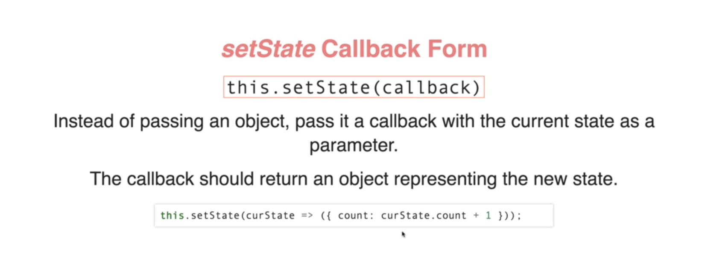
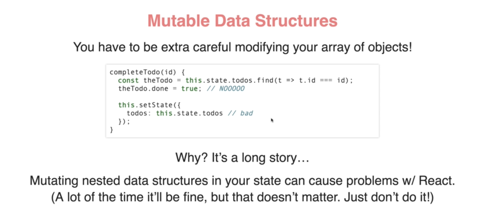
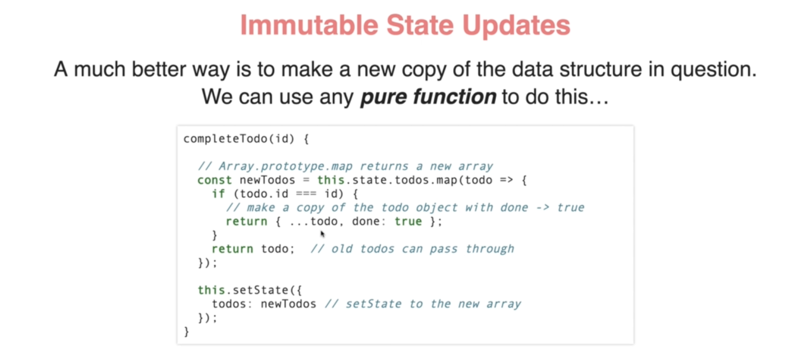
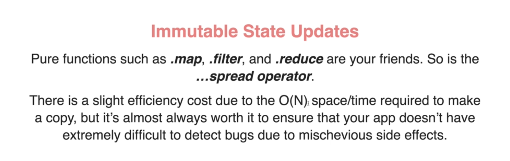
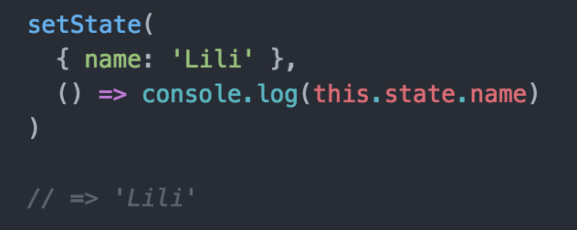

# INDEX

- [INDEX](#index)
  - [Class component](#class-component)
    - [Class Component Constructor Function](#class-component-constructor-function)
    - [Class Component Fields](#class-component-fields)
  - [Props](#props)
  - [State](#state)
    - [`setState()` Setting (Mutating) the state](#setstate-setting-mutating-the-state)
      - [Mutating State (the safe way)](#mutating-state-the-safe-way)
      - [Callbacks in `setState()`](#callbacks-in-setstate)
    - [Designing State (React State Patterns)](#designing-state-react-state-patterns)
  - [Context.Consumer](#contextconsumer)
  - [`this` keyword](#this-keyword)
  - [component LifeCycles](#component-lifecycles)
    - [LifeCycles order of execution](#lifecycles-order-of-execution)
  - [Error Boundaries](#error-boundaries)

---

## Class component

Before React `16.8`, Class components were the only way to track `state` and `lifecycles` on a React component. Function components were considered "state-less".

- Class components are ES6 classes that extend from `React.Component`
  - we inherit from the `component` **parent-Class** in order to use the `props` => `extends React.Component`
- Every class component requires a `render()` method, this method returns `JSX`.

```jsx
import React from 'react';

class Welcome extends React.Component {
  constructor(props) {
    super(props);
  }

  render() {
    return <h1>Hello, {this.props.name}</h1>;
  }
}
```

---

### Class Component Constructor Function

The `constructor function` is where you initiate the component's properties.

- The `constructor function` is called when the component is initiated
- If you want something to only be declared once, Declare it in the constructor function
- things to declare in the constructor function:

  - `state` property
  - `props` property
  - `bind` the methods

---

### Class Component Fields

`Class fields` are a new syntax which allows you to declare properties on a class without using a constructor function.

- usecases:

  - `state` property

    ```jsx
    class Car extends React.Component {
      state = { color: 'red' };
      render() {
        return <h2>I am a {this.state.color} Car!</h2>;
      }
    }

    // Instead of:
    class Car extends React.Component {
      constructor(props) {
        super(props);
        this.state = { color: 'red' };
      }
      render() {
        return <h2>I am a {this.state.color} Car!</h2>;
      }
    }
    ```

  - `static` properties

    ```jsx
    class Car extends React.Component {
      static defaultProps = { color: 'red' };
      render() {
        return <h2>I am a {this.props.color} Car!</h2>;
      }
    }
    ```

---

## Props

- If your component has a `constructor function`, the props should always be passed to the constructor and also to the React.Component via the `super()` method.

```jsx
class Car extends React.Component {
  constructor(props) {
    super(props); // gives the props to the React.component parent class so that it(react) handles them
  }
  render() {
    return <h2>I am a {this.props.model}!</h2>;
  }
}

ReactDOM.render(<Car model='Mustang' />, document.getElementById('root'));
```

---

## State

In React, `State` is an `instance attribute` on a component

- In React, component properties should be kept in an **object** called `state`, since you'll want to keep track of several keys/values
- `state` in class-component is **Always** an `object` but in functional-component it is any type
- **Initial State** -> State should be initialized as soon as the component is created, So we set it in the `construction` function.
  - If the component is stateless, you can omit the `constructor` function
  - `constructor` function takes one argument -> `props`
    - you must call `super(props)` at the start of constructor, which registers your class as a React component
- To access the state -> `this.state`

```jsx
import { component } from 'react';

class Car extends React.Component {
  constructor() {
    super();
    this.state = { color: 'red' };
  }
  render() {
    return <h2>I am a {this.state.color} Car!</h2>;
  }
}
```

---

### `setState()` Setting (Mutating) the state

You should never mutate the state directly, instead use the `this.setState()` method

- it can be called in any instance method except the `constructor`
- it takes an object describing the state changes
- it's **Asynchronous**

  - the component state will eventually update
  - React controls when the state will actually change, for performance reasons
  - It's risky to assume (previous call to update state) has finished when you call it, Also React will sometimes batch (squash together) calls to `setState` together into one for performance reasons
  - > **So,** If a call to `setState()` depends on current state, the safest thing is to use the alternate "callback form"
  - `setState` -> re-invoke the `render()` method from the `component` class

- `setState` Callback Form
  

  ```jsx
  // BAD
  const updatedStateValue = () => {
    return this.state.stateName + 1;
  };
  // ...
  this.setState({ stateName: updatedStateValue });

  // GOOD
  this.setState(prevState => ({
    stateName: prevState.stateName + 1
  }));
  ```

---

#### Mutating State (the safe way)

Mutable vs Immutable State Updates




> reason for not mutating state [here](./01-React.md#interview-questions)

- The safest way to update state is to make a copy of it, and then call `this.setState()` with the new copy

  ```jsx
  // BAD ❌
  this.setState({
    counter: this.state.counter + this.props.increment
  });
  // GOOD ✅
  this.setState((state, props) => ({
    counter: state.counter + props.increment
  }));
  ```

- This pattern is a good habit to get-into for React apps and required for using **Redux**
- Also here, we don't have to worry about taking a copy of the state, since we are not mutating it

  ```jsx
  // BAD ❌
  this.setState({
    ...this.state,
    isLoading: true
  });

  // GOOD ✅
  this.setState({
    isLoading: true
  });
  ```

---

#### Callbacks in `setState()`



since `setState` works in an **asynchronous** way. That means after calling `setState` the `this.state` variable is not immediately changed. so if you want to perform an action immediately after setting state on a state variable and then return a result, a callback will be useful

> This is done because when updating the state, React batches the different (`setState`) calls so that it can determine what is the most optimal strategy for re-rendering the website

- Consider the example:

  ```jsx
  // WRONG
  changeTitle: function changeTitle (event) {
    this.setState({ title: event.target.value });
    this.validateTitle();
  },
  validateTitle: function validateTitle () {
    if (this.state.title.length === 0) {
      this.setState({ titleError: "Title can't be blank" });
    }
  },
  ```

  - The above code may not work as expected since the `title` variable may not have mutated before validation is performed on it. Now you may wonder that we can perform the validation in the `render()` function itself but it would be better and a cleaner way if we can handle this in the `changeTitle` function itself since that would make your code more organized and understandable

- In this case callback is useful:

  ```jsx
  // CORRECT
  changeTitle: function changeTitle (event) {
    this.setState({ title: event.target.value }, function() {
      this.validateTitle();
    });

  },
  validateTitle: function validateTitle () {
    if (this.state.title.length === 0) {
      this.setState({ titleError: "Title can't be blank" });
    }
  },
  ```

- other cases:
  - Another example will be when you want to **dispatch and action** when the state changed. you will want to do it in a callback and not the `render()` as it will be called every time rerendering occurs and hence many such scenarios are possible where you will need callback.
  - Another case is a **API Call**

---

### Designing State (React State Patterns)

- **Minimize your state**: In React, You want to try to put as little data in state as possible
  - "does X change? if not, X should not ve part of state. It should be a prop"
  - "is X already captured by some other value Y in state or props? Then derive it from there instead"
- **State data flow**: State should live on the parent and passed to child via props
  - This makes the state centralized and easier to predict where to find state

---

## Context.Consumer

`Context.Consumer`: A React component that subscribes to context changes. Using this component lets you subscribe to a context within a function component.

```js
<MyContext.Consumer>
  {value => /* render something based on the context value */}
</MyContext.Consumer>
```

- Requires a function as a child. The function receives the current context value and returns a React node. The value argument passed to the function will be equal to the value prop of the closest Provider for this context above in the tree. If there is no Provider for this context above, the value argument will be equal to the defaultValue that was passed to `createContext()`.

---

## `this` keyword

> When your event handlers reference the keyword `this`, watch out for losing the `this` context when passing a function as a handler callback

when using handler methods and inside it you want to access property of the component or the props of the component, you have 2 ways:

1. use arrow function for the method (**Recommended**)

   - > it's done using the [Public class fields](https://developer.mozilla.org/en-US/docs/Web/JavaScript/Reference/Classes/Public_class_fields#public_instance_fields)

   ```jsx
   // This syntax ensures `this` is bound within handleClick.
     handleClick = () => {
       console.log('this is:', this);
     };
     render() {
       return (
         <button onClick={this.handleClick}>
           Click me
         </button>
       );
     }
   ```

2. `bind` the method:

   1. inline (in the `JSX`)

      - not recommended, as the function will be defined on each call to the `render()` method when the state changes, and this will impact the performance specially if this inline handler is in a elements-looping context

      ```jsx
      <div onClick='{this.handleClick.bind(this)}'></div>
      ```

   2. in the `constructor function` ✅:

      - pros:
        - only need to bind once
        - more performant

      ```jsx
      constructor(props){
        super(props);
        this.handlerIndexClick = this.handleIndexClick.bind(this);
      }
      ...

      handlerIndexClick(event){
        console.log(this)
      }
      ```

---

## component LifeCycles

Every component comes with methods that allow developers to update app state and reflect the changes to the UI before/after key-react-events

- We have 3 different life cycles in general:

  - **Mounting**
  - **Updating (Re-rendering)**
  - **Unmounting**

- **NOTE**: THERE ISN'T LIFE CYCLES FOR FUNCTIONAL COMPONENTS ONLY SIMULATING THE ONES IN CLASS COMPONENTS

  

- `componentDidMount()`:

  - runs after the component is mounted (after rendered to DOM (after `render()` method))
  - This is a good place to load any data via AJAX or set up subscriptions/timers
    - The recommendation from the react team is to load via AJAX requests here and not in the constructor
  - calling `setState()` here will trigger **re-render**, so be cautious

- `componentDidUpdate()`:

  - things that causes update:
    - new `props`
    - `setState()`
    - `forceUpdate()`
  - It's a suitable place to implement any side effect operations, ex:
    - syncing up with localStorage
    - auto-saving
    - updating the Dom for uncontrolled components
  - This method is called after every render occurs, So you can do a comparison between the previous and current `props` and `state`

    - It takes 2 arguments: `prevProps` & `prevState`

      ```jsx
      componentDidUpdate(prevProps, PrevState){
        // you can call setState here as well if needed!
      }
      ```

- `componentWillUnmount()`:

  - it runs right before unmounting(destroying) of component
  - good place to remove eventListeners & clearing timers

- Ex:

  ```jsx
  // example with the lifecycle & updating the state
  class Clock extends React.Component {
    constructor(props) {
      super(props);
      this.state = { date: new Date() }; // initializing the state
    }

    // this is after the state is initialized
    componentDidMount() {
      this.timerID = setInterval(() => this.tick(), 1000);
    }

    componentWillUnmount() {
      clearInterval(this.timerID);
    }

    // note that setState uses the new state in (object)
    tick() {
      this.setState({
        date: new Date()
      });
    }

    render() {
      return (
        <div>
          <h1>Hello, world!</h1>
          <h2>It is {this.state.date.toLocaleTimeString()}.</h2>
        </div>
      );
    }
  }
  ```

---

### LifeCycles order of execution

LifeCycles methods diagram with order execution of component's methods


1. `constructor` -> this.state = {} -> (initial state)
2. `render()` method
3. `componentDid...` methods -> (setting the new state)
4. rerender using `render()` method again

---

## Error Boundaries

Error Boundaries basically provide some sort of boundaries or checks on errors, They are React components that are used to handle JavaScript errors in their `child component tree`.

- Error boundaries are React components that catch JavaScript errors anywhere in their child component tree, log those errors, and display a fallback UI instead of the component tree that crashed. Error boundaries catch errors during rendering, in lifecycle methods, and in constructors of the whole tree below them.
- **must be used in class-components**
- Error boundaries work like a JavaScript `catch {} block`, but for components.

```jsx
class ErrorBoundary extends React.Component {
  constructor(props) {
    super(props);
    this.state = { hasError: false };
  }

  static getDerivedStateFromError(error) {
    // Update state so the next render will show the fallback UI.
    return { hasError: true };
  }

  componentDidCatch(error, errorInfo) {
    logErrorToMyService(error, errorInfo);
    // You can also log the error to an error reporting service
    // console.error(error, errorInfo)
  }

  render() {
    if (this.state.hasError) {
      // You can render any custom fallback UI
      return <h1>Something went wrong.</h1>;
    }

    return this.props.children;
  }
}

// Then you can use it as a regular component:
<ErrorBoundary>
  <MyWidget />
</ErrorBoundary>;
```

---
