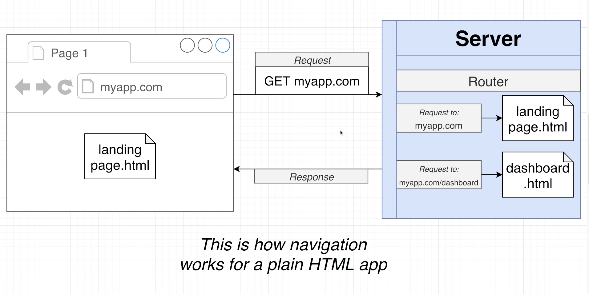
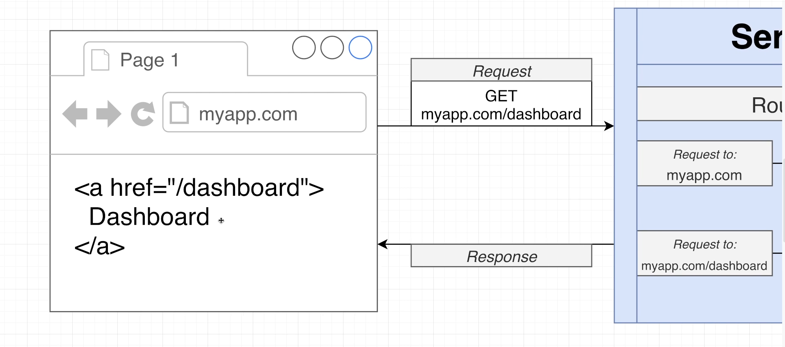
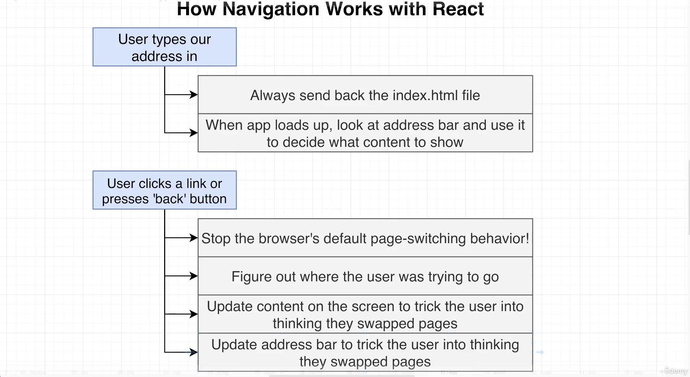
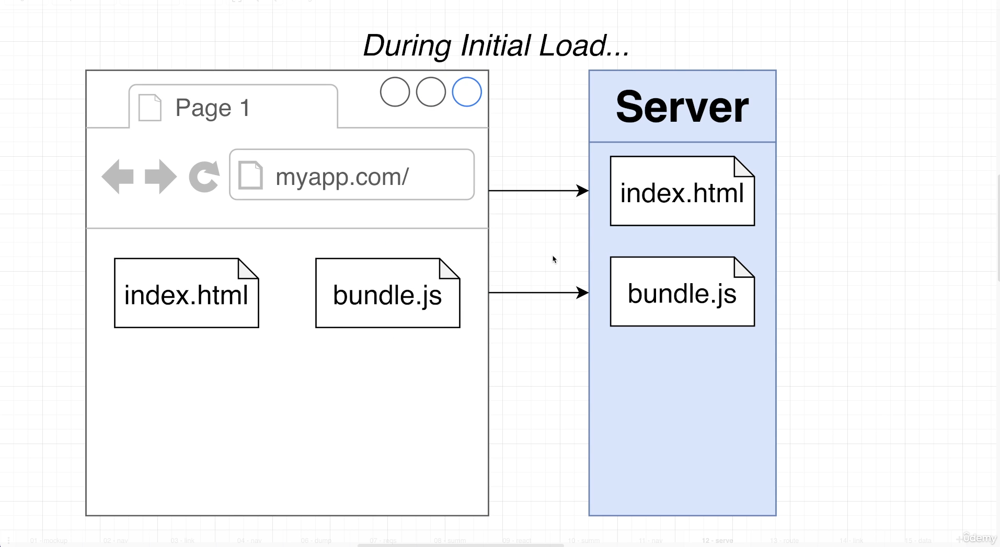
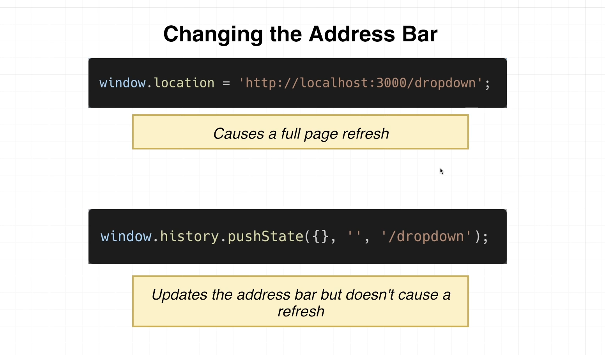
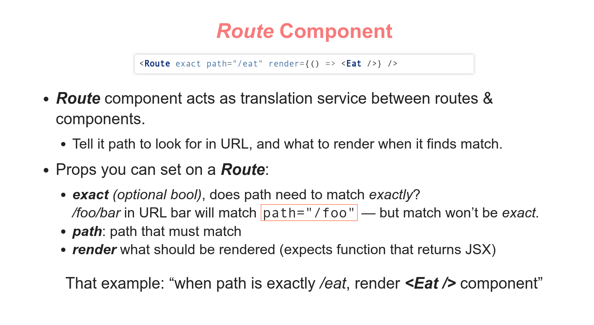
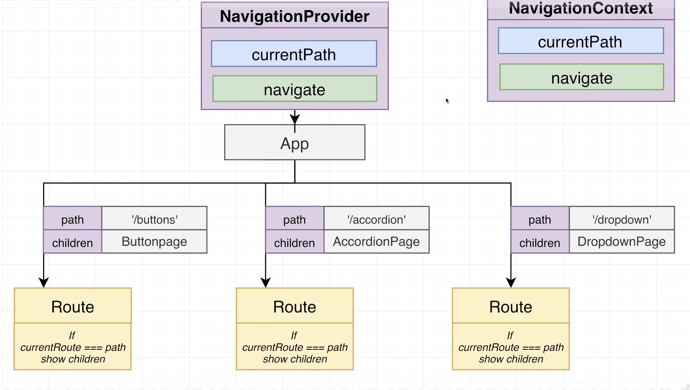
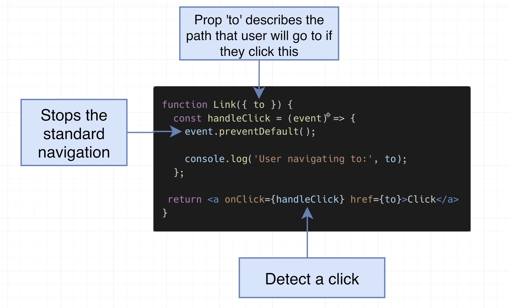
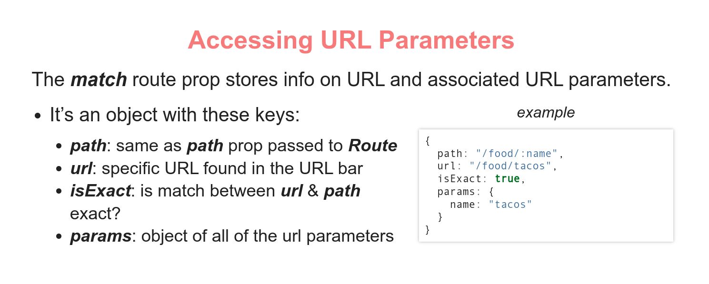

# INDEX

- [INDEX](#index)
  - [Router](#router)
    - [Server-Side Routing (Traditional Routing)](#server-side-routing-traditional-routing)
    - [Client Side Routing](#client-side-routing)
  - [Set Up](#set-up)
  - [Router Components](#router-components)
    - [`Route` Component](#route-component)
      - [Nested Routes with `outlet` (Index Pages)](#nested-routes-with-outlet-index-pages)
    - [`Switch` Component](#switch-component)
    - [`Redirect` component](#redirect-component)
    - [`Link` component](#link-component)
      - [How does `Link` work](#how-does-link-work)
    - [`NavLink` Component](#navlink-component)
  - [Dynamic Routes (Params)](#dynamic-routes-params)
  - [Programmatically navigation](#programmatically-navigation)
    - [Accessing the page's url](#accessing-the-pages-url)
  - [Protected Routes (Guarding Routes)](#protected-routes-guarding-routes)
    - [Steps (Implementation)](#steps-implementation)
  - [Prompt](#prompt)

---

## Router

> Concept of Routing, is how to determine what pages to render based on the URL

React Router turns React projects into single-page applications. It does this by providing a number of specialized components that manage the creation of links, manage the app's URL, provide transitions when navigating between different URL locations, and so much more.

### Server-Side Routing (Traditional Routing)

- Server decides what HTML to return based on URL request, and the entire page refreshes
  
- clicking a `<a>` link causes browser to request a new page & replace the entire DOM
  
  - The standard browser behavior when the browser loads a new HTML document is that "all existing javascript code **is dumped** and we will lose access to it"

---

### Client Side Routing

- **Fake CSR**:
  

  - We can actually create something closer to a client-side-routing using conditions and preventing-default-behavior on `<a>` links, and render components based on state condition, But this will not actually be routing, as we won't be able to track **history** (go back and forward...) and other more features
    

- **Real CSR** -> **React Router**

  - Here, all the HTML, Javascript, and CSS is loaded initially, and then the browser only loads the data that is needed for the page (the functionality is handled by javascript)
    

  - sites that exclusively use client-side routing are **single-page-applications SPA**
    
  - It handles mapping between URL bar and the content which the user sees via browser rather than via server
    
  - here, we use Javascript to manipulate the URL bar with a web-api called **History**
    
    - also `pushState` method handles **backward button** in the browser (with maintaining the state and prevent refreshing) using the `popstate` event in `window.history`
  - The best thing is that the javascript environment is no longer being reset with navigation!
  -

- **SSR** vs **CSR**
  

---

## Set Up

- first install it

  ```bash
  npm install react-router-dom@6
  ```

- in `index.js` :

  ```js
  import { BrowserRouter } from 'react-router-dom';

  // then wrap the app in a BrowserRouter fragment
  // You may also use different types of router like "hashRouter"

  root.render(
    <React.StrictMode>
      <BrowserRouter>
        <App />
      </BrowserRouter>
    </React.StrictMode>
  );
  ```

- now in `App.js`

  - we now have access to router components and functionalities because the `App` component is wrapped within `<BrowserRouter></BrowserRouter>`

  ```js
  import { Route, Routes } from 'react-router-dom';

  function App() {
    return (
      // rapping the component in a routes and the route specify the endpoint
      <Routes>
        <Route path='/home' element={<Home />} />
        // means that when route matches "/home" -> render the Home component
      </Routes>
    );
  }
  ```

---

## Router Components

### `Route` Component




- **`exact`** matches the exact-full-path **ONLY IN VERSION 5**

  - not needed in v6

- one of its props is the prop responsible for referencing the component for the specified route, and this prop is `render=""` or `component=""`, and there's a difference between them:

  - `component`: When you use `component` prop, the component is **instantiated** per every call of Route#render. It means that, for your component that you pass to `component` prop of `Route`, `constructor`, `componentWillMount`, and `componentDidMount` will be executed every time the route is rendered.

    ```js
    // So when you have it like:
    <Route path="/:locale/store" component={Store} />
    // you can think of it as:
    <Route path="/:locale/store">
      <Store />
    </Route>
    ```

  - `render`: if you use `render` prop, the component is **evaluated** on every Route#render. Remember that every component is a function? This function will be executed as is, without any lifecycle methods.

    ```js
    // So when you have it like:
    <Route path="/:locale/store" render={Store} />
    // you can think of it as:
    <Route path="/:locale/store">
      {Store()}
    </Route>
    ```

  - Also, the source code explains it very good:

    ```js
    if (component) return match ? React.createElement(component, props) : null;

    if (render) return match ? render(props) : null;
    ```

  - Also, when you want to pass props to the component use `render` as it accepts a function unlike `component`

---

#### Nested Routes with `outlet` (Index Pages)

if you want nested Routes, we need to identify where the (nested-route corresponding component) will be using the **`<Outlet/>` component**:


```js
// in `app.js`
function App() {
  return (
    // now we want to tell the parent component (Home) where we want the react-router-dom to render the nested-matching-element (Shop) --> using "Outlet component" from react-router-dom
    <Routes>
      <Route path='/home' element={<Home />}>
        <Route path='shop' element={<Shop />} />
      </Route>
    </Routes>
  );
}
```

```js
function Home() {
  // in `Home.jsx`
  return (
    <div>
      <Outlet />
      <h1>this is home page</h1>
    </div>
  );
}
```

- `index`

  - It determines if the route is an index(root) route. Index routes render into their parent's Outlet at their parent's URL (like a default child route).

    ```jsx
    <Route path='/teams' element={<Teams />}>
      <Route index element={<TeamsIndex />} /> // will be automatically in the <Outlet />
      <Route path=':teamId' element={<Team />} />
    </Route>
    ```

---

### `Switch` Component

- `<Switch>` **ONLY IN OLD VERSION 5** -> It's **`<Routes>`** in version 6

- It Renders the first child `<Route>` or `<Redirect>` that matches the location.
- It makes sure that only one component from components with matching routes are displayed (limit only one match from a group of routes)
  - > as routes match partially as well as total match, **`/`** & **`/home`** will be fired when requesting `/home`
- It stops searching once it finds a match -> it displays the first match it finds, so the order is important or you can use **`exact`**

```js
import { Route, Switch } from 'react-router';

<Switch>
  <Route exact path='/'>
    <Home />
  </Route>
  <Route path='/about'>
    <About />
  </Route>
</Switch>;
```

- **Including a 404 route**:

  - You can make use of the order of routes in a `<Switch>` and put the 404 route last

    ```js
    return (
      <Switch>
        <Route exact path='/blog' render={() => <BlogHome />} />
        <Route exact path='/' render={() => <Home />} />
        <Route render={() => <NotFound />} />
      </Switch>
    );
    ```

  - OR: to make a "not found page (404)" make: `path="*"`

---

### `Redirect` component

- `<Redirect>` **ONLY IN VERSION 5**: navigate to a new location. The new location will override the current location
  - for **V6**: we use `<Navigate>`

```js
<Redirect to="/somewhere/else" />

<Navigate to="/somewhere/else" />

// Or
<Redirect
  to={{
    pathname: "/login",
    search: "?utm=your+face",
    state: { referrer: currentLocation }
  }}
/>

```

---

### `Link` component

- when you want to change the page's URL, we don't use `<a>` as it will make the page **reload**(make a new request)
- Instead we use `<Link>` component from `react-router-dom`
- **Notes**:
  - `<Link>` can be represented as `<a>` in **css**
  - clicking on `<link>` doesn't issue a GET request, as javascript intercepts click and does client-side-routing

```js
import { Link } from 'react-router-dom';

<Link to='/about'>About Us</Link>;
```

#### How does `Link` work



---

### `NavLink` Component

- `<NavLink>` is just like `link`, with one additional feature:

  - If at page that link would go to, the `<a>` gets a CSS class of **`active`**
  - This lets you stylize links to "page you are already at" using the `activeStyle` (in-line) or `activeClassName` props

- You should include an `exact` prop here as well
- It's Very helpful for navigation menus

```jsx
import React, { Component } from 'react';
import { NavLink } from 'react-router-dom';
import './NavBar.css';

class NavBar extends Component {
  render() {
    const activeStyle = {
      fontWeight: 'bold',
      color: 'mediumorchid'
    };
    return (
      <nav>
        {/* VERSION 5 */}
        <NavLink exact to='/' activeStyle={activeStyle}>
          Home
        </NavLink>
        <NavLink exact to='/eat' activeStyle={activeStyle}>
          Eat
        </NavLink>
        <NavLink exact to='/drink' activeStyle={activeStyle}>
          Drink
        </NavLink>
        {/* OR */}
        <NavLink exact to='/drink' activeClassName='name_of_the_class'>
          Drink
        </NavLink>
      </nav>
    );
  }
}

// VERSION 6
<NavLink
  className={navData => (navData.isActive ? 'name_of_the_custom_active_class' : '')}
  to='/about'>
  About Us
</NavLink>;
```

---

## Dynamic Routes (Params)

- here we use query-parameters `/:param`

- **OLD WAY**: Here we use the `routeProps` and pass it as a prop to the component if you are using `render={()=> <Component/>}`, or just use `component={Component}` without passing anything

  ```js
  <Route path='/food/:name' render={routeProps => <Food {...routeProps} />} />
  ```

  

- **New Way**

  - to access this **param** we use `useParams` hook

  ```jsx
  <Route path='/product/:productId' component={Product} />
  ```

  ```js
  // in Product.component.jsx
  import { useParams } from 'react-router-dom';

  const params = useParams();
  // or const {productId} = useParams()

  console.log(params.productId);
  ```

---

## Programmatically navigation

- **V5** it's done using `useHistory()` hook
- **V6** it's done using `useNavigate()` hook
- in the background, these hooks are used to get the return value of `useContext(NavigationContext)` which has the data for navigation, and we use the hooks to simplify our code from a lot of importing

- `history.replace` vs `history.push`:
  - in case of `push` - a new record is added in the history, and user can go back
  - in case of `replace` it deletes the last record and puts the new one. So if you will not use the go back
    - > Usually when redirecting from an invalid url

```js
import { useHistory } from 'react-router-dom';

const history = useHistory();

// ...in a handler-function
history.push('/home');

//-----------------------------//
// V6
const navigate = useNavigate();

// ...in a handler-function
navigate('/home', { push: true });
```

### Accessing the page's url

It's done using `useLocation()` hook

- usually used to access query-parameters

```js
import { useLocation } from 'react-router-dom';

const location = useLocation();

// for parameters
const queryParams = new URLSearchParameters(location.search);

const something = queryParams.get('wanted_param');
```

---

## Protected Routes (Guarding Routes)

Protected routes are a way to restrict access to certain parts of your web application based on user authentication or permissions. In this context, a protected route is a route that is only accessible by authenticated users or users with specific permissions.

### Steps (Implementation)

1. Create an `AuthContext`

   ```jsx
   import { createContext, useContext, useState } from 'react';

   const AuthContext = createContext();

   export const useAuth = () => useContext(AuthContext);

   export const AuthProvider = ({ children }) => {
     const [isAuthenticated, setIsAuthenticated] = useState(false);

     const login = () => setIsAuthenticated(true);
     const logout = () => setIsAuthenticated(false);

     const value = { isAuthenticated, login, logout };

     return <AuthContext.Provider value={value}>{children}</AuthContext.Provider>;
   };
   ```

2. Create a `ProtectedRoute` component

   ```jsx
   import { Route, Redirect } from 'react-router-dom';
   import { useAuth } from './AuthContext';

   const ProtectedRoute = ({ component: Component, ...rest }) => {
     const { isAuthenticated } = useAuth();

     return (
       <Route
         {...rest}
         render={props => {
           return isAuthenticated ? <Component {...props} /> : <Redirect to='/login' />;
         }}
       />
     );
   };

   export default ProtectedRoute;
   ```

3. Use `ProtectedRoute` in your routing

   ```jsx
   import { BrowserRouter as Router, Switch, Route } from 'react-router-dom';
   import ProtectedRoute from './ProtectedRoute';
   import { AuthProvider } from './AuthContext';

   const App = () => {
     return (
       <Router>
         <AuthProvider>
           <Switch>
             <Route path='/login' component={Login} />
             <ProtectedRoute path='/dashboard' component={Dashboard} />
           </Switch>
         </AuthProvider>
       </Router>
     );
   };

   export default App;
   ```

---

## Prompt

Used to prompt the user before navigating away from a page. When your application enters a state that should prevent the user from navigating away (like a form is half-filled out), render a `<Prompt>`.

- [Guide](https://v5.reactrouter.com/core/api/Prompt)

---
