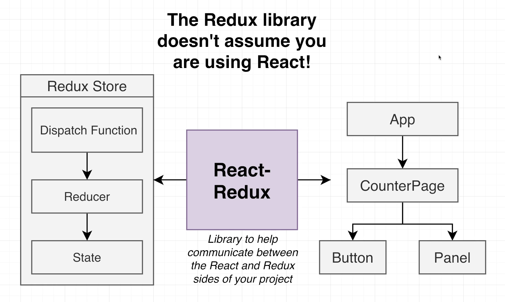
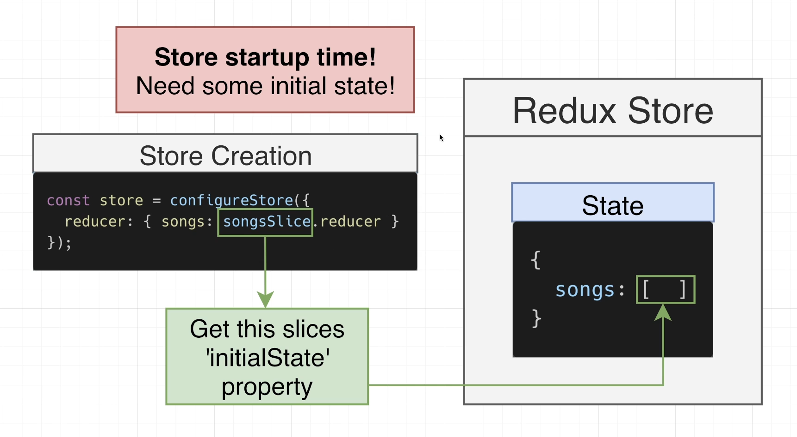

# INDEX

- [INDEX](#index)
  - [Redux](#redux)
    - [When to use Redux?](#when-to-use-redux)
    - [Redux Core Concept](#redux-core-concept)
    - [(`useContext` + `useReducer`) vs Redux](#usecontext--usereducer-vs-redux)
  - [Installation](#installation)
  - [Setup \& File Architecture](#setup--file-architecture)
    - [Connecting React to Redux](#connecting-react-to-redux)
    - [Creating (state, reducer, actions) in the store](#creating-state-reducer-actions-in-the-store)
    - [Dealing with multiple reducers \& slices](#dealing-with-multiple-reducers--slices)
    - [Accessing state from component](#accessing-state-from-component)
  - [Folder structure](#folder-structure)
  - [Store](#store)
    - [Store initial state (Slices)](#store-initial-state-slices)
    - [Action Flow](#action-flow)
    - [Action Creators](#action-creators)
    - [Selector Functions](#selector-functions)
  - [Redux Hooks](#redux-hooks)
    - [useSelector](#useselector)
    - [useDispatch()](#usedispatch)
  - [Redux Middleware](#redux-middleware)
    - [Redux Thunk](#redux-thunk)
    - [Redux Saga Middleware](#redux-saga-middleware)
    - [Saga vs Thunk](#saga-vs-thunk)
    - [Examples of MiddleWares from scratch (Not important)](#examples-of-middlewares-from-scratch-not-important)
  - [Redux in class components (OLD Way)](#redux-in-class-components-old-way)
  - [Redux in Typescript](#redux-in-typescript)
  - [Redux Libraries](#redux-libraries)
    - [Reselect Library](#reselect-library)
    - [Redux-persist](#redux-persist)
  - [Example (Not Important)](#example-not-important)
    - [store.js](#storejs)
    - [root-reducer.js](#root-reducerjs)
    - [user.types.js](#usertypesjs)
    - [user.selector.js](#userselectorjs)
    - [user.reducer.js](#userreducerjs)
    - [user.action.js](#useractionjs)
  - [Redux DevTools](#redux-devtools)
  - [Redux best practices](#redux-best-practices)

---

## Redux

It's a **state management system** for cross-component or app-wide state

- Redux is really:

  - A single store containing "global" state
  - Dispatching plain action-objects to the store when something happens in the app
  - Pure reducer functions looking at those actions and **returning immutably updated state**

- It's a standalone library, but easy to integrate with React apps using `react-redux` library
  - it can be used even with `Angular`, `Vue`, or `vanilla JS`
- All global state is stored in one globally accessible `store` which is easy to update using `actions` ( like `useReducer` )
- It's conceptually similar to using the ( context API + useReducer ) together
- We can use Redux in 2 ways:
  1. Classic Redux
  2. Redux Toolkit (recommended + modern way)

---

### When to use Redux?

- Historically, Redux was used in most React apps to handle global state. Today that has changed, because there're many alternatives.
- Many apps now don't need Redux anymore, unless they need **a lot of global UI state**

- **Redux use cases**:
  
  - `UI state` -> state that is only used by the UI and doesn't deal with remote requests or data fetching
  - `Remote state` -> state that is fetched from a remote server or fetched from a database
  - As many apps now use `remote state` and `UI state`, they don't need `Redux` anymore and use `React Query` or `SWR` instead

---

### Redux Core Concept

- How Rexux works:
  
  

- components subscribe to the store-data(state)
- components **Never directly manipulate** the store-data, instead we use `Reducer-function`
- There're **multiple** `reducer functions` to manage the state. Each `reducer function` is responsible for a **slice** of the state (reducer per application feature)
- If we want to change state in any way, We must call `dispatch`
  
  - this is a good thing as this makes us have a **central point of changing state** and it's easy to understand why state is changing from the `action` object
  - this is also not so great thing as we have to write a lot of boilerplate code just to make sure the reducer knows what to do!
  - To fix this we have 2 choices:
    

---

### (`useContext` + `useReducer`) vs Redux


- Redux is very similar to `useReducer`, but there's some differences:

  - `useReducer`
    
    
  - `Redux`:
    - here, we create a **separate object** called the redux-store which is separate from our React Application and outside of the hierarchy of our components
      
      
      
      

- `useContext` vs `Redux`

  - **Context + Reducers**
    
  - **Redux**
    
    - Here, the Redux structure depends on **singularity (single store and singular `dispatch`)** (reducer function for each state item), they are still functions that return objects that carry the state of the reducer
    - these reducers are combined into one reducer **(root reducer)** and from this `root-reducer` we will pass the state into all the components (passing the entire state object and not just the state for each reducer)
    - similarly the components can dispatch actions to any reducer that matches the type **as we have only one `dispatch` function**, and even the same action can update all reducers

- **When to use Context API or Redux?**
  
  - usually, you don't use `useContext` with `Redux` at the same time because data can be stored in redux and gets confusing
  - some people try to replace redux with `useReducer`, but they will need a lot of plugins to get similar result of redux

> **Note**: `Redux` & `useReducer` both use **Context API** to give different components access to the store within the application

---

## Installation

```sh
# Redux Core
npm install redux

# Complementary Packages
npm install react-redux
npm install --save-dev @redux-devtools/core
```

---

## Setup & File Architecture

### Connecting React to Redux

In `index.js`:

- we use `provider component` from `react-redux` & give it a `store prop` that can be used in the entire application

  

  ```js
  // in index.js
  import { Provider } from 'react-redux';

  ReactDOM.render(
    <Provider store={store}>
      <App />
    </Provider>,
    document.getElementById('root')
  );
  ```

---

### Creating (state, reducer, actions) in the store

- we create initial state for a business domain (ex: songs, movies, users, etc)
- we build the action-creators and the reducer-function for that state

  ```js
  // in store/songs/songs.reducer.js

  // State
  const initialState = [];

  // Reducer
  const songsReducer = (state = initialState, action) => {
    switch (action.type) {
      case 'ADD_SONG':
        return [...state, action.payload];
      default:
        return state;
    }
  };

  // Action Creator
  const addSong = song => {
    return {
      type: 'ADD_SONG',
      payload: song
    };
  };

  // create store 👷
  const store = createStore(songsReducer);
  ```

- If you're using `slice` from `redux-toolkit`:

  ```js
  // in slice
  initialState: [],
  reducers: {
    addSong(state, action){
      state.push(action.payload)
    }
  }
  ```

  - **Note:** If you want to mutate the state by resetting it (making it empty), You have to use the old state because of `Immer` and in this case we return the value we want the state to be:

    ```js
    reducers: {
      // ...
      resetSongs(state, action){
        state = []; // Won't Work
        // instead we do:
        return []; // Correct
      }
    }
    ```

---

### Dealing with multiple reducers & slices

In Redux, we can have multiple reducers, each one is responsible for a **slice** of the `state`

> **Slice:** a piece of state that is managed by a single reducer function

- we can use `combineReducers` function from `redux` to combine all reducers into one big reducer function
- When doing so, Redux differentiate between the different states for each reducer by using **keys** in the state object
- Each `key` indicates different `slice` of state that is managed by a different reducer function

  ```js
  // in store/root-reducer.js
  import { combineReducers } from 'redux';
  import { songsReducer } from './songs/songs.reducer';
  import { moviesReducer } from './movies/movies.reducer';

  export const rootReducer = combineReducers({
    songs: songsReducer, // songs is a slice of state that is managed by songsReducer
    movies: moviesReducer // movies is a slice of state that is managed by moviesReducer
  });

  // create store 👷
  const store = createStore(rootReducer);
  ```

---

### Accessing state from component

Steps:

1. import `useSelector` hook from `react-redux` in the component that needs to access some state
2. call the hook, passing in a selector function

   - selector function -> it's a function that takes the entire state object and returns the slice of the state that we want

3. Anytime state changes, the component will automatically re-render

```js
import { useSelector } from 'react-redux';
import { selectCurrentUser } from '../../store/user/user.selector';

const currentUser = useSelector(selectCurrentUser);
// same as:
const counter = useSelector(state => state.counter); // selecting specific slice of state
```

---

## Folder structure

- When using Redux, we have 2 options: **organize by function** or **organize by feature**

  1. **organize by function**
     
     
  2. **organize by feature**
     

- **Which to use?**
  
  

> We don't use the "feature approach" frequently with **Redux-toolkit** because of **"Circular Imports"**

- Notes:
  - From this, you will find that we only use `Redux` in the `store.js` and `index.js` files and we don't use it in the components or in the `slice` files

---

## Store


### Store initial state (Slices)

- **Slices:** Determining the shape (top level keys) of the store state property
  
- define some initial state
  
- Automatically create **reducers** and **action-types** instead of writing them manually with action-constants & `switch` statement in the reducer function
  
- inside the `slices` there's a `reducers` property which combines `mini reducer functions` into a big reducer function
  
  

  - we can view each of these functions here as being like an individual `case` statement inside of a larger `switch` statement

- it creates a set of **action creator** functions

  - the `action` type is created from the (slice name + name of reducer function)

    ```js
    const songsSlice = createSlice({
      name: 'song',
      initialState: [],
      reducers: {
        // "song" + "/" + "addSong" = "song/addSong" --> action type
        addSong(state, action) {
          // reducer function code
        }
      }
    });
    ```

  - for simplifying this and not to remember the types, Redux provides us with [Action Creators](#action-creators)

- **Note:** in each small reducer function, `state` argument is not the big state object in the store, instead It's the piece of state managed by this reducer
  
  
  
- here we mutate state because:
  - Redux Toolkit's `createReducer` and `createSlice` automatically use `Immer` internally to let you write simpler immutable update logic using "mutating" syntax. This helps simplify most reducer implementations.

---

### Action Flow


- This can make us convince the "Combined Songs reducer" to also care about actions from "Combined Movies reducer" **(Watch for other actions)**

So, to have common Action we have some options:


- **Option 3:** to watch for actions outside of our current combined-reducer function:

  ```js
  reducers: {
    // ...
  },
  extraReducers(builder){
    builder.addCase("movie/reset", (state, action) =>{
      return [];
    })
  }
  ```

- **Option 4:** Create a standalone action and get both slices to watch for it (this won't make us depend on other actions from other reducers):
  

  ```js
  import {createAction} from "@reduxjs/toolkit"
  const reset = createAction('app/reset')

  reducers: {
    // ...
  },
  extraReducers(builder){
    builder.addCase(reset, (state, action) =>{
      return [];
    })
  }
  ```

---

### Action Creators

It's a common pattern in Redux to have action creators that return action objects. Redux Toolkit allows us to write such functions that will automatically generate the action objects.

- It's a replacement of the old way of handling actions by creating constants for the action types and then creating action objects by hand

  ```js
  // old
  const ADD_SONG = 'song/addSong';
  store.dispatch({ type: ADD_SONG, payload: 'some song' });
  ```

- EX:

  ```js
  // instead of this
  store.dispatch({ type: 'deposit', payload: 10 });

  // we do this by creating a function that returns an action object
  function depositMoney(amount) {
    return {
      type: 'deposit',
      payload: amount
    };
  }
  store.dispatch(depositMoney(10));
  ```

- `createSlice` method provides us with action creators
  

- we can access action creator from: `yourSlice.actions.<reducerFunctionName>`

```js
store.dispatch(songsSlice.actions.addSongs('some song'));
// this dispatches action object like this: {type: "song/addSong", payload: "some song"}
```

---

### Selector Functions

It's a function that takes the entire state object and returns the slice of the state that we want

- It's when we need to do a little bit of computation on the state before we pass it into the component
- we define them in the `slice` file and export them like `action-creators`
- It's a convention to start with `get` or `select` in the function name

```js
// in cartSlice.js
// ...

export const getTotalCartPrice = state => state.cart.reduce((sum, item) => sum + item.price, 0);

// ------------------------------------- //

// using it
import { getTotalCartPrice } from './cartSlice';

const totalCartPrice = useSelector(getTotalCartPrice);
```

- we can use [Reselect Library](#reselect-library) library to create **memorized** selector-functions

---

## Redux Hooks

### useSelector

It's a Hook that you pass a **selector function** into it which selects the state that you want from the global state-object in `Redux`

- All it does is that it uses the **context** system to reach up to the **provider** at the very top of our component hierarchy and get access to the `state` object from the Redux store

```js
import { useSelector } from 'react-redux';

const currentUser = useSelector(state => state.user.currentUser);
```

---

### useDispatch()

It's a Hook that you pass a **selector function** into it which selects the state that you want from the global state-object in `Redux`

- All it does is that it uses the **context** system to reach up to the **provider** at the very top of our component hierarchy and get access to the `dispatch` function from the Redux store
- It dispatches generated actions to every reducer-function in `root-reducer`

```js
import { useDispatch } from 'react-redux';

const dispatch = useDispatch();

dispatch({ type: something, payload: {} });
```

> **Note:** when calling the `dispatch` function inside of `useEffect`, we know that the `dispatch` function won't change, so we can put in in the useEffect's dependency array

---

## Redux Middleware

As we can't do async operations in the `reducer function` (because it's a pure function), So, Redux `store` doesn't know anything about async logic. **It only knows how to synchronously dispatch actions**, update the state by calling the root `reducer function`, and notify the UI that something has changed.


- one solution is to make the `async` operations in the component and then dispatch the action to the store
  - this is not a good solution because we will have a lot of logic in the component and it will be hard to test **(Not ideal)**
- **Any asynchronous code has to happen outside the `reducer-function`**. -> So, we use `middleware` to do that
  

  - **Redux Middleware**: It's a function that gets called with every action we dispatch

- By using a middleware, we can do something with the `action` before that `action` gets into the `reducer`

  - This is the perfect place for us to do any `async` logic

- We can write middleware from scratch, but there're some libraries that help us with that like `redux-thunk` and `redux-saga`

  - Most popular is `redux-thunk`

- Options for data fetching in **Redux Toolkit**:

  1. Async Thunk Functions
  2. Redux Toolkit Query

---

### Redux Thunk

It's a middleware that allows us to receive `actions` that are function

- Instead of dispatching an `action` in the typical format of an object with a `type` and a `payload`, We pass a function that goes to the thunk and Redux takes this function and return a `dispatch` from it, so that we can dispatch new actions from the `thunk`
- The dispatched `action` from the thunk might hit another thunk or continue on into the Redux store (`reducers`)

> The key benefit here, is that now in Redux, we can abstract out some of our logic into the thunk, like **Async operations**

- It allows the application to fire actions, and these actions don't have to flow in the redux-default-data-flow **in a synchronous way** but instead it (read from the store or dispatch actions within the middleware) **in an asynchronous way**
  
- it receives `async-actions` in the form of `functions`
  

  - Redux takes the function and passes into it a `dispatch` as a parameter
  - now we can dispatch new actions in this Thunk, so that we can abstract some logic in the Thunk and so that Actions can be dispatched outside the component

- All `Redux Thunk` really does is: **allow actions to be passed as functions**
- **Creating an Async Thunk Steps:**

  1. Install `redux-thunk` package
  2. Apply the middleware to the store

     ```js
     // in store.js
     import { createStore, applyMiddleware } from 'redux';
     import thunk from 'redux-thunk';

     // we pass the middleware as a second argument to the createStore function
     const store = createStore(rootReducer, applyMiddleware(thunk));
     ```

  3. use the middleware in the `action-creator` function

     - We do this by returning a function that takes `dispatch` as a parameter
     - By returning a function, Redux will automatically pass:
       - `dispatch` as the first parameter to this function
       - `getState` as the second parameter to this function

     ```js
     // in accountSlice.js
     // ...

     export function deposit(amount, currency) {
       return async function (dispatch) {
         // we can do async operations here
         const res = await fetch(
           `https://api.frankfurter.app/latest?amount=${amount}&from=${currency}&to=USD`
         );
         const data = await res.json();
         const convertedAmount = data.rates.USD;

         // And then dispatch actions
         dispatch({ type: 'account/deposit', payload: convertedAmount });
       };
     }
     ```

- Note:

  - We can dispatch anywhere in the thunk function, not just at the end of the function after the async operation

    ```js
    export function deposit(amount, currency) {
      return async function (dispatch) {
        dispatch({ type: 'account/loading' });
        // fetching logic (Async operation)
        dispatch({ type: 'account/deposit', payload: convertedAmount });
        dispatch({ type: 'account/loaded' });
      };
    }
    ```

---

### Redux Saga Middleware

It's an intuitive Redux **side-effect manager**.

- like when a dispatch with type `startFetching`, we do a side-effect of fetching-logic
  - It's like event listener and callback function

In most middlewares, actions hit `middleware` before they hit the `reducer`, **But** Saga is different -> the actions will hit the reducer first before moving to the saga **(after the reducers have updated**)

- when actions hit the saga, it will respond to these actions and perform (business-logic, async-requests,..)
  

- **NOTE**: Actions fired by sagas can trigger another sagas:

  - Actions triggered by sagas can also flow through the saga again

- Saga uses [Generator Functions](https://javascript.info/generators)
  
  - instead of `await`, use `yield`
  - instead of `dispatch`, use `put`

Look at the **Example Usage** [here](https://redux-saga.js.org/docs/introduction/GettingStarted)

---

### Saga vs Thunk


---

### Examples of MiddleWares from scratch (Not important)

```js
import { client } from '../api/client';

const fetchTodosMiddleware = storeAPI => next => action => {
  if (action.type === 'todos/fetchTodos') {
    // Make an API call to fetch todos from the server
    client.get('todos').then(todos => {
      // Dispatch an action with the todos we received
      storeAPI.dispatch({ type: 'todos/todosLoaded', payload: todos });
    });
  }

  // The next step: going to the reducer-function
  return next(action);
};

//  writing a middleware that let us pass a function to dispatch, instead of an action object
const asyncFunctionMiddleware = storeAPI => next => action => {
  // If the "action" is actually a function instead...
  if (typeof action === 'function') {
    // then call the function and pass `dispatch` and `getState` as arguments
    return action(storeAPI.dispatch, storeAPI.getState);
  }

  // Otherwise, it's a normal action - send it onwards
  return next(action);
};
```

---

## Redux in class components (OLD Way)

Before Hooks like `useSelector` & `useDispatch`, we used to use `connect` function from `react-redux` to connect the component to the store

- `connect` is a higher-order component that takes a component and returns a new component
  - `connect()` --> [Code](https://codesandbox.io/s/r1kqd?file=/src/App.js:591-600)
- It works with `mapStateToProps` and `mapDispatchToProps` functions
  - `mapStateToProps` -> it's a function that gets the `state` object from the store and returns an object that contains the props that we want to pass to the component
  - `mapDispatchToProps` -> it's a function that gets the `dispatch` function from the store and returns an object that contains the props that we want to pass to the component

```js
// in BalanceContainer.js
import Balance from './Balance';
import { connect } from 'react-redux';
import { deposit, withdraw } from './balance.actions'; // action creators

function mapStateToProps(state) {
  return {
    balance: state.balance
  };
}

function mapDispatchToProps(dispatch) {
  return {
    deposit: amount => dispatch(deposit(amount)),
    withdraw: amount => dispatch(withdraw(amount))
  };
}

// connect() returns a new component that is connected to the store
// old component -> Balance
// new component -> BalanceContainer
export default connect(mapStateToProps, mapDispatchToProps)(Balance);
```

---

## Redux in Typescript

Redux is written in TypeScript, so it's easy to use it with TypeScript

[Guide](https://github.com/piotrwitek/react-redux-typescript-guide)

---

## Redux Libraries

### Reselect Library

It's library for creating **memorized** selector-functions. Commonly used with Redux

> **Memorization:** is the process in which you cache the previous value of something so that if the input has not changed, then you just return back the same output (This works when you have a pure-function)

- Reselect exports a `createSelector API`, which generates memoized selector functions. createSelector accepts one or more "input" selectors, which extract values from arguments, and an "output" selector that receives the extracted values and should return a derived value.
- If the generated selector is called multiple times, the output will only be recalculated when the extracted values have changed.

it's like `pure function` -> as long as the input hasn't change, the output will be the same

```sh
npm i reselect
```

```js
// in categories.selector.js

import { createSelector } from 'reselect';

// creating a memoized (CASHED) version of selectCategories (This is what will run if nothing changed)
const selectCategoryReducer = state => state.categories;

// creating dependencies for the changed values
export const selectCategories = createSelector(
  [selectCategoryReducer],
  categoriesSlice => categoriesSlice.categories
);

// By this, we tell Redux: "As long as "selectCategories" doesn't change, Don't re-run this function"
export const selectCategoriesMap = createSelector([selectCategories], categories =>
  categories.reduce((acc, category) => {
    // acc is for 'accumulator'
    const { title, items } = category;
    acc[title.toLowerCase()] = items;
    return acc;
  }, {})
);
```

---

### Redux-persist

It allows us to persist the reducer function value

[Guide](https://dev.to/dawnind/persist-redux-state-with-redux-persist-3k0d)

When we refresh page in a web-app, the state always resets back to the initial values which in not a good thing when you try to build some large web-app like e-commerce.

We can manually do the state persistent using the native JavaScript `localStorage.setItem()` method but honestly we will have to write everything from start and we have to maintain the structure of the state.

- `redux-persist` helps us to persist the state after page refresh.

- Every app needs to decide how many levels of state they want to "merge". The default is 1 level.

```sh
npm i redux-persist
```

```js
// Store.js

import { createStore } from 'redux';
import { persistStore, persistReducer } from 'redux-persist';
import storage from 'redux-persist/lib/storage'; // defaults to localStorage for web

import rootReducer from './reducers';

const persistConfig = {
  key: 'root',
  storage
};

const persistedReducer = persistReducer(persistConfig, rootReducer);

export default () => {
  let store = createStore(persistedReducer);
  let persistor = persistStore(store);
  return { store, persistor };
};
```

- wrap your root component with PersistGate. This delays the rendering of your app's UI until your persisted state has been retrieved and saved to redux.

  ```js
  import { PersistGate } from 'redux-persist/integration/react';

  // ... normal setup, create store and persistor, import components etc.

  const App = () => {
    return (
      <Provider store={store}>
        <PersistGate loading={null} persistor={persistor}>
          <RootComponent />
        </PersistGate>
      </Provider>
    );
  };
  ```

---

## Example (Not Important)

### store.js

- in order to use middlewares, we need to generate a compose using `compose` function from redux
  - Middleware is passed as a third argument to the `createStore` function
    - this method became deprecated in Redux, so that we can use `configureStore` function from `redux-toolkit` instead

```js
import { compose, createStore, applyMiddleware } from 'redux';
import logger from 'redux-logger';

import { rootReducer } from './root-reducer';

// they run before actions hit the reducers
const middleWares = [process.env.NODE_ENV === 'development' && logger].filter(Boolean); // run the logger-middleware only in dev-mode

// Generate composed enhancers that apply middlewares
const composedEnhancers = compose(applyMiddleware(...middleWares));

// create a redux-store that holds the complete state-tree of the app
// createStore(reducer, [preloadedState], [enhancer])
export const store = createStore(rootReducer, undefined, composedEnhancers);

// Not, we can use the `store` to dispatch actions to the reducer
```

---

### root-reducer.js

```js
import { combineReducers } from 'redux'; // to create final reducer that combine multiple reducer

import { userReducer } from './user/user.reducer';

// here we pass an object that has key of reducer's slice Name - value of function itself
export const rootReducer = combineReducers({
  user: userReducer
});
```

---

### user.types.js

```js
export const USER_ACTION_TYPES = {
  SET_CURRENT_USER: 'SET_CURRENT_USER'
};
```

---

### user.selector.js

- `useSelector()`: it takes a `function` that selects the part that we want from the state-object
  - it runs every time that the state object has updated in the root reducer, but it only re-renders the (component it's in) if the return-value of the selector-function is different
  - **Note:** in order to prevent this re-run of `useSelector`, we can use [Reselect library](#reselect-library)

```js
export const selectCurrentUser = state => state.user.curr;
```

this exported function will be called by the `useSelector() Hook`

---

### user.reducer.js

**Notes**:

- in the reducer, you should **never mutate the previous state**, **You must always return new state-object** as it's a **Reference-Type**, so do it for memory-management and so that you don't get unwanted side-effects
- You have to return something and ideally, it should be the unchanged state if there's nothing you need to do to it.
- Prefer flat objects, so that you won't accidentally do a shallow clone of the previous state

```js
import { USER_ACTION_TYPES } from './user.types';

// it's better to declare the initial state here instead of in createStore function so that this initial-state is only for this reducer-function
export const USER_INITIAL_STATE = {
  currentUser: null
};

// here we need to manually-provide the state with initial state as it doesn't have access to the useReduce-Hook & in the beginning the (previous state is undefined)
export const userReducer = (state = USER_INITIAL_STATE, action = {}) => {
  const { type, payload } = action;

  switch (type) {
    case USER_ACTION_TYPES.SET_CURRENT_USER:
      return { ...state, currentUser: payload }; // return the object but modify the currentUser
    default:
      return state; // here we don't return an error, instead -> we return the (current state-object) as this means that the action is not for this particular reducer
    // the object is the same in memory, so it won't result reRendering
  }
};
```

---

### user.action.js

```js
import { createAction } from '../../utils/reducer.utils';
import { USER_ACTION_TYPES } from './user.types';

// this function creates an action that will be dispatched from root-reducer
export const setCurrentUser = user => createAction(USER_ACTION_TYPES.SET_CURRENT_USER, user);
```

---

## Redux DevTools

- It's a browser extension that allows us to see the state of the store at any point in time
- It also allows us to see the `actions` that are being dispatched to the store
  

  - We can `jump` to any point in time and see the state of the store at that point
  - We can manually dispatch actions to the store in the `dispatch` tab

- To use it:

  1. we need to install `redux-devtools-extension` package

     ```sh
     npm i redux-devtools-extension
     ```

  2. we need to apply the `redux-devtools-extension` as an `enhancer` to the `createStore` function

  ```js
  import { composeWithDevTools } from 'redux-devtools-extension';
  // ...
  const composedEnhancers = composeWithDevTools(applyMiddleware(...middleWares));
  const store = createStore(rootReducer, composedEnhancers);
  ```

---

## Redux best practices

- Don't use `Redux` for everything, use it only for the state that needs to be shared between multiple components
- Don't connect `input` element directly to the store, instead use `local state` and `onChange` event to update the store
